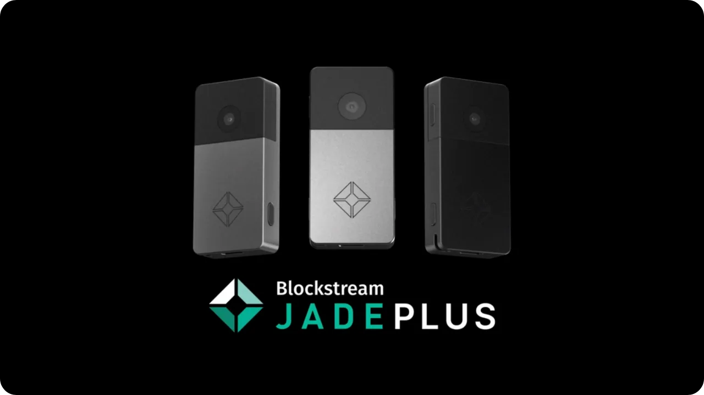

Jade Plus adalah dompet perangkat keras khusus Bitcoin yang dibuat oleh Blockstream. Dompet ini merupakan penerus Jade klasik, dengan peningkatan perangkat lunak, lebih banyak fitur, dan desain ergonomis yang lebih nyaman dipakai. Versi barunya hadir dengan layar LCD 1,9 inci yang keren banget, menampilkan warna yang lebih luas dibanding versi sebelumnya. Tombol dan navigasi menunya juga udah dioptimalkan biar makin mudah digunakan.

Jade Plus bisa kamu pakai dengan beberapa cara: lewat kabel USB-C, dalam mode Air-Gap pakai kartu microSD (butuh adaptor), lewat Bluetooth, atau bahkan dengan menukarkan kode QR berkat kamera bawaan. Dompet perangkat keras ini juga punya baterai sendiri.

Dompet ini dijual mulai dari $149,99 untuk versi hitam standar, dan bisa naik sekitar $20 untuk versi *Genesis Grey* atau *Lunar Silver.* Karena itu, Jade Plus jadi pilihan yang menarik: punya fitur canggih sekelas dompet perangkat keras premium seperti Coldcard Q atau Passport V2, tapi harganya tetap terjangkau, mendekati model kelas menengah.

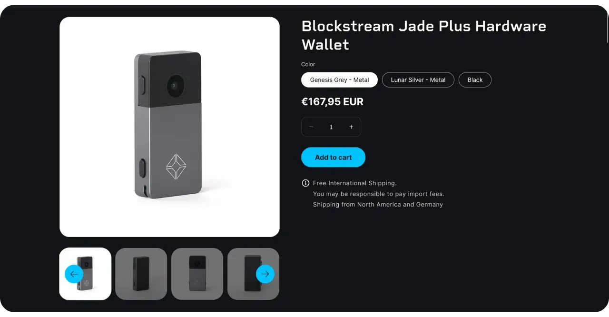

Jade Plus kompatibel dengan hampir semua perangkat lunak manajemen portofolio. Berikut ini ringkasan kompatibilitasnya saat artikel ini ditulis (Januari 2025):

| Desktop | Seluler | USB | Bluetooth | QR | JadeLink | Perangkat lunak manajemen

| ------------------- | ------- | ------ | --- | ----------- | --- | -------- |

| Blockstream Hijau | 🟢 | 🟢 | 🟢 | 🟢 (Seluler) | 🟢 | 🔴 |

liana | 🟢 | 🔴 | 🟢 | 🔴 | 🔴 | 🔴 |

burung pipit | 🟢 | 🔴 | 🟢 | 🔴 | 🟢 | 🟢 | 🟢 |

nunchuk | 🟢 | 🟢 | 🔴 | 🔴 | 🟢 | 🟢 | 🟢 |

| Momok | 🟢 | 🔴 | 🔴 | 🟢 | 🟢 | 🟢 |

| BlueWallet | 🟢 | 🟢 | 🔴 | 🔴 | 🟢 | 🟢 | 🟢 |

electrum | 🟢 | 🔴 | 🟢 | 🔴 | 🔴 | 🔴 | 🔴 |

| Penjaga Gawang | 🔴 | 🟢 | 🔴 | 🔴 | 🟢 | 🔴 |

Di tutorial ini, kita akan menyiapkan konfigurasi lanjutan Jade Plus dengan perangkat lunak Sparrow Wallet di desktop dalam mode kode QR. Konfigurasi ini cocok banget buat kamu yang sudah di level menengah atau berpengalaman. Tapi kalau kamu baru mulai dan pengin cara yang lebih simpel, coba deh lihat tutorial ini, di mana kita pakai Jade Plus bareng Green Wallet lewat koneksi Bluetooth:

https://planb.network/tutorials/wallet/hardware/jade-plus-green-873099a4-35ec-4be8-b31a-6e7cd6a41ec0

## Model keamanan Jade Plus

Jade Plus pakai model keamanan berbasis “elemen aman virtual” yang diwujudkan lewat sistem “blind oracle”. Secara sederhana, mekanisme ini menggabungkan PIN yang kamu pilih, rahasia yang disimpan di Jade, dan rahasia lain yang dipegang oleh oracle (server yang dikelola Blockstream), untuk membuat kunci AES-256 yang dibagi antara dua entitas. Saat proses inisialisasi, pertukaran ECDH digunakan untuk mengamankan komunikasi dengan oracle dan mengenkripsi seedphrase di dompet perangkat keras. Secara praktis, kalau kamu mau mengakses seed untuk menandatangani transaksi, kamu butuh akses ke:

- Perangkat Jade Plus itu sendiri;
- Ke PIN untuk membuka kunci perangkat ;
- Dan untuk rahasia peramal.

Keuntungan utama dari pendekatan ini adalah tidak adanya satu titik kegagalan di sisi perangkat keras. Kalau ada penyerang yang berhasil mendapatkan akses ke Jade kamu, dia tetap nggak bisa mengekstrak kuncinya tanpa juga mengompromikan oracle secara bersamaan. Model ini juga memungkinkan Jade Plus sepenuhnya bersifat open-source, tanpa perlu pakai elemen keamanan fisik seperti yang digunakan di Ledger, misalnya.

Kelemahannya, penggunaan Jade Plus bergantung pada oracle yang dikelola Blockstream. Kalau oracle ini sedang tidak bisa diakses, kamu nggak bisa langsung menggunakan dompet perangkat keras dengan PIN. Tapi tenang aja, bitcoin kamu tetap aman, karena bisa dipulihkan dengan seedphrase yang kamu miliki. Kamu cukup memasukkannya ke Jade Plus dalam mode stateless. Selain itu, kamu juga bisa mengatasi ketergantungan ini dengan mengonfigurasi dan mengelola server oracle kamu sendiri.

Alternatif lain untuk mengelola seed kamu adalah dengan tidak mendaftarkannya di Jade Plus. Dalam kasus ini, Jade hanya berfungsi sebagai perangkat penandatanganan. Saat inisialisasi, selain menyimpan seedphrase biasa berupa kata-kata, kamu juga bisa menyimpannya sebagai kode QR buatan sendiri. Dengan begitu, setiap kali kamu mau menggunakan dompet, kamu cukup memindai seed dari kamera Jade. Ini bisa jadi opsi menarik buat pengguna tingkat lanjut, tergantung strategi keamanan kamu. Tapi kamu harus ekstra hati-hati dalam menyimpan dan melindungi seed-nya, karena meskipun dalam bentuk kode QR, siapa pun yang mendapatkannya bisa mencuri dana kamu. Opsi ini akan kita bahas di tutorial ini, tapi sifatnya opsional.

## Membuka kemasan Jade Plus

Saat kamu menerima Jade Plus, pastikan kotak dan segelnya masih dalam kondisi baik supaya kamu tahu kalau paketnya belum pernah dibuka.

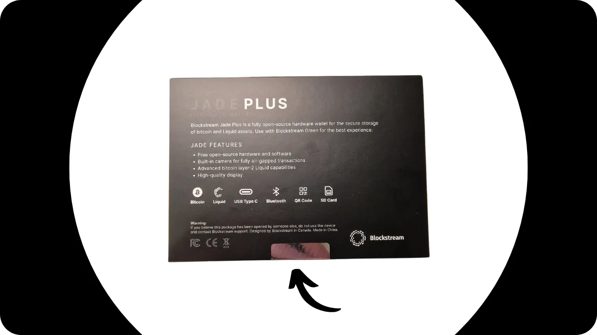

Di dalam kotak Anda akan menemukan :

- Le Jade Plus;
- Kabel USB-C;
- Kartu untuk merekam frasa mnemonik kamu sebagai kata-kata atau sebagai "*CompactSeedQR*";
- Beberapa petunjuk penggunaan ;
- Sebuah kabel;
- Beberapa stiker.

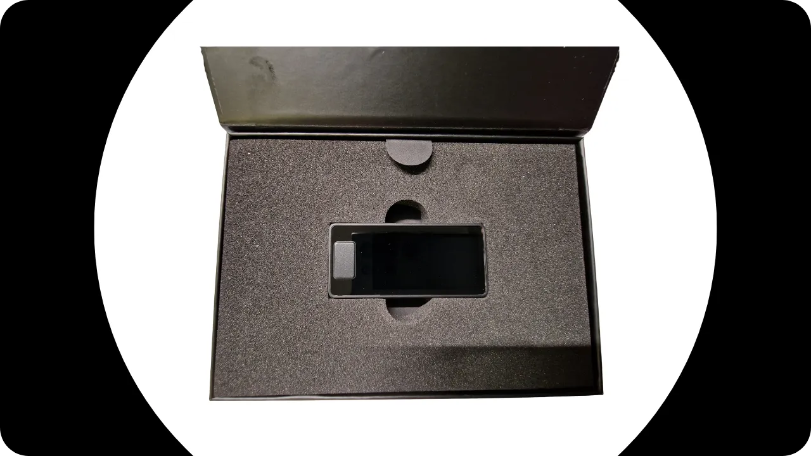

Perangkat ini memiliki 4 tombol navigasi:

- Tombol di kanan bawah menyalakan Jade;
- Tombol besar pada bagian depan perangkat digunakan untuk memilih item;
- Dua tombol kecil di bagian atas memungkinkanmu menavigasi ke kiri dan ke kanan;
- Kamu juga bisa memilih item dengan mengklik secara bersamaan pada dua tombol di bagian atas perangkat.

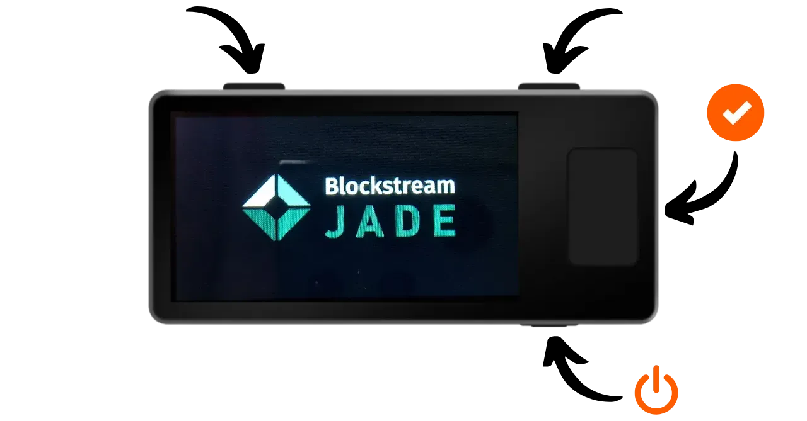

## Menyiapkan dompet Bitcoin baru

Klik pada tombol mulai.

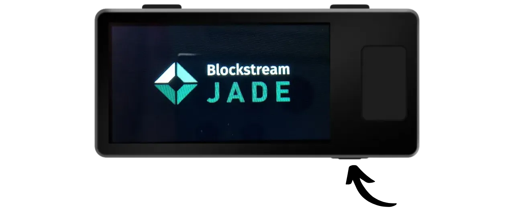

Klik "*Setup Jade*".

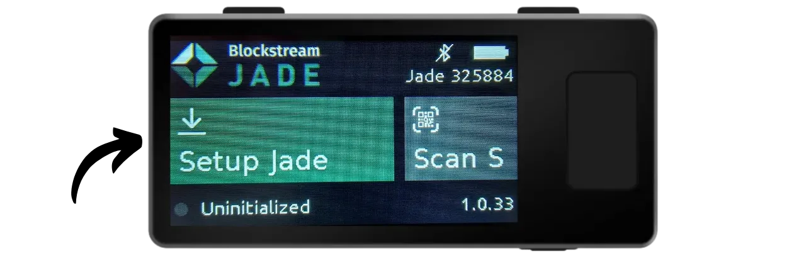

Pilih "Pengaturan Lanjutan*".

Kemudian klik "*Buat Dompet Baru*" untuk membuat seed baru. Kamu bisa memilih antara frasa mnemonik 12 atau 24 kata. Keamanan dompet tetap setara dengan kedua opsi tersebut, jadi mungkin akan lebih mudah untuk memilih opsi yang paling sederhana untuk disimpan, yaitu 12 kata.

Klik tombol "*Lanjutkan*" untuk menampilkan frasa pemulihan baru.

Jade Plus kamu akan menampilkan seedphrase berisi 12 kata. **Seedphrase ini memberi kamu akses penuh ke semua bitcoin yang kamu miliki. Siapa pun yang tahu 12 kata ini bisa mencuri dana kamu, bahkan tanpa perlu menyentuh Jade Plus kamu.** Seedphrase ini juga bisa kamu pakai untuk memulihkan akses ke bitcoin kalau Jade kamu hilang, dicuri, atau rusak. Karena itu, sangat penting untuk menyimpannya dengan hati-hati dan menaruhnya di tempat yang benar-benar aman.

Kamu bisa menuliskannya di kartu yang disertakan di dalam kotak, atau kalau mau keamanan ekstra, aku saranin kamu ukir di pelat baja tahan karat supaya tetap terlindungi dari risiko seperti kebakaran, banjir, atau keruntuhan.

Untuk info lebih lanjut tentang cara yang benar menyimpan dan mengelola seedphrase kamu, aku sangat nyaranin kamu ikut tutorial lainnya, terutama kalau kamu masih pemula:

https://planb.network/tutorials/wallet/backup/backup-mnemonic-22c0ddfa-fb9f-4e3a-96f9-46e2a7954270

Tentu saja, kamu tidak boleh membagikan kata-kata ini di internet seperti yang aku tunjukkan dalam tutorial ini. Portofolio contoh ini hanya dipakai di Testnet dan akan dihapus saat tutorial selesai.

Klik panah di sebelah kanan layar untuk menampilkan kata-kata berikut.

Setelah kamu menyimpan seedphrase, Jade Plus akan memintamu untuk mengonfirmasinya. Pilih kata yang benar sesuai urutannya dengan tombol di bagian atas perangkat, lalu tekan tombol tengah untuk lanjut ke kata berikutnya..

Setelah itu, kamu punya dua opsi. Seperti yang udah dijelaskan di bagian pendahuluan, kamu bisa memilih untuk menyimpan seed langsung di perangkat dan menggunakan sistem proteksi *Virtual Secure Element* dari Blockstream untuk mengakses dompet kamu (Opsi 1), atau menyimpan seed dalam bentuk kode QR dan memindainya setiap kali kamu mau menggunakannya (Opsi 2).

Untuk Opsi 1, pilih "*Tidak*", dan untuk Opsi 2, pilih "*Ya*".

### Opsi 1: Buka Kunci PIN QR

Jika kamu telah memilih opsi 1 (CompactSeedQR: "*No*"), kamu bakal langsung dibawa ke pilihan metode koneksi. Dalam tutorial ini, kami ingin menggunakan perangkat dalam mode Celah Udara melalui pertukaran kode QR, jadi pilih "*QR*".

Klik "*Lanjutkan*".

Kode PIN digunakan untuk membuka kunci Jade kamu dan melindunginya dari akses fisik yang nggak sah. Kode PIN ini nggak terlibat dalam proses derivasi kunci kriptografi dompet kamu. Jadi, meskipun kamu lupa atau kehilangan PIN, kamu tetap bisa memulihkan akses ke bitcoin selama masih punya seedphrase 12 kata.

Sebaiknya pilih kode PIN yang benar-benar acak, dan simpan di tempat terpisah dari Jade kamu—misalnya di pengelola kata sandi.

Pilih PIN 6 digit di Jade kamu dengan menekan tombol kiri dan kanan untuk menggulir angka, lalu tekan tombol tengah untuk mengonfirmasi setiap digitnya.

Konfirmasikan PIN untuk kedua kalinya.

Seperti yang telah dijelaskan pada bagian pendahuluan, seed disimpan secara terenkripsi di Jade Plus. Untuk mendekripsinya, kamu harus menyediakan file :

- Kode PIN yang valid (yang baru saja kita siapkan);
- Rahasia oracle yang dikelola oleh Blockstream.

Di tutorial lanjutan ini kita akan pakai Sparrow Wallet untuk mengelola dompet Bitcoin kita. Tapi, tidak seperti Green Wallet dari Blockstream, Sparrow tidak punya akses ke oracle di server Blockstream. Karena itu, kita akan memakai situs web Blockstream untuk mengambil rahasia oracle setiap kali membuka kunci Jade Plus.

Kunjungi https://jadefw.blockstream.com/pinqr/index.html

Klik "*Mulai Buka Kunci QR*".

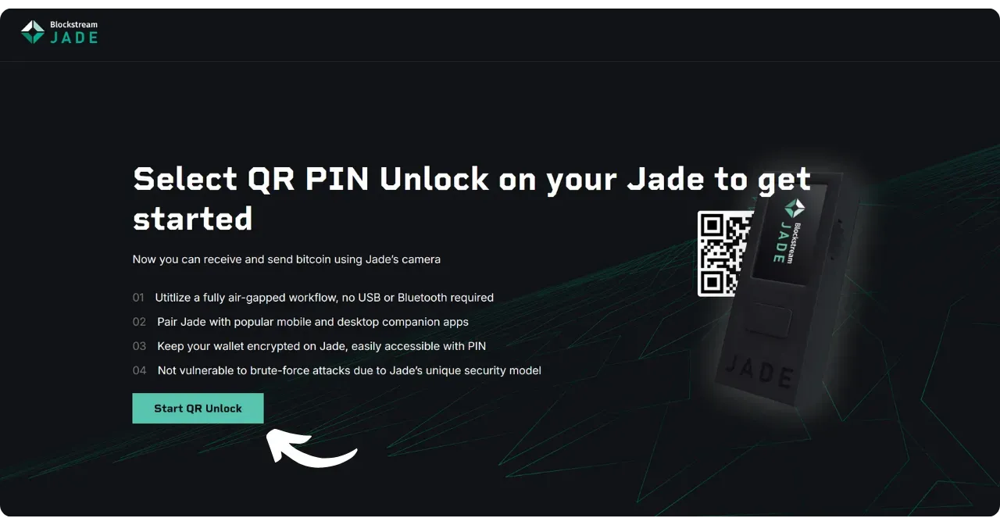

Klik "*Selesai*", karena telah memilih PIN di Jade Plus.

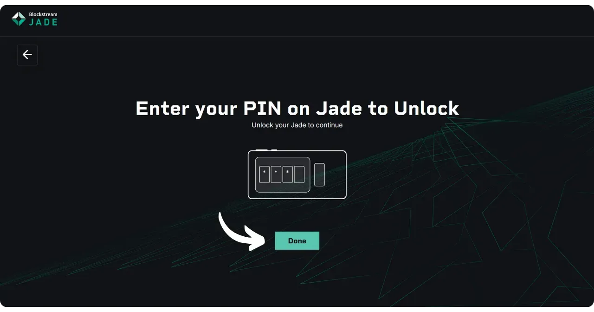

Gunakan kamera komputermu untuk memindai kode QR yang ditampilkan pada layar Jade.

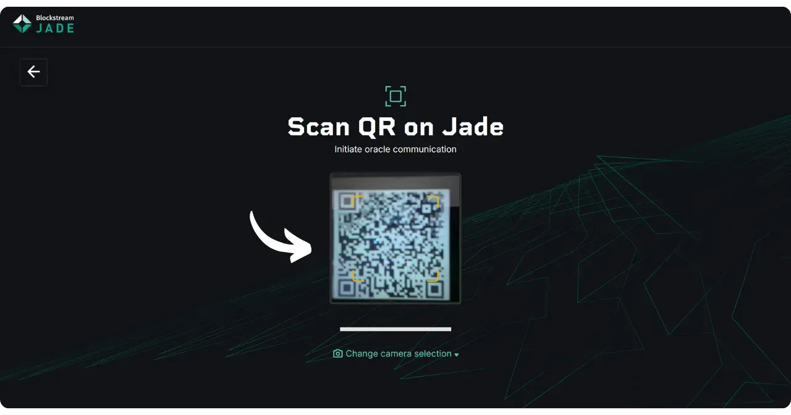

Konfirmasikan pada Jade untuk mengakses layar berikutnya.

Pindai kode QR yang sekarang terlihat di situs web untuk mendapatkan rahasia oracle.

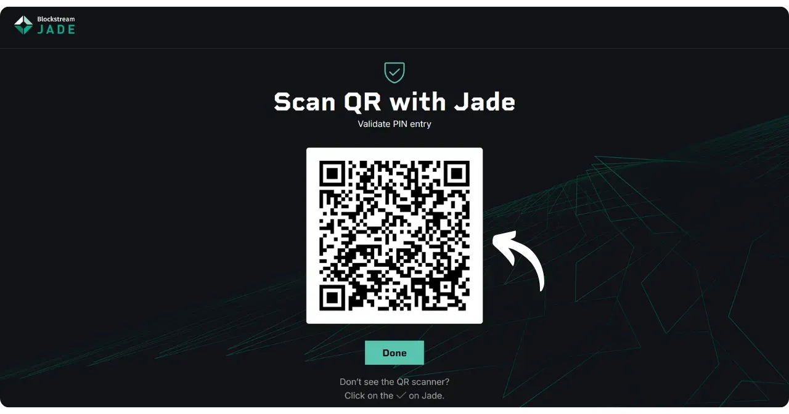

Sekarang portofolio telah dibuat, kamu bisa melanjutkan ke langkah berikutnya dan melewatkan sub-bagian "*Opsi 2: CompactSeedQR*".

Setiap kali memulai, klik "*QR Mode*".

Pilih "*Kunci PIN QR*".

Masukkan kode PIN.

Kemudian buka [situs web Blockstream] (https://jadefw.blockstream.com/pinqr/qrpin.html) untuk menukar kode QR dengan oracle.

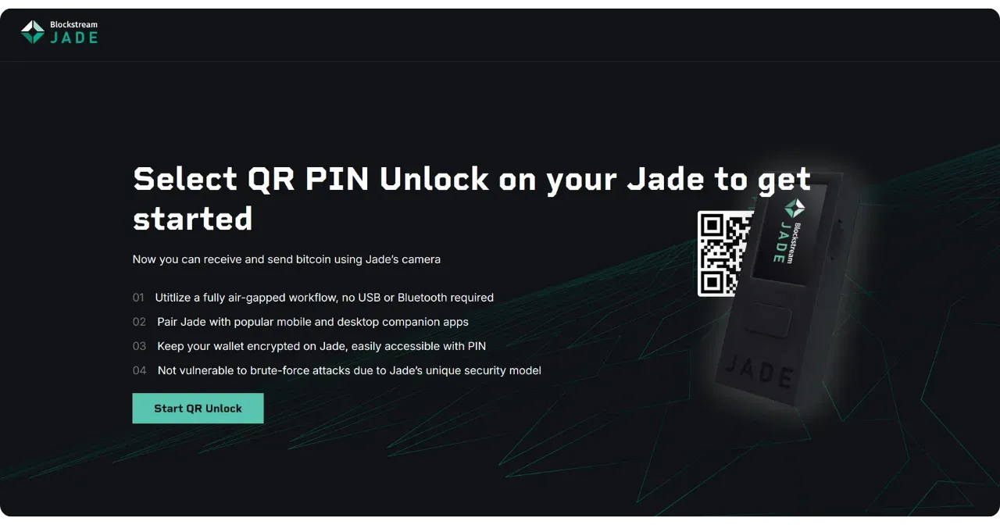

Sekarang, Jade-mu sekarang tidak terkunci.

### Opsi 2: CompactSeedQR

Kalau kamu telah memilih opsi 2 (CompactSeedQR: "*Ya*"), klik "*Ya*" sekali lagi.

Klik "*Mulai*".

Kamu bisa menggunakan basis kode QR yang disediakan dalam kotak Jade Plus. Pilih kotak yang sesuai, tergantung pada apakah kamu memilih kalimat 12 atau 24 kata. Kamu juga bisa [mencetak template dari situs web Blockstream] (https://help.blockstream.com/hc/article_attachments/41928319071769).

Jade Plus akan menampilkan setiap zona kode QR Anda.

Gunakan pena untuk mewarnai kotak-kotak tersebut dan mereproduksi seed sebagai kode QR. Lakukan dengan tepat untuk memastikan bahwa kamera Jade Plus dapat memindainya nanti. Gunakan tanda panah untuk berpindah ke area berikutnya.

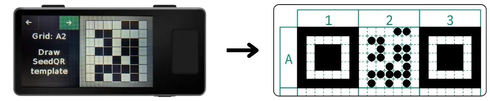

Setelah selesai, klik "*Selesai*".

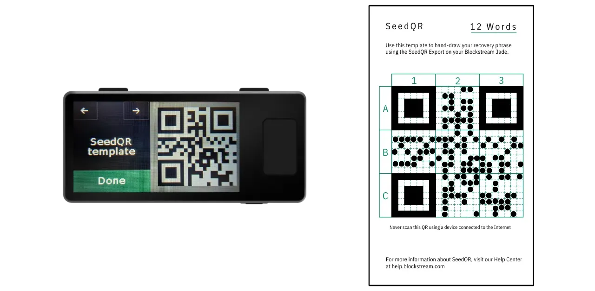

Pindai kode QR buatanmu sendiri dengan Jade Plus untuk memeriksa keabsahannya.

Jika cadangan kertas sudah benar, klik "*Lanjutkan*".

Dalam tutorial ini, kita akan menggunakan mode koneksi berdasarkan pemindaian kode QR secara eksklusif, jadi pilih "*QR*".

Kamu juga bisa menambahkan PIN sebagai tambahan pada cadangan CompactSeedQR kamu, seperti di opsi 1. Dengan begitu, ada dua cara untuk mengakses dompet kamu: lewat PIN dan sistem *Virtual Secure Element* dari Blockstream, atau lewat CompactSeedQR.

Kalau kamu memilih opsi PIN ganda, pilih *PIN* dan ikuti langkah yang sama seperti di opsi 1 untuk mengatur kode PIN kamu.

Tapi kalau kamu lebih suka lanjut hanya dengan CompactSeedQR, pilih *SeedQR.*

Setelah portofolio selesai dibuat, kamu bisa melanjutkan ke langkah berikutnya.

Setiap kali Anda memulai, klik tombol "*QR Mode*", lalu "*Scan SeedQR*".

Gunakan kamera perangkat untuk memindai seed yang kamu simpan sebagai kode QR.

Sekarang, Jade-mu sekarang tidak terkunci.

## Menambahkan kata sandi BIP39

Kata sandi BIP39 adalah kata sandi opsional yang bisa kamu tentukan sendiri dan ditambahkan ke seedphrase kamu untuk meningkatkan keamanan dompet. Dengan fitur ini aktif, akses ke dompet Bitcoin kamu akan membutuhkan dua hal: seedphrase dan kata sandi. Tanpa keduanya, dompet kamu nggak akan bisa dipulihkan.

Sebelum mengatur opsi ini di Jade Plus kamu, sangat disarankan untuk membaca artikel ini dulu supaya kamu benar-benar paham cara kerja kata sandi ini dan bisa menghindari kesalahan yang bisa bikin bitcoin kamu hilang:

https://planb.network/tutorials/wallet/backup/passphrase-a26a0220-806c-44b4-af14-bafdeb1adce7

Dengan Jade kamu masih dalam keadaan terkunci (karena kata sandi hanya bisa dimasukkan saat perangkat belum dibuka), masuk ke menu *Options.*

Pilih "*Frasa Sandi BIP39*".

Pada opsi "*Frequency*", kamu bisa memilih apakah Jade Plus akan memintamu untuk memasukkan kata sandi setiap kali dijalankan:

- "*Disabled*" menonaktifkan penggunaan kata sandi;
- "*Next Login Only*" akan mengharuskanmu untuk kembali ke menu ini untuk mengaktifkan permintaan kata sandi Anda pada saat memulai berikutnya. Opsi ini memungkinkanmu untuk tidak mengungkapkan penggunaannya;
- "*Selalu Tanyakan*" menyebabkan Jade secara sistematis meminta kata sandi setiap kali memulai, sehingga mengungkapkan bahwa dompet dilindungi oleh kata sandi.

Pilih opsi yang sesuai dengan strategi keamananmu. Secara pribadi, aku memilih "*Selalu Tanyakan*" sebagai contoh.

Setelah itu, kamu bisa memilih salah satu dari dua metode untuk memasukkan kata sandi kamu:

- "*Manual*: Papan ketik virtual memungkinkanmu memasukkan huruf (huruf besar dan kecil), angka, dan simbol, karakter demi karakter. Ini adalah metode standar untuk semua dompet perangkat keras;
- "*Daftar Kata*": Metode khusus yang dirancang oleh Blockstream untuk Jade, yang mempercepat pemasukan kata sandi dan meningkatkan entropinya. Selama input, sistem menyarankan kata-kata dari daftar BIP39, sehingga membuka kunci menjadi lebih mudah. Metode ini secara otomatis menghasilkan kalimat dengan menggabungkan kata-kata yang dipilih, dipisahkan oleh spasi (contoh: `kemampuan meninggalkan mampu`).
- 
Secara pribadi, aku nyaranin kamu pakai metode pertama, karena itu adalah standar yang bakal kamu temui di hampir semua jenis dompet lainnya.

Setelah itu, kamu bisa kembali ke layar beranda dan membuka kunci dompet seperti biasa, entah dengan kode PIN atau CompactSeedQR kamu (seperti yang ditunjukkan di atas). Lalu, kamu akan diminta untuk memasukkan kata sandi kamu.

Masukkan kata sandinya lewat keyboard di Jade, lalu pastikan kamu membuat satu atau beberapa salinan cadangan di media fisik seperti kertas atau logam. Sebagai contoh, di sini aku pakai kata sandi yang sangat lemah, tapi kamu harus memilih kata sandi yang kuat dan acak atau panjang, sulit ditebak, dan mengandung berbagai jenis karakter.

Jika kata sandi valid, konfirmasikan.

Perlu kamu ingat, kata sandi BIP39 peka terhadap huruf besar dan kecil, serta kesalahan pengetikan. Kalau kamu memasukkan kata sandi yang sedikit berbeda dari yang awalnya dikonfigurasi, Jade nggak akan menampilkan pesan error, tapi malah akan menghasilkan satu set kunci kriptografi yang berbeda dari dompet aslimu.

Karena itu, saat mengonfigurasi, penting banget untuk mencatat sidik jari kunci utamamu yang bisa dilihat di pojok kanan bawah layar. Misalnya, dengan kata sandi `PBN`, sidik jari kunci utamaku adalah `3AD1AE65`.

Setiap kali kamu membuka kunci Jade dengan kata sandi, pastikan sidik jarinya sama dengan yang kamu catat saat konfigurasi. Kalau sama, berarti kata sandi kamu benar dan kamu sedang mengakses dompet Bitcoin yang tepat. Kalau berbeda, berarti kamu masuk ke dompet yang salah dan perlu mencoba lagi—hati-hati jangan sampai salah ketik.

Sebelum kamu menerima bitcoin pertamamu di dompet, aku sangat nyaranin untuk melakukan tes pemulihan kosong terlebih dulu. Catat beberapa informasi referensi seperti xpub atau alamat penerima pertamamu, lalu hapus wallet kamu di Jade Plus saat masih kosong (`Options -> Device -> Factory Reset`). Setelah itu, coba pulihkan dompet kamu menggunakan cadangan kertas dari seedphrase dan kata sandi yang kamu buat. Periksa apakah informasi yang muncul setelah pemulihan cocok dengan yang kamu catat sebelumnya. Kalau cocok, berarti cadangan kertas kamu bisa diandalkan. Untuk tahu lebih lanjut cara melakukan tes pemulihan ini, cek tutorial lainnya:

https://planb.network/tutorials/wallet/backup/recovery-test-5a75db51-a6a1-4338-a02a-164a8d91b895

## Mengonfigurasi dompet di Dompet Sparrow

Di tutorial ini, aku nunjukin cara penggunaan tingkat lanjut Jade Plus dengan Sparrow Wallet. Tapi, dompet perangkat keras ini juga kompatibel dengan banyak program lain seperti Liana, Nunchuk, Specter, Green, dan Keeper. Tingkat kompatibilitasnya berbeda-beda tergantung jenis koneksinya—bisa lewat USB, Bluetooth, atau kode QR (lihat tabel di bagian pendahuluan untuk detailnya).

Mulailah dengan mengunduh dan menginstal Sparrow Wallet [dari situs web resmi] (https://sparrowwallet.com/) di komputermu, kalau kamu belum melakukannya.

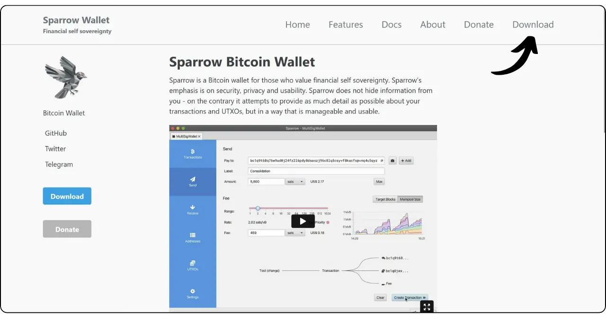

Pastikan untuk memeriksa keaslian dan integritas perangkat lunak sebelum instalasi. Kalau kamu tidak tahu cara melakukannya, silakan baca tutorial ini:

https://planb.network/tutorials/computer-security/data/integrity-authenticity-21d0420a-be02-4663-94a3-8d487f23becc

Setelah Sparrow Wallet terbuka, klik tab "*File*", lalu "*Dompet Baru*".

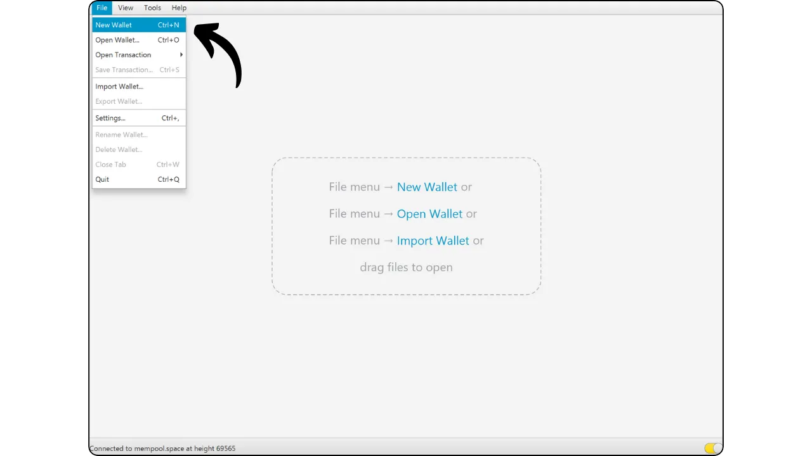

Beri nama dompetmu, lalu klik "*Buat Dompet*".

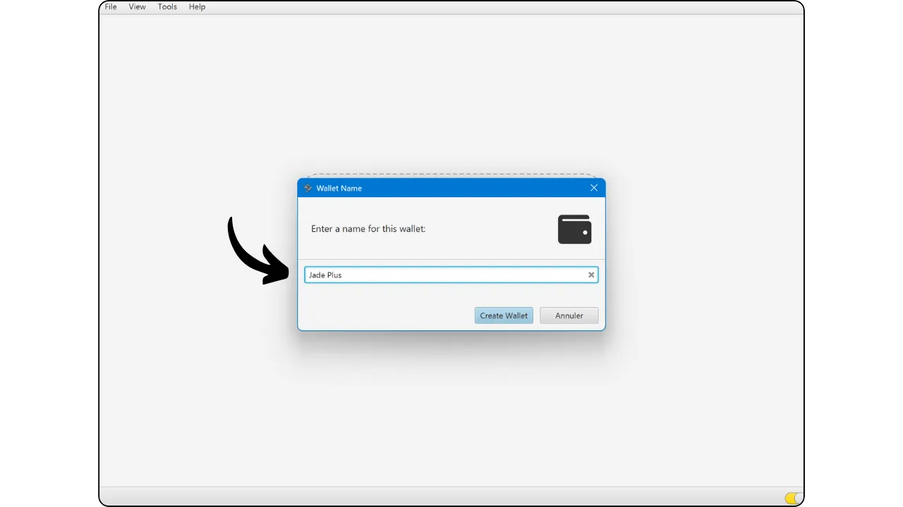

Pilih "*Dompet Perangkat Keras yang Terisi Penuh*".

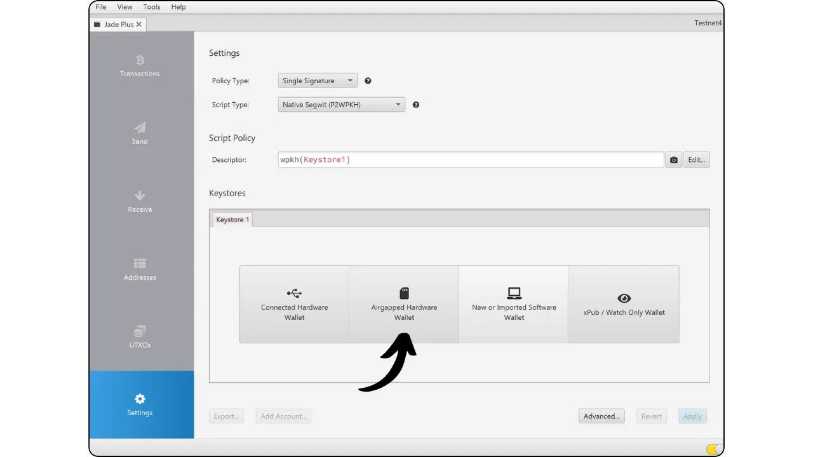

Klik "*Pindai...*" di samping opsi "*Jade*".

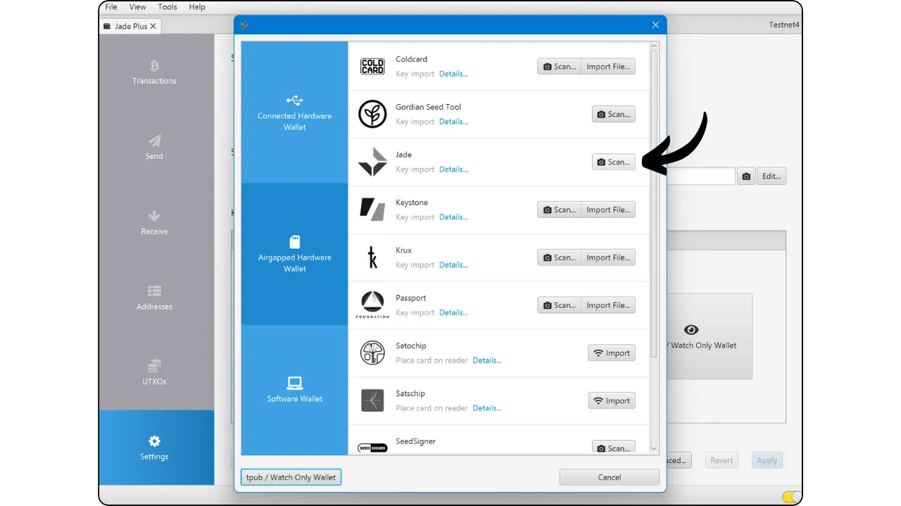

Buka kunci Jade Plus dan, jika kamu menggunakannya, masukkan kata sandi. Kemudian masuk ke menu "*Options*", pilih "*Wallet*", dan klik "*Export Xpub*".

Jade  akan menampilkan Keystore milikmu melalui beberapa kode QR. Pindai kode-kode tersebut pada mesin Anda menggunakan Sparrow.

Sekarang kamu akan melihat xpub dan sidik jari kunci utama, yang seharusnya cocok dengan yang ada di Jade Plus. Klik pada "*Terapkan*".

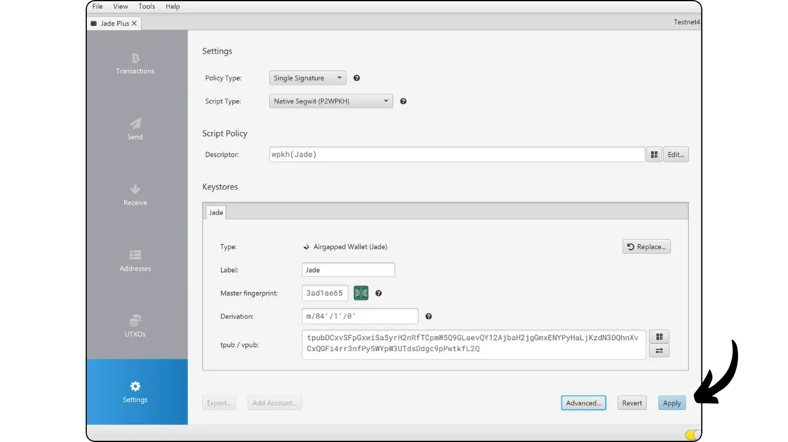

Buat kata sandi yang kuat untuk mengamankan akses ke dompet Sparrow kamu. Kata sandi ini akan melindungi kunci publik, alamat, label, dan riwayat transaksi kamu dari akses yang nggak sah. Sebaiknya simpan kata sandi ini di pengelola kata sandi supaya kamu nggak lupa.

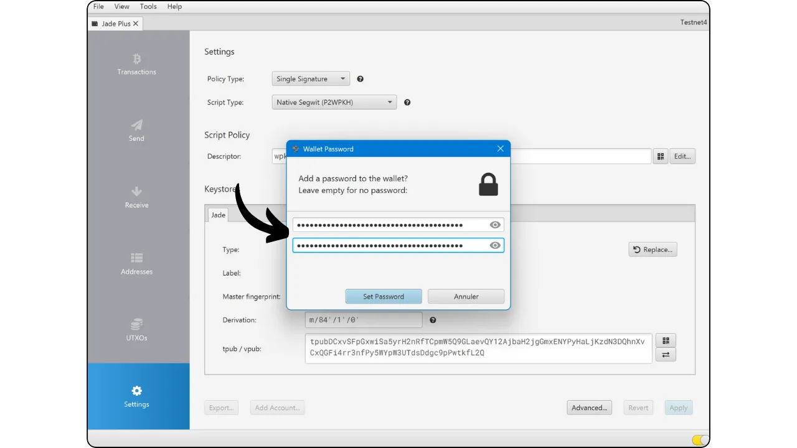

Portofolio kamu sekarang telah dikonfigurasi dengan benar di Sparrow.

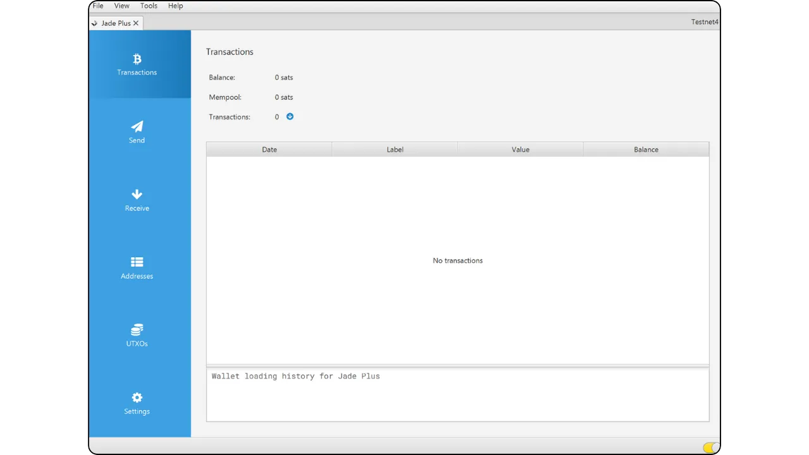

## Menerima bitcoin

Setelah Jade Plus dikonfigurasi, kamu siap untuk menerima satoshi pertamamu di dompet Bitcoin baru. Untuk melakukannya, pada Sparrow, klik menu "*Receive*".

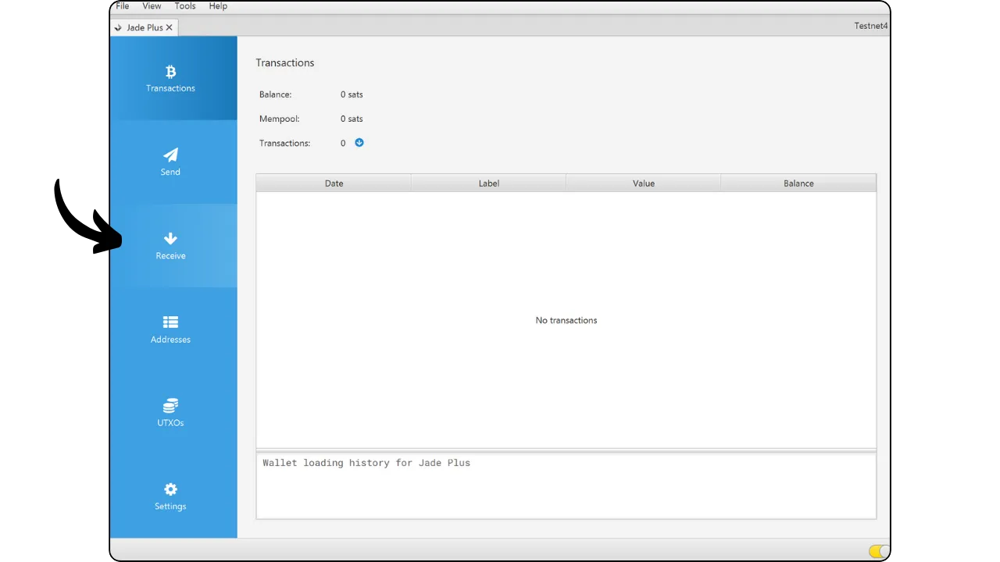

Sparrow akan menampilkan alamat penerimaan kosong pertama dalam portofolio.

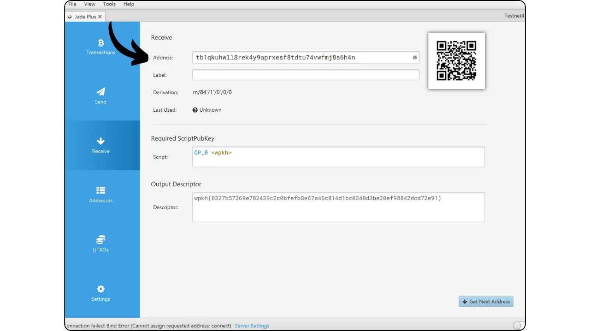

Sebelum menggunakannya, mari kita periksa di layar Jade Plus untuk memastikan bahwa wallet tersebut adalah milik dompet Bitcoin kita. Pada Jade, klik "*Scan QR*", lalu pindai kode QR dari alamat yang ditampilkan di Sparrow.

Periksa apakah alamat yang ditampilkan di layar Jade sesuai dengan yang ditampilkan di Sparrow Wallet. Jika sesuai, klik tanda centang untuk melanjutkan.

Dompet perangkat keras kemudian akan mengonfirmasi bahwa alamat ini adalah bagian dari dompet milikmu dan menyimpan kunci pribadi yang terkait.

Kalau alamat itu sudah divalidasi oleh Jade kamu, berarti kamu bisa menggunakannya untuk menerima bitcoin. Setelah transaksi dikirim ke jaringan, kamu akan melihatnya muncul di Sparrow. Tunggu sampai kamu mendapatkan cukup konfirmasi sebelum menganggap transaksi itu benar-benar final.

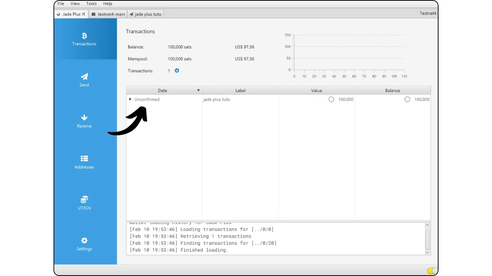

## Kirim bitcoin

Sekarang setelah kamu memiliki beberapa sat di dompet, kamu juga dapat mengirim beberapa. Untuk melakukannya, klik menu "*UTXOs*".

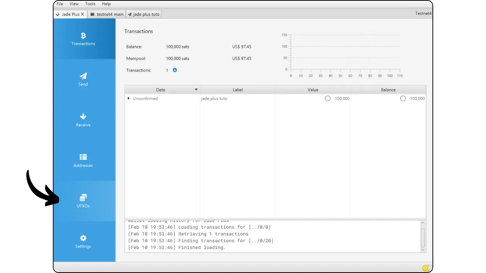

Pilih UTXO yang ingin kamu gunakan sebagai input untuk transaksi ini, lalu klik "*Kirim Terpilih*".

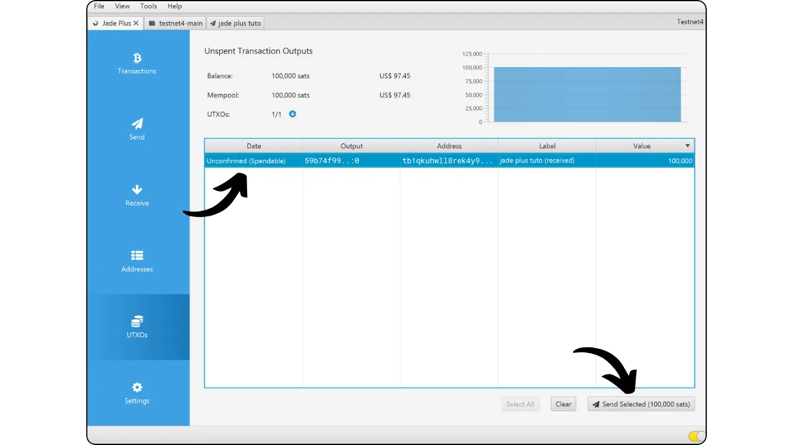

Masukkan alamat penerima, label untuk mengingatkan kamu tentang tujuan transaksi dan jumlah yang ingin kamu kirim ke alamat ini.

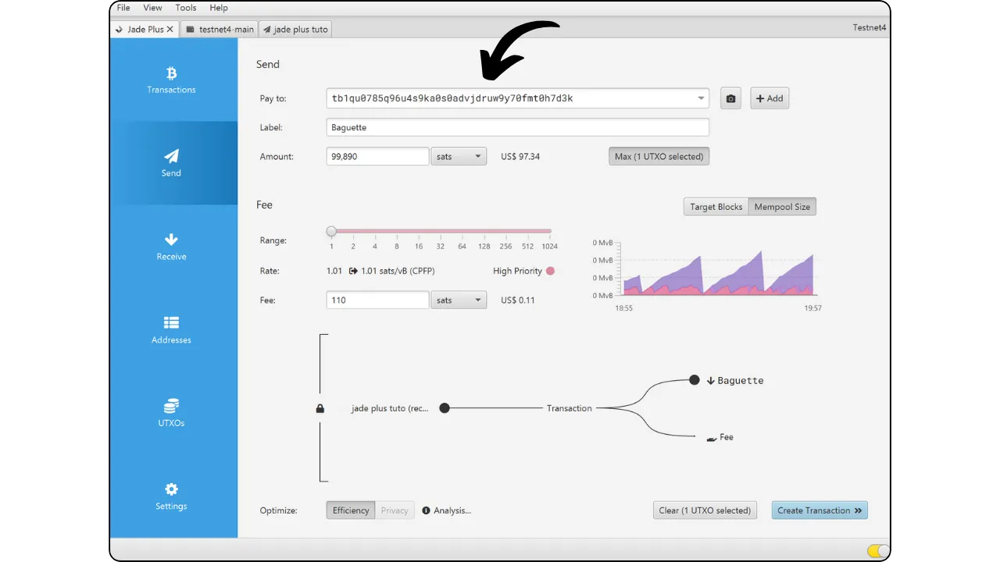

Sesuaikan tarif biaya sesuai dengan kondisi pasar saat ini, lalu klik "*Buat Transaksi*".

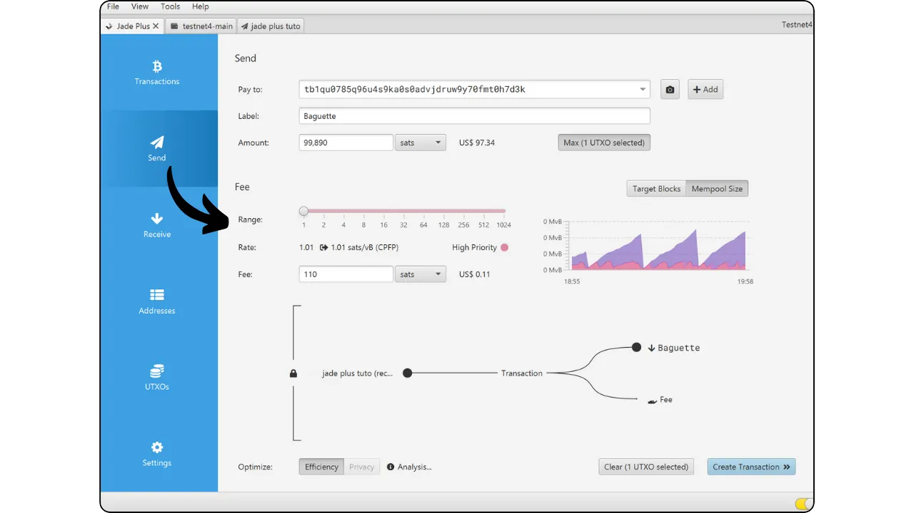

Pastikan semua parameter transaksi sudah benar, lalu klik "*Finalisasi Transaksi untuk Penandatanganan*".

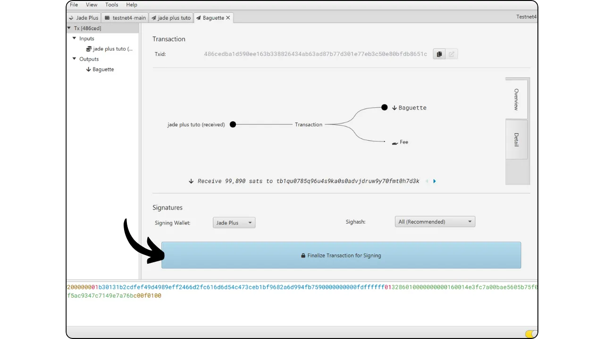

Klik "*Show QR*" untuk menampilkan PSBT (*Transaksi Bitcoin yang Ditandatangani Sebagian*). Sparrow telah membuat transaksi, tetapi masih belum memiliki tanda tangan untuk membuka kunci bitcoin yang digunakan dalam input. Tanda tangan ini hanya dapat dilakukan oleh Jade Plus, yang menampung seed kamu dan memberikan akses ke private key yang diperlukan untuk menandatangani transaksi.

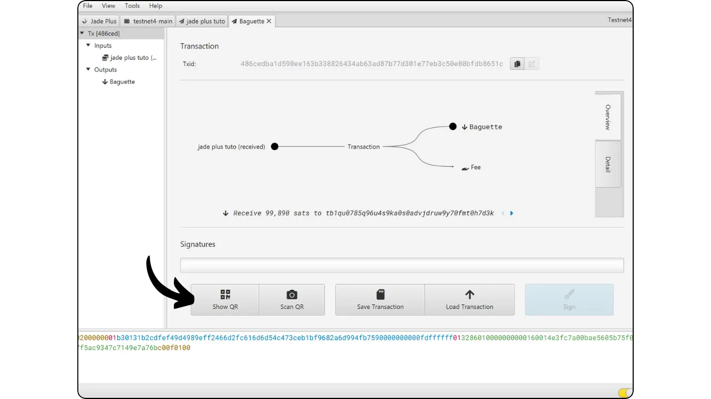

Pada Jade Plus kamu, klik "*Scan QR*" untuk memindai PSBT yang ditampilkan pada Sparrow.

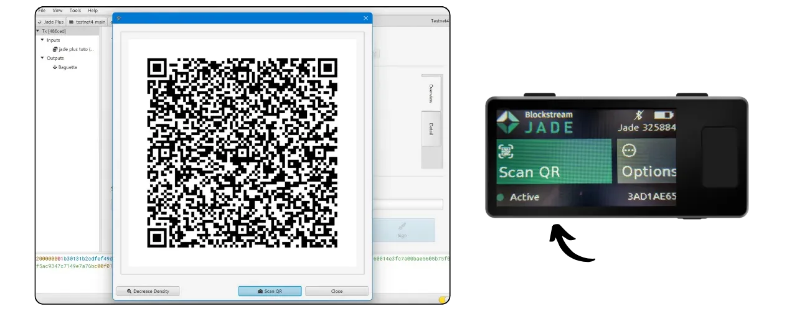

Konfirmasikan bahwa alamat pengiriman dan jumlah yang dikirim sudah benar, lalu klik tanda panah untuk memvalidasi.

Pastikan jumlah biaya sesuai dengan yang kamu pilih, lalu klik ikon centang di sudut kiri atas antarmuka untuk menandatangani transaksi.

Pada Sparrow Wallet, klik "*Scan QR*" dan pindai kode QR yang ditampilkan pada Jade.

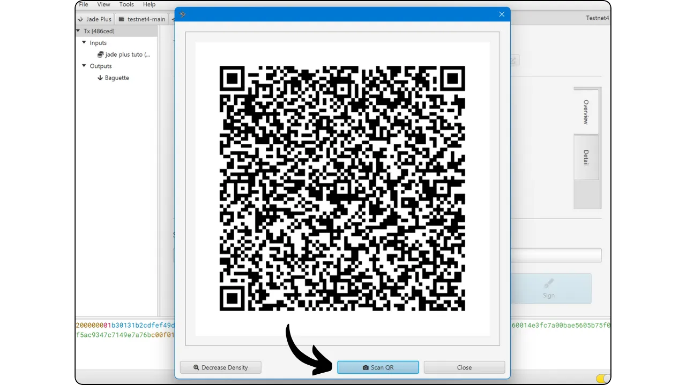

Transaksi yang baru saja kamu tandatangani sekarang siap disiarkan ke jaringan Bitcoin dan dimasukkan ke dalam blok oleh para penambang. Kalau semuanya sudah benar, klik *Siarkan Transaksi.*

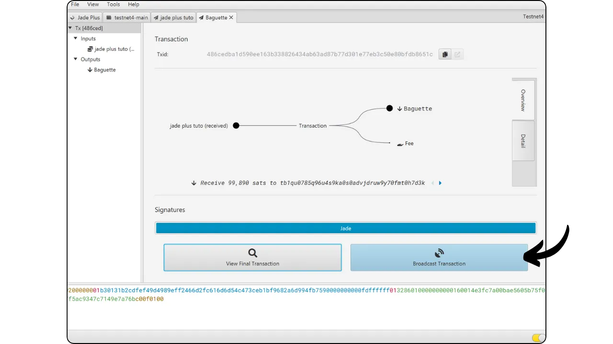

Transaksi kamu telah disiarkan dan menunggu konfirmasi.

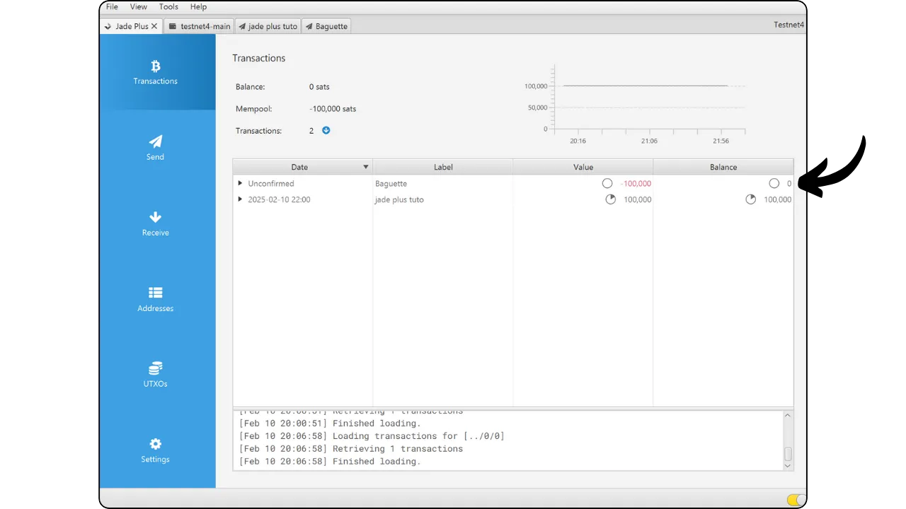

Selamat, sekarang kamu sudah tahu cara mengatur dan menggunakan Jade Plus dalam mode QR. Kalau kamu merasa tutorial ini bermanfaat, aku bakal senang banget kalau kamu kasih jempol hijau di bawah ini. Jangan ragu juga buat bagikan artikel ini di media sosial kamu. Makasih udah bantu nyebarin!

Kalau kamu mau lanjut belajar lebih jauh, aku saranin tutorial lain tentang Jade Plus, di mana kita mengonfigurasinya lewat Bluetooth dengan aplikasi seluler Green:

https://planb.network/tutorials/wallet/hardware/jade-plus-green-873099a4-35ec-4be8-b31a-6e7cd6a41ec0
