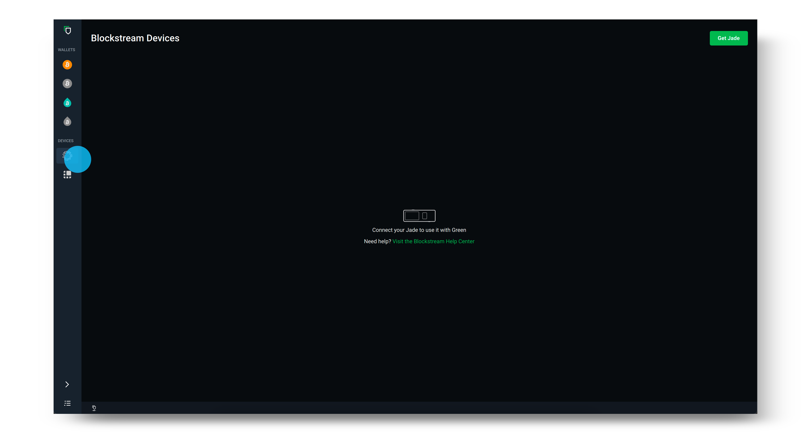
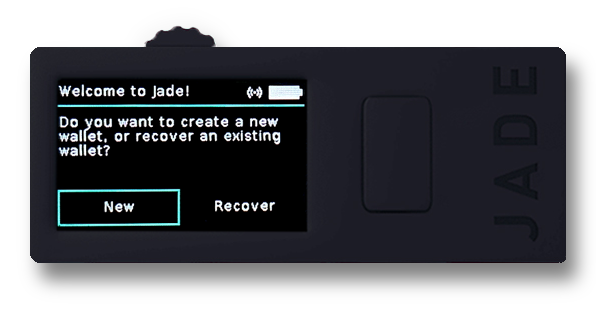
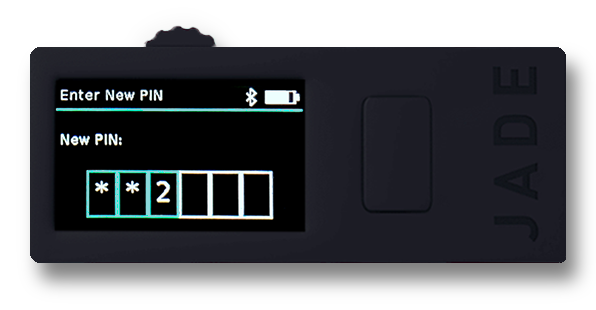
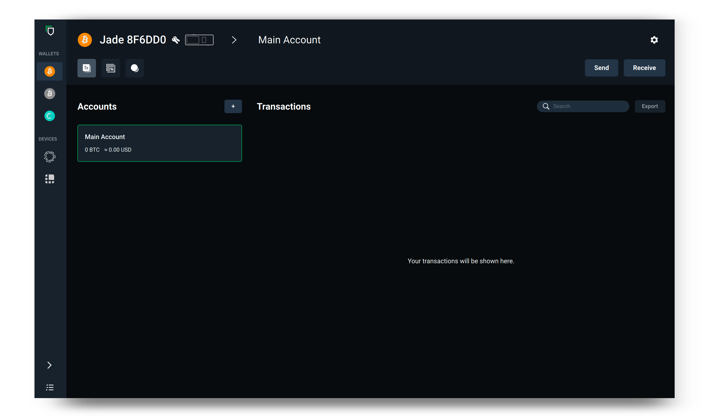
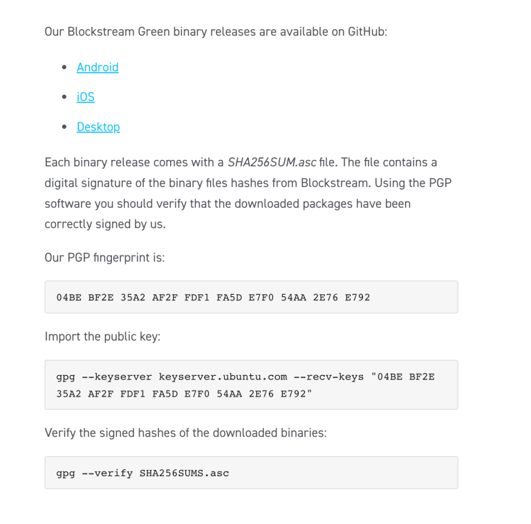
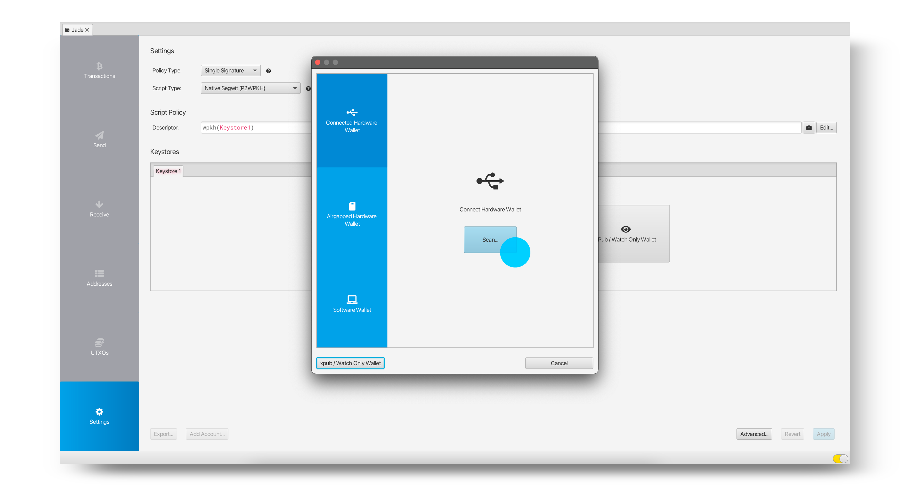
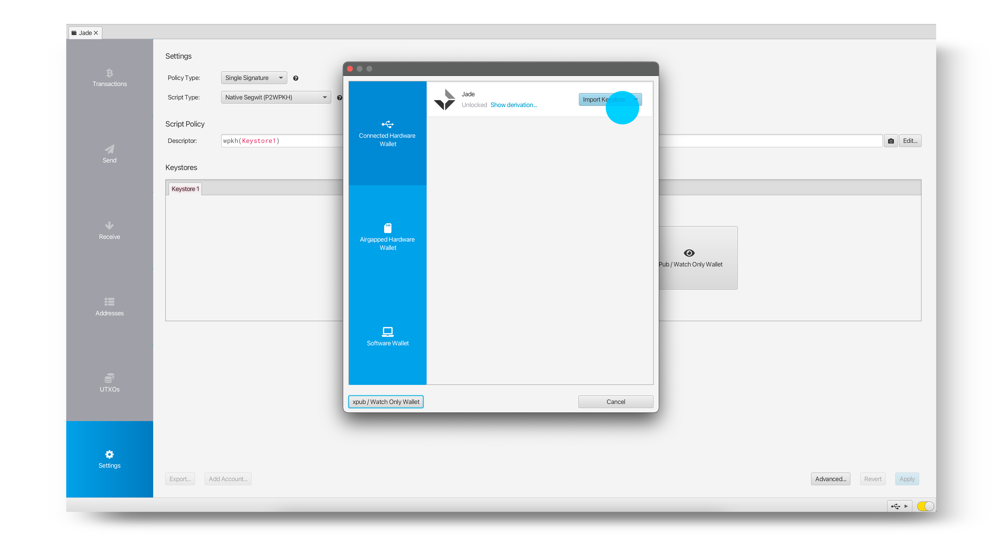
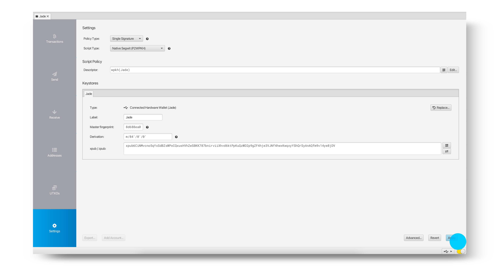

# Blockstream jade


## Video tutorial


Blockstream Jade - Tutorial completo de la billetera de hardware de Bitcoin móvil por BTCsession

## Guía de escritura completa

> Algunos textos e imágenes originales provienen de Arman The Parman; https://armantheparman.com/jade/. Lo hemos revisado para hacerlo más detallado utilizando otras guías como https://help.blockstream.com/hc/en-us/articles/7559912660761-How-do-I-use-Blockstream-Jade-with-Sparrow-


### Pre-requisitos

1. Descarga la última versión de Blockstream Green.

2. Instala este controlador para asegurarte de que Jade sea reconocido por tu computadora.

### Configuración de escritorio


Abre Blockstream Green y luego haz clic en el logotipo de Blockstream debajo de Dispositivos.



Conecta Jade a tu escritorio usando el cable USB suministrado.

> Nota: Si tu computadora no reconoce a Jade, asegúrate de descargar el controlador que se encuentra en la guía aquí.

Una vez que Jade aparezca en Green, actualízalo haciendo clic en Verificar actualizaciones y selecciona la última versión del firmware. Usa la rueda de desplazamiento o el interruptor en Jade para confirmar y continuar con la actualización. Asegúrate de que Jade aún muestre el botón "Inicializar", de lo contrario, tendrás que esperar hasta después de configurar Jade para actualizarlo. Usa el botón de retroceso para volver a esta pantalla si es necesario.


Después de haber actualizado el firmware de Jade, selecciona Configurar Jade en la política de red y seguridad que deseas utilizar.

> Consejo: La política de seguridad se muestra en el campo Tipo en la pantalla de inicio de sesión que se muestra a continuación. Si no estás seguro de si seleccionar Singlesig o Multisig Shield, revisa nuestra guía aquí. (https://help.blockstream.com/hc/en-us/articles/4403642609433)


A continuación, selecciona crear una nueva billetera y elige 12 palabras para generar tu frase de recuperación. Si haces clic en Avanzado, tendrás la opción de una frase de recuperación de 12 y 24 palabras.



Registra la frase de recuperación en papel sin conexión (o utilizando un dispositivo de respaldo de frase de recuperación dedicado para mayor seguridad). Luego, usa la rueda de desplazamiento o el interruptor en la parte superior de Jade para verificar tu frase de recuperación. Este paso asegura que la hayas anotado correctamente.


Establece y confirma tu PIN de seis dígitos. Esto se utiliza para desbloquear Blockstream Jade cada vez que inicias sesión en tu billetera.



Ahora, simplemente selecciona Ir a la billetera en la aplicación de escritorio Green y verás que tu billetera se abre en Blockstream Green. ¡Blockstream Jade también mostrará que está listo! Ahora puedes usar Jade para enviar y recibir transacciones de Bitcoin.



Después de haber terminado de usar tu billetera, desconecta tu Blockstream Jade de tu dispositivo. La próxima vez que quieras usar la billetera en Blockstream Jade, simplemente vuelve a conectar tu dispositivo y sigue las indicaciones.

fuente: https://help.blockstream.com/hc/en-us/articles/17478506300825

### Apéndice A - Verificación del archivo de descarga de Green Wallet

Verificar la descarga significa comprobar que el archivo que descargaste no ha sido modificado desde que fue lanzado por el desarrollador.

Hacemos esto verificando que la firma (producida por la clave privada del desarrollador) junto con el archivo descargado y la clave pública del desarrollador devuelvan un resultado VERDADERO al pasar por la función gpg –verify. Te mostraré cómo hacerlo a continuación. Si quieres aprender el trasfondo de esto, tengo esta guía y esta otra.
Primero, obtenemos la clave de firma:

Para Linux, abre la terminal y ejecuta este comando (debes copiar y pegar el texto, e incluir las comillas):

```bash
gpg --keyserver keyserver.ubuntu.com --recv-keys "04BE BF2E 35A2 AF2F FDF1 FA5D E7F0 54AA 2E76 E792"
```

Para Mac, haces lo mismo, excepto que primero debes descargar e instalar GPG Suite.

Para Windows, haces lo mismo, excepto que primero debes descargar e instalar GPG4Win.

Obtendrás una salida que indica que la clave pública ha sido importada.


Esta imagen tiene un atributo alt vacío; su nombre de archivo es image-3-1024x162.png

A continuación, necesitamos obtener el archivo que contiene el hash del software. Se encuentra en la página de GitHub de Blockstream. Primero ve a su página de información aquí y haz clic en el enlace "desktop". Te llevará a la página de la última versión en GitHub y allí verás un enlace al archivo SHA256SUMS.asc, que es un documento de texto que contiene el hash publicado por Blockstream del programa que descargamos.



GitHub:


No es necesario, pero después de guardar en el disco, renombré "SHA256SUMS.asc" a "SHA256.txt" para poder abrir más fácilmente el archivo en Mac usando el editor de texto. Este era el contenido del archivo:


El texto que buscamos está en la parte superior. Dependiendo del archivo que hayamos descargado, hay una salida de hash correspondiente que compararemos más adelante.

La parte inferior del documento contiene la firma realizada en el mensaje anterior, es un archivo de dos en uno.

El orden no importa, pero antes de verificar el hash, vamos a verificar que el mensaje de hash sea auténtico (es decir, que no haya sido manipulado).

Abre la terminal. Debes estar en el directorio correcto donde se descargó el archivo SHA256SUMS.asc. Suponiendo que lo descargaste en el directorio "Descargas", para Linux y Mac, cambia al directorio de esta manera (sensible a mayúsculas y minúsculas):

```bash
cd Descargas
```

Por supuesto, debes presionar <enter> después de estos comandos. Para Windows, abre CMD (símbolo del sistema) y escribe lo mismo (aunque no distingue entre mayúsculas y minúsculas).

Para Windows y Mac, debes haber descargado previamente GPG4Win y GPG Suite, respectivamente, como se indicó anteriormente. Desde la Terminal (o CMD para Windows), escribe este comando:

```bash
gpg --verify SHA256SUMS.asc
```

La ortografía exacta del nombre del archivo (en rojo) puede ser diferente el día que obtengas el archivo, así que asegúrate de que el comando coincida con el nombre del archivo descargado. Deberías obtener esta salida e ignorar la advertencia sobre la firma de confianza, eso solo significa que no le has dicho manualmente a la computadora que confías en la clave pública que importamos anteriormente.


Esta imagen tiene un atributo alt vacío; su nombre de archivo es image-4-1024x165.png
Este resultado confirma que la firma es válida y tenemos confianza en que la clave privada de "info@greenaddress.it" firmó los datos (el informe de hash).

Ahora debemos hacer un hash de nuestro archivo zip descargado y comparar el resultado con el publicado. Tenga en cuenta que en el archivo SHA256SUMS.asc, hay un texto que dice "Hash: SHA512" que me confunde, ya que el archivo claramente tiene salidas SHA256, así que voy a ignorarlo.

Para Mac y Linux, abra la terminal, navegue hasta donde se descargó el archivo zip (probablemente necesitará escribir "cd Descargas" nuevamente, a menos que no haya cerrado la terminal desde entonces). Por cierto, siempre puede verificar en qué directorio se encuentra escribiendo PWD ("directorio de trabajo actual"), y si todo esto es desconocido, es útil ver un video rápido en YouTube buscando "cómo navegar por el sistema de archivos de Linux/Mac/Windows".

Para hacer el hash del archivo, escriba esto:

```bash
shasum -a 256 BlockstreamGreen_MacOS_x86_64.zip
```

Debe verificar cómo se llama exactamente su archivo y modificar el texto en azul anterior si es necesario.

Obtendrá un resultado como este (el suyo será diferente si el archivo es diferente al mío):


A continuación, compare visualmente el resultado del hash con lo que está en el archivo SHA256SUMS.asc. Si coinciden, entonces -> ¡ÉXITO! Felicitaciones.

fuente: https://armantheparman.com/jade/

### Usándolo en Sparrow

Si ya sabe cómo usar Sparrow, entonces es como siempre:

> Nota: es el mismo proceso con Specter, por ejemplo.

Descargue Sparrow utilizando el enlace proporcionado aquí.


Haga clic en Siguiente para seguir la guía de configuración y aprender sobre las diferentes opciones de conexión.


Elija el servidor deseado y luego seleccione Crear nueva billetera.


Ingrese un nombre para su billetera y haga clic en Crear billetera.


Elija la política y los tipos de script deseados, luego seleccione Conectar billetera de hardware.

> Nota: Si anteriormente ha utilizado Blockstream Jade como una billetera Singlesig con Blockstream Green y desea ver sus transacciones en Sparrow, asegúrese de que el tipo de script coincida con el tipo de cuenta que contiene sus fondos en Green. También deberá coincidir la ruta de derivación.


Conecte su Blockstream Jade y haga clic en Escanear. Luego se le pedirá que ingrese su PIN en Jade.

> Consejo: Antes de conectar su Jade, asegúrese de que la aplicación Blockstream Green no esté abierta. Si Green está abierto, esto puede causar problemas con la detección de su Jade dentro de Sparrow.



Seleccione Importar Keystore para importar la clave pública de la cuenta predeterminada, o seleccione la flecha para seleccionar manualmente la ruta de derivación que desea utilizar.



Después de que se haya importado la clave deseada, haga clic en Aplicar.



Ahora ha configurado correctamente su billetera y puede comenzar a recibir, almacenar y gastar sus bitcoins utilizando Sparrow y Blockstream Jade.

> Nota: Si anteriormente estaba utilizando Jade con Blockstream Green como una billetera Multisig Shield, no espere que su nueva billetera Sparrow muestre el mismo saldo, ya que son billeteras diferentes. Para acceder nuevamente a su billetera Multisig Shield, simplemente conecte su Jade nuevamente a Blockstream Green.


fuente: https://help.blockstream.com/hc/en-us/articles/7559912660761-How-do-I-use-Blockstream-Jade-with-Sparrow-

### aplicación verde

si prefieres una guía móvil, puedes usarla con blockstream green

- Cómo configurar Blockstream Jade con Green | Blockstream Jade - https://youtu.be/7aacxnc6DHg

- Cómo recibir bitcoin en una billetera Jade | Blockstream Jade - https://youtu.be/CVtcDdiPqLA
