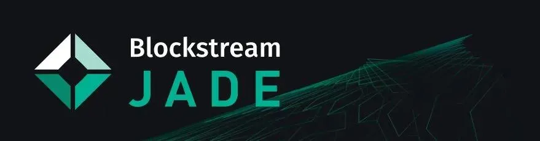

## Õppevideo


Blockstream Jade - Mobiilne Bitcoin riistvara rahakott TÄIELIK ÕPETUS autorilt BTCsession

## Täielik kirjalik juhend


### Eeltingimused

1. Laadige alla Blockstream Green'i viimane versioon.

2. Installige see draiver, et tagada Jade'i äratundmine teie arvuti poolt.

### Lauaarvuti seadistus


Avage Blockstream Green, seejärel klõpsake seadmete all Blockstreami logol.


Ühendage Jade oma lauaarvutiga kaasasoleva USB-kaabli abil.

> Märkus: Kui Jade'i ei tunnustata teie arvuti poolt, veenduge, et olete alla laadinud juhendis leiduva draiveri.

Kui teie Jade ilmub Greenis, uuendage Jade'i, klõpsates Kontrolli uuendusi ja valige viimane püsivara versioon. Kasutage Jade'i kinnitamiseks ja uuendamisega jätkamiseks kerimisratast või lülitit. Veenduge, et teie Jade'il oleks endiselt näha "Initialize" nupp, vastasel juhul peate ootama pärast Jade'i seadistamist, et seda uuendada. Kasutage vajadusel tagasi nuppu, et sellele ekraanile jõuda.


Pärast Jade'i püsivara uuendamist valige Setup Jade võrgus ja turvapoliitika, mida soovite kasutada.

> Nipp: Turvapoliitika on loetletud tüübi all sisselogimisekraanil allpool. Kui te pole kindel, kas valida Singlesig või Multisig Shield, palun vaadake meie juhendit siin. (https://help.blockstream.com/hc/en-us/articles/4403642609433)


Järgmisena valige, et loote Uue rahakoti ja valige 12 sõna, et genereerida oma taastefraas. Klõpsates Edasijõudnule antakse teile võimalus 12 ja 24 sõna taastefraasi jaoks.


Salvestage taastefraas paberile või kasutage spetsiaalset taastefraasi varundusseadet lisaturvalisuse tagamiseks. Seejärel kasutage oma Jade'i taastefraasi kontrollimiseks ratast või lülitit. See samm tagab, et olete selle õigesti üles kirjutanud.


Seadistage ja kinnitage oma kuuekohaline PIN-kood. Seda kasutatakse Blockstream Jade'i iga kord avamisel, kui logite oma rahakotti sisse.


Nüüd lihtsalt valige Go to Wallet Greeni lauaarvutirakenduses ja näete oma rahakotti avanemas Blockstream Greenis. Blockstream Jade näitab samuti, et see on Valmis! Nüüd saate oma Jade'i kasutada Bitcoin tehingute saatmiseks ja vastuvõtmiseks.


Pärast rahakoti kasutamise lõpetamist ühendage oma Blockstream Jade seadmest lahti. Järgmine kord, kui soovite Blockstream Jade'i rahakotti kasutada, ühendage lihtsalt oma seade uuesti ja järgige juhiseid.

allikas: https://help.blockstream.com/hc/en-us/articles/17478506300825

### Lisa A - Green Wallet allalaadimisfaili kontrollimine

Allalaadimise kontrollimine tähendab kontrollida, et alla laaditud faili pole arendaja poolt väljastamisest saadik muudetud.

Seda teeme, kontrollides, et arendaja privaatvõtmega loodud allkiri koos alla laaditud faili ja arendaja avaliku võtmega annavad läbi gpg –verify funktsiooni kasutamisel TÕESE tulemuse. Näitan teile järgmisena, kuidas seda teha. Kui soovite selle tausta kohta rohkem teada saada, on mul selle kohta juhend ja veel üks.
Linuxi jaoks avage terminal ja käivitage see käsk (peaksite teksti lihtsalt kopeerima ja kleepima ning lisama jutumärgid):
```bash
gpg --keyserver keyserver.ubuntu.com --recv-keys "04BE BF2E 35A2 AF2F FDF1 FA5D E7F0 54AA 2E76 E792"
```

Maci jaoks tehke sama, välja arvatud, et peate esmalt alla laadima ja installima GPG Suite.

Windowsi jaoks tehke sama, välja arvatud, et peate esmalt alla laadima ja installima GPG4Win.

Te saate väljundi, mis ütleb, et avalik võti on imporditud.


Sellel pildil on tühi alt-atribuut; selle failinimi on image-3-1024x162.webp

Järgmisena peame hankima faili, mis sisaldab tarkvara räsi. See on salvestatud Blockstreami GitHubi lehele. Minge esmalt nende infolehele siin ja klõpsake lingil "desktop". See viib teid GitHubi viimase väljalaske lehele ja seal näete linki SHA256SUMS.asc failile, mis on tekstidokument, mis sisaldab Blockstreami avaldatud programmi räsi.


GitHub:


See pole vajalik, kuid pärast kettale salvestamist nimetasin ma "SHA256SUMS.asc" ümber "SHA256.txt"-ks, et saaksin faili Macis tekstiredaktoriga kergemini avada. See oli faili sisu:


Tekst, mida me otsime, on üleval. Sõltuvalt sellest, millise faili me alla laadisime, on olemas vastav räsi väljund, mida me hiljem võrdleme.

Dokumendi alumine osa sisaldab sõnumi peal tehtud allkirja - see on kaks ühes fail.

Järjekord pole oluline, kuid enne räsi kontrollimist kontrollime, et räsisõnum on ehtne (st pole manipuleeritud).

Avage terminal. Peate olema õiges kataloogis, kuhu SHA256SUMS.asc fail alla laaditi. Eeldades, et laadisite selle alla "Downloads" kataloogi, muutke Linuxi ja Maci jaoks kataloogi nii (tõstutundlik):

```bash
cd Downloads
```

Muidugi peate pärast neid käsklusi vajutama <enter>. Windowsi jaoks avage CMD (käsurida) ja tippige sama (kuigi see pole tõstutundlik).

Windowsi ja Maci jaoks oli vaja juba olla alla laaditud GPG4Win ja GPG Suite, nagu varem juhendatud. Linuxi jaoks tuleb gpg koos operatsioonisüsteemiga. Terminalist (või Windowsi jaoks CMD-st) tippige see käsk:

```bash
gpg --verify SHA256SUMS.asc
```

Failinime täpne kirjapilt (punases) võib olla erinev päeval, mil faili hankite, seega veenduge, et käsk vastaks allalaaditud failinimele. Te peaksite saama selle väljundi ja ignoreerima hoiatust usaldusväärse allkirja kohta – see tähendab lihtsalt, et te pole arvutile käsitsi öelnud, et usaldate varem imporditud avalikku võtit.


See väljund kinnitab, et allkiri on hea, ja me oleme kindlad, et privaatvõti "info@greenaddress.it" allkirjastas andmed (räsi aruanne).
Nüüd peaksime meie allalaaditud zip-faili räsimiseks ja väljundi võrdlemiseks avaldatuga. Pane tähele, et SHA256SUMS.asc failis on tekstiosa, mis ütleb "Hash: SHA512", mis ajab mind segadusse, kuna failis on selgelt SHA256 väljundid, seega ma eiran seda.

Maci ja Linuxi jaoks ava terminal, navigeeri sinna, kuhu zip-fail alla laaditi (tõenäoliselt pead uuesti tippima "cd Downloads", kui sa pole vahepeal terminali sulgenud). Muide, sa võid alati kontrollida, millises kaustas sa oled, tippides PWD ("print working directory"), ja kui see kõik on sulle võõras, on kasulik vaadata kiiret YouTube'i videot, otsides "kuidas navigeerida Linuxi/Maci/Windowsi failisüsteemis".

Faili räsimiseks tippige see:

```bash
shasum -a 256 BlockstreamGreen_MacOS_x86_64.zip
```

Sa peaksid kontrollima, mis su fail täpselt on nimetatud, ja vajadusel muutma ülalolevas sinises tekstis.

Saad sellise väljundi (sinu oma erineb, kui fail on minu omast erinev):


Järgmiseks võrdle visuaalselt räsi väljundit sellega, mis on SHA256SUMS.asc failis. Kui need kattuvad, siis –> EDU! Palju õnne.

allikas: https://armantheparman.com/jade/

### Kasutades seda Sparrow'ga

Kui sa juba tead, kuidas Sparrow'd kasutada, siis nagu alati:

> Märkus: protsess on sama nagu näiteks Specter'iga

Laadi Sparrow alla siin pakutud lingi kaudu.


Klõpsa Next, et järgida seadistusjuhendit ja õppida tundma erinevaid ühendusvõimalusi.


Vali soovitud server ja seejärel vali Create New Wallet.


Sisesta oma rahakoti nimi ja klõpsa Create Wallet.


Vali soovitud poliitika ja skripti tüübid ning seejärel vali Connected Hardware Wallet.

> Märkus: Kui oled varem kasutanud Blockstream Jade'i Singlesig rahakotina koos Blockstream Green'iga ja soovid Sparrow's oma tehinguid vaadata, veendu, et skripti tüüp vastab kontotüübile, mis sisaldab sinu vahendeid Green'is. Samuti on vajalik, et tuletamistee vastaks.


Ühenda oma Blockstream Jade ja klõpsa Scan. Seejärel palutakse sul sisestada oma PIN-kood Jade'is.

> Nipp: Enne oma Jade'i ühendamist veendu, et Blockstream Greeni rakendus pole avatud. Kui Green on avatud, võib see põhjustada probleeme Jade'i tuvastamisega Sparrow's.


Vali Import Keystore, et importida vaikimisi konto avalik võti, või vali nool, et käsitsi valida soovitud tuletamistee.


Pärast soovitud võtme importimist klõpsa Apply.


Nüüd oled edukalt seadistanud oma rahakoti ja saad alustada oma bitcoinide vastuvõtmist, hoidmist ja kulutamist kasutades Sparrow'd ja Blockstream Jade'i.

> Märkus: Kui sa varem kasutasid Jade'i koos Blockstream Green'iga kui Multisig Shield rahakotti, ei tohiks sa oodata, et sinu uus Sparrow rahakott näitaks sama saldo - need on erinevad rahakotid. Oma Multisig Shield rahakoti uuesti kasutamiseks ühenda lihtsalt oma Jade tagasi Blockstream Green'iga.


allikas: https://help.blockstream.com/hc/en-us/articles/7559912660761-How-do-I-use-Blockstream-Jade-with-Sparrow-

### green app
Kui olete rohkem mobiilse juhendi kasutaja, saate seda kasutada koos Blockstream Greeniga
- Kuidas seadistada Blockstream Jade'i koos Greeniga | Blockstream Jade - https://youtu.be/7aacxnc6DHg

- Kuidas vastu võtta bitcoini Jade rahakotti | Blockstream Jade - https://youtu.be/CVtcDdiPqLA