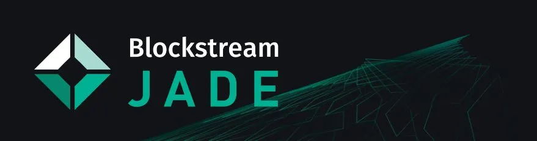

## Video Tutorial


Blockstream Jade - Mobile Bitcoin Hardware Wallet FULL TUTORIAL oleh BTCsession

## Panduan Penulisan Lengkap

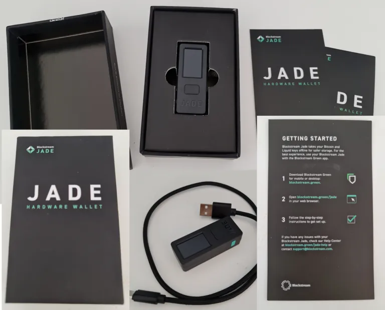

### Prasyarat

1. Unduh versi terbaru dari Blockstream Green.

2. Pasang driver ini untuk memastikan Jade dikenali oleh komputer kamu.

### Pengaturan Desktop


Buka Blockstream Green, kemudian klik logo Blockstream di bawah Devices.


Hubungkan Jade ke desktop kamu menggunakan kabel USB yang disediakan.

> Catatan: Jika Jade tidak dikenali oleh komputer kamu, pastikan untuk mengunduh driver yang tersedia dalam panduan di sini.

Setelah Jade kamu muncul di Green, perbarui Jade dengan mengklik *Check for updates* dan pilih versi firmware terbaru. Gunakan roda gulir atau toggle pada Jade untuk mengonfirmasi dan melanjutkan pembaruan. Pastikan Jade kamu masih menampilkan tombol "Initialize"; jika tidak, kamu harus menunggu setelah menyiapkan Jade untuk memperbaruinya. Gunakan tombol kembali untuk kembali ke layar ini jika perlu.


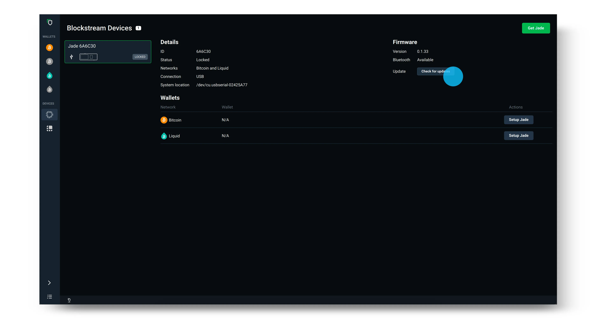

Setelah kamu memperbarui firmware Jade, pilih *Setup Jade* pada jaringan dan kebijakan keamanan yang ingin kamu gunakan.

> Tip: Kebijakan keamanan tercantum di bawah *Type* pada layar login yang ditunjukkan di bawah ini. Jika kamu tidak yakin apakah akan memilih *Singlesig* atau *Multisig Shield*, silakan tinjau panduan kami di sini: (https://help.blockstream.com/hc/en-us/articles/4403642609433)

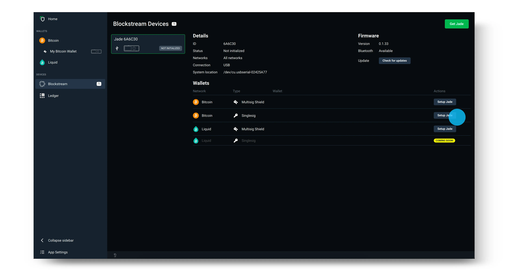

Selanjutnya, pilih untuk membuat wallet Baru dan pilih 12 kata untuk menghasilkan seed kamu. Mengklik *Advanced* akan memberi kamu opsi frasa pemulihan 12 atau 24 kata.


Catat seed secara offline di atas kertas (atau menggunakan perangkat cadangan seed khusus untuk keamanan tambahan). Kemudian, gunakan roda atau toggle di bagian atas Jade kamu untuk memverifikasi seed kamu. Langkah ini memastikan kamu telah menuliskannya dengan benar.


Tetapkan dan konfirmasi PIN enam digit kamu. PIN ini digunakan untuk membuka kunci Blockstream Jade setiap kali kamu login ke wallet kamu.


Sekarang, cukup pilih *Go to Wallet* pada aplikasi desktop Green dan kamu akan melihat wallet kamu terbuka di Blockstream Green. Blockstream Jade juga akan menunjukkan bahwa itu sudah Siap! Kamu sekarang dapat menggunakan Jade kamu untuk mengirim dan menerima transaksi Bitcoin.


Setelah kamu selesai menggunakan wallet kamu, putuskan sambungan Blockstream Jade dari perangkat. Kali berikutnya kamu ingin menggunakan wallet di Blockstream Jade, cukup hubungkan kembali perangkat kamu dan ikuti petunjuknya.

Sumber: https://help.blockstream.com/hc/en-us/articles/17478506300825

### Lampiran A - Memverifikasi file unduhan Green Wallet

Memverifikasi unduhan berarti memeriksa bahwa file yang kamu unduh tidak telah dimodifikasi sejak dirilis oleh pengembang.

Kita melakukan ini dengan memeriksa bahwa tanda tangan (yang dihasilkan oleh kunci privat pengembang) bersama dengan file yang diunduh dan kunci publik pengembang menghasilkan hasil TRUE ketika melewati fungsi `gpg --verify`. Saya akan menunjukkan cara melakukannya selanjutnya. Jika kamu ingin mempelajari latar belakangnya, saya memiliki panduan ini dan ini.

Pertama, kita mendapatkan kunci tanda tangan:
Untuk Linux, buka terminal, dan jalankan perintah ini (kamu hanya perlu menyalin dan menempelkan teks, serta menyertakan tanda kutip):
```bash
gpg --keyserver keyserver.ubuntu.com --recv-keys "04BE BF2E 35A2 AF2F FDF1 FA5D E7F0 54AA 2E76 E792"
```

Untuk Mac, lakukan hal yang sama, kecuali kamu perlu mengunduh dan menginstal GPG Suite terlebih dahulu.

Untuk Windows, lakukan hal yang sama, kecuali kamu perlu mengunduh dan menginstal GPG4Win terlebih dahulu.

Kamu akan mendapatkan output yang mengatakan kunci publik telah diimpor.

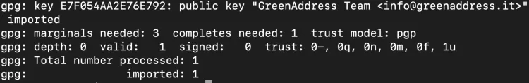

Gambar ini memiliki atribut alt yang kosong; nama filenya adalah `image-3-1024x162.webp`

Selanjutnya, kita perlu mendapatkan file yang berisi hash dari perangkat lunak. File ini disimpan di halaman GitHub Blockstream. Pertama, kunjungi halaman informasi mereka di sini, lalu klik tautan untuk "desktop". Ini akan membawa kamu ke halaman rilis terbaru di GitHub, dan di sana kamu akan melihat tautan ke file `SHA256SUMS.asc`, yang merupakan dokumen teks berisi hash yang diterbitkan Blockstream dari program yang kita unduh.


GitHub:

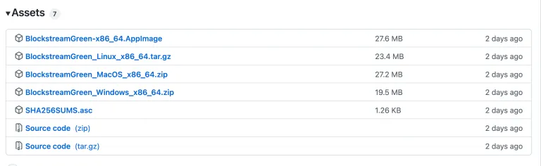

Ini tidak wajib, tetapi setelah menyimpan ke disk, saya mengganti nama "SHA256SUMS.asc" menjadi "SHA256.txt" agar lebih mudah membuka file di Mac menggunakan editor teks. Ini adalah isi dari file tersebut:


Teks yang kita cari ada di bagian atas. Tergantung pada file yang kamu unduh, ada output hash yang sesuai yang akan kita bandingkan nanti.

Bagian bawah dokumen berisi tanda tangan yang dibuat pada pesan di atas – ini adalah file dua dalam satu.

Urutannya tidak penting, tetapi sebelum memeriksa hash, kita akan memastikan bahwa pesan hash asli (yaitu tidak diubah).

Buka terminal. Kamu perlu berada di direktori yang benar di mana file `SHA256SUMS.asc` diunduh. Dengan asumsi kamu mengunduhnya ke direktori "Downloads", untuk Linux dan Mac, ubah ke direktori seperti ini (case sensitive):

```bash
cd Downloads
```

Tentu saja, kamu harus menekan <enter> setelah perintah ini. Untuk Windows, buka CMD (Command Prompt), dan ketik hal yang sama (meskipun tidak case sensitive).

Untuk Windows dan Mac, kamu perlu telah mengunduh GPG4Win dan GPG Suite, masing-masing, seperti yang diinstruksikan sebelumnya. Untuk Linux, `gpg` sudah tersedia bersama Sistem Operasi. Dari Terminal (atau CMD untuk Windows), ketik perintah ini:

```bash
gpg --verify SHA256SUMS.asc
```

Ejaan tepat dari nama file (dalam merah) mungkin berbeda pada hari kamu mengambil file, jadi pastikan perintah cocok dengan nama file seperti yang diunduh. Kamu seharusnya mendapatkan output ini, dan abaikan peringatan tentang tanda tangan yang dipercaya – itu hanya berarti kamu belum secara manual memberi tahu komputer bahwa kamu mempercayai kunci publik yang kita impor sebelumnya.

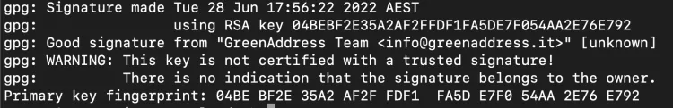

Gambar ini memiliki atribut alt yang kosong; nama filenya adalah `image-4-1024x165.webp`

Output ini mengonfirmasi bahwa tanda tangan itu valid, dan kita dapat yakin kunci privat dari "info@greenaddress.it" telah menandatangani data (laporan hash).  
Sekarang kita harus meng-hash file zip yang telah diunduh dan membandingkan outputnya dengan yang dipublikasikan. Perhatikan bahwa dalam file `SHA256SUMS.asc`, ada sedikit teks yang menyebut "Hash: SHA512" yang membingungkan, karena file tersebut jelas memiliki output SHA256 di dalamnya, jadi saya akan mengabaikannya.

Untuk Mac dan Linux, buka terminal, navigasikan ke tempat file zip diunduh (mungkin kamu perlu mengetik `cd Downloads` lagi, kecuali kamu belum menutup terminal sejak itu). Ngomong-ngomong, kamu selalu dapat memeriksa direktori mana kamu berada dengan mengetik `PWD` ("print working directory"), dan jika semua ini terdengar asing, sangat berguna untuk menonton video YouTube singkat dengan mencari "cara menavigasi sistem file Linux/Mac/Windows".


Untuk meng-hash file, ketik ini:

```bash
shasum -a 256 BlockstreamGreen_MacOS_x86_64.zip
```

Kamu harus memeriksa nama file kamu secara tepat, dan memodifikasi teks dalam biru di atas jika diperlukan.

Kamu akan mendapatkan output seperti ini (milikmu akan berbeda jika file berbeda dengan milikku):

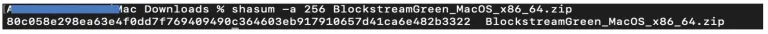

Selanjutnya, bandingkan secara visual output hash dengan apa yang ada di file SHA256SUMS.asc. Jika mereka cocok, maka --> SUKSES! Selamat.

sumber: https://armantheparman.com/jade/

### Menggunakannya di Sparrow

Jika kamu sudah tahu cara menggunakan Sparrow maka seperti biasa:

> Catatan: prosesnya sama dengan Specter misalnya

Unduh Sparrow menggunakan tautan yang disediakan di sini.


Klik Next untuk mengikuti panduan pengaturan untuk mempelajari tentang berbagai opsi koneksi.

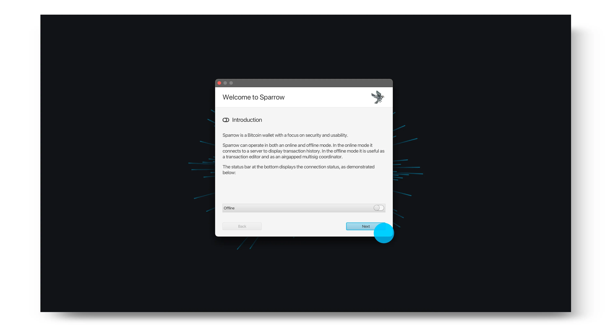

Pilih server yang kamu inginkan kemudian pilih Create New Wallet.

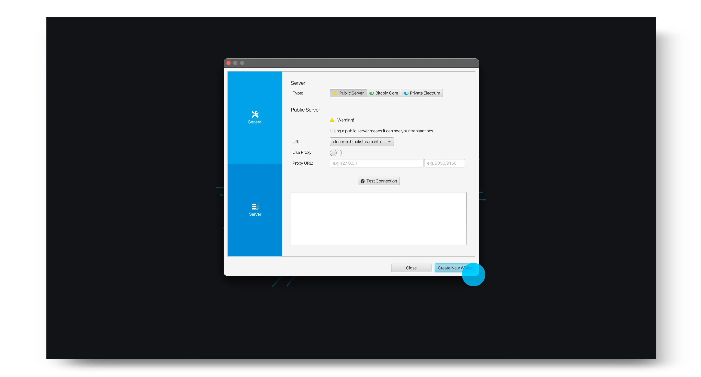

Masukkan nama untuk dompet kamu dan klik Create Wallet.


Pilih kebijakan dan jenis skrip yang kamu inginkan, kemudian pilih *Connected Hardware Wallet*.

> Catatan: Jika kamu sebelumnya telah menggunakan Blockstream Jade sebagai wallet *Singlesig* dengan Blockstream Green dan ingin melihat transaksi kamu di Sparrow, pastikan jenis skrip cocok dengan tipe akun yang berisi dana kamu di Green. Kamu juga perlu memastikan jalur derivasi sesuai.

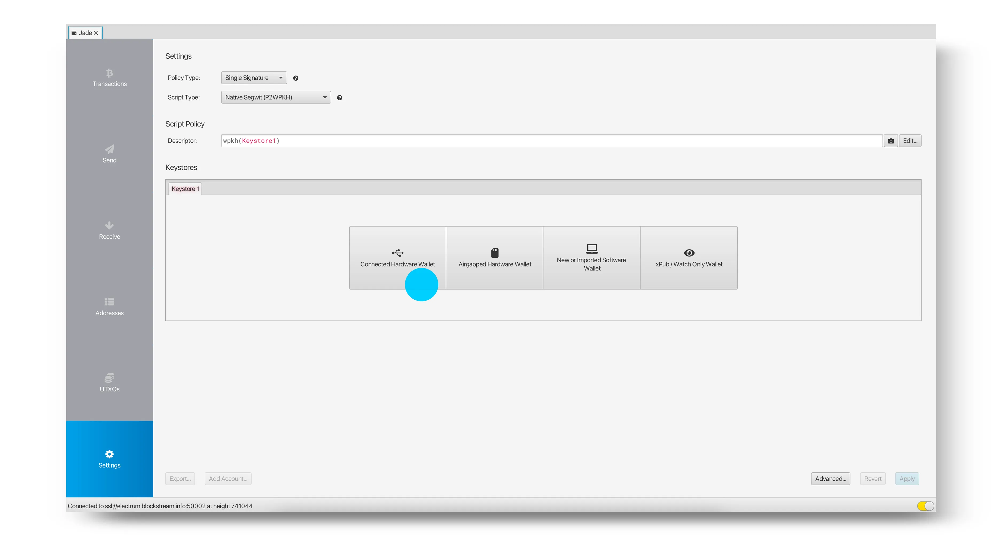

Colokkan Blockstream Jade kamu dan klik *Scan*. Kamu kemudian akan diminta untuk memasukkan PIN kamu di Jade.

> Tip: Sebelum menghubungkan Jade kamu, pastikan aplikasi Blockstream Green tidak terbuka. Jika Green terbuka, ini dapat menyebabkan masalah dengan deteksi Jade kamu di Sparrow.


Pilih Import Keystore untuk mengimpor kunci publik dari akun default, atau pilih panah untuk secara manual memilih jalur derivasi yang ingin Anda gunakan.

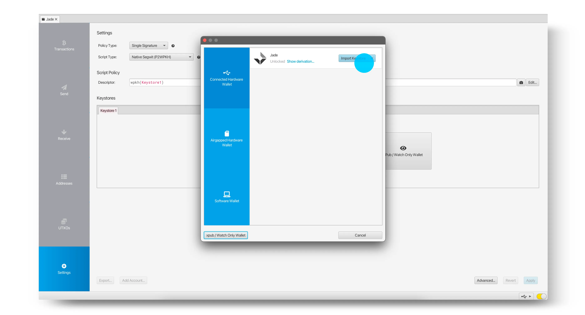

Setelah kunci yang diinginkan telah diimpor, klik Apply.

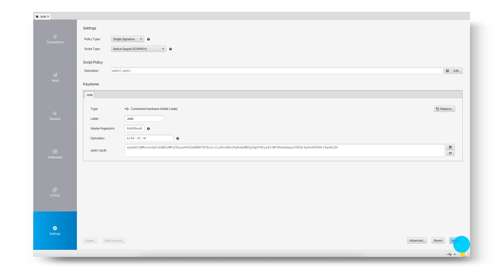

Kamu sekarang telah berhasil mengatur wallet kamu dan dapat mulai menerima, menyimpan, dan mengirim bitcoin kamu menggunakan Sparrow dan Blockstream Jade.

> Catatan: Jika kamu sebelumnya menggunakan Jade dengan Blockstream Green sebagai wallet *Multisig Shield*, jangan mengharapkan wallet Sparrow baru kamu menunjukkan saldo yang sama — ini adalah wallet yang berbeda. Untuk mengakses wallet *Multisig Shield* kamu lagi, cukup hubungkan kembali Jade kamu ke Blockstream Green.


sumber: https://help.blockstream.com/hc/en-us/articles/7559912660761-How-do-I-use-Blockstream-Jade-with-Sparrow-

### aplikasi green
Jika kamu lebih banyak menggunakan panduan mobile, kamu bisa menggunakannya dengan Blockstream Green
- Cara mengatur Blockstream Jade dengan Green | Blockstream Jade - https://youtu.be/7aacxnc6DHg

- Cara menerima bitcoin ke dompet Jade | Blockstream Jade - https://youtu.be/CVtcDdiPqLA
