## Video tutorial


Blockstream Jade - Mobile Bitcoin Hardware Wallet FULL TUTORIAL by BTCsession

## Guida completa


### Prerequisiti

1. Scarica l'ultima versione di Blockstream Green.

2. Installa questo driver per assicurarti che Jade venga riconosciuto dal tuo computer.

### Configurazione desktop


Apri Blockstream Green, quindi clicca sul logo di Blockstream sotto Dispositivi.

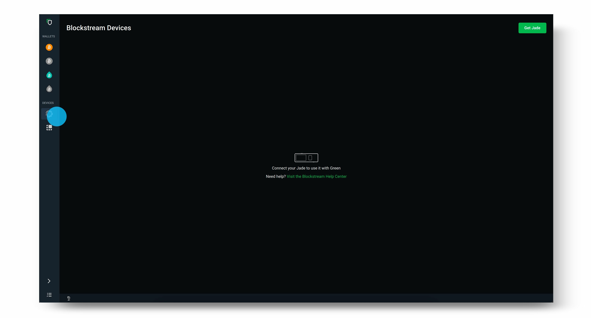

Collega Jade al tuo desktop utilizzando il cavo USB fornito.

> Nota: Se Jade non viene riconosciuto dal tuo computer, assicurati di scaricare il driver trovato nella guida qui.

Una volta che Jade appare in Green, aggiorna Jade cliccando su Verifica aggiornamenti e seleziona la versione del firmware più recente. Utilizza la rotella di scorrimento o il pulsante di scelta su Jade per confermare e continuare con l'aggiornamento. Assicurati che Jade mostri ancora il pulsante "Inizializza", altrimenti dovrai aspettare fino a dopo aver configurato Jade per aggiornarlo. Utilizza il pulsante Indietro per tornare a questa schermata se necessario.

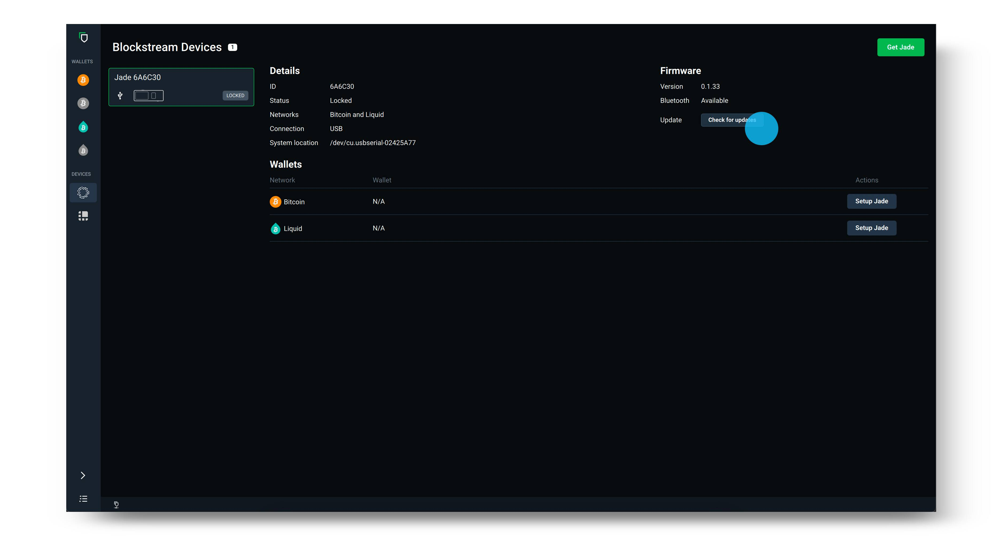

Dopo aver aggiornato il firmware di Jade, seleziona Configura Jade sulla politica di rete e sicurezza che desideri utilizzare.

> Suggerimento: La politica di sicurezza è elencata sotto Tipo nella schermata di accesso mostrata di seguito. Se non sei sicuro se selezionare Singlesig o Multisig Shield, consulta la nostra guida qui. (https://help.blockstream.com/hc/en-us/articles/4403642609433)

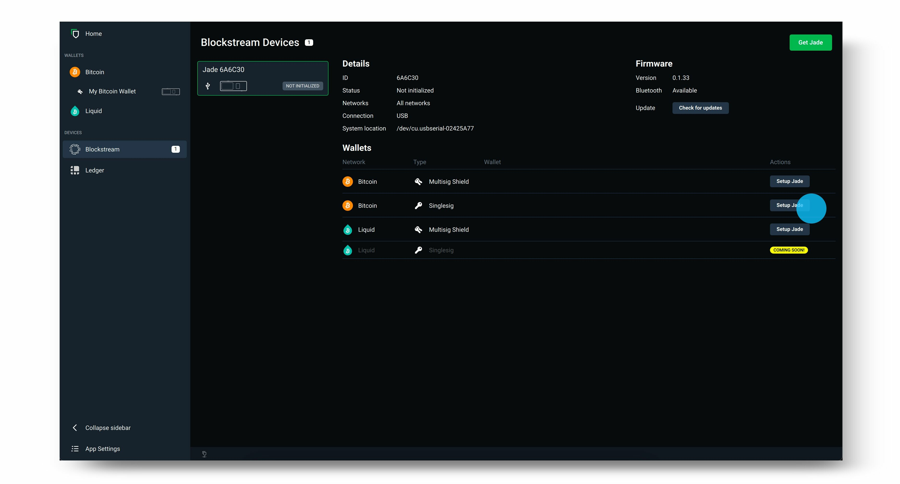

Successivamente, seleziona Crea un nuovo portafoglio e scegli 12 parole per generare la tua frase di recupero. Cliccando su Avanzate avrai l'opzione di una frase di recupero di 12 e 24 parole.

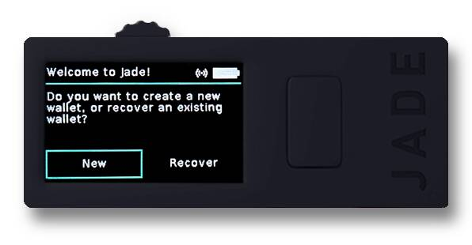

Registra la frase di recupero offline su carta (o utilizzando un dispositivo di backup dedicato per la frase di recupero per una sicurezza extra). Quindi, utilizza la rotella di scorrimento o il pulsante di scelta in cima a Jade per verificare la tua frase di recupero. Questo passaggio assicura che tu l'abbia scritta correttamente.

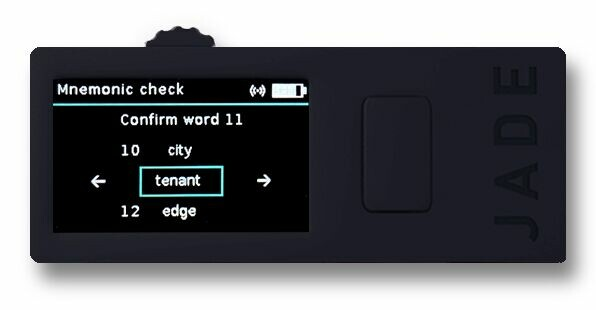

Imposta e conferma il tuo PIN a sei cifre. Questo viene utilizzato per sbloccare Blockstream Jade ogni volta che accedi al tuo portafoglio.

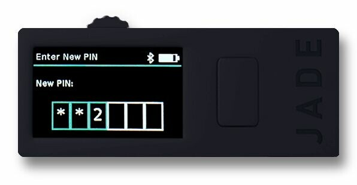

Ora, semplicemente seleziona Vai al portafoglio sull'app desktop Green e vedrai il tuo portafoglio aperto su Blockstream Green. Blockstream Jade mostrerà anche che è Pronto! Ora puoi utilizzare Jade per inviare e ricevere transazioni Bitcoin.

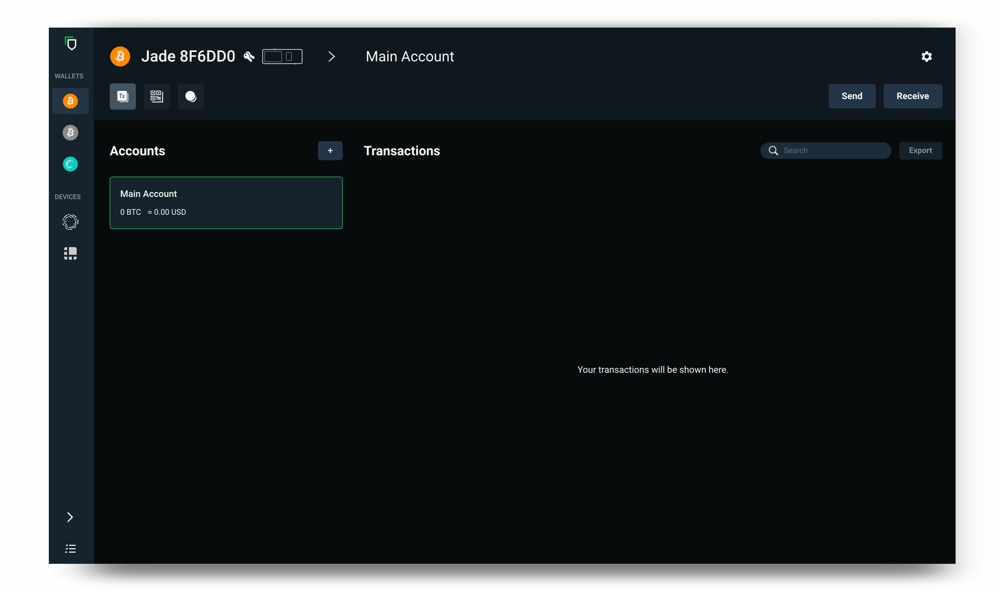

Dopo aver finito di utilizzare il tuo portafoglio, scollega Blockstream Jade dal tuo dispositivo. La prossima volta che desideri utilizzare il portafoglio su Blockstream Jade, ricollega semplicemente il tuo dispositivo e segui le istruzioni.

fonte: https://help.blockstream.com/hc/en-us/articles/17478506300825

### Appendice A - Verifica del file di download di Green Wallet

Verificare il download significa verificare che il file scaricato non sia stato modificato dopo essere stato rilasciato dallo sviluppatore.
Facciamo questo controllando che la firma (prodotta dalla chiave privata dello sviluppatore) insieme al file scaricato e alla chiave pubblica dello sviluppatore restituiscano un risultato TRUE quando passano attraverso la funzione gpg –verify. Ti mostrerò come fare questo dopo. Se vuoi conoscere il contesto di questo, ho questa guida e questa.

Prima di tutto, otteniamo la chiave di firma:

Per Linux, apri il terminale e esegui questo comando (dovresti semplicemente copiare e incollare il testo e includere le virgolette):

```bash
gpg --keyserver keyserver.ubuntu.com --recv-keys "04BE BF2E 35A2 AF2F FDF1 FA5D E7F0 54AA 2E76 E792"
```

Per Mac, fai la stessa cosa, tranne che dovrai scaricare e installare GPG Suite prima.

Per Windows, fai la stessa cosa, tranne che dovrai scaricare e installare GPG4Win prima.

Riceverai un output che indica che la chiave pubblica è stata importata.

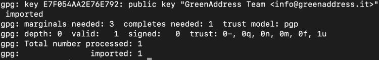

Questa immagine ha un attributo alt vuoto; il nome del file è image-3-1024x162.jpeg

Successivamente, dobbiamo ottenere il file contenente l'hash del software. È archiviato sulla pagina GitHub di Blockstream. Prima vai alla loro pagina delle informazioni qui e fai clic sul link per "desktop". Ti porterà alla pagina dell'ultima versione su GitHub e lì vedrai un link al file SHA256SUMS.asc, che è un documento di testo contenente l'hash pubblicato da Blockstream del programma che abbiamo scaricato.

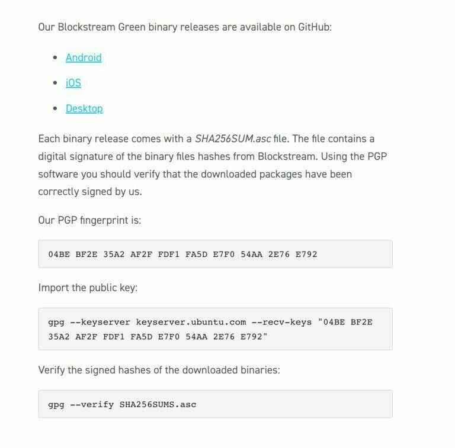

GitHub:


Non è necessario, ma dopo aver salvato su disco, ho rinominato "SHA256SUMS.asc" in "SHA256.txt" per aprire più facilmente il file su Mac utilizzando l'editor di testo. Questo era il contenuto del file:

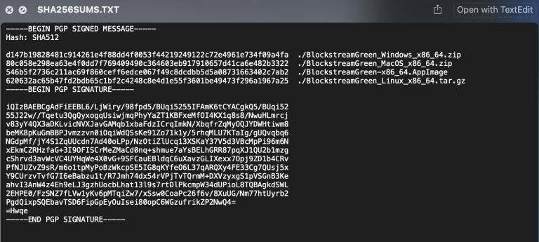

Il testo che ci interessa si trova in cima. A seconda del file che abbiamo scaricato, c'è un output di hash corrispondente che confrontiamo successivamente.

La parte inferiore del documento contiene la firma effettuata sul messaggio sopra - è un file due in uno.

L'ordine non importa, ma prima di controllare l'hash, verificheremo che il messaggio di hash sia autentico (cioè non sia stato manomesso).

Apri il terminale. Devi trovarti nella directory corretta in cui è stato scaricato il file SHA256SUMS.asc. Supponendo che tu l'abbia scaricato nella directory "Downloads", per Linux e Mac, cambia directory in questo modo (sensibile alle maiuscole):

```bash
cd Downloads
```

Naturalmente, devi premere <invio> dopo questi comandi. Per Windows, apri CMD (prompt dei comandi) e digita la stessa cosa (anche se non è sensibile alle maiuscole).

Per Windows e Mac, è necessario aver già scaricato GPG4Win e GPG Suite, rispettivamente, come indicato in precedenza. Per Linux, gpg viene fornito con il sistema operativo. Da Terminal (o CMD per Windows), digita questo comando:

```bash
gpg --verify SHA256SUMS.asc
```

L'ortografia esatta del nome del file (in rosso) potrebbe essere diversa nel giorno in cui scarichi il file, quindi assicurati che il comando corrisponda al nome del file scaricato. Dovresti ottenere questo output e ignorare l'avviso sulla firma attendibile: questo significa solo che non hai comunicato manualmente al computer che ti fidi della chiave pubblica che abbiamo importato in precedenza.

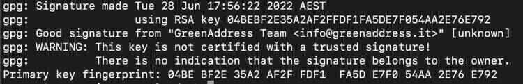

Questa immagine ha un attributo alt vuoto; il nome del file è image-4-1024x165.jpeg
Questo output conferma che la firma è valida e siamo sicuri che la chiave privata di "info@greenaddress.it" abbia firmato i dati (il rapporto hash).
Ora dovremmo eseguire l'hash del nostro file zip scaricato e confrontare l'output come pubblicato. Nota che nel file SHA256SUMS.asc c'è un po' di testo che dice "Hash: SHA512", il che mi confonde, poiché il file ha chiaramente output SHA256 al suo interno, quindi lo ignorerò.

Per Mac e Linux, apri il terminale, vai nella cartella in cui è stato scaricato il file zip (probabilmente dovrai digitare "cd Downloads" di nuovo, a meno che non tu abbia chiuso il terminale da allora). A proposito, puoi sempre verificare in quale directory ti trovi digitando PWD ("print working directory"), e se tutto ciò è straniero, è utile guardare un breve video su YouTube cercando "come navigare nel sistema di file Linux/Mac/Windows".

Per eseguire l'hash del file, digita questo:

```bash
shasum -a 256 BlockstreamGreen_MacOS_x86_64.zip
```

Dovresti verificare come si chiama esattamente il tuo file e modificare il testo in blu sopra se necessario.

Otterrai un output simile a questo (il tuo sarà diverso se il file è diverso dal mio):

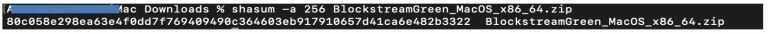

Successivamente, confronta visivamente l'output dell'hash con quello presente nel file SHA256SUMS.asc. Se corrispondono, allora -> SUCCESSO! Congratulazioni.

fonte: https://armantheparman.com/jade/

### Utilizzarlo su Sparrow

Se sai già come utilizzare Sparrow, allora è come sempre:

> Nota: è lo stesso processo con Specter, ad esempio

Scarica Sparrow utilizzando il link fornito qui.

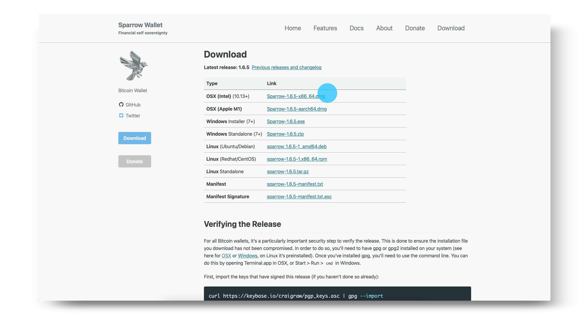

Clicca su Avanti per seguire la guida di configurazione e conoscere le diverse opzioni di connessione.

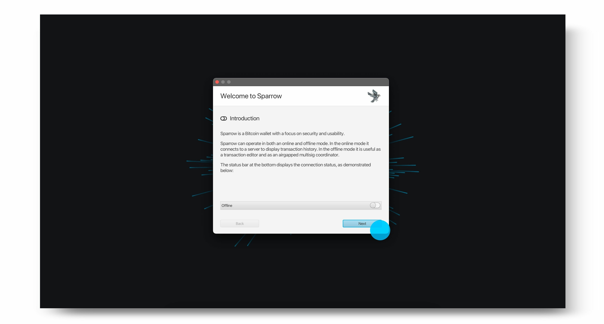

Scegli il server desiderato, quindi seleziona Crea nuovo portafoglio.

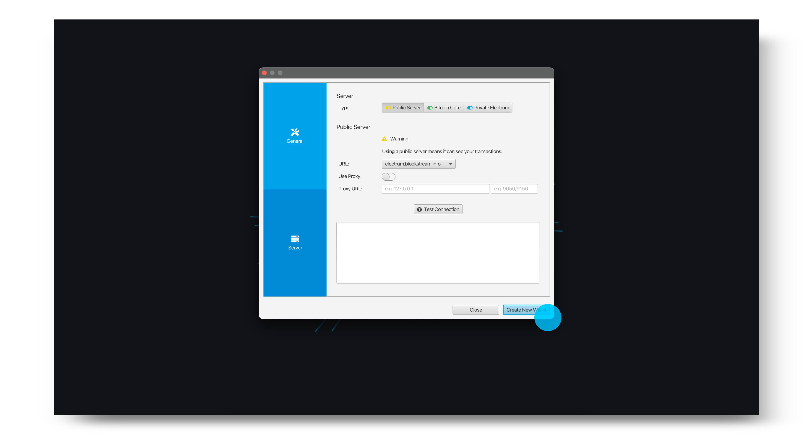

Inserisci un nome per il tuo portafoglio e clicca su Crea portafoglio.

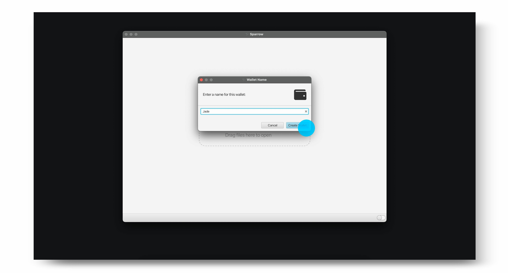

Scegli il tipo di politica e script desiderati, quindi seleziona Connected Hardware Wallet.

> Nota: se hai già utilizzato Blockstream Jade come portafoglio Singlesig con Blockstream Green e desideri visualizzare le tue transazioni su Sparrow, assicurati che il tipo di script corrisponda al tipo di account che contiene i tuoi fondi in Green. Dovrai anche far corrispondere il percorso di derivazione.

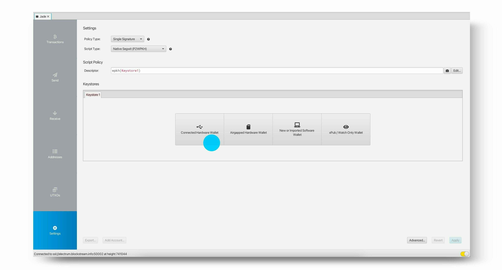

Collega il tuo Blockstream Jade e clicca su Scansiona. Verrà quindi richiesto di inserire il tuo PIN su Jade.

> Suggerimento: prima di collegare il tuo Jade, assicurati che l'app Blockstream Green non sia aperta. Se Green è aperto, potrebbe causare problemi con il rilevamento di Jade in Sparrow.

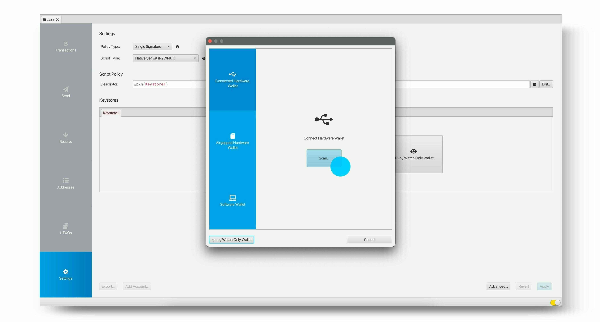

Seleziona Importa Keystore per importare la chiave pubblica dell'account predefinito, o seleziona la freccia per selezionare manualmente il percorso di derivazione che desideri utilizzare.

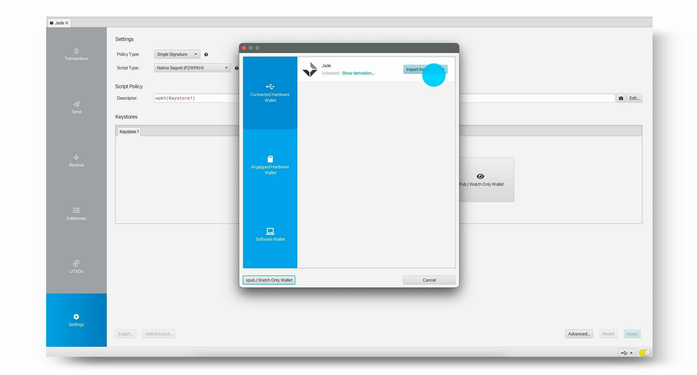

Dopo aver importato la chiave desiderata, clicca su Applica.

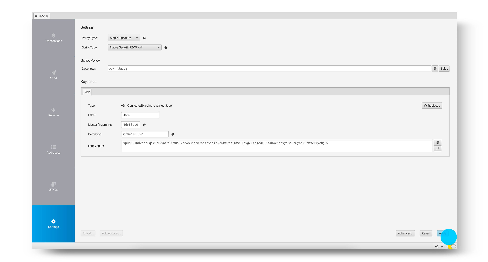

Hai ora configurato con successo il tuo portafoglio e puoi iniziare a ricevere, conservare e spendere i tuoi bitcoin utilizzando Sparrow e Blockstream Jade.

> Nota: se hai precedentemente utilizzato Jade con Blockstream Green come portafoglio Multisig Shield, non dovresti aspettarti che il tuo nuovo portafoglio Sparrow mostri lo stesso saldo: si tratta di portafogli diversi. Per accedere nuovamente al tuo portafoglio Multisig Shield, collega semplicemente il tuo Jade a Blockstream Green.

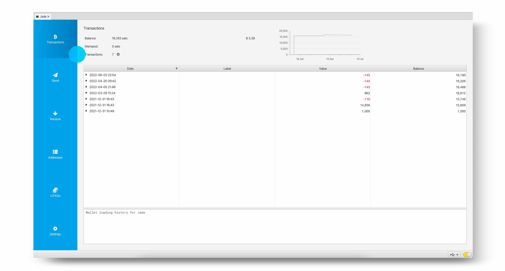
source: https://help.blockstream.com/hc/en-us/articles/7559912660761-How-do-I-use-Blockstream-Jade-with-Sparrow-

### app verde

se preferisci una guida mobile, puoi utilizzarla con blockstream green

- Come configurare Blockstream Jade con Green | Blockstream Jade - https://youtu.be/7aacxnc6DHg

- Come ricevere bitcoin su un portafoglio Jade | Blockstream Jade - https://youtu.be/CVtcDdiPqLA
