## チュートリアル動画


Blockstream Jade - モバイルビットコインハードウェアウォレットの完全チュートリアル by BTCsession

## 完全なライティングガイド

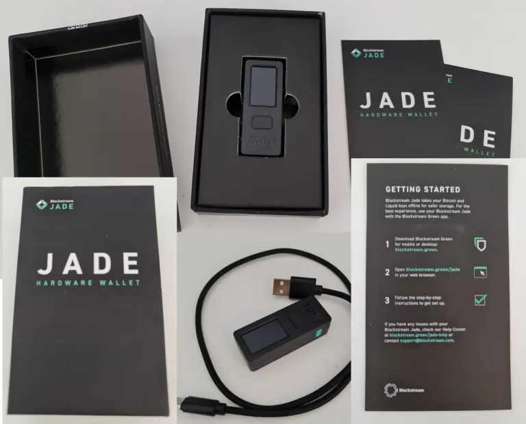

### 前提条件

1. Blockstream Greenの最新バージョンをダウンロードしてください。

2. コンピューターがJadeを認識するように、このドライバーをインストールしてください。

### デスクトップセットアップ


Blockstream Greenを開き、デバイスの下にあるBlockstreamロゴをクリックしてください。


付属のUSBケーブルを使用して、Jadeをデスクトップに接続してください。

> 注意: コンピューターがJadeを認識しない場合は、こちらのガイドにあるドライバーをダウンロードしてください。

JadeがGreenに表示されたら、「アップデートを確認」をクリックし、最新のファームウェアバージョンを選択してアップデートしてください。Jadeのスクロールホイールまたはトグルを使用して確認し、アップデートを続行してください。「初期化」ボタンが表示されていることを確認してください。そうでない場合は、セットアップ後にアップグレードを待つ必要があります。必要に応じて、この画面に戻るために戻るボタンを使用してください。

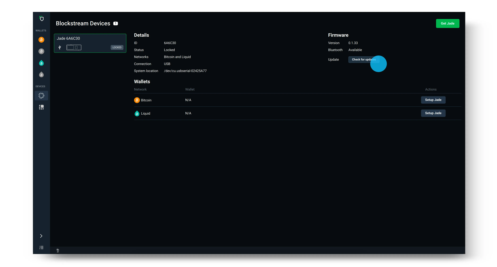

Jadeのファームウェアをアップデートした後、使用したいネットワークとセキュリティポリシーでJadeのセットアップを選択してください。

> ヒント: セキュリティポリシーは、以下に示すログイン画面の「タイプ」の下にリストされています。SinglesigまたはMultisig Shieldを選択するかどうか不確かな場合は、こちらのガイドをご覧ください。(https://help.blockstream.com/hc/en-us/articles/4403642609433)


次に、新しいウォレットを作成を選択し、12語でリカバリーフレーズを生成してください。「詳細」をクリックすると、12語と24語のリカバリーフレーズのオプションが提供されます。


リカバリーフレーズを紙にオフラインで記録してください（または、追加のセキュリティのために専用のリカバリーフレーズバックアップデバイスを使用してください）。次に、Jadeの上部にあるホイールまたはトグルを使用して、リカバリーフレーズを確認してください。このステップは、正しく書き留めたことを確認するためです。

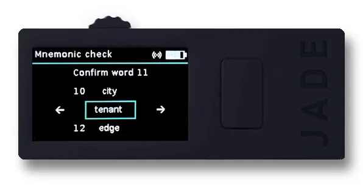

6桁のPINを設定して確認してください。これは、ウォレットにログインするたびにBlockstream Jadeのロックを解除するために使用されます。

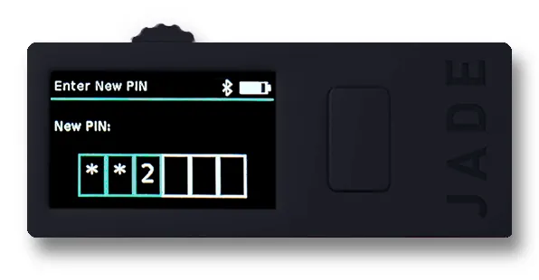

これで、Greenデスクトップアプリで「ウォレットに移動」を選択するだけで、Blockstream Greenでウォレットが開きます。Blockstream Jadeも「準備完了！」と表示されます。これで、Jadeを使用してビットコインの取引を送受信することができます。

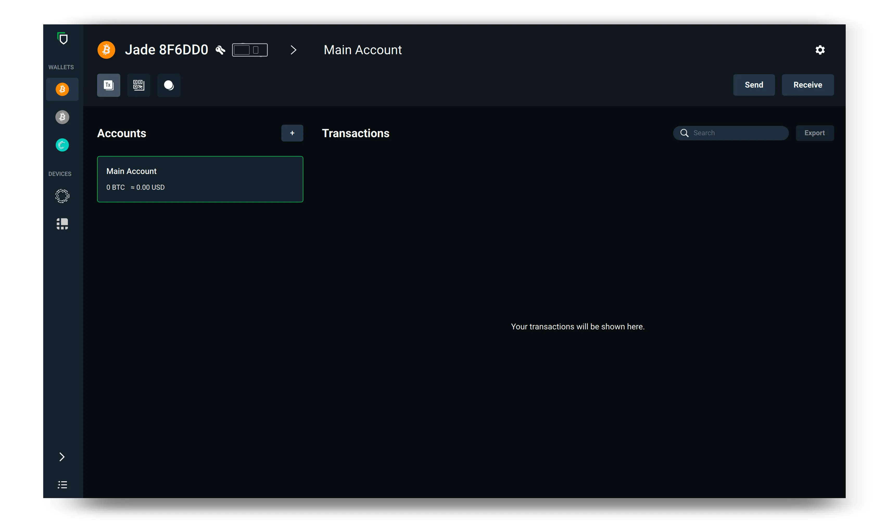

ウォレットの使用を終えたら、デバイスからBlockstream Jadeを切断してください。次にBlockstream Jadeでウォレットを使用したい場合は、デバイスを再接続して表示されるプロンプトに従ってください。

ソース: https://help.blockstream.com/hc/en-us/articles/17478506300825

### 付録A - Green Walletダウンロードファイルの検証

ダウンロードの検証とは、ダウンロードしたファイルが開発者によってリリースされてから変更されていないことを確認することを意味します。

これを行うには、開発者の秘密鍵によって生成された署名とダウンロードしたファイル、および開発者の公開鍵がgpg –verify関数を通過したときにTRUEの結果を返すことを確認します。次に、その方法を示します。この背景について学びたい場合は、このガイドとこのガイドがあります。

まず、署名キーを取得します：
Linuxの場合、ターミナルを開き、このコマンドを実行してください（テキストをコピー＆ペーストし、引用符を含めてください）:
```bash
gpg --keyserver keyserver.ubuntu.com --recv-keys "04BE BF2E 35A2 AF2F FDF1 FA5D E7F0 54AA 2E76 E792"
```

Macの場合、同じことを行いますが、先にGPG Suiteをダウンロードしてインストールする必要があります。

Windowsの場合も同様ですが、先にGPG4Winをダウンロードしてインストールする必要があります。

公開キーがインポートされたという出力が得られます。


この画像はalt属性が空です。ファイル名はimage-3-1024x162.webpです。

次に、ソフトウェアのハッシュを含むファイルを取得する必要があります。それはBlockstreamのGitHubページに保存されています。まずこちらの情報ページにアクセスし、「デスクトップ」のリンクをクリックします。それによりGitHubの最新リリースページに移動し、そこでSHA256SUMS.ascファイルへのリンクが表示されます。これは、ダウンロードしたプログラムのBlockstreamが公開したハッシュを含むテキストドキュメントです。

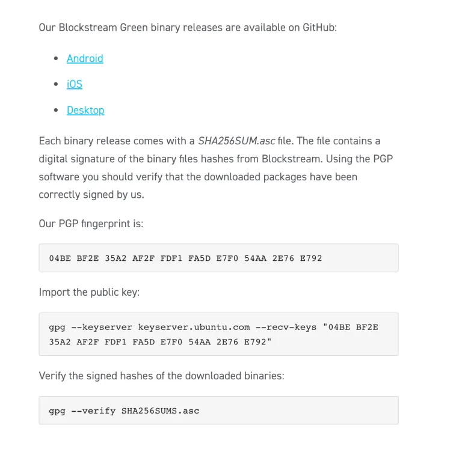

GitHub:


必須ではありませんが、ディスクに保存した後、Macでテキストエディタを使用してファイルを簡単に開くために、「SHA256SUMS.asc」を「SHA256.txt」に名前を変更しました。これがファイルの内容です：


私たちが探しているテキストは上部にあります。ダウンロードしたファイルに応じて、後で比較する対応するハッシュ出力があります。

ドキュメントの下部には、上記のメッセージに対して行われた署名が含まれています - それは一つのファイルに二つの機能を持っています。

順番は関係ありませんが、ハッシュをチェックする前に、ハッシュメッセージが本物である（つまり、改ざんされていない）ことを確認します。

ターミナルを開きます。SHA256SUMS.ascファイルがダウンロードされた正しいディレクトリにいる必要があります。LinuxとMacの場合、「Downloads」ディレクトリにダウンロードしたと仮定して、このようにディレクトリを変更します（大文字小文字を区別します）:

```bash
cd Downloads
```

もちろん、これらのコマンドの後には<enter>を押す必要があります。Windowsの場合、CMD（コマンドプロンプト）を開き、同じことをタイプします（ただし、大文字小文字は区別されません）。

WindowsとMacの場合、先に指示された通りにGPG4WinとGPG Suiteをダウンロードしてインストールしておく必要があります。Linuxの場合、gpgはオペレーティングシステムに付属しています。ターミナル（またはWindowsの場合はCMD）から、このコマンドをタイプします:

```bash
gpg --verify SHA256SUMS.asc
```

ファイル名（赤字）の正確なスペルは、ファイルを取得する日によって異なる場合があるので、ダウンロードしたファイル名とコマンドが一致するようにしてください。この出力が得られ、信頼された署名に関する警告は無視してください - これは、以前にインポートした公開キーをコンピュータに手動で信頼していないことを意味します。

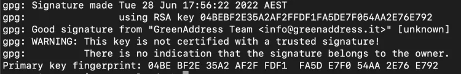

この画像はalt属性が空です。ファイル名はimage-4-1024x165.webpです。

この出力は署名が良好であることを確認し、私たちは「info@greenaddress.it」のプライベートキーがデータ（ハッシュレポート）に署名したことに自信を持っています。
ダウンロードしたzipファイルをハッシュ化し、公開されている出力と比較する必要があります。SHA256SUMS.ascファイルには「Hash: SHA512」というテキストがありますが、ファイル内には明らかにSHA256の出力が含まれているため、これには混乱しますが、無視することにします。

MacとLinuxでは、ターミナルを開き、zipファイルがダウンロードされた場所に移動します（おそらく「cd Downloads」と再度入力する必要がありますが、ターミナルを閉じていない限りです）。ちなみに、現在いるディレクトリを確認するには、PWD（「print working directory」）と入力します。そして、これがすべて未知の場合は、「Linux/Mac/Windowsファイルシステムの操作方法」を検索してYouTubeの短いビデオを見ると役立ちます。

ファイルをハッシュ化するには、次のように入力します：

```bash
shasum -a 256 BlockstreamGreen_MacOS_x86_64.zip
```

ファイルの正確な名前を確認し、必要に応じて上記の青いテキストを変更してください。

このような出力が得られます（ファイルが私のものと異なる場合は、あなたのものも異なります）：

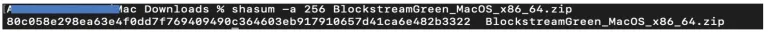

次に、ハッシュ出力をSHA256SUMS.ascファイル内のものと視覚的に比較します。一致すれば、成功です！おめでとうございます。

source: https://armantheparman.com/jade/

### Sparrowでの使用

すでにSparrowの使用方法を知っている場合は、いつもの通りです：

> 注意：例えばSpecterでも同じプロセスです

ここで提供されているリンクを使用してSparrowをダウンロードします。

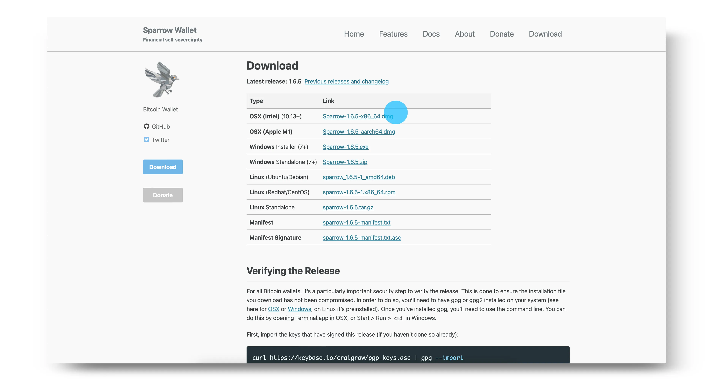

セットアップガイドに従って次へをクリックし、異なる接続オプションについて学びます。

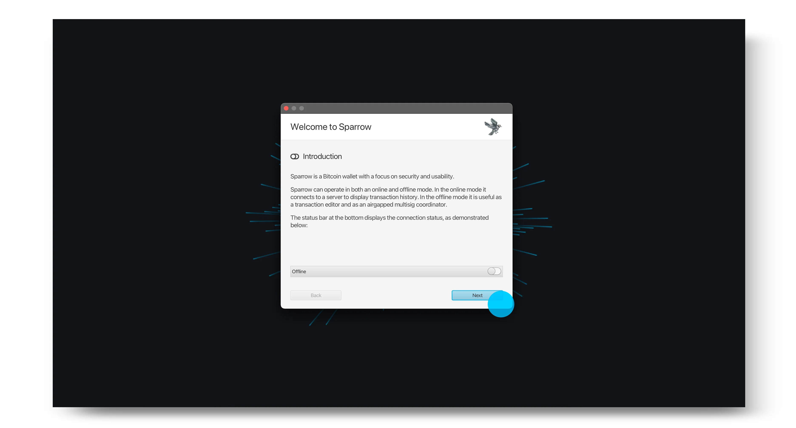

希望するサーバーを選択し、新しいウォレットを作成を選択します。


ウォレットに名前を入力し、ウォレットを作成をクリックします。

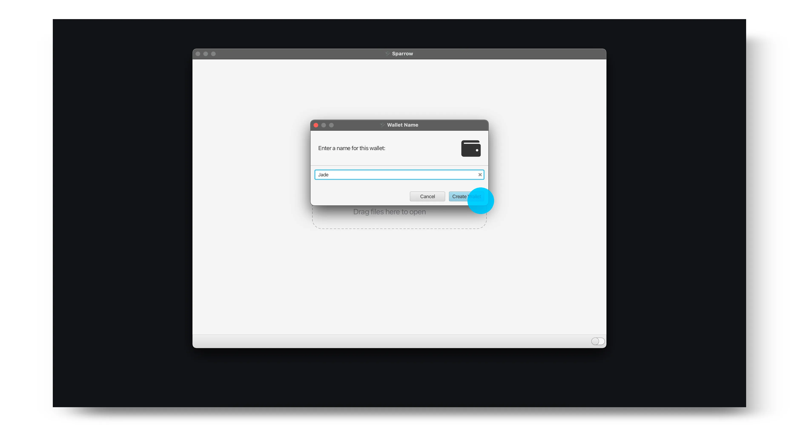

希望するポリシーとスクリプトタイプを選択し、接続されたハードウェアウォレットを選択します。

> 注意：以前にBlockstream GreenでSinglesigウォレットとしてBlockstream Jadeを使用していた場合、Sparrowでトランザクションを表示したい場合は、スクリプトタイプがGreen内の資金が含まれているアカウントタイプと一致していることを確認してください。また、導出パスも一致させる必要があります。

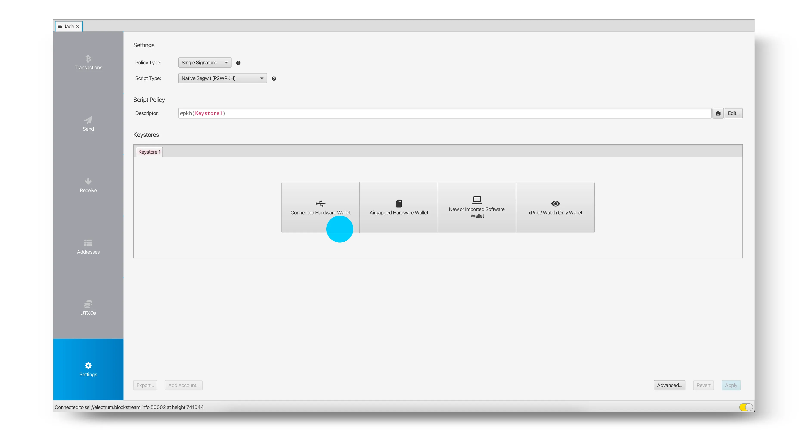

Blockstream Jadeを接続し、スキャンをクリックします。その後、Jade上でPINを入力するように求められます。

> ヒント：Jadeを接続する前に、Blockstream Greenアプリが開いていないことを確認してください。Greenが開いている場合、Sparrow内でJadeが検出されない問題が発生する可能性があります。


デフォルトアカウントの公開鍵をインポートするためにキーストアをインポートを選択するか、使用したい導出パスを手動で選択するために矢印を選択します。

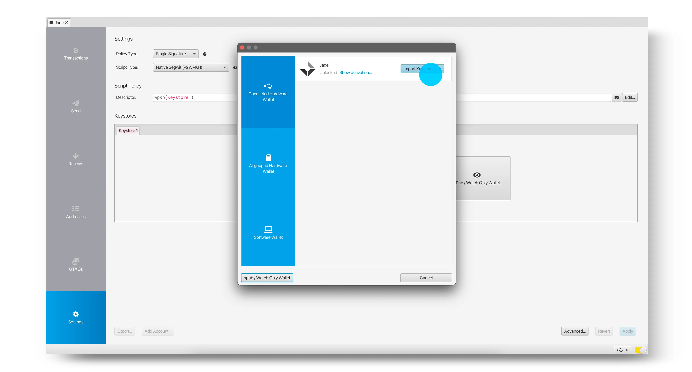

希望するキーがインポートされた後、適用をクリックします。

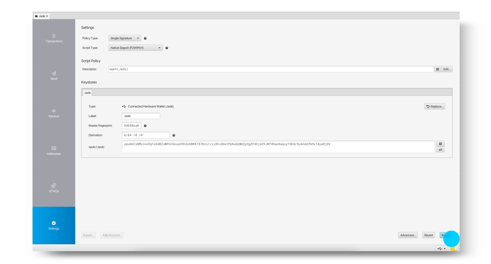

これでウォレットの設定が完了し、SparrowとBlockstream Jadeを使用してビットコインの受け取り、保管、支出を開始できます。

> 注意：以前にBlockstream GreenでJadeをMultisig Shieldウォレットとして使用していた場合、新しいSparrowウォレットが同じ残高を表示することは期待しないでください - これらは異なるウォレットです。Multisig Shieldウォレットに再度アクセスするには、単にJadeをBlockstream Greenに再接続してください。


source: https://help.blockstream.com/hc/en-us/articles/7559912660761-How-do-I-use-Blockstream-Jade-with-Sparrow-
もしモバイルをより多く使う方であれば、blockstream greenと一緒に使用することができます。
- Blockstream JadeをGreenとセットアップする方法 | Blockstream Jade - https://youtu.be/7aacxnc6DHg

- Jadeウォレットにビットコインを受け取る方法 | Blockstream Jade - https://youtu.be/CVtcDdiPqLA