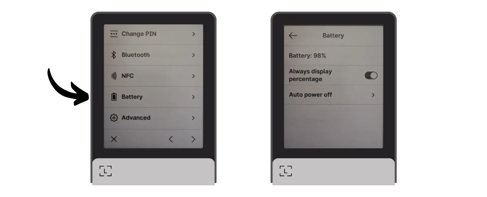
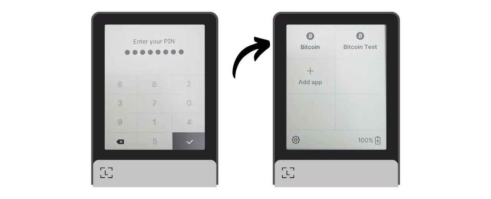

Hardwarová peněženka je elektronické zařízení určené k správě a zabezpečení privátních klíčů Bitcoinové peněženky. Na rozdíl od softwarových peněženek (neboli hot wallets) instalovaných na všeobecně používaných zařízeních často připojených k internetu, hardwarové peněženky umožňují fyzickou izolaci privátních klíčů, čímž snižují rizika hackování a krádeže.

Hlavním cílem hardwarové peněženky je minimalizovat funkce zařízení, aby se snížila jeho útočná plocha. Menší útočná plocha také znamená méně potenciálních útočných vektorů, tj. méně slabých míst v systému, které by útočníci mohli využít k získání přístupu k bitcoinům.

Je doporučeno používat hardwarovou peněženku k zabezpečení vašich bitcoinů, zejména pokud držíte významné množství, ať už v absolutní hodnotě nebo jako procento vašich celkových aktiv.

Hardwarové peněženky se používají ve spojení se softwarem pro správu peněženek na počítači nebo chytrém telefonu. Tento software spravuje vytváření transakcí, ale kryptografický podpis nezbytný k ověření těchto transakcí se provádí pouze v rámci hardwarové peněženky. To znamená, že privátní klíče nejsou nikdy vystaveny potenciálně zranitelnému prostředí.

Hardwarové peněženky nabízejí dvojí ochranu uživatele: na jedné straně zabezpečují vaše bitcoiny proti vzdáleným útokům tím, že udržují privátní klíče offline, a na druhé straně obvykle nabízejí lepší fyzickou odolnost proti pokusům o extrakci klíčů. A právě na těchto 2 bezpečnostních kritériích lze posuzovat a řadit různé dostupné modely na trhu.

V tomto tutoriálu navrhuji objevit jedno z těchto řešení: **Ledger Flex**.

## Úvod do Ledger Flex

Ledger Flex je hardwarová peněženka vyrobená francouzskou společností Ledger, prodávaná za cenu 249 €.

Je vybavena velkým dotykovým displejem E Ink, technologií černobílého zobrazení. Jedná se o stejnou technologii, která se nachází v elektronických čtečkách. Displej E Ink umožňuje jasné a čitelné zobrazení, i na přímém slunci, a spotřebovává velmi málo energie, nebo žádnou, když je obrazovka statická. Funguje na principu použití mikrokapslí obsahujících černé a bílé pigmentové částice. Při aplikaci elektrického náboje se černé nebo bílé částice pohybují na povrch obrazovky, čímž se tvoří text nebo obrázky.
Ledger Flex je vybaven čipem "secure element" certifikovaným CC EAL6+, který vám nabízí pokročilou ochranu proti fyzickým útokům na hardware. Obrazovka je přímo řízena tímto čipem. Běžným bodem kritiky je, že kód pro tento čip není open-source, což vyžaduje určitou úroveň důvěry v integritu této komponenty. Tento prvek je však auditován nezávislými odborníky.

Z hlediska použití nabízí Ledger Flex několik možností připojení: Bluetooth, USB-C a NFC. Velký displej umožňuje snadnou verifikaci detailů vaší transakce. Ledger se také odlišuje od svých konkurentů rychlým přijímáním nových funkcí Bitcoinu, jako je například Miniscript.

Po otestování jsem ohromen kvalitou produktu. Uživatelská zkušenost je vynikající a zařízení je intuitivní. Je to vynikající hardwarová peněženka. Má však podle mého názoru 2 hlavní nevýhody: nemožnost ověřit kód čipu a samozřejmě jeho cena, která je výrazně vyšší než u konkurence. Pro srovnání, nejpokročilejší model od společnosti Foundation se prodává za 199 $, Coinkite za 219,99 $, zatímco nejnovější Trezor, také vybavený velkým dotykovým displejem, je nabízen za 169 €.

## Jak koupit Ledger Flex?
Ledger Flex je k dispozici k nákupu [na oficiálních stránkách](https://shop.ledger.com/pages/ledger-flex). Pokud jej chcete koupit v kamenném obchodě, můžete také najít [seznam certifikovaných prodejců](https://www.ledger.com/reseller) na webových stránkách Ledger.
## Předpoklady

Jakmile obdržíte svůj Ledger Flex, prvním krokem je prohlédnout balení, abyste se ujistili, že nebylo otevřeno.

Balení Ledgeru by mělo obsahovat 2 pečetící proužky. Pokud tyto proužky chybí nebo jsou poškozené, může to znamenat, že hardwarová peněženka byla kompromitována a nemusí být autentická.

Po otevření byste měli v krabici najít následující položky:
- Ledger Flex;
- Kabel USB-C;
- Uživatelský manuál;
- Karty pro zápis vaší mnemonické fráze.

Pro tento tutoriál budete potřebovat 2 kusy softwaru: Ledger Live pro inicializaci Ledger Flex a Sparrow Wallet pro správu vaší Bitcoin peněženky. Stáhněte si [Ledger Live](https://www.ledger.com/ledger-live) a [Sparrow Wallet](https://sparrowwallet.com/download/) z jejich oficiálních webových stránek.

Brzy nabídneme tutoriál, jak ověřit pravost a integritu softwaru, který si stáhnete. Zde pro Ledger Live a Sparrow to silně doporučuji.
## Jak inicializovat Ledger Flex s Ledger Live?

Zapněte svůj Ledger Flex stisknutím pravého bočního tlačítka na několik sekund.

Projděte si různé úvodní stránky.

Vyberte možnost "*Nastavit bez Ledger Live*", poté klikněte na tlačítko "*Přeskočit Ledger Live*".

Poté budete vyzváni k zvolení názvu pro váš Ledger. Klikněte na "*Nastavit název*", a poté zadejte název dle vašeho výběru.

Vyberte PIN kód pro vaše zařízení, který bude použit k odemčení vašeho Ledgeru. Jedná se tedy o ochranu proti neoprávněnému fyzickému přístupu. Tento PIN kód nehraje roli v odvození kryptografických klíčů vaší peněženky. Tedy i bez přístupu k tomuto PIN kódu, pokud máte vaši 24-slovnou mnemonickou frázi, budete moci znovu získat přístup k vašim bitcoinům.

Doporučuje se vybrat 8-místný PIN kód, co nejvíce náhodný. Také se ujistěte, že tento kód uložíte na jiném místě, než kde je uložen váš Ledger Flex (například v manažeru hesel).

Zadejte svůj PIN kód podruhé pro jeho potvrzení.

Poté budete vyzváni k výběru mezi obnovením existující peněženky nebo vytvořením nové. V tomto tutoriálu se zabýváme vytvořením nové peněženky od začátku, takže vyberte možnost "*Nastavit jako nový Ledger*", abyste vygenerovali novou mnemonickou frázi.

Flex vám poskytne instrukce, jak spravovat vaši obnovovací frázi.
**Tato mnemonická fráze poskytuje úplný a neomezený přístup ke všem vašim bitcoinům**. Každý, kdo je v držení této fráze, může ukrást vaše prostředky, i bez fyzického přístupu k vašemu Ledgeru. Fráze o 24 slovech umožňuje obnovit přístup k vašim bitcoinům v případě ztráty, krádeže nebo poškození vašeho Ledger Flex. Je proto velmi důležité pečlivě ji uložit a uschovat na bezpečném místě.
Můžete si ji zapsat na kartonový papír, který je součástí balení vašeho Ledgeru, nebo pro zvýšení bezpečnosti doporučuji vyrytí na médium z nerezové oceli, aby byla chráněna proti rizikům požárů, záplav nebo zřícení.

Procházení těchto instrukcí a přeskakování stránek můžete provádět dotykem obrazovky.

Ledger vytvoří vaši mnemonickou frázi pomocí generátoru náhodných čísel. Ujistěte se, že vás při této operaci nikdo nepozoruje. Slova poskytnutá Ledgerem si zapište na fyzické médium dle vašeho výběru. V závislosti na vaší bezpečnostní strategii byste mohli zvážit vytvoření několika úplných fyzických kopií fráze (ale především ji nerozdělujte). Je důležité udržet slova číslovaná a v sekvenčním pořadí.
***Samozřejmě, nikdy byste tato slova neměli sdílet na internetu, na rozdíl od toho, co dělám v tomto tutoriálu. Tato ukázková peněženka bude použita pouze na Testnetu a na konci tutoriálu bude smazána.***

Pro přechod k další skupině slov klikněte na tlačítko "*Další*". Jakmile budou všechna slova zaznamenána, klikněte na tlačítko "*Hotovo*", abyste pokračovali k dalšímu kroku.

Klikněte na tlačítko "*Začít potvrzení*", poté vyberte slova z vaší mnemonické fráze v jejich pořadí, abyste potvrdili, že jste je správně zaznamenali. Tento postup pokračujte až do 24. slova.

Pokud fráze, kterou potvrzujete, přesně odpovídá té, kterou vám Flex poskytl v předchozím kroku, můžete pokračovat. Pokud ne, to znamená, že vaše fyzická záloha mnemonické fráze je nesprávná a musíte proces restartovat.

A máte to, váš seed byl správně vytvořen na vašem Ledger Flex. Než přejdeme k vytvoření nové Bitcoin peněženky z tohoto seedu, pojďme společně prozkoumat nastavení zařízení.

## Jak upravit nastavení vašeho Ledgeru?

Pro uzamčení a odemčení vašeho Ledgeru stiskněte boční tlačítko. Poté budete vyzváni k zadání PIN kódu, který jste nastavili v předchozím kroku.

Pro přístup k nastavením klikněte na symbol ozubeného kola v dolní levé části zařízení.

Menu "*Name*" vám umožní změnit název vašeho Ledgeru.

V "*About this Ledger*" najdete informace o vašem Flexu.

V menu "*Lock screen*" máte možnost změnit obrázek zobrazovaný na uzamykací obrazovce výběrem "*Customize lock screen picture*". Díky technologii E Ink obrazovky zařízení je možné nechat obrazovku neustále zapnutou bez spotřeby baterie. E Ink obrazovky nevyužívají energii k udržení statického obrazu. Spotřebují však energii při změnách zobrazení.
Submenu "*Auto-lock*" vám umožní nastavit a aktivovat automatické uzamčení vašeho Ledgeru po určité době nečinnosti.

Menu "*Zvuky*" vám umožňuje zapnout nebo vypnout zvuky vašeho Flexu. A v menu "*Jazyk*" můžete změnit jazyk zobrazení.

Kliknutím na pravou šipku můžete přistoupit k dalším nastavením. "*Změnit PIN*" vám umožní změnit váš PIN kód.

Menu "*Bluetooth*" a "*NFC*" vám umožní spravovat tyto komunikace.

V "*Baterie*" můžete nastavit automatické vypnutí Ledgeru.

Sekce "*Pokročilé*" vám dává přístup k sofistikovanějším bezpečnostním nastavením. Doporučuje se nechat aktivovanou možnost "*PIN shuffle*" pro zvýšení bezpečnosti. Také v tomto menu můžete nakonfigurovat BIP39 heslovou frázi.

Heslová fráze je volitelné heslo, které společně s obnovovací frází poskytuje další vrstvu zabezpečení pro vaši peněženku.

Aktuálně je vaše peněženka generována z mnemonické fráze skládající se ze 24 slov. Tato obnovovací fráze je velmi důležitá, protože vám umožňuje obnovit všechny klíče vaší peněženky v případě ztráty. Nicméně představuje jediný bod selhání (SPOF). Pokud je kompromitována, bitcoiny jsou v nebezpečí. Zde přichází na řadu heslová fráze. Je to volitelné heslo, které si můžete libovolně zvolit, a které se přidává k mnemonické frázi pro posílení zabezpečení peněženky.

Heslová fráze by neměla být zaměňována s PIN kódem. Hraje roli v derivaci vašich kryptografických klíčů. Funguje společně s mnemonickou frází, mění seed, ze kterého jsou klíče generovány. Takže i když někdo získá vaši 24slovní frázi, bez heslové fráze nemůže přistoupit k vašim finančním prostředkům. Použití heslové fráze v podstatě vytváří novou peněženku s odlišnými klíči. Modifikace (i mírná) heslové fráze vygeneruje odlišnou peněženku.

Heslová fráze je velmi mocným nástrojem pro zvýšení zabezpečení vašich bitcoinů. Je však velmi důležité pochopit, jak funguje, než ji implementujete, abyste se vyhnuli ztrátě přístupu k vaší peněžence. Jak používat heslovou frázi, vám vysvětlím v dalším specializovaném tutoriálu.

Nakonec, poslední stránka nastavení vám umožňuje resetovat váš Ledger. K tomuto resetu přistupte pouze v případě, že jste si jisti, že neobsahuje žádné klíče zabezpečující bitcoiny, protože byste mohli trvale ztratit přístup k vašim finančním prostředkům.

## Jak nainstalovat aplikaci Bitcoin?

Začněte spuštěním softwaru Ledger Live na vašem počítači, poté připojte a odemkněte váš Ledger Flex.

V Ledger Live přejděte do menu "*Můj Ledger*". Bude po vás požadováno, abyste autorizovali přístup k vašemu Flexu.

Přístup na vašem Ledgeru autorizujte kliknutím na tlačítko "*Povolit*".

Nejprve, pokud firmware vašeho Ledger Flexu není aktuální, Ledger Live vám automaticky nabídne jeho aktualizaci. V případě potřeby klikněte na "*Aktualizovat firmware*", poté na "*Instalovat aktualizaci*" pro zahájení instalace.

Na vašem Ledgeru klikněte na tlačítko "*Instalovat*", poté počkejte během instalace.

Firmware vašeho Ledger Flexu je nyní aktuální.
Pokud si přejete, můžete změnit tapetu uzamčené obrazovky vašeho Ledger Flex. K tomu klikněte na "*Přidat >*".

Klikněte na tlačítko "*Nahrát z počítače*" a vyberte si tapetu ze svých fotografií.

Můžete oříznout svůj obrázek.

Vyberte kontrast z různých možností, poté klikněte na "*Potvrdit kontrast*".

Na vašem Flexu klikněte na tlačítko "*Načíst obrázek*".

Pokud jste spokojeni s obrázkem, klikněte na "*Ponechat*", aby se nastavil jako tapeta uzamčené obrazovky.

Nakonec přidáme aplikaci Bitcoin. K tomu v Ledger Live klikněte na tlačítko "*Instalovat*" vedle "*Bitcoin (BTC)*".

Aplikace se nainstaluje na váš Flex.

Odteď už pro běžnou správu vaší peněženky nebudete potřebovat software Ledger Live. Můžete se k němu občas vrátit, aby jste aktualizovali firmware, když budou k dispozici nové verze. Pro vše ostatní budeme používat Sparrow Wallet, který je mnohem komplexnějším nástrojem pro efektivní správu Bitcoinové peněženky.

## Jak nastavit novou Bitcoinovou peněženku se Sparrow?
Otevřete Sparrow Wallet a přeskočte úvodní stránky, abyste se dostali na domovskou obrazovku. Zkontrolujte, že jste správně připojeni k uzlu tím, že si všimnete přepínače v pravém dolním rohu obrazovky.

Důrazně doporučuji používat vlastní Bitcoinový uzel. V tomto tutoriálu používám veřejný uzel (žlutý), protože jsem na testnetu, ale pro normální použití je lepší zvolit lokální Bitcoin Core (zelený) nebo Electrum server připojený k vzdálenému uzlu (modrý).

Klikněte na menu "*Soubor*" a poté "*Nová peněženka*".

Vyberte název pro tuto peněženku, poté klikněte na "*Vytvořit peněženku*".

V rozbalovacím menu "*Typ skriptu*" vyberte typ skriptu, který bude použit k zabezpečení vašich bitcoinů. Doporučuji zvolit "*Taproot*", nebo pokud není k dispozici, "*Native SegWit*".

Klikněte na tlačítko "*Připojená hardwarová peněženka*".

Připojte váš Ledger Flex k počítači, odemkněte ho pomocí vašeho PIN kódu, poté otevřete aplikaci "*Bitcoin*". V tomto tutoriálu používám aplikaci "*Bitcoin Testnet*", ale postup zůstává stejný pro hlavní síť.

Na Sparrow klikněte na tlačítko "*Skenovat*".

Poté klikněte na "*Importovat úložiště klíčů*".

Nyní můžete vidět detaily vaší peněženky, včetně rozšířeného veřejného klíče vašeho prvního účtu. Klikněte na tlačítko "*Použít*", abyste dokončili vytvoření peněženky.

Vyberte silné heslo pro zabezpečení přístupu k Sparrow Wallet. Toto heslo zajistí bezpečnost přístupu k vašim údajům v peněžence na Sparrow, což pomáhá chránit vaše veřejné klíče, adresy, popisky a historii transakcí proti jakémukoli neautorizovanému přístupu.

Doporučuji vám toto heslo uložit do správce hesel, abyste na něj nezapomněli.

A máte to, vaše peněženka je nyní vytvořena!

Před přijetím vašich prvních bitcoinů ve vaší peněžence vám důrazně doporučuji provést test obnovy bez skutečného použití (dry-run recovery test). Poznamenejte si referenční informaci, jako je váš xpub, poté resetujte váš Ledger Flex, zatímco je peněženka stále prázdná. Poté zkuste obnovit vaši peněženku na Ledgeru pomocí vašich papírových záloh. Zkontrolujte, zda se xpub vygenerovaný po obnově shoduje s tím, který jste si původně poznamenali. Pokud tomu tak je, můžete být ujištěni, že vaše papírové zálohy jsou spolehlivé.

## Jak přijímat bitcoiny s Ledger Flex?

Klikněte na záložku "*Receive*".

Připojte váš Ledger Flex k počítači, odemkněte ho pomocí vašeho PIN kódu, poté otevřete aplikaci "*Bitcoin*".

Před použitím adresy poskytnuté Sparrow Wallet ověřte ji na obrazovce vašeho Ledger Flex. Tato praxe vám umožní potvrdit, že adresa zobrazená na Sparrow není podvodná a že Ledger skutečně drží soukromý klíč potřebný k pozdějšímu vynaložení bitcoinů zabezpečených touto adresou.

Pro provedení tohoto ověření klikněte na tlačítko "*Display Address*".

Ujistěte se, že adresa zobrazená na vašem Ledger Flex odpovídá té, která je uvedena na Sparrow Wallet. Doporučuje se také provést toto ověření těsně před poskytnutím vaší adresy odesílateli, abyste si byli jisti její platností.

Můžete přidat "*Label*" pro popis zdroje bitcoinů, které budou s touto adresou zabezpečeny. To je dobrá praxe, která vám pomůže lépe spravovat vaše UTXO.

Pro více informací o označování doporučuji také zkontrolovat tento další tutoriál:

https://planb.network/tutorials/privacy/utxo-labelling

Poté můžete tuto adresu použít k přijetí bitcoinů.

## Jak posílat bitcoiny s Ledger Flex?

Nyní, když jste ve vaší peněžence zabezpečené Flexem přijali vaše první satoshi, můžete je také utratit! Připojte váš Ledger k počítači, odemkněte ho, spusťte Sparrow Wallet, poté přejděte na záložku "*Send*" pro sestavení nové transakce.

Pokud chcete provést "*coin control*", tedy specificky vybrat, která UTXO budou v transakci spotřebována, přejděte na záložku "*UTXOs*". Vyberte UTXO, které chcete utratit, poté klikněte na "*Send Selected*". Budete přesměrováni na stejnou obrazovku záložky "*Send*", ale s vašimi UTXO již vybranými pro transakci.

Zadejte cílovou adresu. Můžete také zadat více adres kliknutím na tlačítko "*+ Add*".

Poznamenejte si "*Label*", abyste si pamatovali účel této výdaje.

Vyberte částku, která bude odeslána na tuto adresu.

Upravte poplatek za transakci podle aktuálního tržního stavu.

Ujistěte se, že všechna nastavení vaší transakce jsou správná, a poté klikněte na "*Vytvořit transakci*".

Pokud je vše k vaší spokojenosti, klikněte na "*Finalizovat transakci k podpisu*".

Klikněte na "*Podepsat*".

Klikněte na "*Podepsat*" vedle vašeho Ledger Flex.

Ověřte nastavení transakce na obrazovce vašeho Flex, včetně adresy příjemce, odesílané částky a výše poplatku.

Pro podepsání podržte prst na tlačítku "*Držet pro podpis*".

Vaše transakce je nyní podepsaná. Klikněte na "*Odeslat transakci*" pro její vysílání v síti Bitcoin.

Najdete ji na záložce "*Transakce*" ve Sparrow Wallet.

Gratulujeme, nyní jste se seznámili se základním používáním Ledger Flex ve Sparrow Wallet! V budoucím tutoriálu se podíváme, jak používat Ledger Flex s Liana pro využití Miniscript.

Pokud se vám tento tutoriál zdál užitečný, ocenil bych palec nahoru níže. Neváhejte tento článek sdílet na vašich sociálních sítích. Velmi vám děkuji!