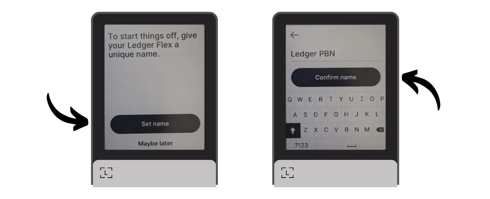
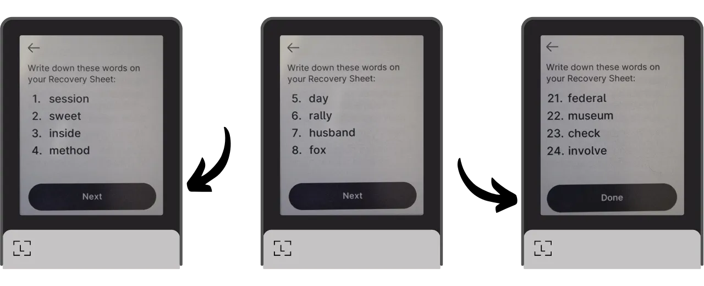

Eine Hardware-Wallet ist ein elektronisches Gerät, das speziell für die Verwaltung und Sicherung der privaten Schlüssel einer Bitcoin-Wallet entwickelt wurde. Im Gegensatz zu Software-Wallets (oder Hot Wallets), die auf allgemeinen Maschinen installiert sind, die oft mit dem Internet verbunden sind, ermöglichen Hardware-Wallets die physische Isolation der privaten Schlüssel, wodurch die Risiken von Hacking und Diebstahl verringert werden.

Das Hauptziel einer Hardware-Wallet ist es, die Funktionalitäten des Geräts zu minimieren, um seine Angriffsfläche zu reduzieren. Weniger Angriffsfläche bedeutet auch weniger potenzielle Angriffsvektoren, d. h. weniger Schwachstellen im System, die Angreifer ausnutzen könnten, um auf Bitcoins zuzugreifen.

Es wird empfohlen, eine Hardware-Wallet zu verwenden, um Ihre Bitcoins zu sichern, insbesondere wenn Sie bedeutende Mengen halten, sei es im absoluten Wert oder als Anteil an Ihren Gesamtvermögen.

Hardware-Wallets werden in Kombination mit Wallet-Management-Software auf einem Computer oder Smartphone verwendet. Diese Software verwaltet die Erstellung von Transaktionen, aber die kryptografische Signatur, die notwendig ist, um diese Transaktionen zu validieren, erfolgt nur innerhalb der Hardware-Wallet. Das bedeutet, dass die privaten Schlüssel nie einer potenziell gefährdeten Umgebung ausgesetzt sind.

Hardware-Wallets bieten dem Benutzer einen doppelten Schutz: einerseits sichern sie Ihre Bitcoins gegen Fernangriffe, indem sie die privaten Schlüssel offline halten, und andererseits bieten sie in der Regel eine bessere physische Widerstandsfähigkeit gegen Versuche, die Schlüssel zu extrahieren. Und genau anhand dieser 2 Sicherheitskriterien kann man die verschiedenen auf dem Markt erhältlichen Modelle beurteilen und einordnen.

In diesem Tutorial schlage ich vor, eine dieser Lösungen zu entdecken: den **Ledger Flex**.

## Einführung in den Ledger Flex

Der Ledger Flex ist eine Hardware-Wallet, die von der französischen Firma Ledger produziert wird und zu einem Preis von 249 € vermarktet wird.

Er verfügt über einen großen E Ink-Touchscreen, eine Schwarz-Weiß-Displaytechnologie. Dies ist dieselbe Technologie, die in elektronischen Lesegeräten zu finden ist. Der E Ink-Bildschirm ermöglicht eine klare und lesbare Anzeige, auch bei hellem Sonnenlicht, und verbraucht sehr wenig Energie oder gar keine, wenn der Bildschirm statisch ist. Er funktioniert durch die Verwendung von Mikrokapseln, die schwarze und weiße Pigmentpartikel enthalten. Wenn eine elektrische Ladung angelegt wird, bewegen sich die schwarzen oder weißen Partikel an die Oberfläche des Bildschirms, sodass Text oder Bilder gebildet werden können.
Der Ledger Flex ist mit einem CC EAL6+ zertifizierten "Secure Element"-Chip ausgestattet, der Ihnen fortschrittlichen Schutz gegen physische Angriffe auf die Hardware bietet. Der Bildschirm wird direkt von diesem Chip gesteuert. Ein häufiger Kritikpunkt ist, dass der Code für diesen Chip nicht Open-Source ist, was ein gewisses Vertrauensniveau in die Integrität dieser Komponente erfordert. Dieses Element wird jedoch von unabhängigen Experten geprüft.

In Bezug auf die Nutzung bietet der Ledger Flex mehrere Konnektivitätsoptionen: Bluetooth, USB-C und NFC. Der große Bildschirm erleichtert die Überprüfung Ihrer Transaktionsdetails. Ledger hebt sich auch von seinen Wettbewerbern durch seine schnelle Übernahme neuer Bitcoin-Funktionen ab, wie zum Beispiel Miniscript.

Nachdem ich es getestet habe, bin ich von der Qualität des Produkts beeindruckt. Die Benutzererfahrung ist ausgezeichnet und das Gerät intuitiv. Es ist eine hervorragende Hardware-Wallet. Allerdings hat es meiner Meinung nach 2 große Nachteile: die Unfähigkeit, den Code des Chips zu überprüfen und natürlich seinen Preis, der deutlich höher ist als bei seinen Konkurrenten. Zum Vergleich: Das fortschrittlichste Modell von Foundation wird für 199 $ verkauft, das von Coinkite für 219,99 $, während das neueste Trezor, ebenfalls mit einem großen Touchscreen ausgestattet, für 169 € angeboten wird.

## Wie kauft man einen Ledger Flex?
Der Ledger Flex ist [auf der offiziellen Website](https://shop.ledger.com/pages/ledger-flex) erhältlich. Um ihn in einem physischen Geschäft zu kaufen, können Sie auch [die Liste der zertifizierten Wiederverkäufer](https://www.ledger.com/reseller) auf der Ledger-Website finden.
## Voraussetzungen

Sobald Sie Ihren Ledger Flex erhalten haben, ist der erste Schritt, die Verpackung zu überprüfen, um sicherzustellen, dass sie nicht geöffnet wurde.

Die Verpackung des Ledger sollte 2 Siegelstreifen enthalten. Fehlen diese Streifen oder sind sie beschädigt, könnte dies darauf hinweisen, dass die Hardware-Wallet kompromittiert wurde und möglicherweise nicht authentisch ist.

Beim Öffnen sollten Sie die folgenden Gegenstände in der Box finden:
- Den Ledger Flex;
- Ein USB-C-Kabel;
- Eine Bedienungsanleitung;
- Karten zum Aufschreiben Ihrer mnemonischen Phrase.

Für dieses Tutorial benötigen Sie 2 Softwareprogramme: Ledger Live, um den Ledger Flex zu initialisieren, und Sparrow Wallet, um Ihre Bitcoin-Wallet zu verwalten. Laden Sie [Ledger Live](https://www.ledger.com/ledger-live) und [Sparrow Wallet](https://sparrowwallet.com/download/) von ihren offiziellen Websites herunter.

Wir werden bald ein Tutorial anbieten, wie man die Authentizität und Integrität von heruntergeladener Software überprüft. Ich rate dringend dazu, dies hier für Ledger Live und Sparrow zu tun.
## Wie initialisiert man einen Ledger Flex mit Ledger Live?

Schalten Sie Ihren Ledger Flex ein, indem Sie die rechte Seitentaste einige Sekunden lang drücken.

Blättern Sie durch die verschiedenen Einführungsseiten.

Wählen Sie die Option "*Ohne Ledger Live einrichten*", dann klicken Sie auf den Button "*Ledger Live überspringen*".

Dann werden Sie aufgefordert, einen Namen für Ihren Ledger zu wählen. Klicken Sie auf "*Namen festlegen*", und geben Sie dann den Namen Ihrer Wahl ein.

Wählen Sie den PIN-Code für Ihr Gerät, der zum Entsperren Ihres Ledger verwendet wird. Dies ist also ein Schutz gegen unbefugten physischen Zugriff. Dieser PIN-Code spielt keine Rolle bei der Ableitung der kryptografischen Schlüssel Ihrer Wallet. Somit können Sie auch ohne Zugang zu diesem PIN-Code, wenn Sie Ihre 24-Wort-mnemonische Phrase haben, wieder Zugang zu Ihren Bitcoins erhalten.

Es wird empfohlen, einen 8-stelligen PIN-Code zu wählen, so zufällig wie möglich. Stellen Sie außerdem sicher, dass Sie diesen Code an einem anderen Ort als dort, wo Ihr Ledger Flex aufbewahrt wird, speichern (zum Beispiel in einem Passwort-Manager).

Geben Sie Ihren PIN ein zweites Mal ein, um ihn zu bestätigen.

Dann werden Sie aufgefordert, zwischen der Wiederherstellung einer bestehenden Wallet oder der Erstellung einer neuen zu wählen. In diesem Tutorial behandeln wir die Erstellung einer neuen Wallet von Grund auf, wählen Sie also die Option "*Als neuen Ledger einrichten*", um eine neue mnemonische Phrase zu generieren.

Ihr Flex wird Anweisungen geben, wie Sie Ihre Wiederherstellungsphrase verwalten.
**Diese mnemonische Phrase gewährt vollständigen und uneingeschränkten Zugang zu all Ihren Bitcoins**. Jeder, der diese Phrase besitzt, kann Ihre Gelder stehlen, selbst ohne physischen Zugang zu Ihrem Ledger. Die 24-Wort-Phrase ermöglicht die Wiederherstellung des Zugangs zu Ihren Bitcoins im Falle eines Verlusts, Diebstahls oder einer Beschädigung Ihres Ledger Flex. Es ist daher sehr wichtig, sie sorgfältig zu sichern und an einem sicheren Ort aufzubewahren.
Sie können sie auf dem mit Ihrem Ledger gelieferten Kartonpapier notieren oder, für zusätzliche Sicherheit, empfehle ich, sie in ein Edelstahlmedium zu gravieren, um sie vor den Risiken von Feuern, Überschwemmungen oder Einstürzen zu schützen.

Sie können diese Anweisungen durchblättern und Seiten überspringen, indem Sie den Bildschirm berühren.

Der Ledger wird Ihre mnemonische Phrase mit seinem Zufallszahlengenerator erstellen. Stellen Sie sicher, dass Sie während dieser Operation nicht beobachtet werden. Schreiben Sie die vom Ledger bereitgestellten Wörter auf das physische Medium Ihrer Wahl. Abhängig von Ihrer Sicherheitsstrategie könnten Sie in Erwägung ziehen, mehrere vollständige physische Kopien der Phrase anzufertigen (aber vor allem, teilen Sie sie nicht auf). Es ist wichtig, die Wörter nummeriert und in sequenzieller Reihenfolge zu halten.
***Offensichtlich sollten Sie diese Wörter niemals im Internet teilen, im Gegensatz zu dem, was ich in diesem Tutorial mache. Dieses Beispiel-Wallet wird nur im Testnet verwendet und am Ende des Tutorials gelöscht.***

Um zur nächsten Gruppe von Wörtern zu gelangen, klicken Sie auf den "*Weiter*" Knopf. Sobald alle Wörter notiert sind, klicken Sie auf den "*Fertig*" Knopf, um zum nächsten Schritt überzugehen.

Klicken Sie auf den "*Start Bestätigung*" Knopf, dann wählen Sie die Wörter aus Ihrer mnemonischen Phrase in ihrer Reihenfolge aus, um zu bestätigen, dass Sie sie korrekt notiert haben. Fahren Sie mit diesem Verfahren fort, bis zum 24. Wort.

Wenn die Phrase, die Sie bestätigen, genau mit der übereinstimmt, die Ihnen der Flex im vorherigen Schritt gegeben hat, können Sie fortfahren. Wenn nicht, deutet dies darauf hin, dass Ihre physische Sicherungskopie der mnemonischen Phrase falsch ist und Sie den Prozess neu starten müssen.

Und da haben Sie es, Ihr Seed wurde korrekt auf Ihrem Ledger Flex erstellt. Bevor wir fortfahren, um ein neues Bitcoin-Wallet aus diesem Seed zu erstellen, lassen Sie uns gemeinsam die Geräteeinstellungen erkunden.

## Wie ändert man die Einstellungen Ihres Ledger?

Um Ihren Ledger zu sperren und zu entsperren, drücken Sie die Seitentaste. Dann werden Sie aufgefordert, den PIN-Code einzugeben, den Sie im vorherigen Schritt festgelegt haben.

Um auf die Einstellungen zuzugreifen, klicken Sie auf das Zahnradsymbol unten links auf Ihrem Gerät.

Das Menü "*Name*" ermöglicht es Ihnen, den Namen Ihres Ledger zu ändern.

In "*Über diesen Ledger*" finden Sie Informationen über Ihren Flex.

Im Menü "*Sperrbildschirm*" haben Sie die Möglichkeit, das auf dem Sperrbildschirm angezeigte Bild zu ändern, indem Sie "*Sperrbildschirmbild anpassen*" auswählen. Dank der E-Ink-Bildschirmtechnologie des Geräts ist es möglich, den Bildschirm ständig eingeschaltet zu lassen, ohne Batterie zu verbrauchen. E-Ink-Bildschirme verbrauchen keine Energie, um ein statisches Bild zu halten. Sie verbrauchen jedoch Energie bei Anzeigeänderungen.
Das Untermenü "*Automatische Sperre*" ermöglicht es Ihnen, das automatische Sperren Ihres Ledger nach einer bestimmten Zeit der Inaktivität zu konfigurieren und zu aktivieren.

Das Menü "*Sounds*" ermöglicht es Ihnen, die Töne Ihres Flex ein- oder auszuschalten. Und im Menü "Sprache" können Sie die Anzeigesprache ändern.

Durch Klicken auf den rechten Pfeil können Sie auf weitere Einstellungen zugreifen. "*PIN ändern*" ermöglicht es Ihnen, Ihren PIN-Code zu ändern.

Die Menüs "*Bluetooth*" und "*NFC*" ermöglichen es Ihnen, diese Kommunikationswege zu verwalten.

In "*Batterie*" können Sie insbesondere ein automatisches Abschalten des Ledger einstellen.

Der Abschnitt "*Erweitert*" gibt Ihnen Zugang zu ausgefeilteren Sicherheitseinstellungen. Es wird empfohlen, die Option "*PIN-Mischung*" aktiviert zu lassen, um die Sicherheit zu erhöhen. Ebenfalls in diesem Menü können Sie eine BIP39-Passphrase konfigurieren.

Die Passphrase ist ein optionales Passwort, das in Kombination mit der Wiederherstellungsphrase eine zusätzliche Sicherheitsebene für Ihre Wallet bietet.

Derzeit wird Ihre Wallet aus einer mnemonischen Phrase bestehend aus 24 Wörtern generiert. Diese Wiederherstellungsphrase ist sehr wichtig, da sie es Ihnen ermöglicht, alle Schlüssel Ihrer Wallet im Falle eines Verlustes wiederherzustellen. Allerdings stellt sie einen einzigen Ausfallpunkt (Single Point of Failure, SPOF) dar. Wenn sie kompromittiert wird, sind die Bitcoins in Gefahr. Hier kommt die Passphrase ins Spiel. Es ist ein optionales Passwort, das Sie willkürlich wählen können, das zur mnemonischen Phrase hinzugefügt wird, um die Sicherheit der Wallet zu verstärken.

Die Passphrase sollte nicht mit dem PIN-Code verwechselt werden. Sie spielt eine Rolle bei der Ableitung Ihrer kryptografischen Schlüssel. Sie arbeitet zusammen mit der mnemonischen Phrase und modifiziert den Seed, aus dem die Schlüssel generiert werden. So kann selbst, wenn jemand Ihre 24-Wort-Phrase erhält, ohne die Passphrase nicht auf Ihre Mittel zugreifen. Die Verwendung einer Passphrase erstellt im Wesentlichen eine neue Wallet mit unterschiedlichen Schlüsseln. Eine Modifikation (selbst eine geringfügige) der Passphrase wird eine andere Wallet generieren.

Die Passphrase ist ein sehr mächtiges Werkzeug, um die Sicherheit Ihrer Bitcoins zu erhöhen. Es ist jedoch sehr wichtig zu verstehen, wie sie funktioniert, bevor sie implementiert wird, um den Verlust des Zugangs zu Ihrer Wallet zu vermeiden. Ich werde erklären, wie man die Passphrase in einem anderen speziellen Tutorial verwendet.

Schließlich ermöglicht Ihnen die letzte Einstellungsseite, Ihren Ledger zurückzusetzen. Führen Sie diesen Reset nur durch, wenn Sie sicher sind, dass er keine Schlüssel enthält, die Bitcoins sichern, da Sie sonst dauerhaft den Zugang zu Ihren Mitteln verlieren könnten.

## Wie installiert man die Bitcoin-Anwendung?

Beginnen Sie damit, die Ledger Live-Software auf Ihrem Computer zu starten, dann verbinden und entsperren Sie Ihren Ledger Flex.

In Ledger Live gehen Sie zum Menü "*Mein Ledger*". Ihnen wird dann der Zugriff auf Ihren Flex angefordert.

Bestätigen Sie den Zugriff auf Ihrem Ledger, indem Sie auf den "*Zulassen*" Knopf klicken.

Zuerst, wenn die Firmware Ihres Ledger Flex nicht auf dem neuesten Stand ist, wird Ledger Live automatisch anbieten, sie zu aktualisieren. Falls zutreffend, klicken Sie auf "*Firmware aktualisieren*", dann auf "*Update installieren*", um die Installation zu starten.

Auf Ihrem Ledger klicken Sie auf den "*Installieren*" Knopf, dann warten Sie während der Installation.

Die Firmware Ihres Ledger Flex ist nun auf dem neuesten Stand.
Wenn Sie möchten, können Sie das Sperrbildschirm-Hintergrundbild Ihres Ledger Flex ändern. Dazu klicken Sie auf "*Hinzufügen >*".

Klicken Sie auf den Button "*Vom Computer hochladen*" und wählen Sie Ihr Hintergrundbild aus Ihren Fotos aus.

Sie können Ihr Bild zuschneiden.

Wählen Sie einen Kontrast aus den verschiedenen Optionen und klicken Sie dann auf "*Kontrast bestätigen*".

Auf Ihrem Flex klicken Sie auf den Button "*Bild laden*".

Wenn Sie mit dem Bild zufrieden sind, klicken Sie auf "*Behalten*", um es als Ihr Sperrbildschirm-Hintergrundbild festzulegen.

Schließlich werden wir die Bitcoin-Anwendung hinzufügen. Dazu klicken Sie in Ledger Live auf den Button "*Installieren*" neben "*Bitcoin (BTC)*".

Die Anwendung wird auf Ihrem Flex installiert.

Von nun an benötigen Sie die Ledger Live-Software nicht mehr für die regelmäßige Verwaltung Ihrer Wallet. Sie können gelegentlich darauf zurückkommen, um die Firmware zu aktualisieren, wenn neue Versionen verfügbar sind. Für alles andere werden wir Sparrow Wallet verwenden, das ein viel umfassenderes Tool für die effiziente Verwaltung einer Bitcoin-Wallet ist.

## Wie richte ich eine neue Bitcoin-Wallet mit Sparrow ein?
Öffnen Sie Sparrow Wallet und überspringen Sie die Einführungsseiten, um zum Startbildschirm zu gelangen. Überprüfen Sie, ob Sie ordnungsgemäß mit einem Node verbunden sind, indem Sie den Schalter unten rechts auf dem Bildschirm beobachten.

Ich empfehle dringend, Ihren eigenen Bitcoin-Node zu verwenden. In diesem Tutorial verwende ich einen öffentlichen Node (gelb), weil ich im Testnet bin, aber für den normalen Gebrauch ist es besser, einen lokalen Bitcoin Core (grün) oder einen Electrum-Server zu wählen, der mit einem Remote-Node (blau) verbunden ist.

Klicken Sie auf das Menü "*Datei*" und dann auf "*Neue Wallet*".

Wählen Sie einen Namen für diese Wallet und klicken Sie dann auf "*Wallet erstellen*".

Im Dropdown-Menü "*Script Type*" wählen Sie den Typ des Scripts, das verwendet wird, um Ihre Bitcoins zu sichern. Ich empfehle, sich für "*Taproot*" zu entscheiden, oder falls nicht verfügbar, für "*Native SegWit*".

Klicken Sie auf den Button "*Verbundene Hardware-Wallet*".

Verbinden Sie Ihren Ledger Flex mit dem Computer, entsperren Sie ihn mit Ihrem PIN-Code und öffnen Sie die Anwendung "*Bitcoin*". In diesem Tutorial verwende ich die Anwendung "*Bitcoin Testnet*", aber das Verfahren bleibt für das Hauptnetz dasselbe.

Auf Sparrow klicken Sie auf den Button "*Scannen*".

Dann klicken Sie auf "*Keystore importieren*".

Sie können nun die Details Ihrer Wallet sehen, einschließlich des erweiterten öffentlichen Schlüssels Ihres ersten Kontos. Klicken Sie auf den Button "*Anwenden*", um die Erstellung der Wallet abzuschließen.
Wählen Sie ein starkes Passwort, um den Zugang zu Sparrow Wallet zu sichern. Dieses Passwort gewährleistet die Sicherheit des Zugriffs auf Ihre Wallet-Daten bei Sparrow, was hilft, Ihre öffentlichen Schlüssel, Adressen, Bezeichnungen und Transaktionshistorie gegen jeglichen unbefugten Zugriff zu schützen.

Ich rate Ihnen, dieses Passwort in einem Passwortmanager zu speichern, damit Sie es nicht vergessen.

Und da haben Sie es, Ihre Wallet ist jetzt erstellt!

Bevor Sie Ihre ersten Bitcoins in Ihrer Wallet empfangen, rate ich Ihnen dringend, einen Dry-Run-Recovery-Test durchzuführen. Notieren Sie sich ein Referenzstück Information, wie Ihren xpub, dann setzen Sie Ihren Ledger Flex zurück, während die Wallet noch leer ist. Versuchen Sie anschließend, Ihre Wallet auf dem Ledger mit Ihren Papier-Backups wiederherzustellen. Überprüfen Sie, ob der nach der Wiederherstellung generierte xpub mit dem übereinstimmt, den Sie ursprünglich notiert haben. Wenn dies der Fall ist, können Sie sicher sein, dass Ihre Papier-Backups zuverlässig sind.

## Wie empfange ich Bitcoins mit dem Ledger Flex?

Klicken Sie auf den Tab "*Empfangen*".

Verbinden Sie Ihren Ledger Flex mit dem Computer, entsperren Sie ihn mit Ihrem PIN-Code, und öffnen Sie die "*Bitcoin*" Anwendung.

Bevor Sie die von Sparrow Wallet bereitgestellte Adresse verwenden, überprüfen Sie sie auf dem Bildschirm Ihres Ledger Flex. Diese Praxis ermöglicht es Ihnen zu bestätigen, dass die Adresse, die auf Sparrow angezeigt wird, nicht betrügerisch ist und dass der Ledger tatsächlich den privaten Schlüssel besitzt, der notwendig ist, um die später mit dieser Adresse gesicherten Bitcoins auszugeben.

Um diese Überprüfung durchzuführen, klicken Sie auf den Button "*Adresse anzeigen*".

Stellen Sie sicher, dass die auf Ihrem Ledger Flex angezeigte Adresse mit der auf Sparrow Wallet angegebenen übereinstimmt. Es wird auch empfohlen, diese Überprüfung unmittelbar vor der Weitergabe Ihrer Adresse an den Absender durchzuführen, um deren Gültigkeit sicherzustellen.

Sie können ein "*Label*" hinzufügen, um die Quelle der Bitcoins zu beschreiben, die mit dieser Adresse gesichert werden. Dies ist eine gute Praxis, die Ihnen hilft, Ihre UTXOs besser zu verwalten.

Für weitere Informationen zum Labeling empfehle ich Ihnen auch, dieses andere Tutorial zu besuchen:

https://planb.network/tutorials/privacy/utxo-labelling

Sie können dann diese Adresse verwenden, um Bitcoins zu empfangen.

## Wie sende ich Bitcoins mit dem Ledger Flex?

Jetzt, da Sie Ihre ersten Sats in Ihrer mit dem Flex gesicherten Wallet erhalten haben, können Sie sie auch ausgeben! Verbinden Sie Ihren Ledger mit Ihrem Computer, entsperren Sie ihn, starten Sie Sparrow Wallet und gehen Sie zum Tab "*Senden*", um eine neue Transaktion zu erstellen.

Wenn Sie "*Coin Control*" durchführen möchten, das heißt, spezifisch auswählen möchten, welche UTXOs in der Transaktion verbraucht werden sollen, gehen Sie zum Tab "*UTXOs*". Wählen Sie die UTXOs aus, die Sie ausgeben möchten, und klicken Sie auf "*Ausgewählte senden*". Sie werden zum gleichen Bildschirm des Tabs "*Senden*" weitergeleitet, aber mit Ihren UTXOs bereits für die Transaktion ausgewählt.
Geben Sie die Zieladresse ein. Sie können auch mehrere Adressen eingeben, indem Sie auf den Button "*+ Hinzufügen*" klicken.

Notieren Sie ein "*Label*", um sich an den Zweck dieser Ausgabe zu erinnern.
Wählen Sie den Betrag, der an diese Adresse gesendet wird.

Passen Sie die Gebührenrate Ihrer Transaktion entsprechend dem aktuellen Markt an.

Stellen Sie sicher, dass alle Einstellungen Ihrer Transaktion korrekt sind, dann klicken Sie auf "*Transaktion erstellen*".

Wenn alles zu Ihrer Zufriedenheit ist, klicken Sie auf "*Transaktion zum Signieren abschließen*".

Klicken Sie auf "*Signieren*".

Klicken Sie neben Ihrem Ledger Flex auf "*Signieren*".

Überprüfen Sie die Transaktionseinstellungen auf dem Bildschirm Ihres Flex, einschließlich der Empfangsadresse des Empfängers, des gesendeten Betrags und der Gebührenhöhe.

Um zu signieren, halten Sie Ihren Finger auf den Button "*Zum Signieren halten*".

Ihre Transaktion ist jetzt signiert. Klicken Sie auf "*Transaktion senden*", um sie im Bitcoin-Netzwerk zu verbreiten.

Sie finden sie im Tab "*Transaktionen*" des Sparrow Wallets.

Herzlichen Glückwunsch, Sie sind jetzt mit der Grundnutzung des Ledger Flex im Sparrow Wallet vertraut! In einem zukünftigen Tutorial werden wir sehen, wie man den Ledger Flex mit Liana verwendet, um Miniscript zu nutzen.

Wenn Sie dieses Tutorial hilfreich fanden, würde ich mich über einen Daumen nach oben unten freuen. Fühlen Sie sich frei, diesen Artikel in Ihren sozialen Netzwerken zu teilen. Vielen Dank!