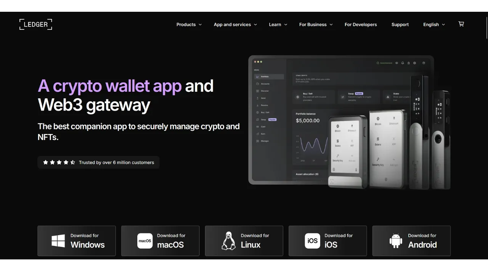
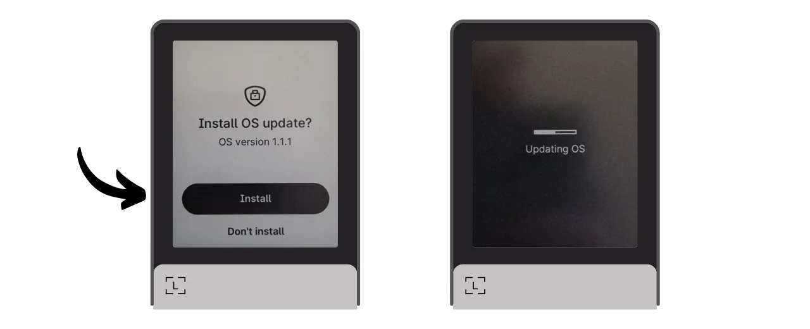
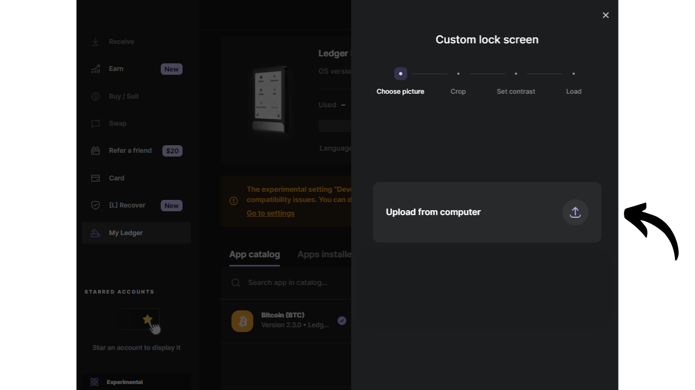
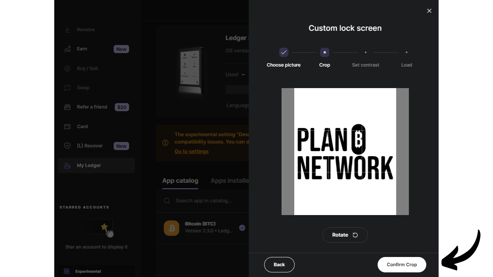
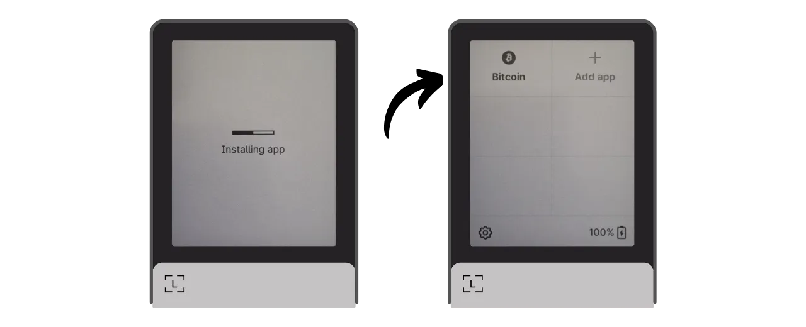
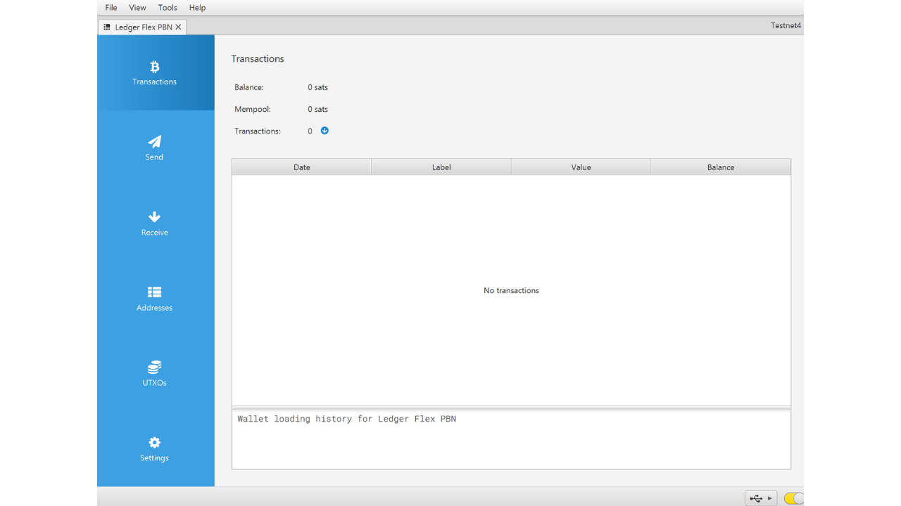
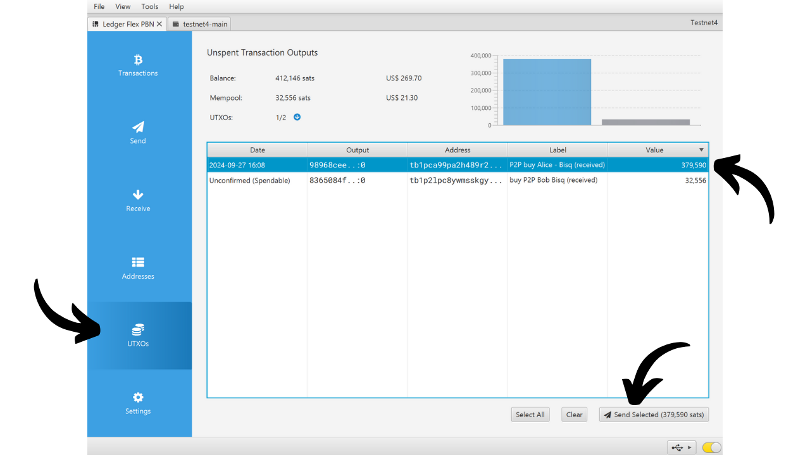
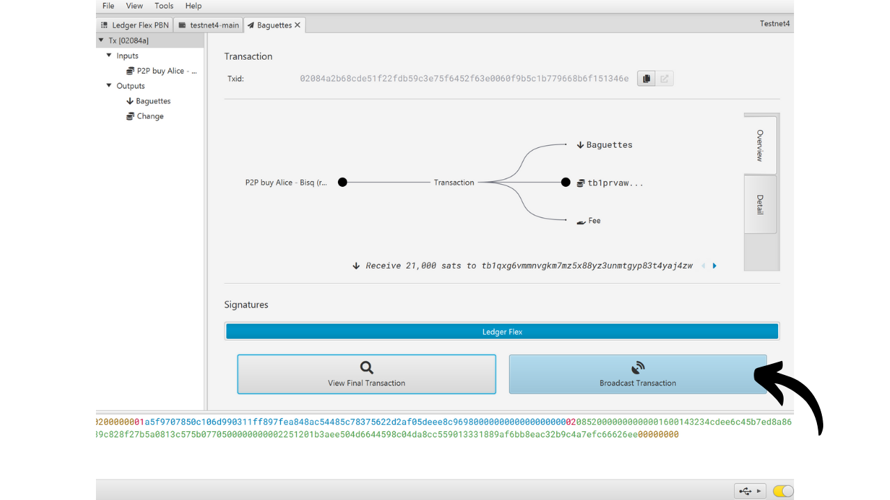
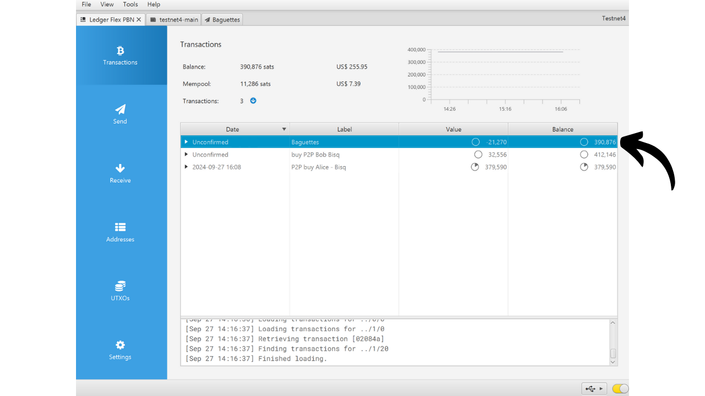

A hardware wallet is an electronic device dedicated to managing and securing the private keys of a Bitcoin wallet. Unlike software wallets (or hot wallets) installed on general-purpose machines often connected to the Internet, hardware wallets allow for the physical isolation of private keys, reducing the risks of hacking and theft.

The main goal of a hardware wallet is to minimize the device's functionalities to reduce its attack surface. Less attack surface also means fewer potential attack vectors, i.e., fewer weak points in the system that attackers could exploit to access bitcoins.

It is recommended to use a hardware wallet to secure your bitcoins, especially if you hold significant amounts, whether in absolute value or as a proportion of your total assets.

Hardware wallets are used in combination with wallet management software on a computer or smartphone. This software manages the creation of transactions, but the cryptographic signature necessary to validate these transactions is done only within the hardware wallet. This means that the private keys are never exposed to a potentially vulnerable environment.

Hardware wallets offer dual protection for the user: on one hand, they secure your bitcoins against remote attacks by keeping the private keys offline, and on the other hand, they generally offer better physical resistance against attempts to extract the keys. And it is precisely on these 2 security criteria that one can judge and rank the different models available on the market.

In this tutorial, I propose to discover one of these solutions: the **Ledger Flex**.

## Introduction to the Ledger Flex

The Ledger Flex is a hardware wallet produced by the French company Ledger, marketed at a price of 249 €.

It features a large E Ink touchscreen, a black-and-white display technology. This is the same technology found in electronic readers. The E Ink screen allows for a clear and readable display, even in bright sunlight, and consumes very little energy, or none at all when the screen is static. It works by using microcapsules containing black and white pigment particles. When an electrical charge is applied, the black or white particles move to the surface of the screen, thus allowing text or images to be formed.
The Ledger Flex is equipped with a CC EAL6+ certified "secure element" chip, offering you advanced protection against physical attacks on the hardware. The screen is directly controlled by this chip. A common point of criticism is that the code for this chip is not open-source, requiring a certain level of trust in the integrity of this component. However, this element is audited by independent experts.

In terms of usage, the Ledger Flex offers several connectivity options: Bluetooth, USB-C, and NFC. The large screen allows for easy verification of your transaction details. Ledger also stands out from its competitors with its rapid adoption of new Bitcoin features, such as Miniscript, for example.

After testing it, I am impressed by the quality of the product. The user experience is excellent, and the device is intuitive. It's an excellent hardware wallet. However, it has 2 major drawbacks in my opinion: the inability to verify the chip's code and, of course, its price, which is significantly higher than its competitors. For comparison, the most advanced model from Foundation is sold at $199, Coinkite's at $219.99, while the latest Trezor, also equipped with a large touchscreen, is offered at 169€.

## How to Buy a Ledger Flex?

The Ledger Flex is available for purchase [on the official website](https://shop.ledger.com/pages/ledger-flex). To buy it in a physical store, you can also find [the list of certified resellers](https://www.ledger.com/reseller) on the Ledger website.

## Prerequisites

Once you have received your Ledger Flex, the first step is to examine the packaging to ensure it has not been opened.

The Ledger's packaging should include 2 sealing strips. If these strips are missing or damaged, it could indicate that the hardware wallet has been compromised and might not be authentic.

Upon opening, you should find the following items in the box:
- The Ledger Flex;
- A USB-C cable;
- A user manual;
- Cards for writing down your mnemonic phrase.

For this tutorial, you will need 2 pieces of software: Ledger Live to initialize the Ledger Flex, and Sparrow Wallet to manage your Bitcoin wallet. Download [Ledger Live](https://www.ledger.com/ledger-live) and [Sparrow Wallet](https://sparrowwallet.com/download/) from their official websites.

We will soon offer a tutorial on how to verify the authenticity and integrity of software you download. I strongly advise doing so here for Ledger Live and Sparrow.
## How to Initialize a Ledger Flex with Ledger Live?

Turn on your Ledger Flex by pressing the right side button for a few seconds.

Scroll through the different introduction pages.

Select the option "*Set up without Ledger Live*", then click on the "*Skip Ledger Live*" button.

You will then be asked to choose a name for your Ledger. Click on "*Set name*", and then enter the name of your choice.

Choose the PIN code for your device, which will be used to unlock your Ledger. This is therefore a protection against unauthorized physical access. This PIN code does not play a part in the derivation of your wallet's cryptographic keys. Thus, even without access to this PIN code, having your 24-word mnemonic phrase will allow you to regain access to your bitcoins.

It is recommended to choose an 8-digit PIN code, as random as possible. Also, make sure to save this code in a different place from where your Ledger Flex is stored (for example, in a password manager).

Enter your PIN a second time to confirm it.

You will then be prompted to choose between recovering an existing wallet or creating a new one. In this tutorial, we are covering creating a new wallet from scratch, so select the option "*Set up as a new Ledger*" to generate a new mnemonic phrase.

Your Flex will provide instructions on how to manage your recovery phrase.

**This mnemonic phrase gives complete and unrestricted access to all your bitcoins**. Anyone in possession of this phrase can steal your funds, even without physical access to your Ledger. The 24-word phrase allows for the restoration of access to your bitcoins in case of loss, theft, or damage to your Ledger Flex. It is therefore very important to carefully save and store it in a secure location.

You can write it down on the cardboard paper provided with your Ledger, or for added security, I recommend engraving it on a stainless steel medium to protect against the risks of fires, floods, or collapses.

You can browse these instructions and skip pages by touching the screen.

The Ledger will create your mnemonic phrase using its random number generator. Make sure you are not being observed during this operation. Write down the words provided by the Ledger on the physical medium of your choice. Depending on your security strategy, you might consider making several complete physical copies of the phrase (but most importantly, do not split it). It is important to keep the words numbered and in sequential order.
***Obviously, you should never share these words on the internet, contrary to what I am doing in this tutorial. This example wallet will be used only on the Testnet and will be deleted at the end of the tutorial.***

To move to the next group of words, click on the "*Next*" button. Once all the words are noted, click on the "*Done*" button to proceed to the next step.

Click on the "*Start confirmation*" button, then select the words from your mnemonic phrase in their order to confirm that you have noted them correctly. Continue this procedure until the 24th word.

If the phrase you are confirming matches exactly the one that the Flex provided you in the previous step, you can proceed. If not, this indicates that your physical backup of the mnemonic phrase is incorrect and you need to restart the process.

And there you have it, your seed has been correctly created on your Ledger Flex. Before proceeding to create a new Bitcoin wallet from this seed, let's explore the device settings together.

## How to modify the settings of your Ledger?

To lock and unlock your Ledger, press the side button. You will then be asked to enter the PIN code you set in the previous step.

To access the settings, click on the gear symbol at the bottom left of your device.

The "*Name*" menu allows you to change the name of your Ledger.

In "*About this Ledger*," you will find information about your Flex.

In the "*Lock screen*" menu, you have the option to change the image displayed on the lock screen by selecting "*Customize lock screen picture*". Thanks to the device's E Ink screen technology, it is possible to keep the screen constantly on without consuming battery. E Ink screens do not use energy to maintain a static image. However, they do consume energy during display changes.
The "*Auto-lock*" submenu allows you to configure and activate the automatic locking of your Ledger after a determined period of inactivity.

The "*Sounds*" menu enables you to turn the sounds of your Flex on or off. And in the "Language" menu, you can change the display language.

By clicking on the right arrow, you can access other settings. "*Change PIN*" allows you to change your PIN code.

The "*Bluetooth*" and "*NFC*" menus allow you to manage these communications.

In "*Battery*" you can notably set an automatic shutdown of the Ledger.

The "*Advanced*" section gives you access to more sophisticated security settings. It is advised to keep the "*PIN shuffle*" option activated to enhance security. It is also in this menu that you can configure a BIP39 passphrase.

The passphrase is an optional password that, combined with the recovery phrase, provides an additional layer of security for your wallet.

Currently, your wallet is generated from a mnemonic phrase consisting of 24 words. This recovery phrase is very important, as it allows you to restore all the keys of your wallet in case of loss. However, it constitutes a single point of failure (SPOF). If it is compromised, the bitcoins are in danger. This is where the passphrase comes in. It is an optional password, which you can choose arbitrarily, that adds to the mnemonic phrase to strengthen the wallet's security.

The passphrase should not be confused with the PIN code. It plays a role in the derivation of your cryptographic keys. It works in tandem with the mnemonic phrase, modifying the seed from which the keys are generated. Thus, even if someone obtains your 24-word phrase, without the passphrase, they cannot access your funds. Using a passphrase essentially creates a new wallet with distinct keys. Modifying (even slightly) the passphrase will generate a different wallet.

The passphrase is a very powerful tool for enhancing the security of your bitcoins. However, it is very important to understand how it works before implementing it, to avoid losing access to your wallet. I will explain how to use the passphrase in another dedicated tutorial.

Finally, the last settings page allows you to reset your Ledger. Only proceed with this reset if you are certain it does not contain any keys securing bitcoins, as you could permanently lose access to your funds.

## How to install the Bitcoin application?

Start by launching the Ledger Live software on your computer, then connect and unlock your Ledger Flex.

In Ledger Live, go to the "*My Ledger*" menu. You will be asked to authorize access to your Flex.

Validate the access on your Ledger by clicking on the "*Allow*" button.

First, if the firmware of your Ledger Flex is not up to date, Ledger Live will automatically offer to update it. If applicable, click on "*Update firmware*", then on "*Install update*" to start the installation.

On your Ledger, click on the "*Install*" button, then wait during the installation.

The firmware of your Ledger Flex is now up to date.

If you wish, you can change the lock screen wallpaper of your Ledger Flex. To do this, click on "*Add >*".

Click on the "*Upload from computer*" button and choose your wallpaper from your photos.

You can crop your image.

Choose a contrast from the different options, then click on "*Confirm contrast*".

On your Flex, click on the "*Load picture*" button.

If you are satisfied with the image, click on "*Keep*" to set it as your lock screen wallpaper.

Finally, we will add the Bitcoin application. To do this, on Ledger Live, click on the "*Install*" button next to "*Bitcoin (BTC)*".

The application will install on your Flex.

From now on, you will no longer need the Ledger Live software for the regular management of your wallet. You can return to it occasionally to update the firmware when new versions are available. For everything else, we will use Sparrow Wallet, which is a much more comprehensive tool for efficiently managing a Bitcoin wallet.

## How to set up a new Bitcoin wallet with Sparrow?
Open Sparrow Wallet and skip the introduction pages to access the home screen. Check that you are properly connected to a node by observing the switch located at the bottom right of the screen.

I strongly recommend using your own Bitcoin node. In this tutorial, I'm using a public node (yellow) because I'm on the testnet, but for normal use, it's better to opt for a local Bitcoin Core (green) or an Electrum server connected to a remote node (blue).

Click on the "*File*" menu then "*New Wallet*".

Choose a name for this wallet, then click on "*Create Wallet*".

In the "*Script Type*" dropdown menu, select the type of script that will be used to secure your bitcoins. I recommend opting for "*Taproot*", or if not available, "*Native SegWit*".

Click on the "*Connected Hardware Wallet*" button.

Connect your Ledger Flex to the computer, unlock it with your PIN code, then open the "*Bitcoin*" application. In this tutorial, I'm using the "*Bitcoin Testnet*" application, but the procedure remains the same for the mainnet.

On Sparrow, click on the "*Scan*" button.

Then click on "*Import Keystore*".

You can now see the details of your wallet, including the extended public key of your first account. Click on the "*Apply*" button to finalize the creation of the wallet.

Choose a strong password to secure access to Sparrow Wallet. This password will ensure the security of access to your wallet data on Sparrow, which helps to protect your public keys, addresses, labels, and transaction history against any unauthorized access.

I advise you to save this password in a password manager so you don't forget it.

And there you have it, your wallet is now created!

Before receiving your first bitcoins in your wallet, I strongly advise you to perform a dry-run recovery test. Note down a reference piece of information, such as your xpub, then reset your Ledger Flex while the wallet is still empty. Afterward, try to restore your wallet on the Ledger using your paper backups. Check that the xpub generated after restoration matches the one you initially noted. If this is the case, you can be assured that your paper backups are reliable.

## How to receive bitcoins with the Ledger Flex?

Click on the "*Receive*" tab.

Connect your Ledger Flex to the computer, unlock it with your PIN code, then open the "*Bitcoin*" application.

Before using the address provided by Sparrow Wallet, verify it on your Ledger Flex's screen. This practice allows you to confirm that the address displayed on Sparrow is not fraudulent and that the Ledger indeed holds the private key necessary to spend the bitcoins secured with this address later.

To perform this verification, click on the "*Display Address*" button.

Ensure that the address displayed on your Ledger Flex matches the one indicated on Sparrow Wallet. It is also recommended to perform this verification just before giving your address to the sender, to be sure of its validity.

You can add a "*Label*" to describe the source of the bitcoins that will be secured with this address. This is a good practice that helps you better manage your UTXOs.

For more information on labeling, I also advise you to check out this other tutorial:

https://planb.network/tutorials/privacy/utxo-labelling

You can then use this address to receive bitcoins.

## How to send bitcoins with the Ledger Flex?

Now that you have received your first sats in your wallet secured with the Flex, you can also spend them! Connect your Ledger to your computer, unlock it, launch Sparrow Wallet, then go to the "*Send*" tab to construct a new transaction.

If you want to do "*coin control*," that is, specifically choose which UTXOs to consume in the transaction, go to the "*UTXOs*" tab. Select the UTXOs you wish to spend, then click on "*Send Selected*". You will be redirected to the same screen of the "*Send*" tab, but with your UTXOs already selected for the transaction.

Enter the destination address. You can also enter multiple addresses by clicking on the "*+ Add*" button.

Note a "*Label*" to remember the purpose of this expense.

Choose the amount sent to this address.

Adjust the fee rate of your transaction according to the current market.

Ensure all the settings of your transaction are correct, then click on "*Create Transaction*".

If everything is to your satisfaction, click on "*Finalize Transaction for Signing*".

Click on "*Sign*".

Click on "*Sign*" next to your Ledger Flex.

Verify the transaction settings on your Flex's screen, including the recipient's receiving address, the amount sent, and the fee amount.

To sign, hold your finger on the "*Hold to sign*" button.

Your transaction is now signed. Click on "*Broadcast Transaction*" to broadcast it on the Bitcoin network.

You can find it in the "*Transactions*" tab of Sparrow Wallet.

Congratulations, you are now up to speed on the basic use of the Ledger Flex with Sparrow Wallet! In a future tutorial, we will see how to use the Ledger Flex with Liana to leverage Miniscript.

If you found this tutorial helpful, I would appreciate a thumbs up below. Feel free to share this article on your social networks. Thank you very much!