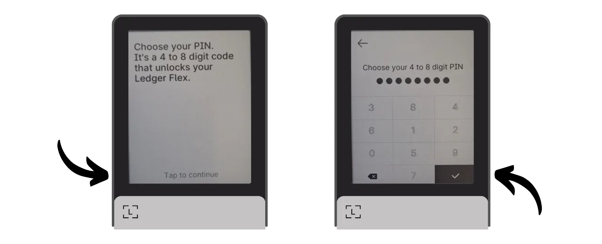

Una cartera de hardware es un dispositivo electrónico dedicado a gestionar y asegurar las claves privadas de una cartera de Bitcoin. A diferencia de las carteras de software (o carteras calientes) instaladas en máquinas de propósito general a menudo conectadas a Internet, las carteras de hardware permiten el aislamiento físico de las claves privadas, reduciendo los riesgos de hackeo y robo.

El principal objetivo de una cartera de hardware es minimizar las funcionalidades del dispositivo para reducir su superficie de ataque. Menos superficie de ataque también significa menos vectores de ataque potenciales, es decir, menos puntos débiles en el sistema que los atacantes podrían explotar para acceder a los bitcoins.

Se recomienda usar una cartera de hardware para asegurar tus bitcoins, especialmente si posees cantidades significativas, ya sea en valor absoluto o como proporción de tus activos totales.

Las carteras de hardware se utilizan en combinación con software de gestión de carteras en un ordenador o smartphone. Este software gestiona la creación de transacciones, pero la firma criptográfica necesaria para validar estas transacciones se realiza solo dentro de la cartera de hardware. Esto significa que las claves privadas nunca están expuestas a un entorno potencialmente vulnerable.

Las carteras de hardware ofrecen una doble protección para el usuario: por un lado, aseguran tus bitcoins contra ataques remotos al mantener las claves privadas desconectadas, y por otro lado, generalmente ofrecen mejor resistencia física contra intentos de extraer las claves. Y es precisamente en estos 2 criterios de seguridad en los que se puede juzgar y clasificar los diferentes modelos disponibles en el mercado.

En este tutorial, propongo descubrir una de estas soluciones: el **Ledger Flex**.

## Introducción al Ledger Flex

El Ledger Flex es una cartera de hardware producida por la compañía francesa Ledger, comercializada a un precio de 249 €.

Cuenta con una gran pantalla táctil E Ink, una tecnología de pantalla en blanco y negro. Esta es la misma tecnología que se encuentra en los lectores electrónicos. La pantalla E Ink permite una visualización clara y legible, incluso bajo la luz solar directa, y consume muy poca energía, o ninguna en absoluto cuando la pantalla está estática. Funciona utilizando microcápsulas que contienen partículas de pigmento blanco y negro. Cuando se aplica una carga eléctrica, las partículas negras o blancas se mueven hacia la superficie de la pantalla, permitiendo así formar texto o imágenes.
El Ledger Flex está equipado con un chip "elemento seguro" certificado CC EAL6+, ofreciéndote protección avanzada contra ataques físicos al hardware. La pantalla está controlada directamente por este chip. Un punto común de crítica es que el código para este chip no es de código abierto, requiriendo un cierto nivel de confianza en la integridad de este componente. Sin embargo, este elemento es auditado por expertos independientes.

En términos de uso, el Ledger Flex ofrece varias opciones de conectividad: Bluetooth, USB-C y NFC. La gran pantalla permite una fácil verificación de los detalles de tu transacción. Ledger también se destaca de sus competidores con su rápida adopción de nuevas características de Bitcoin, como Miniscript, por ejemplo.

Después de probarlo, estoy impresionado por la calidad del producto. La experiencia del usuario es excelente, y el dispositivo es intuitivo. Es una excelente cartera de hardware. Sin embargo, tiene 2 grandes inconvenientes en mi opinión: la imposibilidad de verificar el código del chip y, por supuesto, su precio, que es significativamente más alto que el de sus competidores. Para comparar, el modelo más avanzado de Foundation se vende a $199, el de Coinkite a $219.99, mientras que el último Trezor, también equipado con una gran pantalla táctil, se ofrece a 169€.

## ¿Cómo comprar un Ledger Flex?
El Ledger Flex está disponible para su compra [en el sitio web oficial](https://shop.ledger.com/pages/ledger-flex). Para comprarlo en una tienda física, también puedes encontrar [la lista de distribuidores certificados](https://www.ledger.com/reseller) en el sitio web de Ledger.
## Prerrequisitos

Una vez que hayas recibido tu Ledger Flex, el primer paso es examinar el empaque para asegurarte de que no haya sido abierto.

El empaque de Ledger debe incluir 2 sellos de seguridad. Si estos sellos faltan o están dañados, podría indicar que la cartera de hardware ha sido comprometida y podría no ser auténtica.

Al abrirlo, deberías encontrar los siguientes elementos en la caja:
- El Ledger Flex;
- Un cable USB-C;
- Un manual de usuario;
- Tarjetas para anotar tu frase mnemotécnica.

Para este tutorial, necesitarás 2 piezas de software: Ledger Live para inicializar el Ledger Flex, y Sparrow Wallet para gestionar tu cartera de Bitcoin. Descarga [Ledger Live](https://www.ledger.com/ledger-live) y [Sparrow Wallet](https://sparrowwallet.com/download/) desde sus sitios web oficiales.

Pronto ofreceremos un tutorial sobre cómo verificar la autenticidad e integridad del software que descargas. Te aconsejo encarecidamente hacerlo aquí para Ledger Live y Sparrow.
## ¿Cómo inicializar un Ledger Flex con Ledger Live?

Enciende tu Ledger Flex presionando el botón del lado derecho durante unos segundos.

Desplázate por las diferentes páginas de introducción.

Selecciona la opción "*Configurar sin Ledger Live*", luego haz clic en el botón "*Omitir Ledger Live*".

Luego se te pedirá que elijas un nombre para tu Ledger. Haz clic en "*Establecer nombre*", y luego ingresa el nombre de tu elección.

Elige el código PIN para tu dispositivo, que se utilizará para desbloquear tu Ledger. Esto es, por lo tanto, una protección contra el acceso físico no autorizado. Este código PIN no juega un papel en la derivación de las claves criptográficas de tu cartera. Por lo tanto, incluso sin acceso a este código PIN, tener tu frase mnemotécnica de 24 palabras te permitirá recuperar el acceso a tus bitcoins.

Se recomienda elegir un código PIN de 8 dígitos, tan aleatorio como sea posible. Además, asegúrate de guardar este código en un lugar diferente de donde se almacena tu Ledger Flex (por ejemplo, en un gestor de contraseñas).

Ingresa tu PIN una segunda vez para confirmarlo.

Luego se te pedirá que elijas entre recuperar una cartera existente o crear una nueva. En este tutorial, estamos cubriendo la creación de una nueva cartera desde cero, así que selecciona la opción "*Configurar como un nuevo Ledger*" para generar una nueva frase mnemotécnica.

Tu Flex proporcionará instrucciones sobre cómo gestionar tu frase de recuperación.
**Esta frase mnemotécnica otorga acceso completo y sin restricciones a todos tus bitcoins**. Cualquier persona en posesión de esta frase puede robar tus fondos, incluso sin acceso físico a tu Ledger. La frase de 24 palabras permite la restauración del acceso a tus bitcoins en caso de pérdida, robo o daño de tu Ledger Flex. Por lo tanto, es muy importante guardarla y almacenarla cuidadosamente en un lugar seguro.
Puedes anotarla en el papel de cartón proporcionado con tu Ledger, o para mayor seguridad, recomiendo grabarla en un medio de acero inoxidable para proteger contra los riesgos de incendios, inundaciones o derrumbes.

Puedes navegar por estas instrucciones y saltar páginas tocando la pantalla.

El Ledger creará tu frase mnemotécnica usando su generador de números aleatorios. Asegúrate de no estar siendo observado durante esta operación. Anota las palabras proporcionadas por el Ledger en el medio físico de tu elección. Dependiendo de tu estrategia de seguridad, podrías considerar hacer varias copias físicas completas de la frase (pero lo más importante, no la dividas). Es importante mantener las palabras numeradas y en orden secuencial.
***Obviamente, nunca deberías compartir estas palabras en internet, al contrario de lo que estoy haciendo en este tutorial. Esta cartera de ejemplo se usará solo en el Testnet y será eliminada al final del tutorial.***

Para pasar al siguiente grupo de palabras, haz clic en el botón "*Next*" (Siguiente). Una vez que todas las palabras estén anotadas, haz clic en el botón "*Done*" (Hecho) para proceder al siguiente paso.

Haz clic en el botón "*Start confirmation*" (Iniciar confirmación), luego selecciona las palabras de tu frase mnemotécnica en su orden para confirmar que las has anotado correctamente. Continúa este procedimiento hasta la 24ª palabra.

Si la frase que estás confirmando coincide exactamente con la que el Flex te proporcionó en el paso anterior, puedes proceder. Si no, esto indica que tu respaldo físico de la frase mnemotécnica es incorrecto y necesitas reiniciar el proceso.

Y ahí lo tienes, tu semilla ha sido creada correctamente en tu Ledger Flex. Antes de proceder a crear una nueva cartera de Bitcoin a partir de esta semilla, exploremos juntos los ajustes del dispositivo.

## ¿Cómo modificar los ajustes de tu Ledger?

Para bloquear y desbloquear tu Ledger, presiona el botón lateral. Luego se te pedirá que ingreses el código PIN que estableciste en el paso anterior.

Para acceder a los ajustes, haz clic en el símbolo de engranaje en la parte inferior izquierda de tu dispositivo.

El menú "*Name*" (Nombre) te permite cambiar el nombre de tu Ledger.

En "*About this Ledger*" (Acerca de este Ledger), encontrarás información sobre tu Flex.

En el menú "*Lock screen*" (Pantalla de bloqueo), tienes la opción de cambiar la imagen mostrada en la pantalla de bloqueo seleccionando "*Customize lock screen picture*" (Personalizar imagen de pantalla de bloqueo). Gracias a la tecnología de pantalla E Ink del dispositivo, es posible mantener la pantalla constantemente encendida sin consumir batería. Las pantallas E Ink no usan energía para mantener una imagen estática. Sin embargo, sí consumen energía durante los cambios de visualización.
El submenú "*Auto-lock*" (Bloqueo automático) te permite configurar y activar el bloqueo automático de tu Ledger después de un período determinado de inactividad.

El menú "*Sounds*" te permite activar o desactivar los sonidos de tu Flex. Y en el menú "Language", puedes cambiar el idioma de visualización.

Al hacer clic en la flecha derecha, puedes acceder a otros ajustes. "*Change PIN*" te permite cambiar tu código PIN.

Los menús "*Bluetooth*" y "*NFC*" te permiten gestionar estas comunicaciones.

En "*Battery*" puedes configurar, notablemente, un apagado automático del Ledger.

La sección "*Advanced*" te da acceso a configuraciones de seguridad más sofisticadas. Se aconseja mantener activada la opción "*PIN shuffle*" para mejorar la seguridad. También es en este menú donde puedes configurar una frase de paso BIP39.

La frase de paso es una contraseña opcional que, combinada con la frase de recuperación, proporciona una capa adicional de seguridad para tu billetera.

Actualmente, tu billetera se genera a partir de una frase mnemotécnica que consta de 24 palabras. Esta frase de recuperación es muy importante, ya que te permite restaurar todas las claves de tu billetera en caso de pérdida. Sin embargo, constituye un único punto de fallo (SPOF). Si se ve comprometida, los bitcoins están en peligro. Aquí es donde entra la frase de paso. Es una contraseña opcional, que puedes elegir arbitrariamente, que se suma a la frase mnemotécnica para fortalecer la seguridad de la billetera.

La frase de paso no debe confundirse con el código PIN. Juega un papel en la derivación de tus claves criptográficas. Funciona en conjunto con la frase mnemotécnica, modificando la semilla de la cual se generan las claves. Así, incluso si alguien obtiene tu frase de 24 palabras, sin la frase de paso, no pueden acceder a tus fondos. Usar una frase de paso crea esencialmente una nueva billetera con claves distintas. Modificar (incluso ligeramente) la frase de paso generará una billetera diferente.

La frase de paso es una herramienta muy poderosa para mejorar la seguridad de tus bitcoins. Sin embargo, es muy importante entender cómo funciona antes de implementarla, para evitar perder acceso a tu billetera. Explicaré cómo usar la frase de paso en otro tutorial dedicado.

Finalmente, la última página de ajustes te permite restablecer tu Ledger. Solo procede con este restablecimiento si estás seguro de que no contiene ninguna clave que asegure bitcoins, ya que podrías perder permanentemente el acceso a tus fondos.

## ¿Cómo instalar la aplicación Bitcoin?

Comienza lanzando el software Ledger Live en tu computadora, luego conecta y desbloquea tu Ledger Flex.

En Ledger Live, ve al menú "*My Ledger*". Se te pedirá autorizar el acceso a tu Flex.

Valida el acceso en tu Ledger haciendo clic en el botón "*Allow*".

Primero, si el firmware de tu Ledger Flex no está actualizado, Ledger Live automáticamente ofrecerá actualizarlo. Si es aplicable, haz clic en "*Update firmware*", luego en "*Install update*" para comenzar la instalación.

En tu Ledger, haz clic en el botón "*Install*", luego espera durante la instalación.

El firmware de tu Ledger Flex ahora está actualizado.

Si lo deseas, puedes cambiar el fondo de pantalla de bloqueo de tu Ledger Flex. Para hacerlo, haz clic en "*Añadir >*".

Haz clic en el botón "*Subir desde el ordenador*" y elige tu fondo de pantalla de tus fotos.

Puedes recortar tu imagen.

Elige un contraste de las diferentes opciones, luego haz clic en "*Confirmar contraste*".

En tu Flex, haz clic en el botón "*Cargar imagen*".

Si estás satisfecho con la imagen, haz clic en "*Mantener*" para establecerla como tu fondo de pantalla de bloqueo.

Finalmente, añadiremos la aplicación de Bitcoin. Para hacerlo, en Ledger Live, haz clic en el botón "*Instalar*" al lado de "*Bitcoin (BTC)*".

La aplicación se instalará en tu Flex.

A partir de ahora, ya no necesitarás el software Ledger Live para la gestión regular de tu billetera. Puedes volver a él ocasionalmente para actualizar el firmware cuando haya nuevas versiones disponibles. Para todo lo demás, utilizaremos Sparrow Wallet, que es una herramienta mucho más completa para gestionar eficientemente una billetera de Bitcoin.

## ¿Cómo configurar una nueva billetera de Bitcoin con Sparrow?
Abre Sparrow Wallet y salta las páginas de introducción para acceder a la pantalla principal. Comprueba que estás correctamente conectado a un nodo observando el interruptor ubicado en la parte inferior derecha de la pantalla.

Recomiendo encarecidamente usar tu propio nodo de Bitcoin. En este tutorial, estoy usando un nodo público (amarillo) porque estoy en el testnet, pero para un uso normal, es mejor optar por un Bitcoin Core local (verde) o un servidor Electrum conectado a un nodo remoto (azul).

Haz clic en el menú "*Archivo*" y luego en "*Nueva Billetera*".

Elige un nombre para esta billetera, luego haz clic en "*Crear Billetera*".

En el menú desplegable "*Tipo de Script*", selecciona el tipo de script que se utilizará para asegurar tus bitcoins. Recomiendo optar por "*Taproot*", o si no está disponible, "*SegWit Nativo*".

Haz clic en el botón "*Billetera de Hardware Conectada*".

Conecta tu Ledger Flex al ordenador, desbloquéalo con tu código PIN, luego abre la aplicación "*Bitcoin*". En este tutorial, estoy usando la aplicación "*Bitcoin Testnet*", pero el procedimiento sigue siendo el mismo para la red principal.

En Sparrow, haz clic en el botón "*Escanear*".

Luego haz clic en "*Importar Keystore*".

Ahora puedes ver los detalles de tu billetera, incluyendo la clave pública extendida de tu primera cuenta. Haz clic en el botón "*Aplicar*" para finalizar la creación de la billetera.

Elige una contraseña fuerte para asegurar el acceso a Sparrow Wallet. Esta contraseña garantizará la seguridad del acceso a los datos de tu billetera en Sparrow, lo que ayuda a proteger tus claves públicas, direcciones, etiquetas e historial de transacciones contra cualquier acceso no autorizado.

Te aconsejo que guardes esta contraseña en un gestor de contraseñas para que no la olvides.

¡Y ahí lo tienes, tu billetera ya está creada!

Antes de recibir tus primeros bitcoins en tu billetera, te aconsejo encarecidamente realizar una prueba de recuperación en seco. Anota una pieza de información de referencia, como tu xpub, luego reinicia tu Ledger Flex mientras la billetera aún está vacía. Después, intenta restaurar tu billetera en el Ledger usando tus copias de seguridad en papel. Comprueba que el xpub generado después de la restauración coincida con el que inicialmente anotaste. Si este es el caso, puedes estar seguro de que tus copias de seguridad en papel son confiables.

## ¿Cómo recibir bitcoins con el Ledger Flex?

Haz clic en la pestaña "*Recibir*".

Conecta tu Ledger Flex a la computadora, desbloquéalo con tu código PIN, luego abre la aplicación "*Bitcoin*".

Antes de usar la dirección proporcionada por Sparrow Wallet, verifícala en la pantalla de tu Ledger Flex. Esta práctica te permite confirmar que la dirección mostrada en Sparrow no es fraudulenta y que el Ledger realmente posee la clave privada necesaria para gastar los bitcoins asegurados con esta dirección más tarde.

Para realizar esta verificación, haz clic en el botón "*Mostrar Dirección*".

Asegúrate de que la dirección mostrada en tu Ledger Flex coincida con la indicada en Sparrow Wallet. También se recomienda realizar esta verificación justo antes de dar tu dirección al remitente, para estar seguro de su validez.

Puedes añadir una "*Etiqueta*" para describir el origen de los bitcoins que serán asegurados con esta dirección. Esta es una buena práctica que te ayuda a gestionar mejor tus UTXOs.

Para más información sobre el etiquetado, también te aconsejo que consultes este otro tutorial:

https://planb.network/tutorials/privacy/utxo-labelling

Luego puedes usar esta dirección para recibir bitcoins.

## ¿Cómo enviar bitcoins con el Ledger Flex?

Ahora que has recibido tus primeros sats en tu billetera asegurada con el Flex, ¡también puedes gastarlos! Conecta tu Ledger a tu computadora, desbloquéalo, lanza Sparrow Wallet, luego ve a la pestaña "*Enviar*" para construir una nueva transacción.

Si quieres hacer "*control de monedas*", es decir, elegir específicamente qué UTXOs consumir en la transacción, ve a la pestaña "*UTXOs*". Selecciona los UTXOs que deseas gastar, luego haz clic en "*Enviar seleccionados*". Serás redirigido a la misma pantalla de la pestaña "*Enviar*", pero con tus UTXOs ya seleccionados para la transacción.

Ingresa la dirección de destino. También puedes ingresar múltiples direcciones haciendo clic en el botón "*+ Añadir*".

Nota una "*Etiqueta*" para recordar el propósito de este gasto.

Elige la cantidad enviada a esta dirección.

Ajusta la tasa de comisión de tu transacción de acuerdo con el mercado actual.

Asegúrate de que todos los ajustes de tu transacción sean correctos, luego haz clic en "*Crear Transacción*".

Si todo es de tu satisfacción, haz clic en "*Finalizar Transacción para Firmar*".

Haz clic en "*Firmar*".

Haz clic en "*Firmar*" al lado de tu Ledger Flex.

Verifica los ajustes de la transacción en la pantalla de tu Flex, incluyendo la dirección de recepción del destinatario, la cantidad enviada y el monto de la comisión.

Para firmar, mantén tu dedo en el botón "*Mantener para firmar*".

Tu transacción ahora está firmada. Haz clic en "*Transmitir Transacción*" para difundirla en la red de Bitcoin.

Puedes encontrarla en la pestaña "*Transacciones*" de Sparrow Wallet.

¡Felicidades, ahora estás al día sobre el uso básico del Ledger Flex con Sparrow Wallet! En un futuro tutorial, veremos cómo usar el Ledger Flex con Liana para aprovechar Miniscript.

Si encontraste útil este tutorial, agradecería mucho un pulgar arriba abajo. No dudes en compartir este artículo en tus redes sociales. ¡Muchas gracias!