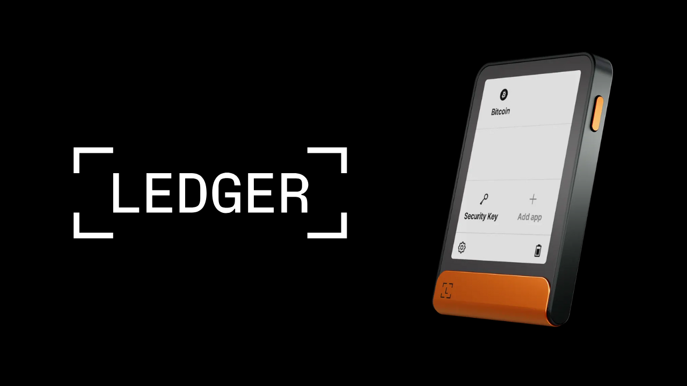
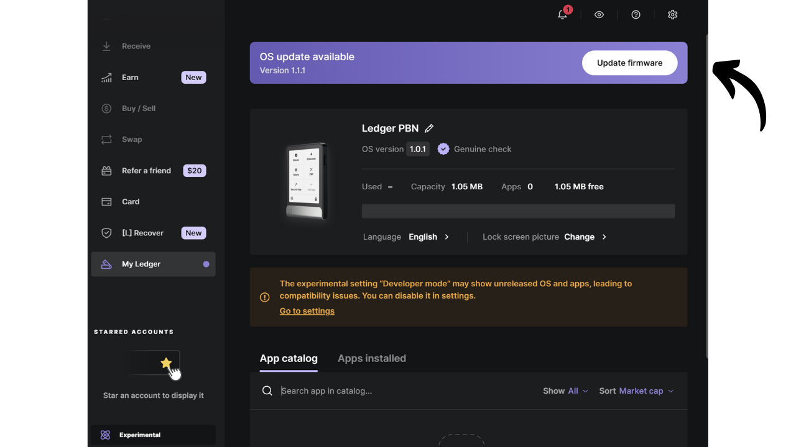
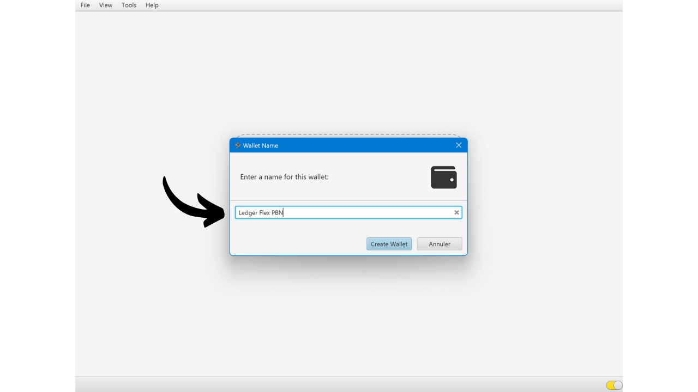
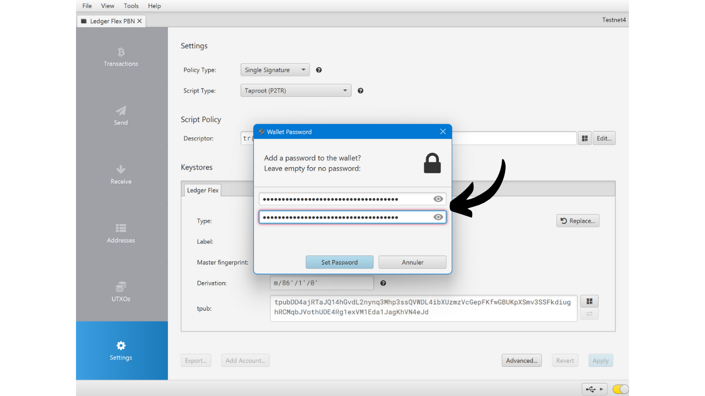
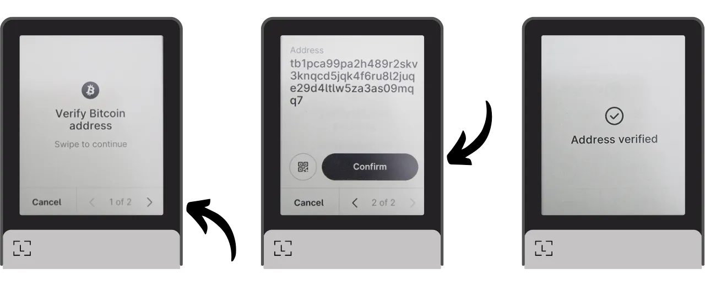

Riistvara rahakott on elektrooniline seade, mis on pühendatud Bitcoin'i rahakoti privaatvõtmete haldamisele ja turvamisele. Erinevalt tarkvaralistest rahakottidest (või kuumadest rahakottidest), mis on paigaldatud üldotstarbelistele masinatele, mis on sageli ühendatud Internetiga, võimaldavad riistvara rahakotid privaatvõtmete füüsilist isoleerimist, vähendades häkkimise ja varguse riske.

Riistvara rahakoti peamine eesmärk on vähendada seadme funktsionaalsusi, et vähendada selle rünnakupinda. Vähem rünnakupinda tähendab ka vähem potentsiaalseid rünnakute vektoreid, st vähem süsteemi nõrku kohti, mida ründajad võiksid ära kasutada bitcoini ligipääsuks.

On soovitatav kasutada riistvara rahakotti oma bitcoinide turvamiseks, eriti kui omate olulisi summasid, olgu see siis absoluutväärtuses või teie koguvarade osana.

Riistvara rahakotte kasutatakse koos rahakoti haldustarkvaraga arvutis või nutitelefonis. See tarkvara haldab tehingute loomist, kuid tehingute kinnitamiseks vajalik krüptograafiline allkiri tehakse ainult riistvara rahakotis. See tähendab, et privaatvõtmed ei ole kunagi potentsiaalselt haavatavas keskkonnas paljastatud.

Riistvara rahakotid pakuvad kasutajale kahekordset kaitset: ühelt poolt kaitsevad nad teie bitcoine kaugrünnakute eest, hoides privaatvõtmeid võrguühenduseta, ja teiselt poolt pakuvad nad üldiselt paremat füüsilist vastupanu võtmete kättesaamise katsetele. Ja just nendel 2 turvakriteeriumil saab hinnata ja järjestada turul saadaolevaid erinevaid mudeleid.

Selles õpetuses pakun avastada ühte neist lahendustest: **Ledger Flex**.

## Tutvustus Ledger Flexile

Ledger Flex on riistvara rahakott, mida toodab Prantsuse ettevõte Ledger, turuhinnaga 249 €.

Sellel on suur E Ink puutetundlik ekraan, must-valge kuvatehnoloogia. See on sama tehnoloogia, mida leidub elektroonilistes lugerites. E Ink ekraan võimaldab selget ja loetavat kuvamist isegi eredas päikesevalguses ning tarbib väga vähe energiat või üldse mitte, kui ekraan on staatiline. See töötab kasutades mikrokapsleid, mis sisaldavad musti ja valgeid pigmendiosakesi. Elektrilaengu rakendamisel liiguvad mustad või valged osakesed ekraani pinnale, võimaldades nii teksti või piltide moodustamist.
Ledger Flex on varustatud CC EAL6+ sertifitseeritud "turvaelemendi" kiibiga, pakkudes teile täiustatud kaitset riistvara füüsiliste rünnakute vastu. Ekraani juhib otseselt see kiip. Üheks levinud kriitikapunktiks on see, et selle kiibi kood ei ole avatud lähtekoodiga, nõudes teatud usaldustaseme selle komponendi terviklikkuse osas. Siiski auditeerivad seda elementi sõltumatud eksperdid.

Kasutusmugavuse osas pakub Ledger Flex mitmeid ühenduvusvõimalusi: Bluetooth, USB-C ja NFC. Suur ekraan võimaldab tehingute üksikasju hõlpsalt kontrollida. Ledger eristub oma konkurentidest ka uute Bitcoin'i funktsioonide, näiteks Miniscripti, kiire omaksvõtuga.

Pärast selle testimist olen toote kvaliteedist muljet avaldanud. Kasutajakogemus on suurepärane ja seade on intuitiivne. See on suurepärane riistvara rahakott. Siiski on minu arvates sellel 2 suurt puudust: võimetus kontrollida kiibi koodi ja muidugi selle hind, mis on oluliselt kõrgem kui konkurentidel. Võrdluseks, Foundationi kõige arenenum mudel müüakse hinnaga $199, Coinkite oma $219.99 eest, samal ajal kui viimane Trezor, mis on samuti varustatud suure puutetundliku ekraaniga, pakutakse 169€ eest.

## Kuidas osta Ledger Flexi?
Ledger Flex on saadaval ostmiseks [ametlikul veebilehel](https://shop.ledger.com/pages/ledger-flex). Füüsilises poes ostmiseks leiate [sertifitseeritud edasimüüjate nimekirja](https://www.ledger.com/reseller) Ledgeri veebilehelt.
## Eeltingimused

Kui olete oma Ledger Flexi kätte saanud, on esimene samm pakendi kontrollimine, et veenduda, et seda ei ole avatud.

Ledgeri pakend peaks sisaldama 2 pitserriba. Kui need ribad puuduvad või on kahjustatud, võib see viidata sellele, et riistvara rahakott on kompromiteeritud ja ei pruugi olla autentne.

Avamisel peaksite leidma karbist järgmised esemed:
- Ledger Flex;
- USB-C kaabel;
- Kasutusjuhend;
- Kaardid oma mnemoonilise fraasi üleskirjutamiseks.

Selle õpetuse jaoks on vaja kahte tarkvaratükki: Ledger Live Ledger Flexi seadistamiseks ja Sparrow Wallet oma Bitcoin'i rahakoti haldamiseks. Laadige alla [Ledger Live](https://www.ledger.com/ledger-live) ja [Sparrow Wallet](https://sparrowwallet.com/download/) nende ametlikelt veebilehtedelt.

Varsti pakume õpetust, kuidas kontrollida allalaaditud tarkvara autentsust ja terviklikkust. Soovitan tungivalt seda siin teha Ledger Live'i ja Sparrow jaoks.
## Kuidas seadistada Ledger Flexi kasutades Ledger Live'i?

Lülitage oma Ledger Flex sisse, vajutades parempoolset nuppu mõne sekundi jooksul.

Kerige läbi erinevate tutvustuslehtede.

Valige võimalus "*Seadista ilma Ledger Live'ita*", seejärel klõpsake nupul "*Jäta Ledger Live vahele*".

Seejärel palutakse teil valida oma Ledgerile nimi. Klõpsake "*Määra nimi*", ja seejärel sisestage oma valitud nimi.

Valige oma seadme PIN-kood, mida kasutatakse teie Ledgeri avamiseks. See on seega kaitse volitamata füüsilise juurdepääsu vastu. See PIN-kood ei mängi rolli teie rahakoti krüptograafiliste võtmete tuletamisel. Seega, isegi ilma selle PIN-koodi juurdepääsuta, võimaldab teie 24-sõnaline mnemooniline fraas teil taastada juurdepääsu oma bitcoinidele.

Soovitatav on valida võimalikult juhuslik 8-kohaline PIN-kood. Samuti veenduge, et salvestate selle koodi erinevas kohas, kus teie Ledger Flex asub (näiteks paroolihalduris).

Sisestage oma PIN-kood teist korda selle kinnitamiseks.

Seejärel palutakse teil valida olemasoleva rahakoti taastamise või uue loomise vahel. Selles õpetuses käsitleme uue rahakoti loomist nullist, nii et valige võimalus "*Seadista kui uus Ledger*", et genereerida uus mnemooniline fraas.

Teie Flex annab juhiseid, kuidas hallata oma taastefraasi.
**See mnemooniline fraas annab täieliku ja piiramatu juurdepääsu kõigile teie bitcoinidele**. Igaüks, kes seda fraasi omab, võib teie vahendid varastada, isegi ilma füüsilise juurdepääsuta teie Ledgerile. 24-sõnaline fraas võimaldab taastada juurdepääsu teie bitcoinidele kaotuse, varguse või teie Ledger Flexi kahjustumise korral. Seetõttu on väga oluline hoolikalt salvestada ja hoida seda turvalises kohas.
Võite selle üles kirjutada kaasasolevale papptükile, mida teie Ledgeriga pakutakse, või lisaturvalisuse tagamiseks soovitan ma graveerida selle roostevabast terasest materjalile, et kaitsta tulekahju, üleujutuste või kokkuvarisemiste ohtude eest.

Võite sirvida neid juhiseid ja lehti vahele jätta, puudutades ekraani.

Ledger loob teie mnemoonilise fraasi kasutades oma juhusliku numbri generaatorit. Veenduge, et teid selle toimingu ajal ei jälgitaks. Kirjutage üles sõnad, mida Ledger teile pakub, füüsilisele meediumile, mille olete valinud. Oma turvastrateegiast lähtuvalt võiksite kaaluda fraasi mitme täieliku füüsilise koopia tegemist (kuid mis kõige tähtsam, ärge seda jagage). On oluline, et sõnad oleksid nummerdatud ja järjestikuses järjekorras.
***Ilmselgelt ei tohiks te neid sõnu kunagi internetis jagada, vastupidiselt sellele, mida ma teen selles õpetuses. See näidisrahakott kasutatakse ainult Testnetis ja see kustutatakse õpetuse lõpus.***

Järgmise sõnagrupi juurde liikumiseks klõpsake nupul "*Next*". Kui kõik sõnad on üles märgitud, klõpsake nupul "*Done*", et jätkata järgmise sammuga.

Klõpsake nupul "*Start confirmation*", seejärel valige oma mnemoonilisest fraasist sõnad nende järjekorras, et kinnitada, et olete need õigesti üles märkinud. Jätkake seda protseduuri kuni 24. sõnani.

Kui kinnitatav fraas vastab täpselt sellele, mille Flex teile eelmises etapis andis, võite jätkata. Kui mitte, näitab see, et teie füüsiline varukoopia mnemoonilisest fraasist on vale ja peate protsessi uuesti alustama.

Ja nii ongi, teie seeme on teie Ledger Flexil õigesti loodud. Enne uue Bitcoin'i rahakoti loomist sellest seemnest, uurigem koos seadme seadeid.

## Kuidas muuta oma Ledgeri seadeid?

Oma Ledgeri lukustamiseks ja lukust avamiseks vajutage küljenuppu. Seejärel palutakse teil sisestada eelmises etapis määratud PIN-kood.

Seadetele juurdepääsemiseks klõpsake seadme vasakus alanurgas asuval hammasratta sümbolil.

Menüü "*Name*" võimaldab teil muuta oma Ledgeri nime.

Menüüs "*About this Ledger*" leiate teavet oma Flexi kohta.

Menüüs "*Lock screen*" on teil võimalus muuta lukustusekraanil kuvatavat pilti, valides "*Customize lock screen picture*". Tänu seadme E Ink ekraani tehnoloogiale on võimalik ekraani pidevalt sisse lülitatuna hoida ilma akut tarbimata. E Ink ekraanid ei kasuta staatilise pildi hoidmiseks energiat. Siiski tarbivad nad energiat ekraani muudatuste ajal.
Alammenüü "*Auto-lock*" võimaldab teil seadistada ja aktiveerida oma Ledgeri automaatse lukustamise pärast määratud tegevusetuse perioodi.

"*Heli*" menüü võimaldab teil oma Flexi helid sisse või välja lülitada. Ja "*Keel*" menüüs saate muuta kuvakeelt.

Paremale noolele klõpsates pääsete ligi teistele seadetele. "*Muuda PIN*" võimaldab teil muuta oma PIN-koodi.

"*Bluetooth*" ja "*NFC*" menüüd võimaldavad teil hallata neid kommunikatsioone.

"*Aku*" all saate muu hulgas seadistada Ledgeri automaatse väljalülitamise.

"*Täpsemad*" jaotises pääsete ligi keerukamatele turvaseadetele. Soovitatav on hoida "*PIN segamine*" valik aktiveeritud, et suurendada turvalisust. Samuti on just selles menüüs võimalik seadistada BIP39 fraasiparooli.

Fraasiparool on valikuline parool, mis koos taastefraasiga pakub teie rahakotile lisakihi turvalisust.

Praegu genereeritakse teie rahakott 24-sõnalisest mnemoonilisest fraasist. See taastefraas on väga oluline, kuna see võimaldab teil kaotuse korral taastada kõik oma rahakoti võtmed. Siiski kujutab see endast ühtset rikkepunkti (SPOF). Kui see on kompromiteeritud, on bitcoinid ohus. Siin tulebki mängu fraasiparool. See on valikuline parool, mille võite suvaliselt valida, mis lisandub mnemoonilisele fraasile, et tugevdada rahakoti turvalisust.

Fraasiparooli ei tohiks segi ajada PIN-koodiga. See mängib rolli teie krüptograafiliste võtmete tuletamisel. See töötab koos mnemoonilise fraasiga, muutes seemet, millest võtmed genereeritakse. Seega, isegi kui keegi saab teie 24-sõnalise fraasi, ei saa ta ilma fraasiparoolita teie vahenditele juurde pääseda. Fraasiparooli kasutamine loob sisuliselt uue rahakoti eristuvate võtmetega. Fraasiparooli muutmine (isegi veidi) genereerib erineva rahakoti.

Fraasiparool on väga võimas vahend oma bitcoinide turvalisuse suurendamiseks. Siiski on väga oluline mõista, kuidas see töötab enne selle rakendamist, et vältida juurdepääsu kaotamist oma rahakotile. Ma selgitan, kuidas fraasiparooli kasutada teises pühendatud õpetuses.

Lõpuks võimaldab viimane seadete leht teie Ledgeri lähtestada. Jätkake selle lähtestamisega ainult siis, kui olete kindel, et see ei sisalda ühtegi teie bitcoinide turvamiseks vajalikku võtit, kuna võite alaliselt kaotada juurdepääsu oma vahenditele.

## Kuidas paigaldada Bitcoin rakendust?

Alustage Ledger Live tarkvara käivitamisega oma arvutis, seejärel ühendage ja avage oma Ledger Flex.

Ledger Live'is minge "*Minu Ledger*" menüüsse. Teilt küsitakse juurdepääsu lubamist oma Flexile.

Kinnitage juurdepääs oma Ledgeril, klõpsates "*Luba*" nupul.

Esmalt, kui teie Ledger Flexi püsivara ei ole ajakohane, pakub Ledger Live automaatselt selle uuendamist. Kui see on asjakohane, klõpsake "*Uuenda püsivara*", seejärel "*Paigalda uuendus*", et alustada paigaldamist.

Oma Ledgeril klõpsake "*Paigalda*" nupul, seejärel oodake paigaldamise ajal.

Teie Ledger Flexi püsivara on nüüd ajakohane.

Kui soovite, võite muuta oma Ledger Flexi lukustuskuva taustapilti. Selleks klõpsake nupul "*Lisa >*".

Klõpsake nupul "*Laadi arvutist üles*" ja valige oma taustapilt fotode hulgast.

Saate oma pilti kärpida.

Valige erinevate võimaluste hulgast kontrast, seejärel klõpsake nupul "*Kinnita kontrast*".

Oma Flexil klõpsake nupul "*Laadi pilt*".

Kui olete pildiga rahul, klõpsake selle lukustuskuva taustapildiks seadmiseks nupul "*Hoia*".

Lõpuks lisame Bitcoin rakenduse. Selleks klõpsake Ledger Live'is "*Bitcoin (BTC)*" kõrval nupul "*Paigalda*".

Rakendus paigaldatakse teie Flexile.

Edaspidi ei ole teil Ledger Live tarkvara igapäevaseks rahakoti haldamiseks vaja. Saate seda aeg-ajalt kasutada, et uuendada püsivara, kui on saadaval uued versioonid. Kõige muu jaoks kasutame Sparrow Walletit, mis on palju terviklikum tööriist Bitcoin rahakoti tõhusaks haldamiseks.

## Kuidas seadistada uut Bitcoin rahakotti Sparrow'ga?
Avage Sparrow Wallet ja jätke sissejuhatavad lehed vahele, et pääseda avalehele. Kontrollige, et olete korrektselt ühendatud noodiga, jälgides ekraani paremas alanurgas asuvat lülitit.

Soovitan tungivalt kasutada omaenda Bitcoin noodit. Selles õpetuses kasutan avalikku noodit (kollane), kuna olen testnetis, kuid tavakasutuseks on parem valida kohalik Bitcoin Core (roheline) või Electrum server, mis on ühendatud kaugnoodiga (sinine).

Klõpsake menüül "*Fail*" ja seejärel "*Uus rahakott*".

Valige sellele rahakotile nimi, seejärel klõpsake nupul "*Loo rahakott*".

"*Skripti tüübi*" rippmenüüst valige skripti tüüp, mida kasutatakse teie bitcoinide turvamiseks. Soovitan valida "*Taproot*", või kui see pole saadaval, siis "*Native SegWit*".

Klõpsake nupul "*Ühendatud riistvara rahakott*".

Ühendage oma Ledger Flex arvutiga, avage see oma PIN-koodiga, seejärel avage "*Bitcoin*" rakendus. Selles õpetuses kasutan "*Bitcoin Testnet*" rakendust, kuid protseduur jääb samaks põhivõrgu jaoks.

Sparrow'is klõpsake nupul "*Skanni*".

Seejärel klõpsake nupul "*Impordi Keystore*".

Nüüd näete oma rahakoti üksikasju, sealhulgas teie esimese konto laiendatud avalikku võtit. Klõpsake rahakoti loomise lõpuleviimiseks nupul "*Rakenda*".

Valige tugev parool, et tagada juurdepääsu turvalisus Sparrow Wallet'ile. See parool tagab teie rahakoti andmetele Sparrow's juurdepääsu turvalisuse, mis aitab kaitsta teie avalikke võtmeid, aadresse, silte ja tehingute ajalugu igasuguse volitamata juurdepääsu eest.

Soovitan teil see parool salvestada paroolihaldurisse, et te seda ei unustaks.

Ja ongi kõik, teie rahakott on nüüd loodud!

Enne oma esimeste bitcoinide vastuvõtmist rahakotti, soovitan tungivalt teha kuiva proovitaastamise testi. Pane kirja viiteteave, näiteks teie xpub, seejärel lähtestage oma Ledger Flex, kui rahakott on veel tühi. Pärast seda proovige oma rahakotti Ledgeris taastada, kasutades oma paberil varukoopiaid. Kontrollige, kas taastamise järel genereeritud xpub ühtib algsega, mille märkisite. Kui see nii on, võite olla kindel, et teie paberil varukoopiad on usaldusväärsed.

## Kuidas vastu võtta bitcoine Ledger Flexiga?

Klõpsake vahekaardil "*Receive*".

Ühendage oma Ledger Flex arvutiga, avage see oma PIN-koodiga, seejärel avage "*Bitcoin*" rakendus.

Enne Sparrow Wallet'is pakutud aadressi kasutamist kontrollige seda oma Ledger Flexi ekraanil. See praktika võimaldab teil kinnitada, et Sparrow'is kuvatav aadress ei ole petlik ja et Ledgeril on tõepoolest olemas privaatvõti, mis on vajalik hiljem selle aadressiga turvatud bitcoinide kulutamiseks.

Selle kontrolli tegemiseks klõpsake nupul "*Display Address*".

Veenduge, et teie Ledger Flexil kuvatav aadress ühtib Sparrow Wallet'is näidatuga. Samuti on soovitatav teha see kontroll vahetult enne oma aadressi saatjale andmist, et olla selle kehtivuses kindel.

Võite lisada "*Label*"i, et kirjeldada bitcoine, mis selle aadressiga turvatakse. See on hea tava, mis aitab teil paremini hallata oma UTXO-sid.

Lisateabe saamiseks siltide kohta soovitan teil vaadata ka seda teist õpetust:

https://planb.network/tutorials/privacy/utxo-labelling

Seejärel võite kasutada seda aadressi bitcoinide vastuvõtmiseks.

## Kuidas saata bitcoine Ledger Flexiga?

Nüüd, kui olete oma esimesed satsid oma Flexiga turvatud rahakotti saanud, saate neid ka kulutada! Ühendage oma Ledger arvutiga, avage see, käivitage Sparrow Wallet, seejärel minge vahekaardile "*Send*", et koostada uus tehing.

Kui soovite teha "*coin control*", st spetsiifiliselt valida, milliseid UTXO-sid tehingus kulutada, minge vahekaardile "*UTXOs*". Valige UTXO-d, mida soovite kulutada, seejärel klõpsake nupul "*Send Selected*". Teid suunatakse tagasi sama "*Send*" vahekaardi ekraanile, kuid teie UTXO-d on tehingu jaoks juba valitud.

Sisestage sihtkoha aadress. Mitme aadressi sisestamiseks klõpsake nupul "*+ Add*".

Märkige "*Label*", et meeles pidada selle kulu eesmärki.

Valige saadetava summa sellele aadressile.

Kohandage oma tehingu tasu määra vastavalt praegusele turuolukorrale.

Veenduge, et kõik teie tehingu seaded on õiged, seejärel klõpsake nupul "*Loo Tehing*".

Kui kõik on teie rahuloluks, klõpsake nupul "*Finaliseeri Tehing Allkirjastamiseks*".

Klõpsake nupul "*Allkirjasta*".

Klõpsake nupul "*Allkirjasta*" oma Ledger Flexi kõrval.

Kontrollige oma Flexi ekraanil tehingu seadeid, sealhulgas saaja vastuvõtu aadressi, saadetud summat ja tasu suurust.

Allkirjastamiseks hoidke sõrme nupul "*Hoia allkirjastamiseks*".

Teie tehing on nüüd allkirjastatud. Klõpsake nupul "*Edasta Tehing*", et see Bitcoin'i võrgus levitada.

Seda saate leida Sparrow Wallet'i "*Tehingud*" vahelehelt.

Palju õnne, nüüd olete kursis Ledger Flexi põhikasutusega koos Sparrow Wallet'iga! Tulevases õpetuses vaatame, kuidas kasutada Ledger Flexi koos Lianaga, et ära kasutada Miniscripti.

Kui leidsite selle õpetuse kasuliku, oleksin tänulik pöidla ülespoole all. Julgelt jagage seda artiklit oma sotsiaalvõrgustikes. Suur tänu!