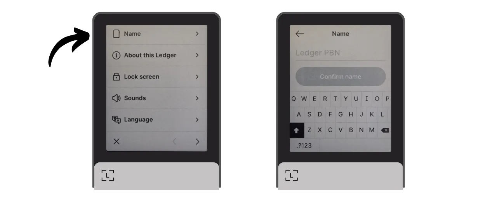
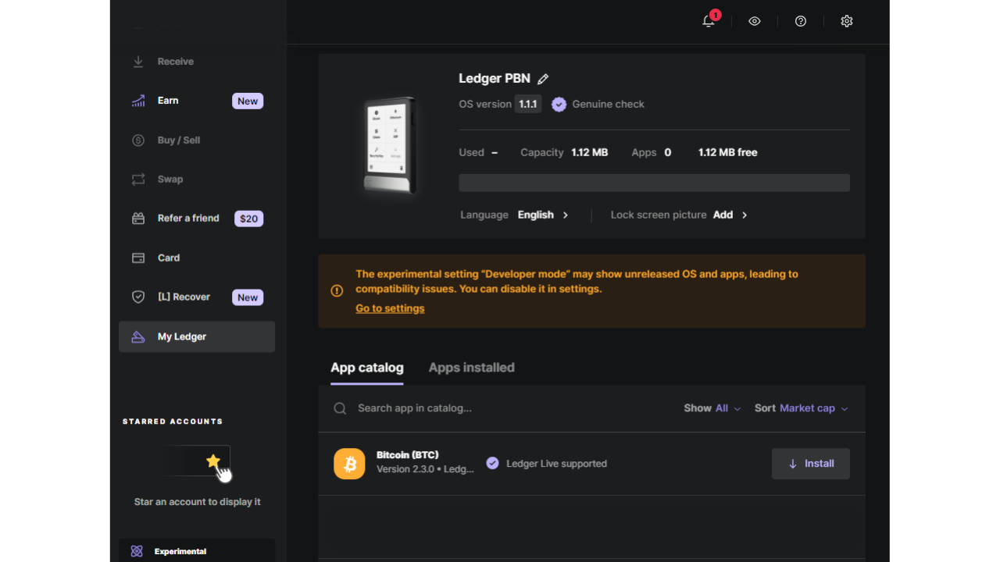
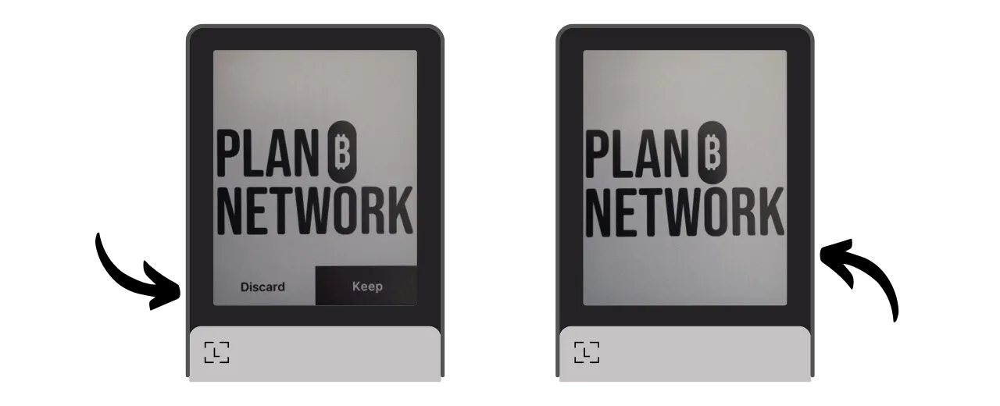
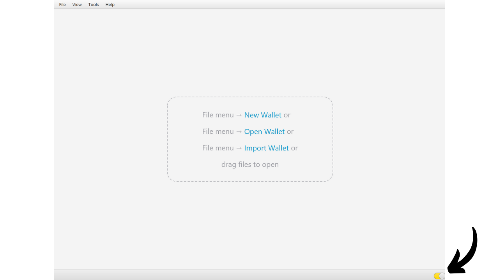
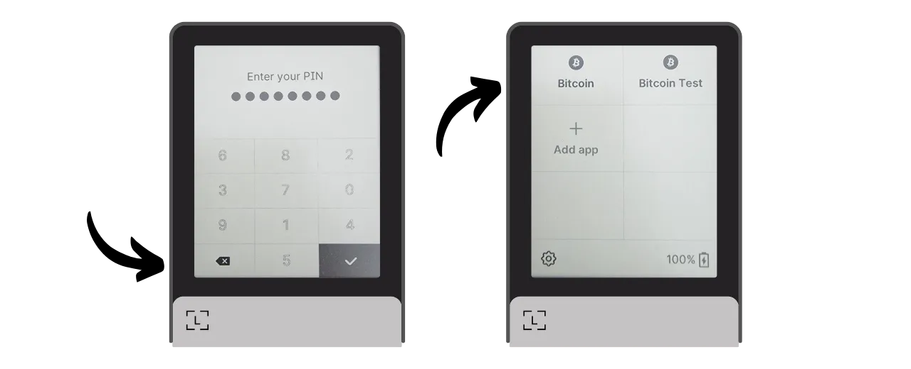
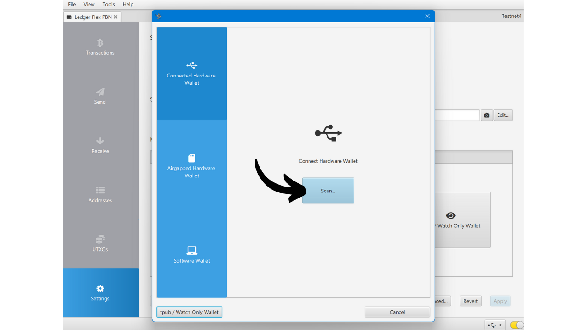
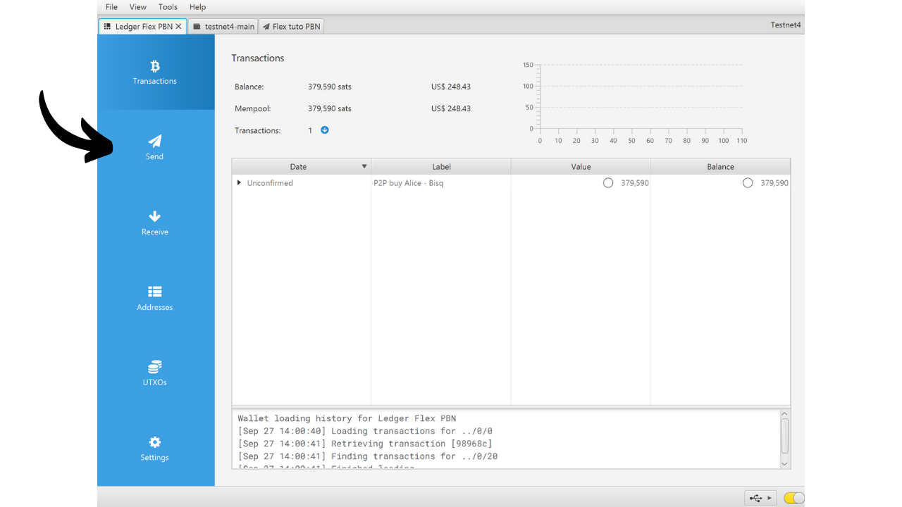
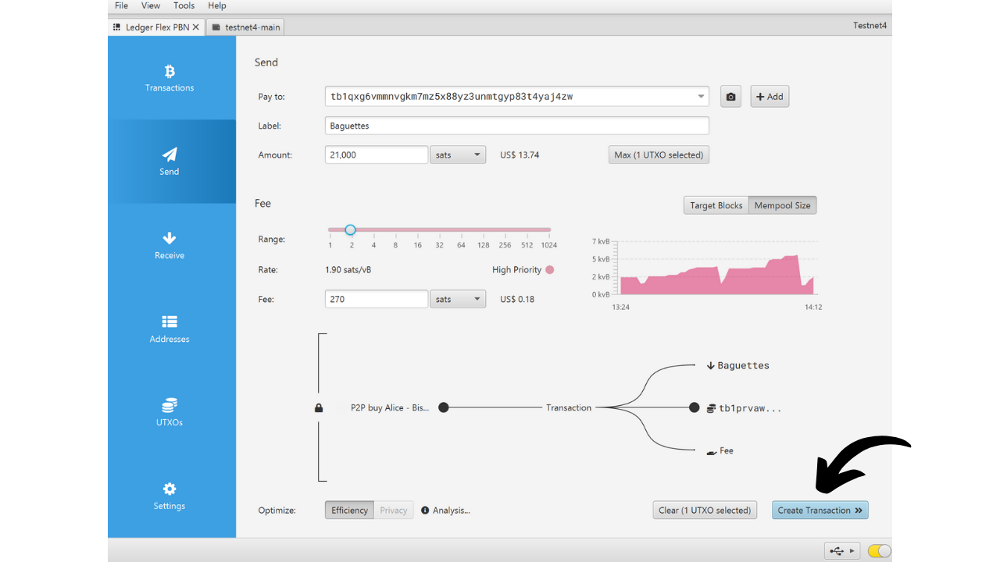
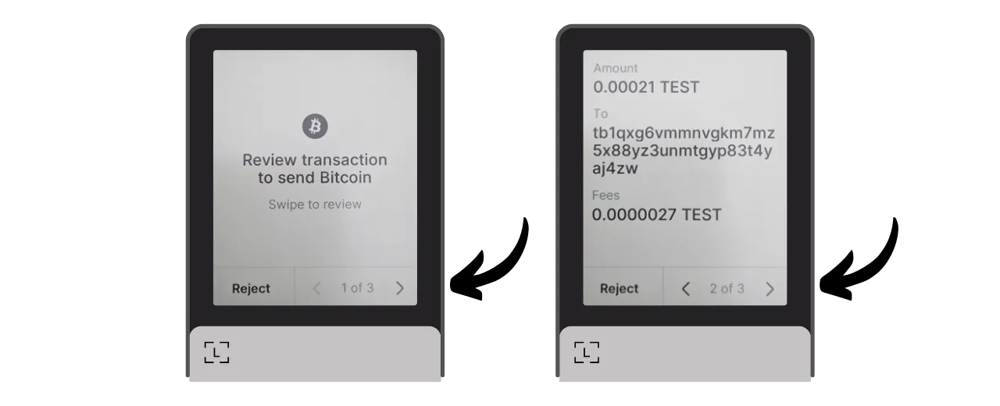
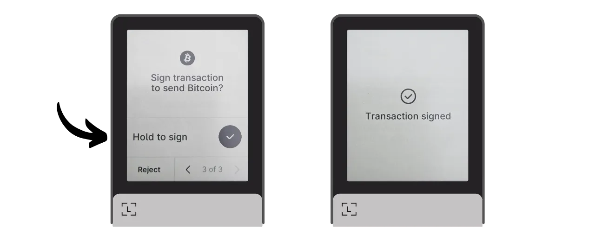

Laitelompakko on elektroninen laite, joka on omistettu Bitcoin-lompakon yksityisten avainten hallintaan ja turvaamiseen. Toisin kuin ohjelmistolompakot (tai kuumat lompakot), jotka on asennettu yleiskäyttöisiin koneisiin, jotka ovat usein yhdistetty Internetiin, laitelompakot mahdollistavat yksityisten avainten fyysisen eristämisen, vähentäen hakkeroinnin ja varkauden riskejä.

Laitelompakon päätavoite on minimoida laitteen toiminnallisuudet vähentääkseen sen hyökkäyspintaa. Vähemmän hyökkäyspintaa tarkoittaa myös vähemmän mahdollisia hyökkäysvektoreita, eli vähemmän järjestelmän heikkoja kohtia, joita hyökkääjät voisivat käyttää hyväkseen päästäkseen käsiksi bitcoineihin.

On suositeltavaa käyttää laitelompakkoa bitcoiniesi turvaamiseen, erityisesti jos omistat merkittäviä määriä, oli se sitten absoluuttisessa arvossa tai osuutena kokonaisvarallisuudestasi.

Laitelompakoita käytetään yhdessä lompakonhallintaohjelmiston kanssa tietokoneella tai älypuhelimella. Tämä ohjelmisto hallinnoi transaktioiden luomista, mutta tarvittava kryptografinen allekirjoitus näiden transaktioiden vahvistamiseksi tehdään vain laitelompakossa. Tämä tarkoittaa, että yksityiset avaimet eivät koskaan altistu mahdollisesti haavoittuvalle ympäristölle.

Laitelompakot tarjoavat kaksinkertaisen suojan käyttäjälle: toisaalta ne turvaavat bitcoinisi etähyökkäyksiltä pitämällä yksityiset avaimet offline-tilassa, ja toisaalta ne yleensä tarjoavat paremman fyysisen vastustuskyvyn avainten ulos puristamisen yrityksiä vastaan. Ja juuri näiden 2 turvakriteerin perusteella voi arvioida ja vertailla markkinoilla saatavilla olevia eri malleja.

Tässä oppaassa ehdotan yhden näistä ratkaisuista tutkimista: **Ledger Flex**.

## Johdanto Ledger Flexiin

Ledger Flex on ranskalaisen Ledger-yrityksen valmistama laitelompakko, joka on markkinoilla hinnalla 249 €.

Siinä on suuri E Ink -kosketusnäyttö, mustavalkoisen näyttöteknologian ominaisuus. Tämä on sama teknologia, jota löytyy elektronisista lukulaitteista. E Ink -näyttö mahdollistaa selkeän ja luettavan näytön, jopa kirkkaassa auringonvalossa, ja kuluttaa erittäin vähän energiaa, tai ei lainkaan, kun näyttö on staattinen. Se toimii käyttämällä mikrokapseleita, jotka sisältävät mustia ja valkoisia pigmenttipartikkeleita. Kun sähkövaraus kohdistetaan, mustat tai valkoiset partikkelit siirtyvät näytön pinnalle, mahdollistaen tekstien tai kuvien muodostamisen.
Ledger Flex on varustettu CC EAL6+ sertifioidulla "turvallisen elementin" sirulla, joka tarjoaa sinulle edistynyttä suojaa fyysisiä hyökkäyksiä vastaan laitteistossa. Näyttöä ohjataan suoraan tällä sirulla. Yleinen kritiikin kohde on, että tämän sirun koodi ei ole avoimen lähdekoodin, vaatien tietyn tason luottamusta tämän komponentin eheyteen. Kuitenkin, tämä elementti on riippumattomien asiantuntijoiden auditoima.

Käytön kannalta Ledger Flex tarjoaa useita yhteysvaihtoehtoja: Bluetooth, USB-C ja NFC. Suuri näyttö mahdollistaa transaktiotietojesi helpon tarkistamisen. Ledger erottuu myös kilpailijoistaan nopealla uusien Bitcoin-ominaisuuksien, kuten esimerkiksi Miniscriptin, omaksumisella.

Testattuani sitä olen vaikuttunut tuotteen laadusta. Käyttökokemus on erinomainen ja laite on intuitiivinen. Se on erinomainen laitelompakko. Siinä on kuitenkin mielestäni 2 merkittävää haittapuolta: kyvyttömyys tarkistaa sirun koodia ja tietenkin sen hinta, joka on huomattavasti korkeampi kuin kilpailijoilla. Vertailun vuoksi, Foundationin edistynein malli myydään 199 dollarilla, Coinkiten hinta on 219,99 dollaria, kun taas uusin Trezor, joka on myös varustettu suurella kosketusnäytöllä, tarjotaan 169 eurolla.

## Kuinka ostaa Ledger Flex?
Ledger Flex on saatavilla ostettavaksi [virallisilla verkkosivuilla](https://shop.ledger.com/pages/ledger-flex). Jos haluat ostaa sen fyysisestä kaupasta, löydät [sertifioitujen jälleenmyyjien listan](https://www.ledger.com/reseller) Ledgerin verkkosivuilta.
## Edellytykset

Kun olet vastaanottanut Ledger Flexisi, ensimmäinen askel on tarkastaa pakkaus varmistaaksesi, ettei sitä ole avattu.

Ledgerin pakkauksen tulisi sisältää 2 sinettiteippiä. Jos nämä teipit puuttuvat tai ovat vahingoittuneet, se voi viitata siihen, että laitteisto lompakko on saattanut joutua kompromissin kohteeksi ja se ei ehkä ole aito.

Avattaessa, paketista tulisi löytyä seuraavat esineet:
- Ledger Flex;
- USB-C kaapeli;
- Käyttöohje;
- Kortit muistilauseesi kirjoittamiseen.

Tätä opasta varten tarvitset 2 ohjelmistoa: Ledger Live Ledger Flexin alustamiseen ja Sparrow Wallet Bitcoin-lompakkosi hallintaan. Lataa [Ledger Live](https://www.ledger.com/ledger-live) ja [Sparrow Wallet](https://sparrowwallet.com/download/) niiden virallisilta verkkosivuilta.

Tarjoamme pian oppaan siitä, miten voit varmistaa lataamasi ohjelmiston aitouden ja eheyden. Suosittelen vahvasti tekemään niin tässä Ledger Liven ja Sparrow'n kohdalla.
## Kuinka alustaa Ledger Flex Ledger Liven avulla?

Käynnistä Ledger Flex painamalla oikeanpuoleista nappia muutaman sekunnin ajan.

Selaa läpi eri esittelysivut.

Valitse vaihtoehto "*Aseta ilman Ledger Liveä*", sitten klikkaa "*Ohita Ledger Live*" -nappia.

Sinua pyydetään sen jälkeen valitsemaan nimi Ledgerillesi. Klikkaa "*Aseta nimi*", ja syötä sitten valitsemasi nimi.

Valitse PIN-koodi laitteellesi, jota käytetään Ledgerin lukituksen avaamiseen. Tämä on siis suoja luvattomalta fyysiseltä pääsyltä. Tämä PIN-koodi ei vaikuta lompakkosi kryptografisten avainten johdannaisuuteen. Näin ollen, vaikka sinulla ei olisikaan pääsyä tähän PIN-koodiin, 24-sanaisen muistilauseesi avulla voit palauttaa pääsyn bitcoineihisi.

On suositeltavaa valita mahdollisimman satunnainen 8-numeroinen PIN-koodi. Varmista myös, että tallennat tämän koodin eri paikkaan kuin missä Ledger Flexisi säilytetään (esimerkiksi salasananhallintaohjelmassa).

Syötä PIN-koodisi toisen kerran vahvistaaksesi sen.

Sinulta kysytään sen jälkeen, haluatko palauttaa olemassa olevan lompakon vai luoda uuden. Tässä oppaassa käsittelemme uuden lompakon luomista alusta, joten valitse vaihtoehto "*Aseta uutena Ledgerinä*" uuden muistilauseen luomiseksi.

Flexisi antaa ohjeita muistilauseesi hallintaan.
**Tämä muistisana antaa täydellisen ja rajoittamattoman pääsyn kaikkiin bitcoineihisi**. Kuka tahansa, jolla on tämä lause, voi varastaa varasi, vaikka hänellä ei olisi fyysistä pääsyä Ledgeriisi. 24 sanan lause mahdollistaa pääsyn palauttamisen bitcoineihisi, jos menetät ne, ne varastetaan tai Ledger Flexisi vahingoittuu. On siis erittäin tärkeää tallentaa ja säilyttää se huolellisesti turvallisessa paikassa.
Voit kirjoittaa sen mukana toimitetulle pahville, tai lisäturvallisuuden vuoksi suosittelen kaivertamaan sen ruostumattomasta teräksestä valmistettuun välineeseen suojautuaksesi tulipalojen, tulvien tai sortumien riskeiltä.

Voit selata näitä ohjeita ja ohittaa sivuja koskettamalla näyttöä.

Ledger luo muistisanasi käyttäen satunnaislukugeneraattoriaan. Varmista, että kukaan ei tarkkaile sinua tämän toimenpiteen aikana. Kirjoita Ledgerin antamat sanat valitsemallesi fyysiselle välineelle. Turvallisuusstrategiastasi riippuen saatat harkita useamman täydellisen fyysisen kopion tekemistä lauseesta (mutta tärkeintä on, ettei sitä jaeta). On tärkeää pitää sanat numeroituna ja järjestyksessä.
***Ilmeisesti, sinun ei pitäisi koskaan jakaa näitä sanoja internetissä, toisin kuin minä teen tässä opetusohjelmassa. Tämä esimerkkilompakko käytetään vain Testnetissä ja se poistetaan opetusohjelman lopussa.***

Siirtyäksesi seuraavaan sanaryhmään, klikkaa "*Seuraava*" -painiketta. Kun kaikki sanat on merkitty ylös, klikkaa "*Valmis*" -painiketta siirtyäksesi seuraavaan vaiheeseen.

Klikkaa "*Aloita vahvistus*" -painiketta, valitse sitten muistisanasi sanat niiden järjestyksessä vahvistaaksesi, että olet merkinnyt ne oikein. Jatka tätä menettelyä kunnes olet saavuttanut 24. sanan.

Jos vahvistamasi lause vastaa täsmälleen sitä, jonka Flex antoi sinulle edellisessä vaiheessa, voit jatkaa. Jos ei, tämä osoittaa, että fyysinen varmuuskopiosi muistisanasta on virheellinen ja sinun on aloitettava prosessi alusta.

Ja siinä se on, siemenesi on luotu oikein Ledger Flexiisi. Ennen kuin jatkat uuden Bitcoin-lompakon luomista tästä siemenestä, tutkitaan laitteen asetuksia yhdessä.

## Kuinka muuttaa Ledgerin asetuksia?

Lukitaksesi ja avataksesi Ledgerin, paina sivupainiketta. Sinua pyydetään sitten syöttämään aiemmassa vaiheessa asettamasi PIN-koodi.

Päästäksesi asetuksiin, klikkaa hammasrattaan symbolia laitteen vasemmassa alakulmassa.

"*Name*" -valikko mahdollistaa Ledgerisi nimen muuttamisen.

"*About this Ledger*" -kohdassa löydät tietoa Flexistäsi.

"*Lock screen*" -valikossa voit vaihtaa lukitusnäytössä näkyvää kuvaa valitsemalla "*Customize lock screen picture*". Laitteen E Ink -näyttöteknologian ansiosta on mahdollista pitää näyttö jatkuvasti päällä kuluttamatta akkua. E Ink -näytöt eivät kuluta energiaa ylläpitäessään staattista kuvaa. Ne kuitenkin kuluttavat energiaa näytön muutosten aikana.
"*Auto-lock*" -alivalikko mahdollistaa Ledgerisi automaattisen lukituksen konfiguroinnin ja aktivoinnin määritetyn toimettomuusajan jälkeen.

"*Äänet*" -valikko mahdollistaa Flex-laitteesi äänien kytkemisen päälle tai pois. Ja "Kieli" -valikossa voit vaihtaa näyttökieltä.

Napsauttamalla oikeaa nuolta, pääset käsiksi muihin asetuksiin. "*Vaihda PIN*" sallii sinun vaihtaa PIN-koodisi.

"*Bluetooth*" ja "*NFC*" -valikot mahdollistavat näiden viestintätapojen hallinnan.

"*Akku*" -valikossa voit asettaa Ledgerin automaattisen sammutuksen.

"*Edistyneet*" -osio antaa pääsyn monimutkaisempiin turva-asetuksiin. On suositeltavaa pitää "*PIN sekoitus*" -vaihtoehto aktivoituna turvallisuuden parantamiseksi. Juuri tässä valikossa voit myös määrittää BIP39-salasanan.

Salasana on valinnainen salasana, joka yhdistettynä palautuslauseeseen, tarjoaa ylimääräisen turvakerroksen lompakollesi.

Tällä hetkellä lompakkosi on luotu 24 sanan muistilauseesta. Tämä palautuslause on erittäin tärkeä, sillä se mahdollistaa kaikkien lompakkosi avainten palauttamisen, jos ne katoavat. Kuitenkin, se muodostaa yksittäisen vikapiste (SPOF). Jos se vaarantuu, bitcoinsit ovat vaarassa. Tässä tulee mukaan salasana. Se on valinnainen salasana, jonka voit valita vapaasti, ja se lisätään muistilauseeseen vahvistamaan lompakon turvallisuutta.

Salasanaa ei tule sekoittaa PIN-koodiin. Se toimii osana kryptografisten avaintesi johdannaisuutta. Se toimii yhdessä muistilauseen kanssa, muuttaen avainten luontiin käytettävän siemenen. Näin ollen, vaikka joku saisi 24 sanan lauseesi, ilman salasanaa, he eivät pääse käsiksi varoihisi. Salasanan käyttö luo käytännössä uuden lompakon erillisillä avaimilla. Salasanan muuttaminen (jopa vähäisesti) luo eri lompakon.

Salasana on erittäin tehokas työkalu bitcoinsien turvallisuuden parantamiseen. On kuitenkin erittäin tärkeää ymmärtää, miten se toimii ennen sen käyttöönottoa, välttääksesi pääsyn menettämisen lompakkoosi. Selitän, miten salasanaa käytetään toisessa omistetussa opetusohjelmassa.

Lopuksi, viimeisellä asetussivulla voit nollata Ledgerisi. Jatka tämän nollauksen kanssa vain, jos olet varma, ettei se sisällä mitään bitcoinsien turvaamiseen käytettyjä avaimia, sillä saatat menettää pääsyn varoihisi pysyvästi.

## Kuinka asentaa Bitcoin-sovellus?

Aloita käynnistämällä Ledger Live -ohjelmisto tietokoneellasi, kytke sitten Ledger Flex ja avaa lukitus.

Ledger Livessä, siirry "*Oma Ledger*" -valikkoon. Sinua pyydetään antamaan lupa pääsyyn Flexiisi.

Vahvista pääsy Ledgerissasi napsauttamalla "*Salli*" -painiketta.

Ensiksi, jos Ledger Flexisi firmware ei ole ajan tasalla, Ledger Live tarjoaa automaattisesti sen päivittämistä. Tarvittaessa napsauta "*Päivitä firmware*", sitten "*Asenna päivitys*" aloittaaksesi asennuksen.

Ledgerissasi, napsauta "*Asenna*" -painiketta, odota asennuksen aikana.

Ledger Flexisi firmware on nyt ajan tasalla.

Voit halutessasi vaihtaa Ledger Flex -laitteesi lukitusnäytön taustakuvan. Tee tämä napsauttamalla "*Lisää >*".

Napsauta "*Lataa tietokoneelta*" -painiketta ja valitse taustakuvasi valokuvistasi.

Voit rajata kuvaa.

Valitse eri vaihtoehdoista kontrasti ja napsauta sitten "*Vahvista kontrasti*".

Flex-laitteessasi napsauta "*Lataa kuva*" -painiketta.

Jos olet tyytyväinen kuvaan, napsauta "*Pidä*" asettaaksesi sen lukitusnäytön taustakuvaksi.

Lopuksi lisäämme Bitcoin-sovelluksen. Tee tämä napsauttamalla Ledger Live -sovelluksessa "*Asenna*" -painiketta vieressä "*Bitcoin (BTC)*".

Sovellus asentuu Flex-laitteeseesi.

Tästä lähtien et tarvitse Ledger Live -ohjelmistoa lompakkosi säännölliseen hallintaan. Voit palata siihen ajoittain päivittääksesi laiteohjelmiston, kun uusia versioita on saatavilla. Kaikkeen muuhun käytämme Sparrow Walletia, joka on paljon kattavampi työkalu Bitcoin-lompakon tehokkaaseen hallintaan.

## Kuinka perustaa uusi Bitcoin-lompakko Sparrow'n avulla?
Avaa Sparrow Wallet ja ohita johdantosivut päästäksesi kotinäyttöön. Tarkista, että olet asianmukaisesti yhdistetty solmuun tarkkailemalla kytkintä näytön oikeassa alakulmassa.

Suosittelen vahvasti oman Bitcoin-solmun käyttöä. Tässä oppaassa käytän julkista solmua (keltainen), koska olen testnetissä, mutta normaalikäytössä on parempi valita paikallinen Bitcoin Core (vihreä) tai Electrum-palvelin, joka on yhdistetty etäsolmuun (sininen).

Napsauta "*Tiedosto*" -valikkoa ja sitten "*Uusi lompakko*".

Valitse tälle lompakolle nimi ja napsauta sitten "*Luo lompakko*".

"*Script Type*" -pudotusvalikosta valitse skriptityyppi, jota käytetään bitcoiniesi turvaamiseen. Suosittelen valitsemaan "*Taproot*", tai jos se ei ole saatavilla, "*Native SegWit*".

Napsauta "*Yhdistetty laitteistolompakko*" -painiketta.

Yhdistä Ledger Flex tietokoneeseesi, avaa se PIN-koodillasi ja avaa sitten "*Bitcoin*" -sovellus. Tässä oppaassa käytän "*Bitcoin Testnet*" -sovellusta, mutta menettely pysyy samana pääverkossa.

Sparrow'ssa napsauta "*Skannaa*" -painiketta.

Napsauta sitten "*Tuo avainvarasto*".

Nyt voit nähdä lompakkosi tiedot, mukaan lukien ensimmäisen tilisi laajennetun julkisen avaimen. Napsauta "*Käytä*" -painiketta viimeistelläksesi lompakon luomisen.

Valitse vahva salasana Sparrow Walletin käytön turvaamiseen. Tämä salasana varmistaa pääsyn turvallisuuden lompakon tietoihin Sparrow'ssa, mikä auttaa suojaamaan julkiset avaimet, osoitteet, nimikkeet ja tapahtumahistorian luvattomalta pääsyltä.

Neuvon sinua tallentamaan tämän salasanan salasananhallintaohjelmaan, jotta et unohda sitä.

Ja siinä se, lompakkosi on nyt luotu!

Ennen ensimmäisten bitcoiniesi vastaanottamista lompakkoosi, suosittelen vahvasti suorittamaan kuivan harjoituksen palautustestin. Kirjaa ylös viitetieto, kuten xpub, sitten nollaa Ledger Flex, kun lompakko on vielä tyhjä. Sen jälkeen yritä palauttaa lompakkosi Ledgerille käyttäen paperivarmuuskopioitasi. Tarkista, että palautuksen jälkeen luotu xpub vastaa alun perin kirjaamaasi. Jos näin on, voit olla varma, että paperivarmuuskopiosi ovat luotettavia.

## Kuinka vastaanottaa bitcoineja Ledger Flexillä?

Napsauta "*Vastaanota*" -välilehteä.

Yhdistä Ledger Flex tietokoneeseen, avaa se PIN-koodillasi, sitten avaa "*Bitcoin*" -sovellus.

Ennen Sparrow Walletin tarjoaman osoitteen käyttöä, varmista se Ledger Flexin näytöllä. Tämä käytäntö mahdollistaa varmistuksen, että Sparrow'ssa näytetty osoite ei ole petollinen ja että Ledger todella pitää yksityisavainta, joka on tarpeen myöhemmin näillä osoitteilla turvattujen bitcoinien käyttämiseen.

Suorittaaksesi tämän tarkistuksen, napsauta "*Näytä Osoite*" -painiketta.

Varmista, että Ledger Flexissä näytetty osoite vastaa Sparrow Walletissa ilmoitettua. On myös suositeltavaa suorittaa tämä tarkistus juuri ennen osoitteen antamista lähettäjälle, varmistaaksesi sen voimassaolon.

Voit lisätä "*Merkinnän*" kuvaamaan bitcoinien lähdettä, jotka turvataan tällä osoitteella. Tämä on hyvä käytäntö, joka auttaa hallitsemaan UTXOjasi paremmin.

Lisätietoja merkinnöistä, suosittelen myös tutustumaan tähän toiseen opastukseen:

https://planb.network/tutorials/privacy/utxo-labelling

Voit sitten käyttää tätä osoitetta bitcoinien vastaanottamiseen.

## Kuinka lähettää bitcoineja Ledger Flexillä?

Nyt kun olet vastaanottanut ensimmäiset satoshisi Flexillä turvatussa lompakossasi, voit myös käyttää niitä! Yhdistä Ledger tietokoneeseesi, avaa se, käynnistä Sparrow Wallet ja siirry "*Lähetä*" -välilehteen uuden siirron rakentamiseksi.

Jos haluat tehdä "*coin controlin*", eli valita tarkasti, mitkä UTXOt kulutetaan siirrossa, siirry "*UTXOihin*" -välilehteen. Valitse käytettävät UTXOt, sitten napsauta "*Lähetä Valitut*". Sinut ohjataan takaisin "*Lähetä*" -välilehden näkymään, mutta valitsemasi UTXOt on jo valittu siirtoa varten.

Syötä kohdeosoite. Voit myös syöttää useita osoitteita napsauttamalla "*+ Lisää*" -painiketta.

Merkitse "*Merkintä*" muistaaksesi tämän menon tarkoituksen.

Valitse tämän osoitteen saama summa.

Säädä siirtomaksusi määrää nykyisen markkinatilanteen mukaan.

Varmista, että kaikki siirron asetukset ovat oikein, ja klikkaa sitten "*Luo siirto*".

Jos kaikki on mielestäsi kunnossa, klikkaa "*Viimeistele siirto allekirjoitusta varten*".

Klikkaa "*Allekirjoita*".

Klikkaa "*Allekirjoita*" Ledger Flexisi vieressä.

Tarkista siirron asetukset Flexisi näytöltä, mukaan lukien vastaanottajan osoite, lähetetty summa ja maksun määrä.

Allekirjoittaaksesi pidä sormeasi "*Pidä allekirjoittaaksesi*" -painikkeella.

Siirtosi on nyt allekirjoitettu. Klikkaa "*Lähetä siirto*" lähettääksesi sen Bitcoin-verkkoon.

Löydät sen Sparrow Walletin "*Siirrot*" -välilehdeltä.

Onnittelut, olet nyt perillä Ledger Flexin peruskäytöstä Sparrow Walletin kanssa! Tulevassa oppaassa näemme, miten Ledger Flexiä käytetään Lianan kanssa hyödyntäen Miniscriptiä.

Jos pidit tätä opasta hyödyllisenä, arvostaisin peukkua ylöspäin alla. Voit vapaasti jakaa tämän artikkelin sosiaalisissa verkostoissasi. Suurkiitokset!