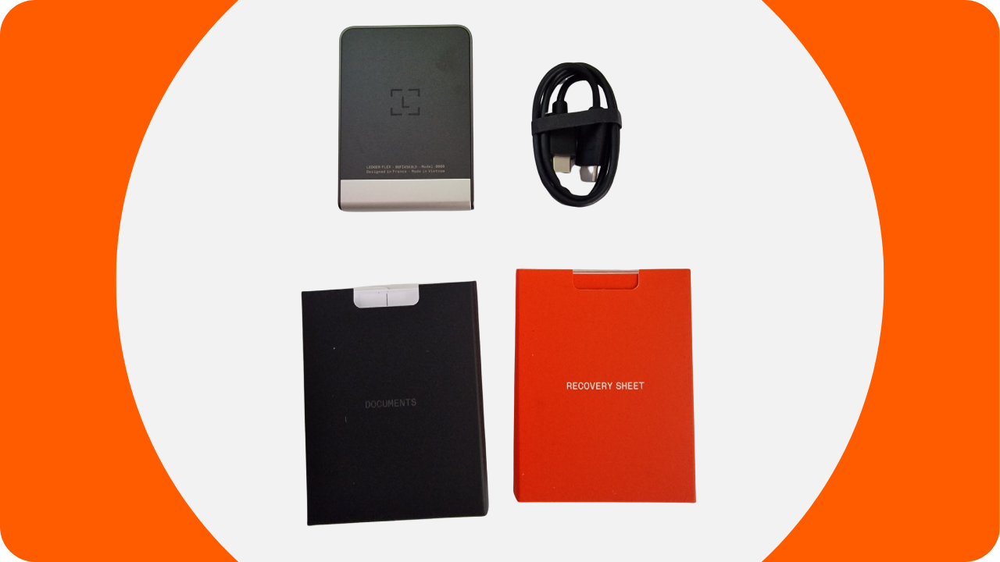
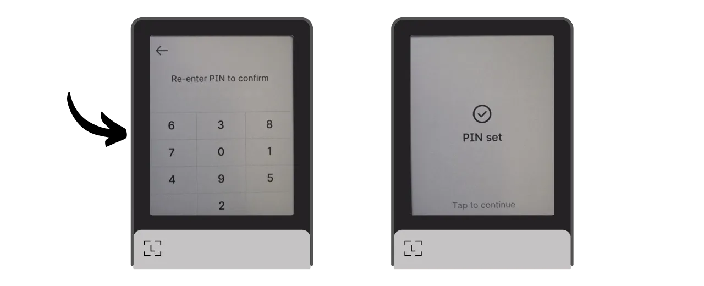
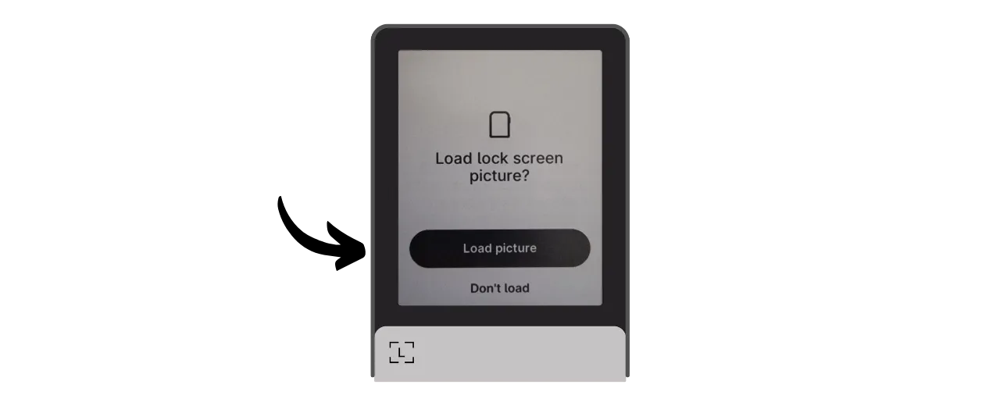
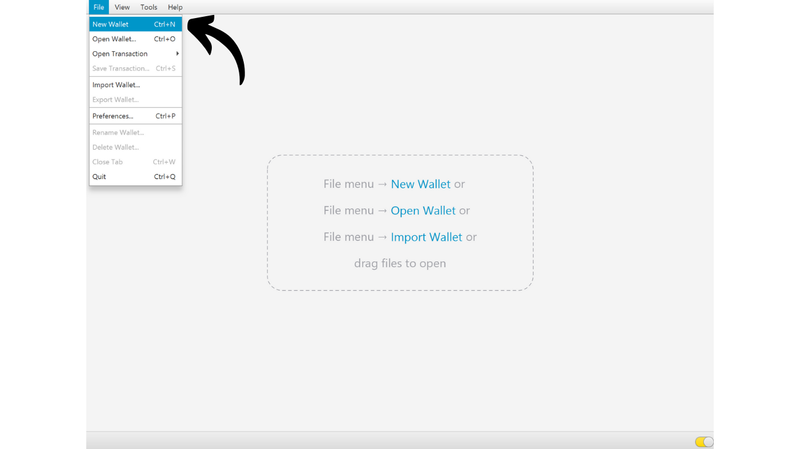
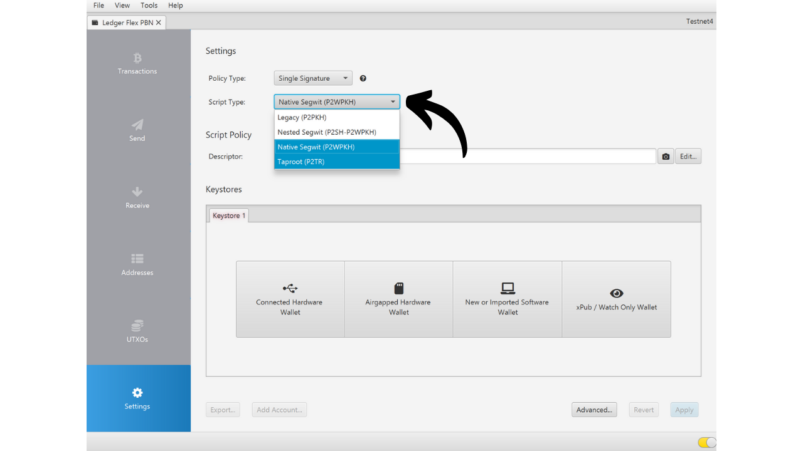
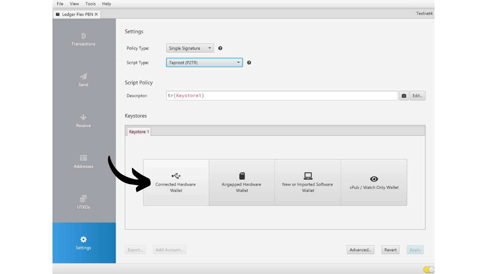
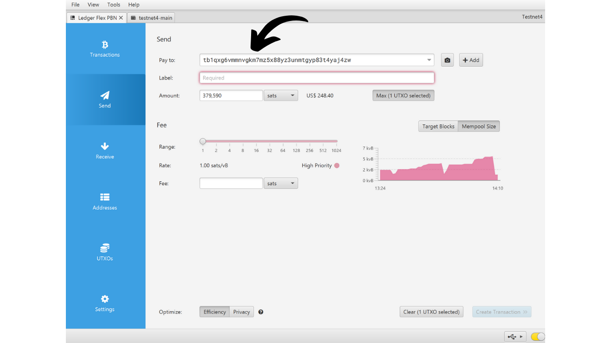

Dompet perangkat keras adalah perangkat elektronik yang didedikasikan untuk mengelola dan mengamankan kunci privat dari dompet Bitcoin. Berbeda dengan dompet perangkat lunak (atau dompet panas) yang dipasang pada mesin umum yang sering terhubung ke Internet, dompet perangkat keras memungkinkan isolasi fisik dari kunci privat, mengurangi risiko peretasan dan pencurian.

Tujuan utama dari dompet perangkat keras adalah untuk meminimalkan fungsionalitas perangkat untuk mengurangi permukaan serangan. Permukaan serangan yang lebih kecil juga berarti lebih sedikit vektor serangan potensial, yaitu, lebih sedikit titik lemah dalam sistem yang dapat dieksploitasi oleh penyerang untuk mengakses bitcoin.

Disarankan untuk menggunakan dompet perangkat keras untuk mengamankan bitcoin Anda, terutama jika Anda memiliki jumlah yang signifikan, baik dalam nilai absolut maupun sebagai proporsi dari total aset Anda.

Dompet perangkat keras digunakan bersama dengan perangkat lunak manajemen dompet pada komputer atau smartphone. Perangkat lunak ini mengelola pembuatan transaksi, tetapi tanda tangan kriptografis yang diperlukan untuk memvalidasi transaksi ini hanya dilakukan di dalam dompet perangkat keras. Ini berarti bahwa kunci privat tidak pernah terpapar ke lingkungan yang berpotensi rentan.

Dompet perangkat keras menawarkan perlindungan ganda bagi pengguna: di satu sisi, mereka mengamankan bitcoin Anda dari serangan jarak jauh dengan menjaga kunci privat offline, dan di sisi lain, mereka umumnya menawarkan resistensi fisik yang lebih baik terhadap upaya untuk mengekstrak kunci. Dan tepat pada 2 kriteria keamanan ini, seseorang dapat menilai dan meranking model yang berbeda yang tersedia di pasar.

Dalam tutorial ini, saya mengusulkan untuk menemukan salah satu solusi ini: **Ledger Flex**.

## Pengenalan ke Ledger Flex

Ledger Flex adalah dompet perangkat keras yang diproduksi oleh perusahaan Prancis Ledger, dipasarkan dengan harga 249 €.

Fitur ini mencakup layar sentuh E Ink besar, teknologi tampilan hitam putih. Ini adalah teknologi yang sama yang ditemukan dalam pembaca elektronik. Layar E Ink memungkinkan tampilan yang jelas dan mudah dibaca, bahkan dalam cahaya matahari terang, dan mengonsumsi sangat sedikit energi, atau sama sekali tidak ada ketika layar statis. Ini bekerja dengan menggunakan mikrokapsul yang berisi partikel pigmen hitam dan putih. Ketika muatan listrik diterapkan, partikel hitam atau putih bergerak ke permukaan layar, sehingga memungkinkan teks atau gambar dapat terbentuk.
Ledger Flex dilengkapi dengan chip "elemen aman" bersertifikat CC EAL6+, menawarkan Anda perlindungan lanjutan terhadap serangan fisik pada perangkat keras. Layar dikontrol langsung oleh chip ini. Sebuah titik kritik umum adalah bahwa kode untuk chip ini tidak bersifat open-source, memerlukan tingkat kepercayaan tertentu pada integritas komponen ini. Namun, elemen ini diaudit oleh para ahli independen.

Dalam hal penggunaan, Ledger Flex menawarkan beberapa opsi konektivitas: Bluetooth, USB-C, dan NFC. Layar besar memudahkan untuk memverifikasi detail transaksi Anda. Ledger juga menonjol dari pesaingnya dengan adopsi cepatnya terhadap fitur Bitcoin baru, seperti Miniscript, misalnya.

Setelah mengujinya, saya terkesan dengan kualitas produk. Pengalaman pengguna sangat baik, dan perangkat intuitif. Ini adalah dompet perangkat keras yang sangat baik. Namun, menurut saya, ini memiliki 2 kelemahan utama: ketidakmampuan untuk memverifikasi kode chip dan, tentu saja, harganya, yang secara signifikan lebih tinggi dari pesaingnya. Untuk perbandingan, model paling canggih dari Foundation dijual dengan harga $199, Coinkite dengan $219.99, sementara Trezor terbaru, juga dilengkapi dengan layar sentuh besar, ditawarkan dengan harga 169€.

## Bagaimana Cara Membeli Ledger Flex?
Ledger Flex dapat dibeli [di situs resmi](https://shop.ledger.com/pages/ledger-flex). Untuk membelinya di toko fisik, Anda juga dapat menemukan [daftar reseller bersertifikat](https://www.ledger.com/reseller) di situs web Ledger.
## Prasyarat

Setelah Anda menerima Ledger Flex Anda, langkah pertama adalah memeriksa kemasannya untuk memastikan belum dibuka.

Kemasan Ledger harus mencakup 2 strip segel. Jika strip ini hilang atau rusak, itu bisa menunjukkan bahwa dompet perangkat keras telah dikompromikan dan mungkin tidak asli.

Setelah dibuka, Anda seharusnya menemukan item berikut di dalam kotak:
- Ledger Flex;
- Kabel USB-C;
- Buku panduan pengguna;
- Kartu untuk menuliskan frasa mnemonik Anda.

Untuk tutorial ini, Anda akan memerlukan 2 perangkat lunak: Ledger Live untuk menginisialisasi Ledger Flex, dan Sparrow Wallet untuk mengelola dompet Bitcoin Anda. Unduh [Ledger Live](https://www.ledger.com/ledger-live) dan [Sparrow Wallet](https://sparrowwallet.com/download/) dari situs web resmi mereka.

Kami akan segera menawarkan tutorial tentang cara memverifikasi keaslian dan integritas perangkat lunak yang Anda unduh. Saya sangat menyarankan untuk melakukannya di sini untuk Ledger Live dan Sparrow.
## Bagaimana Cara Menginisialisasi Ledger Flex dengan Ledger Live?

Nyalakan Ledger Flex Anda dengan menekan tombol sisi kanan selama beberapa detik.

Gulir melalui berbagai halaman pengantar.

Pilih opsi "*Set up without Ledger Live*", kemudian klik tombol "*Skip Ledger Live*".

Anda kemudian akan diminta untuk memilih nama untuk Ledger Anda. Klik pada "*Set name*", dan kemudian masukkan nama pilihan Anda.

Pilih kode PIN untuk perangkat Anda, yang akan digunakan untuk membuka kunci Ledger Anda. Ini adalah perlindungan terhadap akses fisik yang tidak sah. Kode PIN ini tidak berperan dalam derivasi kunci kriptografis dompet Anda. Dengan demikian, bahkan tanpa akses ke kode PIN ini, memiliki frasa mnemonik 24 kata Anda akan memungkinkan Anda untuk mendapatkan kembali akses ke bitcoin Anda.

Disarankan untuk memilih kode PIN 8 digit, seacak mungkin. Juga, pastikan untuk menyimpan kode ini di tempat yang berbeda dari tempat Ledger Flex Anda disimpan (misalnya, dalam pengelola kata sandi).

Masukkan PIN Anda untuk kedua kalinya untuk mengonfirmasinya.

Anda kemudian akan diminta untuk memilih antara memulihkan dompet yang ada atau membuat yang baru. Dalam tutorial ini, kami membahas membuat dompet baru dari awal, jadi pilih opsi "*Set up as a new Ledger*" untuk menghasilkan frasa mnemonik baru.

Flex Anda akan memberikan instruksi tentang cara mengelola frasa pemulihan Anda.
**Frasa mnemonik ini memberikan akses lengkap dan tidak terbatas ke semua bitcoin Anda**. Siapapun yang memiliki frasa ini dapat mencuri dana Anda, bahkan tanpa akses fisik ke Ledger Anda. Frasa 24 kata memungkinkan pemulihan akses ke bitcoin Anda dalam kasus kehilangan, pencurian, atau kerusakan pada Ledger Flex Anda. Oleh karena itu, sangat penting untuk menyimpan dan menyimpannya di lokasi yang aman dengan hati-hati.
Anda dapat menuliskannya di kertas karton yang disediakan bersama Ledger Anda, atau untuk keamanan tambahan, saya merekomendasikan mengukirnya pada media stainless steel untuk melindungi dari risiko kebakaran, banjir, atau runtuh.

Anda dapat menjelajahi instruksi ini dan melewati halaman dengan menyentuh layar.

Ledger akan membuat frasa mnemonik Anda menggunakan generator angka acaknya. Pastikan Anda tidak diamati selama operasi ini. Tuliskan kata-kata yang disediakan oleh Ledger pada media fisik pilihan Anda. Tergantung pada strategi keamanan Anda, Anda mungkin mempertimbangkan untuk membuat beberapa salinan fisik lengkap dari frasa tersebut (tapi yang paling penting, jangan membaginya). Penting untuk menjaga kata-kata tersebut bernomor dan berurutan.
***Jelas, Anda seharusnya tidak pernah membagikan kata-kata ini di internet, berbeda dengan apa yang saya lakukan dalam tutorial ini. Dompet contoh ini hanya akan digunakan pada Testnet dan akan dihapus di akhir tutorial.***

Untuk berpindah ke kelompok kata berikutnya, klik tombol "*Next*". Setelah semua kata dicatat, klik tombol "*Done*" untuk melanjutkan ke langkah selanjutnya.

Klik tombol "*Start confirmation*", lalu pilih kata-kata dari frasa mnemonik Anda sesuai urutannya untuk mengonfirmasi bahwa Anda telah mencatatnya dengan benar. Lanjutkan prosedur ini sampai kata ke-24.

Jika frasa yang Anda konfirmasi cocok persis dengan yang diberikan Flex pada langkah sebelumnya, Anda dapat melanjutkan. Jika tidak, ini menunjukkan bahwa cadangan fisik frasa mnemonik Anda salah dan Anda perlu memulai proses dari awal.

Dan begitulah, seed Anda telah berhasil dibuat di Ledger Flex Anda. Sebelum melanjutkan untuk membuat dompet Bitcoin baru dari seed ini, mari kita jelajahi pengaturan perangkat bersama-sama.

## Bagaimana cara mengubah pengaturan Ledger Anda?

Untuk mengunci dan membuka kunci Ledger Anda, tekan tombol samping. Anda kemudian akan diminta untuk memasukkan kode PIN yang Anda tetapkan pada langkah sebelumnya.

Untuk mengakses pengaturan, klik pada simbol roda gigi di bagian bawah kiri perangkat Anda.

Menu "*Name*" memungkinkan Anda untuk mengubah nama Ledger Anda.

Di "*About this Ledger*," Anda akan menemukan informasi tentang Flex Anda.

Di menu "*Lock screen*," Anda memiliki opsi untuk mengubah gambar yang ditampilkan pada layar kunci dengan memilih "*Customize lock screen picture*". Berkat teknologi layar E Ink perangkat, dimungkinkan untuk menjaga layar tetap menyala tanpa mengonsumsi baterai. Layar E Ink tidak menggunakan energi untuk mempertahankan gambar statis. Namun, mereka mengonsumsi energi selama perubahan tampilan.
Submenu "*Auto-lock*" memungkinkan Anda untuk mengonfigurasi dan mengaktifkan penguncian otomatis Ledger Anda setelah periode tidak aktif yang ditentukan.

Menu "*Sounds*" memungkinkan Anda untuk mengaktifkan atau menonaktifkan suara pada Flex Anda. Dan di menu "Language", Anda dapat mengubah bahasa tampilan.

Dengan mengklik panah kanan, Anda dapat mengakses pengaturan lainnya. "*Change PIN*" memungkinkan Anda untuk mengubah kode PIN Anda.

Menu "*Bluetooth*" dan "*NFC*" memungkinkan Anda untuk mengelola komunikasi ini.

Di "*Battery*" Anda dapat mengatur penonaktifan otomatis Ledger.

Bagian "*Advanced*" memberi Anda akses ke pengaturan keamanan yang lebih canggih. Disarankan untuk menjaga opsi "*PIN shuffle*" tetap aktif untuk meningkatkan keamanan. Juga di menu ini Anda dapat mengonfigurasi passphrase BIP39.

Passphrase adalah kata sandi opsional yang, dikombinasikan dengan frasa pemulihan, memberikan lapisan keamanan tambahan untuk dompet Anda.

Saat ini, dompet Anda dihasilkan dari frasa mnemonik yang terdiri dari 24 kata. Frasa pemulihan ini sangat penting, karena memungkinkan Anda untuk mengembalikan semua kunci dompet Anda dalam kasus kehilangan. Namun, ini merupakan single point of failure (SPOF). Jika dikompromikan, bitcoin Anda dalam bahaya. Di sinilah passphrase berperan. Ini adalah kata sandi opsional, yang dapat Anda pilih secara sembarangan, yang menambah frasa mnemonik untuk memperkuat keamanan dompet.

Passphrase tidak boleh dikacaukan dengan kode PIN. Ini berperan dalam derivasi kunci kriptografis Anda. Ini bekerja bersama dengan frasa mnemonik, memodifikasi seed dari mana kunci dihasilkan. Jadi, bahkan jika seseorang mendapatkan frasa 24 kata Anda, tanpa passphrase, mereka tidak dapat mengakses dana Anda. Menggunakan passphrase pada dasarnya menciptakan dompet baru dengan kunci yang berbeda. Memodifikasi (bahkan sedikit) passphrase akan menghasilkan dompet yang berbeda.

Passphrase adalah alat yang sangat kuat untuk meningkatkan keamanan bitcoin Anda. Namun, sangat penting untuk memahami cara kerjanya sebelum mengimplementasikannya, untuk menghindari kehilangan akses ke dompet Anda. Saya akan menjelaskan cara menggunakan passphrase dalam tutorial khusus lainnya.

Akhirnya, halaman pengaturan terakhir memungkinkan Anda untuk mereset Ledger Anda. Lanjutkan dengan reset ini hanya jika Anda yakin tidak mengandung kunci apa pun yang mengamankan bitcoin, karena Anda bisa kehilangan akses ke dana Anda secara permanen.

## Bagaimana cara menginstal aplikasi Bitcoin?

Mulailah dengan meluncurkan perangkat lunak Ledger Live di komputer Anda, kemudian sambungkan dan buka kunci Ledger Flex Anda.

Di Ledger Live, pergi ke menu "*My Ledger*". Anda akan diminta untuk mengizinkan akses ke Flex Anda.

Validasi akses pada Ledger Anda dengan mengklik tombol "*Allow*".

Pertama, jika firmware Ledger Flex Anda tidak terbaru, Ledger Live secara otomatis akan menawarkan untuk memperbaruinya. Jika berlaku, klik pada "*Update firmware*", kemudian pada "*Install update*" untuk memulai instalasi.

Di Ledger Anda, klik pada tombol "*Install*", lalu tunggu selama instalasi.

Firmware Ledger Flex Anda sekarang sudah terbaru.

Jika Anda ingin, Anda dapat mengubah wallpaper layar kunci Ledger Flex Anda. Untuk melakukan ini, klik pada "*Add >*".

Klik tombol "*Upload from computer*" dan pilih wallpaper Anda dari foto-foto Anda.

Anda dapat memotong gambar Anda.

Pilih kontras dari berbagai opsi, kemudian klik pada "*Confirm contrast*".

Di Flex Anda, klik pada tombol "*Load picture*".

Jika Anda puas dengan gambar tersebut, klik pada "*Keep*" untuk mengaturnya sebagai wallpaper layar kunci Anda.

Akhirnya, kami akan menambahkan aplikasi Bitcoin. Untuk melakukan ini, di Ledger Live, klik pada tombol "*Install*" di sebelah "*Bitcoin (BTC)*".

Aplikasi akan terinstal di Flex Anda.

Mulai sekarang, Anda tidak akan lagi memerlukan perangkat lunak Ledger Live untuk pengelolaan dompet Anda secara reguler. Anda dapat kembali ke sana sesekali untuk memperbarui firmware ketika versi baru tersedia. Untuk segala hal lainnya, kami akan menggunakan Sparrow Wallet, yang merupakan alat yang lebih komprehensif untuk mengelola dompet Bitcoin secara efisien.

## Bagaimana cara menyiapkan dompet Bitcoin baru dengan Sparrow?
Buka Sparrow Wallet dan lewati halaman pengantar untuk mengakses layar utama. Periksa bahwa Anda benar-benar terhubung ke sebuah node dengan mengamati sakelar yang terletak di pojok kanan bawah layar.

Saya sangat merekomendasikan menggunakan node Bitcoin Anda sendiri. Dalam tutorial ini, saya menggunakan node publik (kuning) karena saya berada di testnet, tetapi untuk penggunaan normal, lebih baik memilih Bitcoin Core lokal (hijau) atau server Electrum yang terhubung ke node jarak jauh (biru).

Klik pada menu "*File*" kemudian "*New Wallet*".

Pilih nama untuk dompet ini, kemudian klik pada "*Create Wallet*".

Dalam menu dropdown "*Script Type*", pilih jenis skrip yang akan digunakan untuk mengamankan bitcoin Anda. Saya merekomendasikan untuk memilih "*Taproot*", atau jika tidak tersedia, "*Native SegWit*".

Klik pada tombol "*Connected Hardware Wallet*".

Hubungkan Ledger Flex Anda ke komputer, buka kunci dengan kode PIN Anda, kemudian buka aplikasi "*Bitcoin*". Dalam tutorial ini, saya menggunakan aplikasi "*Bitcoin Testnet*", tetapi prosedurnya tetap sama untuk mainnet.

Di Sparrow, klik pada tombol "*Scan*".

Kemudian klik pada "*Import Keystore*".

Anda sekarang dapat melihat detail dompet Anda, termasuk kunci publik yang diperluas dari akun pertama Anda. Klik pada tombol "*Apply*" untuk menyelesaikan pembuatan dompet.

Pilihlah kata sandi yang kuat untuk mengamankan akses ke Sparrow Wallet. Kata sandi ini akan memastikan keamanan akses ke data dompet Anda di Sparrow, yang membantu melindungi kunci publik, alamat, label, dan riwayat transaksi Anda dari akses tidak sah.

Saya menyarankan Anda untuk menyimpan kata sandi ini di pengelola kata sandi agar Anda tidak lupa.

Dan begitulah, dompet Anda sekarang telah dibuat!

Sebelum menerima bitcoin pertama Anda di dompet, saya sangat menyarankan Anda untuk melakukan tes pemulihan kering. Catat informasi referensi, seperti xpub Anda, kemudian reset Ledger Flex Anda sementara dompet masih kosong. Setelah itu, coba pulihkan dompet Anda di Ledger menggunakan cadangan kertas Anda. Periksa bahwa xpub yang dihasilkan setelah pemulihan cocok dengan yang Anda catat awalnya. Jika ini kasusnya, Anda dapat yakin bahwa cadangan kertas Anda dapat diandalkan.

## Bagaimana cara menerima bitcoin dengan Ledger Flex?

Klik pada tab "*Receive*".

Hubungkan Ledger Flex Anda ke komputer, buka kunci dengan kode PIN Anda, kemudian buka aplikasi "*Bitcoin*".

Sebelum menggunakan alamat yang disediakan oleh Sparrow Wallet, verifikasi di layar Ledger Flex Anda. Praktik ini memungkinkan Anda untuk memastikan bahwa alamat yang ditampilkan di Sparrow tidak palsu dan bahwa Ledger memang memiliki kunci privat yang diperlukan untuk menghabiskan bitcoin yang diamankan dengan alamat ini nanti.

Untuk melakukan verifikasi ini, klik pada tombol "*Display Address*".

Pastikan bahwa alamat yang ditampilkan di Ledger Flex Anda cocok dengan yang ditunjukkan di Sparrow Wallet. Juga disarankan untuk melakukan verifikasi ini tepat sebelum memberikan alamat Anda kepada pengirim, untuk memastikan validitasnya.

Anda dapat menambahkan "*Label*" untuk menggambarkan sumber bitcoin yang akan diamankan dengan alamat ini. Ini adalah praktik yang baik yang membantu Anda mengelola UTXO Anda dengan lebih baik.

Untuk informasi lebih lanjut tentang pelabelan, saya juga menyarankan Anda untuk melihat tutorial lain ini:

https://planb.network/tutorials/privacy/utxo-labelling

Anda kemudian dapat menggunakan alamat ini untuk menerima bitcoin.

## Bagaimana cara mengirim bitcoin dengan Ledger Flex?

Sekarang setelah Anda menerima sats pertama Anda di dompet yang diamankan dengan Flex, Anda juga dapat menghabiskannya! Hubungkan Ledger Anda ke komputer, buka kunci, luncurkan Sparrow Wallet, kemudian pergi ke tab "*Send*" untuk membuat transaksi baru.

Jika Anda ingin melakukan "*coin control*", yaitu secara spesifik memilih UTXO mana yang akan dikonsumsi dalam transaksi, pergi ke tab "*UTXOs*". Pilih UTXO yang ingin Anda habiskan, kemudian klik pada "*Send Selected*". Anda akan diarahkan ke layar yang sama dari tab "*Send*", tetapi dengan UTXO Anda sudah dipilih untuk transaksi.

Masukkan alamat tujuan. Anda juga dapat memasukkan beberapa alamat dengan mengklik tombol "*+ Add*".

Catat sebuah "*Label*" untuk mengingat tujuan pengeluaran ini.
Pilih jumlah yang akan dikirim ke alamat ini.

Sesuaikan tarif biaya transaksi Anda sesuai dengan pasar saat ini.

Pastikan semua pengaturan transaksi Anda sudah benar, kemudian klik pada "*Buat Transaksi*".

Jika semuanya sesuai dengan keinginan Anda, klik pada "*Finalisasi Transaksi untuk Ditandatangani*".

Klik pada "*Tandatangan*".

Klik pada "*Tandatangan*" di sebelah Ledger Flex Anda.

Verifikasi pengaturan transaksi di layar Flex Anda, termasuk alamat penerima, jumlah yang dikirim, dan jumlah biaya.

Untuk menandatangani, tahan jari Anda pada tombol "*Tahan untuk menandatangani*".

Transaksi Anda sekarang sudah ditandatangani. Klik pada "*Siarkan Transaksi*" untuk menyiarkannya di jaringan Bitcoin.

Anda dapat menemukannya di tab "*Transaksi*" dari Sparrow Wallet.

Selamat, Anda sekarang sudah menguasai penggunaan dasar Ledger Flex dengan Sparrow Wallet! Dalam tutorial mendatang, kita akan melihat cara menggunakan Ledger Flex dengan Liana untuk memanfaatkan Miniscript.

Jika Anda merasa tutorial ini bermanfaat, saya akan sangat menghargai jempol ke atas di bawah ini. Jangan ragu untuk membagikan artikel ini di jaringan sosial Anda. Terima kasih banyak!