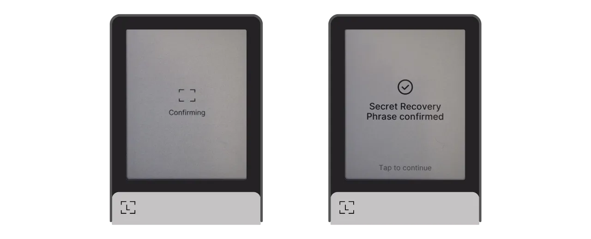
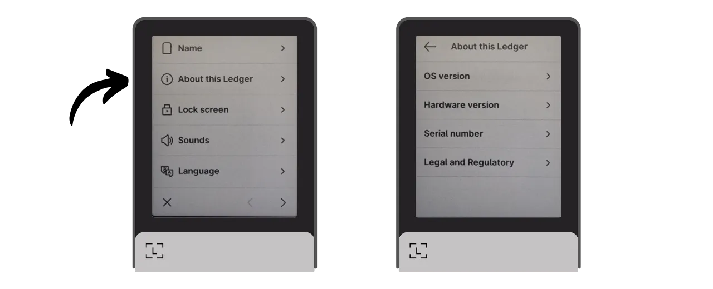

Un portafoglio hardware è un dispositivo elettronico dedicato alla gestione e alla sicurezza delle chiavi private di un portafoglio Bitcoin. A differenza dei portafogli software (o hot wallets) installati su macchine di uso generale spesso connesse a Internet, i portafogli hardware permettono l'isolamento fisico delle chiavi private, riducendo i rischi di hacking e furto.

L'obiettivo principale di un portafoglio hardware è minimizzare le funzionalità del dispositivo per ridurre la sua superficie di attacco. Meno superficie di attacco significa anche meno vettori di attacco potenziali, ovvero meno punti deboli nel sistema che gli aggressori potrebbero sfruttare per accedere ai bitcoin.

Si raccomanda di utilizzare un portafoglio hardware per proteggere i propri bitcoin, specialmente se si detengono quantità significative, sia in valore assoluto sia come proporzione dei propri asset totali.

I portafogli hardware sono utilizzati in combinazione con software di gestione del portafoglio su un computer o smartphone. Questo software gestisce la creazione delle transazioni, ma la firma crittografica necessaria per convalidare queste transazioni viene eseguita solo all'interno del portafoglio hardware. Ciò significa che le chiavi private non sono mai esposte a un ambiente potenzialmente vulnerabile.

I portafogli hardware offrono una doppia protezione per l'utente: da un lato, proteggono i bitcoin da attacchi remoti mantenendo le chiavi private offline, e dall'altro, offrono generalmente una migliore resistenza fisica contro i tentativi di estrazione delle chiavi. Ed è proprio su questi 2 criteri di sicurezza che si può giudicare e classificare i diversi modelli disponibili sul mercato.

In questo tutorial, propongo di scoprire una di queste soluzioni: il **Ledger Flex**.

## Introduzione al Ledger Flex

Il Ledger Flex è un portafoglio hardware prodotto dalla società francese Ledger, commercializzato al prezzo di 249 €.

Dispone di un ampio touchscreen E Ink, una tecnologia di visualizzazione in bianco e nero. Questa è la stessa tecnologia trovata nei lettori elettronici. Lo schermo E Ink permette una visualizzazione chiara e leggibile, anche alla luce diretta del sole, e consuma pochissima energia, o nessuna quando lo schermo è statico. Funziona utilizzando microcapsule contenenti particelle di pigmento bianco e nero. Quando viene applicata una carica elettrica, le particelle nere o bianche si muovono verso la superficie dello schermo, consentendo così la formazione di testo o immagini.
Il Ledger Flex è dotato di un chip "elemento sicuro" certificato CC EAL6+, che offre una protezione avanzata contro attacchi fisici all'hardware. Lo schermo è controllato direttamente da questo chip. Un punto comune di critica è che il codice per questo chip non è open-source, richiedendo un certo livello di fiducia nell'integrità di questo componente. Tuttavia, questo elemento è sottoposto a revisione da parte di esperti indipendenti.

In termini di utilizzo, il Ledger Flex offre diverse opzioni di connettività: Bluetooth, USB-C e NFC. Il grande schermo permette una facile verifica dei dettagli delle tue transazioni. Ledger si distingue anche dai suoi concorrenti per la sua rapida adozione di nuove funzionalità Bitcoin, come Miniscript, ad esempio.

Dopo averlo testato, sono impressionato dalla qualità del prodotto. L'esperienza utente è eccellente e il dispositivo è intuitivo. È un eccellente portafoglio hardware. Tuttavia, presenta 2 principali svantaggi a mio parere: l'impossibilità di verificare il codice del chip e, naturalmente, il suo prezzo, significativamente più alto rispetto ai suoi concorrenti. Per confronto, il modello più avanzato di Foundation è venduto a $199, quello di Coinkite a $219.99, mentre l'ultimo Trezor, anch'esso dotato di un ampio touchscreen, è offerto a 169€.

## Come Acquistare un Ledger Flex?
Il Ledger Flex è disponibile per l'acquisto [sul sito ufficiale](https://shop.ledger.com/pages/ledger-flex). Per acquistarlo in un negozio fisico, puoi anche trovare [l'elenco dei rivenditori certificati](https://www.ledger.com/reseller) sul sito web di Ledger.
## Prerequisiti

Una volta ricevuto il tuo Ledger Flex, il primo passo è esaminare l'imballaggio per assicurarti che non sia stato aperto.

L'imballaggio del Ledger dovrebbe includere 2 sigilli di garanzia. Se questi sigilli mancano o sono danneggiati, potrebbe indicare che il portafoglio hardware è stato compromesso e potrebbe non essere autentico.

All'apertura, dovresti trovare i seguenti articoli nella scatola:
- Il Ledger Flex;
- Un cavo USB-C;
- Un manuale utente;
- Carte per annotare la tua frase mnemonica.

Per questo tutorial, avrai bisogno di 2 software: Ledger Live per inizializzare il Ledger Flex, e Sparrow Wallet per gestire il tuo portafoglio Bitcoin. Scarica [Ledger Live](https://www.ledger.com/ledger-live) e [Sparrow Wallet](https://sparrowwallet.com/download/) dai loro siti ufficiali.

Presto offriremo un tutorial su come verificare l'autenticità e l'integrità del software che scarichi. Consiglio vivamente di farlo qui per Ledger Live e Sparrow.
## Come Inizializzare un Ledger Flex con Ledger Live?

Accendi il tuo Ledger Flex premendo il pulsante sul lato destro per alcuni secondi.

Scorri tra le diverse pagine di introduzione.

Seleziona l'opzione "*Configura senza Ledger Live*", poi clicca sul pulsante "*Salta Ledger Live*".

Ti verrà quindi chiesto di scegliere un nome per il tuo Ledger. Clicca su "*Imposta nome*", e poi inserisci il nome di tua scelta.

Scegli il codice PIN per il tuo dispositivo, che verrà utilizzato per sbloccare il tuo Ledger. Questo rappresenta quindi una protezione contro l'accesso fisico non autorizzato. Questo codice PIN non gioca un ruolo nella derivazione delle chiavi crittografiche del tuo portafoglio. Pertanto, anche senza accesso a questo codice PIN, avendo la tua frase mnemonica di 24 parole ti permetterà di riguadagnare l'accesso ai tuoi bitcoin.

Si raccomanda di scegliere un codice PIN di 8 cifre, il più casuale possibile. Inoltre, assicurati di salvare questo codice in un luogo diverso da dove è conservato il tuo Ledger Flex (ad esempio, in un gestore di password).

Inserisci nuovamente il tuo PIN per confermarlo.

Ti verrà quindi chiesto di scegliere tra recuperare un portafoglio esistente o crearne uno nuovo. In questo tutorial, stiamo trattando la creazione di un nuovo portafoglio da zero, quindi seleziona l'opzione "*Configura come un nuovo Ledger*" per generare una nuova frase mnemonica.

Il tuo Flex fornirà istruzioni su come gestire la tua frase di recupero.
**Questa frase mnemonica offre accesso completo e illimitato a tutti i tuoi bitcoin**. Chiunque sia in possesso di questa frase può rubare i tuoi fondi, anche senza accesso fisico al tuo Ledger. La frase di 24 parole consente il ripristino dell'accesso ai tuoi bitcoin in caso di perdita, furto o danneggiamento del tuo Ledger Flex. È quindi molto importante salvare e conservare con cura questa frase in un luogo sicuro.
Puoi scriverla sul foglio di cartone fornito con il tuo Ledger, o, per una maggiore sicurezza, ti consiglio di incidere la frase su un supporto in acciaio inossidabile per proteggerla dai rischi di incendi, alluvioni o crolli.

Puoi sfogliare queste istruzioni e saltare le pagine toccando lo schermo.

Il Ledger creerà la tua frase mnemonica utilizzando il suo generatore di numeri casuali. Assicurati di non essere osservato durante questa operazione. Scrivi le parole fornite dal Ledger sul supporto fisico che preferisci. A seconda della tua strategia di sicurezza, potresti considerare di fare diverse copie fisiche complete della frase (ma, soprattutto, non dividerla). È importante mantenere le parole numerate e in ordine sequenziale.
***Ovviamente, non dovresti mai condividere queste parole su internet, al contrario di quanto sto facendo in questo tutorial. Questo portafoglio di esempio verrà utilizzato solo sulla Testnet e verrà cancellato al termine del tutorial.***

Per passare al successivo gruppo di parole, clicca sul pulsante "*Avanti*". Una volta annotate tutte le parole, clicca sul pulsante "*Fatto*" per procedere al passo successivo.

Clicca sul pulsante "*Inizia conferma*", poi seleziona le parole della tua frase mnemonica nel loro ordine per confermare che le hai annotate correttamente. Continua questa procedura fino alla 24ª parola.

Se la frase che stai confermando corrisponde esattamente a quella che il Flex ti ha fornito nel passo precedente, puoi procedere. In caso contrario, ciò indica che il tuo backup fisico della frase mnemonica è errato e devi ricominciare il processo.

Ed ecco fatto, il tuo seed è stato correttamente creato sul tuo Ledger Flex. Prima di procedere alla creazione di un nuovo portafoglio Bitcoin da questo seed, esploriamo insieme le impostazioni del dispositivo.

## Come modificare le impostazioni del tuo Ledger?

Per bloccare e sbloccare il tuo Ledger, premi il pulsante laterale. Ti verrà quindi chiesto di inserire il codice PIN che hai impostato nel passo precedente.

Per accedere alle impostazioni, clicca sull'icona dell'ingranaggio in basso a sinistra sul tuo dispositivo.

Il menu "*Nome*" ti permette di cambiare il nome del tuo Ledger.

In "*Informazioni su questo Ledger*", troverai informazioni sul tuo Flex.

Nel menu "*Schermata di blocco*", hai l'opzione di cambiare l'immagine visualizzata sulla schermata di blocco selezionando "*Personalizza immagine schermata di blocco*". Grazie alla tecnologia dello schermo E Ink del dispositivo, è possibile mantenere lo schermo costantemente acceso senza consumare batteria. Gli schermi E Ink non utilizzano energia per mantenere un'immagine statica. Tuttavia, consumano energia durante i cambi di visualizzazione.
Il sottomenu "*Blocco automatico*" ti permette di configurare e attivare il blocco automatico del tuo Ledger dopo un determinato periodo di inattività.

Il menu "*Suoni*" ti permette di attivare o disattivare i suoni del tuo Flex. E nel menu "Lingua", puoi cambiare la lingua di visualizzazione.

Cliccando sulla freccia a destra, puoi accedere ad altre impostazioni. "*Cambia PIN*" ti permette di modificare il tuo codice PIN.

I menu "*Bluetooth*" e "*NFC*" ti permettono di gestire queste comunicazioni.

In "*Batteria*" puoi impostare lo spegnimento automatico del Ledger.

La sezione "*Avanzate*" ti dà accesso a impostazioni di sicurezza più sofisticate. Si consiglia di mantenere attivata l'opzione "*PIN shuffle*" per migliorare la sicurezza. È anche in questo menu che puoi configurare una passphrase BIP39.

La passphrase è una password opzionale che, combinata con la frase di recupero, fornisce un ulteriore livello di sicurezza per il tuo portafoglio.

Attualmente, il tuo portafoglio è generato da una frase mnemonica composta da 24 parole. Questa frase di recupero è molto importante, in quanto ti permette di ripristinare tutte le chiavi del tuo portafoglio in caso di perdita. Tuttavia, costituisce un unico punto di fallimento (SPOF). Se viene compromessa, i bitcoin sono in pericolo. Qui entra in gioco la passphrase. È una password opzionale, che puoi scegliere arbitrariamente, che si aggiunge alla frase mnemonica per rafforzare la sicurezza del portafoglio.

La passphrase non deve essere confusa con il codice PIN. Gioca un ruolo nella derivazione delle tue chiavi crittografiche. Funziona in tandem con la frase mnemonica, modificando il seed da cui vengono generate le chiavi. Così, anche se qualcuno ottiene la tua frase di 24 parole, senza la passphrase, non può accedere ai tuoi fondi. Utilizzare una passphrase crea essenzialmente un nuovo portafoglio con chiavi distinte. Modificare (anche leggermente) la passphrase genererà un portafoglio diverso.

La passphrase è uno strumento molto potente per migliorare la sicurezza dei tuoi bitcoin. Tuttavia, è molto importante capire come funziona prima di implementarla, per evitare di perdere l'accesso al tuo portafoglio. Spiegherò come utilizzare la passphrase in un altro tutorial dedicato.

Infine, l'ultima pagina delle impostazioni ti permette di resettare il tuo Ledger. Procedi con questo reset solo se sei certo che non contenga chiavi che assicurano bitcoin, poiché potresti perdere definitivamente l'accesso ai tuoi fondi.

## Come installare l'applicazione Bitcoin?

Inizia lanciando il software Ledger Live sul tuo computer, poi connetti e sblocca il tuo Ledger Flex.

In Ledger Live, vai al menu "*Il mio Ledger*". Ti verrà chiesto di autorizzare l'accesso al tuo Flex.

Convalida l'accesso sul tuo Ledger cliccando sul pulsante "*Permetti*".

Prima di tutto, se il firmware del tuo Ledger Flex non è aggiornato, Ledger Live offrirà automaticamente di aggiornarlo. Se applicabile, clicca su "*Aggiorna firmware*", poi su "*Installa aggiornamento*" per avviare l'installazione.

Sul tuo Ledger, clicca sul pulsante "*Installa*", poi attendi durante l'installazione.

Il firmware del tuo Ledger Flex è ora aggiornato.
Se desideri, puoi cambiare lo sfondo della schermata di blocco del tuo Ledger Flex. Per farlo, clicca su "*Aggiungi >*".

Clicca sul pulsante "*Carica dal computer*" e scegli il tuo sfondo dalle tue foto.

Puoi ritagliare la tua immagine.

Scegli un contrasto dalle diverse opzioni, poi clicca su "*Conferma contrasto*".

Sul tuo Flex, clicca sul pulsante "*Carica immagine*".

Se sei soddisfatto dell'immagine, clicca su "*Mantieni*" per impostarla come sfondo della schermata di blocco.

Infine, aggiungeremo l'applicazione Bitcoin. Per farlo, su Ledger Live, clicca sul pulsante "*Installa*" accanto a "*Bitcoin (BTC)*".

L'applicazione verrà installata sul tuo Flex.

Da ora in poi, non avrai più bisogno del software Ledger Live per la gestione regolare del tuo portafoglio. Puoi tornarci occasionalmente per aggiornare il firmware quando sono disponibili nuove versioni. Per tutto il resto, useremo Sparrow Wallet, che è uno strumento molto più completo per gestire efficacemente un portafoglio Bitcoin.

## Come configurare un nuovo portafoglio Bitcoin con Sparrow?
Apri Sparrow Wallet e salta le pagine di introduzione per accedere alla schermata principale. Controlla di essere correttamente connesso a un nodo osservando l'interruttore situato in basso a destra dello schermo.

Consiglio vivamente di utilizzare il proprio nodo Bitcoin. In questo tutorial, sto usando un nodo pubblico (giallo) perché sono sulla testnet, ma per un uso normale, è meglio optare per un Bitcoin Core locale (verde) o un server Electrum connesso a un nodo remoto (blu).

Clicca sul menu "*File*" poi "*Nuovo Portafoglio*".

Scegli un nome per questo portafoglio, poi clicca su "*Crea Portafoglio*".

Nel menu a tendina "*Tipo di Script*", seleziona il tipo di script che verrà utilizzato per proteggere i tuoi bitcoin. Consiglio di optare per "*Taproot*", o se non disponibile, "*Native SegWit*".

Clicca sul pulsante "*Portafoglio Hardware Connesso*".

Connetti il tuo Ledger Flex al computer, sbloccalo con il tuo codice PIN, poi apri l'applicazione "*Bitcoin*". In questo tutorial, sto usando l'applicazione "*Bitcoin Testnet*", ma la procedura rimane la stessa per il mainnet.

Su Sparrow, clicca sul pulsante "*Scansiona*".

Poi clicca su "*Importa Keystore*".

Ora puoi vedere i dettagli del tuo portafoglio, inclusa la chiave pubblica estesa del tuo primo account. Clicca sul pulsante "*Applica*" per finalizzare la creazione del portafoglio.
Scegli una password forte per proteggere l'accesso a Sparrow Wallet. Questa password garantirà la sicurezza dell'accesso ai tuoi dati del portafoglio su Sparrow, contribuendo a proteggere le tue chiavi pubbliche, indirizzi, etichette e la cronologia delle transazioni da qualsiasi accesso non autorizzato.

Ti consiglio di salvare questa password in un gestore di password per non dimenticarla.

Ecco fatto, il tuo portafoglio è ora creato!

Prima di ricevere i tuoi primi bitcoin nel tuo portafoglio, ti consiglio vivamente di eseguire un test di recupero a secco. Annota un pezzo di informazione di riferimento, come il tuo xpub, poi resetta il tuo Ledger Flex mentre il portafoglio è ancora vuoto. Successivamente, prova a ripristinare il tuo portafoglio sul Ledger utilizzando i tuoi backup su carta. Verifica che l'xpub generato dopo il ripristino corrisponda a quello che avevi inizialmente annotato. Se è così, puoi essere sicuro che i tuoi backup su carta sono affidabili.

## Come ricevere bitcoin con il Ledger Flex?

Clicca sulla scheda "*Ricevi*".

Connetti il tuo Ledger Flex al computer, sbloccalo con il tuo codice PIN, poi apri l'applicazione "*Bitcoin*".

Prima di utilizzare l'indirizzo fornito da Sparrow Wallet, verificalo sullo schermo del tuo Ledger Flex. Questa pratica ti permette di confermare che l'indirizzo visualizzato su Sparrow non sia fraudolento e che il Ledger detenga effettivamente la chiave privata necessaria per spendere in seguito i bitcoin assicurati con questo indirizzo.

Per eseguire questa verifica, clicca sul pulsante "*Mostra Indirizzo*".

Assicurati che l'indirizzo visualizzato sul tuo Ledger Flex corrisponda a quello indicato su Sparrow Wallet. Si raccomanda anche di eseguire questa verifica proprio prima di dare il tuo indirizzo al mittente, per essere sicuro della sua validità.

Puoi aggiungere un'*Etichetta* per descrivere la fonte dei bitcoin che saranno assicurati con questo indirizzo. Questa è una buona pratica che ti aiuta a gestire meglio i tuoi UTXO.

Per maggiori informazioni sull'etichettatura, ti consiglio anche di consultare questo altro tutorial:

https://planb.network/tutorials/privacy/utxo-labelling

Puoi quindi utilizzare questo indirizzo per ricevere bitcoin.

## Come inviare bitcoin con il Ledger Flex?

Ora che hai ricevuto i tuoi primi satoshi nel tuo portafoglio assicurato con il Flex, puoi anche spenderli! Connetti il tuo Ledger al computer, sbloccalo, avvia Sparrow Wallet, poi vai alla scheda "*Invia*" per costruire una nuova transazione.

Se vuoi fare "*coin control*", cioè scegliere specificamente quali UTXO consumare nella transazione, vai alla scheda "*UTXO*". Seleziona gli UTXO che desideri spendere, poi clicca su "*Invia Selezionati*". Sarai reindirizzato alla stessa schermata della scheda "*Invia*", ma con i tuoi UTXO già selezionati per la transazione.

Inserisci l'indirizzo di destinazione. Puoi anche inserire più indirizzi cliccando sul pulsante "*+ Aggiungi*".

Nota un'*Etichetta* per ricordare lo scopo di questa spesa.
Scegli l'importo da inviare a questo indirizzo.

Regola la tariffa della commissione della tua transazione in base al mercato attuale.

Assicurati che tutte le impostazioni della tua transazione siano corrette, poi clicca su "*Crea Transazione*".

Se tutto è di tuo gradimento, clicca su "*Finalizza Transazione per la Firma*".

Clicca su "*Firma*".

Clicca su "*Firma*" accanto al tuo Ledger Flex.

Verifica le impostazioni della transazione sullo schermo del tuo Flex, inclusi l'indirizzo di ricezione del destinatario, l'importo inviato e l'importo della commissione.

Per firmare, tieni premuto il pulsante "*Tieni premuto per firmare*".

La tua transazione è ora firmata. Clicca su "*Trasmetti Transazione*" per diffonderla sulla rete Bitcoin.

Puoi trovarla nella scheda "*Transazioni*" di Sparrow Wallet.

Congratulazioni, ora sei aggiornato sull'uso base del Ledger Flex con Sparrow Wallet! In un futuro tutorial, vedremo come utilizzare il Ledger Flex con Liana per sfruttare Miniscript.

Se hai trovato utile questo tutorial, apprezzerei un pollice in su qui sotto. Sentiti libero di condividere questo articolo sui tuoi social network. Grazie mille!