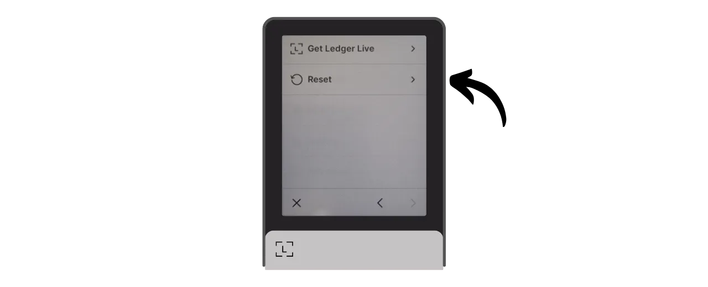
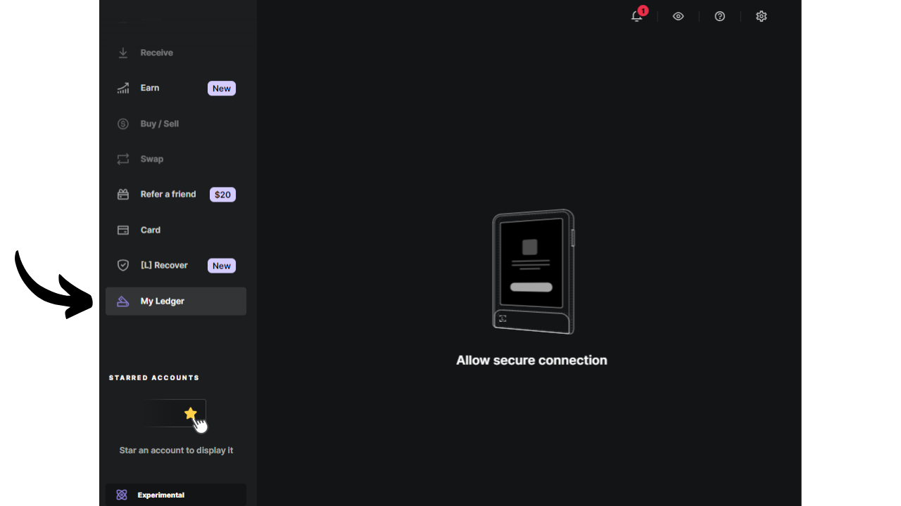

ハードウェアウォレットは、Bitcoinウォレットの秘密鍵を管理・保護するために専用に設計された電子デバイスです。インターネットに接続されることが多い汎用機器にインストールされるソフトウェアウォレット（またはホットウォレット）とは異なり、ハードウェアウォレットは秘密鍵の物理的な隔離を可能にし、ハッキングや盗難のリスクを減少させます。

ハードウェアウォレットの主な目的は、デバイスの機能を最小限に抑えることで攻撃対象面を減少させることです。攻撃対象面が少ないということは、攻撃者がビットコインにアクセスするために悪用できる潜在的な攻撃ベクトル、つまりシステムの弱点が少ないということを意味します。

特に相対的な価値または総資産の割合として大量のビットコインを保有している場合、ビットコインを保護するためにハードウェアウォレットの使用が推奨されます。

ハードウェアウォレットは、コンピューターやスマートフォン上のウォレット管理ソフトウェアと組み合わせて使用されます。このソフトウェアはトランザクションの作成を管理しますが、これらのトランザクションを検証するために必要な暗号署名はハードウェアウォレット内でのみ行われます。これは、秘密鍵が潜在的に脆弱な環境にさらされることがないことを意味します。

ハードウェアウォレットはユーザーに二重の保護を提供します：一方で、秘密鍵をオフラインに保持することでリモート攻撃からビットコインを保護し、他方で、鍵を抽出しようとする試みに対して物理的により優れた耐性を一般的に提供します。そして、これら2つのセキュリティ基準に基づいて市場に出回っている異なるモデルを評価し、ランク付けすることができます。

このチュートリアルでは、これらのソリューションの一つである**Ledger Flex**を紹介します。

## Ledger Flexの紹介

Ledger Flexは、フランスの会社Ledgerによって製造され、249ユーロの価格で市場に出されているハードウェアウォレットです。

大きなE Inkタッチスクリーンを特徴としており、これは電子リーダーに見られる黒と白のディスプレイ技術です。E Inkスクリーンは、明るい日光の下でもクリアで読みやすい表示を可能にし、画面が静止しているときはほとんど、または全くエネルギーを消費しません。これは、黒と白の顔料粒子を含むマイクロカプセルを使用して動作します。電気荷が適用されると、黒または白の粒子が画面の表面に移動し、テキストや画像を形成することができます。
Ledger Flexは、ハードウェアに対する物理的な攻撃から高度な保護を提供するCC EAL6+認証の「セキュアエレメント」チップを搭載しています。画面はこのチップによって直接制御されます。一般的な批判点は、このチップのコードがオープンソースではないため、このコンポーネントの完全性に一定の信頼を必要とすることです。しかし、この要素は独立した専門家によって監査されています。

使用面では、Ledger FlexはBluetooth、USB-C、NFCといった複数の接続オプションを提供します。大きな画面は、トランザクションの詳細を簡単に確認することを可能にします。Ledgerは、例えばMiniscriptのような新しいBitcoinの機能を迅速に採用することで、競合他社と差別化を図っています。

これをテストした後、私は製品の品質に感銘を受けました。ユーザーエクスペリエンスは優れており、デバイスは直感的です。これは非常に優れたハードウェアウォレットです。しかし、私の意見では2つの大きな欠点があります：チップのコードを検証できないこと、そしてもちろん、競合他社よりもかなり高い価格です。比較として、Foundationの最先端モデルは$199で販売されており、Coinkiteのは$219.99、最新のTrezorも大きなタッチスクリーンを搭載しており、169ユーロで提供されています。

## Ledger Flexを購入する方法は？
Ledger Flexは、[公式ウェブサイト](https://shop.ledger.com/pages/ledger-flex)で購入可能です。実店舗で購入したい場合は、Ledgerのウェブサイトにある[認定リセラーのリスト](https://www.ledger.com/reseller)を参照してください。
## 前提条件

Ledger Flexを受け取ったら、最初のステップはパッケージが開封されていないことを確認することです。

Ledgerのパッケージには、2つの封印テープが含まれているべきです。これらのテープが欠けているか損傷している場合、ハードウェアウォレットが侵害され、本物ではない可能性があります。

開封すると、箱の中に以下のアイテムが入っているはずです：
- Ledger Flex本体；
- USB-Cケーブル；
- ユーザーマニュアル；
- ニーモニックフレーズを書き留めるためのカード。

このチュートリアルでは、2つのソフトウェアが必要です：Ledger Flexを初期化するためのLedger Liveと、Bitcoinウォレットを管理するためのSparrow Wallet。公式ウェブサイトから[Ledger Live](https://www.ledger.com/ledger-live)と[Sparrow Wallet](https://sparrowwallet.com/download/)をダウンロードしてください。

ダウンロードしたソフトウェアの真正性と完全性を検証する方法についてのチュートリアルを近日中に提供します。ここでは、Ledger LiveとSparrowについてそれを行うことを強くお勧めします。
## Ledger Liveを使ってLedger Flexを初期化する方法は？

数秒間右側のボタンを押して、Ledger Flexをオンにします。

異なる紹介ページをスクロールします。

「*Set up without Ledger Live*」を選択し、「*Skip Ledger Live*」ボタンをクリックします。

次に、Ledgerに名前を付けるよう求められます。「*Set name*」をクリックし、選んだ名前を入力します。

デバイスのPINコードを選択します。これは、Ledgerの不正な物理アクセスに対する保護です。このPINコードは、ウォレットの暗号鍵の導出には関与しません。したがって、このPINコードへのアクセスがなくても、24語のニーモニックフレーズがあれば、ビットコインへのアクセスを回復できます。

できるだけランダムな8桁のPINコードを選択することをお勧めします。また、このコードをLedger Flexが保管されている場所とは別の場所（例えば、パスワードマネージャー内）に保存してください。

PINをもう一度入力して確認します。

次に、既存のウォレットを復元するか、新しいものを作成するかを選択するよう求められます。このチュートリアルでは、新しいウォレットを一から作成することを扱っているので、「*Set up as a new Ledger*」を選択して新しいニーモニックフレーズを生成します。

Flexは、リカバリーフレーズの管理方法についての指示を提供します。
このニーモニックフレーズは、あなたのビットコインへの完全かつ制限のないアクセスを提供します。このフレーズを持っている人は、あなたのLedgerに物理的にアクセスしなくても、資金を盗むことができます。24語のフレーズにより、紛失、盗難、またはあなたのLedger Flexの損傷の場合に、ビットコインへのアクセスを復元することができます。したがって、それを安全な場所に慎重に保存し保管することが非常に重要です。
Ledgerに付属のダンボール紙にそれを書き留めることも、追加のセキュリティのために、火災、洪水、または崩壊のリスクから保護するためにステンレス鋼の媒体に刻印することをお勧めします。

画面に触れることで、これらの指示を閲覧し、ページをスキップすることができます。

Ledgerは、そのランダムナンバージェネレータを使用してあなたのニーモニックフレーズを作成します。この操作中に観察されていないことを確認してください。Ledgerによって提供された単語をあなたの選択した物理的媒体に書き留めてください。セキュリティ戦略に応じて、フレーズの複数の完全な物理的コピーを作成することを検討するかもしれません（しかし最も重要なことは、それを分割しないことです）。単語を番号付けし、連続した順序で保持することが重要です。
***明らかに、私がこのチュートリアルで行っていることとは反対に、これらの単語をインターネット上で決して共有してはいけません。この例のウォレットはテストネット上でのみ使用され、チュートリアルの終わりに削除されます。***

次のグループの単語に移動するには、"*Next*"ボタンをクリックします。すべての単語が記載されたら、次のステップに進むために"*Done*"ボタンをクリックします。

"*Start confirmation*"ボタンをクリックし、正しく記載されたことを確認するために、あなたのニーモニックフレーズから単語をその順序で選択します。24番目の単語までこの手順を続けます。

確認しているフレーズが前のステップでFlexが提供したものと完全に一致する場合、進むことができます。そうでない場合、ニーモニックフレーズの物理的バックアップが正しくないことを示し、プロセスを再開する必要があります。

これで、あなたのLedger Flex上でシードが正しく作成されました。このシードから新しいビットコインウォレットを作成する前に、一緒にデバイス設定を探索しましょう。

## Ledgerの設定を変更する方法は？

Ledgerをロックおよびアンロックするには、側面のボタンを押します。その後、前のステップで設定したPINコードの入力を求められます。

設定にアクセスするには、デバイスの左下にある歯車のシンボルをクリックします。

"*Name*"メニューでは、Ledgerの名前を変更できます。

"*About this Ledger*"では、あなたのFlexに関する情報を見つけることができます。

"*Lock screen*"メニューでは、"*Customize lock screen picture*"を選択することで、ロック画面に表示される画像を変更するオプションがあります。デバイスのE Inkスクリーン技術のおかげで、画面を常にオンにしておいてもバッテリーを消費しません。E Inkスクリーンは静的な画像を維持するためにエネルギーを使用しません。しかし、表示変更中にはエネルギーを消費します。
"*Auto-lock*"サブメニューでは、一定期間の非活動後にLedgerが自動的にロックされるように設定し、有効化することができます。

"*サウンド*" メニューでは、Flexのサウンドをオンまたはオフにすることができます。また、"言語" メニューでは、表示言語を変更することができます。

右矢印をクリックすると、他の設定にアクセスできます。"*PINの変更*" では、PINコードを変更できます。

"*Bluetooth*" と "*NFC*" メニューでは、これらの通信を管理できます。

"*バッテリー*" では、Ledgerの自動シャットダウンを設定できます。

"*詳細設定*" セクションでは、より高度なセキュリティ設定にアクセスできます。セキュリティを強化するために、"*PINシャッフル*" オプションを有効にしておくことをお勧めします。また、このメニューでBIP39パスフレーズを設定できます。

パスフレーズは、復元フレーズと組み合わせることで、ウォレットに追加のセキュリティ層を提供するオプションのパスワードです。

現在、ウォレットは24語からなるニーモニックフレーズから生成されています。この復元フレーズは非常に重要で、ウォレットのすべてのキーを紛失した場合に復元することができます。しかし、これは単一障害点（SPOF）を構成します。もし侵害された場合、ビットコインは危険にさらされます。ここでパスフレーズが登場します。これは任意に選択できるオプションのパスワードで、ニーモニックフレーズに追加してウォレットのセキュリティを強化します。

パスフレーズはPINコードと混同してはいけません。これは暗号キーの導出において役割を果たします。ニーモニックフレーズと連携して動作し、キーが生成されるシードを変更します。したがって、24語のフレーズを誰かが入手しても、パスフレーズがなければ資金にアクセスできません。パスフレーズを使用すると、異なるキーを持つ新しいウォレットが基本的に作成されます。パスフレーズを（わずかに）変更すると、異なるウォレットが生成されます。

パスフレーズはビットコインのセキュリティを強化するための非常に強力なツールです。しかし、それを実装する前にその動作を理解することが非常に重要です。そうしないと、ウォレットへのアクセスを失う可能性があります。別の専用チュートリアルでパスフレーズの使用方法を説明します。

最後に、最後の設定ページでは、Ledgerをリセットできます。ビットコインを保護するキーを含まないことが確実な場合にのみ、このリセットを実行してください。そうでないと、資金へのアクセスを永久に失う可能性があります。

## Bitcoinアプリケーションのインストール方法は？

まず、コンピューターでLedger Liveソフトウェアを起動し、Ledger Flexを接続してロックを解除します。

Ledger Liveで、"*My Ledger*" メニューに移動します。Flexへのアクセスを許可するよう求められます。

Ledgerで"*許可*" ボタンをクリックしてアクセスを承認します。

まず、Ledger Flexのファームウェアが最新でない場合、Ledger Liveは自動的に更新を提案します。該当する場合は、"*ファームウェアの更新*" をクリックし、次に "*更新のインストール*" をクリックしてインストールを開始します。

Ledgerで"*インストール*" ボタンをクリックし、インストール中は待ちます。

これで、Ledger Flexのファームウェアは最新の状態です。
LEDGER FLEXのロック画面の壁紙を変更することができます。これを行うには、「*Add >*」をクリックしてください。

「*Upload from computer*」ボタンをクリックし、写真から壁紙を選択してください。

画像をトリミングできます。

異なるオプションからコントラストを選択し、「*Confirm contrast*」をクリックしてください。

Flexで、「*Load picture*」ボタンをクリックしてください。

画像に満足したら、「*Keep*」をクリックして、それをロック画面の壁紙として設定してください。

最後に、Bitcoinアプリケーションを追加します。これを行うには、Ledger Liveで「*Bitcoin (BTC)*」の隣にある「*Install*」ボタンをクリックしてください。

アプリケーションがFlexにインストールされます。

これからは、財布の通常の管理にLedger Liveソフトウェアは必要ありません。新しいバージョンが利用可能になったときにファームウェアを更新するために時々それに戻ることができます。それ以外のすべてについては、Bitcoin財布を効率的に管理するためのはるかに包括的なツールであるSparrow Walletを使用します。

## Sparrowで新しいBitcoin財布を設定する方法は？
Sparrow Walletを開き、紹介ページをスキップしてホーム画面にアクセスします。画面の右下にあるスイッチを観察して、ノードに適切に接続されていることを確認してください。

自分のBitcoinノードを使用することを強くお勧めします。このチュートリアルでは、テストネット上にいるため公開ノード（黄色）を使用していますが、通常の使用では、ローカルのBitcoin Core（緑）またはリモートノードに接続されたElectrumサーバー（青）を選択する方が良いです。

「*File*」メニューから「*New Wallet*」をクリックしてください。

この財布の名前を選択し、「*Create Wallet*」をクリックしてください。

「*Script Type*」ドロップダウンメニューで、ビットコインを保護するために使用されるスクリプトのタイプを選択します。「*Taproot*」を選択することをお勧めしますが、利用できない場合は「*Native SegWit*」を選択してください。

「*Connected Hardware Wallet*」ボタンをクリックしてください。

Ledger Flexをコンピューターに接続し、PINコードでロックを解除してから、「*Bitcoin*」アプリケーションを開いてください。このチュートリアルでは「*Bitcoin Testnet*」アプリケーションを使用していますが、手順はメインネットでも同じです。

Sparrowで、「*Scan*」ボタンをクリックしてください。

次に、「*Import Keystore*」をクリックしてください。

これで、最初のアカウントの拡張公開キーを含む財布の詳細を確認できます。「*Apply*」ボタンをクリックして、財布の作成を完了してください。
Sparrow Walletへのアクセスを保護するために強力なパスワードを選択してください。このパスワードは、Sparrow上のウォレットデータへのアクセスのセキュリティを確保し、公開鍵、アドレス、ラベル、および取引履歴を無許可のアクセスから保護するのに役立ちます。

このパスワードをパスワードマネージャーに保存することをお勧めします。そうすれば、忘れる心配がありません。

これで、ウォレットの作成が完了しました！

ウォレットに最初のビットコインを受け取る前に、ドライラン復旧テストを実施することを強くお勧めします。xpubのような参照情報をメモしてから、ウォレットがまだ空の状態でLedger Flexをリセットしてください。その後、紙のバックアップを使用してLedger上でウォレットを復元し、復元後に生成されたxpubが最初にメモしたものと一致するかを確認してください。もしそうであれば、紙のバックアップが信頼できることが確認できます。

## Ledger Flexでビットコインを受け取る方法は？

"*Receive*"タブをクリックします。

Ledger Flexをコンピューターに接続し、PINコードでロックを解除してから、"*Bitcoin*"アプリケーションを開きます。

Sparrow Walletによって提供されたアドレスを使用する前に、Ledger Flexの画面でそれを確認してください。この習慣により、Sparrowに表示されているアドレスが詐欺でないこと、そして後でこのアドレスで保護されたビットコインを使用するために必要な秘密鍵をLedgerが実際に保持していることを確認できます。

この確認を行うには、"*Display Address*"ボタンをクリックします。

Ledger Flexに表示されたアドレスがSparrow Walletに示されたものと一致することを確認してください。送信者にアドレスを提供する直前にこの確認を行うこともお勧めします。これにより、その有効性を確実にすることができます。

このアドレスで保護されるビットコインの出所を説明するために"*Label*"を追加することができます。これはUTXOsをより良く管理するのに役立つ良い習慣です。

ラベリングに関する詳細情報については、この他のチュートリアルもチェックすることをお勧めします：

https://planb.network/tutorials/privacy/utxo-labelling

その後、このアドレスを使用してビットコインを受け取ることができます。

## Ledger Flexでビットコインを送る方法は？

Flexで保護されたウォレットに最初のsatsを受け取ったので、それらを使うこともできます！ Ledgerをコンピューターに接続し、ロックを解除し、Sparrow Walletを起動してから、新しい取引を構築するために"*Send*"タブに移動します。

"*coin control*"を行いたい場合、つまり取引で消費するUTXOsを具体的に選択したい場合は、"*UTXOs*"タブに移動します。使用したいUTXOsを選択し、"*Send Selected*"をクリックします。その後、取引のためにすでに選択されたUTXOsを含む"*Send*"タブの同じ画面にリダイレクトされます。

目的地のアドレスを入力します。"*+ Add*"ボタンをクリックすることで、複数のアドレスを入力することもできます。

この支出の目的を思い出すために"*Label*"をメモしてください。
このアドレスに送信される金額を選択してください。

現在の市場に応じて、トランザクションの手数料率を調整してください。

トランザクションの設定がすべて正しいことを確認し、"*Create Transaction*"（トランザクションを作成）をクリックしてください。

すべてがご満足いただける場合は、"*Finalize Transaction for Signing*"（トランザクションの署名を完了する）をクリックしてください。

"*Sign*"（署名）をクリックしてください。

Ledger Flexの隣にある"*Sign*"（署名）をクリックしてください。

Flexの画面で、受取人の受取アドレス、送信される金額、手数料の金額を含むトランザクション設定を確認してください。

署名するには、"*Hold to sign*"（署名するために押し続ける）ボタンを指で押し続けてください。

トランザクションはこれで署名されました。"*Broadcast Transaction*"（トランザクションをブロードキャストする）をクリックして、ビットコインネットワーク上でブロードキャストしてください。

Sparrow Walletの"*Transactions*"（トランザクション）タブで見つけることができます。

おめでとうございます、これでLedger FlexをSparrow Walletで基本的に使用する方法をマスターしました！将来のチュートリアルでは、Miniscriptを活用するためにLianaとLedger Flexを使用する方法を見ていきます。

このチュートリアルが役立ったと思われる場合は、下でサムズアップをいただけると幸いです。この記事をソーシャルネットワークで共有していただけると嬉しいです。どうもありがとうございました！