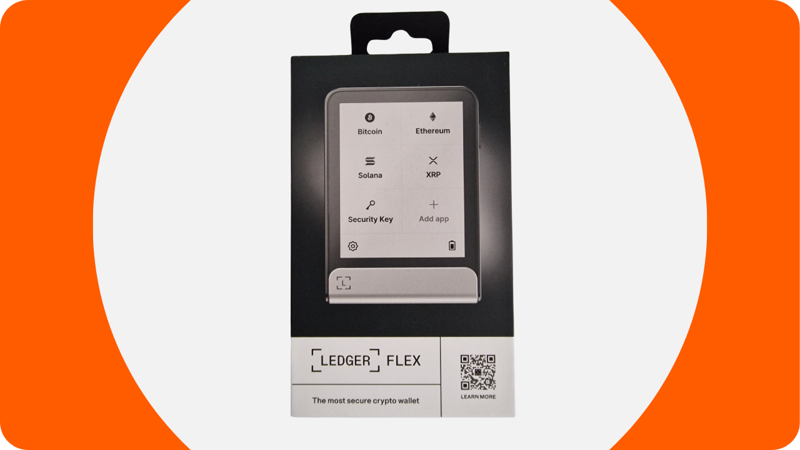

Uma carteira de hardware é um dispositivo eletrônico dedicado a gerenciar e proteger as chaves privadas de uma carteira Bitcoin. Diferentemente das carteiras de software (ou carteiras quentes) instaladas em máquinas de propósito geral frequentemente conectadas à Internet, as carteiras de hardware permitem o isolamento físico das chaves privadas, reduzindo os riscos de hacking e roubo.

O principal objetivo de uma carteira de hardware é minimizar as funcionalidades do dispositivo para reduzir sua superfície de ataque. Menos superfície de ataque também significa menos vetores de ataque potenciais, ou seja, menos pontos fracos no sistema que os atacantes poderiam explorar para acessar bitcoins.

É recomendado usar uma carteira de hardware para proteger seus bitcoins, especialmente se você possui quantidades significativas, seja em valor absoluto ou como proporção de seus ativos totais.

Carteiras de hardware são usadas em combinação com software de gerenciamento de carteira em um computador ou smartphone. Este software gerencia a criação de transações, mas a assinatura criptográfica necessária para validar essas transações é feita apenas dentro da carteira de hardware. Isso significa que as chaves privadas nunca são expostas a um ambiente potencialmente vulnerável.

Carteiras de hardware oferecem dupla proteção para o usuário: por um lado, elas protegem seus bitcoins contra ataques remotos mantendo as chaves privadas offline, e por outro lado, geralmente oferecem melhor resistência física contra tentativas de extrair as chaves. E é precisamente nesses 2 critérios de segurança que se pode julgar e classificar os diferentes modelos disponíveis no mercado.

Neste tutorial, proponho descobrir uma dessas soluções: o **Ledger Flex**.

## Introdução ao Ledger Flex

O Ledger Flex é uma carteira de hardware produzida pela empresa francesa Ledger, comercializada ao preço de 249 €.

Ele possui uma grande tela touchscreen E Ink, uma tecnologia de exibição em preto e branco. Esta é a mesma tecnologia encontrada em leitores eletrônicos. A tela E Ink permite uma exibição clara e legível, mesmo sob luz solar intensa, e consome muito pouca energia, ou nenhuma, quando a tela está estática. Funciona usando microcápsulas contendo partículas de pigmento preto e branco. Quando uma carga elétrica é aplicada, as partículas pretas ou brancas movem-se para a superfície da tela, permitindo assim a formação de texto ou imagens.
O Ledger Flex é equipado com um chip "elemento seguro" certificado CC EAL6+, oferecendo proteção avançada contra ataques físicos ao hardware. A tela é diretamente controlada por este chip. Um ponto comum de crítica é que o código para este chip não é de código aberto, exigindo um certo nível de confiança na integridade deste componente. No entanto, este elemento é auditado por especialistas independentes.

Em termos de uso, o Ledger Flex oferece várias opções de conectividade: Bluetooth, USB-C e NFC. A grande tela permite a fácil verificação dos detalhes de sua transação. A Ledger também se destaca de seus concorrentes com sua rápida adoção de novas funcionalidades do Bitcoin, como o Miniscript, por exemplo.

Após testá-lo, estou impressionado com a qualidade do produto. A experiência do usuário é excelente, e o dispositivo é intuitivo. É uma excelente carteira de hardware. No entanto, tem 2 grandes desvantagens na minha opinião: a incapacidade de verificar o código do chip e, claro, seu preço, que é significativamente mais alto que o de seus concorrentes. Para comparação, o modelo mais avançado da Foundation é vendido a $199, o da Coinkite a $219.99, enquanto o último Trezor, também equipado com uma grande tela touchscreen, é oferecido a 169€.

## Como Comprar um Ledger Flex?
O Ledger Flex está disponível para compra [no site oficial](https://shop.ledger.com/pages/ledger-flex). Para comprá-lo em uma loja física, você também pode encontrar [a lista de revendedores certificados](https://www.ledger.com/reseller) no site da Ledger.
## Pré-requisitos

Uma vez que você tenha recebido seu Ledger Flex, o primeiro passo é examinar a embalagem para garantir que ela não foi aberta.

A embalagem do Ledger deve incluir 2 selos de segurança. Se esses selos estiverem faltando ou danificados, isso pode indicar que a carteira de hardware foi comprometida e pode não ser autêntica.

Ao abrir, você deve encontrar os seguintes itens na caixa:
- O Ledger Flex;
- Um cabo USB-C;
- Um manual do usuário;
- Cartões para anotar sua frase mnemônica.

Para este tutorial, você precisará de 2 softwares: Ledger Live para inicializar o Ledger Flex, e Sparrow Wallet para gerenciar sua carteira Bitcoin. Baixe o [Ledger Live](https://www.ledger.com/ledger-live) e o [Sparrow Wallet](https://sparrowwallet.com/download/) dos seus sites oficiais.

Em breve ofereceremos um tutorial sobre como verificar a autenticidade e integridade do software que você baixa. Eu aconselho fortemente a fazer isso aqui para o Ledger Live e Sparrow.
## Como Inicializar um Ledger Flex com o Ledger Live?

Ligue seu Ledger Flex pressionando o botão do lado direito por alguns segundos.

Passe pelas diferentes páginas de introdução.

Selecione a opção "*Configurar sem o Ledger Live*", em seguida, clique no botão "*Pular o Ledger Live*".

Então, será solicitado que você escolha um nome para seu Ledger. Clique em "*Definir nome*", e então insira o nome de sua escolha.

Escolha o código PIN para seu dispositivo, que será usado para desbloquear seu Ledger. Isso é, portanto, uma proteção contra acesso físico não autorizado. Este código PIN não tem papel na derivação das chaves criptográficas de sua carteira. Assim, mesmo sem acesso a este código PIN, tendo sua frase mnemônica de 24 palavras permitirá que você recupere acesso aos seus bitcoins.

É recomendado escolher um código PIN de 8 dígitos, o mais aleatório possível. Além disso, certifique-se de salvar este código em um local diferente de onde seu Ledger Flex é guardado (por exemplo, em um gerenciador de senhas).

Insira seu PIN uma segunda vez para confirmá-lo.

Então, será solicitado que você escolha entre recuperar uma carteira existente ou criar uma nova. Neste tutorial, estamos cobrindo a criação de uma nova carteira do zero, então selecione a opção "*Configurar como um novo Ledger*" para gerar uma nova frase mnemônica.

Seu Flex fornecerá instruções sobre como gerenciar sua frase de recuperação.
**Esta frase mnemônica dá acesso completo e irrestrito a todos os seus bitcoins**. Qualquer pessoa que possua esta frase pode roubar seus fundos, mesmo sem acesso físico ao seu Ledger. A frase de 24 palavras permite a restauração do acesso aos seus bitcoins em caso de perda, roubo ou dano ao seu Ledger Flex. Portanto, é muito importante salvar e armazenar cuidadosamente em um local seguro.
Você pode anotá-la no papelão fornecido com o seu Ledger, ou, para maior segurança, recomendo gravá-la em um meio de aço inoxidável para proteger contra os riscos de incêndios, inundações ou colapsos.

Você pode navegar por estas instruções e pular páginas tocando na tela.

O Ledger criará sua frase mnemônica usando seu gerador de números aleatórios. Certifique-se de não estar sendo observado durante esta operação. Anote as palavras fornecidas pelo Ledger no meio físico de sua escolha. Dependendo da sua estratégia de segurança, você pode considerar fazer várias cópias físicas completas da frase (mas, o mais importante, não a divida). É importante manter as palavras numeradas e em ordem sequencial.
***Obviamente, você nunca deve compartilhar essas palavras na internet, ao contrário do que estou fazendo neste tutorial. Esta carteira de exemplo será usada apenas no Testnet e será deletada ao final do tutorial.***

Para passar para o próximo grupo de palavras, clique no botão "*Próximo*". Uma vez que todas as palavras estejam anotadas, clique no botão "*Concluído*" para prosseguir para a próxima etapa.

Clique no botão "*Iniciar confirmação*", em seguida, selecione as palavras de sua frase mnemônica na ordem para confirmar que você as anotou corretamente. Continue este procedimento até a 24ª palavra.

Se a frase que você está confirmando corresponder exatamente à que o Flex forneceu no passo anterior, você pode prosseguir. Se não, isso indica que seu backup físico da frase mnemônica está incorreto e você precisa reiniciar o processo.

E é isso, sua semente foi corretamente criada no seu Ledger Flex. Antes de prosseguir para criar uma nova carteira Bitcoin a partir desta semente, vamos explorar juntos as configurações do dispositivo.

## Como modificar as configurações do seu Ledger?

Para bloquear e desbloquear o seu Ledger, pressione o botão lateral. Em seguida, será solicitado que você insira o código PIN que definiu na etapa anterior.

Para acessar as configurações, clique no símbolo de engrenagem na parte inferior esquerda do seu dispositivo.

O menu "*Name*" permite que você mude o nome do seu Ledger.

Em "*About this Ledger*", você encontrará informações sobre o seu Flex.

No menu "*Lock screen*", você tem a opção de mudar a imagem exibida na tela de bloqueio selecionando "*Customize lock screen picture*". Graças à tecnologia de tela E Ink do dispositivo, é possível manter a tela constantemente ligada sem consumir bateria. Telas E Ink não usam energia para manter uma imagem estática. No entanto, elas consomem energia durante mudanças de exibição.
O submenu "*Auto-lock*" permite que você configure e ative o bloqueio automático do seu Ledger após um período determinado de inatividade.

O menu "*Sounds*" permite que você ative ou desative os sons do seu Flex. E no menu "Language", você pode alterar o idioma de exibição.

Ao clicar na seta direita, você pode acessar outras configurações. "*Change PIN*" permite que você altere seu código PIN.

Os menus "*Bluetooth*" e "*NFC*" permitem gerenciar essas comunicações.

Em "*Battery*" você pode, notavelmente, configurar um desligamento automático do Ledger.

A seção "*Advanced*" dá acesso a configurações de segurança mais sofisticadas. É aconselhável manter a opção "*PIN shuffle*" ativada para aumentar a segurança. É também neste menu que você pode configurar uma passphrase BIP39.

A passphrase é uma senha opcional que, combinada com a frase de recuperação, fornece uma camada adicional de segurança para sua carteira.

Atualmente, sua carteira é gerada a partir de uma frase mnemônica consistindo de 24 palavras. Esta frase de recuperação é muito importante, pois permite restaurar todas as chaves da sua carteira em caso de perda. No entanto, constitui um único ponto de falha (SPOF). Se for comprometida, os bitcoins estão em perigo. É aqui que a passphrase entra. É uma senha opcional, que você pode escolher arbitrariamente, que se adiciona à frase mnemônica para fortalecer a segurança da carteira.

A passphrase não deve ser confundida com o código PIN. Ela desempenha um papel na derivação de suas chaves criptográficas. Funciona em conjunto com a frase mnemônica, modificando a semente da qual as chaves são geradas. Assim, mesmo que alguém obtenha sua frase de 24 palavras, sem a passphrase, não podem acessar seus fundos. Usar uma passphrase cria essencialmente uma nova carteira com chaves distintas. Modificar (mesmo que levemente) a passphrase gerará uma carteira diferente.

A passphrase é uma ferramenta muito poderosa para aumentar a segurança dos seus bitcoins. No entanto, é muito importante entender como ela funciona antes de implementá-la, para evitar perder o acesso à sua carteira. Eu explicarei como usar a passphrase em outro tutorial dedicado.

Finalmente, a última página de configurações permite que você redefina seu Ledger. Prossiga com esta redefinição apenas se tiver certeza de que não contém nenhuma chave que proteja bitcoins, pois você poderia perder permanentemente o acesso aos seus fundos.

## Como instalar o aplicativo Bitcoin?

Comece lançando o software Ledger Live no seu computador, depois conecte e desbloqueie seu Ledger Flex.

No Ledger Live, vá até o menu "*My Ledger*". Será solicitado que você autorize o acesso ao seu Flex.

Valide o acesso no seu Ledger clicando no botão "*Allow*".

Primeiro, se o firmware do seu Ledger Flex não estiver atualizado, o Ledger Live automaticamente oferecerá para atualizá-lo. Se aplicável, clique em "*Update firmware*", depois em "*Install update*" para iniciar a instalação.

No seu Ledger, clique no botão "*Install*", e aguarde durante a instalação.

O firmware do seu Ledger Flex agora está atualizado.
Se desejar, você pode alterar o papel de parede da tela de bloqueio do seu Ledger Flex. Para fazer isso, clique em "*Adicionar >*".

Clique no botão "*Carregar do computador*" e escolha o seu papel de parede entre suas fotos.

Você pode recortar sua imagem.

Escolha um contraste entre as diferentes opções e, em seguida, clique em "*Confirmar contraste*".

No seu Flex, clique no botão "*Carregar imagem*".

Se estiver satisfeito com a imagem, clique em "*Manter*" para definí-la como seu papel de parede da tela de bloqueio.

Finalmente, vamos adicionar o aplicativo Bitcoin. Para fazer isso, no Ledger Live, clique no botão "*Instalar*" ao lado de "*Bitcoin (BTC)*".

O aplicativo será instalado no seu Flex.

A partir de agora, você não precisará mais do software Ledger Live para o gerenciamento regular da sua carteira. Você pode voltar a ele ocasionalmente para atualizar o firmware quando novas versões estiverem disponíveis. Para todo o resto, usaremos o Sparrow Wallet, que é uma ferramenta muito mais abrangente para gerenciar eficientemente uma carteira Bitcoin.

## Como configurar uma nova carteira Bitcoin com Sparrow?
Abra o Sparrow Wallet e pule as páginas de introdução para acessar a tela inicial. Verifique se você está devidamente conectado a um nó observando o interruptor localizado no canto inferior direito da tela.

Eu recomendo fortemente o uso do seu próprio nó Bitcoin. Neste tutorial, estou usando um nó público (amarelo) porque estou no testnet, mas para uso normal, é melhor optar por um Bitcoin Core local (verde) ou um servidor Electrum conectado a um nó remoto (azul).

Clique no menu "*Arquivo*" e depois em "*Nova Carteira*".

Escolha um nome para esta carteira e clique em "*Criar Carteira*".

No menu suspenso "*Tipo de Script*", selecione o tipo de script que será usado para proteger seus bitcoins. Eu recomendo optar por "*Taproot*", ou se não estiver disponível, "*SegWit Nativo*".

Clique no botão "*Carteira de Hardware Conectada*".

Conecte seu Ledger Flex ao computador, desbloqueie-o com seu código PIN e, em seguida, abra o aplicativo "*Bitcoin*". Neste tutorial, estou usando o aplicativo "*Bitcoin Testnet*", mas o procedimento permanece o mesmo para a rede principal.

No Sparrow, clique no botão "*Escanear*".

Em seguida, clique em "*Importar Keystore*".

Agora você pode ver os detalhes da sua carteira, incluindo a chave pública estendida da sua primeira conta. Clique no botão "*Aplicar*" para finalizar a criação da carteira.
Escolha uma senha forte para garantir o acesso ao Sparrow Wallet. Esta senha assegurará a segurança do acesso aos seus dados da carteira no Sparrow, o que ajuda a proteger suas chaves públicas, endereços, rótulos e histórico de transações contra qualquer acesso não autorizado.

Aconselho que você salve esta senha em um gerenciador de senhas para não esquecê-la.

E aí está, sua carteira agora está criada!

Antes de receber seus primeiros bitcoins na sua carteira, aconselho fortemente que você realize um teste de recuperação em seco. Anote uma informação de referência, como seu xpub, depois resete seu Ledger Flex enquanto a carteira ainda estiver vazia. Em seguida, tente restaurar sua carteira no Ledger usando seus backups em papel. Verifique se o xpub gerado após a restauração corresponde ao que você anotou inicialmente. Se for o caso, você pode ter certeza de que seus backups em papel são confiáveis.

## Como receber bitcoins com o Ledger Flex?

Clique na aba "*Receber*".

Conecte seu Ledger Flex ao computador, desbloqueie-o com seu código PIN, depois abra a aplicação "*Bitcoin*".

Antes de usar o endereço fornecido pelo Sparrow Wallet, verifique-o na tela do seu Ledger Flex. Esta prática permite confirmar que o endereço exibido no Sparrow não é fraudulento e que o Ledger realmente possui a chave privada necessária para gastar os bitcoins segurados com este endereço mais tarde.

Para realizar esta verificação, clique no botão "*Exibir Endereço*".

Certifique-se de que o endereço exibido no seu Ledger Flex corresponde ao indicado no Sparrow Wallet. Também é recomendado realizar esta verificação justo antes de fornecer seu endereço ao remetente, para ter certeza de sua validade.

Você pode adicionar um "*Rótulo*" para descrever a origem dos bitcoins que serão segurados com este endereço. Esta é uma boa prática que ajuda a gerenciar melhor seus UTXOs.

Para mais informações sobre rotulação, aconselho também a conferir este outro tutorial:

https://planb.network/tutorials/privacy/utxo-labelling

Você pode então usar este endereço para receber bitcoins.

## Como enviar bitcoins com o Ledger Flex?

Agora que você recebeu seus primeiros sats na sua carteira segurada com o Flex, você também pode gastá-los! Conecte seu Ledger ao computador, desbloqueie-o, inicie o Sparrow Wallet e vá para a aba "*Enviar*" para construir uma nova transação.

Se você deseja fazer "*controle de moedas*", ou seja, escolher especificamente quais UTXOs consumir na transação, vá para a aba "*UTXOs*". Selecione os UTXOs que deseja gastar, depois clique em "*Enviar Selecionados*". Você será redirecionado para a mesma tela da aba "*Enviar*", mas com seus UTXOs já selecionados para a transação.

Insira o endereço de destino. Você também pode inserir múltiplos endereços clicando no botão "*+ Adicionar*".

Note um "*Rótulo*" para lembrar o propósito desta despesa.
Escolha o valor enviado para este endereço.

Ajuste a taxa de comissão da sua transação de acordo com o mercado atual.

Certifique-se de que todas as configurações da sua transação estão corretas, então clique em "*Criar Transação*".

Se tudo estiver conforme o seu desejo, clique em "*Finalizar Transação para Assinatura*".

Clique em "*Assinar*".

Clique em "*Assinar*" ao lado do seu Ledger Flex.

Verifique as configurações da transação na tela do seu Flex, incluindo o endereço de recebimento do destinatário, o valor enviado e o montante da taxa.

Para assinar, mantenha seu dedo pressionado no botão "*Segurar para assinar*".

Sua transação agora está assinada. Clique em "*Transmitir Transação*" para divulgá-la na rede Bitcoin.

Você pode encontrá-la na aba "*Transações*" do Sparrow Wallet.

Parabéns, você agora está por dentro do uso básico do Ledger Flex com o Sparrow Wallet! Em um tutorial futuro, veremos como usar o Ledger Flex com Liana para aproveitar o Miniscript.

Se você achou este tutorial útil, eu apreciaria um joinha abaixo. Sinta-se livre para compartilhar este artigo em suas redes sociais. Muito obrigado!