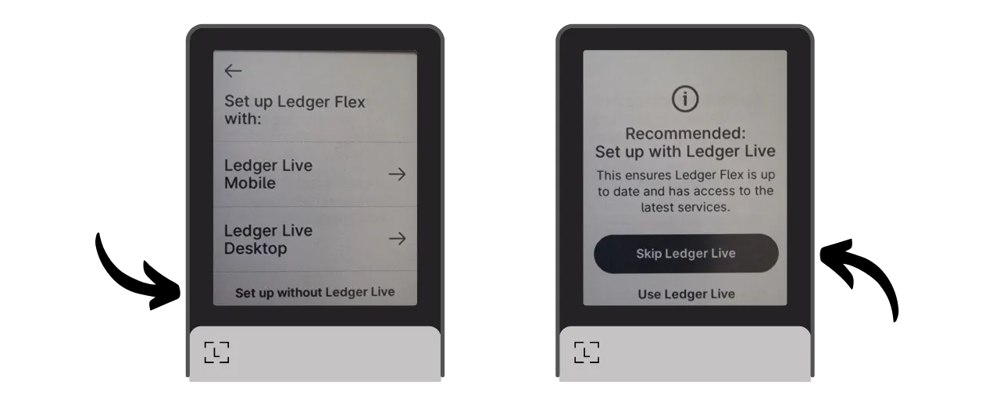
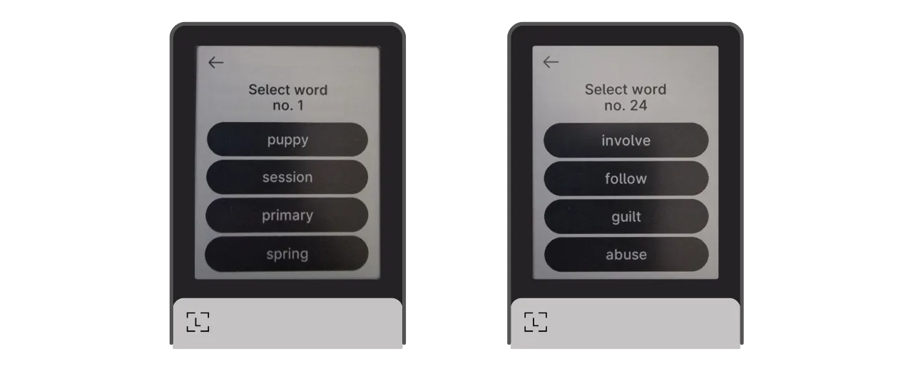
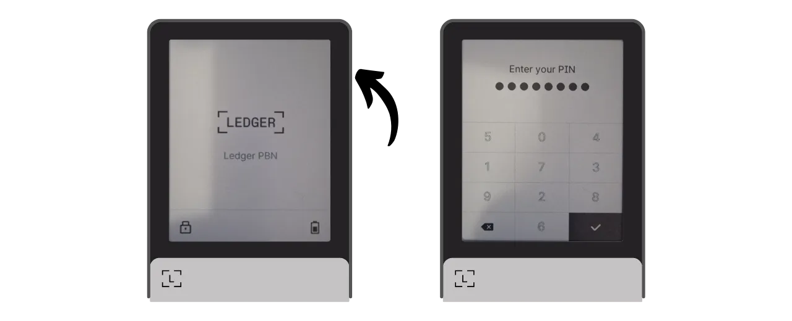
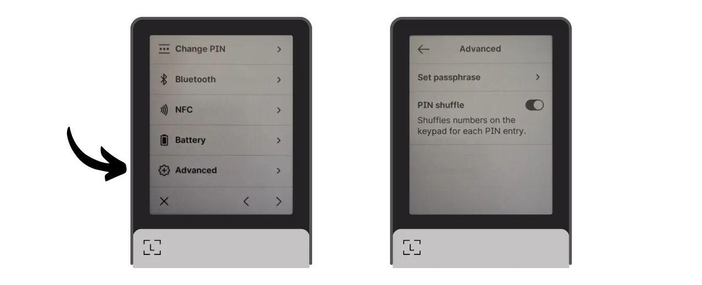
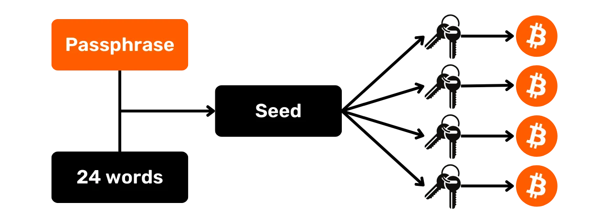
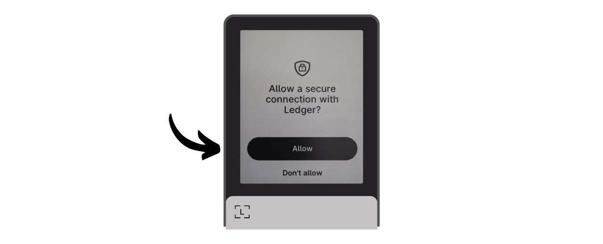
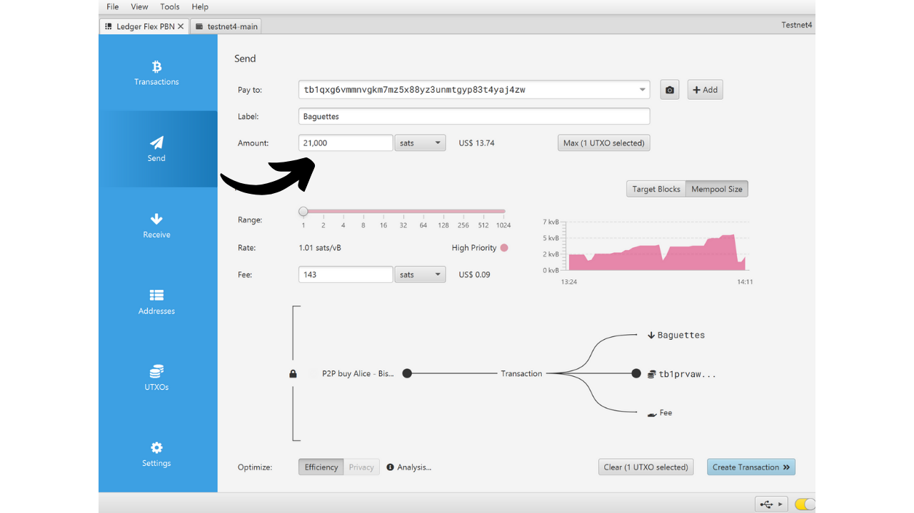
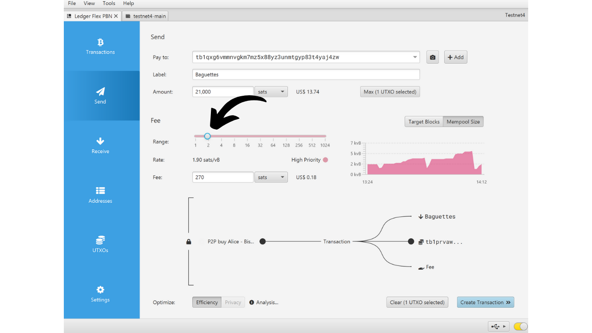

Аппаратный кошелек — это электронное устройство, предназначенное для управления и защиты приватных ключей биткойн-кошелька. В отличие от программных кошельков (или горячих кошельков), установленных на универсальных машинах, часто подключенных к Интернету, аппаратные кошельки позволяют физически изолировать приватные ключи, снижая риски взлома и кражи.

Основная цель аппаратного кошелька — минимизировать функциональность устройства для уменьшения его уязвимости к атакам. Меньшая уязвимость также означает меньше потенциальных векторов атак, т.е. меньше слабых мест в системе, которые злоумышленники могли бы использовать для доступа к биткойнам.

Рекомендуется использовать аппаратный кошелек для защиты ваших биткойнов, особенно если вы владеете значительными суммами, будь то в абсолютном значении или как доля от ваших общих активов.

Аппаратные кошельки используются в сочетании с программным обеспечением для управления кошельком на компьютере или смартфоне. Это программное обеспечение управляет созданием транзакций, но криптографическая подпись, необходимая для подтверждения этих транзакций, выполняется только внутри аппаратного кошелька. Это означает, что приватные ключи никогда не подвергаются потенциально уязвимой среде.

Аппаратные кошельки предлагают двойную защиту для пользователя: с одной стороны, они защищают ваши биткойны от удаленных атак, сохраняя приватные ключи вне сети, а с другой стороны, они обычно предлагают лучшую физическую устойчивость против попыток извлечения ключей. И именно по этим 2 критериям безопасности можно судить и ранжировать различные доступные на рынке модели.

В этом руководстве я предлагаю ознакомиться с одним из этих решений: **Ledger Flex**.

## Введение в Ledger Flex

Ledger Flex — это аппаратный кошелек, произведенный французской компанией Ledger, предлагаемый по цене 249 €.

Он оснащен большим сенсорным экраном E Ink, технологией черно-белого дисплея. Это та же технология, что используется в электронных читалках. Экран E Ink обеспечивает четкое и читаемое отображение даже при ярком солнечном свете и потребляет очень мало энергии или вообще не потребляет ее, когда экран статичен. Он работает за счет использования микрокапсул, содержащих черные и белые пигментные частицы. При приложении электрического заряда черные или белые частицы перемещаются на поверхность экрана, таким образом формируя текст или изображения.
Ledger Flex оснащен чипом "безопасного элемента" с сертификацией CC EAL6+, который предлагает вам продвинутую защиту от физических атак на аппаратное обеспечение. Экран напрямую управляется этим чипом. Обычной точкой критики является то, что код для этого чипа не является открытым, что требует определенного уровня доверия к целостности этого компонента. Однако этот элемент проходит аудит независимыми экспертами.

С точки зрения использования, Ledger Flex предлагает несколько вариантов подключения: Bluetooth, USB-C и NFC. Большой экран позволяет легко проверять детали ваших транзакций. Ledger также выделяется среди конкурентов своим быстрым внедрением новых функций Bitcoin, таких как Miniscript, например.

После тестирования я впечатлен качеством продукта. Пользовательский опыт отличный, и устройство интуитивно понятно. Это отличный аппаратный кошелек. Однако, на мой взгляд, у него есть 2 основных недостатка: невозможность проверить код чипа и, конечно, его цена, которая значительно выше, чем у конкурентов. Для сравнения, самая продвинутая модель от Foundation продается по цене $199, Coinkite — за $219.99, в то время как последний Trezor, также оснащенный большим сенсорным экраном, предлагается по цене 169€.

## Как купить Ledger Flex?
Ledger Flex доступен для покупки [на официальном сайте](https://shop.ledger.com/pages/ledger-flex). Чтобы купить его в физическом магазине, вы также можете найти [список сертифицированных реселлеров](https://www.ledger.com/reseller) на сайте Ledger.
## Предварительные требования

После получения вашего Ledger Flex первым шагом будет проверка упаковки на предмет того, не была ли она вскрыта.

Упаковка Ledger должна включать 2 пломбы. Если эти пломбы отсутствуют или повреждены, это может указывать на то, что аппаратный кошелек был скомпрометирован и может быть не оригинальным.

При открытии вы должны найти в коробке следующие предметы:
- Ledger Flex;
- Кабель USB-C;
- Руководство пользователя;
- Карты для записи вашей мнемонической фразы.

Для этого руководства вам понадобятся 2 программы: Ledger Live для инициализации Ledger Flex и Sparrow Wallet для управления вашим Bitcoin кошельком. Скачайте [Ledger Live](https://www.ledger.com/ledger-live) и [Sparrow Wallet](https://sparrowwallet.com/download/) с их официальных сайтов.

Мы скоро предложим руководство о том, как проверить подлинность и целостность программного обеспечения, которое вы скачиваете. Настоятельно рекомендую сделать это здесь для Ledger Live и Sparrow.
## Как инициализировать Ledger Flex с помощью Ledger Live?

Включите ваш Ledger Flex, нажав правую кнопку на несколько секунд.

Пролистайте различные вводные страницы.

Выберите опцию "*Настроить без Ledger Live*", затем нажмите на кнопку "*Пропустить Ledger Live*".

Затем вам будет предложено выбрать имя для вашего Ledger. Нажмите на "*Установить имя*", и затем введите выбранное вами имя.

Выберите PIN-код для вашего устройства, который будет использоваться для разблокировки вашего Ledger. Это, таким образом, защита от несанкционированного физического доступа. Этот PIN-код не играет роли в производстве криптографических ключей вашего кошелька. Таким образом, даже без доступа к этому PIN-коду, имея вашу 24-словную мнемоническую фразу, вы сможете восстановить доступ к вашим биткоинам.

Рекомендуется выбрать 8-значный PIN-код, настолько случайный, насколько это возможно. Также убедитесь, что вы сохраните этот код в месте, отличном от места хранения вашего Ledger Flex (например, в менеджере паролей).

Введите ваш PIN-код второй раз для подтверждения.

Затем вам будет предложено выбрать между восстановлением существующего кошелька или созданием нового. В этом руководстве мы рассматриваем создание нового кошелька с нуля, поэтому выберите опцию "*Настроить как новый Ledger*", чтобы сгенерировать новую мнемоническую фразу.

Ваш Flex предоставит инструкции о том, как управлять вашей фразой восстановления.
**Эта мнемоническая фраза дает полный и неограниченный доступ ко всем вашим биткоинам**. Любой, кто владеет этой фразой, может украсть ваши средства, даже не имея физического доступа к вашему Ledger. 24-словная фраза позволяет восстановить доступ к вашим биткоинам в случае потери, кражи или повреждения вашего Ledger Flex. Поэтому очень важно тщательно сохранить и хранить ее в безопасном месте.
Вы можете записать ее на картонной бумаге, предоставленной вместе с вашим Ledger, или для дополнительной безопасности я рекомендую выгравировать ее на носителе из нержавеющей стали, чтобы защитить от рисков пожаров, наводнений или обрушений.

Вы можете просматривать эти инструкции и перелистывать страницы, касаясь экрана.

Ledger создаст вашу мнемоническую фразу, используя свой генератор случайных чисел. Убедитесь, что за этой операцией никто не наблюдает. Запишите слова, предоставленные Ledger, на физическом носителе вашего выбора. В зависимости от вашей стратегии безопасности, вы можете рассмотреть возможность создания нескольких полных физических копий фразы (но самое главное, не разделяйте ее). Важно сохранять слова пронумерованными и в последовательном порядке.
***Очевидно, вы никогда не должны делиться этими словами в интернете, в отличие от того, что я делаю в этом учебнике. Этот пример кошелька будет использоваться только на Testnet и будет удален в конце учебника.***

Чтобы перейти к следующей группе слов, нажмите на кнопку "*Next*". Как только все слова будут записаны, нажмите на кнопку "*Done*", чтобы перейти к следующему шагу.

Нажмите на кнопку "*Start confirmation*", затем выберите слова из вашей мнемонической фразы в их порядке, чтобы подтвердить, что вы записали их правильно. Продолжайте эту процедуру до 24-го слова.

Если фраза, которую вы подтверждаете, точно совпадает с той, которую Flex предоставил вам на предыдущем шаге, вы можете продолжить. Если нет, это указывает на то, что ваш физический бэкап мнемонической фразы неверен, и вам нужно начать процесс заново.

И вот, ваш сид был правильно создан на вашем Ledger Flex. Прежде чем переходить к созданию нового биткоин-кошелька из этого сида, давайте вместе изучим настройки устройства.

## Как изменить настройки вашего Ledger?

Чтобы заблокировать и разблокировать ваш Ledger, нажмите боковую кнопку. Затем вам будет предложено ввести PIN-код, который вы установили на предыдущем шаге.

Чтобы получить доступ к настройкам, нажмите на символ шестеренки в нижнем левом углу вашего устройства.

Меню "*Name*" позволяет изменить имя вашего Ledger.

В разделе "*About this Ledger*" вы найдете информацию о вашем Flex.

В меню "*Lock screen*" у вас есть возможность изменить изображение, отображаемое на экране блокировки, выбрав "*Customize lock screen picture*". Благодаря технологии экрана E Ink, возможно постоянно держать экран включенным без расхода батареи. Экраны E Ink не используют энергию для поддержания статического изображения. Однако, они потребляют энергию во время изменения отображения.
Подменю "*Auto-lock*" позволяет настроить и активировать автоматическую блокировку вашего Ledger после определенного периода неактивности.

Меню "*Звуки*" позволяет включать или отключать звуки вашего Flex. А в меню "Язык" вы можете изменить язык отображения.

Нажав на правую стрелку, вы получите доступ к другим настройкам. "*Смена PIN-кода*" позволяет изменить ваш PIN-код.

Меню "*Bluetooth*" и "*NFC*" позволяют управлять этими видами связи.

В разделе "*Батарея*" вы можете настроить автоматическое выключение Ledger.

Раздел "*Дополнительно*" предоставляет доступ к более сложным настройкам безопасности. Рекомендуется оставить опцию "*Перемешивание PIN-кода*" активированной для повышения безопасности. Также в этом меню вы можете настроить фразу-пароль BIP39.

Фраза-пароль является необязательным паролем, который в сочетании с фразой восстановления обеспечивает дополнительный уровень безопасности для вашего кошелька.

В настоящее время ваш кошелек создается из мнемонической фразы, состоящей из 24 слов. Эта фраза восстановления очень важна, так как позволяет восстановить все ключи вашего кошелька в случае потери. Однако она является единственной точкой отказа (SPOF). Если она будет скомпрометирована, биткоины окажутся в опасности. Здесь на помощь приходит фраза-пароль. Это необязательный пароль, который вы можете выбрать произвольно, дополняющий мнемоническую фразу для усиления безопасности кошелька.

Фраза-пароль не следует путать с PIN-кодом. Она играет роль в производном процессе ваших криптографических ключей. Она работает вместе с мнемонической фразой, изменяя семя, из которого генерируются ключи. Таким образом, даже если кто-то получит вашу 24-словную фразу, без фразы-пароля он не сможет получить доступ к вашим средствам. Использование фразы-пароля по сути создает новый кошелек с отличными ключами. Изменение (даже незначительное) фразы-пароля приведет к генерации другого кошелька.

Фраза-пароль является очень мощным инструментом для повышения безопасности ваших биткоинов. Однако очень важно понимать, как она работает, прежде чем применять ее, чтобы избежать потери доступа к вашему кошельку. Я объясню, как использовать фразу-пароль, в другом специальном уроке.

Наконец, последняя страница настроек позволяет сбросить ваш Ledger. Производите этот сброс только если вы уверены, что он не содержит ключей, обеспечивающих безопасность биткоинов, так как вы можете навсегда потерять доступ к своим средствам.

## Как установить приложение Bitcoin?

Начните с запуска программного обеспечения Ledger Live на вашем компьютере, затем подключите и разблокируйте ваш Ledger Flex.

В Ledger Live перейдите в меню "*Мой Ledger*". Вам будет предложено разрешить доступ к вашему Flex.

Подтвердите доступ на вашем Ledger, нажав на кнопку "*Разрешить*".

Во-первых, если прошивка вашего Ledger Flex не обновлена, Ledger Live автоматически предложит обновить ее. Если это применимо, нажмите на "*Обновить прошивку*", затем на "*Установить обновление*", чтобы начать установку.

На вашем Ledger нажмите кнопку "*Установить*", затем подождите во время установки.

Теперь прошивка вашего Ledger Flex обновлена.
Если вы хотите, вы можете изменить обои экрана блокировки вашего Ledger Flex. Для этого нажмите на "*Добавить >*".

Нажмите на кнопку "*Загрузить с компьютера*" и выберите обои из ваших фотографий.

Вы можете обрезать ваше изображение.

Выберите контраст из различных вариантов, затем нажмите на "*Подтвердить контраст*".

На вашем Flex нажмите на кнопку "*Загрузить изображение*".

Если вы довольны изображением, нажмите на "*Сохранить*", чтобы установить его как обои экрана блокировки.

Наконец, мы добавим приложение Bitcoin. Для этого в Ledger Live нажмите на кнопку "*Установить*" рядом с "*Bitcoin (BTC)*".

Приложение установится на ваш Flex.

С этого момента вам больше не понадобится программное обеспечение Ledger Live для регулярного управления вашим кошельком. Вы можете возвращаться к нему время от времени, чтобы обновлять прошивку, когда будут доступны новые версии. Для всего остального мы будем использовать Sparrow Wallet, который является гораздо более комплексным инструментом для эффективного управления Bitcoin кошельком.

## Как настроить новый Bitcoin кошелек с Sparrow?
Откройте Sparrow Wallet и пропустите страницы введения, чтобы получить доступ к главному экрану. Проверьте, что вы правильно подключены к узлу, наблюдая за переключателем, расположенным в нижнем правом углу экрана.

Я настоятельно рекомендую использовать собственный Bitcoin узел. В этом учебнике я использую публичный узел (желтый), потому что я на тестнете, но для обычного использования лучше выбрать локальный Bitcoin Core (зеленый) или сервер Electrum, подключенный к удаленному узлу (синий).

Нажмите на меню "*Файл*", затем "*Новый кошелек*".

Выберите имя для этого кошелька, затем нажмите на "*Создать кошелек*".

В выпадающем меню "*Тип скрипта*" выберите тип скрипта, который будет использоваться для защиты ваших биткоинов. Я рекомендую выбрать "*Taproot*", или, если это невозможно, "*Native SegWit*".

Нажмите на кнопку "*Подключенный аппаратный кошелек*".

Подключите ваш Ledger Flex к компьютеру, разблокируйте его с помощью вашего PIN-кода, затем откройте приложение "*Bitcoin*". В этом учебнике я использую приложение "*Bitcoin Testnet*", но процедура остается той же для основной сети.

В Sparrow нажмите на кнопку "*Сканировать*".

Затем нажмите на "*Импортировать хранилище ключей*".

Теперь вы можете видеть детали вашего кошелька, включая расширенный публичный ключ вашего первого аккаунта. Нажмите на кнопку "*Применить*", чтобы завершить создание кошелька.
Выберите надежный пароль для обеспечения доступа к Sparrow Wallet. Этот пароль будет гарантировать безопасность доступа к данным вашего кошелька в Sparrow, что поможет защитить ваши публичные ключи, адреса, метки и историю транзакций от любого несанкционированного доступа.

Я советую вам сохранить этот пароль в менеджере паролей, чтобы вы не забыли его.

И вот, ваш кошелек теперь создан!

Перед тем как получить ваши первые биткоины в кошелек, я настоятельно советую вам провести тестовое восстановление. Запишите справочную информацию, например, ваш xpub, затем сбросьте ваш Ledger Flex, пока кошелек еще пуст. После этого попробуйте восстановить ваш кошелек на Ledger, используя ваши бумажные резервные копии. Проверьте, что сгенерированный после восстановления xpub совпадает с тем, который вы изначально записали. Если это так, вы можете быть уверены, что ваши бумажные резервные копии надежны.

## Как получить биткоины с помощью Ledger Flex?

Нажмите на вкладку "*Получить*".

Подключите ваш Ledger Flex к компьютеру, разблокируйте его с помощью вашего PIN-кода, затем откройте приложение "*Bitcoin*".

Перед использованием адреса, предоставленного Sparrow Wallet, проверьте его на экране вашего Ledger Flex. Эта практика позволяет вам подтвердить, что адрес, отображаемый в Sparrow, не является мошенническим и что Ledger действительно хранит приватный ключ, необходимый для расходования биткоинов, защищенных этим адресом, позже.

Для выполнения этой проверки нажмите на кнопку "*Показать адрес*".

Убедитесь, что адрес, отображаемый на вашем Ledger Flex, совпадает с указанным в Sparrow Wallet. Также рекомендуется выполнять эту проверку непосредственно перед тем, как давать ваш адрес отправителю, чтобы быть уверенным в его действительности.

Вы можете добавить "*Метку*", чтобы описать источник биткоинов, которые будут защищены этим адресом. Это хорошая практика, которая помогает вам лучше управлять вашими UTXO.

Для получения дополнительной информации о маркировке я также советую вам ознакомиться с этим другим руководством:

https://planb.network/tutorials/privacy/utxo-labelling

Затем вы можете использовать этот адрес для получения биткоинов.

## Как отправить биткоины с помощью Ledger Flex?

Теперь, когда вы получили ваши первые сатоши в кошелек, защищенный Flex, вы также можете их потратить! Подключите ваш Ledger к компьютеру, разблокируйте его, запустите Sparrow Wallet, затем перейдите на вкладку "*Отправить*", чтобы создать новую транзакцию.

Если вы хотите выполнить "*контроль монет*", то есть специально выбрать, какие UTXO использовать в транзакции, перейдите на вкладку "*UTXO*". Выберите UTXO, которые вы хотите потратить, затем нажмите на "*Отправить выбранные*". Вы будете перенаправлены на тот же экран вкладки "*Отправить*", но с уже выбранными для транзакции UTXO.
Введите адрес назначения. Вы также можете ввести несколько адресов, нажав на кнопку "*+ Добавить*".

Отметьте "*Метку*", чтобы помнить цель этого расхода.
Выберите сумму, отправляемую на этот адрес.

Настройте размер комиссии для вашей транзакции в соответствии с текущим рыночным ставками.

Убедитесь, что все настройки вашей транзакции верны, затем нажмите на "*Создать транзакцию*".

Если все устраивает, нажмите на "*Завершить транзакцию для подписи*".

Нажмите на "*Подписать*".

Нажмите на "*Подписать*" рядом с вашим Ledger Flex.

Проверьте настройки транзакции на экране вашего Flex, включая адрес получателя, отправляемую сумму и размер комиссии.

Для подписи удерживайте палец на кнопке "*Удерживайте для подписи*".

Ваша транзакция теперь подписана. Нажмите на "*Разослать транзакцию*", чтобы транслировать её в сеть Bitcoin.

Вы можете найти её во вкладке "*Транзакции*" кошелька Sparrow Wallet.

Поздравляем, теперь вы знаете основы использования Ledger Flex с Sparrow Wallet! В будущем уроке мы рассмотрим, как использовать Ledger Flex с Liana для работы с Miniscript.

Если вы нашли этот урок полезным, я буду признателен за лайк ниже. Не стесняйтесь делиться этой статьёй в своих социальных сетях. Большое спасибо!