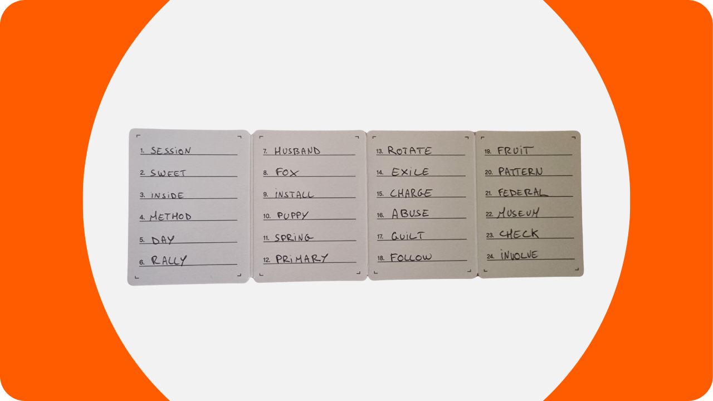
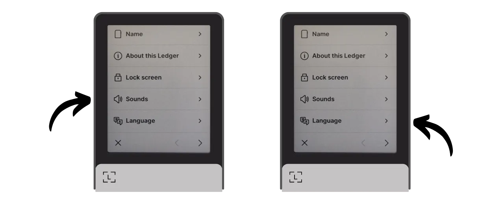
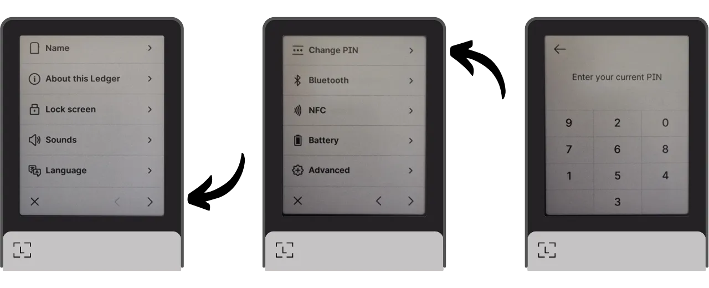

Một ví cứng là một thiết bị điện tử chuyên dụng để quản lý và bảo mật các khóa riêng của một ví Bitcoin. Khác với các ví phần mềm (hoặc ví nóng) được cài đặt trên các máy tính đa năng thường xuyên kết nối với Internet, ví cứng cho phép cô lập vật lý các khóa riêng, giảm thiểu nguy cơ bị hack và mất cắp.

Mục tiêu chính của một ví cứng là giảm thiểu các chức năng của thiết bị để giảm bề mặt tấn công. Bề mặt tấn công nhỏ hơn cũng có nghĩa là ít véc-tơ tấn công tiềm năng hơn, tức là ít điểm yếu trong hệ thống mà kẻ tấn công có thể khai thác để truy cập vào bitcoin.

Việc sử dụng ví cứng để bảo mật bitcoin của bạn được khuyến nghị, đặc biệt nếu bạn sở hữu một lượng lớn, dù là về giá trị tuyệt đối hay là tỷ lệ so với tổng tài sản của bạn.

Ví cứng được sử dụng kết hợp với phần mềm quản lý ví trên máy tính hoặc điện thoại thông minh. Phần mềm này quản lý việc tạo giao dịch, nhưng chữ ký mã hóa cần thiết để xác nhận các giao dịch này chỉ được thực hiện trong ví cứng. Điều này có nghĩa là các khóa riêng không bao giờ được tiếp xúc với môi trường có thể bị tấn công.

Ví cứng cung cấp hai lớp bảo vệ cho người dùng: một mặt, chúng bảo vệ bitcoin của bạn khỏi các cuộc tấn công từ xa bằng cách giữ các khóa riêng ngoại tuyến, và mặt khác, chúng thường cung cấp khả năng chống chịu vật lý tốt hơn đối với các nỗ lực trích xuất khóa. Và chính trên 2 tiêu chí bảo mật này, người ta có thể đánh giá và xếp hạng các mô hình khác nhau có trên thị trường.

Trong hướng dẫn này, tôi đề xuất khám phá một trong những giải pháp này: **Ledger Flex**.

## Giới thiệu về Ledger Flex

Ledger Flex là một ví cứng do công ty Pháp Ledger sản xuất, được bán với giá 249 €.

Nó có một màn hình cảm ứng E Ink lớn, một công nghệ hiển thị đen trắng. Đây là công nghệ tương tự như được tìm thấy trong các đầu đọc sách điện tử. Màn hình E Ink cho phép hiển thị rõ ràng và dễ đọc, ngay cả dưới ánh sáng mặt trời chói chang, và tiêu thụ rất ít năng lượng, hoặc không tiêu thụ gì khi màn hình đứng yên. Nó hoạt động bằng cách sử dụng các vi hạt chứa hạt màu đen và trắng. Khi một điện tích được áp dụng, các hạt màu đen hoặc trắng di chuyển lên bề mặt của màn hình, do đó cho phép hình thành văn bản hoặc hình ảnh.
Ledger Flex được trang bị chip "yếu tố bảo mật" được chứng nhận CC EAL6+, cung cấp cho bạn bảo vệ tiên tiến chống lại các cuộc tấn công vật lý vào phần cứng. Màn hình được điều khiển trực tiếp bởi chip này. Một điểm chỉ trích thường gặp là mã cho chip này không phải là mã nguồn mở, đòi hỏi một mức độ tin tưởng nhất định vào tính toàn vẹn của thành phần này. Tuy nhiên, thành phần này được kiểm định bởi các chuyên gia độc lập.

Về mặt sử dụng, Ledger Flex cung cấp nhiều tùy chọn kết nối: Bluetooth, USB-C, và NFC. Màn hình lớn cho phép dễ dàng xác minh chi tiết giao dịch của bạn. Ledger cũng nổi bật so với các đối thủ cạnh tranh với việc nhanh chóng áp dụng các tính năng mới của Bitcoin, chẳng hạn như Miniscript, ví dụ.

Sau khi thử nghiệm, tôi ấn tượng với chất lượng của sản phẩm. Trải nghiệm người dùng xuất sắc, và thiết bị trực quan. Đây là một ví cứng xuất sắc. Tuy nhiên, theo ý kiến của tôi, nó có 2 nhược điểm lớn: không thể xác minh mã của chip và, tất nhiên, giá của nó, cao hơn đáng kể so với các đối thủ cạnh tranh. Để so sánh, mô hình tiên tiến nhất từ Foundation được bán với giá $199, của Coinkite là $219.99, trong khi Trezor mới nhất, cũng được trang bị màn hình cảm ứng lớn, được chào bán với giá 169€.

## Làm thế nào để mua Ledger Flex?
Ledger Flex hiện đã có thể mua trên [trang web chính thức](https://shop.ledger.com/pages/ledger-flex). Để mua nó tại cửa hàng vật lý, bạn cũng có thể tìm [danh sách các nhà bán lẻ chứng nhận](https://www.ledger.com/reseller) trên trang web của Ledger.
## Yêu cầu

Sau khi bạn nhận được Ledger Flex của mình, bước đầu tiên là kiểm tra bao bì để đảm bảo rằng nó chưa được mở.

Bao bì của Ledger nên bao gồm 2 dải niêm phong. Nếu những dải này bị mất hoặc hỏng, điều đó có thể chỉ ra rằng ví cứng đã bị xâm phạm và có thể không phải là hàng chính hãng.

Khi mở ra, bạn nên tìm thấy các vật phẩm sau trong hộp:
- Ledger Flex;
- Một cáp USB-C;
- Một sách hướng dẫn sử dụng;
- Các thẻ để ghi cụm từ ghi nhớ của bạn.

Đối với hướng dẫn này, bạn sẽ cần 2 phần mềm: Ledger Live để khởi tạo Ledger Flex, và Sparrow Wallet để quản lý ví Bitcoin của bạn. Tải về [Ledger Live](https://www.ledger.com/ledger-live) và [Sparrow Wallet](https://sparrowwallet.com/download/) từ trang web chính thức của họ.

Chúng tôi sẽ sớm cung cấp một hướng dẫn về cách xác minh tính xác thực và toàn vẹn của phần mềm bạn tải về. Tôi khuyên bạn nên làm điều này đối với Ledger Live và Sparrow.
## Làm thế nào để Khởi tạo Ledger Flex với Ledger Live?

Bật Ledger Flex của bạn bằng cách nhấn nút bên phải trong vài giây.

Lướt qua các trang giới thiệu khác nhau.

Chọn tùy chọn "*Thiết lập mà không cần Ledger Live*", sau đó nhấn vào nút "*Bỏ qua Ledger Live*".

Sau đó, bạn sẽ được yêu cầu chọn một tên cho Ledger của mình. Nhấn vào "*Đặt tên*", và sau đó nhập tên bạn chọn.

Chọn mã PIN cho thiết bị của bạn, sẽ được sử dụng để mở khóa Ledger của bạn. Đây do đó là một biện pháp bảo vệ chống lại truy cập vật lý không được phép. Mã PIN này không tham gia vào việc tạo ra các khóa mật mã của ví của bạn. Do đó, ngay cả khi không có quyền truy cập vào mã PIN này, việc có cụm từ ghi nhớ 24 từ của bạn sẽ cho phép bạn lấy lại quyền truy cập vào bitcoin của mình.

Được khuyến nghị chọn một mã PIN gồm 8 chữ số, càng ngẫu nhiên càng tốt. Ngoài ra, hãy chắc chắn lưu mã này ở một nơi khác nơi bạn lưu trữ Ledger Flex của mình (ví dụ, trong một trình quản lý mật khẩu).

Nhập lại mã PIN một lần nữa để xác nhận.

Sau đó, bạn sẽ được yêu cầu chọn giữa khôi phục một ví hiện có hoặc tạo một ví mới. Trong hướng dẫn này, chúng tôi đang nói về việc tạo một ví mới từ đầu, vì vậy chọn tùy chọn "*Thiết lập như một Ledger mới*" để tạo một cụm từ ghi nhớ mới.

Flex của bạn sẽ cung cấp hướng dẫn về cách quản lý cụm từ khôi phục của bạn.
**Cụm từ ghi nhớ này cung cấp quyền truy cập hoàn toàn và không giới hạn vào tất cả số bitcoin của bạn**. Bất kỳ ai sở hữu cụm từ này có thể ăn cắp quỹ của bạn, ngay cả khi không có quyền truy cập vật lý vào Ledger của bạn. Cụm từ 24 từ cho phép khôi phục quyền truy cập vào bitcoin của bạn trong trường hợp mất mát, trộm cắp, hoặc hư hại Ledger Flex của bạn. Do đó, việc lưu trữ cẩn thận và bảo quản nó ở một nơi an toàn là rất quan trọng.
Bạn có thể ghi chúng xuống trên tờ giấy bìa được cung cấp cùng với Ledger của bạn, hoặc để tăng cường bảo mật, tôi khuyên bạn nên khắc chúng lên một phương tiện bằng thép không gỉ để bảo vệ khỏi nguy cơ cháy, lũ lụt, hoặc sụp đổ.

Bạn có thể duyệt qua các hướng dẫn này và bỏ qua các trang bằng cách chạm vào màn hình.

Ledger sẽ tạo ra cụm từ ghi nhớ của bạn sử dụng bộ sinh số ngẫu nhiên của nó. Đảm bảo bạn không bị quan sát trong quá trình này. Ghi lại các từ do Ledger cung cấp trên phương tiện vật lý mà bạn chọn. Tùy thuộc vào chiến lược bảo mật của bạn, bạn có thể xem xét việc tạo ra nhiều bản sao vật lý hoàn chỉnh của cụm từ (nhưng quan trọng nhất, không được chia nhỏ nó). Việc giữ các từ được đánh số và theo thứ tự tuần tự là quan trọng.
***Rõ ràng, bạn không bao giờ nên chia sẻ những từ này trên internet, trái ngược với những gì tôi đang làm trong hướng dẫn này. Ví dụ này chỉ được sử dụng trên Testnet và sẽ được xóa vào cuối hướng dẫn.***

Để chuyển sang nhóm từ tiếp theo, nhấn vào nút "*Next*". Một khi tất cả các từ đã được ghi chú, nhấn vào nút "*Done*" để tiếp tục sang bước tiếp theo.

Nhấn vào nút "*Start confirmation*", sau đó chọn các từ từ cụm từ ghi nhớ của bạn theo thứ tự để xác nhận rằng bạn đã ghi chú chúng một cách chính xác. Tiếp tục quy trình này cho đến từ thứ 24.

Nếu cụm từ bạn đang xác nhận khớp chính xác với cụm từ mà Flex cung cấp cho bạn ở bước trước, bạn có thể tiếp tục. Nếu không, điều này chỉ ra rằng bản sao vật lý của cụm từ ghi nhớ của bạn không chính xác và bạn cần phải bắt đầu lại quá trình.

Và đó là, hạt giống của bạn đã được tạo đúng cách trên Ledger Flex của bạn. Trước khi tiếp tục tạo một ví Bitcoin mới từ hạt giống này, hãy cùng nhau khám phá các cài đặt của thiết bị.

## Làm thế nào để thay đổi cài đặt của Ledger của bạn?

Để khóa và mở khóa Ledger của bạn, nhấn vào nút bên cạnh. Sau đó, bạn sẽ được yêu cầu nhập mã PIN mà bạn đã thiết lập ở bước trước.

Để truy cập vào cài đặt, nhấn vào biểu tượng bánh răng ở góc dưới bên trái của thiết bị của bạn.

Menu "*Name*" cho phép bạn thay đổi tên của Ledger.

Trong "*About this Ledger*," bạn sẽ tìm thấy thông tin về Flex của mình.

Trong menu "*Lock screen*," bạn có tùy chọn thay đổi hình ảnh hiển thị trên màn hình khóa bằng cách chọn "*Customize lock screen picture*". Nhờ công nghệ màn hình E Ink của thiết bị, có thể giữ màn hình luôn bật mà không tiêu thụ pin. Màn hình E Ink không sử dụng năng lượng để duy trì một hình ảnh tĩnh. Tuy nhiên, chúng tiêu thụ năng lượng trong quá trình thay đổi hiển thị.
Menu phụ "*Auto-lock*" cho phép bạn cấu hình và kích hoạt khóa tự động Ledger của bạn sau một khoảng thời gian không hoạt động nhất định.

Menu "*Âm thanh*" cho phép bạn bật hoặc tắt âm thanh của Flex của bạn. Và trong menu "Ngôn ngữ", bạn có thể thay đổi ngôn ngữ hiển thị.

Bằng cách nhấp vào mũi tên bên phải, bạn có thể truy cập các cài đặt khác. "*Đổi PIN*" cho phép bạn thay đổi mã PIN của mình.

Các menu "*Bluetooth*" và "*NFC*" cho phép bạn quản lý các kết nối này.

Trong "*Pin*", bạn có thể thiết lập tự động tắt nguồn cho Ledger.

Mục "*Nâng cao*" cung cấp cho bạn quyền truy cập vào các cài đặt bảo mật phức tạp hơn. Bạn nên giữ tùy chọn "*Xáo trộn PIN*" được kích hoạt để tăng cường bảo mật. Cũng trong menu này, bạn có thể cấu hình một cụm mật khẩu BIP39.

Cụm mật khẩu là một mật khẩu tùy chọn, kết hợp với cụm từ khôi phục, cung cấp một lớp bảo mật bổ sung cho ví của bạn.

Hiện tại, ví của bạn được tạo từ một cụm từ ghi nhớ bao gồm 24 từ. Cụm từ khôi phục này rất quan trọng, vì nó cho phép bạn khôi phục tất cả các khóa của ví trong trường hợp mất mát. Tuy nhiên, nó tạo thành một điểm thất bại duy nhất (SPOF). Nếu nó bị xâm phạm, bitcoin có nguy cơ bị mất. Đây là nơi cụm mật khẩu xuất hiện. Đó là một mật khẩu tùy chọn, mà bạn có thể chọn một cách tùy ý, được thêm vào cụm từ ghi nhớ để tăng cường bảo mật cho ví.

Cụm mật khẩu không nên bị nhầm lẫn với mã PIN. Nó đóng vai trò trong việc phái sinh các khóa mật mã của bạn. Nó hoạt động cùng với cụm từ ghi nhớ, thay đổi hạt giống từ đó các khóa được tạo ra. Do đó, ngay cả khi ai đó có được cụm từ 24 từ của bạn, mà không có cụm mật khẩu, họ không thể truy cập vào quỹ của bạn. Sử dụng một cụm mật khẩu cơ bản tạo ra một ví mới với các khóa riêng biệt. Thay đổi (ngay cả một chút) cụm mật khẩu sẽ tạo ra một ví khác biệt.

Cụm mật khẩu là một công cụ rất mạnh mẽ để tăng cường bảo mật cho bitcoin của bạn. Tuy nhiên, rất quan trọng là phải hiểu cách nó hoạt động trước khi triển khai nó, để tránh mất quyền truy cập vào ví của bạn. Tôi sẽ giải thích cách sử dụng cụm mật khẩu trong một hướng dẫn chuyên dụng khác.

Cuối cùng, trang cài đặt cuối cùng cho phép bạn đặt lại Ledger của bạn. Chỉ tiến hành đặt lại này nếu bạn chắc chắn rằng nó không chứa bất kỳ khóa nào bảo vệ bitcoin, vì bạn có thể mất vĩnh viễn quyền truy cập vào quỹ của mình.

## Cách cài đặt ứng dụng Bitcoin?

Bắt đầu bằng cách khởi chạy phần mềm Ledger Live trên máy tính của bạn, sau đó kết nối và mở khóa Ledger Flex của bạn.

Trong Ledger Live, đi đến menu "*My Ledger*". Bạn sẽ được yêu cầu ủy quyền truy cập vào Flex của mình.

Xác nhận quyền truy cập trên Ledger của bạn bằng cách nhấp vào nút "*Cho phép*".

Đầu tiên, nếu firmware của Ledger Flex của bạn không được cập nhật, Ledger Live sẽ tự động đề nghị cập nhật nó. Nếu có, nhấp vào "*Cập nhật firmware*", sau đó nhấp vào "*Cài đặt cập nhật*" để bắt đầu quá trình cài đặt.

Trên Ledger của bạn, nhấp vào nút "*Cài đặt*", sau đó chờ trong quá trình cài đặt.

Firmware của Ledger Flex của bạn giờ đây đã được cập nhật.
Nếu bạn muốn, bạn có thể thay đổi hình nền màn hình khóa của Ledger Flex của mình. Để làm điều này, nhấp vào "*Thêm >*".

Nhấp vào nút "*Tải lên từ máy tính*" và chọn hình nền từ bộ sưu tập ảnh của bạn.

Bạn có thể cắt ảnh của mình.

Chọn một tùy chọn độ tương phản, sau đó nhấp vào "*Xác nhận độ tương phản*".

Trên Flex của bạn, nhấp vào nút "*Tải ảnh lên*".

Nếu bạn hài lòng với hình ảnh, nhấp vào "*Giữ*" để thiết lập nó làm hình nền màn hình khóa.

Cuối cùng, chúng ta sẽ thêm ứng dụng Bitcoin. Để làm điều này, trên Ledger Live, nhấp vào nút "*Cài đặt*" bên cạnh "*Bitcoin (BTC)*".

Ứng dụng sẽ được cài đặt trên Flex của bạn.

Từ bây giờ, bạn sẽ không cần phần mềm Ledger Live cho việc quản lý ví thường xuyên của mình nữa. Bạn có thể quay lại sử dụng nó đôi khi để cập nhật firmware khi có phiên bản mới. Cho mọi thứ khác, chúng ta sẽ sử dụng Sparrow Wallet, đây là một công cụ toàn diện hơn nhiều để quản lý ví Bitcoin một cách hiệu quả.

## Làm thế nào để thiết lập một ví Bitcoin mới với Sparrow?
Mở Sparrow Wallet và bỏ qua các trang giới thiệu để truy cập màn hình chính. Kiểm tra xem bạn đã kết nối đúng với một node bằng cách quan sát công tắc nằm ở góc dưới bên phải của màn hình.

Tôi rất khuyên bạn sử dụng node Bitcoin của riêng mình. Trong hướng dẫn này, tôi đang sử dụng một node công cộng (màu vàng) vì tôi đang ở trên testnet, nhưng cho việc sử dụng bình thường, tốt hơn hết bạn nên chọn một Bitcoin Core địa phương (màu xanh lá) hoặc một máy chủ Electrum kết nối với một node từ xa (màu xanh dương).

Nhấp vào menu "*File*" sau đó "*Ví Mới*".

Chọn một tên cho ví này, sau đó nhấp vào "*Tạo Ví*".

Trong menu thả xuống "*Loại Script*", chọn loại script sẽ được sử dụng để bảo vệ bitcoin của bạn. Tôi khuyên bạn nên chọn "*Taproot*", hoặc nếu không có, chọn "*Native SegWit*".

Nhấp vào nút "*Kết Nối Ví Cứng*".

Kết nối Ledger Flex của bạn với máy tính, mở khóa nó bằng mã PIN của bạn, sau đó mở ứng dụng "*Bitcoin*". Trong hướng dẫn này, tôi đang sử dụng ứng dụng "*Bitcoin Testnet*", nhưng quy trình vẫn giống nhau cho mainnet.

Trên Sparrow, nhấp vào nút "*Quét*".

Sau đó nhấp vào "*Nhập Keystore*".

Bây giờ bạn có thể thấy chi tiết của ví của mình, bao gồm khóa công khai mở rộng của tài khoản đầu tiên của bạn. Nhấp vào nút "*Áp dụng*" để hoàn tất việc tạo ví.

Chọn một mật khẩu mạnh để bảo vệ quyền truy cập vào Sparrow Wallet. Mật khẩu này sẽ đảm bảo an toàn cho dữ liệu ví của bạn trên Sparrow, giúp bảo vệ khóa công khai, địa chỉ, nhãn và lịch sử giao dịch khỏi bất kỳ sự truy cập trái phép nào.

Tôi khuyên bạn nên lưu mật khẩu này trong một trình quản lý mật khẩu để bạn không quên mất nó.

Và đó là, ví của bạn đã được tạo!

Trước khi nhận bitcoin đầu tiên vào ví của bạn, tôi khuyên bạn nên thực hiện một bài kiểm tra phục hồi khô. Ghi lại một thông tin tham chiếu, như xpub của bạn, sau đó đặt lại Ledger Flex của bạn trong khi ví vẫn trống. Sau đó, hãy thử khôi phục ví của bạn trên Ledger bằng cách sử dụng bản sao giấy của bạn. Kiểm tra xem xpub được tạo sau khi khôi phục có trùng khớp với cái bạn đã ghi chú ban đầu không. Nếu đúng như vậy, bạn có thể yên tâm rằng bản sao giấy của bạn là đáng tin cậy.

## Làm thế nào để nhận bitcoin với Ledger Flex?

Nhấp vào tab "*Receive*".

Kết nối Ledger Flex của bạn với máy tính, mở khóa nó bằng mã PIN của bạn, sau đó mở ứng dụng "*Bitcoin*".

Trước khi sử dụng địa chỉ được cung cấp bởi Sparrow Wallet, hãy xác minh nó trên màn hình của Ledger Flex. Thực hành này cho phép bạn xác nhận rằng địa chỉ hiển thị trên Sparrow không phải là giả mạo và Ledger thực sự giữ khóa riêng cần thiết để chi tiêu bitcoin được bảo vệ với địa chỉ này sau này.

Để thực hiện việc xác minh này, nhấp vào nút "*Display Address*".

Đảm bảo rằng địa chỉ hiển thị trên Ledger Flex của bạn trùng khớp với địa chỉ được chỉ ra trên Sparrow Wallet. Cũng được khuyến khích thực hiện việc xác minh này ngay trước khi bạn cung cấp địa chỉ của mình cho người gửi, để chắc chắn về tính hợp lệ của nó.

Bạn có thể thêm một "*Label*" để mô tả nguồn của bitcoin sẽ được bảo vệ với địa chỉ này. Đây là một thực hành tốt giúp bạn quản lý UTXOs của mình tốt hơn.

Để biết thêm thông tin về việc gắn nhãn, tôi cũng khuyên bạn nên xem qua hướng dẫn khác này:

https://planb.network/tutorials/privacy/utxo-labelling

Sau đó, bạn có thể sử dụng địa chỉ này để nhận bitcoin.

## Làm thế nào để gửi bitcoin với Ledger Flex?

Bây giờ bạn đã nhận được sats đầu tiên trong ví của mình được bảo vệ với Flex, bạn cũng có thể chi tiêu chúng! Kết nối Ledger của bạn với máy tính, mở khóa nó, khởi chạy Sparrow Wallet, sau đó chuyển đến tab "*Send*" để tạo một giao dịch mới.

Nếu bạn muốn thực hiện "*coin control*", tức là chọn cụ thể UTXOs nào sẽ tiêu trong giao dịch, hãy chuyển đến tab "*UTXOs*". Chọn UTXOs bạn muốn tiêu, sau đó nhấp vào "*Send Selected*". Bạn sẽ được chuyển hướng đến cùng một màn hình của tab "*Send*", nhưng với UTXOs của bạn đã được chọn cho giao dịch.

Nhập địa chỉ đích. Bạn cũng có thể nhập nhiều địa chỉ bằng cách nhấp vào nút "*+ Add*".

Ghi chú một "*Label*" để nhớ mục đích của khoản chi này.
Chọn số tiền được gửi đến địa chỉ này.

Điều chỉnh mức phí giao dịch của bạn theo thị trường hiện tại.

Đảm bảo tất cả các cài đặt của giao dịch bạn đều chính xác, sau đó nhấp vào "*Tạo Giao Dịch*".

Nếu mọi thứ đều đúng như bạn mong muốn, nhấp vào "*Hoàn Tất Giao Dịch để Ký*".

Nhấp vào "*Ký*".

Nhấp vào "*Ký*" bên cạnh Ledger Flex của bạn.

Xác minh các cài đặt giao dịch trên màn hình Flex của bạn, bao gồm địa chỉ nhận của người nhận, số tiền được gửi, và số tiền phí.

Để ký, giữ ngón tay của bạn trên nút "*Giữ để ký*".

Giao dịch của bạn giờ đã được ký. Nhấp vào "*Phát Sóng Giao Dịch*" để phát sóng nó trên mạng Bitcoin.

Bạn có thể tìm thấy nó trong tab "*Giao Dịch*" của Sparrow Wallet.

Xin chúc mừng, bạn giờ đã nắm bắt được cách sử dụng cơ bản của Ledger Flex với Sparrow Wallet! Trong một hướng dẫn tương lai, chúng ta sẽ xem cách sử dụng Ledger Flex với Liana để tận dụng Miniscript.

Nếu bạn thấy hướng dẫn này hữu ích, tôi sẽ rất trân trọng nếu bạn để lại một lượt thích bên dưới. Đừng ngần ngại chia sẻ bài viết này trên các mạng xã hội của bạn. Cảm ơn bạn rất nhiều!