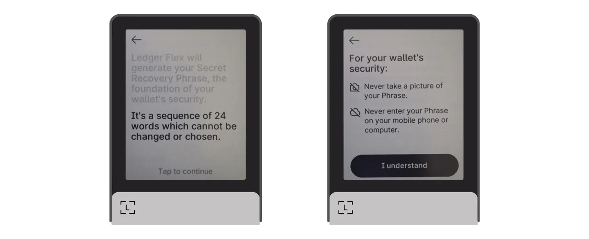
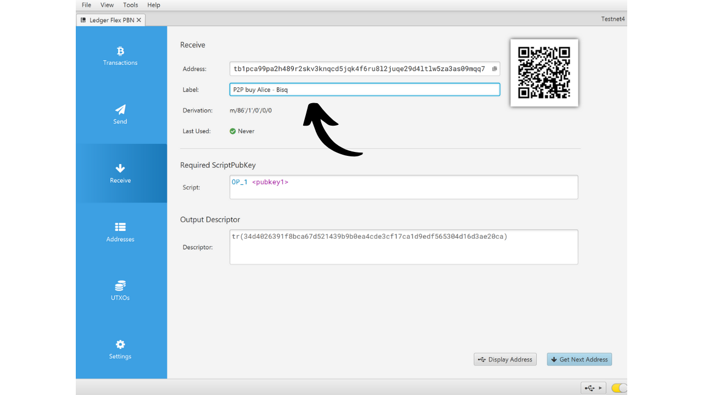

硬件钱包是一种专门用于管理和保护比特币钱包私钥的电子设备。与安装在通常连接到互联网的通用机器上的软件钱包（或热钱包）不同，硬件钱包允许物理隔离私钥，减少了黑客攻击和盗窃的风险。

硬件钱包的主要目标是最小化设备的功能以减少其攻击面。较小的攻击面也意味着较少的潜在攻击向量，即，系统中较少的弱点，攻击者可能利用这些弱点来访问比特币。

特别是如果您持有大量比特币，无论是绝对值还是占您总资产的比例，都推荐使用硬件钱包来保护您的比特币。

硬件钱包与计算机或智能手机上的钱包管理软件结合使用。这个软件管理交易的创建，但验证这些交易所必需的加密签名只在硬件钱包内完成。这意味着私钥永远不会暴露于可能脆弱的环境中。

硬件钱包为用户提供双重保护：一方面，通过保持私钥离线来保护您的比特币免受远程攻击，另一方面，它们通常提供更好的物理抵抗力，防止尝试提取密钥。正是基于这2个安全标准，可以评判和排名市场上的不同模型。

在本教程中，我提议发现这些解决方案之一：**Ledger Flex**。

## Ledger Flex简介

Ledger Flex是由法国公司Ledger生产的硬件钱包，市场价格为249欧元。

它配备了一个大型E Ink触摸屏，这是一种黑白显示技术。这与电子阅读器中发现的技术相同。E Ink屏幕即使在明亮的阳光下也能提供清晰可读的显示，并且能耗非常低，或在屏幕静止时根本不消耗能源。它通过使用含有黑色和白色颜料粒子的微胶囊工作。当施加电荷时，黑色或白色颜料粒子移动到屏幕表面，从而形成文本或图像。
Ledger Flex配备了CC EAL6+认证的“安全元素”芯片，为您提供针对硬件物理攻击的高级保护。屏幕直接由此芯片控制。一个常见的批评点是，这个芯片的代码不是开源的，需要对这个组件的完整性有一定程度的信任。然而，这个元素是由独立专家审计的。

在使用方面，Ledger Flex提供了几种连接选项：蓝牙、USB-C和NFC。大屏幕方便您轻松验证交易详情。Ledger还凭借其快速采用新的比特币功能而脱颖而出，例如Miniscript。

经过测试，我对产品的质量印象深刻。用户体验极佳，设备直观。这是一个优秀的硬件钱包。然而，在我看来，它有2个主要缺点：无法验证芯片的代码，当然还有它的价格，明显高于其竞争对手。作为比较，Foundation的最先进模型售价为199美元，Coinkite的为219.99美元，而最新的Trezor，也配备了大触摸屏，售价为169欧元。

## 如何购买Ledger Flex？
Ledger Flex 现已在[官方网站](https://shop.ledger.com/pages/ledger-flex)上开放购买。如果您想在实体店购买，也可以在Ledger网站上找到[认证经销商列表](https://www.ledger.com/reseller)。

## 先决条件

一旦您收到了您的Ledger Flex，第一步是检查包装确保它未被打开。

Ledger的包装应该包括2个封条。如果这些封条缺失或损坏，可能表明硬件钱包已经被篡改，可能不是正品。

打开后，您应该在盒子里找到以下物品：
- Ledger Flex；
- 一根USB-C线；
- 用户手册；
- 用于记录您的助记词的卡片。

对于本教程，您将需要2个软件：Ledger Live来初始化Ledger Flex，以及Sparrow Wallet来管理您的比特币钱包。从官方网站下载 [Ledger Live](https://www.ledger.com/ledger-live) 和 [Sparrow Wallet](https://sparrowwallet.com/download/)。

我们很快会提供一个教程，教您如何验证您下载的软件的真实性和完整性。我强烈建议在这里对Ledger Live和Sparrow进行验证。
## 如何用Ledger Live初始化Ledger Flex？

按住右侧按钮几秒钟以开启您的Ledger Flex。

浏览不同的介绍页面。

选择“*不使用Ledger Live设置*”选项，然后点击“*跳过Ledger Live*”按钮。

接下来，系统会要求您为您的Ledger选择一个名称。点击“*设置名称*”，然后输入您选择的名称。

为您的设备选择一个PIN码，这将用于解锁您的Ledger。因此，这是一种防止未经授权的物理访问的保护措施。这个PIN码不参与您钱包的加密密钥的派生。因此，即使没有这个PIN码，拥有您的24个单词的助记词也能让您重新获得对您比特币的访问权。

建议选择一个尽可能随机的8位数PIN码。同时，确保将此代码保存在与您的Ledger Flex存放位置不同的地方（例如，在密码管理器中）。

再次输入您的PIN码以确认。

然后，系统会提示您选择是恢复现有钱包还是创建一个新钱包。在本教程中，我们将介绍从头开始创建一个新钱包，因此选择“*作为新的Ledger设置*”选项以生成一个新的助记词。

您的Flex将提供有关如何管理您的恢复短语的指导。
**这个助记词短语能够完全且不受限制地访问您所有的比特币**。任何拥有这个短语的人都可以偷走您的资金，即使没有物理接触到您的Ledger。这个24个词的短语允许在丢失、盗窃或您的Ledger Flex损坏的情况下恢复对您比特币的访问。因此，小心保存并将其存放在一个安全的地方非常重要。
您可以将其写在随您的Ledger提供的硬纸板上，或者为了增加安全性，我推荐在不锈钢介质上雕刻它，以防止火灾、洪水或倒塌的风险。

您可以浏览这些指令并通过触摸屏幕跳过页面。

Ledger将使用其随机数生成器创建您的助记词短语。确保在此操作期间没有人观察您。将Ledger提供的单词写在您选择的物理介质上。根据您的安全策略，您可能会考虑制作短语的几份完整物理副本（但最重要的是，不要分开它们）。保持单词编号并按顺序排列非常重要。
***显然，您永远不应该在互联网上分享这些单词，与我在本教程中所做的相反。这个示例钱包将仅在Testnet上使用，并将在教程结束时删除。***

要移动到下一组单词，请点击“*Next*”按钮。记录所有单词后，点击“*Done*”按钮继续下一步。

点击“*Start confirmation*”按钮，然后按顺序选择您的助记词短语中的单词，以确认您已正确记录它们。继续此程序直到第24个单词。

如果您正在确认的短语与Flex在上一步提供给您的完全匹配，您就可以继续了。如果不是，这表明您的助记词短语的物理备份不正确，您需要重新开始该过程。

就这样，您的种子已经在您的Ledger Flex上正确创建。在继续创建一个新的比特币钱包之前，让我们一起探索设备设置。

## 如何修改您的Ledger设置？

要锁定和解锁您的Ledger，请按侧面按钮。然后，系统会要求您输入在上一步设置的PIN码。

要访问设置，请点击设备左下角的齿轮符号。

“*Name*”菜单允许您更改Ledger的名称。

在“*About this Ledger*”中，您将找到有关您的Flex的信息。

在“*Lock screen*”菜单中，您可以通过选择“*Customize lock screen picture*”更改锁屏显示的图像。得益于设备的E Ink屏幕技术，可以在不消耗电池的情况下持续开启屏幕。E Ink屏幕在维持静态图像时不使用能源。然而，在显示变化时它们确实消耗能源。
“*Auto-lock*”子菜单允许您配置并激活在确定的不活动期后自动锁定您的Ledger。

"*声音*" 菜单允许您开启或关闭您的 Flex 的声音。在 "语言" 菜单中，您可以更改显示语言。

点击右箭头，您可以访问其他设置。"*更改 PIN*" 允许您更改您的 PIN 码。

"*蓝牙*" 和 "*NFC*" 菜单允许您管理这些通信。

在 "*电池*" 中，您可以特别设置 Ledger 的自动关机。

"*高级*" 部分为您提供了访问更复杂安全设置的权限。建议保持 "*PIN 混淆*" 选项激活以增强安全性。也是在这个菜单中，您可以配置 BIP39 密码短语。

密码短语是一个可选的密码，与恢复短语结合使用，为您的钱包提供了额外的安全层。

目前，您的钱包是由包含 24 个单词的助记短语生成的。这个恢复短语非常重要，因为它允许您在丢失的情况下恢复钱包的所有密钥。然而，它构成了单点故障（SPOF）。如果它被泄露，比特币就会处于危险之中。这就是密码短语发挥作用的地方。它是一个可选的密码，您可以任意选择，它增加到助记短语中以加强钱包的安全性。

密码短语不应与 PIN 码混淆。它在您的加密密钥的派生中起作用。它与助记短语一起工作，修改生成密钥的种子。因此，即使有人获得您的 24 个单词的短语，没有密码短语，他们也无法访问您的资金。使用密码短语本质上创建了一个具有不同密钥的新钱包。修改（即使是轻微的）密码短语将生成一个不同的钱包。

密码短语是增强您的比特币安全性的非常强大的工具。然而，在实施它之前了解它的工作原理非常重要，以避免失去对您钱包的访问。我将在另一个专门的教程中解释如何使用密码短语。

最后，最后一个设置页面允许您重置您的 Ledger。只有在您确定它不包含任何保护比特币的密钥时，才进行这个重置，因为您可能会永久失去访问您的资金的权限。

## 如何安装比特币应用程序？

首先，在您的电脑上启动 Ledger Live 软件，然后连接并解锁您的 Ledger Flex。

在 Ledger Live 中，转到 "*我的 Ledger*" 菜单。系统将要求您授权访问您的 Flex。

在您的 Ledger 上点击 "*允许*" 按钮以验证访问。

首先，如果您的 Ledger Flex 的固件不是最新的，Ledger Live 将自动提供更新它。如果适用，点击 "*更新固件*"，然后点击 "*安装更新*" 开始安装。

在您的 Ledger 上点击 "*安装*" 按钮，然后等待安装过程。

您的 Ledger Flex 的固件现在已经是最新的。
如果您愿意，您可以更改您的Ledger Flex的锁屏壁纸。为此，请点击“*添加 >*”。

点击“*从电脑上传*”按钮，并从您的照片中选择您的壁纸。

您可以裁剪您的图片。

从不同选项中选择一个对比度，然后点击“*确认对比度*”。

在您的Flex上，点击“*加载图片*”按钮。

如果您对图片满意，点击“*保留*”以将其设置为您的锁屏壁纸。

最后，我们将添加比特币应用程序。为此，在Ledger Live上，点击“*比特币（BTC）*”旁边的“*安装*”按钮。

应用程序将安装在您的Flex上。

从现在开始，您将不再需要Ledger Live软件来常规管理您的钱包。您可以偶尔返回它以更新固件，当新版本可用时。对于其他所有事情，我们将使用Sparrow Wallet，这是一个更全面的工具，用于有效管理比特币钱包。

## 如何使用Sparrow设置一个新的比特币钱包？
打开Sparrow Wallet并跳过介绍页面以访问主屏幕。通过观察屏幕右下角的开关，检查您是否正确连接到节点。
我强烈推荐使用您自己的比特币节点。在本教程中，我使用的是公共节点（黄色），因为我在测试网上，但对于正常使用，最好选择本地比特币核心（绿色）或连接到远程节点的Electrum服务器（蓝色）。

点击“*文件*”菜单然后“*新建钱包*”。

为这个钱包选择一个名称，然后点击“*创建钱包*”。

在“*脚本类型*”下拉菜单中，选择将用于保护您的比特币的脚本类型。我推荐选择“*Taproot*”，如果不可用，选择“*原生SegWit*”。

点击“*已连接的硬件钱包*”按钮。

将您的Ledger Flex连接到电脑，用您的PIN码解锁它，然后打开“*比特币*”应用程序。在本教程中，我使用的是“*比特币测试网*”应用程序，但主网的程序保持相同。

在Sparrow上，点击“*扫描*”按钮。

然后点击“*导入密钥库*”。

现在您可以看到您钱包的详细信息，包括您第一个账户的扩展公钥。点击“*应用*”按钮以完成钱包的创建。
为了确保访问Sparrow Wallet的安全，请选择一个强密码。这个密码将保护您在Sparrow上的钱包数据安全，帮助防止未经授权的访问您的公钥、地址、标签和交易历史。

我建议您将这个密码保存在密码管理器中，以免忘记。

现在，您的钱包已经创建成功了！

在钱包中接收您的第一笔比特币之前，我强烈建议您进行一次干运恢复测试。记下一个参考信息，比如您的xpub，然后在钱包还是空的时候重置您的Ledger Flex。之后，尝试使用您的纸质备份在Ledger上恢复您的钱包。检查恢复后生成的xpub是否与您最初记下的一致。如果是这样，您就可以确信您的纸质备份是可靠的。

## 如何使用Ledger Flex接收比特币？

点击“*接收*”标签。

将您的Ledger Flex连接到电脑，用您的PIN码解锁，然后打开“*比特币*”应用程序。

在使用Sparrow Wallet提供的地址之前，请在您的Ledger Flex的屏幕上验证它。这种做法允许您确认Sparrow上显示的地址不是欺诈性的，并且Ledger确实持有以后使用这个地址保护的比特币所需的私钥。

为了进行这项验证，请点击“*显示地址*”按钮。

确保您的Ledger Flex上显示的地址与Sparrow Wallet上指示的地址匹配。还建议在给发送者提供您的地址之前进行这项验证，以确保其有效性。

您可以添加一个“*标签*”来描述将用这个地址保护的比特币的来源。这是一个好习惯，有助于您更好地管理您的UTXOs。

有关标签的更多信息，我还建议您查看这个教程：

https://planb.network/tutorials/privacy/utxo-labelling

然后，您可以使用这个地址来接收比特币。

## 如何使用Ledger Flex发送比特币？

现在您已经在您的Flex保护的钱包中收到了您的第一笔sats，您也可以花费它们！将您的Ledger连接到电脑，解锁它，启动Sparrow Wallet，然后转到“*发送*”标签以构建新的交易。

如果您想进行“*币控制*”，即特定选择哪些UTXOs在交易中消费，请转到“*UTXOs*”标签。选择您希望花费的UTXOs，然后点击“*发送选中的*”。您将被重定向到“*发送*”标签的同一屏幕，但您的UTXOs已为交易选择。

输入目的地址。通过点击“*+ 添加*”按钮，您也可以输入多个地址。

记下一个“*标签*”，以记住这次支出的目的。
选择发送到此地址的金额。

调整您的交易费率以适应当前市场。

确保您的交易设置正确无误，然后点击“*创建交易*”。

如果一切符合您的满意，请点击“*最终确定交易以签名*”。

点击“*签名*”。

在您的Ledger Flex旁边点击“*签名*”。

在您的Flex屏幕上验证交易设置，包括接收者的接收地址、发送金额和费用金额。

要签名，请长按“*按住以签名*”按钮。

您的交易现已签名。点击“*广播交易*”将其广播到比特币网络上。

您可以在Sparrow Wallet的“*交易*”标签中找到它。

恭喜您，现在您已经掌握了使用Ledger Flex与Sparrow Wallet的基本操作！在未来的教程中，我们将看到如何结合使用Ledger Flex和Liana来利用Miniscript。

如果您觉得这个教程有帮助，我会非常感激您在下方点赞。欢迎在您的社交网络上分享这篇文章。非常感谢！