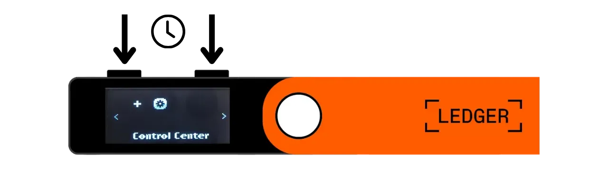
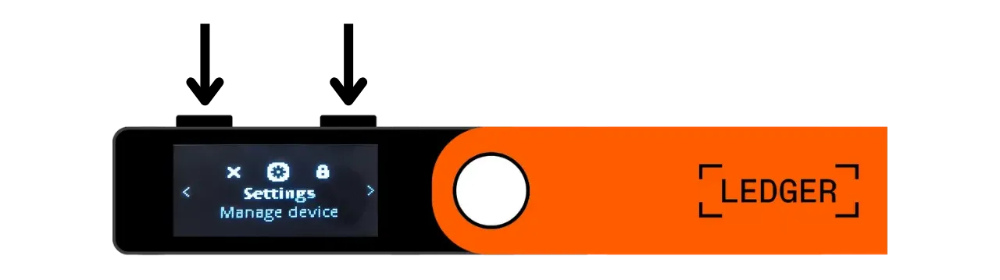
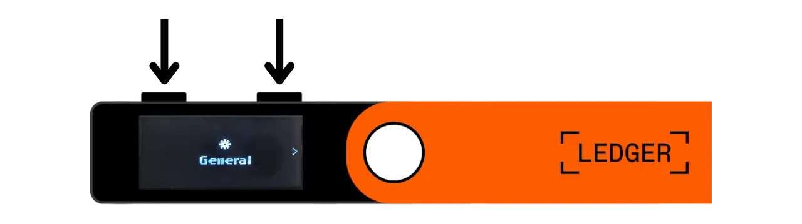

Hardwarová peněženka je elektronické zařízení určené k správě a zabezpečení privátních klíčů Bitcoinové peněženky. Na rozdíl od softwarových peněženek (neboli hot wallets) instalovaných na všeobecně používaných zařízeních často připojených k internetu, hardwarové peněženky umožňují fyzickou izolaci privátních klíčů, čímž snižují rizika hackování a krádeže.

Hlavním cílem hardwarové peněženky je co nejvíce minimalizovat funkce zařízení, aby se snížila jeho útočná plocha. Menší útočná plocha také znamená méně potenciálních vektorů útoku, tj. méně slabých míst v systému, které by útočníci mohli využít k získání přístupu k bitcoinům.

Je doporučeno používat hardwarovou peněženku k zabezpečení vašich bitcoinů, zejména pokud držíte významné množství, ať už v absolutní hodnotě nebo jako procento vašich celkových aktiv.

Hardwarové peněženky se používají ve spojení se softwarem pro správu peněženky na počítači nebo chytrém telefonu. Tento software spravuje vytváření transakcí, ale kryptografický podpis nezbytný k ověření těchto transakcí se provádí pouze v rámci hardwarové peněženky. To znamená, že privátní klíče nejsou nikdy vystaveny potenciálně zranitelnému prostředí.

Hardwarové peněženky nabízejí dvojí ochranu uživatele: na jedné straně zabezpečují vaše bitcoiny proti vzdáleným útokům tím, že udržují privátní klíče offline, a na druhé straně obvykle nabízejí lepší fyzickou odolnost proti pokusům o extrakci klíčů. A právě na těchto 2 bezpečnostních kritériích lze posuzovat a řadit různé dostupné modely na trhu.

V tomto tutoriálu navrhuji objevit jedno z těchto řešení: **Ledger Nano S Plus**.

## Úvod do Ledger Nano S Plus

Ledger Nano S Plus je hardwarová peněženka vyrobená francouzskou společností Ledger, která se prodává za cenu 79 €.

Nano S Plus je vybaveno čipem certifikovaným CC EAL6+ ("*secure element*"), který vám nabízí pokročilou ochranu proti fyzickým útokům na hardware. Obrazovka a tlačítka jsou přímo ovládány tímto čipem. Často vzneseným bodem kritiky je, že kód tohoto čipu není open-source, což vyžaduje určitou důvěru v integritu této součásti. Nicméně tento prvek je auditován nezávislými odborníky.

Pokud jde o použití, Ledger Nano S Plus funguje výhradně prostřednictvím kabelového připojení USB-C.

Ledger se odlišuje od svých konkurentů svou vždy velmi rychlou adaptací na nové funkce Bitcoinu, jako jsou například Taproot nebo Miniscript, což je vysoce oceňováno.
Po otestování jsem zjistil, že Ledger Nano S Plus je vynikající hardwarová peněženka pro začátečníky. Nabízí vysokou úroveň zabezpečení za rozumnou cenu. Jeho hlavní nevýhodou ve srovnání s jinými zařízeními ve stejné cenové kategorii je skutečnost, že kód firmware není open-source. Také obrazovka Nano S Plus je relativně malá ve srovnání s dražšími modely, jako je Ledger Flex nebo Coldcard Q1. Přesto je jeho rozhraní velmi dobře navrženo: i přes svá dvě tlačítka a malou obrazovku zůstává snadno použitelné, včetně pro pokročilé funkce, jako je BIP39 passphrase. Ledger Nano S Plus nemá baterii, Air-gap připojení, kameru ani port pro micro SD, ale to je pro tuto cenovou kategorii zcela normální.
Podle mého názoru je Ledger Nano S Plus dobrá volba pro zabezpečení vaší Bitcoin peněženky a je vhodný jak pro začátečníky, tak pro pokročilé uživatele. Nicméně, v této cenové kategorii osobně dávám přednost Trezor Safe 3, který nabízí přibližně stejné možnosti. Výhodou Trezoru, podle mého názoru, je v řízení jeho bezpečnostního prvku: mnemonická fráze a klíče jsou spravovány výhradně open-source kódem, přesto stále těží z ochrany čipu. Nevýhodou Trezoru je, že jsou někdy velmi pomalí v implementaci nových funkcí na rozdíl od Ledgeru.
## Jak koupit Ledger Nano S Plus?

Ledger Nano S Plus je k dispozici k prodeji [na oficiálních stránkách](https://shop.ledger.com/products/ledger-nano-s-plus). Pokud ho chcete koupit v kamenném obchodě, můžete také najít [seznam certifikovaných prodejců](https://www.ledger.com/reseller) na webových stránkách Ledger.

## Předpoklady

Jakmile obdržíte svůj Ledger Nano, prvním krokem je zkontrolovat balení, aby se ujistilo, že nebylo otevřeno. Pokud je poškozené, může to naznačovat, že hardwarová peněženka byla kompromitována a nemusí být autentická.

Po otevření byste měli v krabici najít následující položky:
- Ledger Nano S Plus;
- Kabel USB-C na USB-A;
- Uživatelský manuál;
- Karty pro zapsání vaší mnemonické fráze.

Pro tento tutoriál budete potřebovat 2 softwarové aplikace: Ledger Live pro inicializaci Ledgeru a Sparrow Wallet pro správu vaší Bitcoin peněženky. Stáhněte si [Ledger Live](https://www.ledger.com/ledger-live) a [Sparrow Wallet](https://sparrowwallet.com/download/) z jejich oficiálních webových stránek.

Pro tyto dva softwarové programy důrazně doporučuji ověřit jejich autentičnost (pomocí GnuPG) a integritu (prostřednictvím hash) před jejich instalací na vaše zařízení. Pokud si nejste jisti, jak to udělat, můžete sledovat tento další tutoriál:
https://planb.network/tutorials/others/integrity-authenticity

## Jak inicializovat Ledger Nano?

Připojte svůj Nano k počítači, kde jsou nainstalovány Ledger Live a Sparrow Wallet. Pro navigaci na vašem Ledgeru použijte levé tlačítko pro pohyb doleva a pravé tlačítko pro pohyb doprava. Pro výběr nebo potvrzení možnosti stiskněte současně obě tlačítka.

Projděte různé úvodní stránky a poté klikněte na obě tlačítka, abyste začali.

Vyberte možnost "*Nastavit jako nové zařízení*".

Vyberte PIN kód, který bude použit k odemčení vašeho Ledgeru. Jedná se tedy o ochranu proti neoprávněnému fyzickému přístupu. Tento PIN kód nehraje roli v odvození kryptografických klíčů vaší peněženky. Tedy, i bez přístupu k tomuto PIN kódu, majíc vaši 24-slovní mnemonickou frázi, budete moci znovu získat přístup k vašim bitcoinům.

Doporučuje se vybrat 8-místný PIN, co nejvíce náhodný. Také se ujistěte, že tento kód uložíte na jiném místě, než kde je uložen váš Ledger Nano S Plus (například v manažeru hesel).

Pomocí tlačítek se pohybujte po číslicích, poté každou číslici vyberte stiskem obou tlačítek současně.

Zadejte svůj PIN podruhé pro jeho potvrzení.

Váš Nano poskytuje instrukce, jak spravovat vaši obnovovací frázi.

**Tato mnemonická fráze poskytuje plný a neomezený přístup ke všem vašim bitcoinům**. Každý, kdo je v držení této fráze, může ukrást vaše prostředky, i bez fyzického přístupu k vašemu Ledgeru. Fráze o 24 slovech vám umožňuje obnovit přístup k vašim bitcoinům v případě ztráty, krádeže nebo poškození vašeho Ledger Nano. Je proto velmi důležité pečlivě ji uložit a uchovat na bezpečném místě.

Můžete si ji zapsat na kartonový papír, který je součástí balení vašeho Ledgeru, nebo pro větší bezpečnost doporučuji vyrytí na nerezovém médiu, aby byla chráněna před riziky požárů, záplav nebo zřícení.

Můžete procházet tyto instrukce a přeskakovat stránky kliknutím na pravé tlačítko.

Ledger vytvoří vaši mnemonickou frázi pomocí svého generátoru náhodných čísel. Ujistěte se, že při této operaci nejste pozorováni. Zapište slova poskytnutá Ledgerem na fyzické médium dle vašeho výběru. V závislosti na vaší bezpečnostní strategii byste mohli zvážit vytvoření několika úplných fyzických kopií fráze (ale důležité je, ne ji rozdělit). Je zásadní udržet slova číslovaná a v sekvenčním pořadí.
***Samozřejmě byste tato slova nikdy neměli sdílet na internetu, na rozdíl od toho, co dělám v tomto tutoriálu. Tato ukázková peněženka bude použita pouze na Testnetu a po tutoriálu bude smazána.***

Pro přechod k dalším slovům klikněte na pravé tlačítko.

Jakmile jsou všechna slova zaznamenána, klikněte na obě tlačítka pro přechod k dalšímu kroku.

Klikněte na obě tlačítka "*Potvrďte vaši obnovovací frázi*", poté vyberte slova vaší mnemonické fráze v jejich pořadí, abyste potvrdili, že jste je správně zaznamenali. Použijte levé a pravé tlačítko pro navigaci mezi možnostmi, poté vyberte správné slovo kliknutím na obě tlačítka. Pokračujte v tomto postupu až do 24. slova.

Pokud se fráze, kterou potvrzujete, přesně shoduje s tou, kterou vám Ledger poskytl v předchozím kroku, můžete pokračovat. Pokud ne, znamená to, že vaše fyzická záloha mnemonické fráze je nesprávná, a musíte proces restartovat.

A máte to, váš seed byl správně vytvořen na vašem Ledger Nano S Plus. Než přejdeme k vytvoření nové Bitcoin peněženky z tohoto seedu, pojďme společně prozkoumat nastavení zařízení.

## Jak upravit nastavení vašeho Ledgeru?

Pro přístup k nastavení podržte několik sekund stisknutá obě tlačítka.

Klikněte na menu "*Nastavení*".

A vyberte "*Obecné*".

V menu "*Jazyk*" můžete změnit jazyk zobrazení.

V menu "*Jas*" můžete upravit jas obrazovky. Zbytkem obecných nastavení se prozatím nebudeme zabývat.

Nyní přejděte do sekce nastavení "*Bezpečnost*".

"*Změna PINu*" vám umožní změnit váš PIN kód.
"*Heslová fráze*" vám umožní nastavit BIP39 heslovou frázi. Heslová fráze je volitelné heslo, které ve spojení s vaší obnovovací frází poskytuje další úroveň zabezpečení vaší peněženky.

V současné době je vaše peněženka generována z mnemonické fráze skládající se ze 24 slov. Tato obnovovací fráze je velmi důležitá, protože vám umožňuje obnovit všechny klíče vaší peněženky v případě ztráty. Nicméně představuje jediný bod selhání (SPOF). Pokud je kompromitována, vaše bitcoiny jsou v nebezpečí. Zde přichází na řadu heslová fráze. Je to volitelné heslo, které si můžete libovolně zvolit, a které se přidává k mnemonické frázi pro zvýšení zabezpečení peněženky.

Heslová fráze by neměla být zaměňována s PIN kódem. Hraje roli v derivaci vašich kryptografických klíčů. Funguje společně s mnemonickou frází, mění semínko, ze kterého jsou klíče generovány. Takže i když někdo získá vaši 24slovní frázi, bez heslové fráze nemůže přistupovat k vašim prostředkům. Použití heslové fráze v podstatě vytváří novou peněženku s odlišnými klíči. Modifikace (i mírná) heslové fráze vygeneruje odlišnou peněženku.

Heslová fráze je velmi mocným nástrojem pro zvýšení zabezpečení vašich bitcoinů. Je však velmi důležité rozumět, jak funguje, než ji implementujete, abyste se vyhnuli ztrátě přístupu k vaší peněžence. Proto vám radím, abyste si přečetli tento další tutoriál věnovaný nastavení heslové fráze na vašem Ledgeru:

https://planb.network/tutorials/wallet/passphrase-ledger

Menu "*Zámek PIN*" vám umožní nastavit a aktivovat automatické uzamčení vašeho Ledgeru po určité době nečinnosti.

Menu "*Spořič obrazovky*" vám umožní nastavit režim spánku vašeho Ledger Nano. Všimněte si, že spořič obrazovky nevyžaduje při probuzení zadání PINu, pokud není aktivována možnost "*Zámek PIN*", která odpovídá režimu spánku. Tato funkce je obzvláště užitečná pro zařízení Ledger Nano X vybavená baterií, aby se snížila jejich spotřeba energie.

Nakonec menu "*Resetovat zařízení*" vám umožní resetovat váš Ledger. K tomuto resetu přistupte pouze v případě, že jste si jisti, že neobsahuje žádné klíče zabezpečující bitcoiny, protože byste mohli trvale ztratit přístup k vašim prostředkům. Tato možnost může být užitečná pro provedení prázdného obnovovacího testu, ale o tom si povíme více později.

## Jak nainstalovat aplikaci Bitcoin?

Začněte spuštěním softwaru Ledger Live na vašem počítači, poté připojte a odemkněte svůj Ledger Nano. V Ledger Live přejděte do menu "*Můj Ledger*". Budete požádáni o autorizaci přístupu k vašemu Nano.

Autorizujte přístup na vašem Ledgeru kliknutím na obě tlačítka.

Nejprve v Ledger Live se ujistěte, že se zobrazuje "*Kontrola pravosti*". To potvrzuje, že vaše zařízení je autentické.

Pokud firmware vašeho Ledger Nano není aktuální, Ledger Live automaticky nabídne jeho aktualizaci. Pokud je to nutné, klikněte na "*Aktualizovat firmware*", poté na "*Instalovat aktualizaci*" pro zahájení instalace. Na vašem Ledgeru klikněte na obě tlačítka pro potvrzení, poté počkejte během instalace.
Nakonec přidáme aplikaci Bitcoin. K tomu v Ledger Live klikněte na tlačítko "*Install*" vedle "*Bitcoin (BTC)*".

Aplikace se nainstaluje do vašeho Nano.

Odteď už pro běžné správu vaší peněženky nebudete potřebovat software Ledger Live. Můžete se k němu občas vrátit, abyste aktualizovali firmware, když budou k dispozici nové verze. Pro všechno ostatní budeme používat Sparrow Wallet, což je mnohem komplexnější nástroj pro efektivní správu Bitcoinové peněženky.

## Jak nastavit novou Bitcoinovou peněženku se Sparrow?

Otevřete Sparrow Wallet a přeskočte úvodní stránky, abyste se dostali na domovskou obrazovku. Zkontrolujte, že jste správně připojeni k uzlu tím, že si všimnete přepínače v pravém dolním rohu obrazovky.

Důrazně doporučuji používat vlastní Bitcoinový uzel. V tomto tutoriálu používám veřejný uzel (žlutý), protože jsem na testnetu, ale pro normální použití je lepší zvolit lokální Bitcoin Core (zelený) nebo Electrum server připojený k vzdálenému uzlu (modrý).

Klikněte na menu "*File*" a poté "*New Wallet*".

Zvolte název pro tuto peněženku, poté klikněte na "*Create Wallet*".

V rozbalovacím menu "*Script Type*" vyberte typ skriptu, který bude použit k zabezpečení vašich bitcoinů. Doporučuji zvolit "*Taproot*", nebo pokud není k dispozici, "*Native SegWit*".

Klikněte na tlačítko "*Connected Hardware Wallet*".

Pokud jste tak již neučinili, připojte svůj Ledger Nano S Plus k počítači, odemkněte ho pomocí vašeho PIN kódu a poté otevřete aplikaci "*Bitcoin*" kliknutím na 2 tlačítka jednou na logu Bitcoinu.

*V tomto tutoriálu používám aplikaci Bitcoin Testnet, ale postup zůstává stejný pro hlavní síť.*

Na Sparrow klikněte na tlačítko "*Scan*".

Poté klikněte na "*Import Keystore*".

Nyní můžete vidět detaily vaší peněženky, včetně rozšířeného veřejného klíče vašeho prvního účtu. Klikněte na tlačítko "*Apply*", abyste dokončili vytvoření peněženky.

Zvolte silné heslo pro zabezpečení přístupu do Sparrow Wallet. Toto heslo zajistí bezpečnost přístupu k vašim údajům peněženky na Sparrow, což pomáhá chránit vaše veřejné klíče, adresy, štítky a historii transakcí proti jakémukoli neoprávněnému přístupu.

Doporučuji si toto heslo uložit do správce hesel, abyste na něj nezapomněli.

A to je vše, vaše peněženka je nyní vytvořena!

Předtím, než obdržíte své první bitcoiny ve vaší peněžence, **důrazně doporučuji provést test obnovy bez skutečného použití**. Zapište si referenční informaci, jako je váš xpub, poté resetujte váš Ledger Nano, zatímco je peněženka stále prázdná. Poté se pokuste obnovit vaši peněženku na Ledgeru pomocí vašich papírových záloh. Zkontrolujte, zda se xpub vygenerovaný po obnově shoduje s tím, který jste si původně zapsali. Pokud ano, můžete být ujištěni, že vaše papírové zálohy jsou spolehlivé.
Pokud se chcete dozvědět více o tom, jak provést test obnovy, doporučuji vám konzultovat tento další tutoriál:

https://planb.network/tutorials/wallet/recovery-test

## Jak přijímat bitcoiny s Ledger Nano?

Klikněte na záložku "*Receive*".

Připojte váš Ledger Nano S Plus k počítači, odemkněte ho pomocí vašeho PIN kódu, poté otevřete aplikaci "*Bitcoin*".

Před použitím adresy poskytnuté Sparrow Wallet, ověřte ji na obrazovce vašeho Ledgeru. Tato praxe vám umožňuje potvrdit, že adresa zobrazená na Sparrow není podvodná a že hardwarová peněženka skutečně drží soukromý klíč potřebný k pozdějšímu vynaložení bitcoinů zabezpečených s touto adresou. To vám pomáhá vyhnout se několika typům útoků.
Pro provedení této verifikace klikněte na tlačítko "*Display Address*".

Ujistěte se, že adresa zobrazená na vašem Ledgeru odpovídá té, která je uvedena na Sparrow Wallet. Doporučuje se také provést toto ověření těsně před tím, než svou adresu poskytnete odesílateli, abyste si byli jisti její platností. Pomocí tlačítek můžete zobrazit celou adresu.

Poté klikněte na "*Approve*", pokud jsou adresy skutečně identické.

Můžete přidat "*Label*", abyste popsal zdroj bitcoinů, které budou s touto adresou zabezpečeny. To je dobrá praxe, která vám pomáhá lépe spravovat vaše UTXO.

Pro více informací o označování, doporučuji také konzultovat tento další tutoriál:

https://planb.network/tutorials/privacy/utxo-labelling

Poté můžete tuto adresu použít k přijímání bitcoinů.

## Jak posílat bitcoiny s Ledger Nano?

Nyní, když jste obdrželi své první satoshi ve vaší peněžence zabezpečené s Nano S Plus, můžete je také utratit! Připojte váš Ledger k počítači, odemkněte ho, spusťte Sparrow Wallet a poté přejděte na záložku "*Send*", abyste sestavili novou transakci.

Pokud chcete provést "*coin control*", což znamená specificky vybrat, které UTXO chcete v transakci spotřebovat, přejděte na záložku "*UTXOs*". Vyberte UTXO, které chcete utratit, a poté klikněte na "*Send Selected*". Budete přesměrováni na stejnou obrazovku záložky "*Send*", ale s vašimi UTXO již vybranými pro transakci.

Zadejte cílovou adresu. Můžete také zadat více adres kliknutím na tlačítko "*+ Add*".

Poznamenejte si "*Label*", abyste si pamatovali účel tohoto výdaje.

Vyberte částku, která bude poslána na tuto adresu.

Upravte úroveň poplatku za transakci podle aktuálního stavu trhu.

Ujistěte se, že všechna nastavení vaší transakce jsou správná, a poté klikněte na "*Vytvořit transakci*".

Pokud je pro vás vše v pořádku, klikněte na "*Finalizovat transakci pro podepsání*".

Klikněte na "*Podepsat*".

Klikněte na "*Podepsat*" vedle vašeho Ledger Nano S Plus.

Na obrazovce vašeho Ledgeru ověřte nastavení transakce, včetně adresy příjemce, posílané částky a výše poplatku.

Pokud je pro vás vše v pořádku, stiskněte obě tlačítka na "*Podepsat transakci*", abyste ji podepsali.

Vaše transakce je nyní podepsaná. Dvojnásobně zkontrolujte, že je vše v pořádku, a poté klikněte na "*Odeslat transakci*", abyste ji vysílali do sítě Bitcoin.

Najdete ji na záložce "*Transakce*" ve Sparrow Wallet.

Gratulujeme, nyní jste se naučili základy používání Ledger Nano S Plus se Sparrow Wallet! V budoucím tutoriálu se podíváme, jak používat Ledger s Lianou pro využití Miniscriptu.

Pokud se vám tento tutoriál zdál užitečný, ocenil bych, kdybyste níže zanechali palec nahoru. Neváhejte tento článek sdílet na svých sociálních sítích. Velmi vám děkuji!

Doporučuji také, abyste se podívali na tento kompletní tutoriál k Ledger Flex:

https://planb.network/tutorials/wallet/ledger-flex