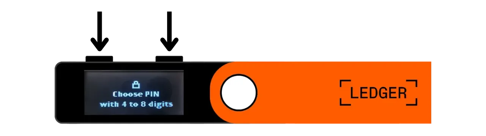
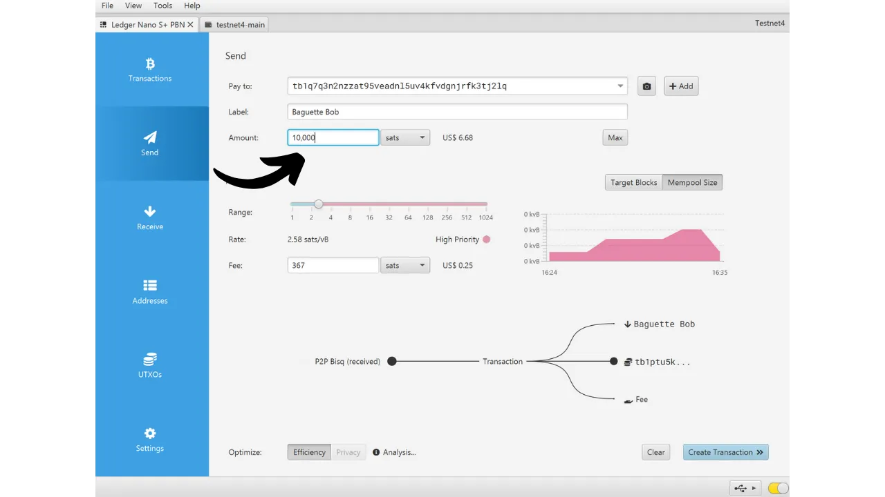
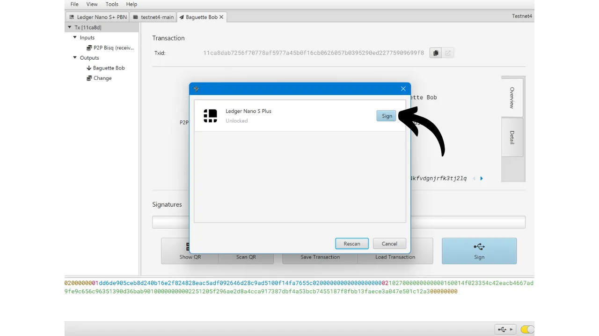

Eine Hardware-Wallet ist ein elektronisches Gerät, das speziell für die Verwaltung und Sicherung der privaten Schlüssel einer Bitcoin-Wallet entwickelt wurde. Im Gegensatz zu Software-Wallets (oder Hot Wallets), die auf allgemeinen Computern installiert sind, die oft mit dem Internet verbunden sind, ermöglichen Hardware-Wallets die physische Isolation der privaten Schlüssel, wodurch das Risiko von Hacking und Diebstahl verringert wird.

Das Hauptziel einer Hardware-Wallet ist es, die Funktionalitäten des Geräts so weit wie möglich zu minimieren, um seine Angriffsfläche zu reduzieren. Eine kleinere Angriffsfläche bedeutet auch weniger potenzielle Angriffsvektoren, d. h. weniger Schwachstellen im System, die Angreifer ausnutzen könnten, um auf Bitcoins zuzugreifen.

Es wird empfohlen, eine Hardware-Wallet zu verwenden, um Ihre Bitcoins zu sichern, insbesondere wenn Sie bedeutende Mengen halten, sei es im absoluten Wert oder als Anteil an Ihren Gesamtvermögen.

Hardware-Wallets werden in Kombination mit einer Wallet-Verwaltungssoftware auf einem Computer oder Smartphone verwendet. Diese Software verwaltet die Erstellung von Transaktionen, aber die kryptografische Signatur, die notwendig ist, um diese Transaktionen zu validieren, erfolgt nur innerhalb der Hardware-Wallet. Das bedeutet, dass die privaten Schlüssel nie einer potenziell gefährdeten Umgebung ausgesetzt sind.

Hardware-Wallets bieten dem Benutzer einen doppelten Schutz: einerseits sichern sie Ihre Bitcoins gegen Fernangriffe, indem sie die privaten Schlüssel offline halten, und andererseits bieten sie in der Regel eine bessere physische Widerstandsfähigkeit gegen Versuche, die Schlüssel zu extrahieren. Und genau anhand dieser 2 Sicherheitskriterien kann man die verschiedenen auf dem Markt erhältlichen Modelle beurteilen und einordnen.

In diesem Tutorial schlage ich vor, eine dieser Lösungen zu entdecken: den **Ledger Nano S Plus**.

## Einführung in den Ledger Nano S Plus

Der Ledger Nano S Plus ist eine Hardware-Wallet, die von der französischen Firma Ledger produziert wird und zu einem Preis von 79 € vermarktet wird.

Der Nano S Plus ist mit einem CC EAL6+ zertifizierten Chip ("*secure element*") ausgestattet, der Ihnen einen fortgeschrittenen Schutz gegen physische Angriffe auf die Hardware bietet. Der Bildschirm und die Tasten werden direkt von diesem Chip gesteuert. Ein oft geäußerter Kritikpunkt ist, dass der Code dieses Chips nicht Open-Source ist, was ein gewisses Vertrauen in die Integrität dieser Komponente erfordert. Nichtsdestotrotz wird dieses Element von unabhängigen Experten geprüft.

In Bezug auf die Nutzung funktioniert der Ledger Nano S Plus ausschließlich über eine verkabelte USB-C-Verbindung.

Ledger hebt sich von seinen Konkurrenten durch seine immer sehr schnelle Adoption neuer Bitcoin-Funktionen ab, wie zum Beispiel Taproot oder Miniscript, was sehr geschätzt wird.
Nach dem Testen finde ich, dass der Ledger Nano S Plus eine ausgezeichnete Hardware-Wallet für Einsteiger ist. Er bietet ein hohes Maß an Sicherheit zu einem vernünftigen Preis. Sein Hauptnachteil im Vergleich zu anderen Geräten in derselben Preisklasse ist die Tatsache, dass der Firmware-Code nicht Open-Source ist. Außerdem ist der Bildschirm des Nano S Plus relativ klein im Vergleich zu teureren Modellen, wie dem Ledger Flex oder dem Coldcard Q1. Dennoch ist seine Schnittstelle sehr gut gestaltet: Trotz seiner zwei Tasten und des kleinen Bildschirms bleibt er leicht zu bedienen, einschließlich für fortgeschrittene Funktionen wie die BIP39-Passphrase. Der Ledger Nano S Plus hat keine Batterie, keine Air-gap-Verbindung, keine Kamera und keinen Micro-SD-Port, aber das ist für diese Preisklasse ganz normal.
Meiner Meinung nach ist der Ledger Nano S Plus eine gute Option, um Ihr Bitcoin-Wallet zu sichern, und eignet sich sowohl für Anfänger als auch für fortgeschrittene Nutzer. In dieser Preisklasse bevorzuge ich jedoch persönlich den Trezor Safe 3, der ungefähr die gleichen Optionen bietet. Der Vorteil von Trezor liegt meiner Ansicht nach in der Verwaltung seines Sicherheitselements: Die mnemonische Phrase und die Schlüssel werden ausschließlich durch Open-Source-Code verwaltet, profitieren aber dennoch vom Schutz des Chips. Der Nachteil von Trezor ist, dass sie manchmal sehr langsam bei der Implementierung neuer Funktionen sind, im Gegensatz zu Ledger.
## Wie kauft man einen Ledger Nano S Plus?

Der Ledger Nano S Plus ist [auf der offiziellen Website](https://shop.ledger.com/products/ledger-nano-s-plus) zum Verkauf verfügbar. Um ihn in einem physischen Geschäft zu kaufen, können Sie auch [die Liste der zertifizierten Wiederverkäufer](https://www.ledger.com/reseller) auf der Ledger-Website finden.

## Voraussetzungen

Sobald Sie Ihren Ledger Nano erhalten haben, ist der erste Schritt, die Verpackung zu überprüfen, um sicherzustellen, dass sie nicht geöffnet wurde. Wenn sie beschädigt ist, könnte dies darauf hinweisen, dass das Hardware-Wallet kompromittiert wurde und möglicherweise nicht authentisch ist.

Beim Öffnen sollten Sie die folgenden Gegenstände in der Box finden:
- Den Ledger Nano S Plus;
- Ein USB-C auf USB-A Kabel;
- Eine Bedienungsanleitung;
- Karten zum Aufschreiben Ihrer mnemonischen Phrase.

Für dieses Tutorial benötigen Sie 2 Softwareanwendungen: Ledger Live, um den Ledger zu initialisieren, und Sparrow Wallet, um Ihr Bitcoin-Wallet zu verwalten. Laden Sie [Ledger Live](https://www.ledger.com/ledger-live) und [Sparrow Wallet](https://sparrowwallet.com/download/) von ihren offiziellen Websites herunter.

Für diese beiden Softwareprogramme empfehle ich dringend, sowohl ihre Authentizität (mit GnuPG) als auch ihre Integrität (über den Hash) zu überprüfen, bevor Sie sie auf Ihrem Gerät installieren. Wenn Sie nicht sicher sind, wie das geht, können Sie diesem anderen Tutorial folgen:
https://planb.network/tutorials/others/integrity-authenticity

## Wie initialisiert man einen Ledger Nano?

Verbinden Sie Ihren Nano mit Ihrem Computer, auf dem Ledger Live und Sparrow Wallet installiert sind. Um auf Ihrem Ledger zu navigieren, verwenden Sie die linke Taste, um nach links zu gehen, und die rechte Taste, um nach rechts zu gehen. Um eine Option auszuwählen oder zu bestätigen, drücken Sie beide Tasten gleichzeitig.

Blättern Sie durch die verschiedenen Einführungsseiten und klicken Sie dann auf die 2 Tasten, um zu beginnen.

Wählen Sie die Option "*Setup as a new device*".

Wählen Sie den PIN-Code, der verwendet wird, um Ihren Ledger zu entsperren. Dies ist also ein Schutz gegen unbefugten physischen Zugriff. Dieser PIN-Code spielt keine Rolle bei der Ableitung der kryptografischen Schlüssel Ihres Wallets. Somit können Sie auch ohne Zugang zu diesem PIN-Code mit Ihrer 24-Wort-mnemonischen Phrase wieder Zugang zu Ihren Bitcoins erhalten.

Es wird empfohlen, einen 8-stelligen PIN zu wählen, so zufällig wie möglich. Stellen Sie außerdem sicher, dass Sie diesen Code an einem anderen Ort als dort, wo Ihr Ledger Nano S Plus aufbewahrt wird, speichern (zum Beispiel in einem Passwort-Manager).

Verwenden Sie die Tasten, um über die Ziffern zu fahren, und wählen Sie jede Ziffer aus, indem Sie beide Tasten gleichzeitig drücken.

Geben Sie Ihren PIN ein zweites Mal ein, um ihn zu bestätigen.
Ihr Nano gibt Anweisungen, wie Sie Ihre Wiederherstellungsphrase verwalten können.

**Diese mnemonische Phrase gewährt vollen und uneingeschränkten Zugang zu all Ihren Bitcoins**. Jeder, der im Besitz dieser Phrase ist, kann Ihre Gelder stehlen, selbst ohne physischen Zugang zu Ihrem Ledger. Die 24-Wort-Phrase ermöglicht es Ihnen, den Zugang zu Ihren Bitcoins im Falle eines Verlusts, Diebstahls oder einer Beschädigung Ihres Ledger Nano wiederherzustellen. Es ist daher sehr wichtig, sie sorgfältig zu sichern und an einem sicheren Ort aufzubewahren.

Sie können sie auf dem mit Ihrem Ledger gelieferten Kartonpapier notieren oder, für mehr Sicherheit, empfehle ich, sie in ein Edelstahlmedium zu gravieren, um sie vor den Risiken von Feuern, Überschwemmungen oder Einstürzen zu schützen.

Sie können diese Anweisungen durchblättern und Seiten überspringen, indem Sie den rechten Knopf klicken.

Der Ledger wird Ihre mnemonische Phrase mit seinem Zufallszahlengenerator erstellen. Stellen Sie sicher, dass Sie während dieser Operation nicht beobachtet werden. Schreiben Sie die Wörter, die der Ledger bereitstellt, auf das physische Medium Ihrer Wahl. Abhängig von Ihrer Sicherheitsstrategie könnten Sie in Erwägung ziehen, mehrere vollständige physische Kopien der Phrase anzufertigen (aber wichtig ist, sie nicht aufzuteilen). Es ist entscheidend, die Wörter nummeriert und in sequenzieller Reihenfolge zu halten.
***Offensichtlich sollten Sie diese Wörter niemals im Internet teilen, im Gegensatz zu dem, was ich in diesem Tutorial mache. Dieses Beispiel-Wallet wird nur im Testnet verwendet und nach dem Tutorial gelöscht.***

Um zu den nächsten Wörtern zu gelangen, klicken Sie den rechten Knopf.

Sobald alle Wörter notiert sind, klicken Sie die 2 Knöpfe, um zum nächsten Schritt zu gelangen.

Klicken Sie auf die beiden Knöpfe "*Bestätigen Sie Ihre Wiederherstellungsphrase*", dann wählen Sie die Wörter Ihrer mnemonischen Phrase in ihrer Reihenfolge, um zu bestätigen, dass Sie sie korrekt notiert haben. Verwenden Sie die linken und rechten Knöpfe, um zwischen den Optionen zu navigieren, dann wählen Sie das korrekte Wort, indem Sie die 2 Knöpfe klicken. Fahren Sie mit diesem Verfahren fort, bis zum 24. Wort.

Wenn die Phrase, die Sie bestätigen, genau der entspricht, die der Ledger Ihnen im vorherigen Schritt bereitgestellt hat, können Sie fortfahren. Wenn nicht, deutet dies darauf hin, dass Ihre physische Sicherungskopie der mnemonischen Phrase falsch ist, und Sie müssen den Prozess neu starten.

Und da haben Sie es, Ihr Seed wurde korrekt auf Ihrem Ledger Nano S Plus erstellt. Bevor wir fortfahren, um ein neues Bitcoin-Wallet aus diesem Seed zu erstellen, lassen Sie uns gemeinsam die Geräteeinstellungen erkunden.

## Wie ändert man die Einstellungen Ihres Ledger?

Um auf die Einstellungen zuzugreifen, halten Sie die 2 Knöpfe einige Sekunden lang gedrückt.

Klicken Sie auf das Menü "*Einstellungen*".

Und wählen Sie "*Allgemein*".

Im Menü "*Sprache*" können Sie die Anzeigesprache ändern.

Im Menü "*Helligkeit*" können Sie die Bildschirmhelligkeit anpassen. Der Rest der allgemeinen Einstellungen interessiert uns vorerst nicht.

Jetzt gehen Sie zum Abschnitt der "*Sicherheits*"einstellungen.
"*PIN ändern*" ermöglicht es Ihnen, Ihren PIN-Code zu ändern. 
"*Passphrase*" ermöglicht es Ihnen, eine BIP39-Passphrase einzurichten. Die Passphrase ist ein optionales Passwort, das in Kombination mit Ihrer Wiederherstellungsphrase eine zusätzliche Sicherheitsebene für Ihre Wallet bietet.

Derzeit wird Ihre Wallet aus einer mnemonischen Phrase generiert, die aus 24 Wörtern besteht. Diese Wiederherstellungsphrase ist sehr wichtig, da sie es Ihnen ermöglicht, alle Schlüssel Ihrer Wallet im Falle eines Verlustes wiederherzustellen. Allerdings stellt sie einen einzigen Ausfallpunkt (Single Point of Failure, SPOF) dar. Wenn sie kompromittiert wird, sind Ihre Bitcoins in Gefahr. Hier kommt die Passphrase ins Spiel. Es ist ein optionales Passwort, das Sie willkürlich wählen können, das zur mnemonischen Phrase hinzugefügt wird, um die Sicherheit der Wallet zu erhöhen.

Die Passphrase sollte nicht mit dem PIN-Code verwechselt werden. Sie spielt eine Rolle bei der Ableitung Ihrer kryptografischen Schlüssel. Sie arbeitet zusammen mit der mnemonischen Phrase und verändert den Seed, aus dem die Schlüssel generiert werden. Somit kann selbst, wenn jemand Ihre 24-Wort-Phrase erhält, ohne die Passphrase nicht auf Ihre Mittel zugreifen. Die Verwendung einer Passphrase erstellt im Wesentlichen eine neue Wallet mit unterschiedlichen Schlüsseln. Eine Änderung (selbst eine geringfügige) der Passphrase wird eine andere Wallet generieren.

Die Passphrase ist ein sehr mächtiges Werkzeug, um die Sicherheit Ihrer Bitcoins zu erhöhen. Es ist jedoch sehr wichtig zu verstehen, wie sie funktioniert, bevor sie implementiert wird, um den Zugang zu Ihrer Wallet nicht zu verlieren. Deshalb rate ich Ihnen, dieses andere Tutorial zu konsultieren, wenn Sie eine Passphrase auf Ihrem Ledger einrichten möchten:

https://planb.network/tutorials/wallet/passphrase-ledger

Das Menü "*PIN-Sperre*" ermöglicht es Ihnen, die automatische Sperrung Ihres Ledger nach einer bestimmten Zeit der Inaktivität zu konfigurieren und zu aktivieren.

Das Menü "*Bildschirmschoner*" ermöglicht es Ihnen, den Schlafmodus Ihres Ledger Nano einzustellen. Beachten Sie, dass der Bildschirmschoner keine PIN-Eingabe beim Aufwachen erfordert, es sei denn, die Option "*PIN-Sperre*" ist aktiviert, um mit dem Schlafmodus zu korrespondieren. Diese Funktion ist besonders nützlich für Ledger Nano X-Geräte mit Batterie, um ihren Energieverbrauch zu reduzieren.

Schließlich ermöglicht Ihnen das Menü "*Gerät zurücksetzen*", Ihren Ledger zurückzusetzen. Führen Sie diesen Reset nur durch, wenn Sie sicher sind, dass er keine Schlüssel enthält, die Bitcoins sichern, da Sie sonst dauerhaft den Zugang zu Ihren Mitteln verlieren könnten. Diese Option kann nützlich sein, um einen leeren Wiederherstellungstest durchzuführen, aber darüber werde ich später noch ein wenig mehr sprechen.

## Wie installiert man die Bitcoin-Anwendung?

Beginnen Sie damit, die Ledger Live-Software auf Ihrem Computer zu starten, dann verbinden und entsperren Sie Ihren Ledger Nano. Gehen Sie in Ledger Live zum Menü "*Mein Ledger*". Ihnen wird dann der Zugriff auf Ihr Nano angefordert.

Bestätigen Sie den Zugriff auf Ihrem Ledger, indem Sie auf die beiden Tasten klicken.

Stellen Sie zunächst in Ledger Live sicher, dass der "*Echtheitscheck*" erscheint. Dies bestätigt, dass Ihr Gerät authentisch ist.

Wenn die Firmware Ihres Ledger Nano nicht auf dem neuesten Stand ist, wird Ledger Live automatisch anbieten, sie zu aktualisieren. Klicken Sie bei Bedarf auf "*Firmware aktualisieren*", dann auf "*Update installieren*", um die Installation zu starten. Auf Ihrem Ledger klicken Sie auf die beiden Tasten, um zu bestätigen, und warten dann während der Installation.
Schließlich werden wir die Bitcoin-Anwendung hinzufügen. Um dies zu tun, klicken Sie in Ledger Live auf den Button "*Installieren*" neben "*Bitcoin (BTC)*".

Die Anwendung wird auf Ihrem Nano installiert.

Von nun an benötigen Sie die Ledger Live Software nicht mehr für die regelmäßige Verwaltung Ihrer Wallet. Sie können gelegentlich darauf zurückkommen, um das Firmware-Update durchzuführen, wenn neue Versionen verfügbar sind. Für alles andere werden wir Sparrow Wallet verwenden, das ein viel umfassenderes Werkzeug für die effektive Verwaltung einer Bitcoin-Wallet ist.

## Wie richtet man eine neue Bitcoin-Wallet mit Sparrow ein?

Öffnen Sie Sparrow Wallet und überspringen Sie die Einführungsseiten, um zum Startbildschirm zu gelangen. Überprüfen Sie, ob Sie korrekt mit einem Node verbunden sind, indem Sie den Schalter unten rechts auf dem Bildschirm beobachten.

Ich empfehle dringend, Ihren eigenen Bitcoin-Node zu verwenden. In diesem Tutorial verwende ich einen öffentlichen Node (gelb), weil ich im Testnet bin, aber für den normalen Gebrauch ist es besser, einen lokalen Bitcoin Core (grün) oder einen Electrum-Server zu wählen, der mit einem Remote-Node (blau) verbunden ist.

Klicken Sie auf das Menü "*Datei*" und dann auf "*Neue Wallet*".

Wählen Sie einen Namen für diese Wallet und klicken Sie dann auf "*Wallet erstellen*".

Im Dropdown-Menü "*Script Type*" wählen Sie den Typ des Scripts, das verwendet wird, um Ihre Bitcoins zu sichern. Ich empfehle, "*Taproot*" zu wählen, oder falls nicht verfügbar, "*Native SegWit*".

Klicken Sie auf den Button "*Verbundene Hardware-Wallet*".

Wenn Sie dies noch nicht getan haben, verbinden Sie Ihren Ledger Nano S Plus mit dem Computer, entsperren Sie ihn mit Ihrem PIN-Code und öffnen Sie dann die "*Bitcoin*" Anwendung, indem Sie einmal auf das Bitcoin-Logo klicken.

*In diesem Tutorial verwende ich die Bitcoin Testnet-Anwendung, aber das Verfahren bleibt für das Hauptnetz dasselbe.*

Klicken Sie in Sparrow auf den Button "*Scannen*".

Dann klicken Sie auf "*Keystore importieren*".

Nun können Sie die Details Ihrer Wallet sehen, einschließlich des erweiterten öffentlichen Schlüssels Ihres ersten Kontos. Klicken Sie auf den Button "*Anwenden*", um die Erstellung der Wallet abzuschließen.

Wählen Sie ein starkes Passwort, um den Zugang zu Sparrow Wallet zu sichern. Dieses Passwort gewährleistet die Sicherheit des Zugangs zu Ihren Wallet-Daten auf Sparrow, was hilft, Ihre öffentlichen Schlüssel, Adressen, Bezeichnungen und Transaktionshistorie gegen unbefugten Zugriff zu schützen.

Ich rate Ihnen, dieses Passwort in einem Passwort-Manager zu speichern, damit Sie es nicht vergessen.

Und voilà, Ihre Wallet ist jetzt erstellt!

Bevor Sie Ihre ersten Bitcoins in Ihrem Wallet erhalten, **rate ich Ihnen dringend, einen Trockenlauf-Wiederherstellungstest durchzuführen**. Notieren Sie sich ein Referenzstück Information, wie zum Beispiel Ihren xpub, setzen Sie dann Ihr Ledger Nano zurück, während das Wallet noch leer ist. Versuchen Sie danach, Ihr Wallet auf dem Ledger mit Ihren Papier-Backups wiederherzustellen. Überprüfen Sie, ob der nach der Wiederherstellung generierte xpub mit dem ursprünglich notierten übereinstimmt. Wenn ja, können Sie sicher sein, dass Ihre Papier-Backups zuverlässig sind.
Um mehr darüber zu erfahren, wie man einen Wiederherstellungstest durchführt, rate ich Ihnen, dieses andere Tutorial zu konsultieren:

https://planb.network/tutorials/wallet/recovery-test

## Wie empfängt man Bitcoins mit dem Ledger Nano?

Klicken Sie auf den Tab "*Empfangen*".

Verbinden Sie Ihr Ledger Nano S Plus mit dem Computer, entsperren Sie es mit Ihrem PIN-Code und öffnen Sie dann die Anwendung "*Bitcoin*".

Bevor Sie die von Sparrow Wallet bereitgestellte Adresse verwenden, überprüfen Sie sie auf dem Bildschirm Ihres Ledgers. Diese Praxis ermöglicht es Ihnen zu bestätigen, dass die auf Sparrow angezeigte Adresse nicht betrügerisch ist und dass das Hardware-Wallet tatsächlich den privaten Schlüssel besitzt, der notwendig ist, um die mit dieser Adresse gesicherten Bitcoins später auszugeben. Dies hilft Ihnen, mehrere Arten von Angriffen zu vermeiden.
Um diese Überprüfung durchzuführen, klicken Sie auf den Button "*Adresse anzeigen*".

Stellen Sie sicher, dass die auf Ihrem Ledger angezeigte Adresse mit der auf Sparrow Wallet angegebenen übereinstimmt. Es wird auch empfohlen, diese Überprüfung unmittelbar vor der Weitergabe Ihrer Adresse an den Absender durchzuführen, um deren Gültigkeit sicherzustellen. Sie können die Tasten verwenden, um die vollständige Adresse anzuzeigen.

Klicken Sie dann auf "*Genehmigen*", wenn die Adressen tatsächlich identisch sind.

Sie können ein "*Label*" hinzufügen, um die Quelle der Bitcoins zu beschreiben, die mit dieser Adresse gesichert werden. Dies ist eine gute Praxis, die Ihnen hilft, Ihre UTXOs besser zu verwalten.

Für weitere Informationen zum Labeling rate ich Ihnen auch, dieses andere Tutorial zu konsultieren:

https://planb.network/tutorials/privacy/utxo-labelling

Sie können dann diese Adresse verwenden, um Bitcoins zu empfangen.

## Wie sendet man Bitcoins mit dem Ledger Nano?

Jetzt, da Sie Ihre ersten Sats in Ihrem mit dem Nano S Plus gesicherten Wallet erhalten haben, können Sie sie auch ausgeben! Verbinden Sie Ihr Ledger mit Ihrem Computer, entsperren Sie es, starten Sie Sparrow Wallet und gehen Sie dann zum Tab "*Senden*", um eine neue Transaktion zu erstellen.

Wenn Sie "*Coin Control*" durchführen möchten, also speziell auswählen möchten, welche UTXOs in der Transaktion verbraucht werden sollen, gehen Sie zum Tab "*UTXOs*". Wählen Sie die UTXOs aus, die Sie ausgeben möchten, und klicken Sie dann auf "*Ausgewählte senden*". Sie werden zum gleichen Bildschirm des Tabs "*Senden*" weitergeleitet, aber mit Ihren UTXOs bereits für die Transaktion ausgewählt.

Geben Sie die Zieladresse ein. Sie können auch mehrere Adressen eingeben, indem Sie auf den Button "*+ Hinzufügen*" klicken.

Notieren Sie ein "*Label*", um sich an den Zweck dieser Ausgabe zu erinnern.

Wählen Sie den Betrag, der an diese Adresse gesendet wird.

Passen Sie die Transaktionsgebühr entsprechend dem aktuellen Marktpreis an.

Stellen Sie sicher, dass alle Einstellungen Ihrer Transaktion korrekt sind, und klicken Sie dann auf "*Transaktion erstellen*".

Wenn alles für Sie gut aussieht, klicken Sie auf "*Transaktion zum Signieren fertigstellen*".

Klicken Sie auf "*Signieren*".

Klicken Sie neben Ihrem Ledger Nano S Plus auf "*Signieren*".

Überprüfen Sie die Transaktionseinstellungen auf dem Bildschirm Ihres Ledger, einschließlich der Empfangsadresse des Empfängers, des gesendeten Betrags und des Gebührenbetrags.

Wenn alles für Sie gut aussieht, drücken Sie die beiden Tasten auf "*Transaktion signieren*", um zu signieren.

Ihre Transaktion ist jetzt signiert. Überprüfen Sie noch einmal, ob alles für Sie gut aussieht, und klicken Sie dann auf "*Transaktion senden*", um sie im Bitcoin-Netzwerk zu verbreiten.

Sie finden sie im Tab "*Transaktionen*" von Sparrow Wallet.

Herzlichen Glückwunsch, Sie sind jetzt mit der Grundnutzung des Ledger Nano S Plus mit Sparrow Wallet vertraut! In einem zukünftigen Tutorial werden wir sehen, wie man den Ledger mit Liana verwendet, um Miniscript zu nutzen.

Wenn Sie dieses Tutorial hilfreich fanden, würde ich mich über ein Daumen hoch unten freuen. Fühlen Sie sich frei, diesen Artikel in Ihren sozialen Netzwerken zu teilen. Vielen Dank!

Ich empfehle Ihnen auch, dieses komplette Tutorial über den Ledger Flex zu lesen:

https://planb.network/tutorials/wallet/ledger-flex