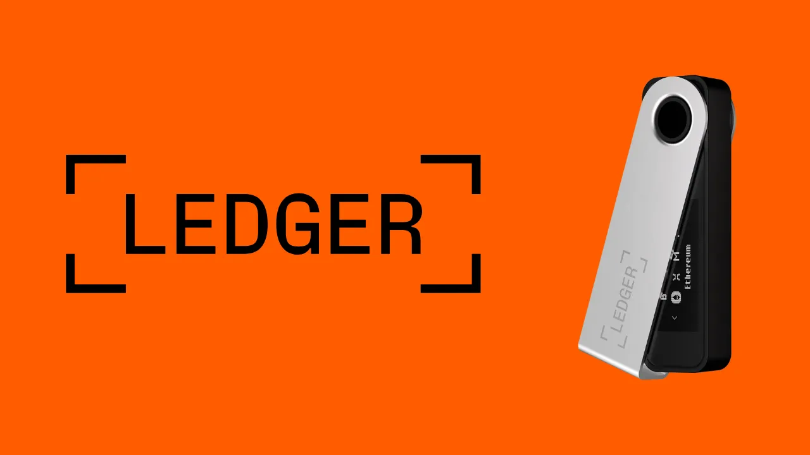
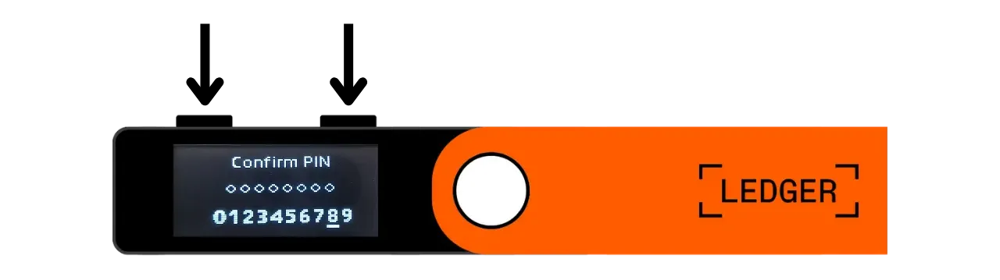
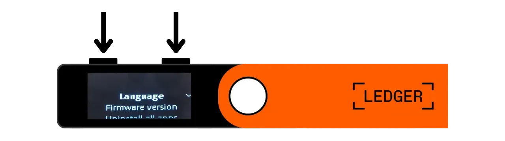
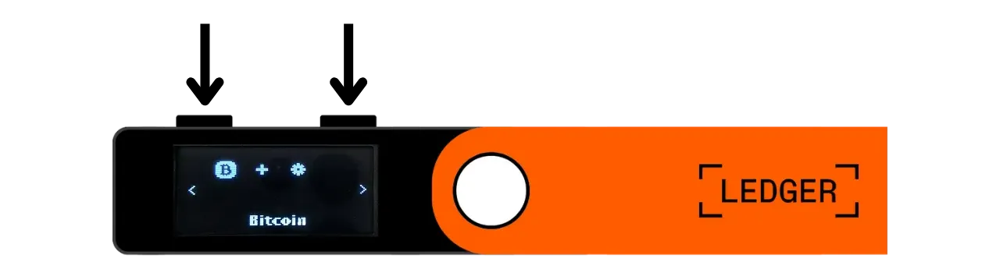
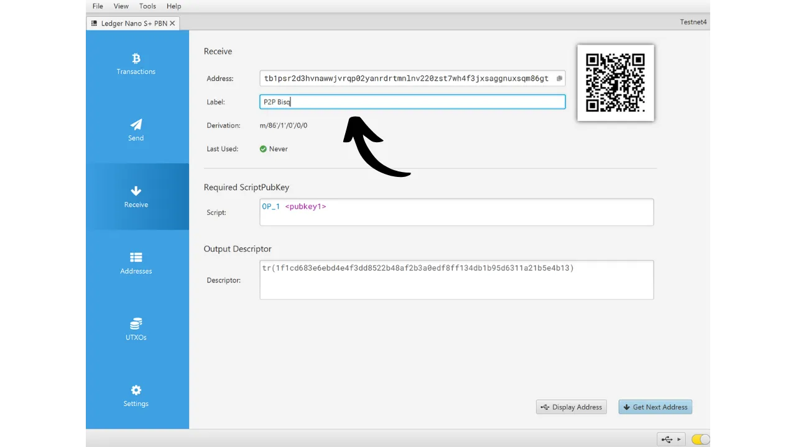

A hardware wallet is an electronic device dedicated to managing and securing the private keys of a Bitcoin wallet. Unlike software wallets (or hot wallets) installed on general-purpose machines often connected to the Internet, hardware wallets allow for the physical isolation of private keys, reducing the risks of hacking and theft.

The main goal of a hardware wallet is to minimize the device's functionalities as much as possible to reduce its attack surface. A smaller attack surface also means fewer potential attack vectors, i.e., fewer weaknesses in the system that attackers could exploit to access bitcoins.

It is recommended to use a hardware wallet to secure your bitcoins, especially if you hold significant amounts, whether in absolute value or as a proportion of your total assets.

Hardware wallets are used in combination with a wallet management software on a computer or smartphone. This software manages the creation of transactions, but the cryptographic signature necessary to validate these transactions is done only within the hardware wallet. This means that the private keys are never exposed to a potentially vulnerable environment.

Hardware wallets offer dual protection for the user: on one hand, they secure your bitcoins against remote attacks by keeping the private keys offline, and on the other hand, they generally offer better physical resistance against attempts to extract the keys. And it is precisely on these 2 security criteria that one can judge and rank the different models available on the market.

In this tutorial, I propose to discover one of these solutions: the **Ledger Nano S Plus**.

## Introduction to the Ledger Nano S Plus

The Ledger Nano S Plus is a hardware wallet produced by the French company Ledger, marketed at a price of 79 €.

The Nano S Plus is equipped with a CC EAL6+ certified chip ("*secure element*"), which offers you advanced protection against physical attacks on the hardware. The screen and buttons are directly controlled by this chip. A point of criticism often raised is that the code of this chip is not open-source, which requires a certain trust in the integrity of this component. Nevertheless, this element is audited by independent experts.

In terms of usage, the Ledger Nano S Plus operates solely through a wired USB-C connection.

Ledger stands out from its competitors by its always very rapid adoption of new Bitcoin features, such as Taproot or Miniscript, for example, which is highly appreciated.
After testing it, I find that the Ledger Nano S Plus is an excellent entry-level hardware wallet. It offers a high level of security for a reasonable price. Its main disadvantage compared to other devices in the same price range is the fact that the firmware code is not open-source. Also, the screen of the Nano S Plus is relatively small compared to more expensive models, such as the Ledger Flex or the Coldcard Q1. Nonetheless, its interface is very well designed: despite its two buttons and small screen, it remains easy to use, including for advanced features such as the BIP39 passphrase. The Ledger Nano S Plus does not have a battery, Air-gap connection, camera, or micro SD port, but this is quite normal for this price range.

In my opinion, the Ledger Nano S Plus is a good option for securing your Bitcoin wallet, and is suitable for both beginners and intermediate users. However, in this price range, I personally prefer the Trezor Safe 3, which offers roughly the same options. The advantage of Trezor, in my view, is in the management of its secure element: the mnemonic phrase and keys are managed exclusively by open-source code, yet still benefit from the protection of the chip. The disadvantage of Trezor is that they are sometimes very slow in implementing new features unlike Ledger.

## How to buy a Ledger Nano S Plus?

The Ledger Nano S Plus is available for sale [on the official website](https://shop.ledger.com/products/ledger-nano-s-plus). To buy it in a physical store, you can also find [the list of certified resellers](https://www.ledger.com/reseller) on the Ledger website.

## Prerequisites

Once you have received your Ledger Nano, the first step is to check the packaging to ensure it has not been opened. If it is damaged, this could indicate that the hardware wallet has been compromised and might not be authentic.

Upon opening, you should find the following items in the box:
- The Ledger Nano S Plus;
- A USB-C to USB-A cable;
- A user manual;
- Cards to write down your mnemonic phrase.

For this tutorial, you will need 2 software applications: Ledger Live to initialize the Ledger, and Sparrow Wallet to manage your Bitcoin wallet. Download [Ledger Live](https://www.ledger.com/ledger-live) and [Sparrow Wallet](https://sparrowwallet.com/download/) from their official websites.

For these two software programs, I strongly recommend checking both their authenticity (with GnuPG) and their integrity (via the hash) before installing them on your machine. If you're not sure how to do this, you can follow this other tutorial:
https://planb.network/tutorials/others/integrity-authenticity

## How to Initialize a Ledger Nano?

Connect your Nano to your computer where Ledger Live and Sparrow Wallet are installed. To navigate on your Ledger, use the left button to go left and the right button to go right. To select or confirm an option, press both buttons simultaneously.

Scroll through the different introduction pages and then click on the 2 buttons to begin.

Select the option "*Setup as a new device*".

Choose the PIN code that will be used to unlock your Ledger. This is therefore a protection against unauthorized physical access. This PIN code does not play a part in the derivation of your wallet's cryptographic keys. Thus, even without access to this PIN code, having your 24-word mnemonic phrase will allow you to regain access to your bitcoins.

It is recommended to choose an 8-digit PIN, as random as possible. Also, make sure to save this code in a different place from where your Ledger Nano S Plus is stored (for example, in a password manager).

Use the buttons to move over the digits, then select each digit by clicking both buttons simultaneously.

Enter your PIN a second time to confirm it.

Your Nano provides instructions on how to manage your recovery phrase.

**This mnemonic phrase gives full and unrestricted access to all your bitcoins**. Anyone in possession of this phrase can steal your funds, even without physical access to your Ledger. The 24-word phrase allows you to restore access to your bitcoins in case of loss, theft, or damage to your Ledger Nano. It is therefore very important to carefully save and store it in a secure location.

You can write it down on the cardboard paper provided with your Ledger, or for more security, I recommend engraving it on a stainless steel medium to protect against the risks of fires, floods, or collapses.

You can browse these instructions and skip pages by clicking the right button.

The Ledger will create your mnemonic phrase using its random number generator. Make sure you are not being observed during this operation. Write down the words provided by the Ledger on the physical medium of your choice. Depending on your security strategy, you might consider making several complete physical copies of the phrase (but importantly, do not split it). It is crucial to keep the words numbered and in sequential order.
***Obviously, you should never share these words on the internet, contrary to what I am doing in this tutorial. This example wallet will be used only on the Testnet and will be deleted after the tutorial.***

To move to the next words, click the right button.

Once all the words are noted, click the 2 buttons to move to the next step.

Click on the two buttons "*Confirm your Recovery phrase*", then select the words of your mnemonic phrase in their order to confirm that you have noted them correctly. Use the left and right buttons to navigate between the options, then select the correct word by clicking the 2 buttons. Continue this procedure until the 24th word.

If the phrase you are confirming matches exactly the one the Ledger provided you in the previous step, you can proceed. If not, it indicates that your physical backup of the mnemonic phrase is incorrect, and you need to restart the process.

And there you have it, your seed has been correctly created on your Ledger Nano S Plus. Before proceeding to create a new Bitcoin wallet from this seed, let's explore the device settings together.

## How to modify the settings of your Ledger?

To access the settings, hold down the 2 buttons for a few seconds.

Click on the "*Settings*" menu.

And choose "*General*".

In the "*Language*" menu, you can change the display language.

In the "*Brightness*" menu, you can adjust the screen brightness. We are not interested in the rest of the general settings for now.

Now, go to the "*Security*" settings section.

"*Change PIN*" allows you to change your PIN code.

"*Passphrase*" allows you to set up a BIP39 passphrase. The passphrase is an optional password that, combined with your recovery phrase, provides an additional layer of security for your wallet.

Currently, your wallet is generated from a mnemonic phrase consisting of 24 words. This recovery phrase is very important because it allows you to restore all the keys of your wallet in case of loss. However, it constitutes a single point of failure (SPOF). If it is compromised, your bitcoins are in danger. This is where the passphrase comes in. It's an optional password, which you can choose arbitrarily, that adds to the mnemonic phrase to enhance the wallet's security.

The passphrase should not be confused with the PIN code. It plays a role in the derivation of your cryptographic keys. It works in tandem with the mnemonic phrase, altering the seed from which the keys are generated. Thus, even if someone obtains your 24-word phrase, without the passphrase, they cannot access your funds. Using a passphrase essentially creates a new wallet with distinct keys. Modifying (even slightly) the passphrase will generate a different wallet.

The passphrase is a very powerful tool for enhancing the security of your bitcoins. However, it is very important to understand how it works before implementing it, to avoid losing access to your wallet. This is why I advise you to consult this other tutorial dedicated if you wish to set up a passphrase on your Ledger:

https://planb.network/tutorials/wallet/passphrase-ledger

The "*PIN lock*" menu allows you to configure and activate the automatic locking of your Ledger after a determined period of inactivity.

The "*Screen saver*" menu allows you to adjust the sleep mode of your Ledger Nano. Note that the screen saver does not require PIN entry upon waking, unless the "*PIN lock*" option is activated to correspond with sleep mode. This feature is especially useful for Ledger Nano X devices equipped with a battery, to reduce their energy consumption.

Finally, the "*Reset device*" menu allows you to reset your Ledger. Only proceed with this reset if you are certain it does not contain any keys securing bitcoins, as you could permanently lose access to your funds. This option can be useful for performing an empty recovery test, but I will talk about this a bit more later.

## How to Install the Bitcoin Application?

Start by launching the Ledger Live software on your computer, then connect and unlock your Ledger Nano. In Ledger Live, go to the "*My Ledger*" menu. You will be asked to authorize access to your Nano.

Validate access on your Ledger by clicking on the two buttons.

First, on Ledger Live, make sure the "*Genuine check*" appears. This confirms that your device is authentic.

If the firmware of your Ledger Nano is not up to date, Ledger Live will automatically offer to update it. If necessary, click on "*Update firmware*", then on "*Install update*" to start the installation. On your Ledger, click on the two buttons to confirm, then wait during the installation.

Finally, we will add the Bitcoin application. To do this, on Ledger Live, click on the "*Install*" button next to "*Bitcoin (BTC)*".

The application will install on your Nano.

From now on, you will no longer need the Ledger Live software for the regular management of your wallet. You can occasionally return to it to update the firmware when new versions are available. For everything else, we will use Sparrow Wallet, which is a much more comprehensive tool for effectively managing a Bitcoin wallet.

## How to Set Up a New Bitcoin Wallet with Sparrow?

Open Sparrow Wallet and skip the introduction pages to access the home screen. Check that you are correctly connected to a node by observing the switch located at the bottom right of the screen.

I strongly recommend using your own Bitcoin node. In this tutorial, I'm using a public node (yellow) because I'm on the testnet, but for normal use, it's better to opt for a local Bitcoin Core (green) or an Electrum server connected to a remote node (blue).

Click on the "*File*" menu then "*New Wallet*".

Choose a name for this wallet, then click on "*Create Wallet*".

In the "*Script Type*" dropdown menu, select the type of script that will be used to secure your bitcoins. I recommend opting for "*Taproot*", or if not available, "*Native SegWit*".

Click on the "*Connected Hardware Wallet*" button.

If you haven't done so already, connect your Ledger Nano S Plus to the computer, unlock it with your PIN code, and then open the "*Bitcoin*" application by clicking on the 2 buttons once on the Bitcoin logo.

*In this tutorial, I'm using the Bitcoin Testnet application, but the procedure remains the same for the mainnet.*

On Sparrow, click on the "*Scan*" button.

Then click on "*Import Keystore*".

You can now see the details of your wallet, including the extended public key of your first account. Click on the "*Apply*" button to finalize the creation of the wallet.

Choose a strong password to secure access to Sparrow Wallet. This password will ensure the security of access to your wallet data on Sparrow, which helps to protect your public keys, addresses, labels, and transaction history against any unauthorized access.

I advise you to save this password in a password manager so you don't forget it.

And there you have it, your wallet is now created!

Before receiving your first bitcoins in your wallet, **I strongly advise you to perform a dry-run recovery test**. Note down a reference piece of information, such as your xpub, then reset your Ledger Nano while the wallet is still empty. Afterward, try to restore your wallet on the Ledger using your paper backups. Check that the xpub generated after the restoration matches the one you initially noted. If so, you can be assured that your paper backups are reliable.

To learn more about how to perform a recovery test, I advise you to consult this other tutorial:

https://planb.network/tutorials/wallet/recovery-test

## How to receive bitcoins with the Ledger Nano?

Click on the "*Receive*" tab.

Connect your Ledger Nano S Plus to the computer, unlock it with your PIN code, then open the "*Bitcoin*" application.

Before using the address provided by Sparrow Wallet, verify it on your Ledger's screen. This practice allows you to confirm that the address displayed on Sparrow is not fraudulent and that the hardware wallet indeed holds the private key necessary to spend the bitcoins secured with this address later. This helps you avoid several types of attacks.
To perform this verification, click on the "*Display Address*" button.

Ensure that the address displayed on your Ledger matches the one indicated on Sparrow Wallet. It is also recommended to perform this verification just before giving your address to the sender, to be sure of its validity. You can use the buttons to view the full address.

Then click on "*Approve*" if the addresses are indeed identical.

You can add a "*Label*" to describe the source of the bitcoins that will be secured with this address. This is a good practice that helps you manage your UTXOs better.

For more information on labeling, I also advise you to check out this other tutorial:

https://planb.network/tutorials/privacy/utxo-labelling

You can then use this address to receive bitcoins.

## How to send bitcoins with the Ledger Nano?

Now that you have received your first sats in your wallet secured with the Nano S Plus, you can also spend them! Connect your Ledger to your computer, unlock it, launch Sparrow Wallet, and then go to the "*Send*" tab to construct a new transaction.

If you want to do "*coin control*," meaning specifically choose which UTXOs to consume in the transaction, go to the "*UTXOs*" tab. Select the UTXOs you wish to spend, then click on "*Send Selected*". You will be redirected to the same screen of the "*Send*" tab, but with your UTXOs already selected for the transaction.

Enter the destination address. You can also enter multiple addresses by clicking on the "*+ Add*" button.

Note a "*Label*" to remember the purpose of this expenditure.

Choose the amount sent to this address.

Adjust the transaction fee rate according to the current market.

Ensure all the settings of your transaction are correct, then click on "*Create Transaction*".

If everything looks good to you, click on "*Finalize Transaction for Signing*".

Click on "*Sign*".

Click on "*Sign*" next to your Ledger Nano S Plus.

Verify the transaction settings on your Ledger's screen, including the recipient's receiving address, the amount sent, and the fee amount.

If everything looks good to you, press the two buttons on "*Sign transaction*" to sign.

Your transaction is now signed. Double-check everything looks good to you, then click on "*Broadcast Transaction*" to broadcast it on the Bitcoin network.

You can find it in the "*Transactions*" tab of Sparrow Wallet.

Congratulations, you are now up to speed on the basic use of the Ledger Nano S Plus with Sparrow Wallet! In a future tutorial, we will see how to use the Ledger with Liana to leverage Miniscript.

If you found this tutorial helpful, I would appreciate it if you could leave a thumbs up below. Feel free to share this article on your social networks. Thank you very much!

I also recommend you check out this complete tutorial on the Ledger Flex:

https://planb.network/tutorials/wallet/ledger-flex