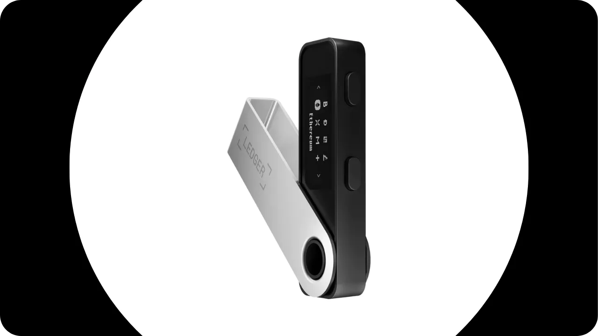
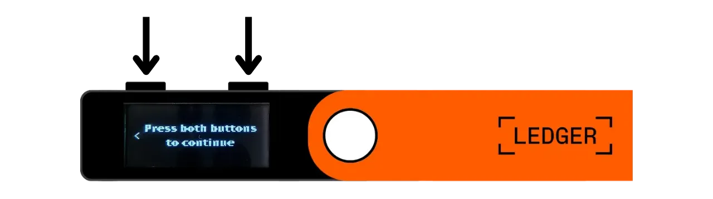
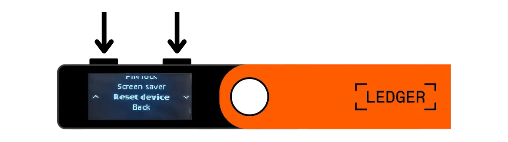
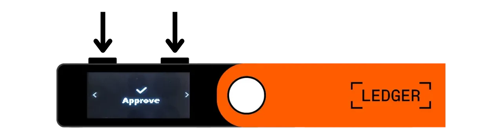
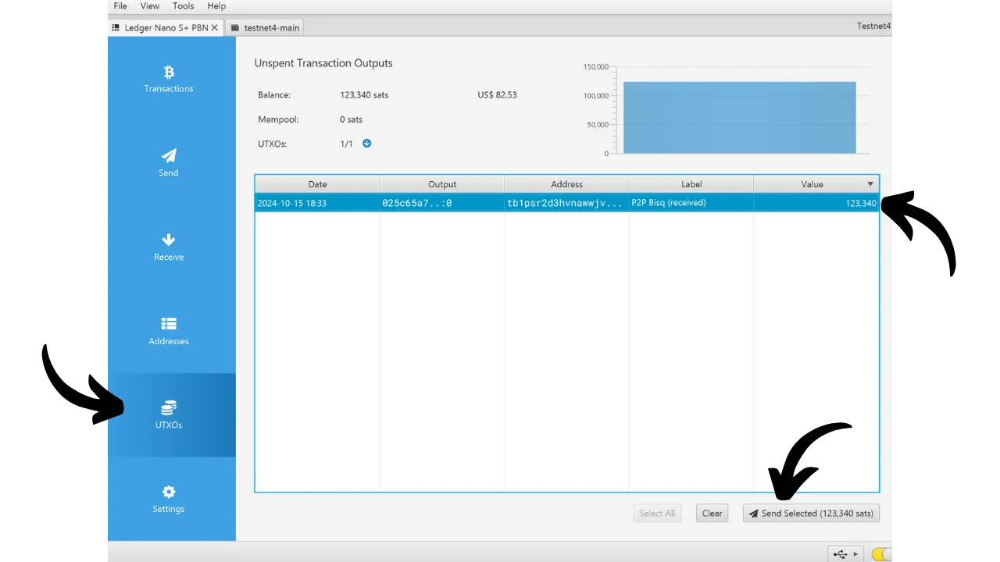
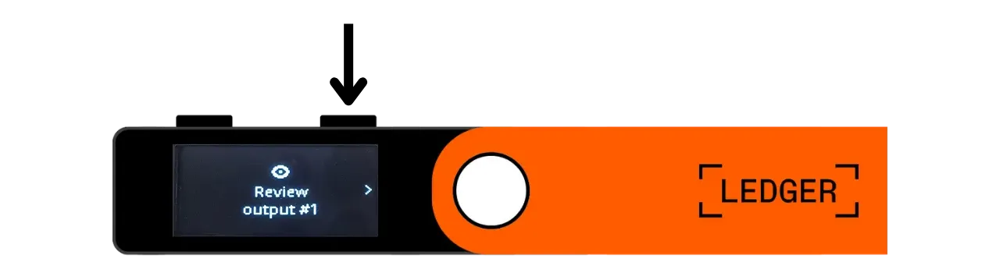

Una cartera de hardware es un dispositivo electrónico dedicado a gestionar y asegurar las claves privadas de una cartera de Bitcoin. A diferencia de las carteras de software (o carteras calientes) instaladas en máquinas de propósito general a menudo conectadas a Internet, las carteras de hardware permiten el aislamiento físico de las claves privadas, reduciendo los riesgos de hackeo y robo.

El objetivo principal de una cartera de hardware es minimizar las funcionalidades del dispositivo tanto como sea posible para reducir su superficie de ataque. Una superficie de ataque más pequeña también significa menos vectores de ataque potenciales, es decir, menos debilidades en el sistema que los atacantes podrían explotar para acceder a los bitcoins.

Se recomienda usar una cartera de hardware para asegurar tus bitcoins, especialmente si posees cantidades significativas, ya sea en valor absoluto o como proporción de tus activos totales.

Las carteras de hardware se utilizan en combinación con un software de gestión de carteras en un ordenador o smartphone. Este software gestiona la creación de transacciones, pero la firma criptográfica necesaria para validar estas transacciones se realiza solo dentro de la cartera de hardware. Esto significa que las claves privadas nunca están expuestas a un entorno potencialmente vulnerable.

Las carteras de hardware ofrecen una doble protección para el usuario: por un lado, aseguran tus bitcoins contra ataques remotos al mantener las claves privadas desconectadas, y por otro lado, generalmente ofrecen una mejor resistencia física contra intentos de extraer las claves. Y es precisamente en estos 2 criterios de seguridad en los que se puede juzgar y clasificar los diferentes modelos disponibles en el mercado.

En este tutorial, propongo descubrir una de estas soluciones: el **Ledger Nano S Plus**.

## Introducción al Ledger Nano S Plus

El Ledger Nano S Plus es una cartera de hardware producida por la compañía francesa Ledger, comercializada a un precio de 79 €.

El Nano S Plus está equipado con un chip certificado CC EAL6+ ("*elemento seguro*"), que te ofrece protección avanzada contra ataques físicos al hardware. La pantalla y los botones están controlados directamente por este chip. Un punto de crítica a menudo planteado es que el código de este chip no es de código abierto, lo que requiere cierta confianza en la integridad de este componente. No obstante, este elemento es auditado por expertos independientes.

En términos de uso, el Ledger Nano S Plus opera únicamente a través de una conexión USB-C con cable.

Ledger se destaca de sus competidores por su adopción siempre muy rápida de nuevas características de Bitcoin, como Taproot o Miniscript, por ejemplo, lo cual es muy apreciado.
Después de probarlo, encuentro que el Ledger Nano S Plus es una excelente cartera de hardware de nivel de entrada. Ofrece un alto nivel de seguridad por un precio razonable. Su principal desventaja en comparación con otros dispositivos en el mismo rango de precios es el hecho de que el código del firmware no es de código abierto. Además, la pantalla del Nano S Plus es relativamente pequeña en comparación con modelos más caros, como el Ledger Flex o el Coldcard Q1. No obstante, su interfaz está muy bien diseñada: a pesar de sus dos botones y pantalla pequeña, sigue siendo fácil de usar, incluyendo para características avanzadas como la frase de paso BIP39. El Ledger Nano S Plus no tiene batería, conexión Air-gap, cámara, ni puerto micro SD, pero esto es bastante normal para este rango de precios.
En mi opinión, el Ledger Nano S Plus es una buena opción para asegurar tu cartera de Bitcoin, y es adecuado tanto para principiantes como para usuarios intermedios. Sin embargo, en este rango de precios, personalmente prefiero el Trezor Safe 3, que ofrece aproximadamente las mismas opciones. La ventaja de Trezor, en mi opinión, está en la gestión de su elemento seguro: la frase mnemotécnica y las claves son gestionadas exclusivamente por código de fuente abierta, pero aún así se benefician de la protección del chip. La desventaja de Trezor es que a veces son muy lentos en implementar nuevas características a diferencia de Ledger.
## ¿Cómo comprar un Ledger Nano S Plus?

El Ledger Nano S Plus está disponible para la venta [en el sitio web oficial](https://shop.ledger.com/products/ledger-nano-s-plus). Para comprarlo en una tienda física, también puedes encontrar [la lista de revendedores certificados](https://www.ledger.com/reseller) en el sitio web de Ledger.

## Prerrequisitos

Una vez que hayas recibido tu Ledger Nano, el primer paso es verificar el empaque para asegurarte de que no haya sido abierto. Si está dañado, esto podría indicar que la cartera de hardware ha sido comprometida y podría no ser auténtica.

Al abrirlo, deberías encontrar los siguientes elementos en la caja:
- El Ledger Nano S Plus;
- Un cable de USB-C a USB-A;
- Un manual de usuario;
- Tarjetas para anotar tu frase mnemotécnica.

Para este tutorial, necesitarás 2 aplicaciones de software: Ledger Live para inicializar el Ledger, y Sparrow Wallet para gestionar tu cartera de Bitcoin. Descarga [Ledger Live](https://www.ledger.com/ledger-live) y [Sparrow Wallet](https://sparrowwallet.com/download/) desde sus sitios web oficiales.

Para estos dos programas de software, recomiendo encarecidamente verificar tanto su autenticidad (con GnuPG) como su integridad (a través del hash) antes de instalarlos en tu máquina. Si no estás seguro de cómo hacer esto, puedes seguir este otro tutorial:
https://planb.network/tutorials/others/integrity-authenticity

## ¿Cómo inicializar un Ledger Nano?

Conecta tu Nano a tu computadora donde están instalados Ledger Live y Sparrow Wallet. Para navegar en tu Ledger, usa el botón izquierdo para ir a la izquierda y el botón derecho para ir a la derecha. Para seleccionar o confirmar una opción, presiona ambos botones simultáneamente.

Desplázate por las diferentes páginas de introducción y luego haz clic en los 2 botones para comenzar.

Selecciona la opción "*Configurar como un nuevo dispositivo*".

Elige el código PIN que se utilizará para desbloquear tu Ledger. Esto es, por lo tanto, una protección contra el acceso físico no autorizado. Este código PIN no juega un papel en la derivación de las claves criptográficas de tu cartera. Por lo tanto, incluso sin acceso a este código PIN, tener tu frase mnemotécnica de 24 palabras te permitirá recuperar el acceso a tus bitcoins.

Se recomienda elegir un PIN de 8 dígitos, tan aleatorio como sea posible. Además, asegúrate de guardar este código en un lugar diferente de donde se almacena tu Ledger Nano S Plus (por ejemplo, en un gestor de contraseñas).

Usa los botones para moverte sobre los dígitos, luego selecciona cada dígito haciendo clic en ambos botones simultáneamente.

Ingresa tu PIN una segunda vez para confirmarlo.

Tu Nano proporciona instrucciones sobre cómo gestionar tu frase de recuperación.

**Esta frase mnemotécnica otorga acceso completo y sin restricciones a todos tus bitcoins**. Cualquier persona en posesión de esta frase puede robar tus fondos, incluso sin acceso físico a tu Ledger. La frase de 24 palabras te permite restaurar el acceso a tus bitcoins en caso de pérdida, robo o daño de tu Ledger Nano. Por lo tanto, es muy importante guardarla y almacenarla cuidadosamente en un lugar seguro.

Puedes anotarla en el papel de cartón que se proporciona con tu Ledger, o para mayor seguridad, recomiendo grabarla en un medio de acero inoxidable para proteger contra los riesgos de incendios, inundaciones o derrumbes.

Puedes navegar por estas instrucciones y saltar páginas haciendo clic en el botón derecho.

El Ledger creará tu frase mnemotécnica usando su generador de números aleatorios. Asegúrate de no ser observado durante esta operación. Anota las palabras proporcionadas por el Ledger en el medio físico de tu elección. Dependiendo de tu estrategia de seguridad, podrías considerar hacer varias copias físicas completas de la frase (pero importante, no la dividas). Es crucial mantener las palabras numeradas y en orden secuencial.
***Obviamente, nunca deberías compartir estas palabras en internet, al contrario de lo que estoy haciendo en este tutorial. Esta cartera de ejemplo se usará solo en el Testnet y será eliminada después del tutorial.***

Para pasar a las siguientes palabras, haz clic en el botón derecho.

Una vez que todas las palabras estén anotadas, haz clic en los 2 botones para pasar al siguiente paso.

Haz clic en los dos botones "*Confirma tu frase de recuperación*", luego selecciona las palabras de tu frase mnemotécnica en su orden para confirmar que las has anotado correctamente. Usa los botones izquierdo y derecho para navegar entre las opciones, luego selecciona la palabra correcta haciendo clic en los 2 botones. Continúa este procedimiento hasta la 24ª palabra.

Si la frase que estás confirmando coincide exactamente con la que el Ledger te proporcionó en el paso anterior, puedes proceder. Si no, indica que tu respaldo físico de la frase mnemotécnica es incorrecto, y necesitas reiniciar el proceso.

Y ahí lo tienes, tu semilla ha sido creada correctamente en tu Ledger Nano S Plus. Antes de proceder a crear una nueva cartera de Bitcoin desde esta semilla, exploremos juntos los ajustes del dispositivo.

## ¿Cómo modificar los ajustes de tu Ledger?

Para acceder a los ajustes, mantén presionados los 2 botones durante unos segundos.

Haz clic en el menú "*Ajustes*".

Y elige "*General*".

En el menú "*Idioma*", puedes cambiar el idioma de visualización.

En el menú "*Brillo*", puedes ajustar el brillo de la pantalla. Por ahora, no nos interesan el resto de los ajustes generales.

Ahora, ve a la sección de ajustes de "*Seguridad*".

"*Cambiar PIN*" te permite cambiar tu código PIN. 
"*Frase de paso*" te permite configurar una frase de paso BIP39. La frase de paso es una contraseña opcional que, combinada con tu frase de recuperación, proporciona una capa adicional de seguridad para tu billetera.

Actualmente, tu billetera se genera a partir de una frase mnemotécnica compuesta por 24 palabras. Esta frase de recuperación es muy importante porque te permite restaurar todas las claves de tu billetera en caso de pérdida. Sin embargo, constituye un único punto de fallo (SPOF). Si se ve comprometida, tus bitcoins están en peligro. Aquí es donde entra en juego la frase de paso. Es una contraseña opcional, que puedes elegir arbitrariamente, que se suma a la frase mnemotécnica para mejorar la seguridad de la billetera.

La frase de paso no debe confundirse con el código PIN. Juega un papel en la derivación de tus claves criptográficas. Funciona en conjunto con la frase mnemotécnica, alterando la semilla de la cual se generan las claves. Así, incluso si alguien obtiene tu frase de 24 palabras, sin la frase de paso, no pueden acceder a tus fondos. Usar una frase de paso crea esencialmente una nueva billetera con claves distintas. Modificar (incluso ligeramente) la frase de paso generará una billetera diferente.

La frase de paso es una herramienta muy poderosa para mejorar la seguridad de tus bitcoins. Sin embargo, es muy importante entender cómo funciona antes de implementarla, para evitar perder acceso a tu billetera. Es por esto que te aconsejo consultar este otro tutorial dedicado si deseas configurar una frase de paso en tu Ledger:

https://planb.network/tutorials/wallet/passphrase-ledger

El menú "*Bloqueo PIN*" te permite configurar y activar el bloqueo automático de tu Ledger después de un período determinado de inactividad.

El menú "*Protector de pantalla*" te permite ajustar el modo de suspensión de tu Ledger Nano. Ten en cuenta que el protector de pantalla no requiere la entrada del PIN al despertar, a menos que la opción "*Bloqueo PIN*" esté activada para corresponder con el modo de suspensión. Esta característica es especialmente útil para dispositivos Ledger Nano X equipados con batería, para reducir su consumo de energía.

Finalmente, el menú "*Restablecer dispositivo*" te permite restablecer tu Ledger. Solo procede con este restablecimiento si estás seguro de que no contiene ninguna clave que asegure bitcoins, ya que podrías perder permanentemente el acceso a tus fondos. Esta opción puede ser útil para realizar una prueba de recuperación vacía, pero hablaré un poco más de esto más adelante.

## ¿Cómo instalar la aplicación Bitcoin?

Comienza lanzando el software Ledger Live en tu computadora, luego conecta y desbloquea tu Ledger Nano. En Ledger Live, ve al menú "*Mi Ledger*". Se te pedirá que autorices el acceso a tu Nano.

Valida el acceso en tu Ledger haciendo clic en los dos botones.

Primero, en Ledger Live, asegúrate de que aparezca el "*Chequeo de autenticidad*". Esto confirma que tu dispositivo es auténtico.

Si el firmware de tu Ledger Nano no está actualizado, Ledger Live automáticamente ofrecerá actualizarlo. Si es necesario, haz clic en "*Actualizar firmware*", luego en "*Instalar actualización*" para comenzar la instalación. En tu Ledger, haz clic en los dos botones para confirmar, luego espera durante la instalación.
Finalmente, añadiremos la aplicación de Bitcoin. Para hacerlo, en Ledger Live, haz clic en el botón "*Install*" al lado de "*Bitcoin (BTC)*".

La aplicación se instalará en tu Nano.

A partir de ahora, ya no necesitarás el software Ledger Live para la gestión regular de tu billetera. Puedes volver a él ocasionalmente para actualizar el firmware cuando haya nuevas versiones disponibles. Para todo lo demás, utilizaremos Sparrow Wallet, que es una herramienta mucho más completa para gestionar eficazmente una billetera de Bitcoin.

## ¿Cómo configurar una nueva billetera de Bitcoin con Sparrow?

Abre Sparrow Wallet y salta las páginas de introducción para acceder a la pantalla de inicio. Comprueba que estás correctamente conectado a un nodo observando el interruptor ubicado en la parte inferior derecha de la pantalla.

Recomiendo encarecidamente usar tu propio nodo de Bitcoin. En este tutorial, estoy usando un nodo público (amarillo) porque estoy en el testnet, pero para un uso normal, es mejor optar por un Bitcoin Core local (verde) o un servidor Electrum conectado a un nodo remoto (azul).

Haz clic en el menú "*File*" luego en "*New Wallet*".

Elige un nombre para esta billetera, luego haz clic en "*Create Wallet*".

En el menú desplegable "*Script Type*", selecciona el tipo de script que se utilizará para asegurar tus bitcoins. Recomiendo optar por "*Taproot*", o si no está disponible, "*Native SegWit*".

Haz clic en el botón "*Connected Hardware Wallet*".

Si aún no lo has hecho, conecta tu Ledger Nano S Plus al ordenador, desbloquéalo con tu código PIN y luego abre la aplicación "*Bitcoin*" haciendo clic en los 2 botones una vez en el logo de Bitcoin.

*En este tutorial, estoy usando la aplicación Bitcoin Testnet, pero el procedimiento sigue siendo el mismo para la red principal.*

En Sparrow, haz clic en el botón "*Scan*".

Luego haz clic en "*Import Keystore*".

Ahora puedes ver los detalles de tu billetera, incluyendo la clave pública extendida de tu primera cuenta. Haz clic en el botón "*Apply*" para finalizar la creación de la billetera.

Elige una contraseña fuerte para asegurar el acceso a Sparrow Wallet. Esta contraseña asegurará la seguridad del acceso a los datos de tu billetera en Sparrow, lo que ayuda a proteger tus claves públicas, direcciones, etiquetas e historial de transacciones contra cualquier acceso no autorizado.

Te aconsejo que guardes esta contraseña en un gestor de contraseñas para que no la olvides.

¡Y eso es todo, tu billetera ya está creada!

Antes de recibir tus primeros bitcoins en tu monedero, **te aconsejo encarecidamente que realices una prueba de recuperación en seco**. Anota una pieza de información de referencia, como tu xpub, luego reinicia tu Ledger Nano mientras el monedero aún está vacío. Después, intenta restaurar tu monedero en el Ledger usando tus copias de seguridad en papel. Comprueba que el xpub generado después de la restauración coincide con el que inicialmente anotaste. Si es así, puedes estar seguro de que tus copias de seguridad en papel son fiables.
Para aprender más sobre cómo realizar una prueba de recuperación, te aconsejo que consultes este otro tutorial:

https://planb.network/tutorials/wallet/recovery-test

## ¿Cómo recibir bitcoins con el Ledger Nano?

Haz clic en la pestaña "*Recibir*".

Conecta tu Ledger Nano S Plus al ordenador, desbloquéalo con tu código PIN, luego abre la aplicación "*Bitcoin*".

Antes de usar la dirección proporcionada por Sparrow Wallet, verifícala en la pantalla de tu Ledger. Esta práctica te permite confirmar que la dirección mostrada en Sparrow no es fraudulenta y que el monedero hardware realmente posee la clave privada necesaria para gastar los bitcoins asegurados con esta dirección más adelante. Esto te ayuda a evitar varios tipos de ataques.
Para realizar esta verificación, haz clic en el botón "*Mostrar Dirección*".

Asegúrate de que la dirección mostrada en tu Ledger coincide con la indicada en Sparrow Wallet. También se recomienda realizar esta verificación justo antes de dar tu dirección al remitente, para estar seguro de su validez. Puedes usar los botones para ver la dirección completa.

Luego haz clic en "*Aprobar*" si las direcciones son efectivamente idénticas.

Puedes añadir una "*Etiqueta*" para describir el origen de los bitcoins que serán asegurados con esta dirección. Esta es una buena práctica que te ayuda a gestionar mejor tus UTXOs.

Para más información sobre el etiquetado, también te aconsejo que consultes este otro tutorial:

https://planb.network/tutorials/privacy/utxo-labelling

Entonces puedes usar esta dirección para recibir bitcoins.

## ¿Cómo enviar bitcoins con el Ledger Nano?

Ahora que has recibido tus primeros sats en tu monedero asegurado con el Nano S Plus, ¡también puedes gastarlos! Conecta tu Ledger a tu ordenador, desbloquéalo, lanza Sparrow Wallet y luego ve a la pestaña "*Enviar*" para construir una nueva transacción.

Si quieres hacer "*control de monedas*", es decir, elegir específicamente qué UTXOs consumir en la transacción, ve a la pestaña "*UTXOs*". Selecciona los UTXOs que deseas gastar, luego haz clic en "*Enviar seleccionados*". Serás redirigido a la misma pantalla de la pestaña "*Enviar*", pero con tus UTXOs ya seleccionados para la transacción.

Ingresa la dirección de destino. También puedes ingresar múltiples direcciones haciendo clic en el botón "*+ Añadir*".

Nota una "*Etiqueta*" para recordar el propósito de este gasto.

Elige la cantidad enviada a esta dirección.

Ajusta la tasa de comisión de la transacción de acuerdo con el mercado actual.

Asegúrate de que todos los ajustes de tu transacción sean correctos, luego haz clic en "*Crear Transacción*".

Si todo te parece correcto, haz clic en "*Finalizar Transacción para Firmar*".

Haz clic en "*Firmar*".

Haz clic en "*Firmar*" al lado de tu Ledger Nano S Plus.

Verifica los ajustes de la transacción en la pantalla de tu Ledger, incluyendo la dirección de recepción del destinatario, la cantidad enviada y el monto de la comisión.

Si todo te parece correcto, presiona los dos botones en "*Firmar transacción*" para firmar.

Tu transacción ahora está firmada. Revisa que todo te parezca correcto, luego haz clic en "*Transmitir Transacción*" para difundirla en la red de Bitcoin.

Puedes encontrarla en la pestaña "*Transacciones*" de Sparrow Wallet.

¡Felicidades, ahora estás al día sobre el uso básico del Ledger Nano S Plus con Sparrow Wallet! En un futuro tutorial, veremos cómo usar el Ledger con Liana para aprovechar Miniscript.

Si encontraste este tutorial útil, te agradecería mucho si pudieras dejar un pulgar arriba abajo. Siéntete libre de compartir este artículo en tus redes sociales. ¡Muchas gracias!

También te recomiendo que revises este tutorial completo sobre el Ledger Flex:

https://planb.network/tutorials/wallet/ledger-flex