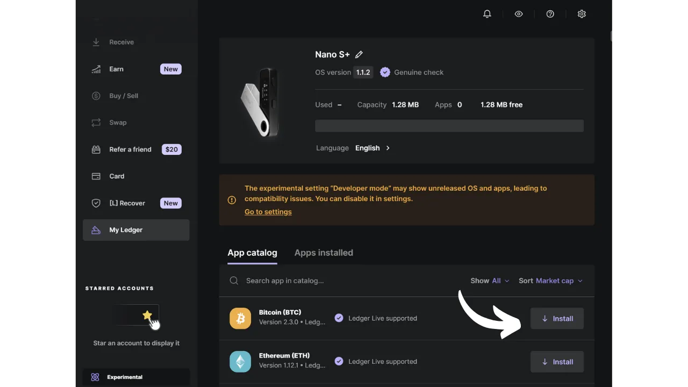
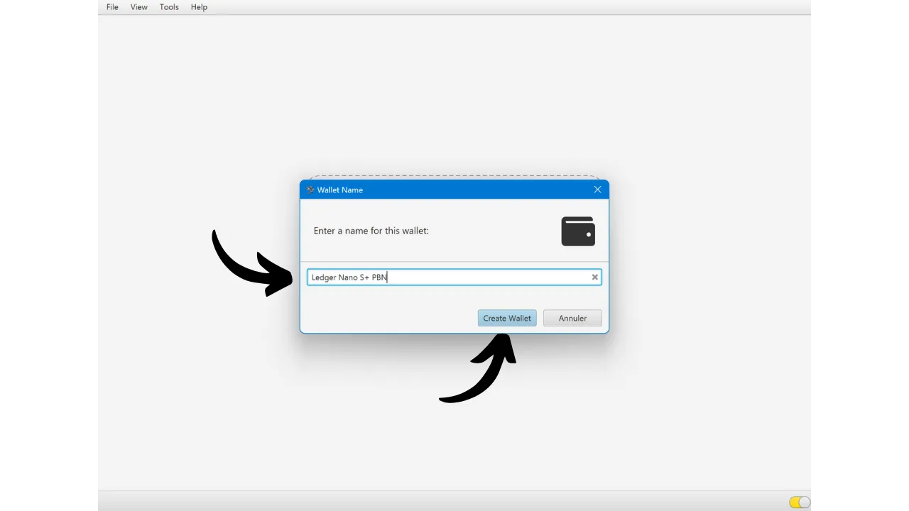
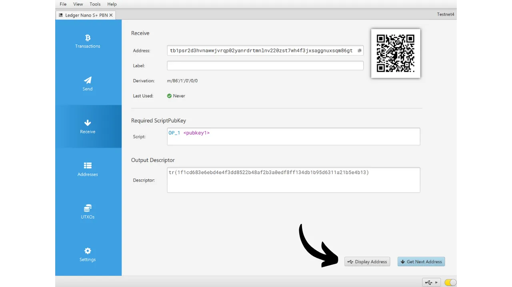
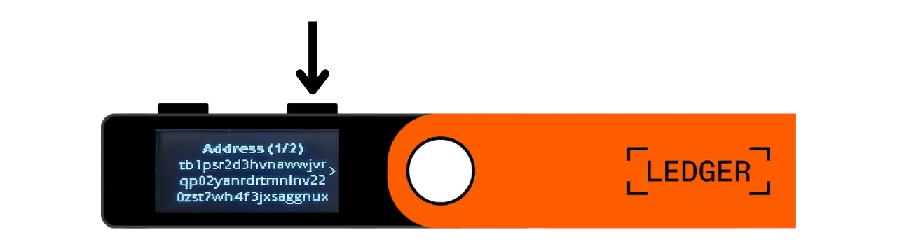
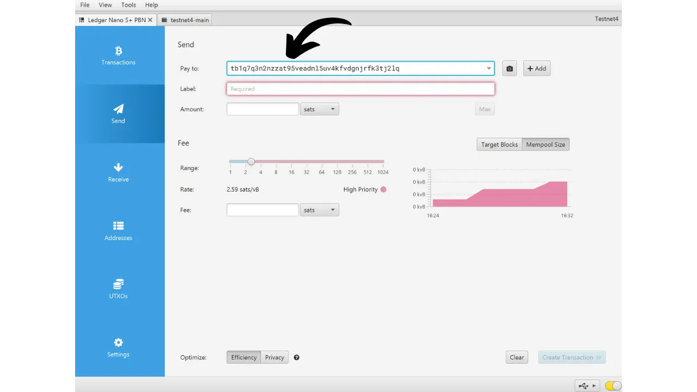

Riistvara rahakott on elektrooniline seade, mis on pühendatud Bitcoin'i rahakoti privaatvõtmete haldamisele ja turvamisele. Erinevalt tarkvaralistest rahakottidest (või kuumadest rahakottidest), mis on paigaldatud üldotstarbelistele masinatele, mis on sageli ühendatud Internetiga, võimaldavad riistvara rahakotid privaatvõtmete füüsilist isoleerimist, vähendades häkkimise ja varguse riske.

Riistvara rahakoti peamine eesmärk on seadme funktsionaalsuste minimeerimine nii palju kui võimalik, et vähendada selle rünnakupinda. Väiksem rünnakupind tähendab ka vähem potentsiaalseid rünnakutegevusi, st vähem süsteemi nõrkusi, mida ründajad võiksid ära kasutada bitcoini juurdepääsuks.

On soovitatav kasutada riistvara rahakotti oma bitcoinide turvamiseks, eriti kui omate olulisi summasid, kas absoluutväärtuses või kui osa teie koguvarast.

Riistvara rahakotte kasutatakse koos rahakoti haldamise tarkvaraga arvutis või nutitelefonis. See tarkvara haldab tehingute loomist, kuid tehingute kinnitamiseks vajalik krüptograafiline allkiri tehakse ainult riistvara rahakoti sees. See tähendab, et privaatvõtmed ei ole kunagi potentsiaalselt haavatavas keskkonnas paljastatud.

Riistvara rahakotid pakuvad kasutajale kahekordset kaitset: ühelt poolt kaitsevad nad teie bitcoine kaugrünnakute eest, hoides privaatvõtmeid võrguühenduseta, ja teiselt poolt pakuvad nad üldiselt paremat füüsilist vastupanu võtmete kättesaamise katsetele. Ja just nendel 2 turvakriteeriumil saab hinnata ja järjestada turul saadaolevaid erinevaid mudeleid.

Selles õpetuses pakun avastada ühte neist lahendustest: **Ledger Nano S Plus**.

## Sissejuhatus Ledger Nano S Plus'sse

Ledger Nano S Plus on riistvara rahakott, mida toodab Prantsuse ettevõte Ledger, turuhinnaga 79 €.

Nano S Plus on varustatud CC EAL6+ sertifitseeritud kiibiga ("*turvaelement*"), mis pakub teile täiustatud kaitset riistvara füüsiliste rünnakute vastu. Ekraani ja nuppe kontrollib otseselt see kiip. Sageli tõstatatud kriitikapunkt on see, et selle kiibi kood ei ole avatud lähtekoodiga, mis nõuab teatud usaldust selle komponendi terviklikkuse vastu. Siiski auditeerivad seda elementi sõltumatud eksperdid.

Kasutamise osas toimib Ledger Nano S Plus ainult juhtmega USB-C ühenduse kaudu.

Ledger eristub oma konkurentidest alati väga kiire uute Bitcoin'i funktsioonide, nagu näiteks Taproot või Miniscript, omaksvõtuga, mida hinnatakse kõrgelt.
Pärast selle testimist leian, et Ledger Nano S Plus on suurepärane sissejuhatav riistvara rahakott. See pakub kõrgetasemelist turvalisust mõistliku hinnaga. Selle peamine puudus võrreldes sama hinnaklassi teiste seadmetega on asjaolu, et püsivara kood ei ole avatud lähtekoodiga. Samuti on Nano S Plus ekraan suhteliselt väike võrreldes kallimate mudelitega, nagu Ledger Flex või Coldcard Q1. Siiski on selle liides väga hästi kujundatud: hoolimata selle kahest nupust ja väikesest ekraanist, on see lihtne kasutada, sealhulgas edasijõudnute funktsioonide jaoks, nagu BIP39 paroolilause. Ledger Nano S Plus'il ei ole akut, õhulõhe ühendust, kaamerat ega mikro SD porti, kuid see on selle hinnaklassi jaoks täiesti normaalne.
Minu arvates on Ledger Nano S Plus hea valik oma Bitcoin'i rahakoti turvamiseks ja sobib nii algajatele kui ka kesktaseme kasutajatele. Siiski, selles hinnaklassis eelistan ma isiklikult Trezor Safe 3-t, mis pakub umbes samu võimalusi. Trezori eelis, minu arvates, on selle turvaelemendi haldamises: mnemooniline fraas ja võtmed hallatakse ainult avatud lähtekoodiga, kuid saavad siiski kiibi kaitsest kasu. Trezori puuduseks on see, et nad on uute funktsioonide rakendamisel mõnikord väga aeglased, erinevalt Ledgerist.
## Kuidas osta Ledger Nano S Plus?

Ledger Nano S Plus on müügil [ametlikul veebilehel](https://shop.ledger.com/products/ledger-nano-s-plus). Füüsilises poes ostmiseks leiate [sertifitseeritud edasimüüjate nimekirja](https://www.ledger.com/reseller) Ledgeri veebisaidilt.

## Eeltingimused

Kui olete oma Ledger Nano kätte saanud, on esimene samm pakendi kontrollimine, et veenduda, et seda ei ole avatud. Kui see on kahjustatud, võib see viidata sellele, et riistvara rahakott on kompromiteeritud ja ei pruugi olla autentne.

Avamisel peaksite leidma karbist järgmised esemed:
- Ledger Nano S Plus;
- USB-C kuni USB-A kaabel;
- Kasutusjuhend;
- Kaardid oma mnemoonilise fraasi üles kirjutamiseks.

Selle õpetuse jaoks on vaja kahte tarkvararakendust: Ledger Live Ledgeri seadistamiseks ja Sparrow Wallet oma Bitcoin'i rahakoti haldamiseks. Laadige [Ledger Live](https://www.ledger.com/ledger-live) ja [Sparrow Wallet](https://sparrowwallet.com/download/) alla nende ametlikelt veebisaitidelt.

Nende kahe tarkvaraprogrammi puhul soovitan tungivalt kontrollida nii nende autentsust (GnuPG abil) kui ka nende terviklikkust (hashi kaudu) enne nende installimist oma masinasse. Kui te ei ole kindel, kuidas seda teha, võite järgida seda teist õpetust:
https://planb.network/tutorials/others/integrity-authenticity

## Kuidas seadistada Ledger Nano?

Ühendage oma Nano arvutiga, kus on installitud Ledger Live ja Sparrow Wallet. Ledgeril navigeerimiseks kasutage vasakut nuppu vasakule liikumiseks ja paremat nuppu paremale liikumiseks. Valiku kinnitamiseks või valimiseks vajutage mõlemat nuppu korraga.

Kerige läbi erinevate tutvustuslehtede ja seejärel alustamiseks klõpsake mõlemal nupul.

Valige valik "*Seadista kui uus seade*".

Valige PIN-kood, mida kasutatakse teie Ledgeri avamiseks. See on seega kaitse volitamata füüsilise juurdepääsu vastu. See PIN-kood ei mängi rolli teie rahakoti krüptograafiliste võtmete tuletamisel. Seega, isegi ilma sellele PIN-koodile juurdepääsuta, võimaldab teie 24-sõnaline mnemooniline fraas teil oma bitcoine uuesti kätte saada.

Soovitatav on valida võimalikult juhuslik 8-kohaline PIN-kood. Samuti veenduge, et salvestate selle koodi erinevasse kohta, kus teie Ledger Nano S Plus asub (näiteks paroolihalduris).

Kasutage nuppudega numbrite kohal liikumiseks, seejärel valige iga number, klõpsates mõlemal nupul korraga.

Sisestage oma PIN-kood teist korda selle kinnitamiseks.
Teie Nano annab juhiseid, kuidas hallata teie taastefraasi.

**See mnemooniline fraas annab täieliku ja piiramatu juurdepääsu kõigile teie bitcoinidele**. Igaüks, kes on selle fraasi valduses, võib teie vahendid varastada, isegi ilma füüsilise juurdepääsuta teie Ledgerile. 24-sõnaline fraas võimaldab teil taastada juurdepääsu oma bitcoinidele kaotuse, varguse või teie Ledger Nano S Plus kahjustumise korral. Seetõttu on väga oluline hoolikalt salvestada ja hoida seda turvalises kohas.

Võite selle üles kirjutada kaasasolevale papptükile, või suurema turvalisuse tagamiseks soovitan ma graveerida selle roostevabast terasest alusele, et kaitsta tulekahju, üleujutuste või kokkuvarisemise ohtude eest.

Võite neid juhiseid sirvida ja lehti vahele jätta, klõpsates paremat nuppu.

Ledger loob teie mnemoonilise fraasi kasutades oma juhusliku numbri generaatorit. Veenduge, et teid selle toimingu ajal ei jälgitaks. Kirjutage Ledgeri poolt antud sõnad üles füüsilisele meediumile, mille olete valinud. Oma turvastrateegiast lähtuvalt võiksite kaaluda fraasi mitme täieliku füüsilise koopia tegemist (kuid oluline on, et te seda ei jaotaks). On oluline hoida sõnad nummerdatuna ja järjestikuses järjekorras.
***Ilmselgelt ei tohiks te neid sõnu kunagi internetis jagada, vastupidiselt sellele, mida ma teen selles õpetuses. See näidisrahakott kasutatakse ainult Testnetis ja kustutatakse pärast õpetust.***

Järgmiste sõnade juurde liikumiseks klõpsake paremat nuppu.

Kui kõik sõnad on üles märgitud, klõpsake järgmise sammu juurde liikumiseks kahte nuppu.

Klõpsake kahtluse "*Kinnita oma taastefraas*", seejärel valige oma mnemoonilise fraasi sõnad nende järjekorras, et kinnitada, et olete need õigesti üles märkinud. Kasutage valikute vahel liikumiseks vasakut ja paremat nuppu, seejärel valige õige sõna, klõpsates kahte nuppu. Jätkake seda protseduuri kuni 24. sõnani.

Kui kinnitatav fraas vastab täpselt sellele, mille Ledger teile eelmises etapis andis, võite jätkata. Kui mitte, näitab see, et teie füüsiline varukoopia mnemoonilisest fraasist on vale ja peate protsessi uuesti alustama.

Ja nii ongi, teie seeme on teie Ledger Nano S Plus'is õigesti loodud. Enne uue Bitcoin'i rahakoti loomist sellest seemnest, uurigem koos seadme seadeid.

## Kuidas muuta oma Ledgeri seadeid?

Seadetele juurdepääsemiseks hoidke mõnda sekundit all kahte nuppu.

Klõpsake menüül "*Settings*".

Ja valige "*General*".

Menüüs "*Language*" saate muuta kuvakeelt.

Menüüs "*Brightness*" saate reguleerida ekraani heledust. Ülejäänud üldseaded meid praegu ei huvita.

Nüüd minge jaotisse "*Security*" seaded.
"*PIN-koodi muutmine*" võimaldab teil muuta oma PIN-koodi. 
"*Salasõna*" võimaldab teil seadistada BIP39 salasõna. Salasõna on valikuline parool, mis koos teie taastefraasiga pakub teie rahakotile lisakihti turvalisust.

Praegu genereeritakse teie rahakott 24-sõnalise mnemoonilise fraasi põhjal. See taastefraas on väga oluline, kuna see võimaldab teil kaotuse korral taastada kõik oma rahakoti võtmed. Siiski kujutab see endast ühtset rikkepunkti (SPOF). Kui see on kompromiteeritud, on teie bitcoiinid ohus. Siin tulebki mängu salasõna. See on valikuline parool, mille võite suvaliselt valida, mis lisandub mnemoonilisele fraasile, et suurendada rahakoti turvalisust.

Salasõna ei tohiks segi ajada PIN-koodiga. See mängib rolli teie krüptograafiliste võtmete tuletamisel. See töötab koos mnemoonilise fraasiga, muutes seemet, millest võtmed genereeritakse. Seega, isegi kui keegi saab kätte teie 24-sõnalise fraasi, ilma salasõnata ei pääse nad teie vahenditele ligi. Salasõna kasutamine loob sisuliselt uue rahakoti eristuvate võtmetega. Salasõna muutmine (isegi veidi) genereerib erineva rahakoti.

Salasõna on väga võimas vahend oma bitcoiinide turvalisuse suurendamiseks. Siiski on väga oluline mõista, kuidas see töötab enne selle rakendamist, et vältida juurdepääsu kaotamist oma rahakotile. Seetõttu soovitan teil konsulteerida selle teise õpetusega, kui soovite oma Ledgeril salasõna seadistada:

https://planb.network/tutorials/wallet/passphrase-ledger

"*PIN-luku*" menüü võimaldab teil seadistada ja aktiveerida oma Ledgeri automaatse lukustamise pärast kindlaksmääratud tegevusetuse perioodi.

"*Ekraanisäästja*" menüü võimaldab teil reguleerida oma Ledger Nano uinakurežiimi. Pange tähele, et ekraanisäästja ei nõua ärkamisel PIN-koodi sisestamist, välja arvatud juhul, kui "*PIN-luku*" valik on aktiveeritud vastavalt uinakurežiimile. See funktsioon on eriti kasulik Ledger Nano X seadmetele, mis on varustatud akuga, et vähendada nende energiatarbimist.

Lõpuks võimaldab "*Seadme lähtestamine*" menüü teil teie Ledgeri lähtestada. Jätkake selle lähtestamisega ainult siis, kui olete kindel, et see ei sisalda ühtegi bitcoiinide turvamiseks vajalikku võtit, kuna võite jäädavalt kaotada juurdepääsu oma vahenditele. See valik võib olla kasulik tühja taastamise testi tegemiseks, kuid räägin sellest veidi hiljem rohkem.

## Kuidas installida Bitcoin rakendust?

Alustage Ledger Live tarkvara käivitamisega oma arvutis, seejärel ühendage ja avage oma Ledger Nano. Ledger Live'is minge menüüsse "*Minu Ledger*". Teilt küsitakse juurdepääsu lubamist teie Nanole.

Kinnitage juurdepääs oma Ledgeril, klõpsates kahe nupu peal.

Esmalt veenduge Ledger Live'is, et kuvatakse "*Ehtsuskontroll*". See kinnitab, et teie seade on autentne.

Kui teie Ledger Nano tarkvara ei ole ajakohane, pakub Ledger Live automaatselt selle uuendamist. Vajadusel klõpsake "*Uuenda tarkvara*", seejärel "*Paigalda uuendus*", et alustada paigaldamist. Oma Ledgeril kinnitage klõpsates kahe nupu peal, seejärel oodake paigaldamise ajal.
Lõpuks lisame Bitcoin rakenduse. Selleks klõpsake Ledger Live'is nupul "*Install*" kõrval "*Bitcoin (BTC)*".

Rakendus installitakse teie Nano'le.

Edaspidi ei ole teil Ledger Live tarkvara igapäevaseks rahakoti haldamiseks enam vaja. Võite aeg-ajalt sinna tagasi pöörduda, et uuendada püsivara, kui on saadaval uued versioonid. Kõige muu jaoks kasutame Sparrow Walletit, mis on palju terviklikum tööriist Bitcoin rahakoti efektiivseks haldamiseks.

## Kuidas seadistada uut Bitcoin rahakotti Sparrow'ga?

Avage Sparrow Wallet ja jätke sissejuhatavad lehed vahele, et jõuda avalehele. Kontrollige, et olete õigesti ühendatud noodiga, jälgides ekraani paremas alanurgas asuvat lülitit.

Soovitan tungivalt kasutada omaenda Bitcoin noodit. Selles õpetuses kasutan avalikku noodit (kollane), kuna olen testnetis, kuid tavakasutuseks on parem valida kohalik Bitcoin Core (roheline) või Electrum server, mis on ühendatud kaugnoodiga (sinine).

Klõpsake menüül "*File*" seejärel "*New Wallet*".

Valige sellele rahakotile nimi, seejärel klõpsake nupul "*Create Wallet*".

"*Script Type*" rippmenüüs valige skripti tüüp, mida kasutatakse teie bitcoinide turvamiseks. Soovitan valida "*Taproot*", või kui see pole saadaval, siis "*Native SegWit*".

Klõpsake nupul "*Connected Hardware Wallet*".

Kui te pole seda veel teinud, ühendage oma Ledger Nano S Plus arvutiga, avage see oma PIN-koodiga ja seejärel avage "*Bitcoin*" rakendus, klõpsates Bitcoin logo peal korra kahe nupuga.

*Selles õpetuses kasutan Bitcoin Testnet rakendust, kuid protseduur jääb samaks põhivõrgu jaoks.*

Sparrow'is klõpsake nupul "*Scan*".

Seejärel klõpsake nupul "*Import Keystore*".

Nüüd näete oma rahakoti üksikasju, sealhulgas teie esimese konto laiendatud avalikku võtit. Klõpsake nupul "*Apply*", et lõpetada rahakoti loomine.

Valige tugev parool, et kaitsta juurdepääsu Sparrow Walletile. See parool tagab juurdepääsu turvalisuse teie rahakoti andmetele Sparrow's, mis aitab kaitsta teie avalikke võtmeid, aadresse, silte ja tehingute ajalugu igasuguse volitamata juurdepääsu eest.

Soovitan teil see parool salvestada paroolihaldurisse, et te seda ei unustaks.

Ja ongi kõik, teie rahakott on nüüd loodud!

Enne kui saate oma rahakotti esimesed bitcoini, **soovitan tungivalt teha kuiva trenni taastamise testi**. Pane kirja viiteteave, näiteks sinu xpub, seejärel lähtesta oma Ledger Nano, kui rahakott on veel tühi. Pärast seda proovi oma rahakotti Ledgeris taastada, kasutades oma paberil varukoopiaid. Kontrolli, kas taastamise järel genereeritud xpub ühtib algsega, mille üles märkisid. Kui jah, võid olla kindel, et sinu paberil varukoopiad on usaldusväärsed.
Et rohkem teada saada, kuidas taastamise testi teha, soovitan konsulteerida selle teise õpetusega:

https://planb.network/tutorials/wallet/recovery-test

## Kuidas vastu võtta bitcoine Ledger Nano abil?

Klõpsa vahekaardil "*Receive*".

Ühenda oma Ledger Nano S Plus arvutiga, ava see oma PIN-koodiga, seejärel ava "*Bitcoin*" rakendus.

Enne Sparrow Wallet'is pakutud aadressi kasutamist, kontrolli seda oma Ledgeri ekraanil. See praktika võimaldab sul kinnitada, et Sparrow'is kuvatav aadress ei ole petlik ja et riistvara rahakott tõepoolest omab privaatvõtit, mis on vajalik hiljem selle aadressiga turvatud bitcoinide kulutamiseks. See aitab vältida mitut tüüpi rünnakuid.
Selle kontrollimiseks klõpsa nupul "*Display Address*".

Veendu, et sinu Ledgeril kuvatav aadress ühtib Sparrow Wallet'is näidatuga. Soovitatav on seda kontrolli teha vahetult enne oma aadressi saatjale andmist, et olla selle kehtivuses kindel. Aadressi täielikuks vaatamiseks võid kasutada nuppe.

Seejärel klõpsa "*Approve*", kui aadressid on tõepoolest identsed.

Sa võid lisada "*Label*" selleks, et kirjeldada bitcoini allikat, mis selle aadressiga turvatakse. See on hea tava, mis aitab sul paremini hallata oma UTXO-sid.

Lisateabe saamiseks sildistamise kohta soovitan samuti tutvuda selle teise õpetusega:

https://planb.network/tutorials/privacy/utxo-labelling

Seejärel võid kasutada seda aadressi bitcoinide vastuvõtmiseks.

## Kuidas saata bitcoine Ledger Nano abil?

Nüüd, kui oled oma rahakotti turvatud Nano S Plus'iga saanud esimesed satid, võid neid ka kulutada! Ühenda oma Ledger arvutiga, ava see, käivita Sparrow Wallet ja seejärel mine vahekaardile "*Send*", et koostada uus tehing.

Kui soovid teha "*coin control*", mis tähendab konkreetsete UTXO-de valimist tehingus kasutamiseks, mine vahekaardile "*UTXOs*". Vali UTXO-d, mida soovid kulutada, seejärel klõpsa "*Send Selected*". Sind suunatakse tagasi sama "*Send*" vahekaardi ekraanile, kuid sinu UTXO-d on juba tehingu jaoks valitud.

Sisesta sihtkoha aadress. Mitme aadressi sisestamiseks võid klõpsata nupul "*+ Add*".

Märgi "*Label*", et meeles pidada selle kulutuse eesmärki.

Valige saadetava summa sellele aadressile.

Kohandage tehingu tasu määra vastavalt praegusele turuolukorrale.

Veenduge, et kõik teie tehingu seaded on õiged, seejärel klõpsake nupul "*Loo Tehing*".

Kui kõik tundub teile korras, klõpsake nupul "*Finaliseeri Tehing Allkirjastamiseks*".

Klõpsake nupul "*Allkirjasta*".

Klõpsake nupul "*Allkirjasta*" oma Ledger Nano S Plus kõrval.

Kontrollige oma Ledgeri ekraanil tehingu seadeid, sealhulgas saaja aadressi, saadetud summat ja tasu suurust.

Kui kõik tundub teile korras, vajutage "*Allkirjasta tehing*" nupule, vajutades kahte nuppu.

Teie tehing on nüüd allkirjastatud. Kontrollige kõik üle, et kõik tunduks korras, seejärel klõpsake nupul "*Edasta Tehing*", et see Bitcoin'i võrgus levitada.

Leiate selle Sparrow Wallet'i "*Tehingud*" vahelehelt.

Palju õnne, nüüd olete kursis Ledger Nano S Plus'i põhikasutusega Sparrow Wallet'iga! Tulevases õpetuses vaatame, kuidas kasutada Ledgerit koos Lianaga, et ära kasutada Miniscripti.

Kui leidsite selle õpetuse kasuliku, oleksin tänulik, kui jätaksite allapoole pöidla üles. Julgelt jagage seda artiklit oma sotsiaalvõrgustikes. Suur tänu!

Soovitan teil samuti tutvuda selle täieliku õpetusega Ledger Flex kohta:

https://planb.network/tutorials/wallet/ledger-flex