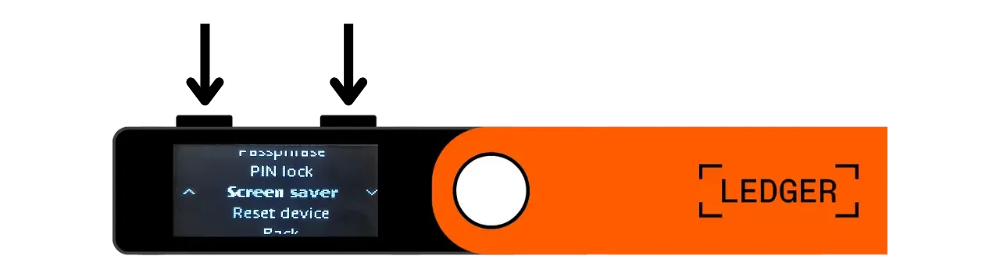
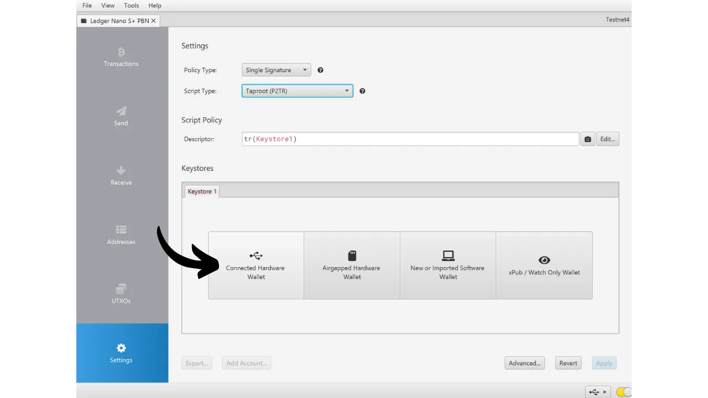

Laitteistokukkaro on elektroninen laite, joka on omistettu Bitcoin-lompakon yksityisten avainten hallintaan ja turvaamiseen. Toisin kuin yleiskäyttöisille koneille asennetut ohjelmistokukkarot (tai hot wallets), jotka ovat usein yhdistettyjä internetiin, laitteistokukkarot mahdollistavat yksityisten avainten fyysisen eristämisen, vähentäen hakkeroinnin ja varkauden riskejä.

Laitteistokukkaron päätavoite on minimoida laitteen toiminnallisuudet mahdollisimman paljon, jotta sen hyökkäyspinta-ala pienenee. Pienempi hyökkäyspinta-ala tarkoittaa myös vähemmän potentiaalisia hyökkäysvektoreita, eli vähemmän järjestelmän heikkouksia, joita hyökkääjät voisivat käyttää hyväkseen päästäkseen käsiksi bitcoineihin.

On suositeltavaa käyttää laitteistokukkaroa bitcoiniesi turvaamiseen, erityisesti jos omistat merkittäviä määriä, joko absoluuttisessa arvossa tai osuutena kokonaisvarallisuudestasi.

Laitteistokukkaroita käytetään yhdessä lompakonhallintaohjelmiston kanssa tietokoneella tai älypuhelimella. Tämä ohjelmisto hallinnoi transaktioiden luomista, mutta tarvittava kryptografinen allekirjoitus transaktioiden vahvistamiseksi tehdään ainoastaan laitteistokukkarossa. Tämä tarkoittaa, että yksityiset avaimet eivät koskaan altistu mahdollisesti haavoittuvalle ympäristölle.

Laitteistokukkarot tarjoavat käyttäjälle kaksinkertaisen suojan: toisaalta ne turvaavat bitcoinit etähyökkäyksiltä pitämällä yksityiset avaimet offline-tilassa, ja toisaalta ne yleensä tarjoavat paremman fyysisen vastustuskyvyn avainten ulos purkamisen yrityksiä vastaan. Ja juuri näiden 2 turvakriteerin perusteella voidaan arvioida ja vertailla markkinoilla olevia eri malleja.

Tässä oppaassa ehdotan tutustumaan yhteen näistä ratkaisuista: **Ledger Nano S Plus**.

## Johdanto Ledger Nano S Plus -laitteeseen

Ledger Nano S Plus on ranskalaisen Ledger-yrityksen valmistama laitteistokukkaro, joka on markkinoilla hinnalla 79 €.

Nano S Plus on varustettu CC EAL6+ sertifioidulla piirillä ("*secure element*"), joka tarjoaa sinulle edistynyttä suojaa fyysisiä hyökkäyksiä vastaan laitteistossa. Näyttö ja painikkeet ovat suoraan tämän piirin ohjaamia. Usein esitetty kritiikin kohta on, että tämän piirin koodi ei ole avoimen lähdekoodin, mikä vaatii tiettyä luottamusta tämän komponentin eheyteen. Tästä huolimatta tätä elementtiä on auditoitu riippumattomien asiantuntijoiden toimesta.

Käytön kannalta Ledger Nano S Plus toimii ainoastaan langallisella USB-C yhteydellä.

Ledger erottuu kilpailijoistaan aina erittäin nopealla uusien Bitcoin-ominaisuuksien, kuten Taprootin tai Miniscriptin, omaksumisella, mikä on erittäin arvostettua.
Testattuani sen, totean, että Ledger Nano S Plus on erinomainen aloitustason laitteistokukkaro. Se tarjoaa korkean turvallisuustason kohtuulliseen hintaan. Sen päähaitta verrattuna saman hintaluokan muihin laitteisiin on se, että laiteohjelmiston koodi ei ole avoimen lähdekoodin. Lisäksi Nano S Plus -laitteen näyttö on suhteellisen pieni verrattuna kalliimpiin malleihin, kuten Ledger Flexiin tai Coldcard Q1:een. Siitä huolimatta sen käyttöliittymä on suunniteltu erittäin hyvin: huolimatta sen kahdesta painikkeesta ja pienestä näytöstä, se on helppokäyttöinen, mukaan lukien edistyneet ominaisuudet, kuten BIP39-salasana. Ledger Nano S Plus ei sisällä akkua, Air-gap-yhteyttä, kameraa tai mikro SD -porttia, mutta tämä on täysin normaalia tässä hintaluokassa.
Omassa mielipiteessäni Ledger Nano S Plus on hyvä vaihtoehto Bitcoin-lompakkosi turvaamiseen ja sopii sekä aloittelijoille että keskitason käyttäjille. Kuitenkin tässä hintaluokassa suosin henkilökohtaisesti Trezor Safe 3:a, joka tarjoaa suunnilleen samat vaihtoehdot. Trezorin etuna, näkemykseni mukaan, on sen turvaelementin hallinta: mnemoninen lause ja avaimet hallitaan yksinomaan avoimen lähdekoodin kautta, mutta silti hyötyvät piirin suojauksesta. Trezorin haittapuoli on, että ne ovat joskus hyvin hitaita toteuttamaan uusia ominaisuuksia toisin kuin Ledger.
## Kuinka ostaa Ledger Nano S Plus?

Ledger Nano S Plus on saatavilla myynnissä [virallisilla verkkosivuilla](https://shop.ledger.com/products/ledger-nano-s-plus). Jos haluat ostaa sen fyysisestä kaupasta, voit myös löytää [sertifioitujen jälleenmyyjien listan](https://www.ledger.com/reseller) Ledgerin verkkosivuilta.

## Edellytykset

Kun olet vastaanottanut Ledger Nano S Plus -laitteesi, ensimmäinen askel on tarkistaa pakkaus varmistaaksesi, ettei sitä ole avattu. Jos se on vahingoittunut, se voi viitata siihen, että laitteisto lompakko on saattanut joutua kompromissin kohteeksi ja se ei ehkä ole aito.

Paketin avattuasi sinun tulisi löytää seuraavat esineet laatikosta:
- Ledger Nano S Plus;
- USB-C USB-A -kaapeli;
- Käyttöohje;
- Kortit, joihin voit kirjoittaa mnemonisen lauseesi.

Tätä opasta varten tarvitset 2 ohjelmistosovellusta: Ledger Live -sovelluksen Ledgerin alustamiseen ja Sparrow Wallet -sovelluksen Bitcoin-lompakkosi hallintaan. Lataa [Ledger Live](https://www.ledger.com/ledger-live) ja [Sparrow Wallet](https://sparrowwallet.com/download/) niiden virallisilta verkkosivuilta.

Näiden kahden ohjelmiston osalta suosittelen vahvasti sekä niiden aitouden (GnuPG:n avulla) että niiden eheyden (hashin kautta) tarkistamista ennen niiden asentamista koneellesi. Jos et ole varma, miten tämä tehdään, voit seurata tätä toista opasta:
https://planb.network/tutorials/others/integrity-authenticity

## Kuinka alustaa Ledger Nano?

Yhdistä Nano tietokoneeseesi, jossa Ledger Live ja Sparrow Wallet on asennettu. Navigoidaksesi Ledgerissasi, käytä vasenta painiketta mennäksesi vasemmalle ja oikeaa painiketta mennäksesi oikealle. Valitaksesi tai vahvistaaksesi vaihtoehdon, paina molempia painikkeita samanaikaisesti.

Selaa läpi eri johdantosivut ja klikkaa sitten 2 painiketta aloittaaksesi.

Valitse vaihtoehto "*Aseta uutena laitteena*".

Valitse PIN-koodi, jota käytetään Ledgerisi avaamiseen. Tämä on siis suoja luvattomalta fyysiseltä pääsyltä. Tämä PIN-koodi ei vaikuta lompakkosi kryptografisten avainten johdannaisuuteen. Näin ollen, vaikka sinulla ei olisikaan pääsyä tähän PIN-koodiin, 24 sanan mnemonisen lauseesi avulla voit palauttaa pääsyn bitcoineihisi.

On suositeltavaa valita mahdollisimman satunnainen 8-numeroinen PIN-koodi. Varmista myös, että tallennat tämän koodin eri paikkaan kuin missä Ledger Nano S Plus säilytetään (esimerkiksi salasananhallintaohjelmassa).

Käytä painikkeita liikkuaksesi numeroiden yli, valitse sitten jokainen numero klikkaamalla molempia painikkeita samanaikaisesti.

Syötä PIN-koodisi toisen kerran vahvistaaksesi sen.

Nanosi antaa ohjeita palautuslausekkeesi hallintaan.

**Tämä muistilause antaa täyden ja rajoittamattoman pääsyn kaikkiin bitcoineihisi**. Kuka tahansa, jolla on tämä lause, voi varastaa varasi, vaikka hänellä ei olisi fyysistä pääsyä Ledgeriisi. 24 sanan lause mahdollistaa pääsyn palauttamisen bitcoineihisi menetyksen, varkauden tai Ledger Nano S Plus -laitteesi vahingoittumisen sattuessa. On siis erittäin tärkeää tallentaa ja säilyttää se huolellisesti turvallisessa paikassa.

Voit kirjoittaa sen Ledgerin mukana toimitetulle pahville, tai lisäturvallisuuden vuoksi suosittelen kaivertamaan sen ruostumattomasta teräksestä valmistetulle alustalle suojautuaksesi tulipalojen, tulvien tai sortumien riskeiltä.

Voit selata näitä ohjeita ja ohittaa sivuja napsauttamalla oikeaa painiketta.

Ledger luo muistilauseesi käyttäen satunnaislukugeneraattoriaan. Varmista, että kukaan ei tarkkaile sinua tämän toimenpiteen aikana. Kirjoita Ledgerin antamat sanat valitsemallesi fyysiselle alustalle. Turvallisuusstrategiastasi riippuen saatat harkita useamman täydellisen fyysisen kopion tekemistä lauseesta (mutta tärkeää on, ettei sitä jaeta). On ratkaisevan tärkeää pitää sanat numeroituna ja järjestyksessä.
***Ilmeisesti, sinun ei pitäisi koskaan jakaa näitä sanoja internetissä, toisin kuin teen tässä opetusohjelmassa. Tätä esimerkkilompakkoa käytetään vain Testnetissä ja se poistetaan opetusohjelman jälkeen.***

Siirtyäksesi seuraaviin sanoihin, napsauta oikeaa painiketta.

Kun kaikki sanat on merkitty muistiin, napsauta kahta painiketta siirtyäksesi seuraavaan vaiheeseen.

Napsauta kahta painiketta "*Vahvista palautuslauseesi*", valitse sitten muistilauseesi sanat niiden järjestyksessä vahvistaaksesi, että olet merkinnyt ne oikein. Käytä vasenta ja oikeaa painiketta navigoidaksesi vaihtoehtojen välillä, valitse sitten oikea sana napsauttamalla kahta painiketta. Jatka tätä menettelyä kunnes 24. sana.

Jos vahvistamasi lause vastaa täsmälleen sitä, jonka Ledger antoi sinulle edellisessä vaiheessa, voit jatkaa. Jos ei, se osoittaa, että fyysinen varmuuskopiosi muistilauseesta on virheellinen, ja sinun on aloitettava prosessi alusta.

Ja siinä se on, siemenesi on luotu oikein Ledger Nano S Plus -laitteellasi. Ennen kuin jatkamme uuden Bitcoin-lompakon luomista tästä siemenestä, tutkitaan laitteen asetuksia yhdessä.

## Kuinka muuttaa Ledgerin asetuksia?

Päästäksesi asetuksiin, pidä kahta painiketta alhaalla muutaman sekunnin ajan.

Napsauta "*Asetukset*" -valikkoa.

Ja valitse "*Yleiset*".

"*Kieli*" -valikossa voit vaihtaa näytön kieltä.

"*Kirkkaus*" -valikossa voit säätää näytön kirkkautta. Emme ole kiinnostuneita muista yleisistä asetuksista toistaiseksi.

Nyt, siirry "*Turvallisuus*" asetusten osioon.

"*Vaihda PIN*" antaa sinun vaihtaa PIN-koodisi. 
"*Salasana*" mahdollistaa BIP39-salasanan asettamisen. Salasana on valinnainen salasana, joka yhdistettynä palautuslauseeseesi, tarjoaa lisäkerroksen turvaa lompakollesi.

Tällä hetkellä lompakkosi on luotu 24 sanan muistilauseesta. Tämä palautuslause on erittäin tärkeä, koska se mahdollistaa kaikkien lompakkosi avainten palauttamisen kadotustapauksessa. Kuitenkin, se muodostaa yksittäisen vikapiste (SPOF). Jos se on vaarantunut, bitcoinsi ovat vaarassa. Tässä kohtaa salasana tulee mukaan. Se on valinnainen salasana, jonka voit valita vapaasti, ja se lisätään muistilauseeseen parantaakseen lompakon turvallisuutta.

Salasanaa ei tule sekoittaa PIN-koodiin. Se toimii roolissa kryptografisten avaintesi johdannaisena. Se toimii yhdessä muistilauseen kanssa, muuttaen siemenen, josta avaimet luodaan. Näin ollen, vaikka joku saisi 24-sanaisen lauseesi, ilman salasanaa, he eivät pääse käsiksi varoihisi. Salasanan käyttäminen luo käytännössä uuden lompakon erillisillä avaimilla. Salasanan muuttaminen (jopa vähäisesti) luo eri lompakon.

Salasana on erittäin tehokas työkalu bitcoinsien turvallisuuden parantamiseen. On kuitenkin erittäin tärkeää ymmärtää, miten se toimii ennen sen käyttöönottoa, välttääksesi pääsyn menettämisen lompakkoosi. Tämän vuoksi suosittelen, että konsultoit tätä toista opasta, jos haluat asettaa salasanan Ledgeriisi:

https://planb.network/tutorials/wallet/passphrase-ledger

"*PIN-lukitus*" -valikko mahdollistaa Ledgerisi automaattisen lukituksen konfiguroinnin ja aktivoimisen määrätyn toimettomuusajan jälkeen.

"*Näytönsäästäjä*" -valikko mahdollistaa Ledger Nano -laitteesi lepotilan säätämisen. Huomaa, että näytönsäästäjä ei vaadi PIN-koodin syöttämistä heräämisen yhteydessä, ellei "*PIN-lukitus*" -vaihtoehto ole aktivoitu vastaamaan lepotilaa. Tämä ominaisuus on erityisen hyödyllinen Ledger Nano X -laitteille, joissa on akku, energiankulutuksen vähentämiseksi.

Lopuksi, "*Nollaa laite*" -valikko mahdollistaa Ledgerisi nollaamisen. Jatka tämän nollauksen kanssa vain, jos olet varma, ettei laitteessa ole mitään bitcoinsien turvaamiseen käytettyjä avaimia, sillä saatat menettää pääsyn varoihisi pysyvästi. Tämä vaihtoehto voi olla hyödyllinen tyhjän palautustestin suorittamiseen, mutta puhun tästä hieman myöhemmin.

## Kuinka asentaa Bitcoin-sovellus?

Aloita käynnistämällä Ledger Live -ohjelmisto tietokoneellasi, kytke sitten Ledger Nano ja avaa se. Ledger Livessä, siirry "*Oma Ledger*" -valikkoon. Sinua pyydetään antamaan lupa Nanoosi pääsyyn.

Vahvista pääsy Ledgerissäsi napsauttamalla kahta painiketta.

Ensin, Ledger Livessä, varmista, että näet "*Aito tarkistus*" -ilmoituksen. Tämä vahvistaa laitteesi olevan aito.

Jos Ledger Nanosi firmware ei ole ajan tasalla, Ledger Live tarjoaa automaattisesti päivitystä. Tarvittaessa napsauta "*Päivitä firmware*", sitten "*Asenna päivitys*" aloittaaksesi asennuksen. Ledgerissäsi, napsauta kahta painiketta vahvistaaksesi, sitten odota asennuksen ajan.
Lopuksi lisäämme Bitcoin-sovelluksen. Tehdäksesi tämän, klikkaa Ledger Livessä "*Asenna*" -painiketta vieressä olevan "*Bitcoin (BTC)*" kohdalla.

Sovellus asentuu Nano-laitteellesi.

Tästä lähtien et enää tarvitse Ledger Live -ohjelmistoa lompakkosi säännölliseen hallintaan. Voit ajoittain palata siihen päivittääksesi laitteiston firmwaren, kun uusia versioita on saatavilla. Kaikkeen muuhun käytämme Sparrow Walletia, joka on paljon kattavampi työkalu Bitcoin-lompakon tehokkaaseen hallintaan.

## Kuinka perustaa uusi Bitcoin-lompakko Sparrow'n avulla?

Avaa Sparrow Wallet ja ohita johdantosivut päästäksesi kotinäyttöön. Tarkista, että olet oikein yhdistetty nodeen tarkkailemalla näytön oikeassa alakulmassa olevaa kytkintä.

Suosittelen vahvasti oman Bitcoin-noden käyttöä. Tässä oppaassa käytän julkista nodea (keltainen), koska olen testnetissä, mutta normaalikäytössä on parempi valita paikallinen Bitcoin Core (vihreä) tai Electrum-palvelin, joka on yhdistetty etänodeen (sininen).

Klikkaa "*Tiedosto*" -valikkoa ja sitten "*Uusi Lompakko*".

Valitse nimi tälle lompakolle, ja klikkaa sitten "*Luo Lompakko*".

"*Script Type*" -pudotusvalikossa valitse skriptityyppi, jota käytetään bitcoinsiesi turvaamiseen. Suosittelen valitsemaan "*Taproot*", tai jos se ei ole saatavilla, "*Native SegWit*".

Klikkaa "*Yhdistetty Laitteistolompakko*" -painiketta.

Jos et ole vielä tehnyt niin, yhdistä Ledger Nano S Plus tietokoneeseen, avaa se PIN-koodillasi ja avaa sitten "*Bitcoin*" -sovellus klikkaamalla kaksi kertaa Bitcoin-logon päällä olevia nappeja.

*Tässä oppaassa käytän Bitcoin Testnet -sovellusta, mutta menettely on sama pääverkolle.*

Sparrow'ssa, klikkaa "*Skannaa*" -painiketta.

Klikkaa sitten "*Tuo Keystore*".

Nyt voit nähdä lompakkosi tiedot, mukaan lukien ensimmäisen tilisi laajennetun julkisen avaimen. Klikkaa "*Käytä*" -painiketta viimeistelläksesi lompakon luomisen.

Valitse vahva salasana Sparrow Walletin käyttöoikeuden suojaamiseen. Tämä salasana varmistaa pääsyn lompakkotietoihisi Sparrow'ssa turvallisesti, mikä auttaa suojaamaan julkisia avaimiasi, osoitteitasi, leimojasi ja transaktiohistoriaasi luvattomalta pääsyltä.

Neuvoisin sinua tallentamaan tämän salasanan salasananhallintaohjelmaan, jotta et unohda sitä.

Ja siinä se, lompakkosi on nyt luotu!

Ennen kuin vastaanotat ensimmäiset bitcoinisi lompakkoosi, **suosittelen vahvasti suorittamaan kuivan harjoituksen palautustestin**. Kirjaa ylös viitetieto, kuten xpub, ja nollaa sitten Ledger Nano, kun lompakko on vielä tyhjä. Sen jälkeen yritä palauttaa lompakkosi Ledgeriin käyttäen paperivarmuuskopioitasi. Tarkista, että palautuksen jälkeen luotu xpub vastaa alun perin merkitseämääsi. Jos näin on, voit olla varma, että paperivarmuuskopiosi ovat luotettavia.
Lisätietoja palautustestin suorittamisesta löydät tästä toisesta oppaasta:

https://planb.network/tutorials/wallet/recovery-test

## Kuinka vastaanottaa bitcoineja Ledger Nano -laitteella?

Napsauta "*Vastaanota*" -välilehteä.

Yhdistä Ledger Nano S Plus tietokoneeseen, avaa se PIN-koodillasi ja avaa sitten "*Bitcoin*" -sovellus.

Ennen kuin käytät Sparrow Walletin tarjoamaa osoitetta, varmista se Ledgerisi näytöltä. Tämä käytäntö mahdollistaa varmistuksen, että Sparrow'n näyttämä osoite ei ole petollinen ja että laitteistolompakko todella hallitsee yksityistä avainta, joka on tarpeen myöhemmin näillä bitcoineilla tehtäviin maksuihin. Tämä auttaa välttämään useita hyökkäystyyppejä.
Suorittaaksesi tämän tarkistuksen, napsauta "*Näytä Osoite*" -painiketta.

Varmista, että Ledgerisi näyttämä osoite vastaa Sparrow Walletissa ilmoitettua. On myös suositeltavaa suorittaa tämä tarkistus juuri ennen osoitteen antamista lähettäjälle, varmistaaksesi sen voimassaolon. Voit käyttää painikkeita nähdäksesi koko osoitteen.

Napsauta sitten "*Hyväksy*", jos osoitteet todella ovat samat.

Voit lisätä "*Merkinnän*" kuvaamaan bitcoineja, jotka turvataan tällä osoitteella. Tämä on hyvä käytäntö, joka auttaa hallitsemaan UTXOjasi paremmin.

Lisätietoja merkinnöistä löydät myös tästä toisesta oppaasta:

https://planb.network/tutorials/privacy/utxo-labelling

Tämän jälkeen voit käyttää tätä osoitetta bitcoinejen vastaanottamiseen.

## Kuinka lähettää bitcoineja Ledger Nano -laitteella?

Nyt kun olet vastaanottanut ensimmäiset satsisi Nano S Plus -lompakkoosi, voit myös käyttää niitä! Yhdistä Ledger tietokoneeseesi, avaa se, käynnistä Sparrow Wallet ja siirry sitten "*Lähetä*" -välilehteen luodaksesi uuden siirron.

Jos haluat tehdä "*kolikkokontrollin*", eli valita tarkasti, mitkä UTXOt kulutetaan siirrossa, siirry "*UTXOt*" -välilehteen. Valitse käytettävät UTXOt ja napsauta sitten "*Lähetä valitut*". Sinut ohjataan takaisin "*Lähetä*" -välilehden näkymään, mutta valitsemasi UTXOt on jo valittu siirtoa varten.

Syötä kohdeosoite. Voit myös syöttää useita osoitteita napsauttamalla "*+ Lisää*" -painiketta.

Merkitse "*Merkintä*" muistaaksesi tämän menon tarkoituksen.

Valitse lähetettävä summa tähän osoitteeseen.

Säädä siirtomaksun hintaa nykyisen markkinatilanteen mukaisesti.

Varmista, että kaikki siirron asetukset ovat oikein, ja klikkaa sitten "*Luo siirto*".

Jos kaikki näyttää hyvältä, klikkaa "*Viimeistele siirto allekirjoitusta varten*".

Klikkaa "*Allekirjoita*".

Klikkaa "*Allekirjoita*" Ledger Nano S Plus -laitteesi vieressä.

Tarkista siirron asetukset Ledger-laitteesi näytöltä, mukaan lukien vastaanottajan osoite, lähetetty summa ja maksun määrä.

Jos kaikki näyttää hyvältä, paina kahdesti "*Allekirjoita siirto*" -painiketta allekirjoittaaksesi.

Siirtosi on nyt allekirjoitettu. Tarkista vielä kerran, että kaikki näyttää hyvältä, ja klikkaa sitten "*Lähetä siirto*" lähettääksesi sen Bitcoin-verkkoon.

Löydät sen Sparrow Walletin "*Siirrot*" -välilehdeltä.

Onnittelut, olet nyt perillä Ledger Nano S Plus -laitteen peruskäytöstä Sparrow Walletin kanssa! Tulevassa oppaassa näemme, kuinka Ledgeriä käytetään Lianan kanssa hyödyntäen Miniscriptiä.

Jos pidit tätä opasta hyödyllisenä, arvostaisin, jos jättäisit peukun ylös alla. Voit vapaasti jakaa tämän artikkelin sosiaalisissa verkostoissasi. Suurkiitokset!

Suosittelen myös, että tutustut tähän kattavaan oppaaseen Ledger Flexistä:

https://planb.network/tutorials/wallet/ledger-flex