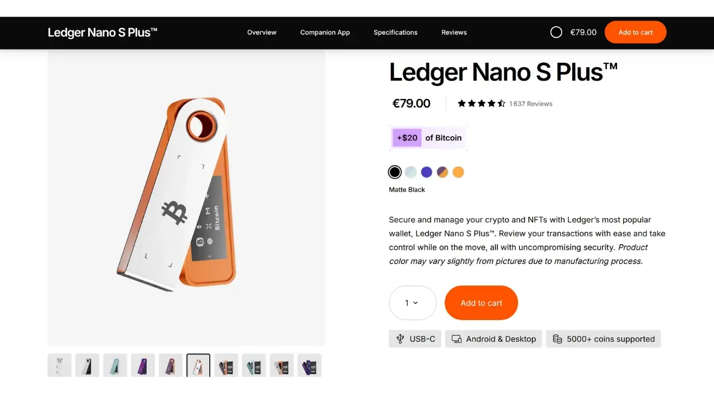
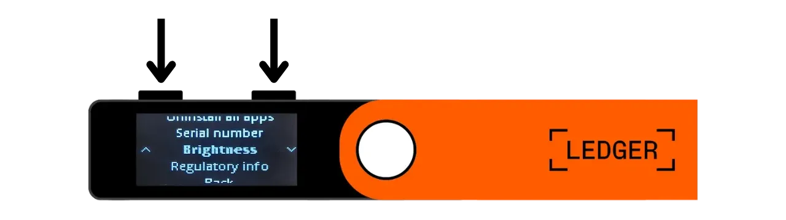
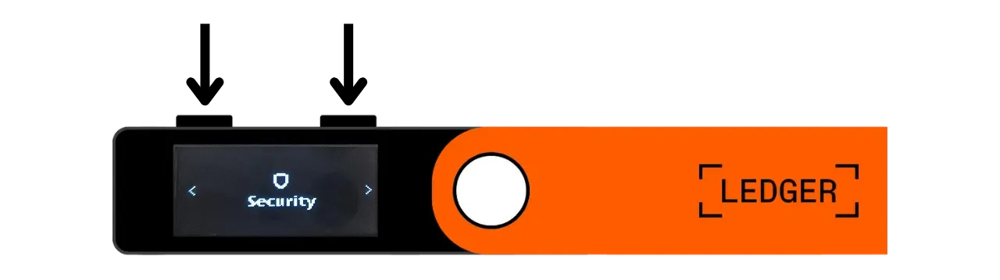
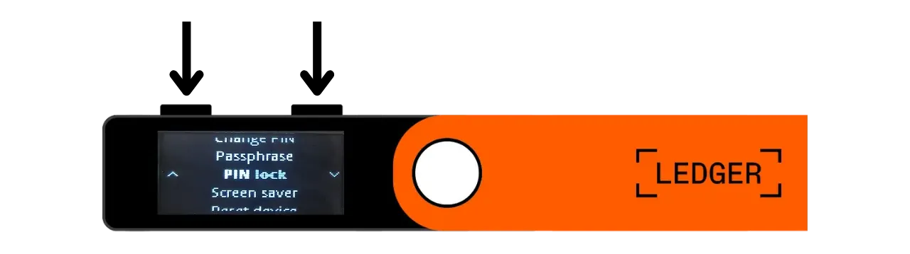

Un hardware wallet est un dispositif électronique dédié à la gestion et à la sécurisation des clés privées d'un portefeuille Bitcoin. Contrairement aux portefeuilles logiciels (ou portefeuilles chauds) installés sur des machines généralistes souvent connectées à Internet, les hardware wallets permettent d'isoler physiquement les clés privées, ce qui réduit les risques de piratage et de vol.

Le principal objectif d'un hardware wallet est de réduire au maximum les fonctionnalités de l'appareil afin de minimiser sa surface d'attaque. Moins de surface d'attaque, ça veut également dire moins de potentiels vecteurs d'attaque, c'est-à-dire moins de points faibles dans le système que les attaquants pourraient exploiter pour accéder aux bitcoins. 

Il est recommandé d'utiliser un hardware wallet pour sécuriser vos bitcoins, surtout si vous en détenez des quantités importantes, que ce soit en valeur absolue ou en proportion de votre patrimoine total.

Les hardware wallets s’utilisent en combinaison avec un logiciel de gestion de portefeuille sur un ordinateur ou un smartphone. Ce dernier permet de gérer la création des transactions, mais la signature cryptographique nécessaire pour rendre valide ces transactions se fait uniquement au sein du hardware wallet. Cela signifie que les clés privées ne sont jamais exposées à un environnement potentiellement vulnérable.

Les hardware wallets offrent une double protection pour l'utilisateur : d'une part, ils sécurisent vos bitcoins contre les attaques à distance en gardant les clés privées hors ligne, et d'autre part, ils offrent généralement une meilleure résistance physique face aux tentatives d'extraction des clés. Et c'est justement sur ces 2 critères de sécurité que l'on peut juger et classer les différents modèles existants sur le marché.

Dans ce tutoriel, je vous propose de découvrir une de ces solutions : la **Ledger Nano S Plus**.

## Présentation de la Ledger Nano S Plus

La Ledger Nano S Plus est un hardware wallet produit par l’entreprise française Ledger, commercialisé au tarif de 79 €.

La Nano S Plus est équipée d’une puce certifiée CC EAL6+ ("*secure element*"), ce qui vous offre une protection avancée contre les attaques physiques contre le hardware. L'écran et les boutons sont directement contrôlés par cette puce. Un point de critique souvent soulevé est que le code de cette puce n'est pas open-source, ce qui impose une certaine confiance dans l’intégrité de ce composant. Néanmoins, cet élément est audité par des experts indépendants.

En termes d’usage, la Ledger Nano S Plus fonctionne uniquement en connexion filaire USB-C.

Ledger se distingue de ses concurrents par son adoption toujours très rapide des nouvelles fonctionnalités de Bitcoin, comme Taproot ou Miniscript par exemple, ce qui est très appréciable.

Après l'avoir testée, je trouve que la Ledger Nano S Plus est un excellent hardware wallet d'entrée de gamme. Elle offre un haut niveau de sécurité pour un prix raisonnable. Son principal inconvénient par rapport à d'autres dispositifs de la même gamme de prix est le fait que le code de son micrologiciel ne soit pas open-source. Aussi, l'écran de la Nano S Plus est relativement petit comparé à d'autres modèles plus onéreux, tels que le Ledger Flex ou le Coldcard Q1. Néanmoins, son interface est très bien conçue : malgré ses deux boutons et son petit écran, elle reste facile à utiliser, y compris pour des fonctionnalités avancées telles que la passphrase BIP39. La Ledger Nano S Plus ne dispose pas de batterie, de connexion Air-gap, de caméra ni de port pour micro SD, mais c'est tout à fait normal pour cette gamme de prix.

À mon avis, la Ledger Nano S Plus est une bonne option pour sécuriser votre portefeuille Bitcoin, et convient aussi bien aux débutants qu'aux utilisateurs intermédiaires. Cependant, dans cette gamme de prix, je préfère personnellement la Trezor Safe 3, qui offre à peu près les mêmes options. L'avantage de la Trezor réside selon moi dans la gestion de son élément sécurisé : la phrase mnémonique et les clés sont gérées exclusivement par du code open-source, mais bénéficient tout de même de la protection de la puce. L'inconvénient de Trezor est qu'ils sont parfois très lents dans l'implémentation des nouvelles fonctionnalités contrairement à Ledger.

## Comment acheter une Ledger Nano S Plus ?

La Ledger Nano S Plus est disponible à la vente [sur le site officiel](https://shop.ledger.com/products/ledger-nano-s-plus). Pour l'acheter dans une boutique physique, vous pouvez également retrouver [la liste des revendeurs certifiés](https://www.ledger.com/reseller) sur le site de Ledger.

## Prérequis

Une fois votre Ledger Nano reçue, la première étape consiste à examiner l'emballage pour s'assurer qu'il n'a pas été ouvert. S'il est endommagé, cela pourrait indiquer que le hardware wallet a été compromis et qu'il pourrait ne pas être authentique.

À l'ouverture, vous devriez trouver les éléments suivants dans la boîte : 
- La Ledger Nano S Plus ;
- Un câble USB-C vers USB-A ;
- Une notice d'utilisation ;
- Des cartons pour inscrire votre phrase mnémonique.

Pour ce tutoriel, vous aurez besoin de 2 logiciels : Ledger Live pour initialiser la Ledger, et Sparrow Wallet pour gérer votre portefeuille Bitcoin. Téléchargez [Ledger Live](https://www.ledger.com/ledger-live) et [Sparrow Wallet](https://sparrowwallet.com/download/) depuis leurs sites officiels.

Pour ces deux logiciels, je vous recommande fortement de vérifier à la fois leur authenticité (avec GnuPG) et leur intégrité (via le hash) avant de les installer sur votre machine. Si vous ne savez pas comment le faire, vous pouvez suivre cet autre tutoriel :

https://planb.network/tutorials/others/integrity-authenticity

## Comment initialiser une Ledger Nano ?

Branchez votre Nano à votre ordinateur sur lequel Ledger Live et Sparrow Wallet sont installés. Pour naviguer sur votre Ledger, utilisez le bouton de gauche pour aller à gauche et celui de droite pour aller à droite. Pour sélectionner ou confirmer une option, appuyez simultanément sur les deux boutons.

Faites défiler les différentes pages de présentation puis cliquez sur les 2 boutons pour commencer.

Sélectionnez l'option "*Setup as a new device*".

Choisissez le code PIN qui vous servira à déverrouiller votre Ledger. C'est donc une protection contre les accès physiques non autorisés. Ce code PIN n'intervient pas dans la dérivation des clés cryptographiques de votre portefeuille. Ainsi, même sans accès à ce code PIN, la possession de votre phrase mnémonique de 24 mots vous permettra de retrouver l'accès à vos bitcoins.

Il est recommandé de choisir un code PIN de 8 chiffres, le plus aléatoire possible. Assurez-vous également de sauvegarder ce code dans un lieu distinct de celui où est stocké votre Ledger Nano S Plus (par exemple, dans un gestionnaire de mot de passe).

Utilisez les boutons pour vous déplacer sur les chiffres, puis sélectionnez chaque chiffre en cliquant sur les deux boutons simultanément.

Entrez votre PIN une seconde fois pour le confirmer.

Votre Nano vous fournit des instructions sur la manière de gérer votre phrase de récupération.

**Cette phrase mnémonique donne un accès complet et non restreint à tous vos bitcoins**. N'importe qui en possession de cette phrase peut subtiliser vos fonds, même sans accès physique à votre Ledger. La phrase de 24 mots permet de restaurer l'accès à vos bitcoins en cas de perte, vol ou casse de votre Ledger Nano. Il est donc très important de la sauvegarder soigneusement et de la stocker dans un endroit sécurisé.

Vous pouvez l'inscrire sur le papier cartonné fourni avec votre Ledger, ou bien pour plus de sécurité, je vous recommande de la graver sur un support en acier inoxydable afin de la protéger contre les risques d'incendies, d'inondations ou d'écroulements.

Vous pouvez parcourir ces instructions et passer les pages en cliquant sur le bouton droit.

La Ledger va créer votre phrase mnémonique en utilisant son générateur de nombres aléatoires. Assurez-vous de ne pas être observé durant cette opération. Notez les mots fournis par la Ledger sur le support physique de votre choix. Selon votre stratégie de sécurisation, vous pouvez envisager de réaliser plusieurs copies physiques complètes de la phrase (mais surtout, ne la divisez pas). Il est important de conserver les mots numérotés et dans l'ordre séquentiel.

***Évidemment, vous ne devez jamais partager ces mots sur internet, contrairement à ce que je fais dans ce tutoriel. Ce portefeuille en exemple sera utilisé uniquement sur le Testnet et sera supprimé à l'issue du tutoriel.***

Pour passer aux mots suivants, cliquez sur le bouton droit.

Une fois tous les mots notés, cliquez sur les 2 boutons pour passer à l'étape suivante.

Cliquez sur le deux boutons "*Confirm your Recovery phrase*", puis sélectionnez les mots de votre phrase mnémonique en fonction de leur ordre pour confirmer que vous les avez correctement notés. Utilisez les boutons de gauche et de droite pour naviguer entre les propositions, puis sélectionnez le bon mot en cliquant sur les 2 boutons. Continuez cette procédure jusqu'au 24e mot.

Si la phrase que vous confirmez correspond exactement à celle que la Ledger vous a fournie à l'étape précédente, vous pourrez poursuivre. Si ce n'est pas le cas, cela indique que votre sauvegarde physique de la phrase mnémonique est incorrecte et que vous devez recommencer le processus.

Et voilà, votre seed a été correctement créée sur votre Ledger Nano S Plus. Avant de procéder à la création d'un nouveau portefeuille Bitcoin à partir de cette seed, explorons ensemble les paramètres de l'appareil.

## Comment modifier les paramètres de votre Ledger ?

Pour accéder aux paramètres, maintenez les 2 boutons enfoncés durant quelques secondes.

Cliquez sur le menu "*Settings*".

Et choisissez "*General*".

Dans le menu "*Language*", vous pouvez changer la langue d'affichage.

Dans le menu "*Brightness*", vous pouvez modifier la luminosité de l'écran. Le reste des paramètres généraux ne nous intéressent pas pour le moment.

Rendez-vous maintenant dans la section des paramètres "*Security*".

"*Change PIN*" vous permet de changer votre code PIN.

"*Passphrase*" vous permet de configurer une passphrase BIP39. La passphrase est un mot de passe optionnel qui, combiné à la phrase de récupération, offre une couche de sécurité supplémentaire pour votre portefeuille.

Pour le moment, votre portefeuille est généré à partir d’une phrase mnémonique constituée de 24 mots. Cette phrase de récupération est très importante, car elle permet de restaurer l'ensemble des clés de votre portefeuille en cas de perte. Cependant, elle constitue un point de défaillance unique (SPOF). Si elle est compromise, les bitcoins sont en danger. C'est ici qu'intervient la passphrase. C'est un mot de passe optionnel, que vous pouvez choisir arbitrairement, qui s'ajoute à la phrase mnémonique pour renforcer la sécurité du portefeuille. 

La passphrase ne doit pas être confondue avec le code PIN. Elle joue un rôle dans la dérivation de vos clés cryptographiques. Elle fonctionne en tandem avec la phrase mnémonique, en modifiant la graine à partir de laquelle sont générées les clés. Ainsi, même si une personne obtient votre phrase de 24 mots, sans la passphrase, elle ne peut pas accéder à vos fonds. L'utilisation d'une passphrase crée essentiellement un nouveau portefeuille avec des clés distinctes. Modifier (même légèrement) la passphrase générera un portefeuille différent.

La passphrase est un outil très puissant pour renforcer la sécurité de vos bitcoins. Toutefois, il est très important de comprendre son fonctionnement avant de l'implémenter, afin d'éviter de perdre l'accès à votre portefeuille. C'est pourquoi je vous conseille de consulter cet autre tutoriel dédié si vous souhaitez mettre en place une passphrase sur votre Ledger :

https://planb.network/tutorials/wallet/passphrase-ledger

Le menu "*PIN lock*" vous permet de configurer et d'activer le verrouillage automatique de votre Ledger après une période d'inactivité déterminée.

Le menu "*Screen saver*" vous permet de régler la mise en veille de votre Ledger Nano. Notez que la mise en veille de l'écran ne requiert pas la saisie du PIN à la sortie de veille, à moins que l'option "*PIN lock*" ne soit activée pour correspondre à la mise en veille. Cette fonctionnalité est surtout utile pour les Ledger Nano X équipées d'une batterie, afin de réduire leur consommation énergétique.

Enfin, le menu "*Reset device*" vous permet de réinitialiser votre Ledger. Ne procédez à cette réinitialisation que si vous êtes certain qu'il ne contient aucune clé sécurisant des bitcoins, car vous risqueriez de perdre définitivement l'accès à vos fonds. Cette option peut être utile pour faire un test de récupération à vide, mais je vous en parle un peu plus loin.

## Comment installer l'application Bitcoin ?

Commencez par lancer le logiciel Ledger Live sur votre ordinateur, puis connectez et déverrouillez votre Ledger Nano. Sur Ledger Live, allez dans le menu "*My Ledger*". On vous demande d'autoriser l'accès à votre Nano.

Validez l'accès sur votre Ledger en cliquant sur les deux boutons.

Tout d'abord, sur Ledger Live, assurez-vous que la mention "*Genuine check*" apparaisse. Cela confirme que votre appareil est authentique.

Si le firmware de votre Ledger Nano n'est pas à jour, Ledger Live vous proposera automatiquement de le mettre à jour. Le cas échéant, cliquez sur "*Update firmware*", puis sur "*Install update*" pour lancer l'installation. Sur votre Ledger, cliquez sur les deux boutons pour confirmer, puis patientez le temps de l'installation.

Enfin, nous allons ajouter l'application Bitcoin. Pour ce faire, sur Ledger Live, cliquez sur le bouton "*Install*" à côté de "*Bitcoin (BTC)*".

L'application va s'installer sur votre Nano.

À partir de maintenant, vous n'aurez plus besoin du logiciel Ledger Live pour la gestion courante de votre portefeuille. Vous pourrez y revenir occasionnellement pour mettre à jour le firmware lorsque de nouvelles versions seront disponibles. Pour le reste, nous allons utiliser Sparrow Wallet qui est un outil bien plus complet pour gérer efficacement un portefeuille Bitcoin.

## Comment configurer un nouveau portefeuille Bitcoin avec Sparrow ?

Ouvrez Sparrow Wallet et passez les pages d'introduction pour accéder à l'écran d'accueil. Vérifiez que vous êtes correctement connecté à un nœud en observant l'interrupteur situé en bas à droite de l'écran.

Je vous recommande vivement d'utiliser votre propre nœud Bitcoin. Dans ce tutoriel, j'utilise un nœud public (jaune) car je suis sur le testnet, mais pour une utilisation normale, il est préférable d'opter pour un Bitcoin Core local (vert) ou un serveur Electrum associé à un nœud distant (bleu).

Cliquez sur le menu "*File*" puis "*New Wallet*".

Choisissez un nom pour ce portefeuille, puis cliquez sur "*Create Wallet*".

Dans le menu déroulant "*Script Type*", sélectionnez le type de script qui sera utilisé pour sécuriser vos bitcoins. Je vous recommande d'opter pour "*Taproot*", ou à défaut, "*Native SegWit*".

Cliquez sur le bouton "*Connected Hardware Wallet*".

Si ce n'est pas déjà fait, connectez votre Ledger Nano S Plus à l'ordinateur, déverrouillez-la avec votre code PIN, puis ouvrez l'application "*Bitcoin*" en cliquant sur les 2 boutons une fois sur le logo de Bitcoin.

*Dans ce tutoriel, j'utilise l'application Bitcoin Testnet, mais la procédure reste identique pour le mainnet.*

Sur Sparrow, cliquez sur le bouton "*Scan*".

Puis cliquez sur "*Import Keystore*".

Vous pouvez maintenant voir les détails de votre portefeuille, y compris la clé publique étendue de votre premier compte. Cliquez sur le bouton "*Apply*" pour finaliser la création du portefeuille.

Choisissez un mot de passe fort pour sécuriser l'accès à Sparrow Wallet. Ce mot de passe assurera la sécurité de l'accès aux données de votre portefeuille sur Sparrow, ce qui permet de protéger vos clés publiques, vos adresses, vos labels et l'historique de vos transactions contre tout accès non autorisé.

Je vous conseille de sauvegarder ce mot de passe dans un gestionnaire de mots de passe pour ne pas l'oublier.

Et voilà, votre portefeuille est bien créé !

Avant de recevoir vos premiers bitcoins sur votre portefeuille, **je vous conseille vivement de réaliser un test de récupération à vide**. Notez une information de référence, telle que votre xpub, puis réinitialisez votre Ledger Nano tant que le portefeuille est encore vide. Ensuite, essayez de restaurer votre portefeuille sur la Ledger en utilisant vos sauvegardes papier. Vérifiez que la xpub générée après la restauration correspond à celle que vous aviez notée initialement. Si c'est le cas, vous pouvez être assuré que vos sauvegardes papier sont fiables.

Pour en savoir plus sur comment effectuer un test de récupération, je vous conseille de consulter cet autre tutoriel :

https://planb.network/tutorials/wallet/recovery-test

## Comment recevoir des bitcoins avec la Ledger Nano ?

Cliquez sur l'onglet "*Receive*".

Connectez votre Ledger Nano S Plus à l'ordinateur, déverrouillez-la avec votre code PIN, puis ouvrez l'application "*Bitcoin*".

Avant d'utiliser l'adresse proposée par Sparrow Wallet, vérifiez-la sur l'écran de votre Ledger. Cette pratique vous permet de confirmer que l'adresse affichée sur Sparrow n'est pas frauduleuse et que le hardware wallet détient bien la clé privée nécessaire pour dépenser ultérieurement les bitcoins sécurisés avec cette adresse. Cela vous permet d'éviter plusieurs types d'attaques.

Pour effectuer cette vérification, cliquez sur le bouton "*Display Address*".

Vérifiez que l'adresse affichée sur votre Ledger correspond à celle indiquée sur Sparrow Wallet. Il est également recommandé de réaliser cette vérification juste avant de communiquer votre adresse à l'envoyeur, afin d'être sûr de sa validité. Vous pouvez utiliser les boutons pour voir l'adresse dans son intégralité.

Puis cliquez sur "*Approve*" si les adresses sont bien identiques.

Vous pouvez ajouter un "*Label*" pour décrire la source des bitcoins qui seront sécurisés avec cette adresse. C'est une bonne pratique qui vous permet de mieux gérer vos UTXOs.

Pour plus d'informations sur l'étiquetage, je vous conseille également de découvrir cet autre tutoriel :

https://planb.network/tutorials/privacy/utxo-labelling

Vous pouvez ensuite utiliser cette adresse pour recevoir des bitcoins.

## Comment envoyer des bitcoins avec la Ledger Nano ?

Maintenant que vous avez reçu vos premiers sats sur votre portefeuille sécurisé avec la Nano S Plus, vous pouvez également les dépenser ! Connectez votre Ledger à votre ordinateur, déverrouillez-la, lancez Sparrow Wallet, puis allez dans l'onglet "*Send*" pour construire une nouvelle transaction.

Si vous souhaitez faire du "*coin control*", c'est-à-dire choisir spécifiquement quels UTXOs consommer dans la transaction, rendez-vous dans l'onglet "*UTXOs*". Sélectionnez les UTXOs que vous souhaitez dépenser, puis cliquez sur "*Send Selected*". Vous serez redirigé vers le même écran de l'onglet "*Send*", mais avec vos UTXOs déjà sélectionnés pour la transaction.

Entrez l'adresse de destination. Vous pouvez également entrer plusieurs adresses en cliquant sur le bouton "*+ Add*".

Notez un "*Label*" pour vous souvenir de l'objet de cette dépense.

Choisissez le montant envoyé à cette adresse.

Ajustez le taux de frais de votre transaction en fonction du marché du moment.

Assurez-vous que tous les paramètres de votre transaction sont corrects, puis cliquez sur "*Create Transaction*".

Si tout vous convient, cliquez sur "*Finalize Transaction for Signing*".

Cliquez sur "*Sign*".

Cliquez sur "*Sign*" à côté de votre Ledger Nano S Plus.

Vérifiez les paramètres de la transaction sur l'écran de votre Ledger, notamment l'adresse de réception du destinataire, le montant envoyé et le montant des frais.

Si tout vous convient, cliquez sur les deux boutons sur "*Sign transaction*" pour signer.

Votre transaction est désormais signée. Vérifiez une dernière fois que tout vous convient, puis cliquez sur "*Broadcast Transaction*" pour la diffuser sur le réseau Bitcoin.

Vous pouvez la retrouver dans l'onglet "*Transactions*" de Sparrow Wallet.

Félicitations, vous êtes maintenant au point sur l'utilisation de base de la Ledger Nano S Plus avec Sparrow Wallet ! Dans un prochain tutoriel, nous verrons comment utiliser la Ledger avec Liana pour tirer parti de Miniscript.

Si vous avez trouvé ce tutoriel utile, je vous serais reconnaissant de laisser un pouce vert ci-dessous. N'hésitez pas à partager cet article sur vos réseaux sociaux. Merci beaucoup !

Je vous conseille également de découvrir cet autre tutoriel complet sur la Ledger Flex :

https://planb.network/tutorials/wallet/ledger-flex
