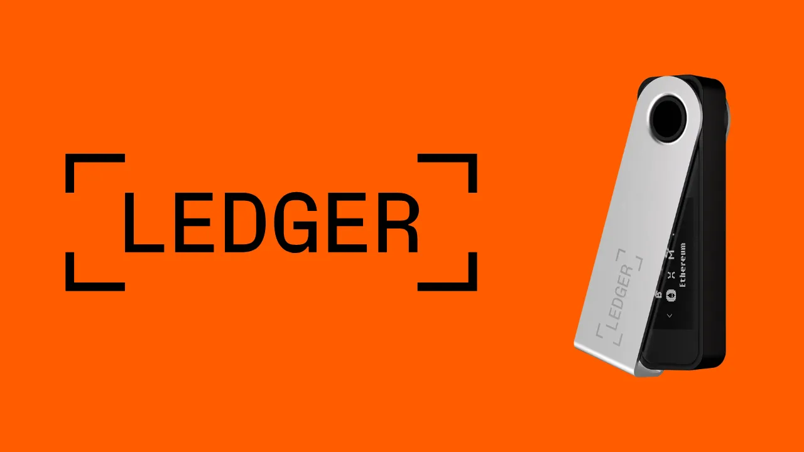

Dompet perangkat keras adalah perangkat elektronik yang didedikasikan untuk mengelola dan mengamankan kunci privat dari dompet Bitcoin. Berbeda dengan dompet perangkat lunak (atau dompet panas) yang dipasang pada mesin umum yang sering terhubung ke Internet, dompet perangkat keras memungkinkan isolasi fisik kunci privat, mengurangi risiko peretasan dan pencurian.

Tujuan utama dari dompet perangkat keras adalah untuk meminimalkan fungsionalitas perangkat sebanyak mungkin untuk mengurangi permukaan serangan. Permukaan serangan yang lebih kecil juga berarti lebih sedikit vektor serangan potensial, yaitu, lebih sedikit kelemahan dalam sistem yang dapat dieksploitasi oleh penyerang untuk mengakses bitcoin.

Disarankan untuk menggunakan dompet perangkat keras untuk mengamankan bitcoin Anda, terutama jika Anda memiliki jumlah yang signifikan, baik dalam nilai absolut maupun sebagai proporsi dari total aset Anda.

Dompet perangkat keras digunakan bersama dengan perangkat lunak manajemen dompet pada komputer atau smartphone. Perangkat lunak ini mengelola pembuatan transaksi, tetapi tanda tangan kriptografis yang diperlukan untuk memvalidasi transaksi ini hanya dilakukan di dalam dompet perangkat keras. Ini berarti bahwa kunci privat tidak pernah terpapar ke lingkungan yang berpotensi rentan.

Dompet perangkat keras menawarkan perlindungan ganda bagi pengguna: di satu sisi, mereka mengamankan bitcoin Anda dari serangan jarak jauh dengan menjaga kunci privat offline, dan di sisi lain, mereka umumnya menawarkan resistensi fisik yang lebih baik terhadap upaya untuk mengekstrak kunci. Dan tepat pada 2 kriteria keamanan ini, seseorang dapat menilai dan meranking model yang berbeda yang tersedia di pasar.

Dalam tutorial ini, saya mengusulkan untuk menemukan salah satu solusi ini: **Ledger Nano S Plus**.

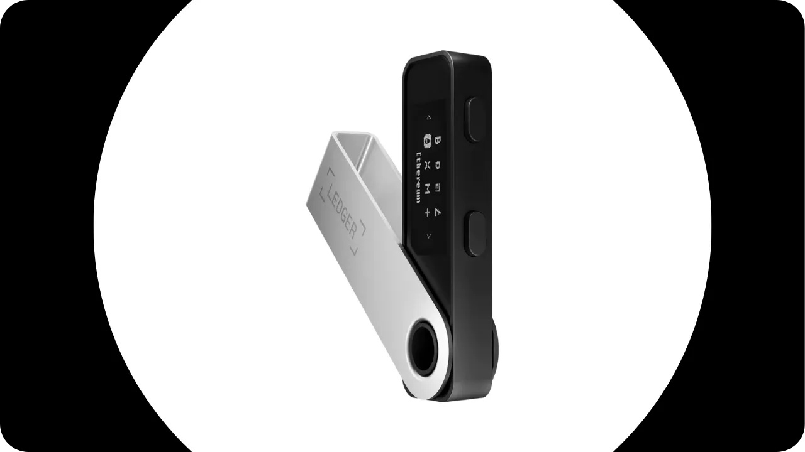

## Pengenalan ke Ledger Nano S Plus

Ledger Nano S Plus adalah dompet perangkat keras yang diproduksi oleh perusahaan Prancis Ledger, dipasarkan dengan harga 79 €.

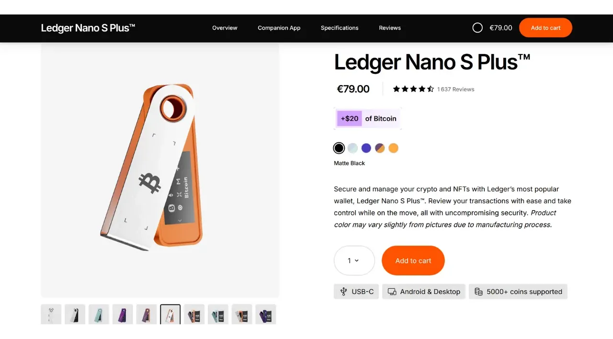

Nano S Plus dilengkapi dengan chip bersertifikat CC EAL6+ ("*elemen aman*"), yang menawarkan Anda perlindungan lanjutan terhadap serangan fisik pada perangkat keras. Layar dan tombol langsung dikontrol oleh chip ini. Sebuah titik kritik yang sering diangkat adalah bahwa kode chip ini tidak open-source, yang memerlukan kepercayaan tertentu pada integritas komponen ini. Namun, elemen ini diaudit oleh para ahli independen.

Dalam hal penggunaan, Ledger Nano S Plus hanya beroperasi melalui koneksi USB-C yang terkabel.

Ledger menonjol dari pesaingnya dengan adopsi fitur Bitcoin baru yang selalu sangat cepat, seperti Taproot atau Miniscript, misalnya, yang sangat dihargai.
Setelah mengujinya, saya menemukan bahwa Ledger Nano S Plus adalah dompet perangkat keras tingkat pemula yang sangat baik. Ini menawarkan tingkat keamanan yang tinggi dengan harga yang wajar. Kerugian utamanya dibandingkan dengan perangkat lain di kisaran harga yang sama adalah fakta bahwa kode firmware tidak open-source. Juga, layar Nano S Plus relatif kecil dibandingkan dengan model yang lebih mahal, seperti Ledger Flex atau Coldcard Q1. Namun, antarmukanya sangat dirancang dengan baik: meskipun hanya memiliki dua tombol dan layar kecil, tetap mudah digunakan, termasuk untuk fitur lanjutan seperti frasa sandi BIP39. Ledger Nano S Plus tidak memiliki baterai, koneksi Air-gap, kamera, atau port micro SD, tetapi ini cukup normal untuk kisaran harga ini.
Menurut saya, Ledger Nano S Plus merupakan pilihan yang baik untuk mengamankan dompet Bitcoin Anda, dan cocok untuk pengguna pemula maupun menengah. Namun, dalam kisaran harga ini, saya secara pribadi lebih memilih Trezor Safe 3, yang menawarkan opsi yang kurang lebih sama. Keuntungan Trezor, menurut saya, terletak pada pengelolaan elemen keamanannya: frasa mnemonik dan kunci dikelola secara eksklusif oleh kode sumber terbuka, namun tetap mendapat perlindungan dari chip. Kerugian Trezor adalah mereka terkadang sangat lambat dalam mengimplementasikan fitur baru tidak seperti Ledger.
## Bagaimana cara membeli Ledger Nano S Plus?

Ledger Nano S Plus tersedia untuk dijual [di situs resmi](https://shop.ledger.com/products/ledger-nano-s-plus). Untuk membelinya di toko fisik, Anda juga dapat menemukan [daftar reseller resmi](https://www.ledger.com/reseller) di situs web Ledger.

## Prasyarat

Setelah Anda menerima Ledger Nano Anda, langkah pertama adalah memeriksa kemasannya untuk memastikan tidak ada yang terbuka. Jika rusak, ini bisa menunjukkan bahwa dompet perangkat keras telah dikompromikan dan mungkin tidak asli.

Saat membuka, Anda seharusnya menemukan item berikut di dalam kotak:
- Ledger Nano S Plus;
- Kabel USB-C ke USB-A;
- Buku panduan pengguna;
- Kartu untuk menuliskan frasa mnemonik Anda.

Untuk tutorial ini, Anda akan memerlukan 2 aplikasi perangkat lunak: Ledger Live untuk menginisialisasi Ledger, dan Sparrow Wallet untuk mengelola dompet Bitcoin Anda. Unduh [Ledger Live](https://www.ledger.com/ledger-live) dan [Sparrow Wallet](https://sparrowwallet.com/download/) dari situs web resmi mereka.

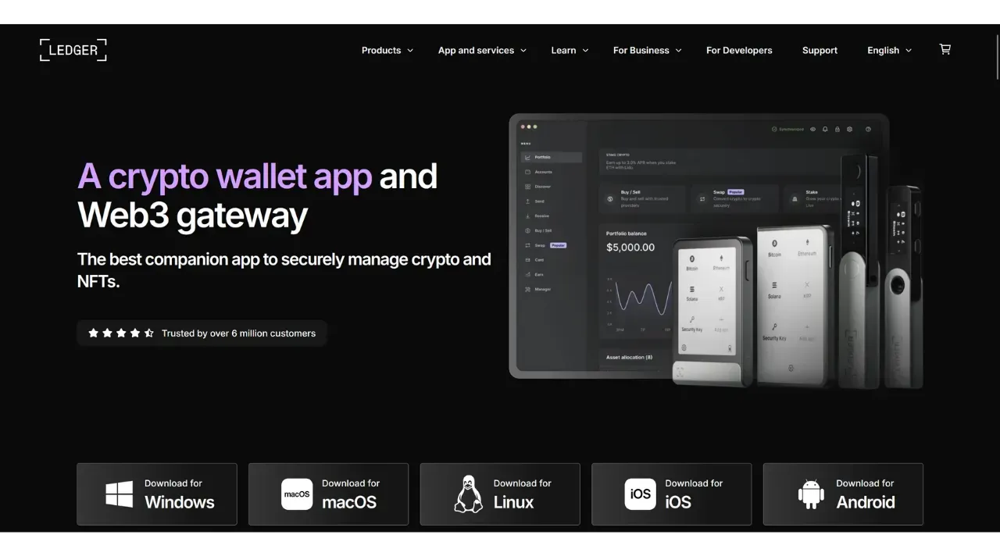
Untuk kedua program perangkat lunak ini, saya sangat menyarankan untuk memeriksa keaslian mereka (dengan GnuPG) dan integritas mereka (melalui hash) sebelum menginstalnya di mesin Anda. Jika Anda tidak yakin bagaimana melakukannya, Anda dapat mengikuti tutorial lain ini:
https://planb.network/tutorials/others/integrity-authenticity

## Bagaimana Cara Menginisialisasi Ledger Nano?

Hubungkan Nano Anda ke komputer tempat Ledger Live dan Sparrow Wallet terinstal. Untuk menavigasi di Ledger Anda, gunakan tombol kiri untuk bergerak ke kiri dan tombol kanan untuk bergerak ke kanan. Untuk memilih atau mengonfirmasi opsi, tekan kedua tombol secara bersamaan.

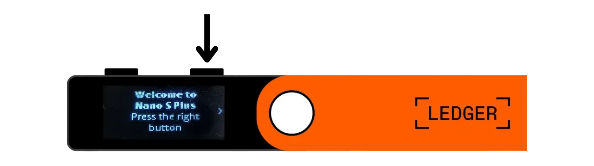

Gulir melalui berbagai halaman pengantar, lalu klik pada 2 tombol untuk memulai.

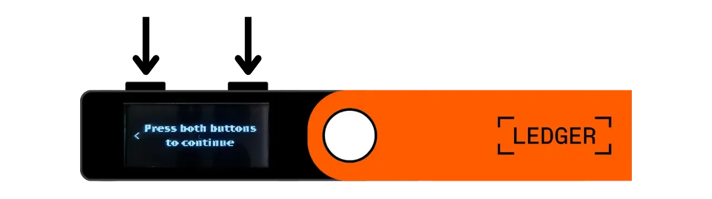

Pilih opsi "*Setup as a new device*".

Pilih kode PIN yang akan digunakan untuk membuka kunci Ledger Anda. Ini adalah perlindungan terhadap akses fisik yang tidak sah. Kode PIN ini tidak berperan dalam derivasi kunci kriptografis dompet Anda. Jadi, bahkan tanpa akses ke kode PIN ini, memiliki frasa mnemonik 24 kata Anda akan memungkinkan Anda untuk mendapatkan kembali akses ke bitcoin Anda.

Disarankan untuk memilih PIN 8 digit, seacak mungkin. Juga, pastikan untuk menyimpan kode ini di tempat yang berbeda dari tempat penyimpanan Ledger Nano S Plus Anda (misalnya, dalam pengelola kata sandi).

Gunakan tombol untuk bergerak di atas digit, lalu pilih setiap digit dengan mengklik kedua tombol secara bersamaan.

Masukkan PIN Anda untuk kedua kalinya untuk mengonfirmasinya.
Nano Anda memberikan instruksi tentang cara mengelola frasa pemulihan Anda.

**Frasa mnemonik ini memberikan akses penuh dan tidak terbatas ke semua bitcoin Anda**. Siapa pun yang memiliki frasa ini dapat mencuri dana Anda, bahkan tanpa akses fisik ke Ledger Anda. Frasa 24 kata ini memungkinkan Anda untuk mengembalikan akses ke bitcoin Anda dalam kasus kehilangan, pencurian, atau kerusakan pada Ledger Nano Anda. Oleh karena itu, sangat penting untuk menyimpan dan menyimpannya dengan hati-hati di lokasi yang aman.

Anda dapat menuliskannya di kertas karton yang disediakan bersama Ledger Anda, atau untuk keamanan yang lebih, saya merekomendasikan mengukirnya pada media stainless steel untuk melindungi dari risiko kebakaran, banjir, atau runtuh.

Anda dapat menjelajahi instruksi ini dan melewati halaman dengan mengklik tombol kanan.

Ledger akan membuat frasa mnemonik Anda menggunakan generator angka acaknya. Pastikan Anda tidak diamati selama operasi ini. Tuliskan kata-kata yang disediakan oleh Ledger pada media fisik pilihan Anda. Tergantung pada strategi keamanan Anda, Anda mungkin mempertimbangkan untuk membuat beberapa salinan fisik lengkap dari frasa tersebut (tetapi yang penting, jangan membaginya). Sangat penting untuk menjaga kata-kata tersebut bernomor dan dalam urutan berurutan.
***Jelas, Anda seharusnya tidak pernah membagikan kata-kata ini di internet, berbeda dengan apa yang saya lakukan dalam tutorial ini. Dompet contoh ini hanya akan digunakan pada Testnet dan akan dihapus setelah tutorial.***

Untuk beralih ke kata-kata berikutnya, klik tombol kanan.

Setelah semua kata dicatat, klik 2 tombol untuk beralih ke langkah selanjutnya.

Klik pada dua tombol "*Konfirmasi frasa Pemulihan Anda*", kemudian pilih kata-kata dari frasa mnemonik Anda dalam urutan mereka untuk mengonfirmasi bahwa Anda telah mencatatnya dengan benar. Gunakan tombol kiri dan kanan untuk menavigasi antar opsi, kemudian pilih kata yang benar dengan mengklik 2 tombol. Lanjutkan prosedur ini sampai kata ke-24.

Jika frasa yang Anda konfirmasi cocok persis dengan yang diberikan Ledger kepada Anda pada langkah sebelumnya, Anda dapat melanjutkan. Jika tidak, itu menunjukkan bahwa cadangan fisik frasa mnemonik Anda salah, dan Anda perlu memulai proses dari awal.

Dan begitulah, benih Anda telah berhasil dibuat di Ledger Nano S Plus Anda. Sebelum melanjutkan untuk membuat dompet Bitcoin baru dari benih ini, mari kita jelajahi pengaturan perangkat bersama-sama.

## Bagaimana cara memodifikasi pengaturan Ledger Anda?

Untuk mengakses pengaturan, tahan kedua tombol selama beberapa detik.

Klik pada menu "*Pengaturan*".

Dan pilih "*Umum*".

Di menu "*Bahasa*", Anda dapat mengubah bahasa tampilan.

Di menu "*Kecerahan*", Anda dapat menyesuaikan kecerahan layar. Kami tidak tertarik dengan pengaturan umum lainnya untuk saat ini.

Sekarang, pergilah ke bagian pengaturan "*Keamanan*".
"*Ubah PIN*" memungkinkan Anda untuk mengubah kode PIN Anda. 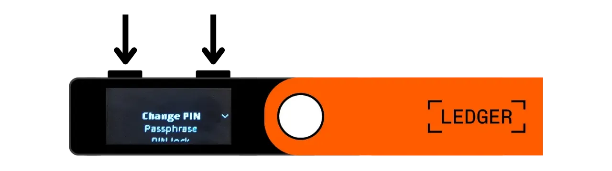
"*Passphrase*" memungkinkan Anda untuk menetapkan passphrase BIP39. Passphrase adalah kata sandi opsional yang, dikombinasikan dengan frasa pemulihan Anda, memberikan lapisan keamanan tambahan untuk dompet Anda.

Saat ini, dompet Anda dihasilkan dari frasa mnemonik yang terdiri dari 24 kata. Frasa pemulihan ini sangat penting karena memungkinkan Anda untuk mengembalikan semua kunci dompet Anda dalam kasus kehilangan. Namun, ini merupakan single point of failure (SPOF). Jika dikompromikan, bitcoin Anda berada dalam bahaya. Di sinilah passphrase berperan. Ini adalah kata sandi opsional, yang dapat Anda pilih secara sembarangan, yang ditambahkan ke frasa mnemonik untuk meningkatkan keamanan dompet.

Passphrase tidak boleh dikacaukan dengan kode PIN. Ini berperan dalam derivasi kunci kriptografis Anda. Ini bekerja bersama dengan frasa mnemonik, mengubah seed dari mana kunci dihasilkan. Jadi, bahkan jika seseorang mendapatkan frasa 24 kata Anda, tanpa passphrase, mereka tidak dapat mengakses dana Anda. Menggunakan passphrase pada dasarnya menciptakan dompet baru dengan kunci yang berbeda. Memodifikasi (bahkan sedikit) passphrase akan menghasilkan dompet yang berbeda.

Passphrase adalah alat yang sangat kuat untuk meningkatkan keamanan bitcoin Anda. Namun, sangat penting untuk memahami cara kerjanya sebelum mengimplementasikannya, untuk menghindari kehilangan akses ke dompet Anda. Inilah mengapa saya menyarankan Anda untuk berkonsultasi dengan tutorial lain ini yang didedikasikan jika Anda ingin menetapkan passphrase pada Ledger Anda:

https://planb.network/tutorials/wallet/passphrase-ledger

Menu "*PIN lock*" memungkinkan Anda untuk mengonfigurasi dan mengaktifkan penguncian otomatis Ledger Anda setelah periode ketidakaktifan yang ditentukan.

Menu "*Screen saver*" memungkinkan Anda untuk menyesuaikan mode tidur dari Ledger Nano Anda. Perlu dicatat bahwa screen saver tidak memerlukan entri PIN saat bangun, kecuali jika opsi "*PIN lock*" diaktifkan untuk sesuai dengan mode tidur. Fitur ini sangat berguna untuk perangkat Ledger Nano X yang dilengkapi dengan baterai, untuk mengurangi konsumsi energi mereka.

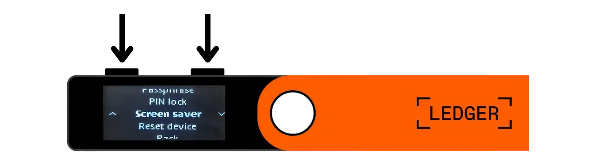

Akhirnya, menu "*Reset device*" memungkinkan Anda untuk mereset Ledger Anda. Lanjutkan dengan reset ini hanya jika Anda yakin tidak mengandung kunci apa pun yang mengamankan bitcoin, karena Anda bisa kehilangan akses ke dana Anda secara permanen. Opsi ini bisa berguna untuk melakukan tes pemulihan kosong, tetapi saya akan membicarakan ini sedikit lebih lanjut nanti.

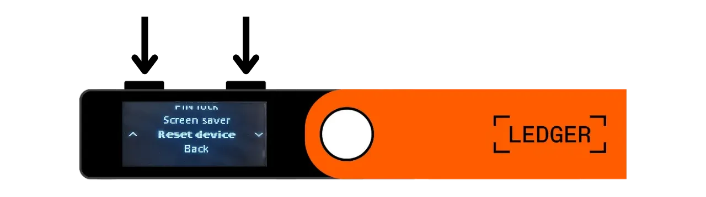
## Bagaimana Cara Memasang Aplikasi Bitcoin?

Mulailah dengan meluncurkan perangkat lunak Ledger Live di komputer Anda, kemudian sambungkan dan buka kunci Ledger Nano Anda. Di Ledger Live, pergi ke menu "*My Ledger*". Anda akan diminta untuk mengizinkan akses ke Nano Anda.

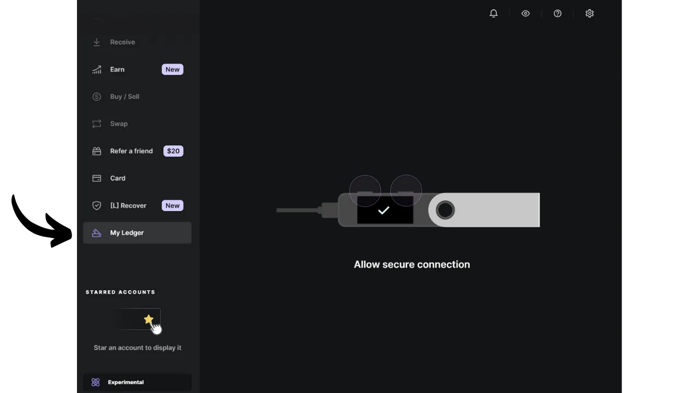

Validasi akses di Ledger Anda dengan mengklik dua tombol.

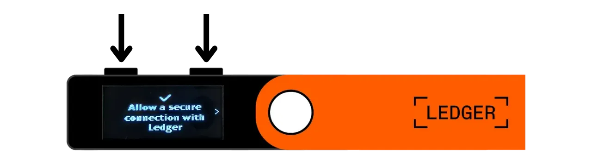

Pertama, di Ledger Live, pastikan "*Genuine check*" muncul. Ini mengonfirmasi bahwa perangkat Anda asli.

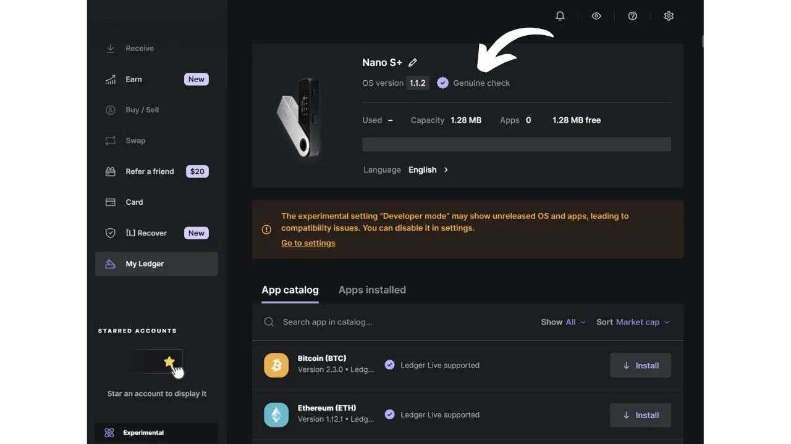

Jika firmware dari Ledger Nano Anda tidak terbaru, Ledger Live secara otomatis akan menawarkan untuk memperbaruinya. Jika perlu, klik pada "*Update firmware*", kemudian pada "*Install update*" untuk memulai instalasi. Di Ledger Anda, klik dua tombol untuk mengonfirmasi, kemudian tunggu selama instalasi.
Akhirnya, kita akan menambahkan aplikasi Bitcoin. Untuk melakukan ini, di Ledger Live, klik tombol "*Install*" di sebelah "*Bitcoin (BTC)*".
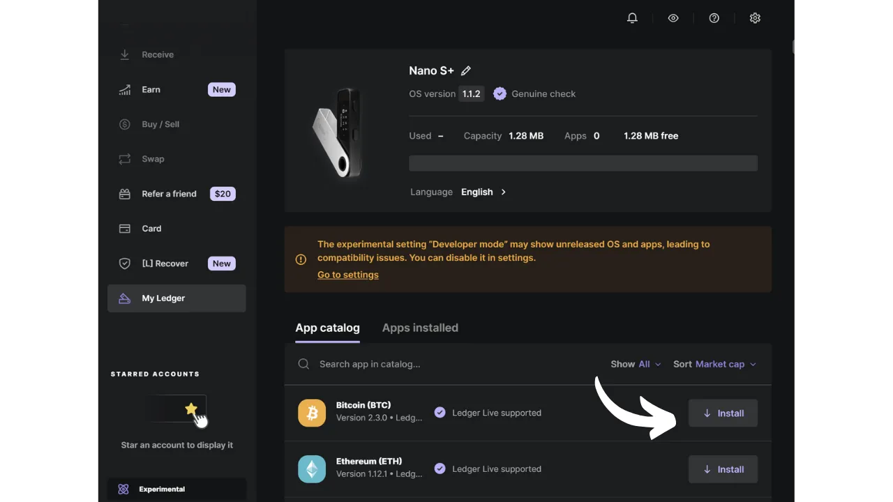

Aplikasi akan terinstal pada Nano Anda.

Mulai sekarang, Anda tidak akan lagi memerlukan perangkat lunak Ledger Live untuk pengelolaan dompet Anda secara reguler. Anda dapat sesekali kembali ke sana untuk memperbarui firmware ketika versi baru tersedia. Untuk segala hal lainnya, kita akan menggunakan Sparrow Wallet, yang merupakan alat yang jauh lebih komprehensif untuk mengelola dompet Bitcoin secara efektif.

## Bagaimana Cara Menyiapkan Dompet Bitcoin Baru dengan Sparrow?

Buka Sparrow Wallet dan lewati halaman pengantar untuk mengakses layar utama. Periksa bahwa Anda terhubung dengan benar ke sebuah node dengan mengamati sakelar yang terletak di pojok kanan bawah layar.

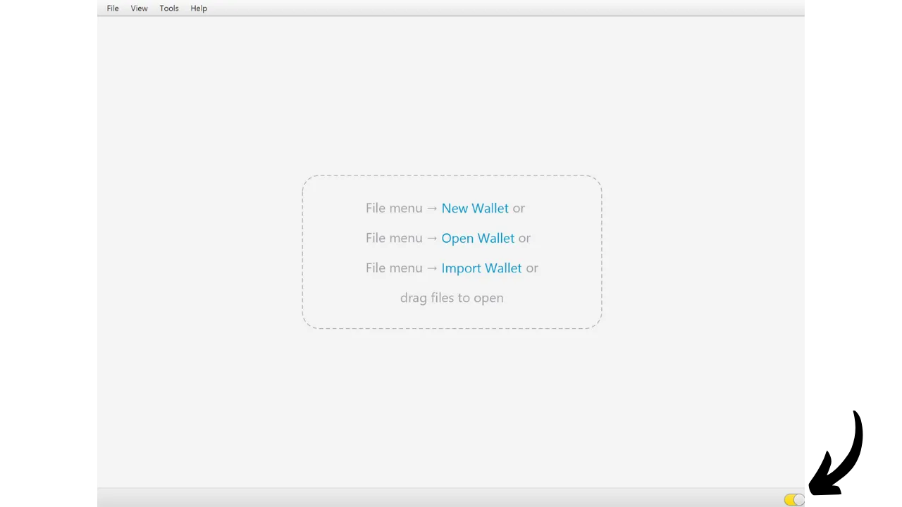

Saya sangat merekomendasikan menggunakan node Bitcoin Anda sendiri. Dalam tutorial ini, saya menggunakan node publik (kuning) karena saya berada di testnet, tetapi untuk penggunaan normal, lebih baik memilih Bitcoin Core lokal (hijau) atau server Electrum yang terhubung ke node jarak jauh (biru).

Klik pada menu "*File*" kemudian "*New Wallet*".

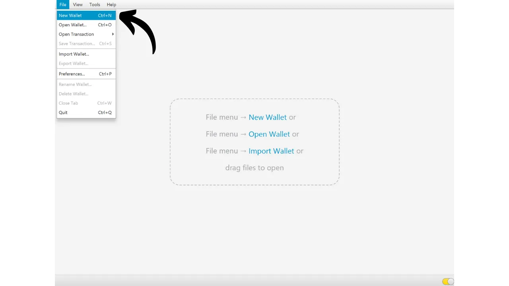

Pilih nama untuk dompet ini, kemudian klik pada "*Create Wallet*".

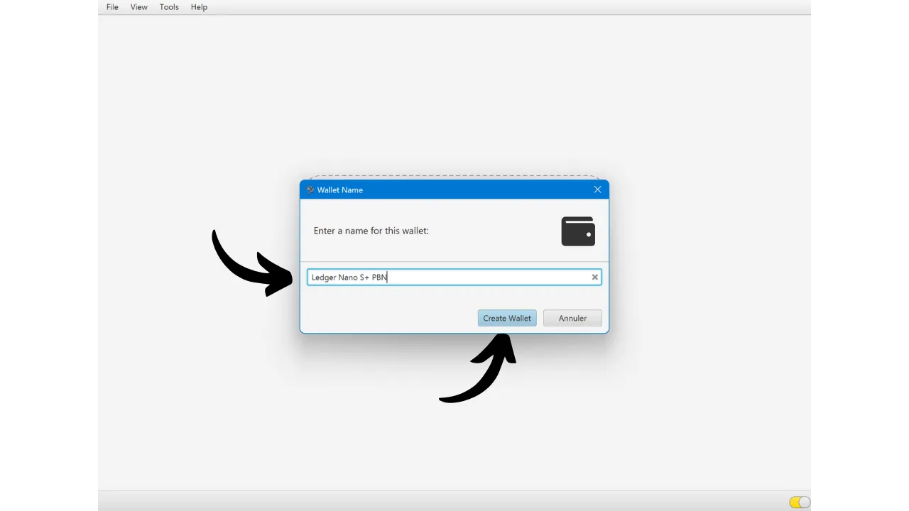

Di menu dropdown "*Script Type*", pilih jenis skrip yang akan digunakan untuk mengamankan bitcoin Anda. Saya merekomendasikan untuk memilih "*Taproot*", atau jika tidak tersedia, "*Native SegWit*".

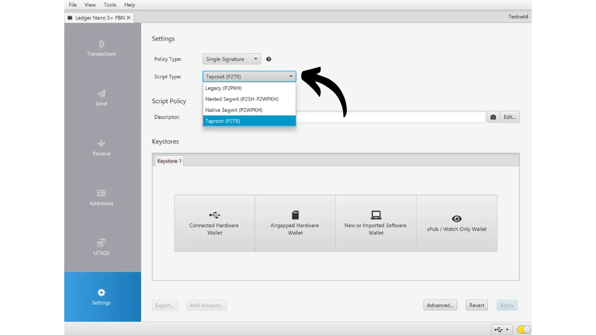
Klik pada tombol "*Connected Hardware Wallet*".
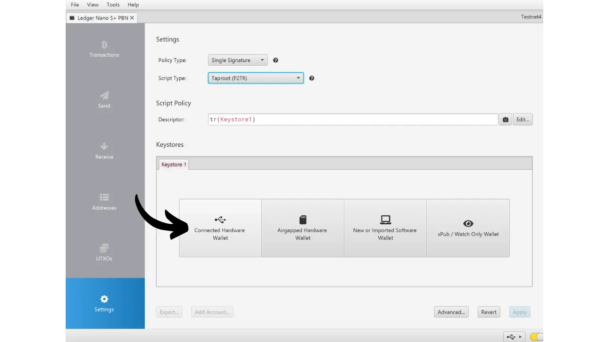

Jika Anda belum melakukannya, hubungkan Ledger Nano S Plus Anda ke komputer, buka kunci dengan kode PIN Anda, dan kemudian buka aplikasi "*Bitcoin*" dengan mengklik 2 tombol sekali pada logo Bitcoin.

*Dalam tutorial ini, saya menggunakan aplikasi Bitcoin Testnet, tetapi prosedurnya tetap sama untuk mainnet.*

Di Sparrow, klik pada tombol "*Scan*".

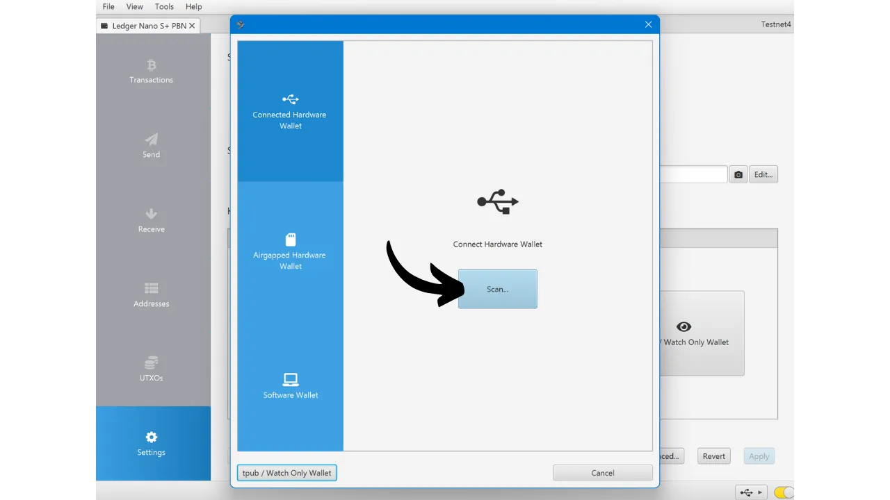

Kemudian klik pada "*Import Keystore*".

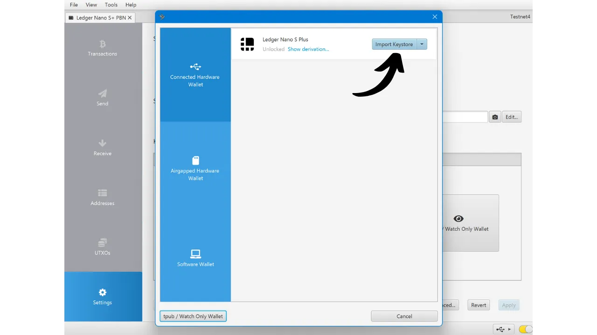

Anda sekarang dapat melihat detail dompet Anda, termasuk kunci publik yang diperluas dari akun pertama Anda. Klik pada tombol "*Apply*" untuk menyelesaikan pembuatan dompet.

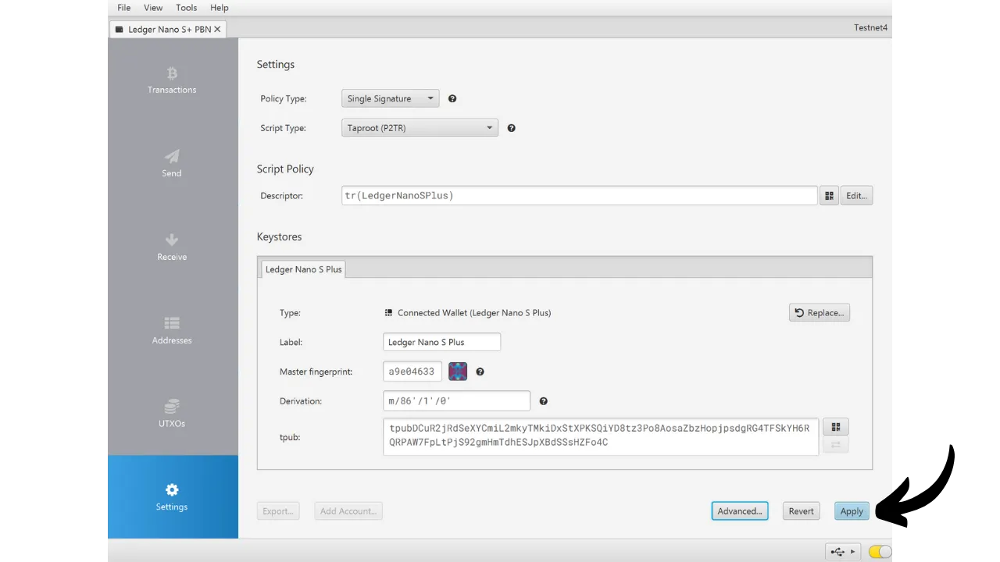

Pilih kata sandi yang kuat untuk mengamankan akses ke Sparrow Wallet. Kata sandi ini akan memastikan keamanan akses ke data dompet Anda di Sparrow, yang membantu melindungi kunci publik Anda, alamat, label, dan riwayat transaksi dari akses tidak sah.

Saya menyarankan Anda untuk menyimpan kata sandi ini di pengelola kata sandi agar Anda tidak lupa.

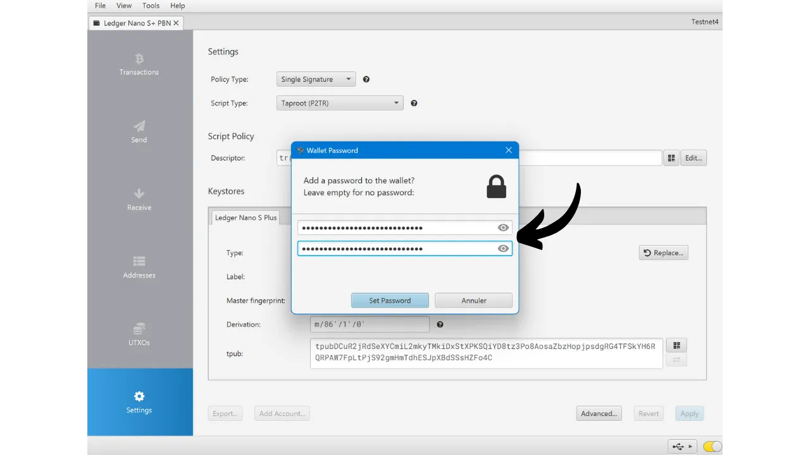

Dan sekarang, dompet Anda telah dibuat!

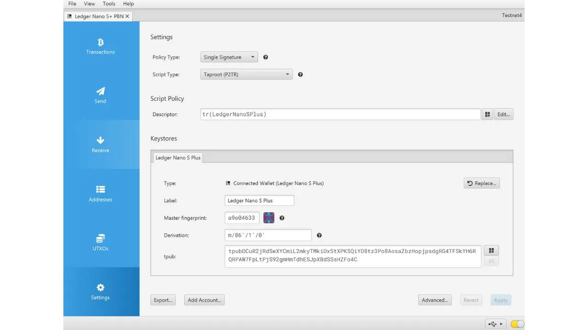
Sebelum Anda menerima bitcoin pertama Anda di dompet Anda, **saya sangat menyarankan Anda untuk melakukan tes pemulihan tanpa transaksi**. Catat informasi referensi, seperti xpub Anda, kemudian reset Ledger Nano Anda sementara dompet masih kosong. Setelah itu, coba pulihkan dompet Anda di Ledger menggunakan cadangan kertas Anda. Periksa bahwa xpub yang dihasilkan setelah pemulihan cocok dengan yang Anda catat awalnya. Jika iya, Anda dapat yakin bahwa cadangan kertas Anda dapat diandalkan.
Untuk mempelajari lebih lanjut tentang cara melakukan tes pemulihan, saya menyarankan Anda untuk berkonsultasi dengan tutorial lain ini:

https://planb.network/tutorials/wallet/recovery-test

## Bagaimana cara menerima bitcoin dengan Ledger Nano?

Klik pada tab "*Receive*".

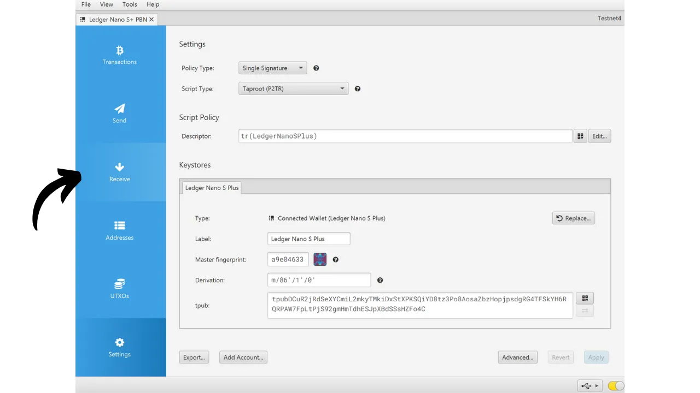

Hubungkan Ledger Nano S Plus Anda ke komputer, buka kunci dengan kode PIN Anda, kemudian buka aplikasi "*Bitcoin*".

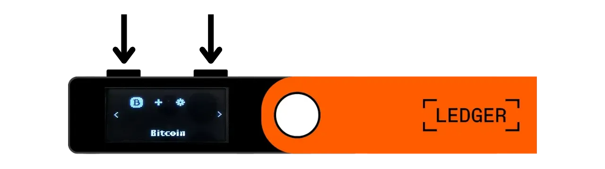
Sebelum menggunakan alamat yang disediakan oleh Sparrow Wallet, verifikasi di layar Ledger Anda. Praktik ini memungkinkan Anda untuk memastikan bahwa alamat yang ditampilkan di Sparrow tidak palsu dan bahwa dompet perangkat keras memang memiliki kunci privat yang diperlukan untuk menghabiskan bitcoin yang diamankan dengan alamat ini nanti. Ini membantu Anda menghindari beberapa jenis serangan.
Untuk melakukan verifikasi ini, klik pada tombol "*Display Address*".

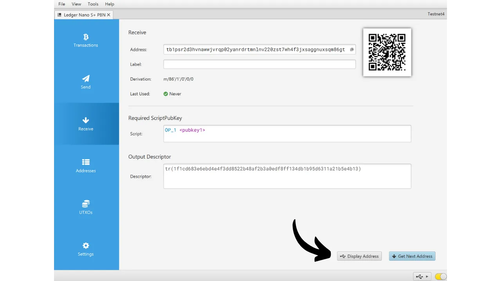

Pastikan bahwa alamat yang ditampilkan di Ledger Anda cocok dengan yang ditunjukkan di Sparrow Wallet. Juga disarankan untuk melakukan verifikasi ini tepat sebelum memberikan alamat Anda kepada pengirim, untuk memastikan validitasnya. Anda dapat menggunakan tombol untuk melihat alamat lengkap.

Kemudian klik pada "*Approve*" jika alamatnya memang identik.

Anda dapat menambahkan "*Label*" untuk mendeskripsikan sumber bitcoin yang akan diamankan dengan alamat ini. Ini adalah praktik yang baik yang membantu Anda mengelola UTXO Anda dengan lebih baik.

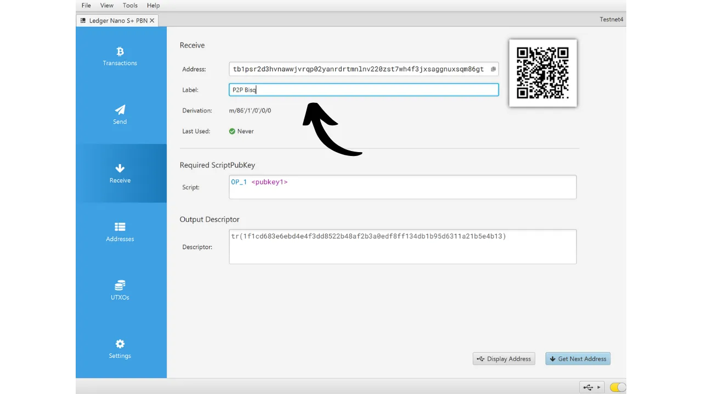

Untuk informasi lebih lanjut tentang pelabelan, saya juga menyarankan Anda untuk memeriksa tutorial lain ini:

https://planb.network/tutorials/privacy/utxo-labelling

Anda kemudian dapat menggunakan alamat ini untuk menerima bitcoin.

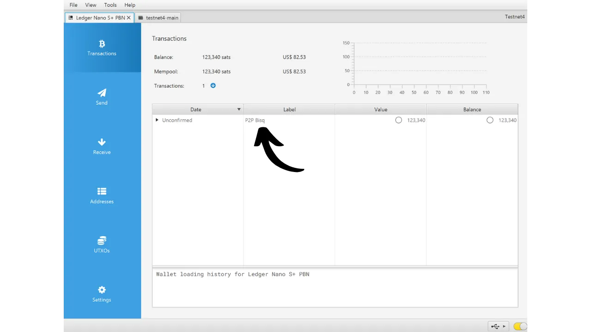

## Bagaimana cara mengirim bitcoin dengan Ledger Nano?

Sekarang setelah Anda menerima sats pertama Anda di dompet yang diamankan dengan Nano S Plus, Anda juga dapat menghabiskannya! Hubungkan Ledger Anda ke komputer, buka kunci, luncurkan Sparrow Wallet, dan kemudian pergi ke tab "*Send*" untuk membuat transaksi baru.

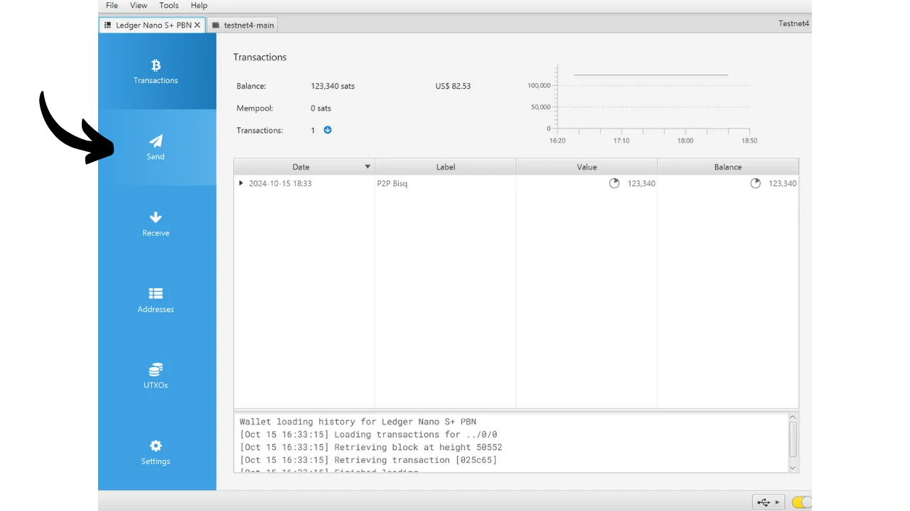

Jika Anda ingin melakukan "*coin control*", yang berarti secara spesifik memilih UTXO mana yang akan dikonsumsi dalam transaksi, pergi ke tab "*UTXOs*". Pilih UTXO yang ingin Anda habiskan, kemudian klik pada "*Send Selected*". Anda akan diarahkan ke layar yang sama dari tab "*Send*", tetapi dengan UTXO Anda sudah dipilih untuk transaksi.

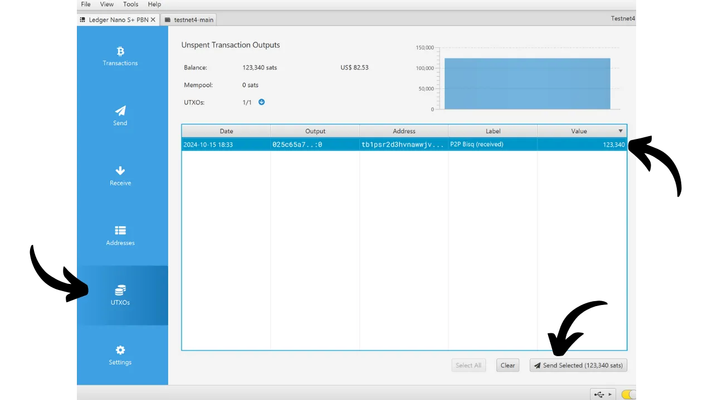

Masukkan alamat tujuan. Anda juga dapat memasukkan beberapa alamat dengan mengklik tombol "*+ Add*".

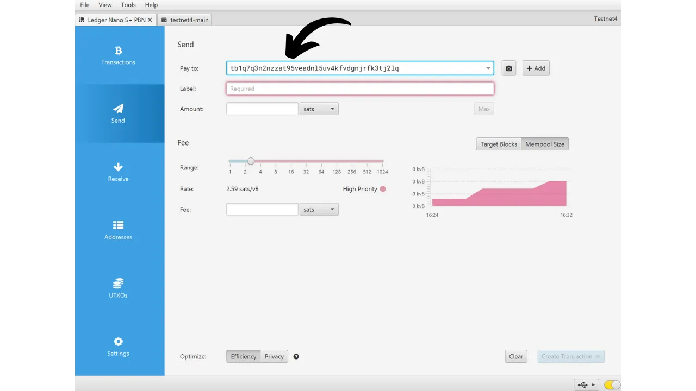

Catat sebuah "*Label*" untuk mengingat tujuan pengeluaran ini.

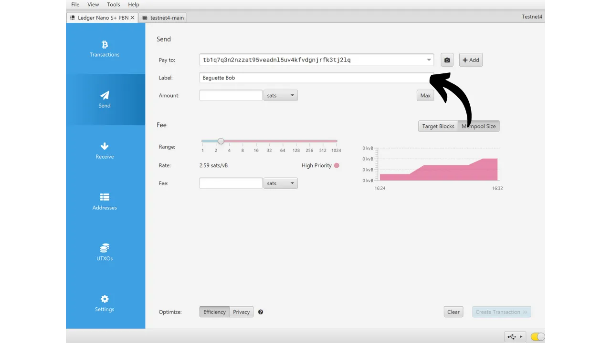
Pilih jumlah yang akan dikirim ke alamat ini.
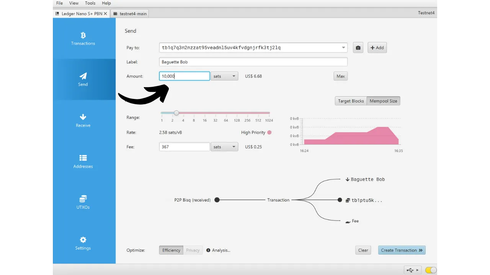

Sesuaikan tarif biaya transaksi sesuai dengan pasar saat ini.

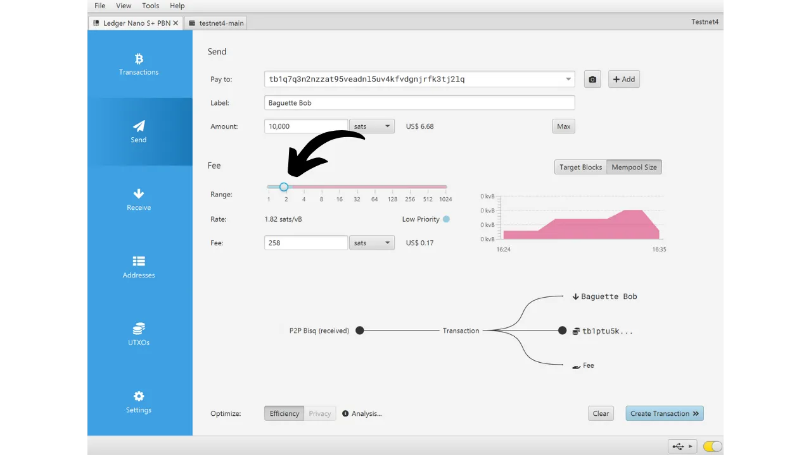
Pastikan semua pengaturan transaksi Anda sudah benar, kemudian klik pada "*Create Transaction*".
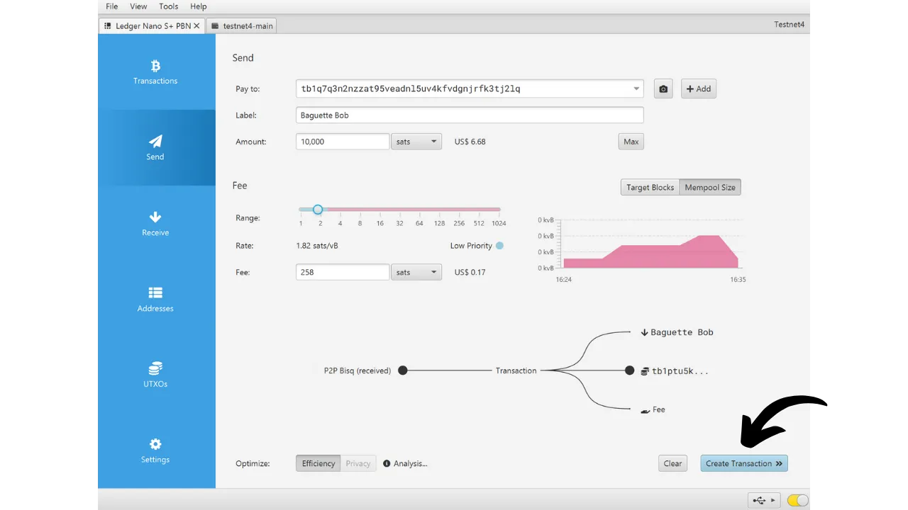

Jika semuanya terlihat baik bagi Anda, klik pada "*Finalize Transaction for Signing*".

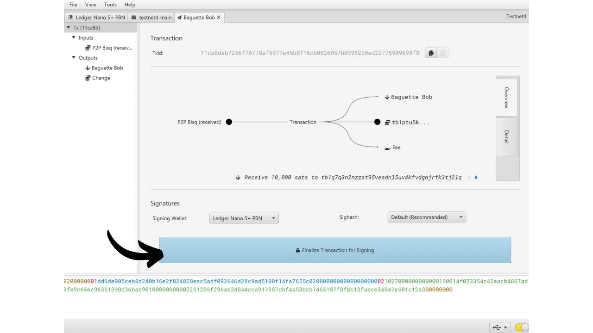

Klik pada "*Sign*".

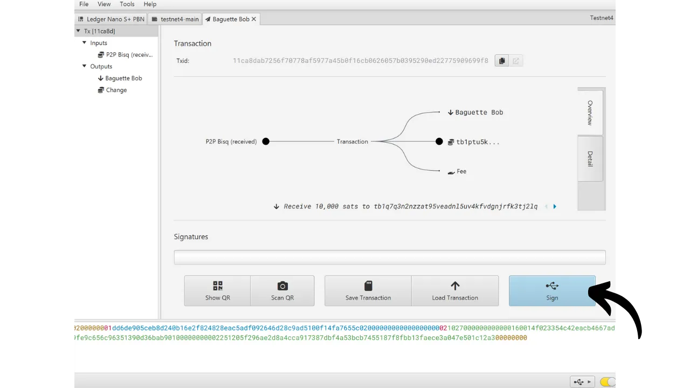

Klik pada "*Sign*" di sebelah Ledger Nano S Plus Anda.

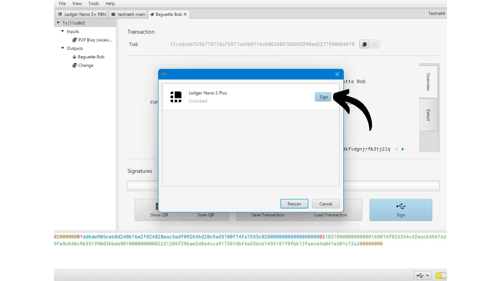

Verifikasi pengaturan transaksi di layar Ledger Anda, termasuk alamat penerima, jumlah yang dikirim, dan jumlah biaya.

Jika semuanya terlihat baik bagi Anda, tekan dua tombol pada "*Sign transaction*" untuk menandatangani.

Transaksi Anda sekarang sudah ditandatangani. Periksa kembali semuanya terlihat baik bagi Anda, kemudian klik pada "*Broadcast Transaction*" untuk menyiarkannya di jaringan Bitcoin.

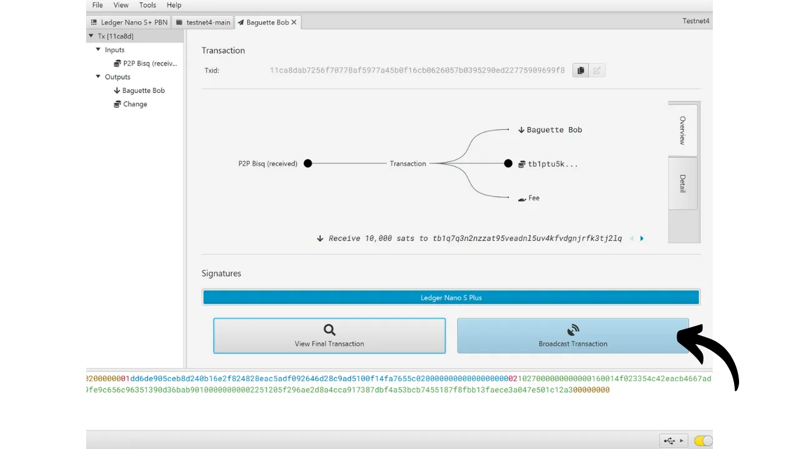

Anda dapat menemukannya di tab "*Transactions*" dari Sparrow Wallet.

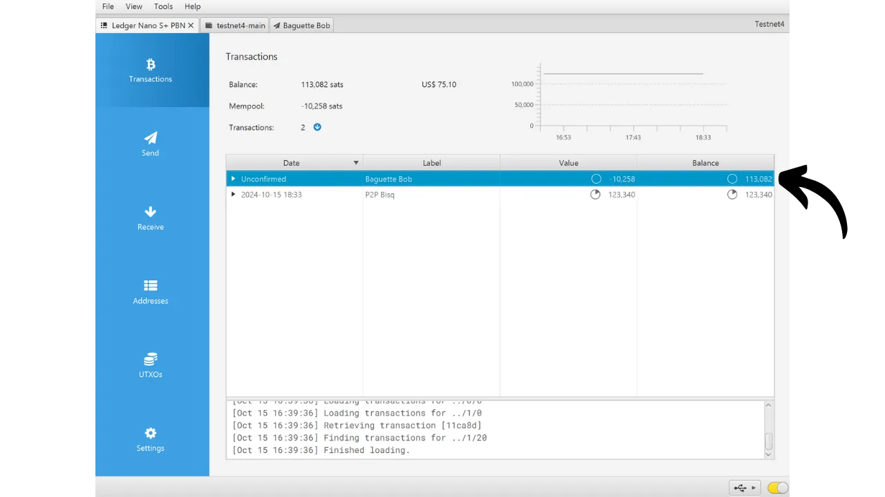

Selamat, Anda sekarang sudah menguasai penggunaan dasar Ledger Nano S Plus dengan Sparrow Wallet! Dalam tutorial mendatang, kita akan melihat cara menggunakan Ledger dengan Liana untuk memanfaatkan Miniscript.

Jika Anda merasa tutorial ini bermanfaat, saya akan sangat menghargai jika Anda bisa memberikan jempol ke atas di bawah ini. Jangan ragu untuk membagikan artikel ini di jaringan sosial Anda. Terima kasih banyak!

Saya juga merekomendasikan Anda untuk memeriksa tutorial lengkap ini tentang Ledger Flex:

https://planb.network/tutorials/wallet/ledger-flex