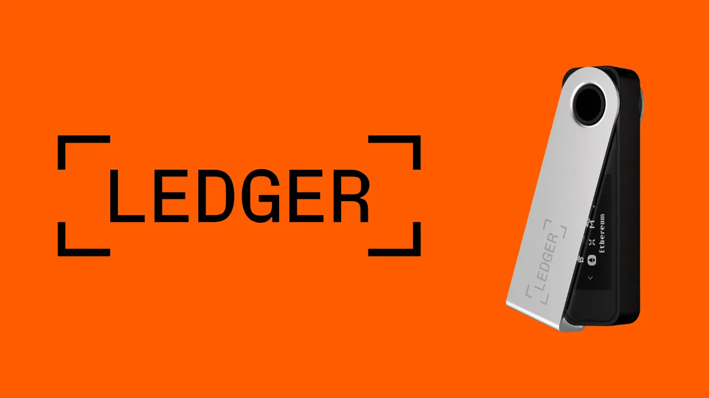

Dompet perangkat keras adalah perangkat elektronik yang didedikasikan untuk mengelola dan mengamankan kunci privat dari dompet Bitcoin. Berbeda dengan dompet perangkat lunak (atau dompet panas) yang dipasang pada mesin umum yang sering terhubung ke Internet, dompet perangkat keras memungkinkan isolasi fisik kunci privat, sehingga mengurangi risiko peretasan dan pencurian.

Tujuan utama dari dompet perangkat keras adalah meminimalkan fungsionalitas perangkat sebanyak mungkin untuk mengurangi permukaan serangan. Permukaan serangan yang lebih kecil juga berarti lebih sedikit vektor serangan potensial, yaitu lebih sedikit kelemahan dalam sistem yang dapat dieksploitasi oleh penyerang untuk mengakses bitcoin.

Disarankan untuk menggunakan dompet perangkat keras untuk mengamankan bitcoin kamu, terutama jika kamu memiliki jumlah yang signifikan, baik dalam nilai absolut maupun sebagai proporsi dari total aset kamu.

Dompet perangkat keras digunakan bersama dengan perangkat lunak manajemen dompet pada komputer atau smartphone. Perangkat lunak ini mengelola pembuatan transaksi, tetapi tanda tangan kriptografis yang diperlukan untuk memvalidasi transaksi ini hanya dilakukan di dalam dompet perangkat keras. Ini berarti kunci privat tidak pernah terpapar ke lingkungan yang berpotensi rentan.

Dompet perangkat keras menawarkan perlindungan ganda bagi pengguna: di satu sisi, perangkat ini mengamankan bitcoin kamu dari serangan jarak jauh dengan menjaga kunci privat tetap offline, dan di sisi lain, perangkat ini umumnya menawarkan resistensi fisik yang lebih baik terhadap upaya mengekstrak kunci. Dan tepat pada dua kriteria keamanan ini, kamu bisa menilai dan membandingkan model berbeda yang tersedia di pasar.

Dalam tutorial ini, aku mengajak kamu untuk mengenal salah satu solusi ini: **Ledger Nano S Plus**.

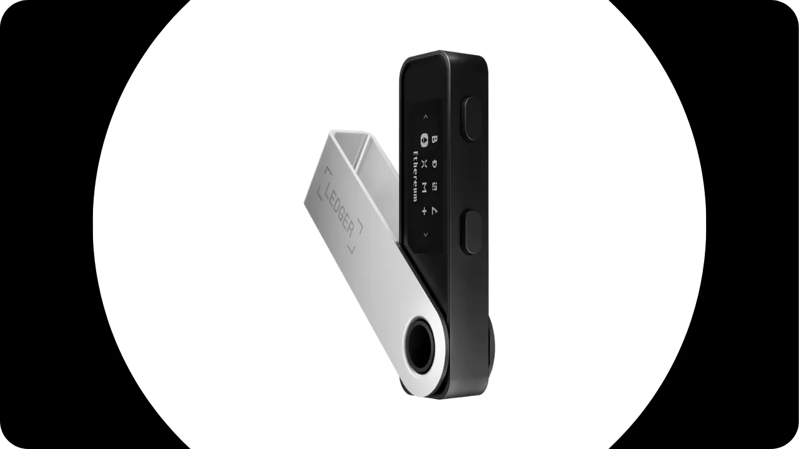

## Pengenalan ke Ledger Nano S Plus

Ledger Nano S Plus adalah dompet perangkat keras yang diproduksi oleh perusahaan Prancis Ledger, dipasarkan dengan harga 79 €.

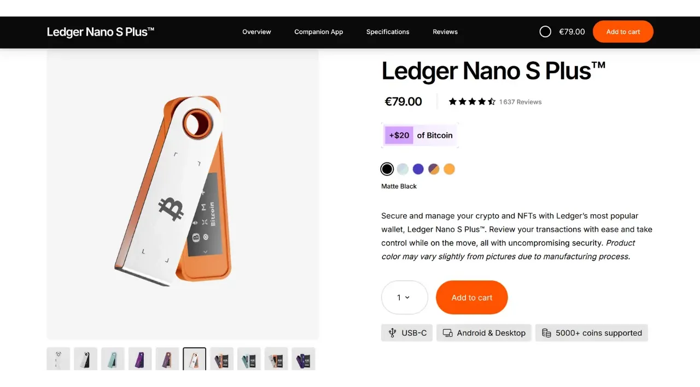

Nano S Plus dilengkapi dengan chip bersertifikat CC EAL6+ ("*elemen aman*"), yang menawarkan kamu perlindungan lanjutan terhadap serangan fisik pada perangkat keras. Layar dan tombol langsung dikontrol oleh chip ini. Salah satu kritik yang sering diangkat adalah bahwa kode chip ini tidak open-source, yang berarti memerlukan tingkat kepercayaan tertentu terhadap integritas komponen tersebut. Namun, elemen ini telah diaudit oleh para ahli independen.

Dalam hal penggunaan, Ledger Nano S Plus hanya beroperasi melalui koneksi USB-C berkabel.

Ledger menonjol dari para pesaingnya karena adopsi fitur Bitcoin baru yang biasanya sangat cepat, seperti Taproot atau Miniscript, misalnya, yang sangat dihargai. Setelah mengujinya, aku menemukan bahwa Ledger Nano S Plus adalah dompet perangkat keras tingkat pemula yang sangat baik. Perangkat ini menawarkan tingkat keamanan yang tinggi dengan harga yang wajar. Kekurangan utamanya dibandingkan perangkat lain di kisaran harga yang sama adalah fakta bahwa kode firmware-nya tidak open-source. Selain itu, layar Nano S Plus relatif kecil dibandingkan model yang lebih mahal, seperti Ledger Flex atau Coldcard Q1. Namun, antarmukanya dirancang dengan sangat baik: meskipun hanya memiliki dua tombol dan layar kecil, tetap mudah digunakan, termasuk untuk fitur lanjutan seperti frasa sandi BIP39. Ledger Nano S Plus tidak memiliki baterai, koneksi air-gapped, kamera, atau port micro SD, tetapi ini cukup normal untuk kisaran harga ini.

Menurutku, Ledger Nano S Plus merupakan pilihan yang baik untuk mengamankan dompet Bitcoin kamu, dan cocok untuk pengguna pemula maupun menengah. Namun, dalam kisaran harga ini, aku secara pribadi lebih memilih Trezor Safe 3, yang menawarkan opsi yang kurang lebih sama. Keunggulan Trezor, menurutku, terletak pada pengelolaan elemen keamanannya: seedphrase dan kunci dikelola secara eksklusif oleh kode sumber terbuka, tetapi tetap mendapat perlindungan dari chip. Kekurangan Trezor adalah mereka terkadang cukup lambat dalam mengimplementasikan fitur baru dibandingkan Ledger.

## Bagaimana cara membeli Ledger Nano S Plus?

Ledger Nano S Plus tersedia untuk dijual [di situs resmi](https://shop.ledger.com/products/ledger-nano-s-plus). Untuk membelinya di toko fisik, Kamu juga dapat menemukan [daftar reseller resmi](https://www.ledger.com/reseller) di situs web Ledger.

## Prasyarat

Setelah kamu menerima Ledger Nano kamu, langkah pertama adalah memeriksa kemasannya untuk memastikan tidak ada yang sudah terbuka. Jika rusak, ini bisa menjadi indikasi bahwa dompet perangkat keras telah dikompromikan dan mungkin tidak asli.

Saat membuka, kamu seharusnya menemukan item berikut di dalam kotak:
- Ledger Nano S Plus;
- Kabel USB-C ke USB-A;
- Buku panduan pengguna;
- Kartu untuk menuliskan seedphrase kamu.

Untuk tutorial ini, kamu akan memerlukan 2 aplikasi perangkat lunak: Ledger Live untuk menginisialisasi Ledger, dan Sparrow Wallet untuk mengelola dompet Bitcoin kamu. Unduh [Ledger Live](https://www.ledger.com/ledger-live) dan [Sparrow Wallet](https://sparrowwallet.com/download/) dari situs web resmi mereka.

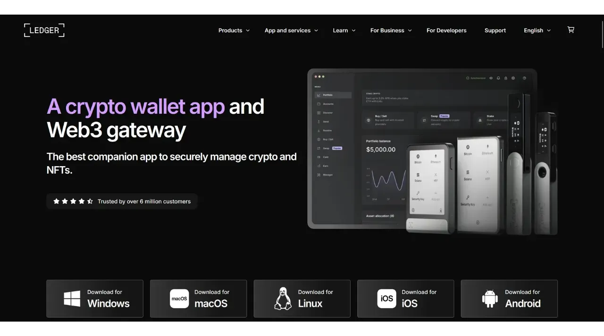
Untuk kedua program perangkat lunak ini, aku sangat menyarankan untuk memeriksa keaslian (dengan GnuPG) dan integritasnya (melalui hash) sebelum menginstalnya di mesin kamu. Jika kamu belum yakin bagaimana melakukannya, kamu bisa mengikuti tutorial lain ini:
https://planb.academy/tutorials/computer-security/data/integrity-authenticity-21d0420a-be02-4663-94a3-8d487f23becc

## Bagaimana Cara Menginisialisasi Ledger Nano?

Hubungkan Nano kamu ke komputer tempat Ledger Live dan Sparrow Wallet sudah terinstal. Untuk bernavigasi di Ledger kamu, gunakan tombol kiri untuk bergerak ke kiri dan tombol kanan untuk bergerak ke kanan. Untuk memilih atau mengonfirmasi opsi, tekan kedua tombol secara bersamaan.

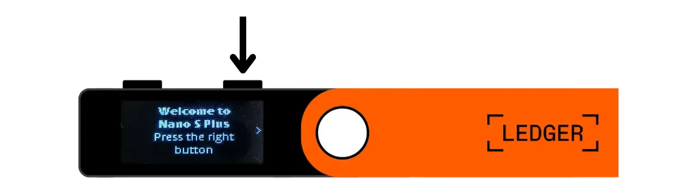

Gulir melalui berbagai halaman pengantar, lalu klik pada 2 tombol untuk memulai.

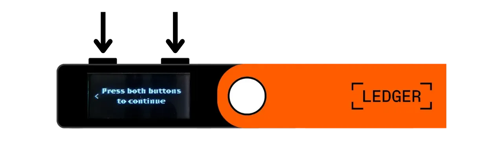

Pilih opsi "*Setup as a new device*".

Pilih kode PIN yang akan digunakan untuk membuka kunci Ledger kamu. Ini adalah perlindungan terhadap akses fisik yang tidak sah. Kode PIN ini tidak berperan dalam derivasi kunci kriptografis dompet kamu. Jadi, bahkan tanpa akses ke kode PIN ini, memiliki frasa mnemonik 24 kata kamu akan memungkinkan kamu mendapatkan kembali akses ke bitcoin kamu.

Disarankan untuk memilih PIN 8 digit, seacak mungkin. Selain itu, pastikan untuk menyimpan kode ini di tempat yang berbeda dari tempat penyimpanan Ledger Nano S Plus kamu (misalnya, di pengelola kata sandi).

Gunakan tombol untuk berpindah di antara digit, lalu pilih setiap digit dengan menekan kedua tombol secara bersamaan.

Masukkan PIN kamu untuk kedua kalinya untuk mengonfirmasinya.  
Nano kamu akan memberikan instruksi tentang cara mengelola frasa pemulihan kamu.

**Frasa mnemonik ini memberikan akses penuh dan tidak terbatas ke semua bitcoin kamu**. Siapa pun yang memiliki frasa ini dapat mencuri dana kamu, bahkan tanpa akses fisik ke Ledger kamu. Frasa 24 kata ini memungkinkan kamu memulihkan akses ke bitcoin kamu jika Ledger Nano kamu hilang, dicuri, atau rusak. Karena itu, sangat penting untuk menyimpan dan menjaganya dengan hati-hati di lokasi yang aman.

Kamu bisa menuliskannya di kartu kertas yang disediakan bersama Ledger kamu, atau untuk keamanan lebih, aku merekomendasikan untuk mengukirnya pada media stainless steel agar terlindung dari risiko kebakaran, banjir, atau keruntuhan.

Kamu bisa menelusuri instruksi ini dan berpindah halaman dengan mengklik tombol kanan.

Ledger akan membuat frasa mnemonik kamu menggunakan generator angka acak internalnya. Pastikan kamu tidak sedang diamati selama proses ini. Tuliskan kata-kata yang disediakan oleh Ledger pada media fisik pilihan kamu. Bergantung pada strategi keamanan kamu, kamu bisa mempertimbangkan membuat beberapa salinan fisik lengkap dari frasa tersebut (yang penting, jangan membagikannya). Sangat penting untuk menjaga kata-kata tersebut tetap bernomor dan dalam urutan yang benar.

***Jelas, kamu tidak boleh pernah membagikan kata-kata ini di internet, berbeda dengan yang aku lakukan dalam tutorial ini. Dompet contoh ini hanya akan digunakan pada Testnet dan akan dihapus setelah tutorial.***

Untuk beralih ke kata-kata berikutnya, klik tombol kanan.

Setelah semua kata dicatat, tekan kedua tombol untuk beralih ke langkah selanjutnya.

Klik kedua tombol pada "*Konfirmasi frasa Pemulihan kamu*", lalu pilih kata-kata dari frasa mnemonik kamu sesuai urutannya untuk mengonfirmasi bahwa kamu sudah mencatatnya dengan benar. Gunakan tombol kiri dan kanan untuk bernavigasi antar opsi, lalu pilih kata yang benar dengan menekan kedua tombol. Lanjutkan prosedur ini sampai kata ke-24.

Jika frasa yang kamu konfirmasi cocok persis dengan yang diberikan Ledger pada langkah sebelumnya, kamu bisa melanjutkan. Jika tidak, itu berarti cadangan fisik seedphrase kamu salah, dan kamu perlu memulai proses dari awal.

Dan selesai, seedphrase kamu sudah berhasil dibuat di Ledger Nano S Plus kamu. Sebelum melanjutkan ke pembuatan dompet Bitcoin baru dari seedphrase ini, mari kita jelajahi pengaturan perangkat bersama-sama.

## Bagaimana cara memodifikasi pengaturan Ledger kamu?

Untuk mengakses pengaturan, tahan kedua tombol selama beberapa detik.

Klik menu "*Pengaturan*".

Lalu pilih "*Umum*".

Di menu "*Bahasa*", kamu bisa mengubah bahasa tampilan.

Di menu "*Kecerahan*", kamu bisa menyesuaikan kecerahan layar. Untuk saat ini, kita tidak perlu membahas pengaturan umum lainnya.

Sekarang, pergilah ke bagian pengaturan "*Keamanan*".
"*Ubah PIN*" memungkinkanmu untuk mengubah kode PIN kamu. 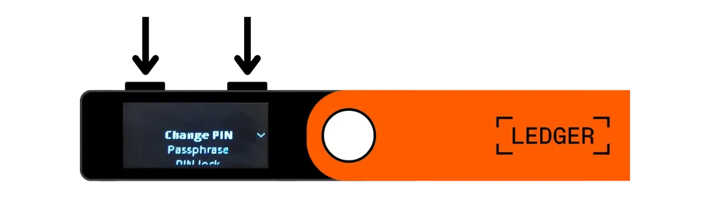
"*Passphrase*" memungkinkan kamu untuk menetapkan passphrase BIP39. Passphrase adalah kata sandi opsional yang, jika dikombinasikan dengan frasa pemulihan kamu, memberikan lapisan keamanan tambahan untuk dompet kamu.

Saat ini, dompet kamu dihasilkan dari frasa mnemonik yang terdiri dari 24 kata. Frasa pemulihan ini sangat penting karena memungkinkan kamu memulihkan semua kunci dompet kamu jika terjadi kehilangan. Namun, ini juga merupakan single point of failure (SPOF). Jika dikompromikan, bitcoin kamu berada dalam bahaya. Di sinilah passphrase berperan. Ini adalah kata sandi opsional yang bisa kamu pilih sendiri, lalu ditambahkan ke frasa mnemonik untuk meningkatkan keamanan dompet.

Passphrase tidak boleh disamakan dengan kode PIN. Passphrase berperan dalam derivasi kunci kriptografis kamu. Passphrase bekerja bersama frasa mnemonik, mengubah seed tempat kunci dihasilkan. Jadi, bahkan jika seseorang mendapatkan frasa 24 kata kamu, tanpa passphrase mereka tidak bisa mengakses dana kamu. Menggunakan passphrase pada dasarnya menciptakan dompet baru dengan kunci yang berbeda. Mengubah passphrase, bahkan sedikit saja, akan menghasilkan dompet yang berbeda.

Passphrase adalah alat yang sangat kuat untuk meningkatkan keamanan bitcoin kamu. Namun, sangat penting untuk benar-benar memahami cara kerjanya sebelum menggunakannya, agar tidak kehilangan akses ke dompet kamu. Karena itu, aku menyarankan kamu untuk melihat tutorial khusus berikut jika ingin menetapkan passphrase pada Ledger kamu:

https://planb.academy/tutorials/wallet/backup/passphrase-ledger-9ae6d9a2-7293-438a-8fe0-e59147ef2f49

Menu "*PIN lock*" memungkinkan kamu untuk mengonfigurasi dan mengaktifkan penguncian otomatis Ledger kamu setelah periode tidak aktif tertentu.

Menu "*Screen saver*" memungkinkan kamu untuk menyesuaikan mode tidur pada Ledger Nano kamu. Perlu dicatat bahwa screen saver tidak memerlukan entri PIN saat perangkat dibangunkan, kecuali jika opsi "*PIN lock*" diaktifkan agar sesuai dengan mode tidur. Fitur ini sangat berguna untuk perangkat Ledger Nano X yang dilengkapi baterai, karena membantu mengurangi konsumsi energi.

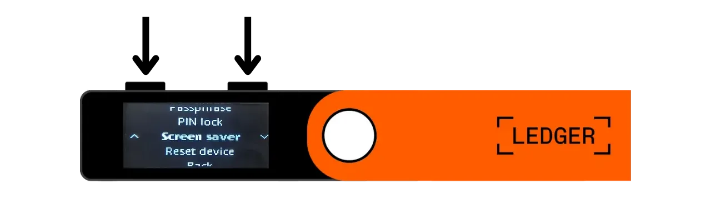

Akhirnya, menu "*Reset device*" memungkinkan kamu untuk mereset Ledger kamu. Lanjutkan reset ini hanya jika kamu yakin perangkat tersebut tidak menyimpan kunci apa pun yang mengamankan bitcoin, karena kamu bisa kehilangan akses ke dana secara permanen. Opsi ini bisa berguna untuk melakukan uji pemulihan kosong, tetapi aku akan membahasnya sedikit lebih lanjut nanti.

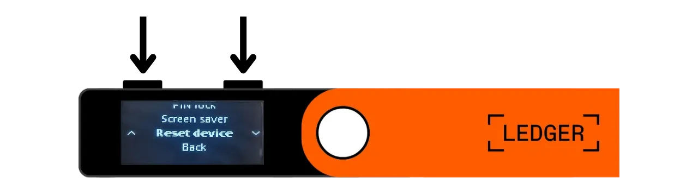
## Bagaimana Cara Memasang Aplikasi Bitcoin?

Mulailah dengan meluncurkan perangkat lunak Ledger Live di komputer kamu, kemudian sambungkan dan buka kunci Ledger Nano Anda. Di Ledger Live, pergi ke menu "*My Ledger*". Kamu akan diminta untuk mengizinkan akses ke Nano.

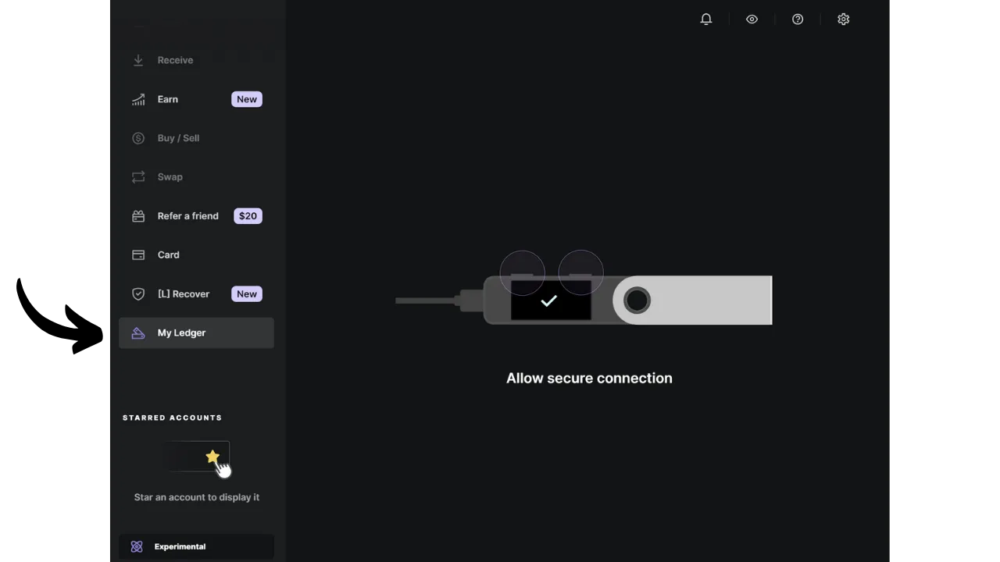

Validasi akses di Ledger kamu dengan mengklik dua tombol.

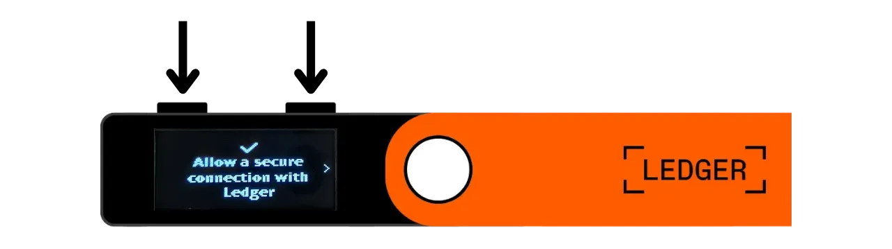

Pertama, di Ledger Live, pastikan "*Genuine check*" muncul. Ini mengonfirmasi bahwa perangkat kamu asli.

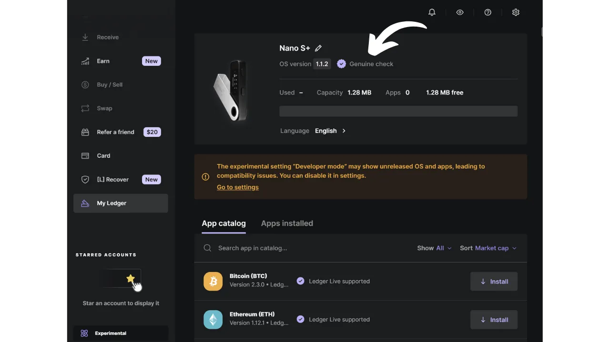

Jika firmware pada Ledger Nano kamu belum versi terbaru, Ledger Live akan secara otomatis menawarkan pembaruan. Jika diperlukan, klik "*Update firmware*", lalu "*Install update*" untuk memulai instalasi. Di Ledger kamu, tekan kedua tombol untuk mengonfirmasi, lalu tunggu hingga proses instalasi selesai.

Terakhir, kita akan menambahkan aplikasi Bitcoin. Untuk melakukannya, di Ledger Live, klik tombol "*Install*" di samping "*Bitcoin (BTC)*".

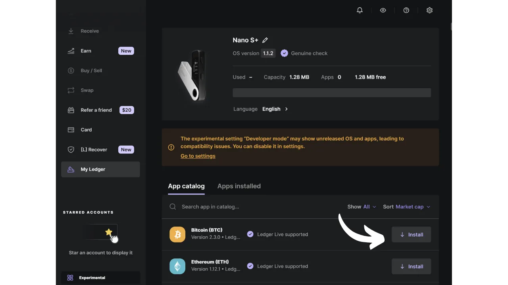

Aplikasi akan terinstal pada Nano kamu.

Mulai sekarang, kamu tidak lagi memerlukan perangkat lunak Ledger Live untuk pengelolaan dompet kamu secara rutin. Kamu bisa sesekali kembali ke sana untuk memperbarui firmware saat versi baru tersedia. Untuk hal lainnya, kita akan menggunakan Sparrow Wallet, yang merupakan alat yang jauh lebih komprehensif untuk mengelola dompet Bitcoin secara efektif.

## Bagaimana Cara Menyiapkan Dompet Bitcoin Baru dengan Sparrow?

Buka Sparrow Wallet dan lewati halaman pengantar untuk mengakses layar utama. Periksa bahwa kamu sudah terhubung dengan benar ke sebuah node dengan melihat sakelar yang berada di pojok kanan bawah layar.

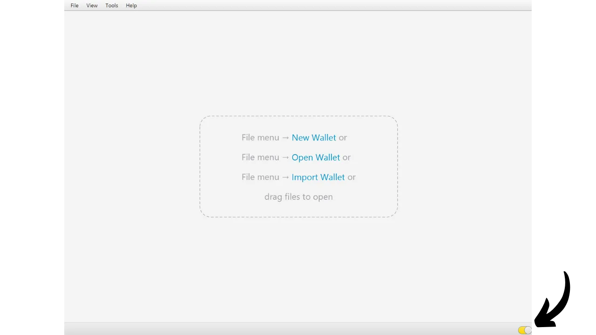

Aku sangat merekomendasikan untuk menggunakan node Bitcoin kamu sendiri. Dalam tutorial ini, aku menggunakan node publik (kuning) karena berada di testnet, tetapi untuk penggunaan normal, lebih baik memilih Bitcoin Core lokal (hijau) atau server Electrum yang terhubung ke node jarak jauh (biru).

Klik pada menu "*File*" kemudian "*New Wallet*".

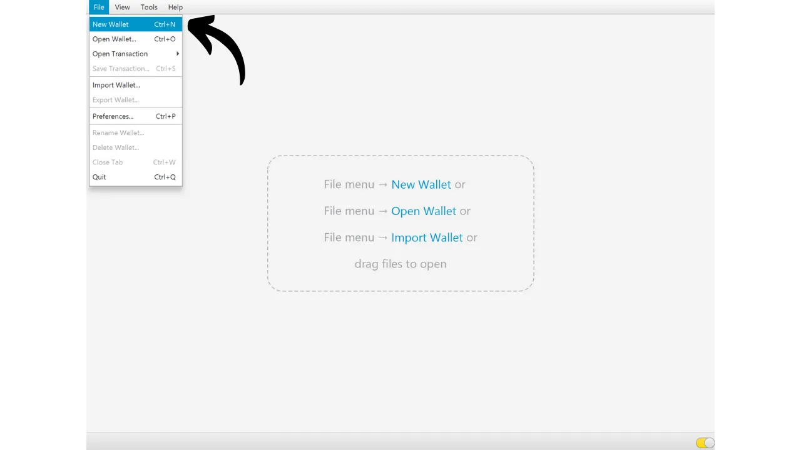

Pilih nama untuk dompet ini, kemudian klik pada "*Create Wallet*".

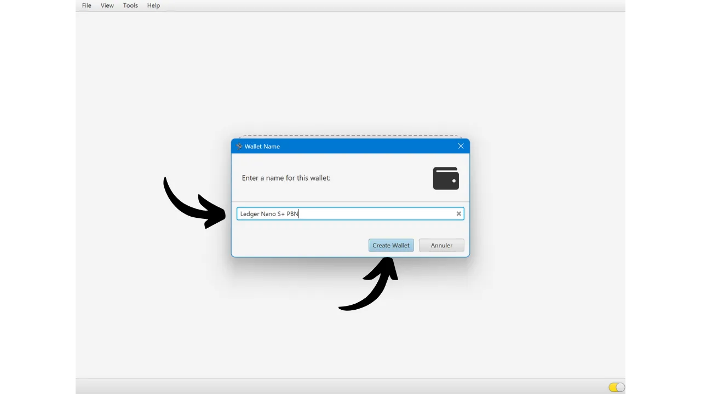

Di menu dropdown "*Script Type*", pilih jenis skrip yang akan digunakan untuk mengamankan bitcoin kamu. Aku merekomendasikan untuk memilih "*Taproot*", atau jika tidak tersedia, "*Native SegWit*".

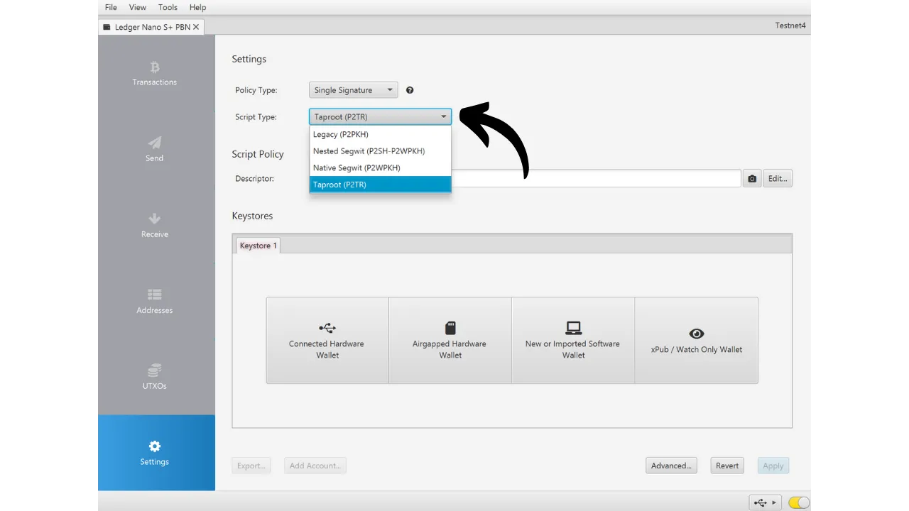
Klik pada tombol "*Connected Hardware Wallet*".
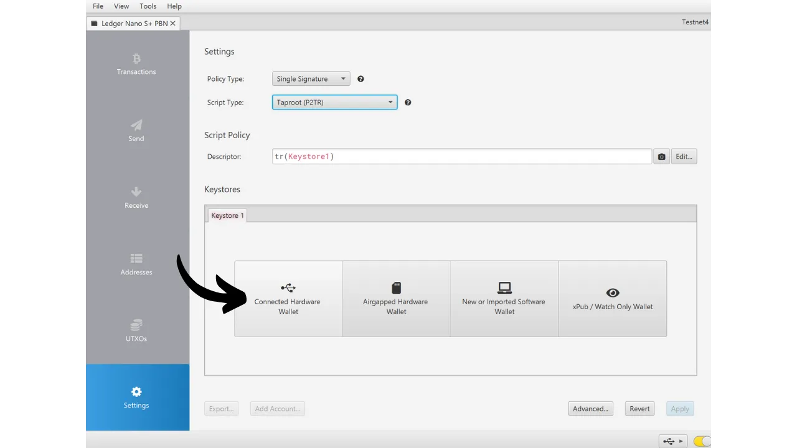

Jika kamu belum melakukannya, hubungkan Ledger Nano S Plus kamu ke komputer, buka kunci dengan kode PIN kamu, lalu buka aplikasi "*Bitcoin*" dengan menekan kedua tombol sekali pada logo Bitcoin.

*Dalam tutorial ini, aku menggunakan aplikasi Bitcoin Testnet, tetapi prosedurnya tetap sama untuk mainnet.*

Di Sparrow, klik pada tombol "*Scan*".

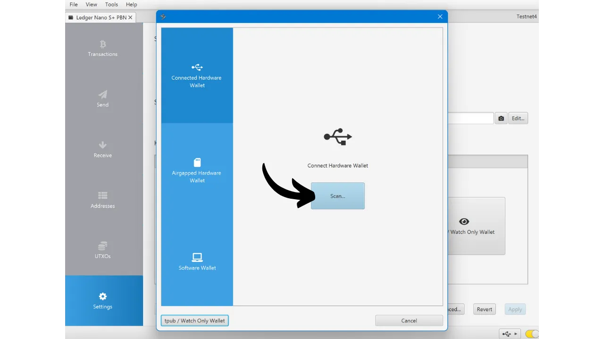

Kemudian klik pada "*Import Keystore*".

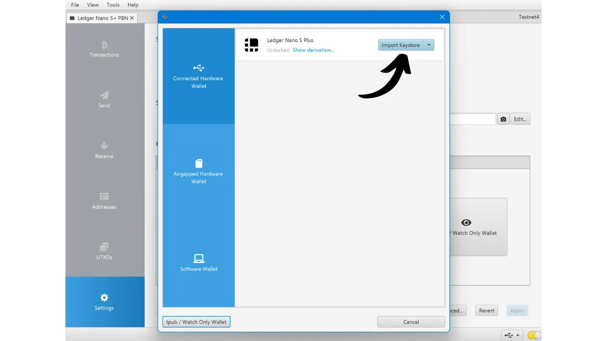

Sekarang kamu bisa melihat detail dompet kamu, termasuk extended public key dari akun pertama kamu. Klik tombol "*Apply*" untuk menyelesaikan pembuatan dompet.

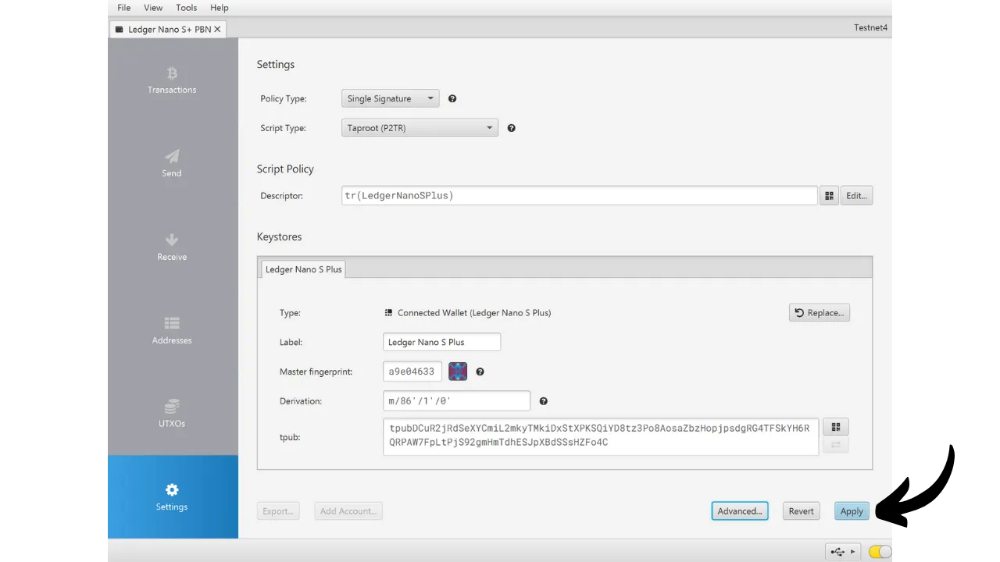

Pilih kata sandi yang kuat untuk mengamankan akses ke Sparrow Wallet. Kata sandi ini akan menjaga keamanan akses ke data dompet kamu di Sparrow, sehingga membantu melindungi kunci publik, alamat, label, dan riwayat transaksi dari akses yang tidak sah.

Aku menyarankan kamu untuk menyimpan kata sandi ini di pengelola kata sandi agar tidak lupa.

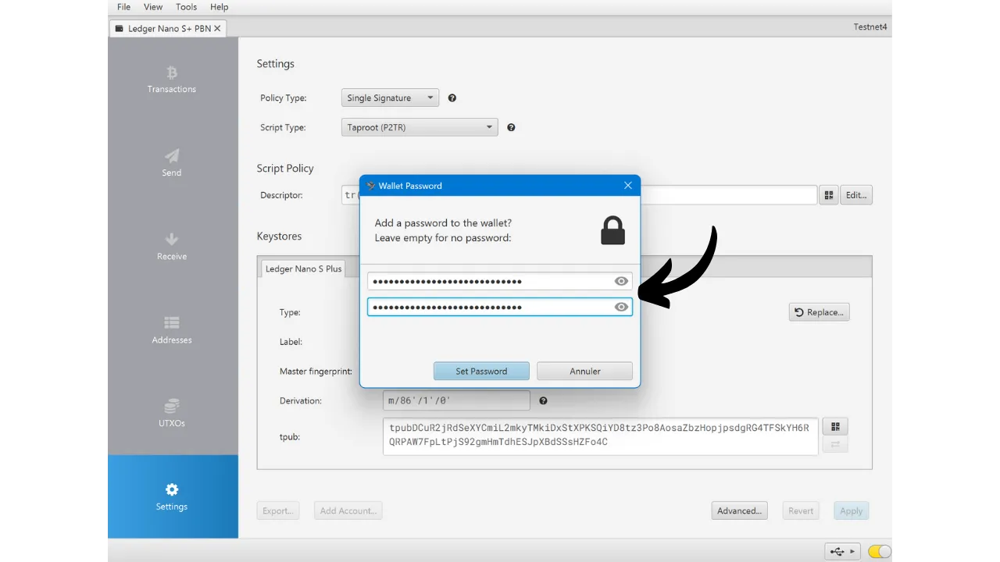

Dan sekarang, dompet Anda telah dibuat!

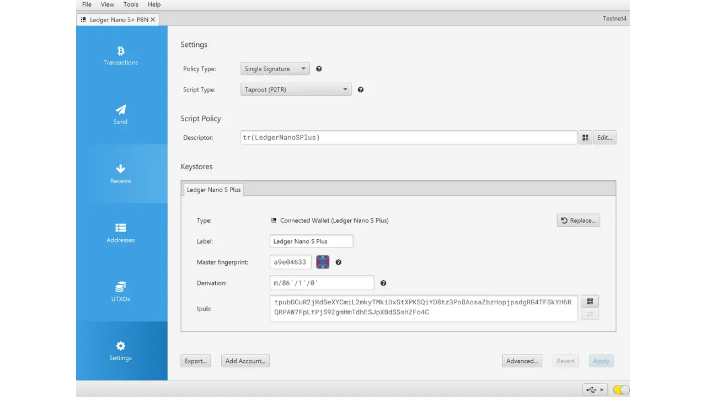
Sebelum kamu menerima bitcoin pertama di dompet kamu, **aku sangat menyarankan untuk melakukan uji pemulihan tanpa transaksi**. Catat informasi referensi, seperti xpub kamu, lalu reset Ledger Nano kamu saat dompet masih kosong. Setelah itu, coba pulihkan dompet kamu di Ledger menggunakan cadangan kertas kamu. Periksa apakah xpub yang dihasilkan setelah pemulihan sama dengan yang sudah kamu catat sebelumnya. Jika iya, kamu bisa yakin bahwa cadangan kertas kamu dapat diandalkan.

Untuk mempelajari lebih lanjut tentang cara melakukan uji pemulihan, aku menyarankan kamu untuk melihat tutorial berikut:

https://planb.academy/tutorials/wallet/backup/recovery-test-5a75db51-a6a1-4338-a02a-164a8d91b895

## Bagaimana cara menerima bitcoin dengan Ledger Nano?

Klik pada tab "*Receive*".

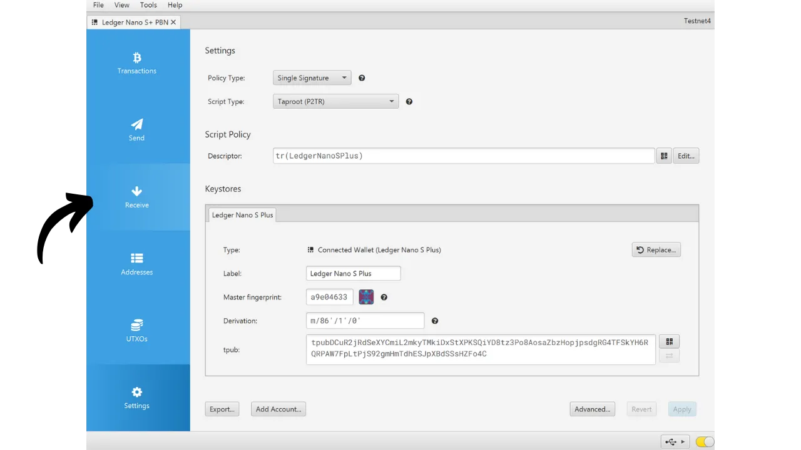

Hubungkan Ledger Nano S Plus Anda ke komputer, buka kunci dengan kode PIN kamu, kemudian buka aplikasi "*Bitcoin*".

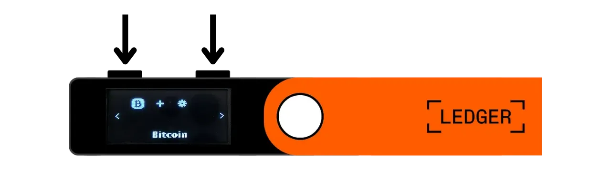
Sebelum menggunakan alamat yang disediakan oleh Sparrow Wallet, verifikasi terlebih dahulu di layar Ledger kamu. Praktik ini memungkinkan kamu memastikan bahwa alamat yang ditampilkan di Sparrow tidak palsu dan bahwa dompet perangkat keras memang memiliki kunci privat yang diperlukan untuk membelanjakan bitcoin yang diamankan dengan alamat ini nanti. Ini membantu kamu menghindari beberapa jenis serangan.

Untuk melakukan verifikasi ini, klik tombol "*Display Address*".

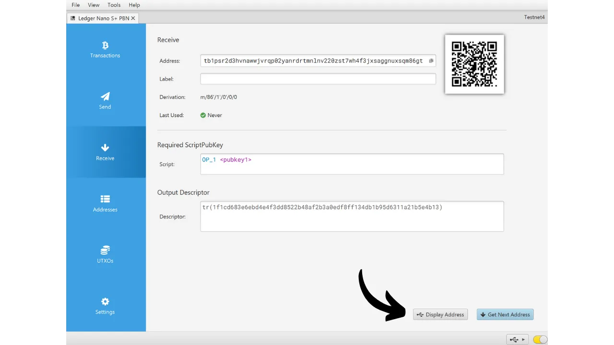

Pastikan alamat yang ditampilkan di Ledger kamu cocok dengan yang ditunjukkan di Sparrow Wallet. Disarankan juga untuk melakukan verifikasi ini tepat sebelum memberikan alamat kamu kepada pengirim, agar validitasnya tetap terjamin. Kamu bisa menggunakan tombol untuk melihat alamat lengkap.

Kemudian klik pada "*Approve*" jika alamatnya memang identik.

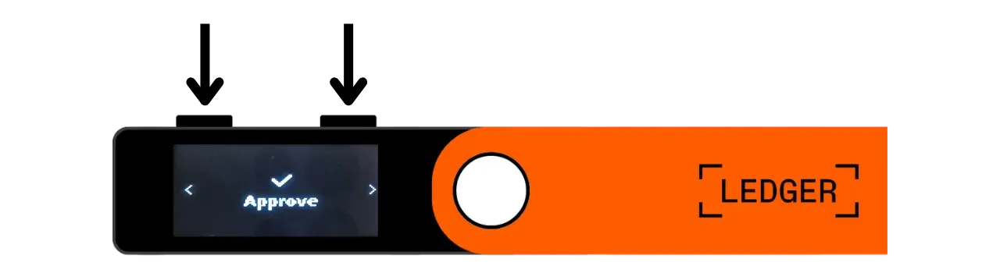

Kamu dapat menambahkan "*Label*" untuk mendeskripsikan sumber bitcoin yang akan diamankan dengan alamat ini. Ini adalah praktik yang baik yang membantu Anda mengelola UTXO kamu dengan lebih baik.

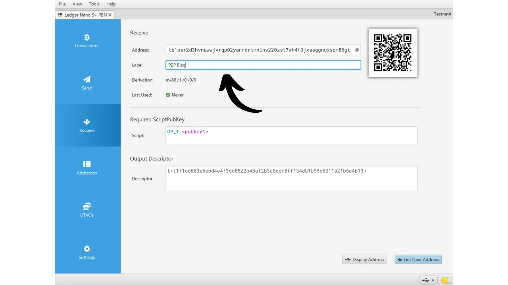

Untuk informasi lebih lanjut tentang pelabelan, aku juga menyarankan kamu untuk melihat tutorial berikut:

https://planb.academy/tutorials/privacy/on-chain/utxo-labelling-d997f80f-8a96-45b5-8a4e-a3e1b7788c52

Kamu kemudian bisa menggunakan alamat ini untuk menerima bitcoin.

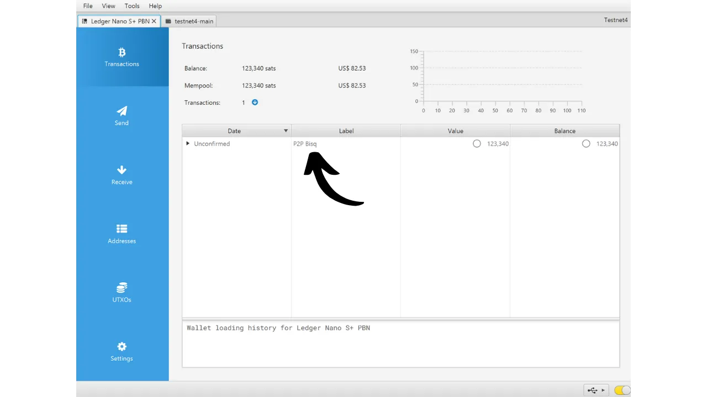

## Bagaimana cara mengirim bitcoin dengan Ledger Nano?

Sekarang setelah kamu menerima sats pertama di dompet yang diamankan dengan Nano S Plus, kamu juga bisa membelanjakannya! Hubungkan Ledger kamu ke komputer, buka kunci, jalankan Sparrow Wallet, lalu buka tab "*Send*" untuk membuat transaksi baru.

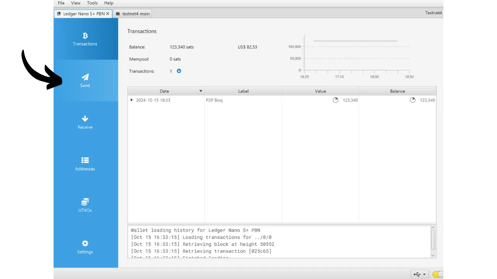

Jika kamu ingin melakukan "*coin control*", yaitu memilih secara spesifik UTXO mana yang akan digunakan dalam transaksi, buka tab "*UTXOs*". Pilih UTXO yang ingin kamu belanjakan, lalu klik "*Send Selected*". Kamu akan diarahkan ke layar yang sama di tab "*Send*", tetapi dengan UTXO kamu sudah dipilih untuk transaksi.

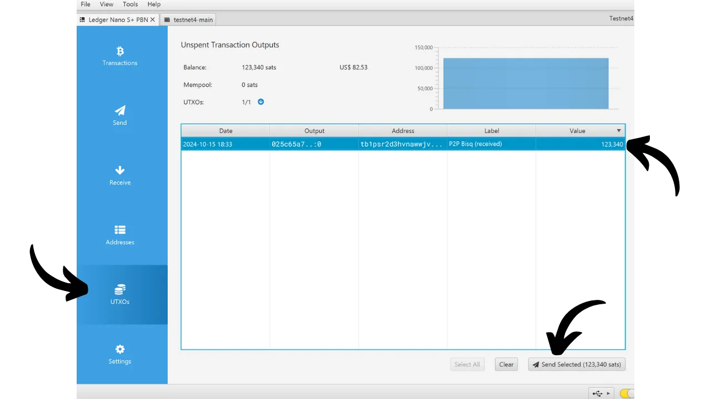

Masukkan alamat tujuan. Kamu juga dapat memasukkan beberapa alamat dengan mengklik tombol "*+ Add*".

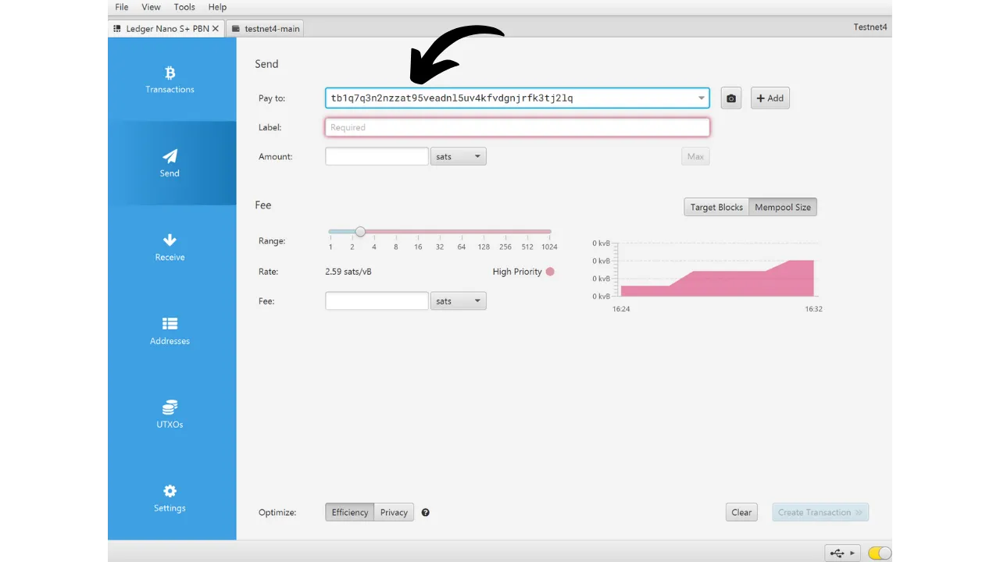

Catat sebuah "*Label*" untuk mengingat tujuan pengeluaran ini.

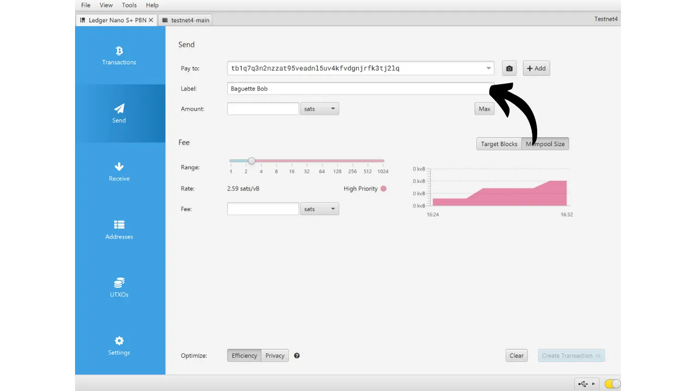
Pilih jumlah yang akan dikirim ke alamat ini.
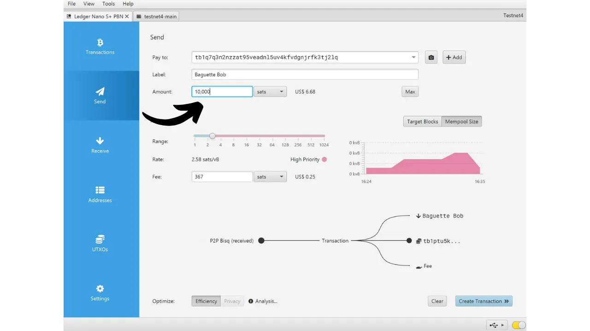

Sesuaikan tarif biaya transaksi sesuai dengan pasar saat ini.

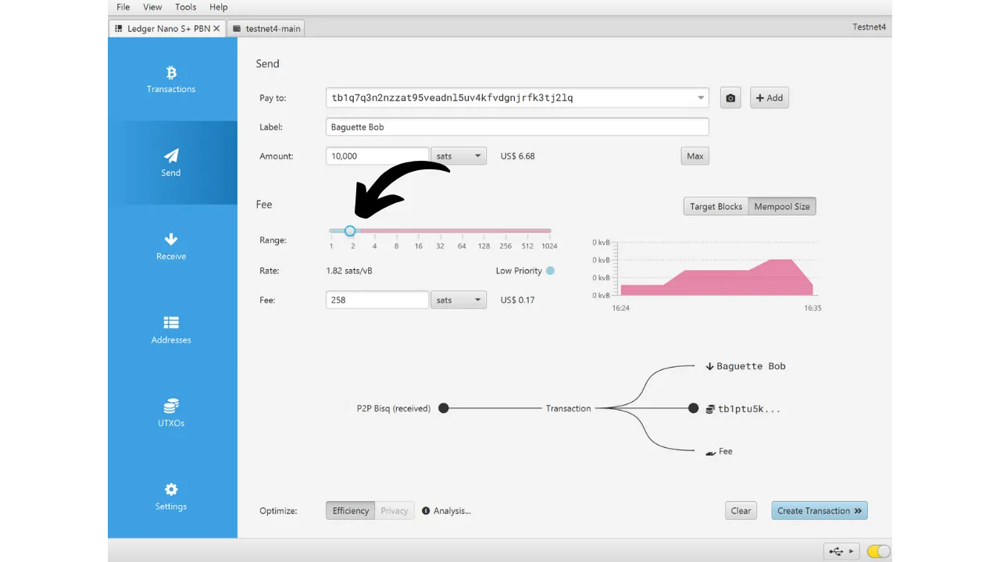
Pastikan semua pengaturan transaksi kamu sudah benar, kemudian klik pada "*Create Transaction*".
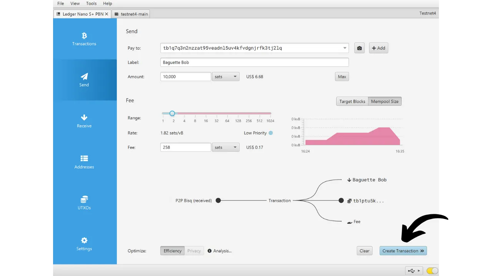

Jika semuanya terlihat baik bagi kamu, klik pada "*Finalize Transaction for Signing*".

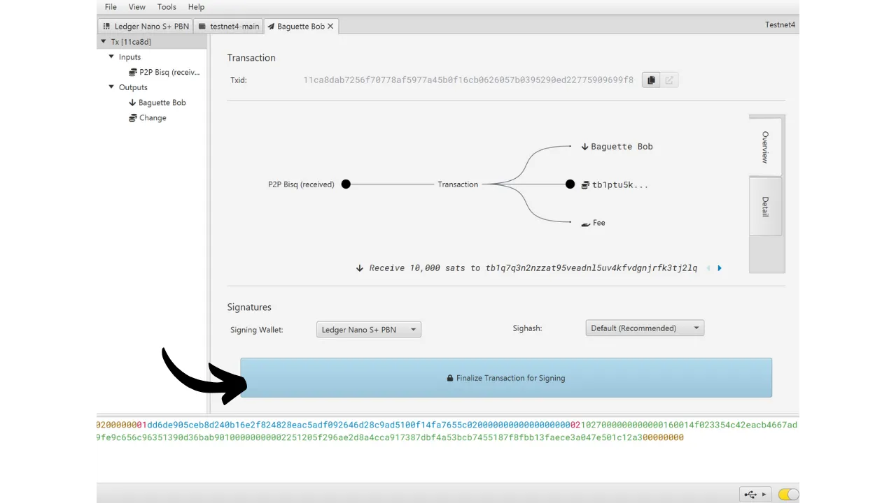

Klik pada "*Sign*".

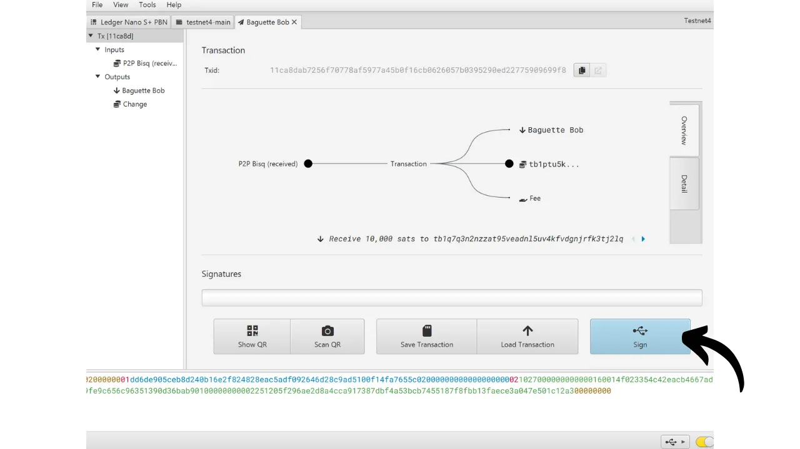

Klik pada "*Sign*" di sebelah Ledger Nano S Plus kamu.

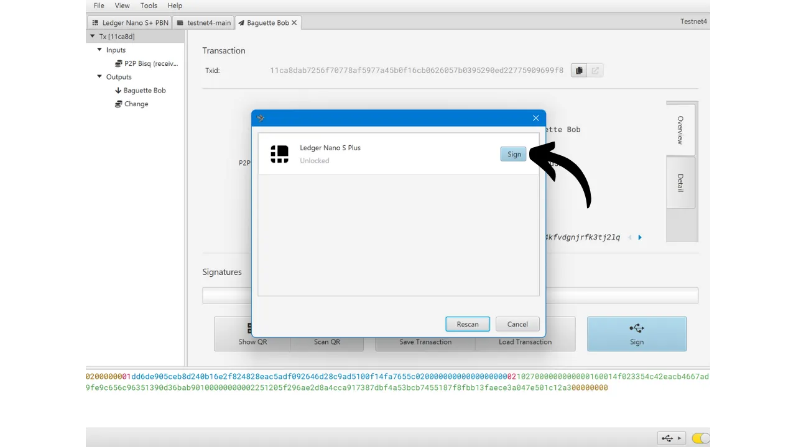

Verifikasi pengaturan transaksi di layar Ledger kamu, termasuk alamat penerima, jumlah yang dikirim, dan jumlah biaya.

Jika semuanya terlihat baik bagi kamu, tekan dua tombol pada "*Sign transaction*" untuk menandatangani.

Transaksi kamu sekarang sudah ditandatangani. Periksa kembali apakah semuanya terlihat benar, lalu klik "*Broadcast Transaction*" untuk menyiarkannya ke jaringan Bitcoin.

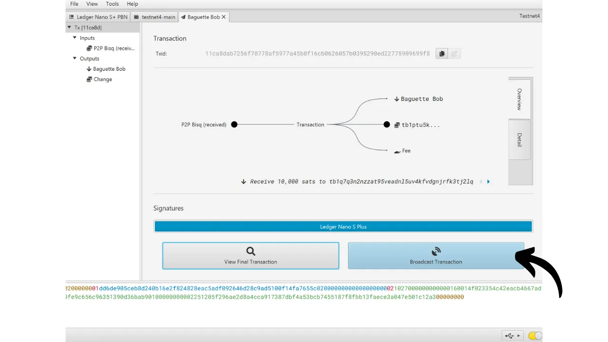

Kamu dapat menemukannya di tab "*Transactions*" dari Sparrow Wallet.

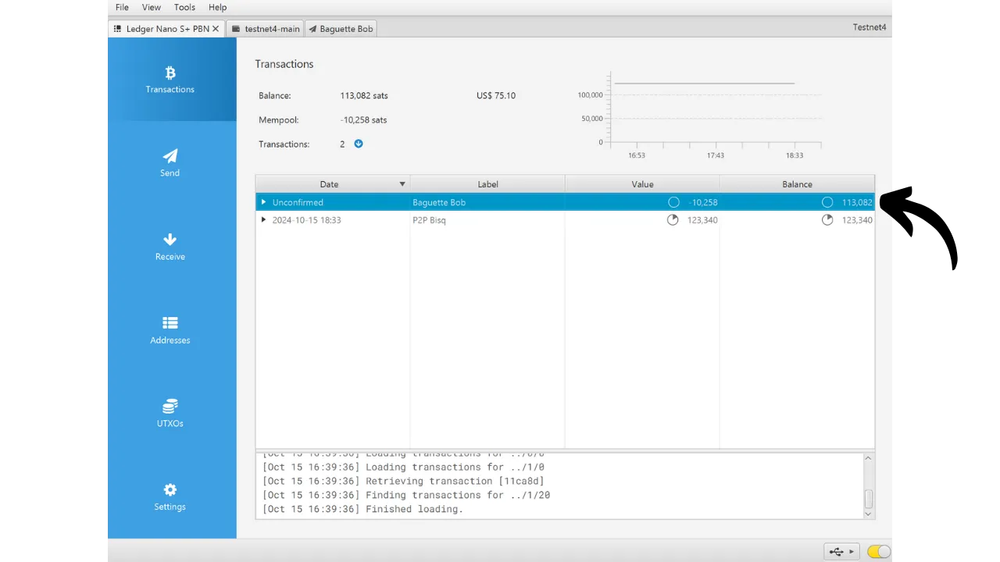

Selamat, kamu sekarang sudah menguasai penggunaan dasar Ledger Nano S Plus dengan Sparrow Wallet! Dalam tutorial mendatang, kita akan melihat cara menggunakan Ledger dengan Liana untuk memanfaatkan Miniscript.

Jika kamu merasa tutorial ini bermanfaat, aku akan sangat menghargai jika kamu memberikan jempol ke atas di bawah ini. Jangan ragu untuk membagikan artikel ini di jaringan sosial kamu. Terima kasih banyak!

Aku juga menyarankan kamu untuk melihat tutorial lengkap ini tentang Ledger Flex:

https://planb.academy/tutorials/wallet/hardware/ledger-flex-3728773e-74d4-4177-b39f-bd923700c76a

