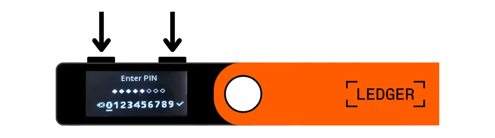
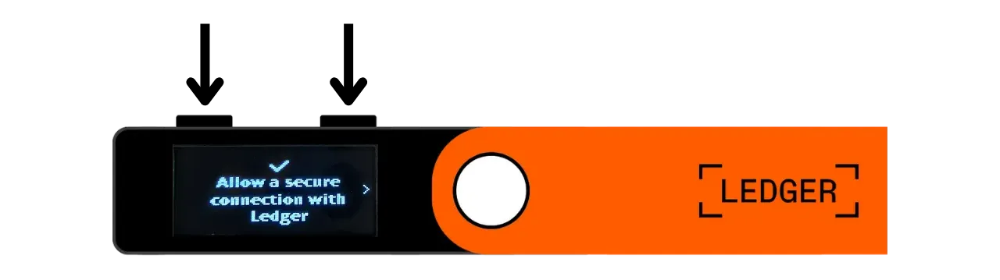
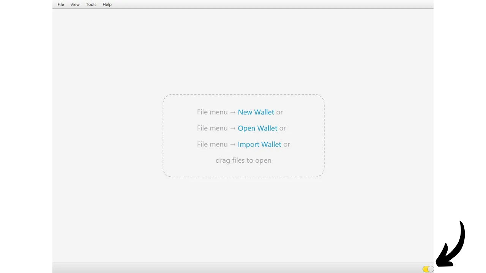
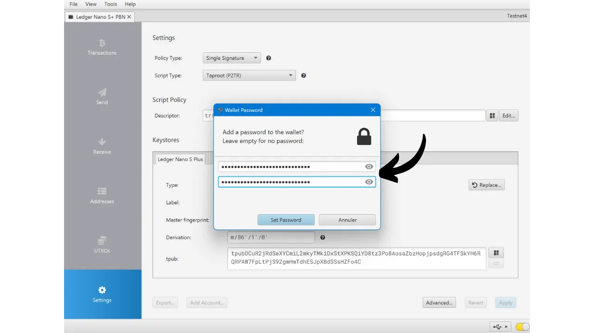
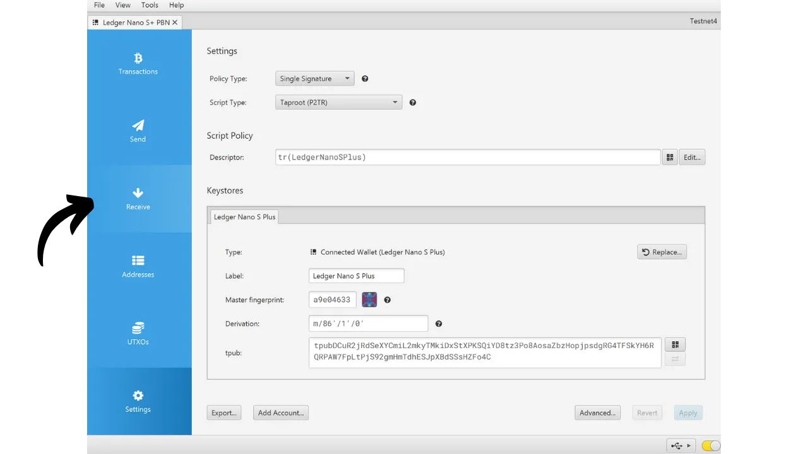

Un portafoglio hardware è un dispositivo elettronico dedicato alla gestione e alla sicurezza delle chiavi private di un portafoglio Bitcoin. A differenza dei portafogli software (o hot wallets) installati su macchine di uso generale spesso connesse a Internet, i portafogli hardware permettono l'isolamento fisico delle chiavi private, riducendo i rischi di hacking e furto.

L'obiettivo principale di un portafoglio hardware è minimizzare le funzionalità del dispositivo il più possibile per ridurre la sua superficie di attacco. Una superficie di attacco minore significa anche meno vettori di attacco potenziali, ovvero meno debolezze nel sistema che gli aggressori potrebbero sfruttare per accedere ai bitcoin.

Si raccomanda di utilizzare un portafoglio hardware per proteggere i propri bitcoin, specialmente se si detengono quantità significative, sia in valore assoluto che come proporzione dei propri asset totali.

I portafogli hardware sono utilizzati in combinazione con un software di gestione del portafoglio su un computer o smartphone. Questo software gestisce la creazione delle transazioni, ma la firma crittografica necessaria per convalidare queste transazioni viene eseguita solo all'interno del portafoglio hardware. Ciò significa che le chiavi private non sono mai esposte a un ambiente potenzialmente vulnerabile.

I portafogli hardware offrono una doppia protezione per l'utente: da un lato, proteggono i bitcoin da attacchi remoti mantenendo le chiavi private offline, e dall'altro, offrono generalmente una migliore resistenza fisica contro i tentativi di estrarre le chiavi. Ed è proprio su questi 2 criteri di sicurezza che si può giudicare e classificare i diversi modelli disponibili sul mercato.

In questo tutorial, propongo di scoprire una di queste soluzioni: il **Ledger Nano S Plus**.

## Introduzione al Ledger Nano S Plus

Il Ledger Nano S Plus è un portafoglio hardware prodotto dall'azienda francese Ledger, commercializzato al prezzo di 79 €.

Il Nano S Plus è dotato di un chip certificato CC EAL6+ ("*elemento sicuro*"), che offre una protezione avanzata contro gli attacchi fisici all'hardware. Lo schermo e i pulsanti sono controllati direttamente da questo chip. Un punto di critica spesso sollevato è che il codice di questo chip non è open-source, il che richiede una certa fiducia nell'integrità di questo componente. Tuttavia, questo elemento è sottoposto a revisione da parte di esperti indipendenti.

In termini di utilizzo, il Ledger Nano S Plus funziona esclusivamente tramite una connessione USB-C cablata.

Ledger si distingue dai suoi concorrenti per la sua adozione sempre molto rapida di nuove funzionalità Bitcoin, come ad esempio Taproot o Miniscript, cosa molto apprezzata.
Dopo averlo testato, trovo che il Ledger Nano S Plus sia un eccellente portafoglio hardware di livello base. Offre un alto livello di sicurezza per un prezzo ragionevole. Il suo principale svantaggio rispetto ad altri dispositivi nella stessa fascia di prezzo è il fatto che il codice del firmware non è open-source. Inoltre, lo schermo del Nano S Plus è relativamente piccolo rispetto a modelli più costosi, come il Ledger Flex o il Coldcard Q1. Nonostante ciò, la sua interfaccia è molto ben progettata: nonostante i suoi due pulsanti e il piccolo schermo, rimane facile da usare, anche per funzionalità avanzate come la passphrase BIP39. Il Ledger Nano S Plus non ha una batteria, connessione Air-gap, fotocamera o porta micro SD, ma ciò è abbastanza normale per questa fascia di prezzo.
A mio parere, il Ledger Nano S Plus rappresenta una buona opzione per proteggere il tuo portafoglio Bitcoin ed è adatto sia per principianti che per utenti intermedi. Tuttavia, in questa fascia di prezzo, personalmente preferisco il Trezor Safe 3, che offre più o meno le stesse opzioni. Il vantaggio di Trezor, a mio avviso, risiede nella gestione del suo elemento di sicurezza: la frase mnemonica e le chiavi sono gestite esclusivamente da codice open-source, pur beneficiando ancora della protezione del chip. Lo svantaggio di Trezor è che a volte sono molto lenti nell'implementare nuove funzionalità a differenza di Ledger.
## Come acquistare un Ledger Nano S Plus?

Il Ledger Nano S Plus è disponibile per la vendita [sul sito ufficiale](https://shop.ledger.com/products/ledger-nano-s-plus). Per acquistarlo in un negozio fisico, puoi anche trovare [l'elenco dei rivenditori certificati](https://www.ledger.com/reseller) sul sito web di Ledger.

## Prerequisiti

Una volta ricevuto il tuo Ledger Nano, il primo passo è controllare l'imballaggio per assicurarti che non sia stato aperto. Se è danneggiato, ciò potrebbe indicare che il portafoglio hardware è stato compromesso e potrebbe non essere autentico.

All'apertura, dovresti trovare i seguenti articoli nella scatola:
- Il Ledger Nano S Plus;
- Un cavo da USB-C a USB-A;
- Un manuale utente;
- Carte per annotare la tua frase mnemonica.

Per questo tutorial, avrai bisogno di 2 applicazioni software: Ledger Live per inizializzare il Ledger e Sparrow Wallet per gestire il tuo portafoglio Bitcoin. Scarica [Ledger Live](https://www.ledger.com/ledger-live) e [Sparrow Wallet](https://sparrowwallet.com/download/) dai loro siti ufficiali.

Per questi due programmi software, raccomando vivamente di verificare sia la loro autenticità (con GnuPG) che la loro integrità (tramite l'hash) prima di installarli sulla tua macchina. Se non sei sicuro di come fare, puoi seguire quest'altro tutorial:
https://planb.network/tutorials/others/integrity-authenticity

## Come inizializzare un Ledger Nano?

Collega il tuo Nano al computer dove sono installati Ledger Live e Sparrow Wallet. Per navigare sul tuo Ledger, usa il pulsante sinistro per andare a sinistra e il pulsante destro per andare a destra. Per selezionare o confermare un'opzione, premi entrambi i pulsanti contemporaneamente.

Scorri le diverse pagine di introduzione e poi clicca sui 2 pulsanti per iniziare.

Seleziona l'opzione "*Imposta come nuovo dispositivo*".

Scegli il codice PIN che verrà utilizzato per sbloccare il tuo Ledger. Si tratta quindi di una protezione contro l'accesso fisico non autorizzato. Questo codice PIN non gioca un ruolo nella derivazione delle chiavi crittografiche del tuo portafoglio. Pertanto, anche senza accesso a questo codice PIN, avendo la tua frase mnemonica di 24 parole ti permetterà di riguadagnare l'accesso ai tuoi bitcoin.

Si raccomanda di scegliere un PIN di 8 cifre, il più casuale possibile. Inoltre, assicurati di salvare questo codice in un luogo diverso da dove è conservato il tuo Ledger Nano S Plus (ad esempio, in un gestore di password).

Usa i pulsanti per muoverti sulle cifre, poi seleziona ogni cifra cliccando entrambi i pulsanti contemporaneamente.

Inserisci il tuo PIN una seconda volta per confermarlo.
Il tuo Nano fornisce istruzioni su come gestire la tua frase di recupero.

**Questa frase mnemonica offre accesso completo e illimitato a tutti i tuoi bitcoin**. Chiunque sia in possesso di questa frase può rubare i tuoi fondi, anche senza accesso fisico al tuo Ledger. La frase di 24 parole ti permette di ripristinare l'accesso ai tuoi bitcoin in caso di perdita, furto o danneggiamento del tuo Ledger Nano. È quindi molto importante salvare e conservare con cura questa frase in un luogo sicuro.

Puoi scriverla sul foglio di cartone fornito con il tuo Ledger, o, per maggiore sicurezza, ti consiglio di incidere la frase su un supporto in acciaio inossidabile per proteggerti dai rischi di incendi, alluvioni o crolli.

Puoi sfogliare queste istruzioni e saltare le pagine cliccando sul pulsante destro.

Il Ledger creerà la tua frase mnemonica utilizzando il suo generatore di numeri casuali. Assicurati di non essere osservato durante questa operazione. Scrivi le parole fornite dal Ledger sul supporto fisico che preferisci. A seconda della tua strategia di sicurezza, potresti considerare di fare diverse copie fisiche complete della frase (ma, importantemente, non dividerla). È cruciale mantenere le parole numerate e in ordine sequenziale.
***Ovviamente, non dovresti mai condividere queste parole su internet, al contrario di quanto sto facendo in questo tutorial. Questo esempio di portafoglio verrà utilizzato solo sulla Testnet e verrà cancellato dopo il tutorial.***

Per passare alle parole successive, clicca sul pulsante destro.

Una volta annotate tutte le parole, clicca sui 2 pulsanti per passare alla fase successiva.

Clicca sui due pulsanti "*Conferma la tua frase di recupero*", poi seleziona le parole della tua frase mnemonica nel loro ordine per confermare che le hai annotate correttamente. Usa i pulsanti sinistro e destro per navigare tra le opzioni, poi seleziona la parola corretta cliccando sui 2 pulsanti. Continua questa procedura fino alla 24ª parola.

Se la frase che stai confermando corrisponde esattamente a quella fornita dal Ledger nel passaggio precedente, puoi procedere. Se no, indica che il tuo backup fisico della frase mnemonica è incorretto e devi ricominciare il processo.

Ed ecco fatto, il tuo seed è stato correttamente creato sul tuo Ledger Nano S Plus. Prima di procedere alla creazione di un nuovo portafoglio Bitcoin da questo seed, esploriamo insieme le impostazioni del dispositivo.

## Come modificare le impostazioni del tuo Ledger?

Per accedere alle impostazioni, tieni premuti i 2 pulsanti per alcuni secondi.

Clicca sul menu "*Impostazioni*".

E scegli "*Generale*".

Nel menu "*Lingua*", puoi cambiare la lingua di visualizzazione.

Nel menu "*Luminosità*", puoi regolare la luminosità dello schermo. Per ora, non ci interessano le altre impostazioni generali.

Ora, vai alla sezione delle impostazioni di "*Sicurezza*".
"*Cambia PIN*" ti permette di cambiare il tuo codice PIN. 
"*Frase d'accesso*" ti permette di impostare una passphrase BIP39. La passphrase è una password opzionale che, combinata con la tua frase di recupero, fornisce un ulteriore livello di sicurezza per il tuo portafoglio.

Attualmente, il tuo portafoglio è generato da una frase mnemonica composta da 24 parole. Questa frase di recupero è molto importante perché ti permette di ripristinare tutte le chiavi del tuo portafoglio in caso di perdita. Tuttavia, costituisce un singolo punto di fallimento (SPOF). Se viene compromessa, i tuoi bitcoin sono in pericolo. Qui entra in gioco la passphrase. È una password opzionale, che puoi scegliere arbitrariamente, che si aggiunge alla frase mnemonica per migliorare la sicurezza del portafoglio.

La passphrase non deve essere confusa con il codice PIN. Gioca un ruolo nella derivazione delle tue chiavi crittografiche. Funziona in tandem con la frase mnemonica, alterando il seme da cui vengono generate le chiavi. Così, anche se qualcuno ottiene la tua frase di 24 parole, senza la passphrase, non può accedere ai tuoi fondi. Usare una passphrase crea essenzialmente un nuovo portafoglio con chiavi distinte. Modificare (anche leggermente) la passphrase genererà un portafoglio diverso.

La passphrase è uno strumento molto potente per migliorare la sicurezza dei tuoi bitcoin. Tuttavia, è molto importante capire come funziona prima di implementarla, per evitare di perdere l'accesso al tuo portafoglio. Ecco perché ti consiglio di consultare questo altro tutorial dedicato se desideri impostare una passphrase sul tuo Ledger:

https://planb.network/tutorials/wallet/passphrase-ledger

Il menu "*Blocco PIN*" ti permette di configurare e attivare il blocco automatico del tuo Ledger dopo un determinato periodo di inattività.

Il menu "*Salvaschermo*" ti permette di regolare la modalità di sospensione del tuo Ledger Nano. Nota che il salvaschermo non richiede l'ingresso del PIN al risveglio, a meno che l'opzione "*Blocco PIN*" non sia attivata in corrispondenza con la modalità di sospensione. Questa funzione è particolarmente utile per i dispositivi Ledger Nano X dotati di batteria, per ridurre il loro consumo energetico.

Infine, il menu "*Reset dispositivo*" ti permette di resettare il tuo Ledger. Procedi con questo reset solo se sei certo che non contenga chiavi che assicurano bitcoin, poiché potresti perdere definitivamente l'accesso ai tuoi fondi. Questa opzione può essere utile per eseguire un test di recupero vuoto, ma ne parlerò un po' più avanti.

## Come Installare l'Applicazione Bitcoin?

Inizia lanciando il software Ledger Live sul tuo computer, poi connetti e sblocca il tuo Ledger Nano. In Ledger Live, vai al menu "*Il mio Ledger*". Ti verrà chiesto di autorizzare l'accesso al tuo Nano.

Valida l'accesso sul tuo Ledger cliccando sui due pulsanti.

Prima di tutto, su Ledger Live, assicurati che appaia il "*Controllo autenticità*". Questo conferma che il tuo dispositivo è autentico.

Se il firmware del tuo Ledger Nano non è aggiornato, Ledger Live offrirà automaticamente di aggiornarlo. Se necessario, clicca su "*Aggiorna firmware*", poi su "*Installa aggiornamento*" per avviare l'installazione. Sul tuo Ledger, clicca sui due pulsanti per confermare, poi attendi durante l'installazione.
Infine, aggiungeremo l'applicazione Bitcoin. Per fare ciò, su Ledger Live, clicca sul pulsante "*Install*" accanto a "*Bitcoin (BTC)*".

L'applicazione verrà installata sul tuo Nano.

Da ora in poi, non avrai più bisogno del software Ledger Live per la gestione regolare del tuo portafoglio. Potrai occasionalmente ritornarvi per aggiornare il firmware quando sono disponibili nuove versioni. Per tutto il resto, utilizzeremo Sparrow Wallet, che è uno strumento molto più completo per gestire efficacemente un portafoglio Bitcoin.

## Come Configurare un Nuovo Portafoglio Bitcoin con Sparrow?

Apri Sparrow Wallet e salta le pagine di introduzione per accedere alla schermata principale. Controlla di essere correttamente connesso a un nodo osservando l'interruttore situato in basso a destra dello schermo.

Raccomando vivamente di utilizzare il proprio nodo Bitcoin. In questo tutorial, sto usando un nodo pubblico (giallo) perché sono sul testnet, ma per un uso normale, è meglio optare per un Bitcoin Core locale (verde) o un server Electrum connesso a un nodo remoto (blu).

Clicca sul menu "*File*" poi su "*New Wallet*".

Scegli un nome per questo portafoglio, poi clicca su "*Create Wallet*".

Nel menu a tendina "*Script Type*", seleziona il tipo di script che verrà utilizzato per proteggere i tuoi bitcoin. Raccomando di optare per "*Taproot*", o se non disponibile, "*Native SegWit*".

Clicca sul pulsante "*Connected Hardware Wallet*".

Se non lo hai già fatto, connetti il tuo Ledger Nano S Plus al computer, sbloccalo con il tuo codice PIN e poi apri l'applicazione "*Bitcoin*" cliccando sui 2 pulsanti una volta sul logo di Bitcoin.

*In questo tutorial, sto usando l'applicazione Bitcoin Testnet, ma la procedura rimane la stessa per il mainnet.*

Su Sparrow, clicca sul pulsante "*Scan*".

Poi clicca su "*Import Keystore*".

Ora puoi vedere i dettagli del tuo portafoglio, inclusa la chiave pubblica estesa del tuo primo account. Clicca sul pulsante "*Apply*" per finalizzare la creazione del portafoglio.

Scegli una password forte per proteggere l'accesso a Sparrow Wallet. Questa password garantirà la sicurezza dell'accesso ai dati del tuo portafoglio su Sparrow, contribuendo a proteggere le tue chiavi pubbliche, indirizzi, etichette e la cronologia delle transazioni contro qualsiasi accesso non autorizzato.

Ti consiglio di salvare questa password in un gestore di password per non dimenticarla.

Ed ecco fatto, il tuo portafoglio è ora creato!

Prima di ricevere i tuoi primi bitcoin nel tuo portafoglio, **ti consiglio vivamente di eseguire un test di recupero a secco**. Annota un pezzo di informazione di riferimento, come il tuo xpub, poi resetta il tuo Ledger Nano mentre il portafoglio è ancora vuoto. Successivamente, prova a ripristinare il tuo portafoglio sul Ledger utilizzando i tuoi backup su carta. Controlla che l'xpub generato dopo il ripristino corrisponda a quello che avevi inizialmente annotato. Se così è, puoi essere sicuro che i tuoi backup su carta sono affidabili.
Per saperne di più su come eseguire un test di recupero, ti consiglio di consultare questo altro tutorial:

https://planb.network/tutorials/wallet/recovery-test

## Come ricevere bitcoin con il Ledger Nano?

Clicca sulla scheda "*Ricevi*".

Collega il tuo Ledger Nano S Plus al computer, sbloccalo con il tuo codice PIN, poi apri l'applicazione "*Bitcoin*".

Prima di utilizzare l'indirizzo fornito da Sparrow Wallet, verificalo sullo schermo del tuo Ledger. Questa pratica ti permette di confermare che l'indirizzo visualizzato su Sparrow non sia fraudolento e che il portafoglio hardware detenga effettivamente la chiave privata necessaria per spendere in seguito i bitcoin assicurati con questo indirizzo. Questo ti aiuta a evitare diversi tipi di attacchi.
Per eseguire questa verifica, clicca sul pulsante "*Mostra Indirizzo*".

Assicurati che l'indirizzo visualizzato sul tuo Ledger corrisponda a quello indicato su Sparrow Wallet. Si raccomanda anche di eseguire questa verifica poco prima di dare il tuo indirizzo al mittente, per essere sicuro della sua validità. Puoi usare i pulsanti per visualizzare l'indirizzo completo.

Poi clicca su "*Approva*" se gli indirizzi sono effettivamente identici.

Puoi aggiungere un "*Etichetta*" per descrivere la fonte dei bitcoin che saranno assicurati con questo indirizzo. Questa è una buona pratica che ti aiuta a gestire meglio i tuoi UTXO.

Per maggiori informazioni sull'etichettatura, ti consiglio anche di consultare questo altro tutorial:

https://planb.network/tutorials/privacy/utxo-labelling

Puoi quindi utilizzare questo indirizzo per ricevere bitcoin.

## Come inviare bitcoin con il Ledger Nano?

Ora che hai ricevuto i tuoi primi satoshi nel tuo portafoglio assicurato con il Nano S Plus, puoi anche spenderli! Collega il tuo Ledger al computer, sbloccalo, avvia Sparrow Wallet e poi vai alla scheda "*Invia*" per costruire una nuova transazione.

Se vuoi fare "*controllo dei coin*", ovvero scegliere specificamente quali UTXO consumare nella transazione, vai alla scheda "*UTXO*". Seleziona gli UTXO che desideri spendere, poi clicca su "*Invia Selezionati*". Sarai reindirizzato alla stessa schermata della scheda "*Invia*", ma con i tuoi UTXO già selezionati per la transazione.

Inserisci l'indirizzo di destinazione. Puoi anche inserire più indirizzi cliccando sul pulsante "*+ Aggiungi*".

Nota un'*Etichetta*" per ricordare lo scopo di questa spesa.

Scegli l'importo da inviare a questo indirizzo.

Regola la tariffa della commissione di transazione in base al mercato attuale.

Assicurati che tutte le impostazioni della tua transazione siano corrette, poi clicca su "*Crea Transazione*".

Se tutto ti sembra corretto, clicca su "*Finalizza Transazione per la Firma*".

Clicca su "*Firma*".

Clicca su "*Firma*" accanto al tuo Ledger Nano S Plus.

Verifica le impostazioni della transazione sullo schermo del tuo Ledger, inclusi l'indirizzo di ricezione del destinatario, l'importo inviato e l'importo della commissione.

Se tutto ti sembra corretto, premi i due pulsanti su "*Firma transazione*" per firmare.

La tua transazione è ora firmata. Controlla nuovamente che tutto ti sembri corretto, poi clicca su "*Trasmetti Transazione*" per diffonderla sulla rete Bitcoin.

Puoi trovarla nella scheda "*Transazioni*" di Sparrow Wallet.

Congratulazioni, ora sei aggiornato sull'uso di base del Ledger Nano S Plus con Sparrow Wallet! In un futuro tutorial, vedremo come utilizzare il Ledger con Liana per sfruttare Miniscript.

Se hai trovato utile questo tutorial, apprezzerei se potessi lasciare un pollice in su qui sotto. Sentiti libero di condividere questo articolo sui tuoi social network. Grazie mille!

Ti raccomando anche di controllare questo tutorial completo sul Ledger Flex:

https://planb.network/tutorials/wallet/ledger-flex