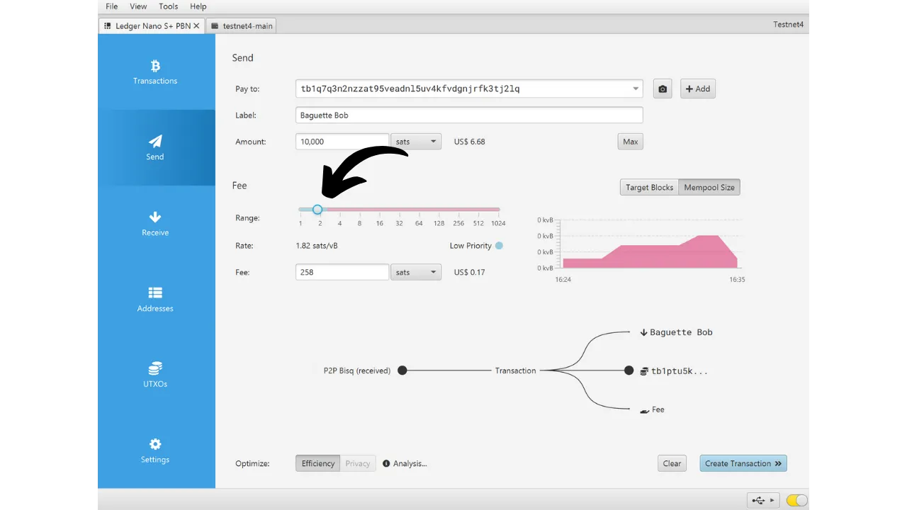

ハードウェアウォレットは、Bitcoinウォレットの秘密鍵を管理・保護するために専用に設計された電子デバイスです。インターネットに接続されることが多い汎用機器にインストールされるソフトウェアウォレット（またはホットウォレット）とは異なり、ハードウェアウォレットは秘密鍵の物理的な隔離を可能にし、ハッキングや盗難のリスクを減少させます。

ハードウェアウォレットの主な目的は、デバイスの機能を可能な限り最小限に抑え、攻撃対象面を縮小することです。攻撃対象面が小さいということは、攻撃者がビットコインにアクセスするために悪用可能なシステムの弱点、つまり潜在的な攻撃ベクトルが少ないことを意味します。

特に相対的な価値または総資産の割合として大量に保有している場合、ビットコインを保護するためにハードウェアウォレットの使用が推奨されます。

ハードウェアウォレットは、コンピューターやスマートフォン上のウォレット管理ソフトウェアと組み合わせて使用されます。このソフトウェアはトランザクションの作成を管理しますが、これらのトランザクションを検証するために必要な暗号署名はハードウェアウォレット内でのみ行われます。これは、秘密鍵が潜在的に脆弱な環境にさらされることがないことを意味します。

ハードウェアウォレットはユーザーに二重の保護を提供します：一方で、秘密鍵をオフラインに保持することでリモート攻撃からビットコインを保護し、他方で、鍵を抽出しようとする試みに対して物理的により優れた耐性を一般的に提供します。そして、これら2つのセキュリティ基準に基づいて市場に出回っている異なるモデルを評価し、ランク付けすることができます。

このチュートリアルでは、これらのソリューションの1つである**Ledger Nano S Plus**を紹介します。

## Ledger Nano S Plusの紹介

Ledger Nano S Plusは、フランスの会社Ledgerによって製造され、79ユーロの価格で市場に出されているハードウェアウォレットです。

Nano S Plusは、CC EAL6+認証チップ（"*セキュアエレメント*"）を搭載しており、ハードウェアに対する物理的な攻撃から高度な保護を提供します。画面とボタンはこのチップによって直接制御されます。しばしば指摘される批判の一つは、このチップのコードがオープンソースではないため、このコンポーネントの完全性に一定の信頼を置く必要があることです。それにもかかわらず、この要素は独立した専門家によって監査されています。

使用面では、Ledger Nano S Plusは有線のUSB-C接続を通じてのみ操作されます。

Ledgerは、TaprootやMiniscriptなど、新しいBitcoinの機能を常に非常に迅速に採用することで、競合他社と差別化しています。試用した結果、Ledger Nano S Plusは優れたエントリーレベルのハードウェアウォレットであると私は感じます。それは合理的な価格で高いレベルのセキュリティを提供します。同じ価格帯の他のデバイスと比較した主な欠点は、ファームウェアのコードがオープンソースではないことです。また、Nano S Plusの画面は、Ledger FlexやColdcard Q1などのより高価なモデルに比べて比較的小さいです。それにもかかわらず、そのインターフェースは非常によく設計されています：2つのボタンと小さな画面にもかかわらず、BIP39パスフレーズなどの高度な機能を含め、使用が簡単です。Ledger Nano S Plusにはバッテリー、エアギャップ接続、カメラ、またはマイクロSDポートはありませんが、この価格帯ではこれが普通です。
私の意見では、Ledger Nano S PlusはBitcoinウォレットを保護するための良い選択肢であり、初心者から中級者までのユーザーに適しています。しかし、この価格帯では、個人的にはTrezor Safe 3の方が好みです。これはほぼ同じオプションを提供します。Trezorの利点は、そのセキュアエレメントの管理にあります：ニーモニックフレーズとキーはオープンソースコードによって排他的に管理されていますが、チップの保護の恩恵を受けています。Trezorの欠点は、Ledgerとは異なり、新機能の実装が非常に遅いことがあることです。

## Ledger Nano S Plusを購入する方法は？

Ledger Nano S Plusは、[公式ウェブサイト](https://shop.ledger.com/products/ledger-nano-s-plus)で販売されています。実店舗で購入する場合は、Ledgerのウェブサイトで[認定リセラーのリスト](https://www.ledger.com/reseller)を見つけることもできます。

## 前提条件

Ledger Nanoを受け取ったら、最初のステップはパッケージが開封されていないことを確認することです。損傷がある場合、ハードウェアウォレットが侵害され、本物ではない可能性があります。

開封後、箱の中に以下のアイテムが入っているはずです：
- Ledger Nano S Plus;
- USB-CからUSB-Aへのケーブル;
- ユーザーマニュアル;
- ニーモニックフレーズを書き留めるためのカード。

このチュートリアルでは、2つのソフトウェアアプリケーションが必要です：Ledgerを初期化するためのLedger Liveと、Bitcoinウォレットを管理するためのSparrow Wallet。公式ウェブサイトから[Ledger Live](https://www.ledger.com/ledger-live)と[Sparrow Wallet](https://sparrowwallet.com/download/)をダウンロードしてください。

これら2つのソフトウェアプログラムについては、マシンにインストールする前に、その真正性（GnuPGを使用して）と整合性（ハッシュを介して）の両方を確認することを強くお勧めします。方法がわからない場合は、この他のチュートリアルに従ってください：
https://planb.network/tutorials/others/integrity-authenticity

## Ledger Nanoを初期化する方法は？

Ledger LiveとSparrow WalletがインストールされたコンピュータにNanoを接続します。Ledger上でナビゲートするには、左のボタンで左に、右のボタンで右に移動します。オプションを選択または確認するには、両方のボタンを同時に押します。

異なる導入ページをスクロールしてから、2つのボタンをクリックして開始します。

"*新しいデバイスとして設定する*"オプションを選択します。

Ledgerのロックを解除するために使用されるPINコードを選択します。これは、無許可の物理アクセスに対する保護です。このPINコードは、ウォレットの暗号キーの導出には関与しません。したがって、このPINコードへのアクセスがなくても、24語のニーモニックフレーズを持っていれば、ビットコインへのアクセスを回復することができます。

できるだけランダムな8桁のPINを選択することをお勧めします。また、このコードをLedger Nano S Plusが保管されている場所とは別の場所（例えば、パスワードマネージャー内）に保存してください。

ボタンを使用して数字を移動し、両方のボタンを同時にクリックして各数字を選択します。

PINをもう一度入力して確認します。
あなたのNanoは、リカバリーフレーズの管理方法についての指示を提供します。

**このニーモニックフレーズは、あなたのビットコインへの完全かつ無制限のアクセスを提供します**。このフレーズを持っている人は、あなたのLedgerに物理的にアクセスすることなく、あなたの資金を盗むことができます。24語のフレーズにより、紛失、盗難、またはあなたのLedger Nanoの損傷の場合にビットコインへのアクセスを復元することができます。したがって、それを慎重に保存し、安全な場所に保管することが非常に重要です。

Ledgerに付属のダンボール紙にそれを書き留めることも、より高いセキュリティのために、火災、洪水、または崩壊のリスクから保護するためにステンレス鋼の媒体にそれを彫刻することをお勧めします。

これらの指示を閲覧し、右のボタンをクリックすることでページをスキップすることができます。

Ledgerは、そのランダムナンバージェネレータを使用してあなたのニーモニックフレーズを作成します。この操作中に観察されていないことを確認してください。Ledgerによって提供された単語をあなたの選択した物理的媒体に書き留めてください。セキュリティ戦略に応じて、フレーズのいくつかの完全な物理的コピーを作成することを検討するかもしれません（ただし、重要なことに、それを分割しないでください）。単語を番号付けし、連続した順序で保持することが重要です。
***明らかに、私がこのチュートリアルで行っているように、これらの単語をインターネット上で共有してはいけません。この例のウォレットはテストネット上でのみ使用され、チュートリアル後に削除されます。***

次の単語に移動するには、右のボタンをクリックします。

すべての単語が記録されたら、次のステップに移動するために2つのボタンをクリックします。

「*リカバリーフレーズを確認する*」の2つのボタンをクリックし、ニーモニックフレーズの単語をその順序で選択して、正しく記録されたことを確認します。オプション間を移動するために左右のボタンを使用し、2つのボタンをクリックして正しい単語を選択します。この手順を24番目の単語まで続けます。

前のステップでLedgerが提供したフレーズと確認しているフレーズが完全に一致する場合、進むことができます。そうでない場合、ニーモニックフレーズの物理的バックアップが正しくないことを示し、プロセスを再開する必要があります。

これで、あなたのLedger Nano S Plusにシードが正しく作成されました。このシードから新しいビットコインウォレットを作成する前に、一緒にデバイスの設定を探索しましょう。

## Ledgerの設定を変更する方法は？

設定にアクセスするには、数秒間2つのボタンを押し続けます。

「*設定*」メニューをクリックします。

そして「*一般*」を選択します。

「*言語*」メニューでは、表示言語を変更できます。

「*明るさ*」メニューでは、画面の明るさを調整できます。今のところ、一般設定の残りには興味がありません。

次に、「*セキュリティ*」設定セクションに移動します。
"*PINの変更*" では、PINコードを変更できます。
"*パスフレーズ*" では、BIP39パスフレーズの設定ができます。パスフレーズは、復元フレーズと組み合わせることで、ウォレットのセキュリティに追加の層を提供するオプションのパスワードです。

現在、あなたのウォレットは24語からなるニーモニックフレーズから生成されています。この復元フレーズは非常に重要で、紛失した場合にウォレットのすべてのキーを復元することができます。しかし、これは単一障害点（SPOF）を構成します。もし侵害された場合、あなたのビットコインは危険にさらされます。ここでパスフレーズが登場します。これは任意で選択できるオプションのパスワードで、ニーモニックフレーズに追加してウォレットのセキュリティを強化します。

パスフレーズはPINコードと混同してはいけません。これはあなたの暗号鍵の導出において役割を果たします。ニーモニックフレーズと連携して動作し、鍵が生成されるシードを変更します。したがって、24語のフレーズを誰かが入手しても、パスフレーズがなければ資金にアクセスできません。パスフレーズを使用することは、異なる鍵を持つ新しいウォレットを基本的に作成することになります。パスフレーズを（わずかに）変更すると、異なるウォレットが生成されます。

パスフレーズはビットコインのセキュリティを強化するための非常に強力なツールです。しかし、それを実装する前にその動作を理解することが非常に重要です。そうしないと、ウォレットへのアクセスを失う可能性があります。これが、Ledgerでパスフレーズを設定したい場合は、この他のチュートリアルを参照することをお勧めする理由です：

https://planb.network/tutorials/wallet/passphrase-ledger

"*PINロック*" メニューでは、一定期間の非活動後にLedgerが自動的にロックされるように設定し、有効化できます。

"*スクリーンセーバー*" メニューでは、Ledger Nanoのスリープモードを調整できます。スクリーンセーバーは、"*PINロック*" オプションがスリープモードに対応して有効化されていない限り、起動時にPINの入力を要求しません。この機能は、特にバッテリーを搭載したLedger Nano Xデバイスにとって有用で、エネルギー消費を削減します。

最後に、"*デバイスのリセット*" メニューでは、Ledgerをリセットできます。ビットコインを保護するキーを含まないことが確実な場合にのみ、このリセットを実行してください。そうでないと、資金へのアクセスを永久に失う可能性があります。このオプションは、空の復元テストを実行するために役立つかもしれませんが、これについては後ほどもう少し詳しく話します。

## ビットコインアプリケーションのインストール方法は？

まず、コンピューターでLedger Liveソフトウェアを起動し、Ledger Nanoを接続してロックを解除します。Ledger Liveで、"*My Ledger*" メニューに移動します。Nanoへのアクセスを承認するよう求められます。

Ledger上で2つのボタンをクリックしてアクセスを承認します。

まず、Ledger Liveで"*Genuine check*" が表示されることを確認します。これは、デバイスが正規であることを確認します。

Ledger Nanoのファームウェアが最新でない場合、Ledger Liveは自動的に更新を提案します。必要な場合は、"*Update firmware*" をクリックし、次に "*Install update*" をクリックしてインストールを開始します。Ledger上で2つのボタンをクリックして確認し、インストール中は待ちます。
最後に、Bitcoinアプリケーションを追加します。これを行うには、Ledger Liveで"*Bitcoin (BTC)*"の隣にある"*Install*"ボタンをクリックします。

アプリケーションがNanoにインストールされます。

これ以降、ウォレットの通常管理にLedger Liveソフトウェアは必要ありません。新しいバージョンが利用可能になったときにファームウェアを更新するために、たまに戻ることができます。それ以外の全てについては、Sparrow Walletを使用します。これは、Bitcoinウォレットを効果的に管理するためのはるかに包括的なツールです。

## Sparrowで新しいBitcoinウォレットを設定する方法は？

Sparrow Walletを開き、紹介ページをスキップしてホーム画面にアクセスします。画面の右下にあるスイッチを観察して、ノードに正しく接続されていることを確認します。

自分のBitcoinノードを使用することを強くお勧めします。このチュートリアルでは、テストネット上にいるため公開ノード（黄色）を使用していますが、通常の使用では、ローカルのBitcoin Core（緑）またはリモートノードに接続されたElectrumサーバー（青）を選択する方が良いです。

"*File*"メニューをクリックし、"*New Wallet*"を選択します。

このウォレットの名前を選択し、"*Create Wallet*"をクリックします。

"*Script Type*"ドロップダウンメニューで、ビットコインを保護するために使用されるスクリプトのタイプを選択します。"*Taproot*"を選択することをお勧めしますが、利用できない場合は"*Native SegWit*"を選択してください。

"*Connected Hardware Wallet*"ボタンをクリックします。

まだ行っていない場合は、Ledger Nano S Plusをコンピューターに接続し、PINコードでロックを解除してから、Bitcoinロゴの上で2つのボタンをクリックして"*Bitcoin*"アプリケーションを開きます。

*このチュートリアルでは、Bitcoin Testnetアプリケーションを使用していますが、手順はメインネットでも同じです。*

Sparrowで"*Scan*"ボタンをクリックします。

次に、"*Import Keystore*"をクリックします。

これで、最初のアカウントの拡張公開キーを含むウォレットの詳細を確認できます。ウォレットの作成を完了するために"*Apply*"ボタンをクリックします。

Sparrow Walletへのアクセスを保護するために、強力なパスワードを選択してください。このパスワードは、公開キー、アドレス、ラベル、およびトランザクション履歴を不正アクセスから保護するために、Sparrow上のウォレットデータへのアクセスのセキュリティを確保します。

このパスワードをパスワードマネージャーに保存して忘れないようにすることをお勧めします。

これで、ウォレットの作成が完了しました！

あなたが初めてビットコインをウォレットで受け取る前に、**ドライラン回復テストを実施することを強くお勧めします**。参照情報の一部、例えばあなたのxpubをメモしてから、ウォレットがまだ空の状態でLedger Nanoをリセットしてください。その後、紙のバックアップを使用してLedger上でウォレットを復元しようとしてみてください。復元後に生成されたxpubが最初にメモしたものと一致するか確認してください。もしそうなら、紙のバックアップが信頼できることが確認できます。

回復テストの実施方法についてもっと学ぶためには、この他のチュートリアルを参照してください：

https://planb.network/tutorials/wallet/recovery-test

## Ledger Nanoでビットコインを受け取る方法は？

"*Receive*" タブをクリックしてください。

Ledger Nano S Plusをコンピューターに接続し、PINコードでロックを解除した後、"*Bitcoin*" アプリケーションを開きます。

Sparrow Walletによって提供されたアドレスを使用する前に、Ledgerの画面でそれを確認してください。この習慣により、Sparrowに表示されているアドレスが詐欺でないこと、そして後でこのアドレスで保護されたビットコインを使用するために必要な秘密鍵をハードウェアウォレットが実際に保持していることを確認できます。これにより、いくつかの種類の攻撃を避けることができます。
この確認を行うには、"*Display Address*" ボタンをクリックしてください。

Ledgerに表示されるアドレスがSparrow Walletに示されたものと一致することを確認してください。送信者にアドレスを提供する直前にこの確認を行うこともお勧めします。これにより、その有効性を確実にすることができます。ボタンを使用して、完全なアドレスを表示できます。

その後、アドレスが実際に一致している場合は、"*Approve*" をクリックしてください。

このアドレスで保護されるビットコインの出所を記述するために、"*Label*" を追加することができます。これはUTXOsをより良く管理するのに役立つ良い習慣です。

ラベリングに関する詳細情報については、この他のチュートリアルもチェックすることをお勧めします：

https://planb.network/tutorials/privacy/utxo-labelling

その後、このアドレスを使用してビットコインを受け取ることができます。

## Ledger Nanoでビットコインを送る方法は？

Nano S Plusで保護されたウォレットに最初のsatsを受け取った今、それらを使うこともできます！ Ledgerをコンピューターに接続し、ロックを解除し、Sparrow Walletを起動してから、新しいトランザクションを構築するために"*Send*" タブに移動してください。

トランザクションで消費するUTXOsを具体的に選択することを意味する "*coin control*" を行いたい場合は、"*UTXOs*" タブに移動してください。使用したいUTXOsを選択し、"*Send Selected*" をクリックしてください。トランザクションのためにすでに選択されたUTXOsで "*Send*" タブの同じ画面にリダイレクトされます。

目的地のアドレスを入力してください。"*+ Add*" ボタンをクリックすることで、複数のアドレスを入力することもできます。

この支出の目的を思い出すために、"*Label*" をメモしてください。

このアドレスに送信する金額を選択してください。

現在の市場に応じて、取引手数料のレートを調整してください。

取引の設定がすべて正しいことを確認したら、「*Create Transaction*」（取引を作成）をクリックしてください。

すべてが良さそうに見えたら、「*Finalize Transaction for Signing*」（署名のための取引を最終確定）をクリックしてください。

「*Sign*」（署名）をクリックしてください。

Ledger Nano S Plusの隣にある「*Sign*」（署名）をクリックしてください。

Ledgerの画面で、受取人の受取アドレス、送信される金額、手数料の金額を含む取引設定を確認してください。

すべてが良さそうに見えたら、「*Sign transaction*」（取引に署名）の二つのボタンを押して署名してください。

あなたの取引は今署名されました。すべてが良さそうに見えることを再確認したら、「*Broadcast Transaction*」（取引をブロードキャスト）をクリックして、ビットコインネットワーク上でそれをブロードキャストしてください。

Sparrow Walletの「*Transactions*」（取引）タブで見つけることができます。

おめでとうございます、あなたは今、Sparrow WalletでLedger Nano S Plusの基本的な使用方法をマスターしました！将来のチュートリアルでは、Miniscriptを活用するためにLianaでLedgerを使用する方法を見ていきます。

このチュートリアルが役に立ったと思われる場合、下にあるサムズアップをいただけると幸いです。この記事をソーシャルネットワークで共有していただけると嬉しいです。どうもありがとうございました！

また、Ledger Flexに関するこの完全なチュートリアルもチェックしてみてください：

https://planb.network/tutorials/wallet/ledger-flex