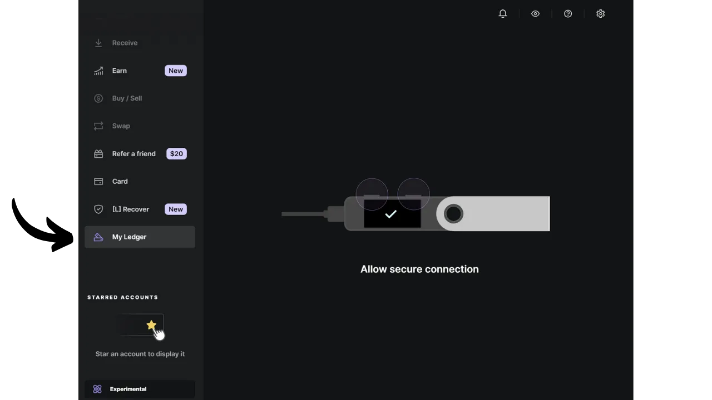
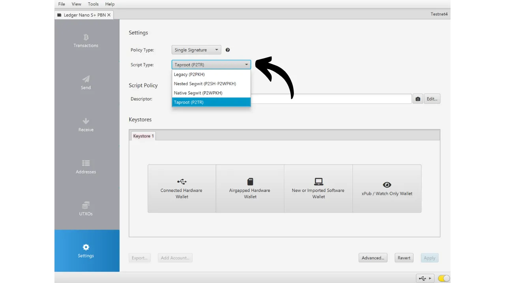
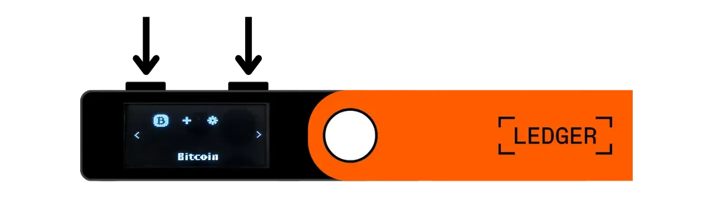
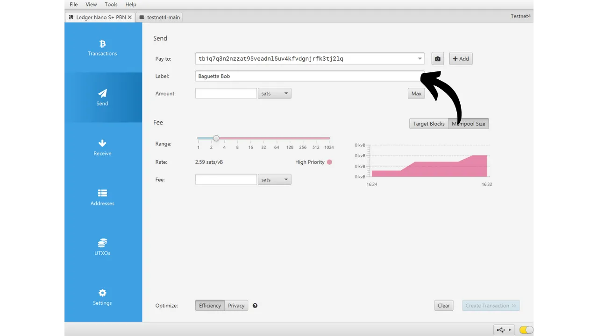

Uma carteira de hardware é um dispositivo eletrônico dedicado a gerenciar e proteger as chaves privadas de uma carteira Bitcoin. Ao contrário das carteiras de software (ou carteiras quentes) instaladas em máquinas de propósito geral frequentemente conectadas à Internet, as carteiras de hardware permitem o isolamento físico das chaves privadas, reduzindo os riscos de hacking e roubo.

O principal objetivo de uma carteira de hardware é minimizar as funcionalidades do dispositivo tanto quanto possível para reduzir sua superfície de ataque. Uma superfície de ataque menor também significa menos vetores de ataque potenciais, ou seja, menos fraquezas no sistema que os atacantes poderiam explorar para acessar bitcoins.

É recomendado usar uma carteira de hardware para proteger seus bitcoins, especialmente se você possui quantidades significativas, seja em valor absoluto ou como proporção de seus ativos totais.

As carteiras de hardware são usadas em combinação com um software de gerenciamento de carteira em um computador ou smartphone. Este software gerencia a criação de transações, mas a assinatura criptográfica necessária para validar essas transações é feita apenas dentro da carteira de hardware. Isso significa que as chaves privadas nunca são expostas a um ambiente potencialmente vulnerável.

As carteiras de hardware oferecem dupla proteção para o usuário: por um lado, elas protegem seus bitcoins contra ataques remotos ao manter as chaves privadas offline, e por outro lado, elas geralmente oferecem melhor resistência física contra tentativas de extrair as chaves. E é precisamente nesses 2 critérios de segurança que se pode julgar e classificar os diferentes modelos disponíveis no mercado.

Neste tutorial, proponho descobrir uma dessas soluções: o **Ledger Nano S Plus**.

## Introdução ao Ledger Nano S Plus

O Ledger Nano S Plus é uma carteira de hardware produzida pela empresa francesa Ledger, comercializada a um preço de 79 €.

O Nano S Plus é equipado com um chip certificado CC EAL6+ ("*elemento seguro*"), que oferece proteção avançada contra ataques físicos ao hardware. A tela e os botões são diretamente controlados por este chip. Um ponto de crítica frequentemente levantado é que o código deste chip não é de código aberto, o que requer uma certa confiança na integridade deste componente. No entanto, este elemento é auditado por especialistas independentes.

Em termos de uso, o Ledger Nano S Plus opera exclusivamente por meio de uma conexão USB-C com fio.

A Ledger se destaca de seus concorrentes por sua adoção sempre muito rápida de novas funcionalidades do Bitcoin, como Taproot ou Miniscript, por exemplo, o que é altamente apreciado.
Após testá-lo, acho que o Ledger Nano S Plus é uma excelente carteira de hardware de nível inicial. Oferece um alto nível de segurança por um preço razoável. Sua principal desvantagem em comparação com outros dispositivos na mesma faixa de preço é o fato de o código do firmware não ser de código aberto. Além disso, a tela do Nano S Plus é relativamente pequena em comparação com modelos mais caros, como o Ledger Flex ou o Coldcard Q1. No entanto, sua interface é muito bem projetada: apesar de seus dois botões e tela pequena, permanece fácil de usar, inclusive para recursos avançados como a passphrase BIP39. O Ledger Nano S Plus não possui bateria, conexão Air-gap, câmera ou porta micro SD, mas isso é bastante normal para essa faixa de preço.
Na minha opinião, o Ledger Nano S Plus é uma boa opção para proteger sua carteira Bitcoin, sendo adequado tanto para iniciantes quanto para usuários intermediários. No entanto, nesta faixa de preço, eu pessoalmente prefiro o Trezor Safe 3, que oferece aproximadamente as mesmas opções. A vantagem do Trezor, na minha visão, está na gestão do seu elemento seguro: a frase mnemônica e as chaves são gerenciadas exclusivamente por código de fonte aberta, mas ainda assim se beneficiam da proteção do chip. A desvantagem do Trezor é que eles são às vezes muito lentos na implementação de novas funcionalidades, ao contrário do Ledger.
## Como comprar um Ledger Nano S Plus?

O Ledger Nano S Plus está disponível para venda [no site oficial](https://shop.ledger.com/products/ledger-nano-s-plus). Para comprá-lo em uma loja física, você também pode encontrar [a lista de revendedores certificados](https://www.ledger.com/reseller) no site da Ledger.

## Pré-requisitos

Uma vez que você tenha recebido seu Ledger Nano, o primeiro passo é verificar a embalagem para garantir que ela não foi aberta. Se estiver danificada, isso pode indicar que a carteira de hardware foi comprometida e pode não ser autêntica.

Ao abrir, você deve encontrar os seguintes itens na caixa:
- O Ledger Nano S Plus;
- Um cabo USB-C para USB-A;
- Um manual do usuário;
- Cartões para anotar sua frase mnemônica.

Para este tutorial, você precisará de 2 aplicativos de software: Ledger Live para inicializar o Ledger, e Sparrow Wallet para gerenciar sua carteira Bitcoin. Baixe o [Ledger Live](https://www.ledger.com/ledger-live) e o [Sparrow Wallet](https://sparrowwallet.com/download/) dos seus sites oficiais.

Para esses dois programas de software, eu recomendo fortemente verificar tanto a autenticidade (com GnuPG) quanto a integridade (via hash) antes de instalá-los em sua máquina. Se você não tem certeza de como fazer isso, pode seguir este outro tutorial:
https://planb.network/tutorials/others/integrity-authenticity

## Como Inicializar um Ledger Nano?

Conecte seu Nano ao seu computador onde o Ledger Live e o Sparrow Wallet estão instalados. Para navegar no seu Ledger, use o botão esquerdo para ir para a esquerda e o botão direito para ir para a direita. Para selecionar ou confirmar uma opção, pressione ambos os botões simultaneamente.

Percorra as diferentes páginas de introdução e então clique nos 2 botões para começar.

Selecione a opção "*Configurar como um novo dispositivo*".

Escolha o código PIN que será usado para desbloquear seu Ledger. Isso é, portanto, uma proteção contra acesso físico não autorizado. Este código PIN não participa da derivação das chaves criptográficas da sua carteira. Assim, mesmo sem acesso a este código PIN, tendo sua frase mnemônica de 24 palavras permitirá que você recupere o acesso aos seus bitcoins.

É recomendado escolher um PIN de 8 dígitos, o mais aleatório possível. Além disso, certifique-se de salvar este código em um local diferente de onde seu Ledger Nano S Plus é armazenado (por exemplo, em um gerenciador de senhas).

Use os botões para mover sobre os dígitos, então selecione cada dígito clicando ambos os botões simultaneamente.

Digite seu PIN uma segunda vez para confirmá-lo.

Seu Nano fornece instruções sobre como gerenciar sua frase de recuperação.

**Esta frase mnemônica dá acesso total e irrestrito a todos os seus bitcoins**. Qualquer pessoa que possua esta frase pode roubar seus fundos, mesmo sem acesso físico ao seu Ledger. A frase de 24 palavras permite que você restaure o acesso aos seus bitcoins em caso de perda, roubo ou dano ao seu Ledger Nano. Portanto, é muito importante salvar e armazenar cuidadosamente em um local seguro.

Você pode anotá-la no papelão fornecido com seu Ledger, ou, para mais segurança, recomendo gravá-la em um meio de aço inoxidável para proteger contra os riscos de incêndios, inundações ou colapsos.

Você pode navegar por estas instruções e pular páginas clicando no botão direito.

O Ledger criará sua frase mnemônica usando seu gerador de números aleatórios. Certifique-se de não estar sendo observado durante esta operação. Anote as palavras fornecidas pelo Ledger no meio físico de sua escolha. Dependendo da sua estratégia de segurança, você pode considerar fazer várias cópias físicas completas da frase (mas, importante, não a divida). É crucial manter as palavras numeradas e em ordem sequencial.
***Obviamente, você nunca deve compartilhar essas palavras na internet, ao contrário do que estou fazendo neste tutorial. Esta carteira de exemplo será usada apenas no Testnet e será deletada após o tutorial.***

Para passar para as próximas palavras, clique no botão direito.

Uma vez que todas as palavras estejam anotadas, clique nos 2 botões para passar para a próxima etapa.

Clique nos dois botões "*Confirme sua frase de recuperação*", então selecione as palavras da sua frase mnemônica na ordem para confirmar que você as anotou corretamente. Use os botões esquerdo e direito para navegar entre as opções, então selecione a palavra correta clicando nos 2 botões. Continue este procedimento até a 24ª palavra.

Se a frase que você está confirmando corresponder exatamente àquela que o Ledger forneceu no passo anterior, você pode prosseguir. Se não, indica que seu backup físico da frase mnemônica está incorreto, e você precisa reiniciar o processo.

E é isso, sua semente foi corretamente criada no seu Ledger Nano S Plus. Antes de prosseguir para criar uma nova carteira Bitcoin a partir desta semente, vamos explorar juntos as configurações do dispositivo.

## Como modificar as configurações do seu Ledger?

Para acessar as configurações, mantenha pressionados os 2 botões por alguns segundos.

Clique no menu "*Configurações*".

E escolha "*Geral*".

No menu "*Idioma*", você pode alterar o idioma de exibição.

No menu "*Brilho*", você pode ajustar o brilho da tela. Não estamos interessados no restante das configurações gerais por agora.

Agora, vá para a seção de configurações de "*Segurança*".

"*Alterar PIN*" permite que você mude o seu código PIN. 
"*Frase-senha*" permite que você configure uma frase-senha BIP39. A frase-senha é uma senha opcional que, combinada com a sua frase de recuperação, fornece uma camada adicional de segurança para a sua carteira.

Atualmente, sua carteira é gerada a partir de uma frase mnemônica consistindo de 24 palavras. Esta frase de recuperação é muito importante porque permite que você restaure todas as chaves da sua carteira em caso de perda. No entanto, ela constitui um único ponto de falha (SPOF). Se for comprometida, seus bitcoins estão em perigo. É aqui que a frase-senha entra. É uma senha opcional, que você pode escolher arbitrariamente, que se adiciona à frase mnemônica para aumentar a segurança da carteira.

A frase-senha não deve ser confundida com o código PIN. Ela desempenha um papel na derivação de suas chaves criptográficas. Funciona em conjunto com a frase mnemônica, alterando a semente da qual as chaves são geradas. Assim, mesmo que alguém obtenha sua frase de 24 palavras, sem a frase-senha, não podem acessar seus fundos. Usar uma frase-senha essencialmente cria uma nova carteira com chaves distintas. Modificar (mesmo que levemente) a frase-senha gerará uma carteira diferente.

A frase-senha é uma ferramenta muito poderosa para aumentar a segurança dos seus bitcoins. No entanto, é muito importante entender como ela funciona antes de implementá-la, para evitar perder o acesso à sua carteira. É por isso que eu aconselho que você consulte este outro tutorial dedicado se desejar configurar uma frase-senha no seu Ledger:

https://planb.network/tutorials/wallet/passphrase-ledger

O menu "*Bloqueio por PIN*" permite que você configure e ative o bloqueio automático do seu Ledger após um período determinado de inatividade.

O menu "*Protetor de tela*" permite que você ajuste o modo de suspensão do seu Ledger Nano. Note que o protetor de tela não requer a entrada do PIN ao despertar, a menos que a opção "*Bloqueio por PIN*" esteja ativada para corresponder ao modo de suspensão. Esta função é especialmente útil para dispositivos Ledger Nano X equipados com bateria, para reduzir o consumo de energia.

Finalmente, o menu "*Resetar dispositivo*" permite que você redefina o seu Ledger. Prossiga com esta redefinição apenas se tiver certeza de que ele não contém nenhuma chave assegurando bitcoins, pois você poderia perder permanentemente o acesso aos seus fundos. Esta opção pode ser útil para realizar um teste de recuperação vazio, mas falarei sobre isso um pouco mais tarde.

## Como Instalar o Aplicativo Bitcoin?

Comece lançando o software Ledger Live no seu computador, depois conecte e desbloqueie o seu Ledger Nano. No Ledger Live, vá ao menu "*Meu Ledger*". Será solicitado que você autorize o acesso ao seu Nano.

Valide o acesso no seu Ledger clicando nos dois botões.

Primeiro, no Ledger Live, certifique-se de que o "*Genuine check*" apareça. Isso confirma que o seu dispositivo é autêntico.

Se o firmware do seu Ledger Nano não estiver atualizado, o Ledger Live automaticamente oferecerá para atualizá-lo. Se necessário, clique em "*Atualizar firmware*", depois em "*Instalar atualização*" para iniciar a instalação. No seu Ledger, clique nos dois botões para confirmar, e então aguarde durante a instalação.
Finalmente, vamos adicionar a aplicação Bitcoin. Para fazer isso, no Ledger Live, clique no botão "*Install*" ao lado de "*Bitcoin (BTC)*".

A aplicação será instalada no seu Nano.

A partir de agora, você não precisará mais do software Ledger Live para o gerenciamento regular da sua carteira. Você pode ocasionalmente retornar a ele para atualizar o firmware quando novas versões estiverem disponíveis. Para tudo o mais, usaremos o Sparrow Wallet, que é uma ferramenta muito mais abrangente para gerenciar efetivamente uma carteira Bitcoin.

## Como Configurar uma Nova Carteira Bitcoin com Sparrow?

Abra o Sparrow Wallet e pule as páginas de introdução para acessar a tela inicial. Verifique se você está corretamente conectado a um nó observando o interruptor localizado no canto inferior direito da tela.

Eu recomendo fortemente o uso do seu próprio nó Bitcoin. Neste tutorial, estou usando um nó público (amarelo) porque estou no testnet, mas para uso normal, é melhor optar por um Bitcoin Core local (verde) ou um servidor Electrum conectado a um nó remoto (azul).

Clique no menu "*File*" e depois em "*New Wallet*".

Escolha um nome para esta carteira e clique em "*Create Wallet*".

No menu suspenso "*Script Type*", selecione o tipo de script que será usado para proteger seus bitcoins. Eu recomendo optar por "*Taproot*", ou se não estiver disponível, "*Native SegWit*".

Clique no botão "*Connected Hardware Wallet*".

Se ainda não o fez, conecte seu Ledger Nano S Plus ao computador, desbloqueie-o com seu código PIN e, em seguida, abra a aplicação "*Bitcoin*" clicando nos 2 botões uma vez no logo do Bitcoin.

*Neste tutorial, estou usando a aplicação Bitcoin Testnet, mas o procedimento permanece o mesmo para o mainnet.*

No Sparrow, clique no botão "*Scan*".

Em seguida, clique em "*Import Keystore*".

Agora você pode ver os detalhes da sua carteira, incluindo a chave pública estendida da sua primeira conta. Clique no botão "*Apply*" para finalizar a criação da carteira.

Escolha uma senha forte para garantir o acesso ao Sparrow Wallet. Esta senha garantirá a segurança do acesso aos dados da sua carteira no Sparrow, o que ajuda a proteger suas chaves públicas, endereços, rótulos e histórico de transações contra qualquer acesso não autorizado.

Eu aconselho você a salvar esta senha em um gerenciador de senhas para não esquecê-la.

E pronto, sua carteira agora está criada!

Antes de receber seus primeiros bitcoins na sua carteira, **eu aconselho fortemente que você faça um teste de recuperação em seco**. Anote uma informação de referência, como o seu xpub, depois resete seu Ledger Nano enquanto a carteira ainda estiver vazia. Em seguida, tente restaurar sua carteira no Ledger usando seus backups em papel. Verifique se o xpub gerado após a restauração corresponde ao que você inicialmente anotou. Se sim, você pode ter certeza de que seus backups em papel são confiáveis.
Para aprender mais sobre como realizar um teste de recuperação, aconselho que consulte este outro tutorial:

https://planb.network/tutorials/wallet/recovery-test

## Como receber bitcoins com o Ledger Nano?

Clique na aba "*Receber*".

Conecte seu Ledger Nano S Plus ao computador, desbloqueie-o com seu código PIN, depois abra a aplicação "*Bitcoin*".

Antes de usar o endereço fornecido pelo Sparrow Wallet, verifique-o na tela do seu Ledger. Esta prática permite que você confirme que o endereço exibido no Sparrow não é fraudulento e que a carteira de hardware de fato possui a chave privada necessária para gastar os bitcoins assegurados com este endereço mais tarde. Isso ajuda a evitar vários tipos de ataques.
Para realizar esta verificação, clique no botão "*Exibir Endereço*".

Certifique-se de que o endereço exibido no seu Ledger corresponde ao indicado no Sparrow Wallet. Também é recomendado realizar esta verificação justo antes de dar seu endereço ao remetente, para ter certeza de sua validade. Você pode usar os botões para visualizar o endereço completo.

Então clique em "*Aprovar*" se os endereços forem de fato idênticos.

Você pode adicionar um "*Rótulo*" para descrever a origem dos bitcoins que serão assegurados com este endereço. Esta é uma boa prática que ajuda a gerenciar seus UTXOs melhor.

Para mais informações sobre rotulação, também aconselho que confira este outro tutorial:

https://planb.network/tutorials/privacy/utxo-labelling

Você pode então usar este endereço para receber bitcoins.

## Como enviar bitcoins com o Ledger Nano?

Agora que você recebeu seus primeiros sats na sua carteira assegurada com o Nano S Plus, você também pode gastá-los! Conecte seu Ledger ao seu computador, desbloqueie-o, inicie o Sparrow Wallet e, em seguida, vá para a aba "*Enviar*" para construir uma nova transação.

Se você quiser fazer "*controle de moedas*", ou seja, escolher especificamente quais UTXOs consumir na transação, vá para a aba "*UTXOs*". Selecione os UTXOs que deseja gastar, depois clique em "*Enviar Selecionados*". Você será redirecionado para a mesma tela da aba "*Enviar*", mas com seus UTXOs já selecionados para a transação.

Insira o endereço de destino. Você também pode inserir múltiplos endereços clicando no botão "*+ Adicionar*".

Anote um "*Rótulo*" para lembrar o propósito deste gasto.

Escolha o valor a ser enviado para este endereço.

Ajuste a taxa de transação de acordo com o mercado atual.

Certifique-se de que todas as configurações da sua transação estão corretas, então clique em "*Criar Transação*".

Se tudo parecer correto para você, clique em "*Finalizar Transação para Assinatura*".

Clique em "*Assinar*".

Clique em "*Assinar*" ao lado do seu Ledger Nano S Plus.

Verifique as configurações da transação na tela do seu Ledger, incluindo o endereço de recebimento do destinatário, o valor enviado e o montante da taxa.

Se tudo parecer correto para você, pressione os dois botões em "*Assinar transação*" para assinar.

Sua transação está agora assinada. Verifique novamente se tudo está correto para você, então clique em "*Transmitir Transação*" para divulgá-la na rede Bitcoin.

Você pode encontrá-la na aba "*Transações*" do Sparrow Wallet.

Parabéns, você agora está por dentro do uso básico do Ledger Nano S Plus com o Sparrow Wallet! Em um tutorial futuro, veremos como usar o Ledger com Liana para aproveitar o Miniscript.

Se você achou este tutorial útil, eu ficaria grato se você pudesse deixar um joinha abaixo. Sinta-se livre para compartilhar este artigo em suas redes sociais. Muito obrigado!

Eu também recomendo que você confira este tutorial completo sobre o Ledger Flex:

https://planb.network/tutorials/wallet/ledger-flex