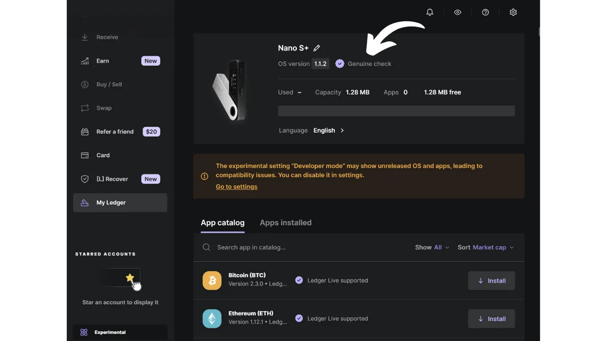
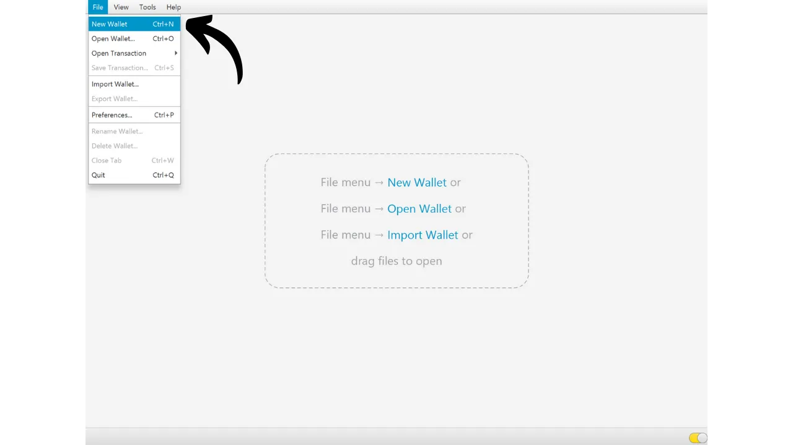
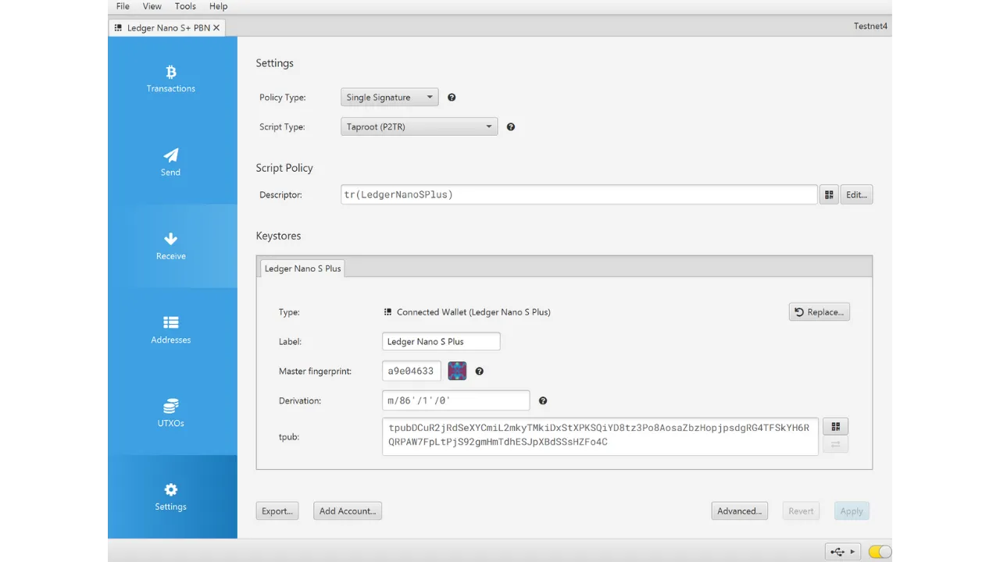

Аппаратный кошелек — это электронное устройство, предназначенное для управления и защиты приватных ключей биткойн-кошелька. В отличие от программных кошельков (или горячих кошельков), установленных на универсальных машинах, часто подключенных к Интернету, аппаратные кошельки позволяют физически изолировать приватные ключи, снижая риски взлома и кражи.

Основная цель аппаратного кошелька — максимально сократить функциональность устройства, чтобы уменьшить его уязвимость для атак. Меньшая уязвимость также означает меньше потенциальных векторов атаки, т.е. меньше слабостей в системе, которые злоумышленники могли бы использовать для доступа к биткойнам.

Рекомендуется использовать аппаратный кошелек для защиты ваших биткойнов, особенно если вы владеете значительными суммами, будь то в абсолютном значении или как доля от ваших общих активов.

Аппаратные кошельки используются в сочетании с программным обеспечением для управления кошельком на компьютере или смартфоне. Это программное обеспечение управляет созданием транзакций, но криптографическая подпись, необходимая для подтверждения этих транзакций, выполняется только внутри аппаратного кошелька. Это означает, что приватные ключи никогда не подвергаются потенциально уязвимой среде.

Аппаратные кошельки предлагают двойную защиту для пользователя: с одной стороны, они защищают ваши биткойны от удаленных атак, сохраняя приватные ключи вне сети, а с другой стороны, они обычно предлагают лучшую физическую устойчивость против попыток извлечения ключей. И именно по этим 2 критериям безопасности можно судить и ранжировать различные доступные на рынке модели.

В этом руководстве я предлагаю изучить одно из таких решений: **Ledger Nano S Plus**.

## Введение в Ledger Nano S Plus

Ledger Nano S Plus — это аппаратный кошелек, произведенный французской компанией Ledger, предлагаемый по цене 79 €.

Nano S Plus оснащен чипом, сертифицированным по стандарту CC EAL6+ ("*secure element*"), который предлагает вам продвинутую защиту от физических атак на аппаратное обеспечение. Экран и кнопки напрямую управляются этим чипом. Часто высказываемым критическим замечанием является то, что код этого чипа не является открытым, что требует определенного доверия к целостности этого компонента. Тем не менее, этот элемент проходит аудит независимыми экспертами.

С точки зрения использования, Ledger Nano S Plus работает исключительно через проводное соединение USB-C.

Ledger выделяется среди конкурентов своим всегда очень быстрым внедрением новых функций Bitcoin, таких как Taproot или Miniscript, что высоко ценится.
После тестирования я нахожу, что Ledger Nano S Plus является отличным аппаратным кошельком начального уровня. Он предлагает высокий уровень безопасности за разумную цену. Его основным недостатком по сравнению с другими устройствами в том же ценовом диапазоне является тот факт, что код прошивки не является открытым. Кроме того, экран Nano S Plus относительно мал по сравнению с более дорогими моделями, такими как Ledger Flex или Coldcard Q1. Тем не менее, его интерфейс очень хорошо спроектирован: несмотря на его две кнопки и маленький экран, он остается легким в использовании, включая для продвинутых функций, таких как фраза-пароль BIP39. У Ledger Nano S Plus нет батареи, соединения Air-gap, камеры или порта micro SD, но это вполне нормально для данного ценового диапазона.
На мой взгляд, Ledger Nano S Plus является хорошим выбором для защиты вашего биткойн-кошелька и подходит как для начинающих, так и для пользователей среднего уровня. Однако в этом ценовом диапазоне я лично предпочитаю Trezor Safe 3, который предлагает примерно те же возможности. Преимущество Trezor, по моему мнению, заключается в управлении его защищенным элементом: мнемоническая фраза и ключи управляются исключительно открытым исходным кодом, но при этом все еще пользуются защитой чипа. Недостаток Trezor заключается в том, что они иногда очень медленно внедряют новые функции в отличие от Ledger.
## Как купить Ledger Nano S Plus?

Ledger Nano S Plus доступен для продажи [на официальном сайте](https://shop.ledger.com/products/ledger-nano-s-plus). Чтобы купить его в физическом магазине, вы также можете найти [список сертифицированных реселлеров](https://www.ledger.com/reseller) на сайте Ledger.

## Предварительные требования

После получения вашего Ledger Nano первым шагом будет проверка упаковки на предмет ее вскрытия. Если она повреждена, это может указывать на то, что аппаратный кошелек был скомпрометирован и может быть не подлинным.

При открытии вы должны найти в коробке следующие предметы:
- Ledger Nano S Plus;
- Кабель USB-C на USB-A;
- Руководство пользователя;
- Карты для записи вашей мнемонической фразы.

Для этого урока вам понадобятся 2 программных приложения: Ledger Live для инициализации Ledger и Sparrow Wallet для управления вашим биткойн-кошельком. Скачайте [Ledger Live](https://www.ledger.com/ledger-live) и [Sparrow Wallet](https://sparrowwallet.com/download/) с их официальных сайтов.

Для этих двух программных приложений я настоятельно рекомендую проверить их подлинность (с помощью GnuPG) и целостность (через хеш) перед установкой их на ваш компьютер. Если вы не уверены, как это сделать, вы можете следовать этому другому уроку:
https://planb.network/tutorials/others/integrity-authenticity

## Как инициализировать Ledger Nano?

Подключите ваш Nano к компьютеру, где установлены Ledger Live и Sparrow Wallet. Для навигации по вашему Ledger используйте левую кнопку для перемещения влево и правую кнопку для перемещения вправо. Чтобы выбрать или подтвердить опцию, нажмите обе кнопки одновременно.

Пролистайте различные вводные страницы, а затем нажмите на 2 кнопки, чтобы начать.

Выберите опцию "*Настроить как новое устройство*".

Выберите PIN-код, который будет использоваться для разблокировки вашего Ledger. Это, таким образом, защита от несанкционированного физического доступа. Этот PIN-код не играет роли в производстве криптографических ключей вашего кошелька. Таким образом, даже без доступа к этому PIN-коду, имея вашу 24-словную мнемоническую фразу, вы сможете восстановить доступ к вашим биткойнам.

Рекомендуется выбрать 8-значный PIN-код, настолько случайный, насколько это возможно. Также убедитесь, что вы сохраните этот код в месте, отличном от места хранения вашего Ledger Nano S Plus (например, в менеджере паролей).

Используйте кнопки для перемещения по цифрам, затем выберите каждую цифру, нажимая обе кнопки одновременно.

Введите свой PIN-код второй раз для подтверждения.
Ваш Nano предоставляет инструкции о том, как управлять вашей фразой восстановления.

**Эта мнемоническая фраза дает полный и неограниченный доступ ко всем вашим биткоинам**. Любой, кто владеет этой фразой, может украсть ваши средства, даже не имея физического доступа к вашему Ledger. 24-словная фраза позволяет вам восстановить доступ к вашим биткоинам в случае потери, кражи или повреждения вашего Ledger Nano. Поэтому очень важно тщательно сохранить и хранить ее в безопасном месте.

Вы можете записать ее на картонной бумаге, предоставленной вместе с вашим Ledger, или для большей безопасности я рекомендую выгравировать ее на носителе из нержавеющей стали, чтобы защитить от рисков пожаров, наводнений или обрушений.

Вы можете просматривать эти инструкции и пропускать страницы, нажимая правую кнопку.

Ledger создаст вашу мнемоническую фразу, используя свой генератор случайных чисел. Убедитесь, что вас никто не наблюдает во время этой операции. Запишите слова, предоставленные Ledger, на физическом носителе вашего выбора. В зависимости от вашей стратегии безопасности, вы можете рассмотреть возможность создания нескольких полных физических копий фразы (но важно, не разделяйте ее). Крайне важно сохранять слова пронумерованными и в последовательном порядке.
***Очевидно, вы никогда не должны делиться этими словами в интернете, в отличие от того, что я делаю в этом учебнике. Этот пример кошелька будет использоваться только на Testnet и будет удален после учебника.***

Чтобы перейти к следующим словам, нажмите правую кнопку.

Как только все слова будут записаны, нажмите 2 кнопки, чтобы перейти к следующему шагу.

Нажмите на две кнопки "*Подтвердите вашу фразу восстановления*", затем выберите слова вашей мнемонической фразы в их порядке, чтобы подтвердить, что вы правильно их записали. Используйте левую и правую кнопки для навигации между вариантами, затем выберите правильное слово, нажав 2 кнопки. Продолжайте эту процедуру до 24-го слова.

Если фраза, которую вы подтверждаете, точно совпадает с той, которую Ledger предоставил вам на предыдущем шаге, вы можете продолжить. Если нет, это указывает на то, что ваш физический бэкап мнемонической фразы неверен, и вам нужно начать процесс заново.

И вот вы успешно создали ваш seed на вашем Ledger Nano S Plus. Прежде чем переходить к созданию нового биткоин-кошелька из этого seed, давайте вместе исследуем настройки устройства.

## Как изменить настройки вашего Ledger?

Чтобы получить доступ к настройкам, удерживайте 2 кнопки в течение нескольких секунд.

Нажмите на меню "*Настройки*".

И выберите "*Общие*".

В меню "*Язык*" вы можете изменить язык отображения.

В меню "*Яркость*" вы можете настроить яркость экрана. Остальные общие настройки нас пока не интересуют.

Теперь перейдите в раздел настроек "*Безопасность*".
"*Смена PIN-кода*" позволяет вам изменить ваш PIN-код. 
"*Парольная фраза*" позволяет настроить парольную фразу BIP39. Парольная фраза является необязательным паролем, который, в сочетании с вашей фразой восстановления, обеспечивает дополнительный уровень безопасности для вашего кошелька.

В настоящее время ваш кошелек генерируется из мнемонической фразы, состоящей из 24 слов. Эта фраза восстановления очень важна, поскольку она позволяет вам восстановить все ключи вашего кошелька в случае потери. Однако она является единственной точкой отказа (SPOF). Если она будет скомпрометирована, ваши биткоины окажутся в опасности. Здесь на помощь приходит парольная фраза. Это необязательный пароль, который вы можете выбрать произвольно, который добавляется к мнемонической фразе для повышения безопасности кошелька.

Парольная фраза не следует путать с PIN-кодом. Она играет роль в производном процессе ваших криптографических ключей. Она работает вместе с мнемонической фразой, изменяя семя, из которого генерируются ключи. Таким образом, даже если кто-то получит вашу 24-словную фразу, без парольной фразы они не смогут получить доступ к вашим средствам. Использование парольной фразы по сути создает новый кошелек с отличными ключами. Изменение (даже незначительное) парольной фразы приведет к генерации другого кошелька.

Парольная фраза является очень мощным инструментом для повышения безопасности ваших биткоинов. Однако очень важно понимать, как она работает, прежде чем применять ее, чтобы избежать потери доступа к вашему кошельку. Поэтому я советую вам проконсультироваться с этим другим учебным пособием, если вы хотите настроить парольную фразу на вашем Ledger:

https://planb.network/tutorials/wallet/passphrase-ledger

Меню "*Блокировка PIN-кода*" позволяет настроить и активировать автоматическую блокировку вашего Ledger после определенного периода бездействия.

Меню "*Заставка*" позволяет настроить режим сна вашего Ledger Nano. Обратите внимание, что для выхода из режима сна не требуется ввод PIN-кода, если не активирована опция "*Блокировка PIN-кода*", соответствующая режиму сна. Эта функция особенно полезна для устройств Ledger Nano X, оснащенных аккумулятором, для снижения их энергопотребления.

Наконец, меню "*Сброс устройства*" позволяет вам сбросить ваш Ledger. Производите сброс только в том случае, если вы уверены, что на нем не содержатся ключи, обеспечивающие доступ к биткоинам, так как вы можете навсегда потерять доступ к вашим средствам. Эта опция может быть полезна для выполнения пустого теста восстановления, но об этом я расскажу немного позже.

## Как установить приложение Bitcoin?

Начните с запуска программного обеспечения Ledger Live на вашем компьютере, затем подключите и разблокируйте ваш Ledger Nano. В Ledger Live перейдите в меню "*Мой Ledger*". Вам будет предложено авторизовать доступ к вашему Nano.

Подтвердите доступ на вашем Ledger, нажав на две кнопки.

Сначала в Ledger Live убедитесь, что появляется "*Проверка подлинности*". Это подтверждает, что ваше устройство является подлинным.

Если прошивка вашего Ledger Nano устарела, Ledger Live автоматически предложит обновить ее. При необходимости нажмите на "*Обновить прошивку*", затем на "*Установить обновление*", чтобы начать установку. На вашем Ledger нажмите две кнопки для подтверждения, затем подождите во время установки.
Наконец, мы добавим приложение Bitcoin. Для этого в Ledger Live нажмите на кнопку "*Установить*" рядом с "*Bitcoin (BTC)*".

Приложение установится на ваш Nano.

С этого момента вам больше не понадобится программное обеспечение Ledger Live для регулярного управления вашим кошельком. Вы можете время от времени возвращаться к нему для обновления прошивки, когда будут доступны новые версии. Для всего остального мы будем использовать Sparrow Wallet, который является гораздо более комплексным инструментом для эффективного управления Bitcoin кошельком.

## Как настроить новый Bitcoin кошелек с помощью Sparrow?

Откройте Sparrow Wallet и пропустите страницы введения, чтобы перейти на главный экран. Проверьте, что вы правильно подключены к узлу, наблюдая за переключателем, расположенным в нижнем правом углу экрана.

Я настоятельно рекомендую использовать собственный Bitcoin узел. В этом учебнике я использую публичный узел (желтый), потому что я на тестнете, но для обычного использования лучше выбрать локальный Bitcoin Core (зеленый) или сервер Electrum, подключенный к удаленному узлу (синий).

Нажмите на меню "*Файл*" затем "*Новый кошелек*".

Выберите имя для этого кошелька, затем нажмите на "*Создать кошелек*".

В выпадающем меню "*Тип скрипта*" выберите тип скрипта, который будет использоваться для защиты ваших биткойнов. Я рекомендую выбрать "*Taproot*", или, если он недоступен, "*Native SegWit*".

Нажмите на кнопку "*Подключенный аппаратный кошелек*".

Если вы еще этого не сделали, подключите ваш Ledger Nano S Plus к компьютеру, разблокируйте его с помощью PIN-кода, а затем откройте приложение "*Bitcoin*", нажав один раз на две кнопки на логотипе Bitcoin.

*В этом учебнике я использую приложение Bitcoin Testnet, но процедура остается той же для основной сети.*

В Sparrow нажмите на кнопку "*Сканировать*".

Затем нажмите на "*Импортировать хранилище ключей*".

Теперь вы можете видеть детали вашего кошелька, включая расширенный публичный ключ вашего первого аккаунта. Нажмите на кнопку "*Применить*", чтобы завершить создание кошелька.

Выберите надежный пароль для доступа к Sparrow Wallet. Этот пароль обеспечит безопасность доступа к данным вашего кошелька в Sparrow, что поможет защитить ваши публичные ключи, адреса, метки и историю транзакций от любого несанкционированного доступа.

Я советую сохранить этот пароль в менеджере паролей, чтобы вы не забыли его.

И вот, ваш кошелек теперь создан!

Прежде чем получить ваши первые биткоины в кошелек, **настоятельно рекомендую провести тест восстановления в "сухом" режиме**. Запишите справочную информацию, например, ваш xpub, затем сбросьте ваш Ledger Nano, пока кошелек еще пуст. После этого попробуйте восстановить ваш кошелек на Ledger, используя ваши бумажные резервные копии. Проверьте, что сгенерированный после восстановления xpub совпадает с тем, который вы изначально записали. Если это так, вы можете быть уверены, что ваши бумажные резервные копии надежны.
Чтобы узнать больше о том, как провести тест восстановления, рекомендую проконсультироваться с этим другим руководством:

https://planb.network/tutorials/wallet/recovery-test

## Как получить биткоины с помощью Ledger Nano?

Нажмите на вкладку "*Получить*".

Подключите ваш Ledger Nano S Plus к компьютеру, разблокируйте его с помощью вашего PIN-кода, затем откройте приложение "*Bitcoin*".

Прежде чем использовать адрес, предоставленный Sparrow Wallet, проверьте его на экране вашего Ledger. Эта практика позволяет вам подтвердить, что адрес, отображаемый в Sparrow, не является мошенническим и что аппаратный кошелек действительно хранит приватный ключ, необходимый для последующего расходования биткоинов, защищенных этим адресом. Это помогает избежать нескольких типов атак.
Для выполнения этой проверки нажмите на кнопку "*Показать адрес*".

Убедитесь, что адрес, отображаемый на вашем Ledger, совпадает с указанным в Sparrow Wallet. Также рекомендуется проводить эту проверку непосредственно перед тем, как давать ваш адрес отправителю, чтобы быть уверены в его действительности. Вы можете использовать кнопки для просмотра полного адреса.

Затем нажмите на "*Подтвердить*", если адреса действительно идентичны.

Вы можете добавить "*Метку*", чтобы описать источник биткоинов, которые будут защищены этим адресом. Это хорошая практика, которая помогает вам лучше управлять вашими UTXO.

Для получения дополнительной информации о маркировке также рекомендую ознакомиться с этим другим руководством:

https://planb.network/tutorials/privacy/utxo-labelling

Затем вы можете использовать этот адрес для получения биткоинов.

## Как отправить биткоины с помощью Ledger Nano?

Теперь, когда вы получили ваши первые сатоши в кошелек, защищенный Nano S Plus, вы также можете их потратить! Подключите ваш Ledger к компьютеру, разблокируйте его, запустите Sparrow Wallet и перейдите на вкладку "*Отправить*", чтобы создать новую транзакцию.

Если вы хотите выполнить "*контроль монет*", то есть специально выбрать, какие UTXO использовать в транзакции, перейдите на вкладку "*UTXO*". Выберите UTXO, которые вы хотите потратить, затем нажмите на "*Отправить выбранные*". Вы будете перенаправлены на тот же экран вкладки "*Отправить*", но с уже выбранными для транзакции UTXO.

Введите адрес назначения. Вы также можете ввести несколько адресов, нажав на кнопку "*+ Добавить*".

Отметьте "*Метку*", чтобы помнить цель этого расхода.

Выберите сумму, отправляемую на этот адрес.

Настройте ставку комиссии за транзакцию в соответствии с текущим рыночным положением.

Убедитесь, что все настройки вашей транзакции верны, затем нажмите на "*Создать транзакцию*".

Если все выглядит хорошо, нажмите на "*Финализировать транзакцию для подписи*".

Нажмите на "*Подписать*".

Нажмите на "*Подписать*" рядом с вашим Ledger Nano S Plus.

Проверьте настройки транзакции на экране вашего Ledger, включая адрес получателя, отправляемую сумму и размер комиссии.

Если все выглядит хорошо, нажмите две кнопки на "*Подписать транзакцию*", чтобы подписать.

Ваша транзакция теперь подписана. Еще раз проверьте, все ли выглядит хорошо, затем нажмите на "*Разослать транзакцию*", чтобы транслировать ее в сеть Bitcoin.

Вы можете найти ее во вкладке "*Транзакции*" Sparrow Wallet.

Поздравляем, теперь вы знаете основы использования Ledger Nano S Plus с Sparrow Wallet! В будущем уроке мы рассмотрим, как использовать Ledger с Liana для использования Miniscript.

Если вы нашли этот урок полезным, я был бы признателен, если бы вы оставили лайк ниже. Не стесняйтесь делиться этой статьей в своих социальных сетях. Большое спасибо!

Я также рекомендую вам ознакомиться с этим полным руководством по Ledger Flex:

https://planb.network/tutorials/wallet/ledger-flex