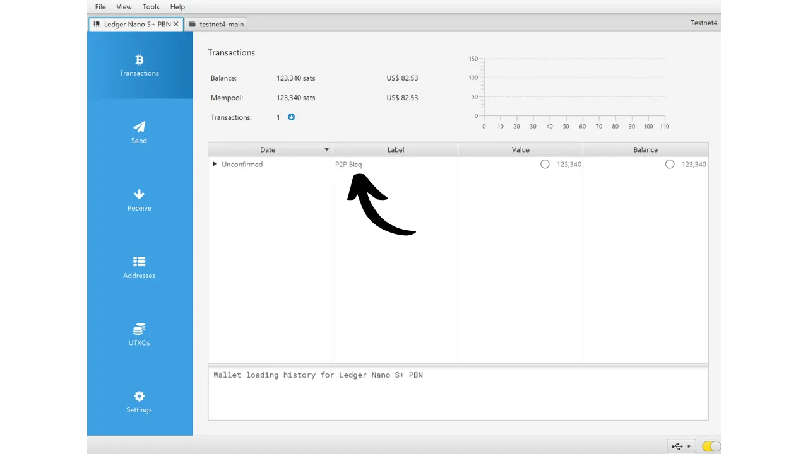
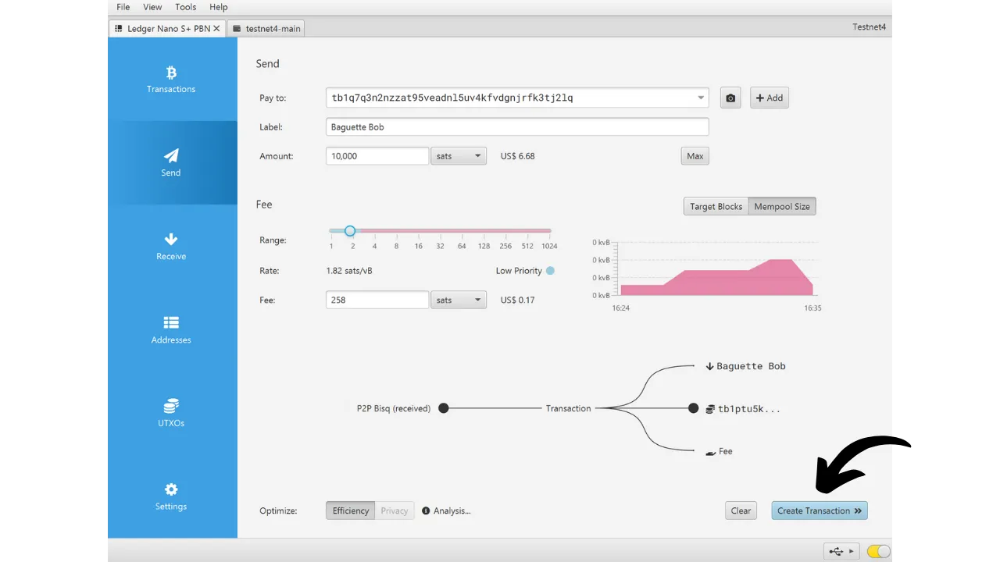
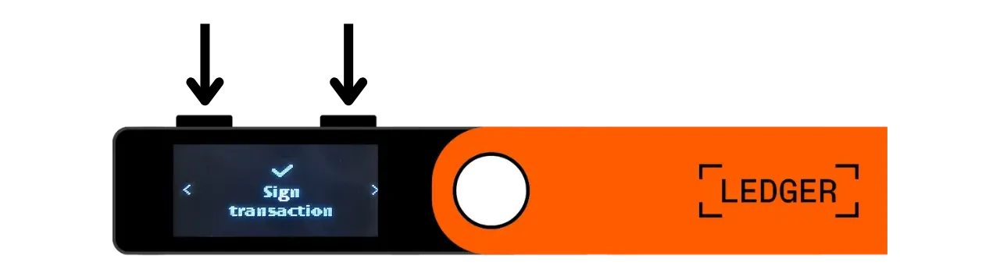

Một ví cứng là một thiết bị điện tử chuyên dụng để quản lý và bảo mật các khóa riêng của một ví Bitcoin. Khác với các ví phần mềm (hoặc ví nóng) được cài đặt trên các máy tính đa năng thường xuyên kết nối với Internet, ví cứng cho phép cô lập vật lý các khóa riêng, giảm thiểu rủi ro bị hack và mất cắp.

Mục tiêu chính của một ví cứng là giảm thiểu chức năng của thiết bị càng nhiều càng tốt để giảm bề mặt tấn công. Một bề mặt tấn công nhỏ hơn cũng có nghĩa là ít véc-tơ tấn công tiềm năng hơn, tức là ít điểm yếu trong hệ thống mà kẻ tấn công có thể khai thác để truy cập vào bitcoin.

Việc sử dụng ví cứng để bảo mật bitcoin của bạn được khuyến nghị, đặc biệt nếu bạn sở hữu một lượng lớn, dù là về giá trị tuyệt đối hay tỷ lệ so với tổng tài sản của bạn.

Ví cứng được sử dụng kết hợp với phần mềm quản lý ví trên máy tính hoặc điện thoại thông minh. Phần mềm này quản lý việc tạo giao dịch, nhưng chữ ký mật mã cần thiết để xác nhận các giao dịch này chỉ được thực hiện trong ví cứng. Điều này có nghĩa là các khóa riêng không bao giờ được tiếp xúc với môi trường có thể bị tấn công.

Ví cứng cung cấp hai lớp bảo vệ cho người dùng: một mặt, chúng bảo vệ bitcoin của bạn khỏi các cuộc tấn công từ xa bằng cách giữ các khóa riêng ngoại tuyến, và mặt khác, chúng thường cung cấp khả năng chống chịu vật lý tốt hơn đối với các nỗ lực nhằm trích xuất các khóa. Và chính trên 2 tiêu chí bảo mật này, người ta có thể đánh giá và xếp hạng các mô hình khác nhau có trên thị trường.

Trong hướng dẫn này, tôi đề xuất khám phá một trong những giải pháp này: **Ledger Nano S Plus**.

## Giới thiệu về Ledger Nano S Plus

Ledger Nano S Plus là một ví cứng do công ty Pháp Ledger sản xuất, được bán với giá 79 €.

Nano S Plus được trang bị chip được chứng nhận CC EAL6+ ("*secure element*"), mang lại cho bạn sự bảo vệ tiên tiến chống lại các cuộc tấn công vật lý vào phần cứng. Màn hình và các nút được điều khiển trực tiếp bởi chip này. Một điểm chỉ trích thường gặp là mã của chip này không phải là mã nguồn mở, điều này đòi hỏi phải tin tưởng vào tính toàn vẹn của thành phần này. Tuy nhiên, thành phần này được kiểm định bởi các chuyên gia độc lập.

Về cách sử dụng, Ledger Nano S Plus hoạt động hoàn toàn thông qua kết nối USB-C có dây.

Ledger nổi bật so với các đối thủ cạnh tranh bởi sự áp dụng nhanh chóng các tính năng mới của Bitcoin, như Taproot hay Miniscript, chẳng hạn, điều này được đánh giá cao.

Sau khi thử nghiệm, tôi thấy rằng Ledger Nano S Plus là một ví cứng cấp đầu vào xuất sắc. Nó cung cấp một mức độ bảo mật cao với một giá cả hợp lý. Nhược điểm chính so với các thiết bị khác trong cùng phân khúc giá là mã firmware không phải là mã nguồn mở. Ngoài ra, màn hình của Nano S Plus tương đối nhỏ so với các mô hình đắt tiền hơn, như Ledger Flex hay Coldcard Q1. Tuy nhiên, giao diện của nó được thiết kế rất tốt: mặc dù chỉ có hai nút và màn hình nhỏ, nó vẫn dễ sử dụng, bao gồm cả các tính năng nâng cao như cụm từ mật khẩu BIP39. Ledger Nano S Plus không có pin, kết nối Air-gap, camera, hoặc cổng micro SD, nhưng điều này là khá bình thường cho phân khúc giá này.
Theo ý kiến của tôi, Ledger Nano S Plus là một lựa chọn tốt để bảo mật ví Bitcoin của bạn, phù hợp với cả người mới bắt đầu và người dùng trung cấp. Tuy nhiên, trong tầm giá này, cá nhân tôi thích Trezor Safe 3 hơn, vì nó cung cấp gần như các tùy chọn tương tự. Ưu điểm của Trezor, theo quan điểm của tôi, là trong việc quản lý phần tử bảo mật: cụm từ ghi nhớ và khóa được quản lý độc quyền bởi mã nguồn mở, nhưng vẫn được bảo vệ bởi chip. Nhược điểm của Trezor là họ đôi khi rất chậm trong việc triển khai các tính năng mới không giống như Ledger.
## Làm thế nào để mua Ledger Nano S Plus?

Ledger Nano S Plus có sẵn để bán [trên trang web chính thức](https://shop.ledger.com/products/ledger-nano-s-plus). Để mua nó tại cửa hàng vật lý, bạn cũng có thể tìm [danh sách các nhà bán lẻ được chứng nhận](https://www.ledger.com/reseller) trên trang web của Ledger.

## Điều kiện tiên quyết

Khi bạn đã nhận được Ledger Nano của mình, bước đầu tiên là kiểm tra bao bì để đảm bảo nó chưa được mở. Nếu nó bị hỏng, điều này có thể chỉ ra rằng ví cứng đã bị xâm phạm và có thể không phải là hàng chính hãng.

Khi mở ra, bạn nên tìm thấy các mục sau trong hộp:
- Ledger Nano S Plus;
- Cáp USB-C sang USB-A;
- Sách hướng dẫn sử dụng;
- Thẻ để ghi cụm từ ghi nhớ của bạn.

Đối với hướng dẫn này, bạn sẽ cần 2 ứng dụng phần mềm: Ledger Live để khởi tạo Ledger, và Sparrow Wallet để quản lý ví Bitcoin của bạn. Tải về [Ledger Live](https://www.ledger.com/ledger-live) và [Sparrow Wallet](https://sparrowwallet.com/download/) từ trang web chính thức của họ.

Đối với hai chương trình phần mềm này, tôi khuyên bạn nên kiểm tra cả tính xác thực (với GnuPG) và tính toàn vẹn (qua hash) trước khi cài đặt chúng vào máy của bạn. Nếu bạn không chắc cách làm thế nào, bạn có thể theo dõi hướng dẫn khác này:
https://planb.network/tutorials/others/integrity-authenticity

## Làm thế nào để Khởi tạo một Ledger Nano?

Kết nối Nano của bạn với máy tính nơi đã cài đặt Ledger Live và Sparrow Wallet. Để điều hướng trên Ledger của bạn, sử dụng nút bên trái để đi sang trái và nút bên phải để đi sang phải. Để chọn hoặc xác nhận một tùy chọn, nhấn cả hai nút cùng một lúc.

Cuộn qua các trang giới thiệu khác nhau và sau đó nhấp vào 2 nút để bắt đầu.

Chọn tùy chọn "*Thiết lập như một thiết bị mới*".

Chọn mã PIN sẽ được sử dụng để mở khóa Ledger của bạn. Đây do đó là một biện pháp bảo vệ chống lại truy cập vật lý không được phép. Mã PIN này không tham gia vào việc tạo ra các khóa mật mã của ví của bạn. Do đó, ngay cả khi không có quyền truy cập vào mã PIN này, việc có cụm từ ghi nhớ 24 từ sẽ cho phép bạn lấy lại quyền truy cập vào bitcoin của mình.

Khuyến nghị chọn một mã PIN 8 chữ số, càng ngẫu nhiên càng tốt. Ngoài ra, hãy chắc chắn lưu mã này ở một nơi khác nơi bạn lưu trữ Ledger Nano S Plus của mình (ví dụ, trong một trình quản lý mật khẩu).

Sử dụng các nút để di chuyển qua các chữ số, sau đó chọn từng chữ số bằng cách nhấn cả hai nút cùng một lúc.

Nhập lại mã PIN một lần nữa để xác nhận.
Nano của bạn cung cấp hướng dẫn về cách quản lý cụm từ khôi phục của bạn.

**Cụm từ ghi nhớ này cung cấp quyền truy cập đầy đủ và không giới hạn vào tất cả bitcoin của bạn**. Bất kỳ ai sở hữu cụm từ này đều có thể ăn cắp tiền của bạn, ngay cả khi không có quyền truy cập vật lý vào Ledger của bạn. Cụm từ 24 từ cho phép bạn khôi phục quyền truy cập vào bitcoin của mình trong trường hợp mất mát, trộm cắp, hoặc hỏng hóc Ledger Nano của bạn. Do đó, việc lưu trữ cẩn thận và bảo quản nó ở một nơi an toàn là rất quan trọng.

Bạn có thể ghi chú nó trên tờ giấy bìa cứng được cung cấp cùng với Ledger của bạn, hoặc để đảm bảo an toàn hơn, tôi khuyên bạn nên khắc nó trên một vật liệu bằng thép không gỉ để bảo vệ khỏi nguy cơ cháy, lụt, hoặc sụp đổ.

Bạn có thể duyệt qua các hướng dẫn này và bỏ qua các trang bằng cách nhấn nút bên phải.

Ledger sẽ tạo ra cụm từ ghi nhớ của bạn bằng cách sử dụng máy phát số ngẫu nhiên của nó. Đảm bảo rằng bạn không bị quan sát trong quá trình này. Ghi lại các từ do Ledger cung cấp trên phương tiện vật lý mà bạn chọn. Tùy thuộc vào chiến lược bảo mật của bạn, bạn có thể xem xét việc tạo ra nhiều bản sao vật lý hoàn chỉnh của cụm từ (nhưng quan trọng là, không được chia nó ra). Việc giữ các từ được đánh số và theo thứ tự tuần tự là rất quan trọng.
***Rõ ràng, bạn không bao giờ nên chia sẻ những từ này trên internet, trái ngược với những gì tôi đang làm trong hướng dẫn này. Ví dụ ví này chỉ được sử dụng trên Testnet và sẽ được xóa sau hướng dẫn.***

Để chuyển sang các từ tiếp theo, nhấn nút bên phải.

Một khi tất cả các từ đã được ghi chú, nhấn vào 2 nút để chuyển sang bước tiếp theo.

Nhấn vào hai nút "*Xác nhận cụm từ khôi phục của bạn*", sau đó chọn các từ của cụm từ ghi nhớ của bạn theo thứ tự để xác nhận rằng bạn đã ghi chú chúng một cách chính xác. Sử dụng các nút trái và phải để điều hướng giữa các lựa chọn, sau đó chọn từ chính xác bằng cách nhấn 2 nút. Tiếp tục quy trình này cho đến từ thứ 24.

Nếu cụm từ bạn đang xác nhận chính xác giống với cụm từ mà Ledger cung cấp cho bạn ở bước trước, bạn có thể tiếp tục. Nếu không, điều này chỉ ra rằng bản sao vật lý của cụm từ ghi nhớ của bạn không chính xác, và bạn cần phải bắt đầu lại quá trình.

Và đó là, hạt giống của bạn đã được tạo đúng cách trên Ledger Nano S Plus của bạn. Trước khi tiếp tục tạo một ví Bitcoin mới từ hạt giống này, hãy cùng nhau khám phá các cài đặt của thiết bị.

## Làm thế nào để chỉnh sửa các cài đặt của Ledger của bạn?

Để truy cập vào cài đặt, giữ 2 nút trong vài giây.

Nhấn vào menu "*Cài đặt*".

Và chọn "*Chung*".

Trong menu "*Ngôn ngữ*", bạn có thể thay đổi ngôn ngữ hiển thị.

Trong menu "*Độ sáng*", bạn có thể điều chỉnh độ sáng màn hình. Chúng ta không quan tâm đến phần còn lại của các cài đặt chung vào lúc này.

Bây giờ, chuyển đến phần cài đặt "*Bảo mật*".
"*Đổi PIN*" cho phép bạn thay đổi mã PIN của mình.
"*Cụm từ bí mật*" cho phép bạn thiết lập một cụm từ bí mật BIP39. Cụm từ bí mật là một mật khẩu tùy chọn, kết hợp với cụm từ khôi phục của bạn, cung cấp một lớp bảo mật bổ sung cho ví của bạn.

Hiện tại, ví của bạn được tạo từ một cụm từ ghi nhớ bao gồm 24 từ. Cụm từ khôi phục này rất quan trọng vì nó cho phép bạn khôi phục tất cả các khóa của ví trong trường hợp mất mát. Tuy nhiên, nó tạo thành một điểm lỗi duy nhất (SPOF). Nếu nó bị xâm phạm, bitcoin của bạn có nguy cơ bị mất. Đây là nơi mà cụm từ bí mật xuất hiện. Đó là một mật khẩu tùy chọn, mà bạn có thể tự do chọn, được thêm vào cụm từ ghi nhớ để tăng cường bảo mật cho ví.

Cụm từ bí mật không nên bị nhầm lẫn với mã PIN. Nó đóng vai trò trong việc phái sinh các khóa mật mã của bạn. Nó hoạt động cùng với cụm từ ghi nhớ, thay đổi hạt giống từ đó các khóa được tạo ra. Do đó, ngay cả khi ai đó có được cụm từ 24 từ của bạn, mà không có cụm từ bí mật, họ không thể truy cập vào quỹ của bạn. Sử dụng một cụm từ bí mật về cơ bản tạo ra một ví mới với các khóa riêng biệt. Thay đổi (ngay cả một chút) cụm từ bí mật sẽ tạo ra một ví khác biệt.

Cụm từ bí mật là một công cụ rất mạnh mẽ để tăng cường bảo mật cho bitcoin của bạn. Tuy nhiên, rất quan trọng là phải hiểu cách nó hoạt động trước khi triển khai nó, để tránh mất quyền truy cập vào ví của bạn. Đó là lý do tôi khuyên bạn nên tham khảo hướng dẫn khác này nếu bạn muốn thiết lập cụm từ bí mật trên Ledger của mình:

https://planb.network/tutorials/wallet/passphrase-ledger

Menu "*Khóa PIN*" cho phép bạn cấu hình và kích hoạt khóa tự động Ledger của bạn sau một khoảng thời gian không hoạt động nhất định.

Menu "*Bảo vệ màn hình*" cho phép bạn điều chỉnh chế độ ngủ của Ledger Nano của bạn. Lưu ý rằng bảo vệ màn hình không yêu cầu nhập mã PIN khi thức dậy, trừ khi tùy chọn "*Khóa PIN*" được kích hoạt để phù hợp với chế độ ngủ. Tính năng này đặc biệt hữu ích cho các thiết bị Ledger Nano X được trang bị pin, để giảm tiêu thụ năng lượng.

Cuối cùng, menu "*Đặt lại thiết bị*" cho phép bạn đặt lại Ledger của mình. Chỉ tiến hành đặt lại này nếu bạn chắc chắn rằng nó không chứa bất kỳ khóa nào bảo vệ bitcoin, vì bạn có thể mất vĩnh viễn quyền truy cập vào quỹ của mình. Tùy chọn này có thể hữu ích để thực hiện một bài kiểm tra khôi phục trống, nhưng tôi sẽ nói về điều này một chút sau.

## Làm thế nào để cài đặt Ứng dụng Bitcoin?

Bắt đầu bằng cách khởi chạy phần mềm Ledger Live trên máy tính của bạn, sau đó kết nối và mở khóa Ledger Nano của bạn. Trong Ledger Live, đi đến menu "*My Ledger*". Bạn sẽ được yêu cầu ủy quyền truy cập vào Nano của mình.

Xác nhận truy cập trên Ledger của bạn bằng cách nhấp vào hai nút.

Đầu tiên, trên Ledger Live, đảm bảo rằng "*Kiểm tra xác thực*" xuất hiện. Điều này xác nhận rằng thiết bị của bạn là chính hãng.

Nếu firmware của Ledger Nano của bạn không được cập nhật, Ledger Live sẽ tự động đề nghị cập nhật nó. Nếu cần, nhấp vào "*Cập nhật firmware*", sau đó nhấp vào "*Cài đặt cập nhật*" để bắt đầu cài đặt. Trên Ledger của bạn, nhấp vào hai nút để xác nhận, sau đó chờ trong quá trình cài đặt.
Cuối cùng, chúng ta sẽ thêm ứng dụng Bitcoin. Để làm điều này, trên Ledger Live, nhấp vào nút "*Install*" bên cạnh "*Bitcoin (BTC)*".

Ứng dụng sẽ được cài đặt trên Nano của bạn.

Từ bây giờ, bạn sẽ không cần phần mềm Ledger Live cho việc quản lý ví thường xuyên nữa. Bạn có thể quay lại đó đôi khi để cập nhật firmware khi có phiên bản mới. Đối với mọi thứ khác, chúng ta sẽ sử dụng Sparrow Wallet, đây là công cụ toàn diện hơn nhiều để quản lý hiệu quả một ví Bitcoin.

## Làm thế nào để thiết lập một ví Bitcoin mới với Sparrow?

Mở Sparrow Wallet và bỏ qua các trang giới thiệu để truy cập màn hình chính. Kiểm tra xem bạn đã kết nối đúng với một node bằng cách quan sát công tắc ở góc dưới bên phải của màn hình.

Tôi khuyên bạn nên sử dụng node Bitcoin của riêng mình. Trong hướng dẫn này, tôi đang sử dụng một node công cộng (màu vàng) vì tôi đang ở trên testnet, nhưng cho việc sử dụng bình thường, tốt hơn hết bạn nên chọn một Bitcoin Core cục bộ (màu xanh lá) hoặc một máy chủ Electrum kết nối với một node từ xa (màu xanh dương).

Nhấp vào menu "*File*" sau đó chọn "*New Wallet*".

Chọn một tên cho ví này, sau đó nhấp vào "*Create Wallet*".

Trong menu thả xuống "*Script Type*", chọn loại script sẽ được sử dụng để bảo vệ bitcoin của bạn. Tôi khuyên bạn nên chọn "*Taproot*", hoặc nếu không có, chọn "*Native SegWit*".

Nhấp vào nút "*Connected Hardware Wallet*".

Nếu bạn chưa làm như vậy, kết nối Ledger Nano S Plus của bạn với máy tính, mở khóa nó bằng mã PIN của bạn, và sau đó mở ứng dụng "*Bitcoin*" bằng cách nhấp vào 2 nút một lần trên logo Bitcoin.

*Trong hướng dẫn này, tôi đang sử dụng ứng dụng Bitcoin Testnet, nhưng quy trình vẫn giống nhau cho mainnet.*

Trên Sparrow, nhấp vào nút "*Scan*".

Sau đó nhấp vào "*Import Keystore*".

Bây giờ bạn có thể thấy chi tiết của ví của mình, bao gồm khóa công khai mở rộng của tài khoản đầu tiên của bạn. Nhấp vào nút "*Apply*" để hoàn tất việc tạo ví.

Chọn một mật khẩu mạnh để bảo vệ quyền truy cập vào Sparrow Wallet. Mật khẩu này sẽ đảm bảo an ninh truy cập vào dữ liệu ví của bạn trên Sparrow, giúp bảo vệ khóa công khai, địa chỉ, nhãn và lịch sử giao dịch của bạn khỏi bất kỳ truy cập trái phép nào.

Tôi khuyên bạn nên lưu mật khẩu này trong một trình quản lý mật khẩu để bạn không quên nó.

Và đó là, ví của bạn bây giờ đã được tạo!

Trước khi nhận bitcoin đầu tiên vào ví của bạn, **tôi khuyên bạn nên thực hiện một bài kiểm tra khôi phục dạng khô**. Ghi lại một thông tin tham khảo, như xpub của bạn, sau đó đặt lại Ledger Nano của bạn trong khi ví vẫn trống. Sau đó, hãy thử khôi phục ví của bạn trên Ledger bằng cách sử dụng bản sao giấy của bạn. Kiểm tra xem xpub được tạo sau khi khôi phục có trùng khớp với cái bạn đã ghi chú ban đầu không. Nếu có, bạn có thể yên tâm rằng bản sao giấy của bạn là đáng tin cậy.
Để tìm hiểu thêm về cách thực hiện bài kiểm tra khôi phục, tôi khuyên bạn nên tham khảo hướng dẫn khác này:

https://planb.network/tutorials/wallet/recovery-test

## Làm thế nào để nhận bitcoins với Ledger Nano?

Nhấp vào tab "*Nhận*".

Kết nối Ledger Nano S Plus của bạn với máy tính, mở khóa nó bằng mã PIN của bạn, sau đó mở ứng dụng "*Bitcoin*".

Trước khi sử dụng địa chỉ được cung cấp bởi Sparrow Wallet, hãy xác minh nó trên màn hình của Ledger. Thực hành này cho phép bạn xác nhận rằng địa chỉ hiển thị trên Sparrow không phải là giả mạo và rằng ví cứng thực sự giữ khóa riêng cần thiết để chi tiêu bitcoin được bảo vệ với địa chỉ này sau này. Điều này giúp bạn tránh được nhiều loại tấn công.
Để thực hiện việc xác minh này, nhấp vào nút "*Hiển thị Địa chỉ*".

Đảm bảo rằng địa chỉ hiển thị trên Ledger của bạn trùng khớp với địa chỉ được chỉ ra trên Sparrow Wallet. Cũng được khuyến khích thực hiện việc xác minh này ngay trước khi cung cấp địa chỉ của bạn cho người gửi, để chắc chắn về tính hợp lệ của nó. Bạn có thể sử dụng các nút để xem địa chỉ đầy đủ.

Sau đó nhấp vào "*Chấp nhận*" nếu các địa chỉ thực sự giống nhau.

Bạn có thể thêm một "*Nhãn*" để mô tả nguồn gốc của bitcoin sẽ được bảo vệ với địa chỉ này. Đây là một thực hành tốt giúp bạn quản lý UTXOs của mình tốt hơn.

Để biết thêm thông tin về việc gắn nhãn, tôi cũng khuyên bạn nên xem hướng dẫn khác này:

https://planb.network/tutorials/privacy/utxo-labelling

Sau đó, bạn có thể sử dụng địa chỉ này để nhận bitcoins.

## Làm thế nào để gửi bitcoins với Ledger Nano?

Bây giờ bạn đã nhận được sats đầu tiên trong ví được bảo vệ với Nano S Plus, bạn cũng có thể chi tiêu chúng! Kết nối Ledger của bạn với máy tính, mở khóa nó, khởi chạy Sparrow Wallet, và sau đó chuyển đến tab "*Gửi*" để tạo một giao dịch mới.

Nếu bạn muốn thực hiện "*kiểm soát coin*", tức là chọn cụ thể UTXOs nào sẽ tiêu trong giao dịch, chuyển đến tab "*UTXOs*". Chọn UTXOs bạn muốn chi tiêu, sau đó nhấp vào "*Gửi Đã Chọn*". Bạn sẽ được chuyển hướng đến cùng một màn hình của tab "*Gửi*", nhưng với UTXOs của bạn đã được chọn cho giao dịch.

Nhập địa chỉ đích. Bạn cũng có thể nhập nhiều địa chỉ bằng cách nhấp vào nút "*+ Thêm*".

Ghi chú một "*Nhãn*" để nhớ mục đích của khoản chi này.

Chọn số lượng gửi đến địa chỉ này.

Điều chỉnh mức phí giao dịch theo thị trường hiện tại.

Đảm bảo tất cả các cài đặt của giao dịch của bạn đều chính xác, sau đó nhấn vào "*Tạo Giao Dịch*".

Nếu mọi thứ đều ổn với bạn, nhấn vào "*Hoàn Tất Giao Dịch để Ký*".

Nhấn vào "*Ký*".

Nhấn vào "*Ký*" bên cạnh Ledger Nano S Plus của bạn.

Xác minh các cài đặt giao dịch trên màn hình của Ledger, bao gồm địa chỉ nhận của người nhận, số lượng gửi và số tiền phí.

Nếu mọi thứ đều ổn với bạn, nhấn vào hai nút trên "*Ký giao dịch*" để ký.

Giao dịch của bạn giờ đã được ký. Kiểm tra lại mọi thứ xem đã ổn chưa, sau đó nhấn vào "*Phát Sóng Giao Dịch*" để phát sóng nó trên mạng Bitcoin.

Bạn có thể tìm thấy nó trong tab "*Giao Dịch*" của Sparrow Wallet.

Xin chúc mừng, bạn giờ đã nắm bắt được cách sử dụng cơ bản Ledger Nano S Plus với Sparrow Wallet! Trong một hướng dẫn tương lai, chúng ta sẽ xem cách sử dụng Ledger với Liana để tận dụng Miniscript.

Nếu bạn thấy hướng dẫn này hữu ích, tôi sẽ rất biết ơn nếu bạn có thể để lại một lượt thích bên dưới. Đừng ngần ngại chia sẻ bài viết này trên các mạng xã hội của bạn. Cảm ơn bạn rất nhiều!

Tôi cũng khuyên bạn nên xem hướng dẫn đầy đủ này về Ledger Flex:

https://planb.network/tutorials/wallet/ledger-flex