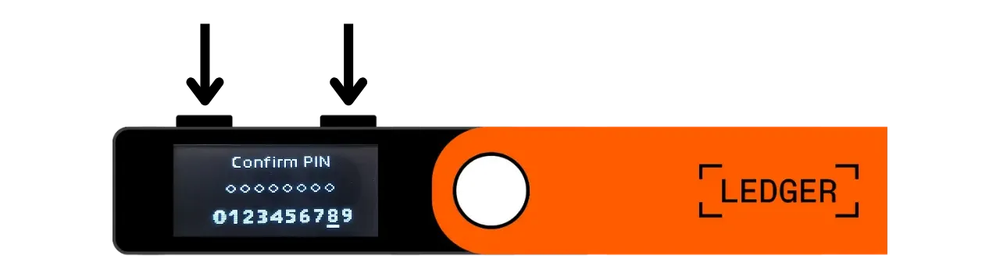
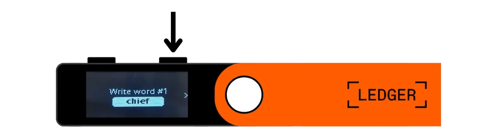
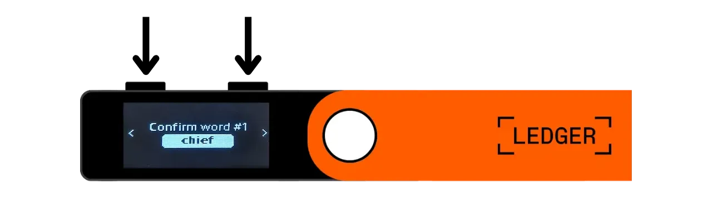
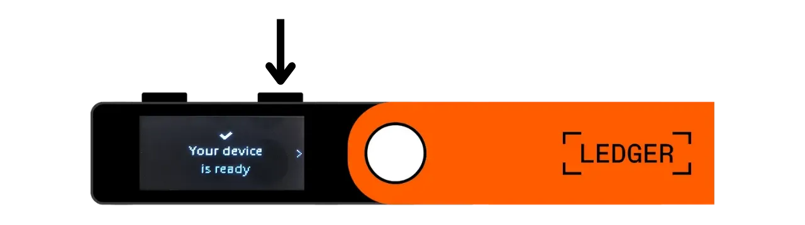
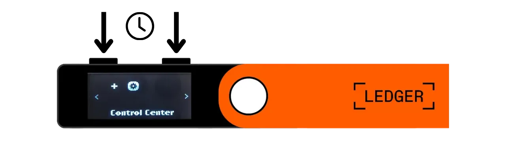
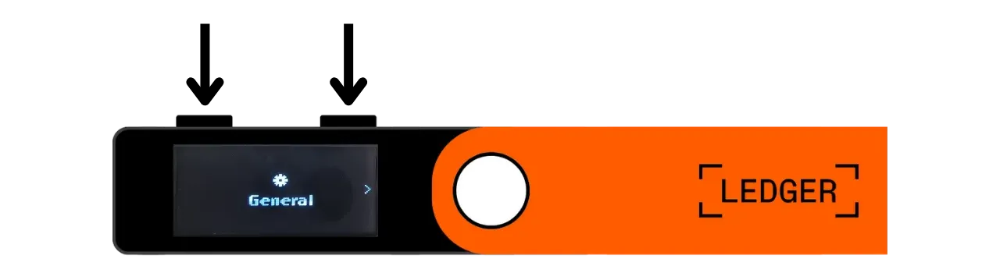
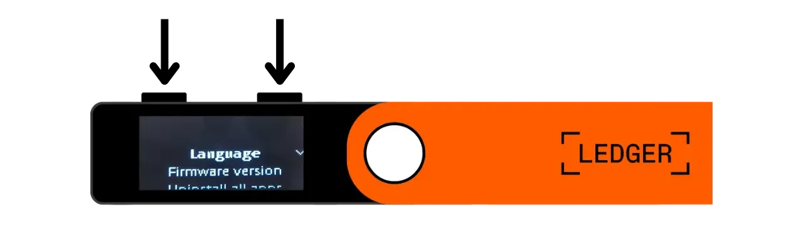
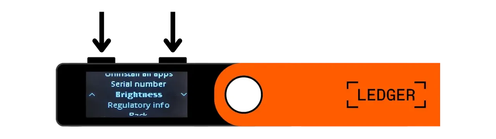

硬件钱包是一种专门用于管理和保护比特币钱包私钥的电子设备。与安装在通常连接互联网的通用计算机上的软件钱包（或热钱包）不同，硬件钱包能够将私钥物理隔离，从而降低被黑客攻击和盗窃的风险。

硬件钱包的主要目标是尽可能简化设备功能，以减少其攻击面。攻击面越小，潜在的攻击途径就越少，也就是说，攻击者可以利用的系统漏洞就越少，从而更容易访问比特币。

建议使用硬件钱包来保护您的比特币，尤其是在您持有大量比特币的情况下，无论其绝对价值或占总资产的比例都相当高。

硬件钱包通常与计算机或智能手机上的钱包管理软件配合使用。该软件负责创建交易，但验证这些交易所需的加密签名仅在硬件钱包内部完成。这意味着私钥永远不会暴露在潜在的安全环境中。

硬件钱包为用户提供双重保护：一方面，它们通过将私钥离线存储来保护您的比特币免受远程攻击；另一方面，它们通常具有更强的物理防护能力，能够有效防止密钥被提取。正是基于这两个安全标准，我们可以对市面上不同的硬件钱包型号进行评判和排名。

在本教程中，我将介绍其中一款解决方案：**Ledger Nano S Plus**。

## Ledger Nano S Plus 简介

Ledger Nano S Plus 是一款由法国公司 Ledger 生产的硬件钱包，售价为 79 欧元。

Nano S Plus 配备了 CC EAL6+ 认证芯片（“安全元件”），能够提供高级的硬件物理防护。屏幕和按钮均由该芯片直接控制。经常被诟病的一点是，该芯片的代码并非开源，这需要用户对该组件的完整性有一定的信任。不过，该组件已由独立专家进行审核。

使用方面，Ledger Nano S Plus 仅支持有线 USB-C 连接。

Ledger 的优势在于其对比特币新功能的快速响应，例如 Taproot 和 Miniscript，这一点备受赞誉。

经过测试，我认为 Ledger Nano S Plus 是一款优秀的入门级硬件钱包。它以合理的价格提供了高安全性。与其他同价位设备相比，其主要缺点在于固件代码并非开源。此外，与 Ledger Flex 或 Coldcard Q1 等更高端的型号相比，Nano S Plus 的屏幕尺寸相对较小。尽管如此，它的界面设计非常出色：虽然只有两个按钮和一个小屏幕，但使用起来依然非常方便，即使是像 BIP39 密码这样的高级功能也很容易上手。Ledger Nano S Plus 没有电池、空气隔离（airgap）连接、摄像头或 micro SD 卡槽，但这在这个价位上很正常。

在我看来，Ledger Nano S Plus 是保护比特币钱包的好选择，适合初学者和中级用户。不过，在这个价位上，我个人更喜欢 Trezor Safe 3，它提供的功能与 Ledger Nano S Plus 大致相同。Trezor 的优势在于其安全元件的管理：助记词和密钥完全由开源代码管理，但仍然受益于芯片的保护。Trezor 的缺点是，与 Ledger 相比，他们在新功能的实现方面有时速度较慢。

## 如何购买Ledger Nano S Plus？

Ledger Nano S Plus 可在[官方网站](https://shop.ledger.com/products/ledger-nano-s-plus)上购买。为了在实体店购买，你也可以在 Ledger 网站上找到[认证经销商的列表](https://www.ledger.com/reseller)。

## 前提条件

收到 Ledger Nano 后，第一步操作是检查包装是否已被打开。如果包装损坏，则可能表明硬件钱包已被盗用，并非正品。

打开后，你应该在盒子里找到以下物品：
- Ledger Nano S Plus；
- USB-C 转 USB-A 数据线；
- 用户手册；
- 用于记录助记词的卡片。

对于本教程，你将需要 2 个软件应用程序：Ledger Live 来初始化 Ledger，和 Sparrow Wallet 来管理你的比特币钱包。从它们的官方网站下载 [Ledger Live](https://www.ledger.com/ledger-live) 和 [Sparrow Wallet](https://sparrowwallet.com/download/)。

对于这两个软件程序，我强烈建议在将它们安装到你的机器上之前，检查它们的真实性（通过GnuPG）和完整性（通过哈希）。如果你不确定如何操作，你可以跟随这个其他教程：
https://planb.academy/tutorials/computer-security/data/integrity-authenticity-21d0420a-be02-4663-94a3-8d487f23becc

## 如何初始化 Ledger Nano？

将您的 Nano 连接到已安装 Ledger Live 和 Sparrow Wallet 的电脑。在 Ledger 上，使用左键向左移动，右键向右移动。要选择或确认某个选项，请同时按下两个按钮。

滚动以浏览不同的介绍页面，然后点击 2 个按钮开始。

选择 “*Setup as a new device*” 选项。

选择将用于解锁你的 Ledger 的 PIN 码。因此，这是一种防止未经授权的物理访问的保护。这个 PIN 码与钱包的加密密钥的派生无关。因此，即使无法获取此 PIN 码，拥有 24 个单词的助记词也能让您重新访问您的比特币。

建议您选择一个尽可能随机的 8 位 PIN 码。此外，请务必将此代码保存在与您的 Ledger Nano S Plus 设备不同的位置（例如，密码管理器）。

使用按钮在数字上移动光标，然后同时点击两个按钮选择每个数字。

再次输入您的 PIN 码以进行确认。您的Nano提供了如何管理您的恢复短语的指南。

**此助记词可让您完全且不受限制地访问您的所有比特币**。任何拥有此助记词的人都可以窃取您的资金，即使他们无法实际接触到您的 Ledger 设备。该 24 个单词的助记词可以让您在 Ledger Nano 丢失、被盗或损坏时恢复对比特币的访问权限。因此，务必妥善保存并将其存放在安全的地方。

您可以将其写在 Ledger 随附的硬纸板上，或者为了更安全起见，我建议您将其刻在不锈钢材质上，以防止火灾、洪水或倒塌等风险。

您可以浏览这些说明，并通过点击右键跳过页面。

Ledger 将使用其随机数生成器生成您的助记词。请确保在此过程中无人窥视。将 Ledger 生成的单词写在您选择的物理介质上。根据您的安全策略，您可以考虑制作几份完整的助记词副本（但重要的是，不要将其拆分）。务必保持单词编号并按顺序排列。

***显然，您绝不应该像我在本教程中所做的那样在互联网上分享这些内容。此示例钱包仅用于测试网，教程结束后将被删除。***

请点击右键以查看下一个单词。

一旦所有单词都被记录下来，点击两个按钮以移动到下一步。

点击两个按钮 “*Confirm your Recovery phrase*”，然后按顺序选择您的助记词中的单词以确认您已正确记录它们。使用左右按钮在选项之间导航，然后通过点击两个按钮选择正确的单词。继续此过程直到第 24 个单词。

如果您正在确认的助记词与 Ledger 在上一步提供给您的完全匹配，您可以继续操作。如果不是，这表明您的助记词备份不正确，您需要重新开始该过程。

就这样，您的种子已经在您的 Ledger Nano S Plus 上正确创建。在继续创建一个新的比特币钱包之前，让我们一起探索设备设置。

## 如何修改您的 Ledger 设置？

为了访问设置，请按住两个按钮几秒钟。

点击 “*Settings*” 菜单。

然后，选择 “*General*”。

在 “*Language*” 菜单中，您可以更改显示语言。

在 “*Brightness*” 菜单中，您可以调整屏幕亮度。现在我们对其他通用设置不感兴趣。

现在，前往 “*Security*” 设置部分。

"*Change PIN*" 允许您更改您的 PIN 码。

"*Passphrase*" 允许您设置 BIP39 Passphrase（密语）。密语是一个可选密码，与您的恢复短语结合使用，为您的钱包提供额外的安全层。

目前，您的钱包由一个包含 24 个单词的助记词生成。这个恢复短语非常重要，因为它允许您在丢失钱包密钥时恢复所有密钥。然而，它也构成了一个单点故障 (SPOF)。如果它被泄露，您的比特币将面临风险。这就是密码的作用所在。密语是一个可选的密码，您可以随意选择，它与助记词结合使用，以增强钱包的安全性。

密语不应与 PIN 码混淆。它在生成加密密钥的过程中发挥着作用。它与助记词协同工作，改变用于生成密钥的种子。因此，即使有人获得了您的 24 个单词的助记词，如果没有密码，他们也无法访问您的资金。使用密码实际上会创建一个具有不同密钥的新钱包。即使对密码进行细微的修改，也会生成一个不同的钱包。

密码短语是增强比特币安全性的强大工具。但是，在使用前了解其工作原理至关重要，以免丢失钱包访问权限。因此，如果您想在 Ledger 上设置密码短语，我建议您参考以下教程：

https://planb.academy/tutorials/wallet/backup/passphrase-ledger-9ae6d9a2-7293-438a-8fe0-e59147ef2f49

"*PIN lock*" 菜单允许您配置并激活在确定的不活动期后自动锁定您的 Ledger。

"*Screen saver*" 菜单允许您调整您的 Ledger Nano 的睡眠模式。请注意，除非激活了与睡眠模式相对应的 "*PIN lock*" 选项，否则唤醒时不需要输入 PIN 码。这个功能对于配备电池的 Ledger Nano X 设备特别有用，以减少它们的能耗。

最后，"*Reset device*" 菜单允许您重置您的 Ledger。只有在您确定它不包含任何保护比特币的密钥时，才进行这种重置，因为您可能会永久失去访问您的资金的权限。这个选项对于执行空恢复测试可能很有用，但我稍后会再谈谈这个。

## 如何安装比特币应用程序？

首先，在您的计算机上启动 Ledger Live 软件，然后连接并解锁您的 Ledger Nano。在 Ledger Live中，前往 "*My Ledger*" 菜单。系统将要求您授权访问您的 Nano。

在您的 Ledger 上点击两个按钮以验证访问。

首先，在 Ledger Live 上，确保显示 "*Genuine check*"。这确认了您的设备是正品。

如果您的 Ledger Nano 固件不是最新版本，Ledger Live 将自动提示您进行更新。如有必要，请点击 “*Update firmware*”，然后点击 “*Install update*” 开始安装。在您的 Ledger 设备上，点击这两个按钮进行确认，然后等待安装完成。
最后，我们将添加比特币应用程序。为此，请在 Ledger Live 中，点击 “*Bitcoin (BTC)*” 旁边的 “*Install*” 按钮。

该应用程序将安装到您的 Nano 设备上。

从现在开始，您将不再需要 Ledger Live 软件来日常管理您的钱包。您可以偶尔使用它来更新固件（当有新版本可用时）。对于其他所有操作，我们将使用 Sparrow Wallet，它是一款功能更全面的比特币钱包管理工具。

## 如何使用 Sparrow 设置新的比特币钱包？

打开 Sparrow 钱包，跳过介绍页面即可进入主屏幕。查看屏幕右下角的开关，确认已正确连接到节点。

我强烈建议您使用自己的比特币节点。在本教程中，我使用的是公共节点（黄色），因为我使用的是测试网。但对于日常使用，最好选择本地 Bitcoin Core（绿色）或连接到远程节点的 Electrum 服务器（蓝色）。

点击 "*File*" 菜单，然后选择 "*New Wallet*"。

为这个钱包选择一个名称，然后点击 "*Create Wallet*"。

在 "*Script Type*" 下拉菜单中，选择将用于保护您的比特币的脚本类型。我推荐选择 "*Taproot*"，如果不可用，选择 "*Native SegWit*"。

点击 "*Connected Hardware Wallet*" 按钮。

如果您还没有这样做，将您的 Ledger Nano S Plus 连接到计算机，用您的 PIN 码解锁它，然后通过一次点击比特币标志上的 2 个按钮来打开 "*Bitcoin*" 应用程序。

*在这个教程中，我使用比特币测试网应用程序，但程序对主网来说是相同的。*

在 Sparrow 上，点击 "*Scan*" 按钮。

然后点击 "*Import Keystore*"。

现在您可以看到您的钱包详情，包括您第一个账户的扩展公钥。点击 "*Apply*" 按钮以完成钱包的创建。

选择一个强密码来保护访问 Sparrow Wallet 的权限。这个密码将确保访问您在 Sparrow 上的钱包数据的安全，这有助于保护您的公钥、地址、标签和交易历史记录免受任何未经授权的访问。

我建议您将这个密码保存在密码管理器中，以免忘记。

就这样，您的钱包现在已经创建好了！

在您的钱包中接收第一笔比特币之前，**我强烈建议您执行一次干运行恢复测试**。记录下一个参考信息，例如您的 xpub，然后在钱包还空时重置您的 Ledger Nano。之后，尝试使用您的纸质备份在 Ledger 上恢复您的钱包。检查恢复后生成的 xpub 是否与您最初记录的那个相匹配。如果是这样，您就可以确信您的纸质备份是可靠的。
为了了解更多关于如何执行恢复测试的信息，我建议您参考这个教程：

https://planb.academy/tutorials/wallet/backup/recovery-test-5a75db51-a6a1-4338-a02a-164a8d91b895

## 如何用Ledger Nano接收比特币？

点击 “*Receive*” 标签。

将您的 Ledger Nano S Plus 连接到电脑，用您的 PIN 码解锁，然后打开 “*Bitcoin*” 应用。

使用 Sparrow Wallet 上地址之前，请在您的 Ledger 的屏幕上验证它。这种做法允许您确认 Sparrow 上显示的地址不是欺诈性的，并且硬件钱包确实持有以后使用这个地址保护的比特币所需的私钥。这有助于您避免几种类型的攻击。
为了执行此验证，请点击 “*Display Address*” 按钮。

请确保您的 Ledger 上显示的地址与 Sparrow Wallet 上指示的地址匹配。还建议在给发送者提供您的地址之前进行此验证，以确保其有效性。您可以使用按钮查看完整地址。

如果地址确实相同，则点击 “*Approve*”。

您可以添加一个 “*Label*”（标签），以描述将用这个地址保护的比特币的来源。这是一个好习惯，有助于您更好地管理您的UTXOs。

关于标签的更多信息，我还建议您查看这个教程：

https://planb.academy/tutorials/privacy/on-chain/utxo-labelling-d997f80f-8a96-45b5-8a4e-a3e1b7788c52

然后您可以使用这个地址来接收比特币。

## 如何用 Ledger Nano 发送比特币？

现在您已经在用 Nano S Plus 保护的钱包中收到了您的第一笔sats，您也可以花费它们了！连接您的Ledger到电脑，解锁它，启动 Sparrow Wallet，然后前往 “*Send*” 标签以构建新的交易。

如果您想进行 “*币控制*”（Coin Control），即指定要在交易中使用的 UTXO，请前往 “*UTXO*” 选项卡。选择您要使用的 UTXO，然后点击 “*Send Selected*”。您将被重定向到 “*Send*” 选项卡的同一屏幕，但您选择的 UTXO 已预先选中。

输入目的地址。通过点击 “*+ Add*” 按钮，您也可以输入多个地址。

记下一个 “*Label*”，以记住这次支出的目的。

选择要发送到此地址的金额。

根据当前市场调整交易费率。

确认所有交易设置均正确后，然后点击 “*Create transaction*”。

确认无误后，点击 “*Finalize Transaction for Signing*”

点击 “*Sign*”。

点击您的 Ledger Nano S Plus 旁边的 “*Sign*”。

在您的 Ledger 屏幕上验证交易设置，包括接收者的接收地址、发送金额和费用金额。

如果一切看起来都不错，请按下 “*Sign Transaction*” 上的两个按钮以签名。

您的交易现在已签名。仔细检查一切是否看起来都不错，然后点击 “*Broadcast Transaction*” 将其广播到比特币网络上。

您可以在 Sparrow Wallet 的 “*Transaction*” 标签中找到它。

恭喜！您现在已经掌握了 Ledger Nano S Plus 与 Sparrow 钱包的基本用法！在后续教程中，我们将学习如何将 Ledger 与 Liana 结合使用，以利用 Miniscript。

如果您觉得本教程有用，请在下方点赞。欢迎在您的社交网络上分享这篇文章。非常感谢！

我还建议您查看这篇关于 Ledger Flex 的完整教程：

https://planb.academy/tutorials/wallet/hardware/ledger-flex-3728773e-74d4-4177-b39f-bd923700c76a
