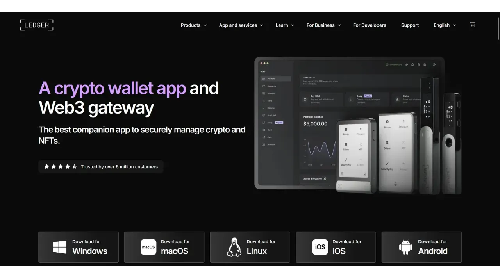
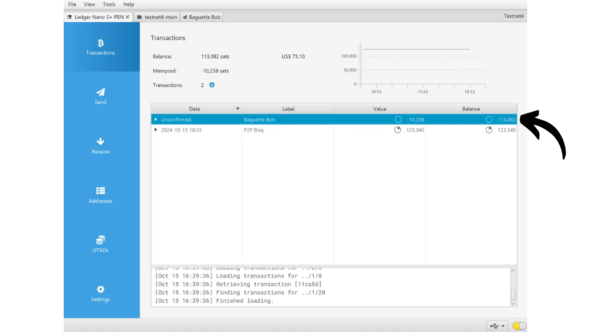

硬件钱包是一种专门用于管理和保护比特币钱包私钥的电子设备。与安装在通常连接到互联网的通用机器上的软件钱包（或热钱包）不同，硬件钱包允许私钥的物理隔离，减少了黑客攻击和盗窃的风险。

硬件钱包的主要目标是尽可能减少设备的功能性，以减少其受攻击面。较小的攻击面也意味着较少的潜在攻击向量，即，系统中较少的弱点，攻击者可能利用这些弱点访问比特币。

特别是如果您持有大量比特币，无论是绝对值还是占您总资产的比例，都推荐使用硬件钱包来保护您的比特币。

硬件钱包与计算机或智能手机上的钱包管理软件结合使用。这个软件管理交易的创建，但验证这些交易所必需的加密签名只在硬件钱包内完成。这意味着私钥永远不会暴露于可能脆弱的环境中。

硬件钱包为用户提供双重保护：一方面，通过保持私钥离线，它们保护您的比特币免受远程攻击；另一方面，它们通常提供更好的物理抵抗力，以防止尝试提取密钥。正是基于这2个安全标准，可以评判和排名市场上可用的不同模型。

在本教程中，我提议发现这些解决方案之一：**Ledger Nano S Plus**。

## Ledger Nano S Plus 简介

Ledger Nano S Plus 是由法国公司 Ledger 生产的硬件钱包，市场价格为 79 欧元。

Nano S Plus 配备了 CC EAL6+ 认证的芯片（"*安全元素*"），为您提供了针对硬件物理攻击的高级保护。屏幕和按钮直接由此芯片控制。经常提出的一个批评点是，这个芯片的代码不是开源的，这需要对这个组件的完整性有一定的信任。然而，这个元素是由独立专家审计的。

就使用而言，Ledger Nano S Plus 仅通过有线 USB-C 连接操作。

Ledger 以其总是非常迅速地采用新的比特币功能而脱颖而出，例如 Taproot 或 Miniscript，这是非常受欢迎的。
经过测试，我发现 Ledger Nano S Plus 是一款优秀的入门级硬件钱包。它以合理的价格提供了高水平的安全性。与同一价格范围内的其他设备相比，其主要缺点是固件代码不是开源的。此外，与更昂贵的型号（如 Ledger Flex 或 Coldcard Q1）相比，Nano S Plus 的屏幕相对较小。尽管如此，其界面设计得非常好：尽管只有两个按钮和小屏幕，但包括使用 BIP39 密码短语等高级功能在内，它仍然易于使用。Ledger Nano S Plus 没有电池、Air-gap 连接、相机或微 SD 端口，但这对于这个价格范围来说是相当正常的。
在我看来，Ledger Nano S Plus是保护你的比特币钱包的一个好选择，适合初学者和中级用户。然而，在这个价格范围内，我个人更喜欢Trezor Safe 3，它提供大致相同的选项。在我看来，Trezor的优势在于其安全元素的管理：助记词和密钥完全由开源代码管理，但仍然受到芯片的保护。Trezor的缺点是他们有时在实现新功能方面非常缓慢，不像Ledger那样。

## 如何购买Ledger Nano S Plus？

Ledger Nano S Plus可以在[官方网站](https://shop.ledger.com/products/ledger-nano-s-plus)上购买。要在实体店购买，你也可以在Ledger网站上找到[认证经销商的列表](https://www.ledger.com/reseller)。

## 准备工作

一旦你收到了你的Ledger Nano，第一步是检查包装确保它没有被打开。如果它受损，这可能表明硬件钱包已经被泄露，可能不是真品。

打开后，你应该在盒子里找到以下物品：
- Ledger Nano S Plus；
- 一根USB-C到USB-A的线；
- 用户手册；
- 记录你的助记词的卡片。

对于本教程，你将需要2个软件应用程序：Ledger Live来初始化Ledger，和Sparrow Wallet来管理你的比特币钱包。从它们的官方网站下载 [Ledger Live](https://www.ledger.com/ledger-live) 和 [Sparrow Wallet](https://sparrowwallet.com/download/)。

对于这两个软件程序，我强烈建议在将它们安装到你的机器上之前，检查它们的真实性（通过GnuPG）和完整性（通过哈希）。如果你不确定如何做，你可以跟随这个其他教程：
https://planb.network/tutorials/others/integrity-authenticity

## 如何初始化一个Ledger Nano？

将你的Nano连接到安装了Ledger Live和Sparrow Wallet的电脑上。要在你的Ledger上导航，使用左按钮向左移动，右按钮向右移动。要选择或确认一个选项，同时按下两个按钮。

滚动浏览不同的介绍页面，然后点击2个按钮开始。

选择“*作为新设备设置*”选项。

选择将用于解锁你的Ledger的PIN码。因此，这是一种防止未经授权的物理访问的保护。这个PIN码不参与你钱包的加密密钥的派生。因此，即使没有访问这个PIN码，拥有你的24字助记词也将允许你重新获得对你的比特币的访问。

建议选择一个尽可能随机的8位数PIN码。同时，确保将此代码保存在与你的Ledger Nano S Plus存放位置不同的地方（例如，在密码管理器中）。

使用按钮移动数字，然后通过同时点击两个按钮来选择每个数字。

再次输入你的PIN码以确认它。
您的Nano提供了如何管理您的恢复短语的指南。

**这个助记词提供了对您所有比特币的完全和不受限制的访问权限**。任何拥有这个短语的人都可以偷走您的资金，即使没有物理访问您的Ledger。这个24字的短语允许您在丢失、盗窃或您的Ledger Nano损坏的情况下恢复对您比特币的访问。因此，小心保存并将其存放在一个安全的地方非常重要。

您可以将其写在随Ledger提供的硬纸板上，或者为了更高的安全性，我推荐将其刻在不锈钢介质上以防止火灾、洪水或倒塌的风险。

您可以浏览这些指南并通过点击右键跳过页面。

Ledger将使用其随机数生成器创建您的助记词。在进行此操作时，请确保没有人观察您。将Ledger提供的单词写在您选择的物理介质上。根据您的安全策略，您可能会考虑制作短语的几份完整物理副本（但重要的是，不要分开它们）。保持单词编号并按顺序排列至关重要。
***显然，您永远不应该在互联网上分享这些单词，与我在本教程中所做的相反。这个示例钱包将仅在Testnet上使用，并在教程后删除。***

要移动到下一个单词，请点击右键。

一旦所有单词都被记录下来，点击两个按钮以移动到下一步。

点击两个按钮“*确认您的恢复短语*”，然后按顺序选择您的助记词中的单词以确认您已正确记录它们。使用左右按钮在选项之间导航，然后通过点击两个按钮选择正确的单词。继续此过程直到第24个单词。

如果您正在确认的短语与Ledger在上一步提供给您的完全匹配，您可以继续。如果不是，这表明您的助记词物理备份不正确，您需要重新开始该过程。

就这样，您的种子已经在您的Ledger Nano S Plus上正确创建。在继续创建一个新的比特币钱包之前，让我们一起探索设备设置。

## 如何修改您的Ledger设置？

要访问设置，请按住两个按钮几秒钟。

点击“*设置*”菜单。

并选择“*通用*”。

在“*语言*”菜单中，您可以更改显示语言。

在“*亮度*”菜单中，您可以调整屏幕亮度。现在我们对其他通用设置不感兴趣。

现在，转到“*安全性*”设置部分。
"*更改PIN码*" 允许您更改您的PIN码。
"*密码短语*" 允许您设置BIP39密码短语。密码短语是一个可选密码，与您的恢复短语结合使用，为您的钱包提供额外的安全层。

目前，您的钱包是由包含24个单词的助记词短语生成的。这个恢复短语非常重要，因为它允许您在丢失的情况下恢复钱包的所有密钥。然而，它构成了单点故障（SPOF）。如果它被泄露，您的比特币就会处于危险之中。这就是密码短语的用途所在。它是一个可选密码，您可以任意选择，它增加到助记词短语中以增强钱包的安全性。

密码短语不应与PIN码混淆。它在您的加密密钥的派生过程中起作用。它与助记词短语配合使用，改变生成密钥的种子。因此，即使有人获得您的24个单词的短语，没有密码短语，他们也无法访问您的资金。使用密码短语本质上创建了一个具有不同密钥的新钱包。修改（即使是轻微的）密码短语将生成一个不同的钱包。

密码短语是增强您的比特币安全性的非常强大的工具。然而，在实施之前了解它的工作原理非常重要，以避免失去对您钱包的访问。这就是为什么我建议您在希望在您的Ledger上设置密码短语时，咨询这个专门的教程：

https://planb.network/tutorials/wallet/passphrase-ledger

"*PIN锁定*" 菜单允许您配置并激活在确定的不活动期后自动锁定您的Ledger。

"*屏幕保护*" 菜单允许您调整您的Ledger Nano的睡眠模式。请注意，除非激活了与睡眠模式相对应的"*PIN锁定*" 选项，否则唤醒时不需要输入PIN码。这个功能对于配备电池的Ledger Nano X设备特别有用，以减少它们的能耗。

最后，"*重置设备*" 菜单允许您重置您的Ledger。只有在您确定它不包含任何保护比特币的密钥时，才进行这种重置，因为您可能会永久失去访问您的资金的权限。这个选项对于执行空恢复测试可能很有用，但我稍后会再谈谈这个。

## 如何安装比特币应用程序？

首先，在您的计算机上启动Ledger Live软件，然后连接并解锁您的Ledger Nano。在Ledger Live中，转到"*我的Ledger*" 菜单。系统将要求您授权访问您的Nano。

在您的Ledger上点击两个按钮以验证访问。

首先，在Ledger Live上，确保显示"*真品检查*"。这确认了您的设备是正品。

如果您的Ledger Nano的固件不是最新的，Ledger Live将自动提供更新。如有必要，点击"*更新固件*"，然后点击"*安装更新*"开始安装。在您的Ledger上点击两个按钮以确认，然后等待安装过程。
最后，我们将添加比特币应用程序。为此，在Ledger Live上，点击"*Bitcoin (BTC)*"旁边的"*Install*"按钮。

应用程序将安装在您的Nano上。

从现在起，您将不再需要Ledger Live软件来常规管理您的钱包。您可以偶尔返回它以更新固件，当新版本可用时。对于其他所有事情，我们将使用Sparrow Wallet，这是一个更全面的工具，用于有效管理比特币钱包。

## 如何使用Sparrow设置一个新的比特币钱包？

打开Sparrow Wallet并跳过介绍页面以访问主屏幕。通过观察屏幕右下角的开关，检查您是否正确连接到节点。

我强烈推荐使用您自己的比特币节点。在这个教程中，我使用的是公共节点（黄色），因为我在测试网上，但对于正常使用，最好选择一个本地的Bitcoin Core（绿色）或连接到远程节点的Electrum服务器（蓝色）。

点击"*File*"菜单然后"*New Wallet*"。

为这个钱包选择一个名称，然后点击"*Create Wallet*"。

在"*Script Type*"下拉菜单中，选择将用于保护您的比特币的脚本类型。我推荐选择"*Taproot*"，如果不可用，选择"*Native SegWit*"。

点击"*Connected Hardware Wallet*"按钮。

如果您还没有这样做，将您的Ledger Nano S Plus连接到计算机，用您的PIN码解锁它，然后通过一次点击比特币标志上的2个按钮来打开"*Bitcoin*"应用程序。

*在这个教程中，我使用的是比特币测试网应用程序，但程序对主网来说是相同的。*

在Sparrow上，点击"*Scan*"按钮。

然后点击"*Import Keystore*"。

现在您可以看到您的钱包详情，包括您第一个账户的扩展公钥。点击"*Apply*"按钮以完成钱包的创建。

选择一个强密码来保护访问Sparrow Wallet。这个密码将确保访问您在Sparrow上的钱包数据的安全，这有助于保护您的公钥、地址、标签和交易历史记录免受任何未经授权的访问。

我建议您将这个密码保存在密码管理器中，以免忘记。

就这样，您的钱包现在已经创建好了！

在您的钱包中接收第一笔比特币之前，**我强烈建议您执行一次干运行恢复测试**。记录下一个参考信息，例如您的xpub，然后在钱包仍为空时重置您的Ledger Nano。之后，尝试使用您的纸质备份在Ledger上恢复您的钱包。检查恢复后生成的xpub是否与您最初记录的那个相匹配。如果是这样，您就可以确信您的纸质备份是可靠的。
要了解更多关于如何执行恢复测试的信息，我建议您参考这个教程：

https://planb.network/tutorials/wallet/recovery-test

## 如何用Ledger Nano接收比特币？

点击“*接收*”标签。

将您的Ledger Nano S Plus连接到电脑，用您的PIN码解锁，然后打开“*比特币*”应用。

在使用Sparrow Wallet提供的地址之前，请在您的Ledger的屏幕上验证它。这种做法允许您确认Sparrow上显示的地址不是欺诈性的，并且硬件钱包确实持有以后使用这个地址保护的比特币所需的私钥。这有助于您避免几种类型的攻击。
要执行此验证，请点击“*显示地址*”按钮。

确保您的Ledger上显示的地址与Sparrow Wallet上指示的地址匹配。还建议在给发送者提供您的地址之前进行此验证，以确保其有效性。您可以使用按钮查看完整地址。

如果地址确实相同，则点击“*批准*”。

您可以添加一个“*标签*”，以描述将用这个地址保护的比特币的来源。这是一个好习惯，有助于您更好地管理您的UTXOs。

有关标签的更多信息，我还建议您查看这个教程：

https://planb.network/tutorials/privacy/utxo-labelling

然后您可以使用这个地址来接收比特币。

## 如何用Ledger Nano发送比特币？

现在您已经在用Nano S Plus保护的钱包中收到了您的第一笔sats，您也可以花费它们了！连接您的Ledger到电脑，解锁它，启动Sparrow Wallet，然后转到“*发送*”标签以构建新的交易。

如果您想进行“*币控制*”，意味着特别选择哪些UTXOs在交易中消费，转到“*UTXOs*”标签。选择您希望花费的UTXOs，然后点击“*发送选中的*”。您将被重定向到“*发送*”标签的同一屏幕，但您的UTXOs已为交易选择。

输入目的地址。通过点击“*+ 添加*”按钮，您也可以输入多个地址。

记下一个“*标签*”，以记住这次支出的目的。

选择发送到此地址的金额。

根据当前市场调整交易费率。

确保您的交易设置都是正确的，然后点击“*创建交易*”。

如果一切看起来都不错，请点击“*最终确定交易以签名*”。

点击“*签名*”。

点击您的Ledger Nano S Plus旁边的“*签名*”。

在您的Ledger屏幕上验证交易设置，包括接收方的接收地址、发送金额和费用金额。

如果一切看起来都不错，请按下“*签名交易*”上的两个按钮以签名。

您的交易现在已签名。仔细检查一切是否看起来都不错，然后点击“*广播交易*”将其广播到比特币网络上。

您可以在Sparrow Wallet的“*交易*”标签中找到它。

恭喜您，现在您已经掌握了与Sparrow Wallet一起使用Ledger Nano S Plus的基本用法！在未来的教程中，我们将看到如何将Ledger与Liana一起使用以利用Miniscript。

如果您觉得这个教程有帮助，我会非常感激您能在下面留下点赞。欢迎您在社交网络上分享这篇文章。非常感谢！

我还推荐您查看有关Ledger Flex的完整教程：

https://planb.network/tutorials/wallet/ledger-flex