*Ledger telah mengumumkan bahwa dukungan perangkat lunak untuk Nano S klasik akan berakhir pada 25 Juni 2025. Setelah tanggal tersebut, perangkat ini tidak akan lagi menerima pembaruan keamanan dan tidak akan kompatibel dengan fitur-fitur baru, sehingga pengguna berisiko menghadapi celah keamanan dan masalah kompatibilitas di masa depan. Meski begitu, dana kamu masih bisa diakses lewat seedphrase, tapi sangat disarankan untuk beralih ke model yang lebih baru agar keamanan dan akses ke bitcoin kamu tetap terjamin. Perlu diperhatikan, yang dimaksud di sini adalah **Nano S lama,** bukan **Nano S Plus** yang masih mendapat dukungan.*

___

Cold wallet – €60 – Pemula – Cocok untuk mengamankan antara €2.000 hingga €50.000. Ledger adalah solusi asal Prancis untuk menyimpan bitcoin dengan cara yang sederhana dan aman.

Dalam tutorial ini, kita juga membahas bagian passphrase, solusi keamanan lanjutan untuk menyimpan jumlah besar: 20.000€ – 100.000€.

https://www.youtube.com/watch?v=_vsHNTLi8MQ

# Menghubungkan Ledger ke Sparrow Bitcoin Wallet (panduan penulisan)

Pastikan kamu sudah membaca bagian lain berjudul "Menggunakan Hardware Wallet Bitcoin" terlebih dahulu. Di sini, aku akan melewati beberapa langkah dan lebih fokus pada hal-hal yang khusus untuk Ledger.

## Menyiapkan perangkat

Ledger dilengkapi dengan kabel USB bawaan. Pastikan kamu menggunakan kabel itu dan bukan sembarang kabel lama, karena beberapa kabel USB hanya berfungsi untuk mengalirkan daya. Kabel bawaan ini bisa mentransmisikan data sekaligus daya. Kalau kamu memakai kabel pengisian ponsel biasa, perangkat bisa gagal terhubung.

Colokkan Ledger ke komputer kamu, dan perangkat akan langsung menyala.

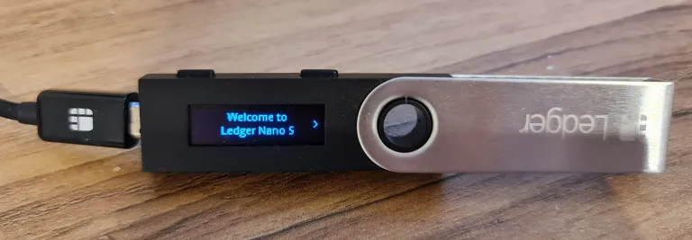

Jelajahi opsi-opsinya. Kamu akan melihat

1. Atur sebagai perangkat baru
2. Pulihkan dari frasa pemulihan

Pada dasarnya, bagian ini menanyakan apakah kamu ingin perangkat membuat seed untukmu, atau kalau kamu sudah punya seed sendiri yang ingin digunakan. Praktik terbaik sebenarnya adalah membuat seed sendiri, tapi melakukannya dengan aman itu cukup rumit dan di luar cakupan artikel ini. Jadi, pilih “Atur sebagai perangkat baru.”

Selanjutnya kamu akan diminta untuk memilih PIN. Ini bukan bagian dari seed Bitcoin kamu, dan hanya berlaku untuk perangkat ini saja. PIN berfungsi untuk mengunci perangkat.

Setelah itu, perangkat akan menampilkan 24 kata yang perlu kamu telusuri satu per satu dan tulis dengan hati-hati.

Agak membingungkan, karena di akhir akan muncul pesan “tekan kiri untuk memverifikasi kata-kata kamu.” Pesan itu tidak menjelaskan bagaimana cara melanjutkan—itu hanya berarti kamu bisa kembali dan melihat kata-kata tadi lagi. Jadi, tekan kanan untuk lanjut, lalu konfirmasi dengan menekan tombol kiri dan kanan secara bersamaan.

Bagian berikutnya cukup menyebalkan. Perangkat akan mengacak ulang 24 kata itu, dan kamu harus mengonfirmasi semuanya satu per satu dari urutan 1 sampai 24, dengan menggulir di antara daftar kata untuk setiap posisi. Setelah selesai, tekan dua tombol bersamaan untuk mengonfirmasi dan lanjut ke tahap berikutnya.

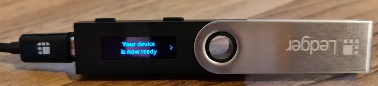

Di dasbor, kamu akan melihat ada tombol pengaturan dan tombol tanda tambah yang bisa kamu gunakan untuk menginstal aplikasi. Tapi sebelum itu, kamu perlu terhubung ke Ledger Live terlebih dahulu. Kita akan lakukan itu di langkah berikutnya.

## Unduh Ledger Live

Kamu bisa mengunduh Ledger Live dari halaman web mereka, tetapi lebih baik mendapatkannya dari GitHub, di mana kode sumber disimpan.

Google "ledger live GitHub" atau klik tautan ini https://github.com/LedgerHQ/ledger-live-desktop

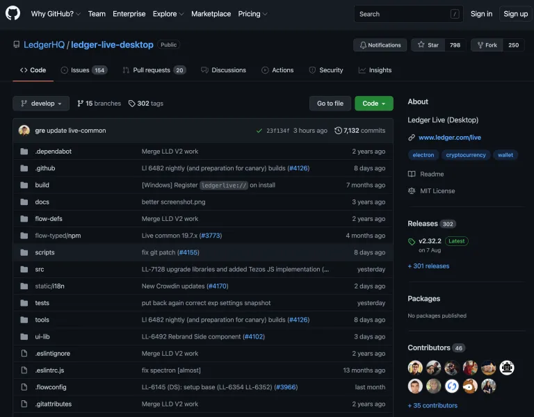

Scroll ke bawah sampai Anda melihat judul, "Downloads"…

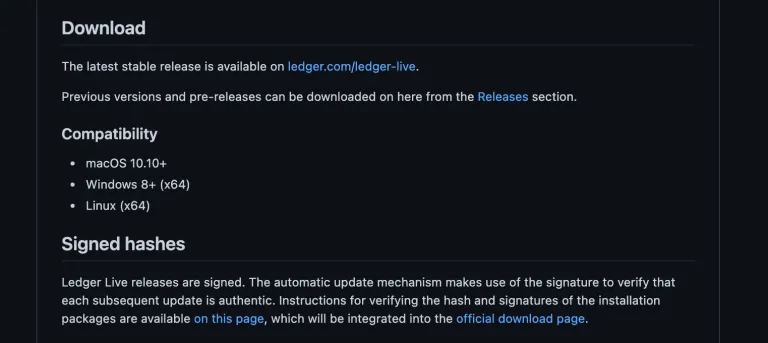

Di bagian bawah, kamu akan melihat tautan: Instruksi untuk memverifikasi hash dan tanda tangan dari paket instalasi tersedia di halaman ini. Klik tautan itu.(https://live.ledger.tools/lld-signatures)

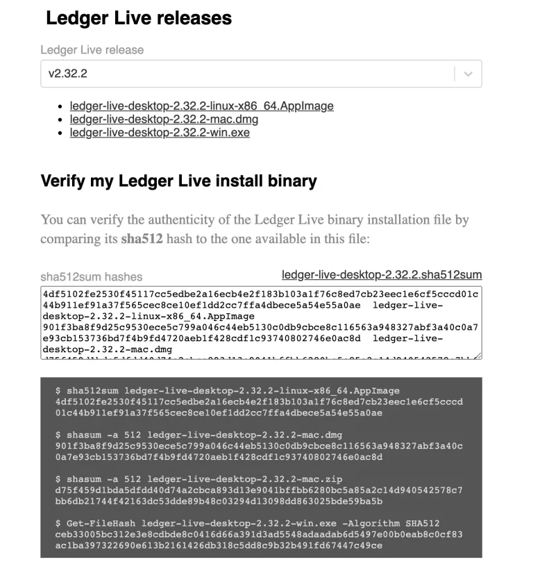

Di bagian atas halaman, kamu akan melihat tautan unduhan untuk paket perangkat lunak yang sesuai dengan sistem operasi kamu. Klik yang cocok untuk mengunduhnya.

Setelah itu, kita akan memverifikasi hash dari file unduhan tersebut demi keamanan tambahan. Ledger mempublikasikan hash untuk setiap file di halaman itu. Kita akan membuat hash dari file yang kamu unduh dan membandingkannya dengan yang tertera di situs. Keduanya harus identik untuk memastikan file tidak diubah atau disusupi.

Buka Terminal di macOS atau CMD di Windows, lalu jalankan perintah berikut…

cd Downloads

<Enter>

```bash
shasum -a 512 ledger-live-desktop-2.32.2-mac.dmg # <--- Untuk Mac
certutil -hashfile ledger-live-desktop-2.32.2-win.exe SHA512 # <--- Untuk Windows
```

<Enter>

Semoga sudah jelas bahwa perintah dimulai setelah tanda panah. Pastikan, jika artikel ini sudah agak usang, kamu menyesuaikan nama file dalam perintah sesuai dengan file yang kamu unduh. Tekan tombol Enter setelah setiap perintah. Perhatikan juga bahwa perintah yang terlihat di sini mungkin tidak muat dalam satu baris di peramban kamu—tetapi semuanya harus diketik dalam satu baris saja.

Setelah itu, periksa hasil hash-nya dan pastikan identik dengan yang dipublikasikan di GitHub.

Idealnya, kamu juga perlu memastikan bahwa hash yang dipublikasikan tersebut benar-benar asli, bukan palsu. Cara terbaik untuk melakukannya adalah dengan memverifikasi tanda tangan GPG, tapi itu sudah di luar cakupan artikel ini. Kalau kamu ingin mempelajarinya lebih lanjut (dan aku sangat menyarankan kamu melakukannya nanti), cari artikel khusus yang membahas hal itu.

## Terhubung ke Ledger Live

Sebelum kamu menjalankan Ledger Live, ada baiknya mengaktifkan VPN untuk sedikit meningkatkan privasi. Ledger tetap akan mengetahui semua alamat Bitcoin kamu, tapi mereka tidak akan tahu alamat IP kamu—yang bisa mengungkap lokasi rumahmu.

Mullvad VPN adalah salah satu layanan VPN yang bagus dan terjangkau (bukan iklan, cuma kebetulan aku memang pakai itu).

Instal perangkat lunak ke komputer kamu dan jalankan.


Pilih perangkat , dan pilih "Pertama kali menggunakan..."

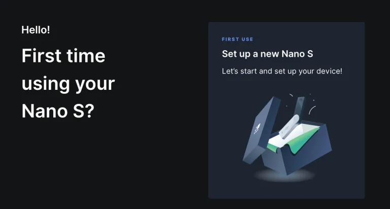

Kemudian kamu akan dibawa melalui wizard, tetapi kami telah melakukan semua langkah ini sehingga kamu bisa melalui.


Setelah melewati beberapa langkah dan kuis, Ledger Live akan memeriksa apakah perangkat kamu asli. Pastikan perangkat sudah terhubung dan kamu sudah memasukkan PIN. Setelah itu, perangkat akan menanyakan apakah kamu ingin mengizinkan Ledger Live untuk terhubung. Kamu tentu saja harus mengonfirmasi izin tersebut.

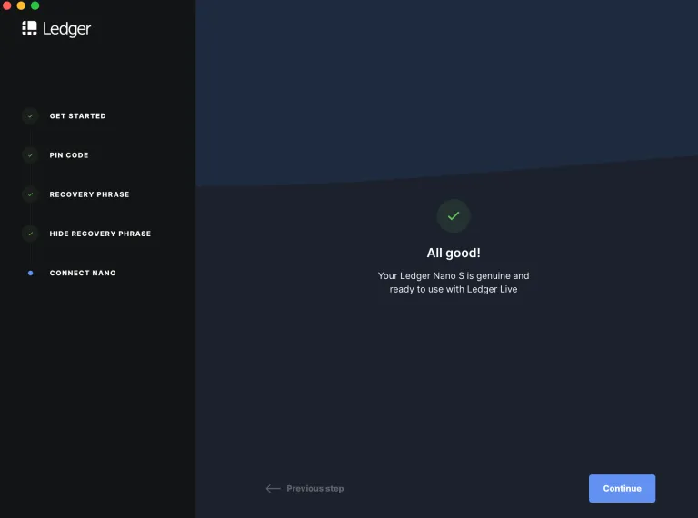

Akan muncul beberapa iklan shitcoin yang menyamar sebagai “catatan rilis” di pop-up berikutnya. Abaikan saja, lalu kamu akan sampai di layar berikut ini.

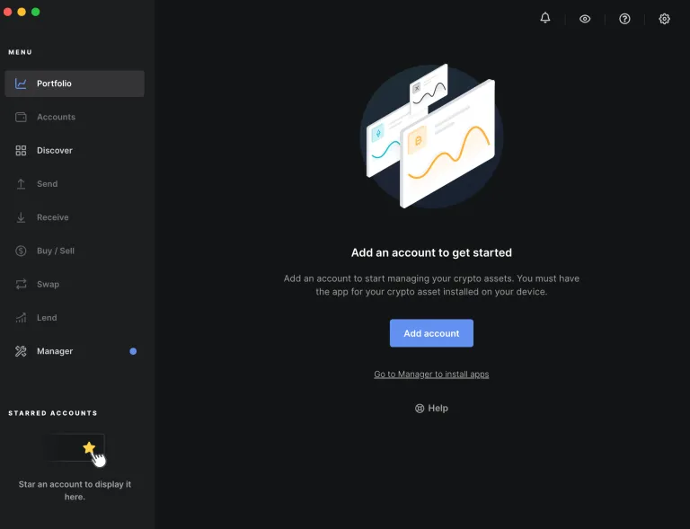

Kamu harus klik "Tambah akun" untuk mendapatkan Dompet Bitcoin.

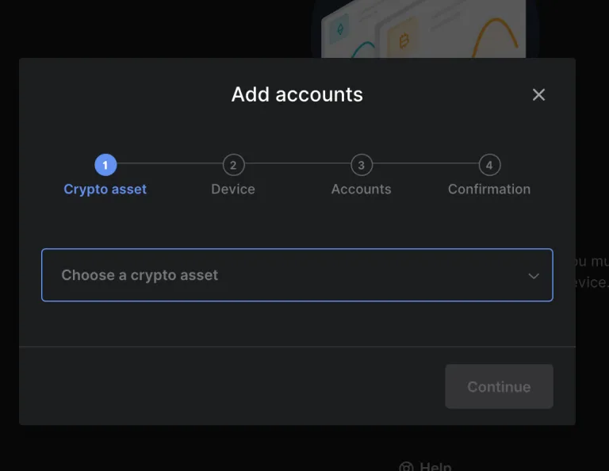

Pastikan kamu memilih Bitcoin, bukan Bitcoin Cash atau shitcoin lainnya. Ledger Live akan memeriksa perangkatmu, dan kamu harus mengonfirmasi langsung di perangkat untuk melanjutkan. Proses ini akan menghitung alamat selama beberapa menit. Setelah selesai, klik SELESAI.

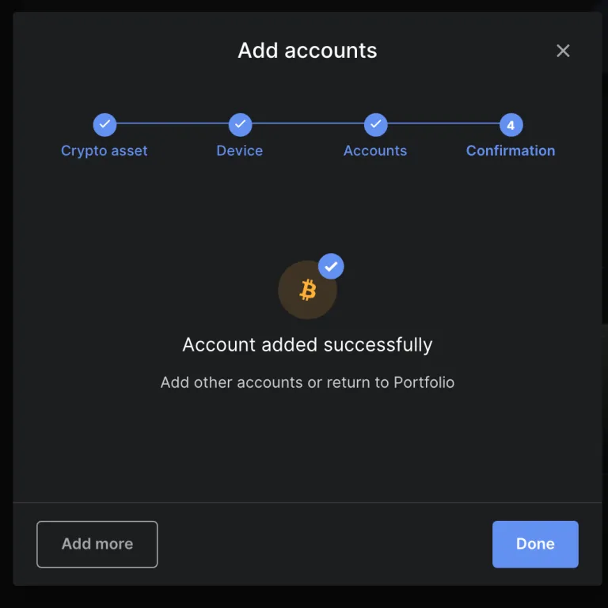
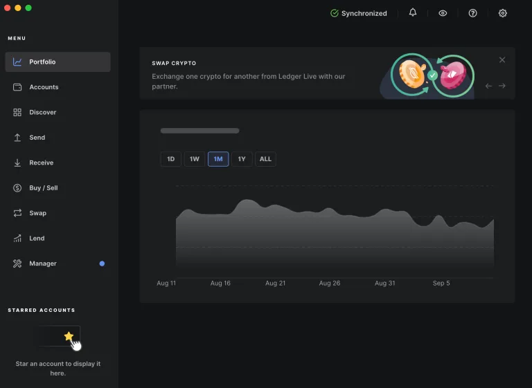

Bagus. Sekarang kamu punya manajer dompet shitcoin di komputer kamu yang berisi dompet Bitcoin. Sebenarnya, kamu tidak lagi membutuhkan aplikasi ini dan bisa menutupnya. Tujuan utamanya hanyalah untuk menginstal Aplikasi Bitcoin di perangkat kamu—dan ini satu-satunya cara resmi untuk melakukannya, kecuali kamu mau repot dengan teknik rekayasa perangkat lunak tingkat lanjut.

Ingat, sebelumnya di perangkat ada tombol pengaturan dan tombol tanda tambah. Sekarang kamu akan melihat satu tombol tambahan: Aplikasi Bitcoin.

Kamu bisa menutup Ledger Live sekarang.

## Tambahkan passphrase
Sekarang setelah kita memiliki Aplikasi Bitcoin, kita bisa menambahkan passphrase ke seed phrase kita. Sebelumnya hal ini belum bisa dilakukan karena saat pertama kali membuat seed, kita belum punya Aplikasi Bitcoin, dan perlu terhubung ke Ledger Live untuk menginstalnya terlebih dahulu.

Masuk ke menu “Settings” di perangkat, lalu buka submenu “Security.” Pilih Passphrase. Kamu akan melihat tulisan “Advanced feature.” Tekan tombol kanan, lalu akan muncul “Read manual…” Tekan tombol kanan lagi, dan kamu akan melihat “Back.” Tapi jangan berhenti di situ—walau terlihat seperti sudah selesai, tekan tombol kanan sekali lagi hingga muncul “Set up passphrase.”

Kamu akan diberi dua pilihan: “Attach to PIN” atau “Set temporarily.” Aku merekomendasikan untuk memilih “Attach to PIN.” Dengan cara ini, kamu bisa mengakses dompet yang berbeda tergantung pada PIN yang kamu masukkan saat menyalakan perangkat. Kalau kamu memilih “Set temporarily,” kamu harus mengetik ulang passphrase setiap kali ingin mengakses dompet itu, dan selalu dimulai dari PIN default.

Masukkan passphrase yang kamu inginkan lalu konfirmasi.

Perangkat akan meminta “Current PIN.” Ini bukan PIN yang baru kamu kaitkan dengan passphrase, melainkan PIN yang kamu masukkan saat pertama kali menyalakan perangkat untuk sesi ini.

Setelah selesai, kamu bisa kembali ke menu utama dengan memilih opsi kembali beberapa kali.

## Mengawasi Dompet

Di artikel sebelumnya aku menjelaskan cara mengunduh dan memverifikasi Sparrow Wallet serta cara menghubungkannya ke node milikmu atau ke node publik. Ikuti panduan ini:

- Pasang Bitcoin Core (https://armantheparman.com/bitcoincore/)

- Pasang Sparrow Bitcoin Wallet (https://armantheparman.com/download-sparrow/)

- Hubungkan Sparrow Bitcoin Wallet ke Bitcoin Core (https://armantheparman.com/sparrowcore/)

Sebagai alternatif dari Sparrow Bitcoin Wallet, kamu bisa menggunakan Electrum Desktop Wallet. Tapi di sini aku akan tetap menjelaskan Sparrow Bitcoin Wallet, karena menurutku ini yang paling cocok untuk kebanyakan orang. Pengguna tingkat lanjut mungkin akan lebih suka menggunakan Electrum sebagai opsi lain.

Sekarang kita akan membuka Sparrow dan menghubungkannya dengan Ledger yang berisi dompet dengan passphrase. Dompet ini tidak pernah terhubung ke Ledger Live, karena dibuat setelah perangkat kamu terhubung ke Ledger Live. Pastikan kamu tidak pernah menghubungkannya ke Ledger Live lagi, supaya dompet pribadi barumu tetap aman dan tidak terekspos.

Buat Dompet Baru:

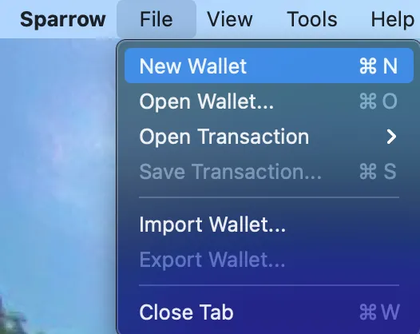

Namai dengan sesuatu yang cantik

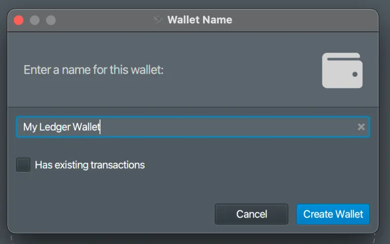

Perhatikan kotak centang “Has existing transaction.” Jika ini adalah dompet yang sudah pernah kamu gunakan sebelumnya, centang kotak tersebut—kalau tidak, saldo kamu akan ditampilkan sebagai nol. Dengan mencentang kotak ini, Sparrow akan memeriksa database Bitcoin Core (blockchain) untuk menemukan transaksi sebelumnya. Namun, karena dalam panduan ini kita menggunakan dompet baru, kamu bisa membiarkan kotak itu tidak dicentang.

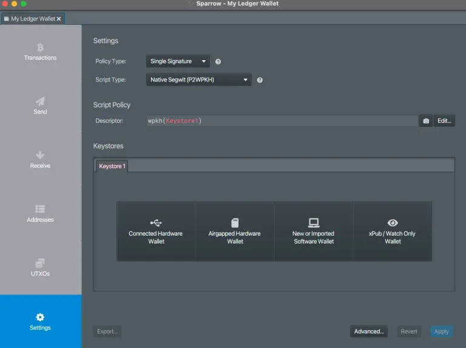

Klik pada "Connected Hardware Wallet" dan pastikan perangkat benar-benar terhubung, dinyalakan, PIN dimasukkan, dan kamu telah memasuki Aplikasi Bitcoin.

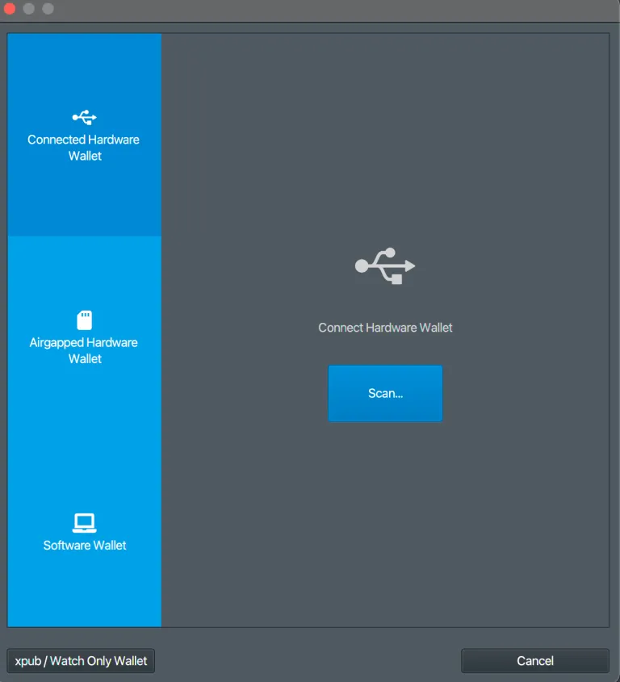

Klik "Scan" dan kemudian "Import Keystore" di layar berikutnya.

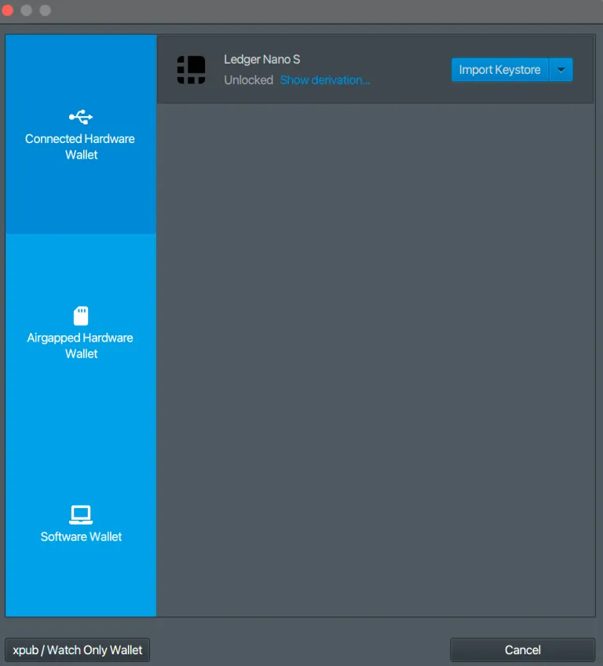

Tidak ada yang perlu diedit di layar berikutnya, Ledger telah mengisinya untuk Anda. Klik "Apply"

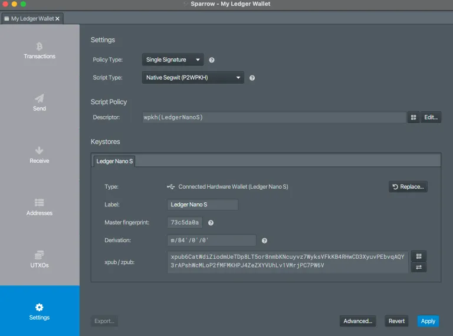
Layar berikutnya memberi kamu opsi untuk menambahkan kata sandi. Jangan sampai keliru dengan passphrase. Banyak orang sering salah paham soal ini karena penamaannya memang membingungkan.

Kata sandi di sini hanya berfungsi untuk mengunci dompet di komputer kamu, dan bersifat spesifik untuk perangkat lunak ini di komputer tersebut. Kata sandi ini bukan bagian dari kunci privat Bitcoin kamu.
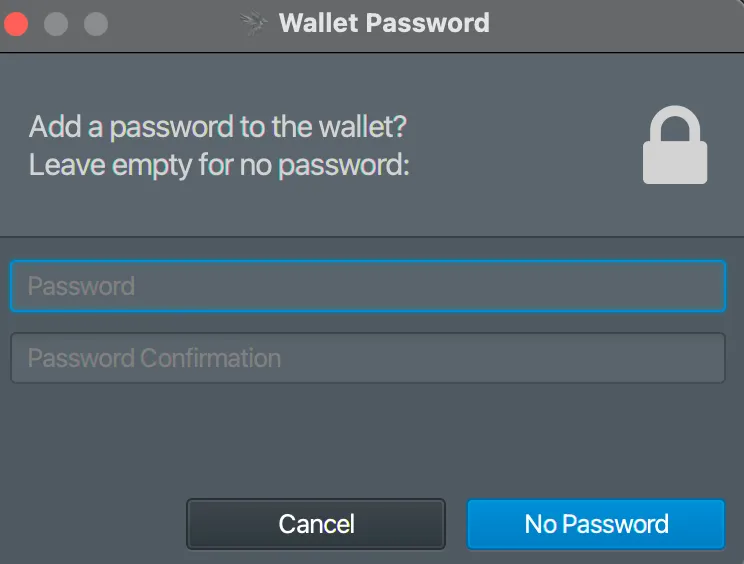

Setelah jeda singkat saat komputer memproses, tombol di sisi kiri akan berubah dari abu-abu menjadi biru. Selamat, dompet kamu sekarang sudah siap digunakan! Kamu bisa membuat dan mengirim transaksi sesukamu..

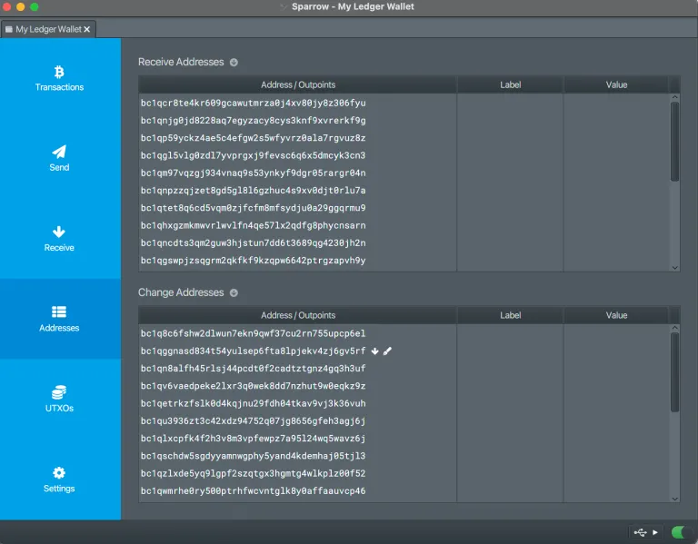

## Menerima

Untuk menerima bitcoin, buka tab Alamat di sisi kiri dan pilih salah satu alamat penerimaan. Cukup klik kanan pada alamat yang kamu pilih, lalu pilih “Salin alamat.” Setelah itu, buka bursa tempat kamu akan mengirim dana dan tempelkan alamat tersebut di sana. Kamu juga bisa memberikan alamat itu kepada pelanggan agar mereka bisa menggunakannya untuk membayar kamu.

Saat pertama kali menggunakan dompet, sebaiknya kirim dan terima jumlah yang sangat kecil terlebih dahulu. Coba kirim kembali ke alamat lain di dalam dompet, atau ke bursa, untuk memastikan dompet berfungsi sebagaimana mestinya.

Setelah itu, pastikan kamu mencadangkan seedphrase yang sudah kamu tulis. Satu salinan saja tidak cukup. Buat setidaknya dua salinan di kertas (lebih bagus lagi kalau di logam), dan simpan di dua lokasi berbeda yang sama-sama aman. Ini mengurangi risiko kehilangan semuanya jika terjadi bencana yang menghancurkan perangkat keras dan cadangan kertasmu sekaligus.

Untuk pembahasan lebih lengkap soal ini, lihat artikel “Menggunakan Hardware Wallet Bitcoin.”

## Mengirim

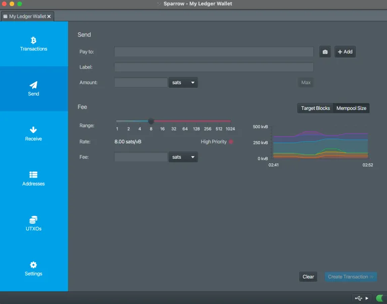

Saat melakukan pembayaran, tempelkan alamat tujuan di kolom “Bayar ke.” Kamu tidak bisa membiarkan kolom Label kosong. Kolom ini hanya untuk catatan pribadi di dompet kamu, tetapi Sparrow mewajibkannya diisi. Cukup tulis apa saja, karena hanya kamu yang bisa melihatnya. Masukkan jumlah yang ingin kamu kirim, dan kamu juga bisa menyesuaikan biaya transaksi (fee) secara manual.

Dompet tidak bisa menandatangani transaksi kecuali hardware wallet (HWW) kamu terhubung. Itulah fungsi utama HWW: menerima transaksi, menandatanganinya, lalu mengembalikannya dalam keadaan sudah ditandatangani. Saat proses penandatanganan, pastikan kamu memeriksa alamat tujuan secara visual di perangkat dan di layar komputer, serta memastikan alamat itu sama dengan yang tertera di faktur atau email pembayaran yang kamu terima.

Perlu diperhatikan juga bahwa jika kamu memilih koin (UTXO) yang nilainya lebih besar dari jumlah pembayaran, maka sisanya akan dikirim kembali ke salah satu alamat “change” di dompet kamu sendiri. Banyak orang tidak sadar soal ini, lalu ketika melihat transaksi mereka di blockchain publik, mereka mengira sebagian bitcoin dikirim ke alamat penyerang, padahal sebenarnya itu adalah alamat perubahan (change address) milik mereka sendiri.

## Firmware

Untuk memperbarui firmware, kamu perlu terhubung ke Ledger Live. Jika ingin melakukannya, kamu harus menghapus perangkat terlebih dahulu, dan pastikan kamu sudah memiliki seedphrase dan passphrase yang diperlukan untuk memulihkan perangkat nanti.

Alasan aku lebih suka menghapus perangkat terlebih dahulu adalah karena proses pembaruan firmware memang mengharuskan perangkat terhubung ke Ledger Live. Aku memilih untuk tidak mengekspos dompet barumu (yang menggunakan passphrase) ke Ledger Live sama sekali. Aku pribadi tidak sepenuhnya percaya bahwa Ledger tidak mengekstrak informasi kunci publik dari perangkat saat terhubung ke Ledger Live. Mereka mengklaim tidak melakukannya, tapi aku tidak bisa memverifikasi hal itu sendiri tanpa membaca kodenya dan memahami detail perangkat keras internalnya.

## Kesimpulan
Artikel ini menunjukkan cara menggunakan Ledger HWW dengan cara yang lebih aman dan lebih privat daripada yang biasa dipromosikan, tetapi artikel ini saja belum cukup. Seperti yang sudah aku jelaskan di awal, kamu perlu menggabungkannya dengan informasi yang ada di artikel “Menggunakan Hardware Wallet Bitcoin.”

Tips:

Alamat Lightning Statis: dandysack84@walletofsatoshi.com
https://armantheparman.com/ledgersparrow/

Untuk mempelajari topik ini lebih dalam dan memperkuat keamanan dompet kamu di Ledger Nano dengan passphrase BIP39, aku mengundang kamu untuk melihat tutorial lengkap berikut:

https://planb.network/tutorials/wallet/backup/passphrase-ledger-9ae6d9a2-7293-438a-8fe0-e59147ef2f49


