Ví lạnh vật lý – €60 – Người mới bắt đầu – Để bảo mật từ €2,000 đến €50,000

Ledger là giải pháp của Pháp để bảo mật bitcoin một cách đơn giản.

Trong hướng dẫn này, chúng tôi cũng thảo luận về phần cụm từ bí mật, một giải pháp bảo mật nâng cao để lưu trữ số tiền lớn: từ 20,000€ đến 100,000€.

https://www.youtube.com/watch?v=_vsHNTLi8MQ

# Kết nối Ledger với Ví Bitcoin Sparrow (hướng dẫn viết)

Hãy chắc chắn bạn đã xem qua phần "Sử dụng Ví Cứng Bitcoin" trước. Tôi sẽ lướt qua một số bước và tập trung chủ yếu vào những gì cụ thể cho Ledger ở đây.

## Thiết lập thiết bị

Ledger đi kèm với dây cáp USB của riêng nó. Hãy chắc chắn bạn sử dụng cáp đó chứ không phải bất kỳ cáp cũ nào. Một số cáp USB chỉ truyền điện. Cáp này truyền cả dữ liệu VÀ điện. Khi tôi sử dụng thiết bị với cáp USB sạc điện thoại có sẵn, thiết bị đã không thể kết nối.

Kết nối nó với máy tính và thiết bị sẽ được bật lên.

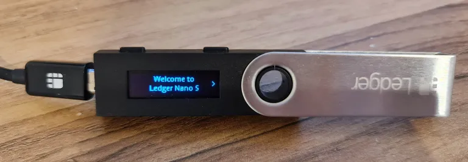

Lướt qua các tùy chọn. Bạn sẽ thấy

1. Thiết lập như thiết bị mới
2. Khôi phục từ cụm từ khôi phục

Cơ bản là, nó đang hỏi bạn có muốn thiết bị tạo một hạt giống cho bạn hay bạn đã có một hạt giống mà bạn muốn sử dụng. Thực hành tốt nhất là tự tạo hạt giống của bạn, nhưng làm điều đó một cách an toàn là rất nâng cao, và nằm ngoài phạm vi của bài viết này. Chọn "Thiết lập như thiết bị mới"

Sau đó, bạn sẽ được yêu cầu chọn một mã PIN. Điều này không phải là một phần của hạt giống Bitcoin của bạn và chỉ đặc biệt cho thiết bị này. Nó khóa thiết bị.

Nó sẽ sau đó trình bày cho bạn 24 từ mà bạn cần lướt qua và ghi lại.

Lạ thay, khi bạn đến cuối, nó nói "nhấn trái để xác minh từ của bạn". Điều đó không mô tả cách bạn xác nhận để tiếp tục, nó chỉ có nghĩa là bạn có thể quay lại và xem lại các từ. Nhấn phải thay vào đó, và xác nhận bằng cách nhấn trái và phải cùng một lúc.

Phần tiếp theo thực sự khó chịu. Nó xáo trộn 24 từ và bạn phải xác nhận từng từ, từ 1 đến 24, bằng cách lướt qua tất cả các từ cho mỗi lựa chọn. Khi bạn hoàn thành, nó cho phép bạn xác nhận bằng cách nhấn hai nút và tiếp tục.

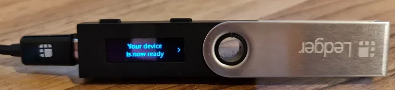

Bạn sẽ thấy trên bảng điều khiển của mình rằng bạn có một nút cài đặt, và một nút dấu cộng cho phép bạn cài đặt ứng dụng. Nhưng bạn cần kết nối với Ledger Live trước. Chúng ta sẽ làm điều đó tiếp theo…

## Tải xuống Ledger Live

Bạn có thể tải xuống Ledger Live từ trang web của họ, nhưng tốt hơn hết là lấy nó từ GitHub, nơi mã nguồn được giữ.

Google “ledger live GitHub” hoặc nhấp vào liên kết này https://github.com/LedgerHQ/ledger-live-desktop

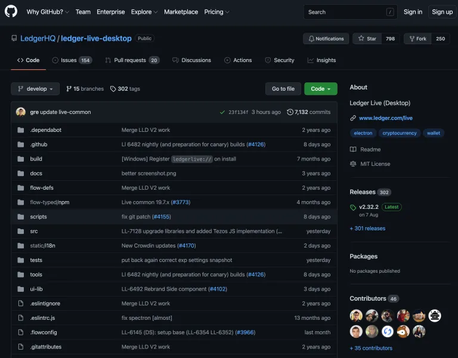

Cuộn xuống cho đến khi bạn thấy tiêu đề, “Downloads”…

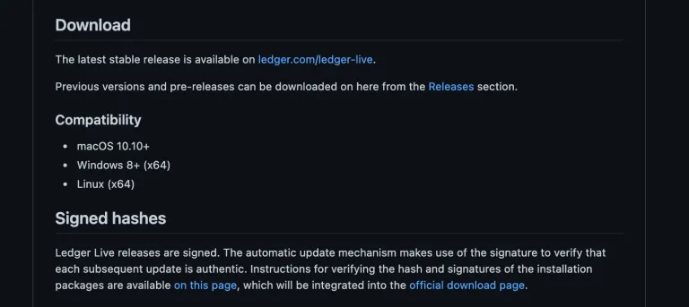

Ở phía dưới, bạn sẽ thấy liên kết: Hướng dẫn xác minh hash và chữ ký của các gói cài đặt có sẵn trên trang này. Nhấp vào liên kết đó.(https://live.ledger.tools/lld-signatures)

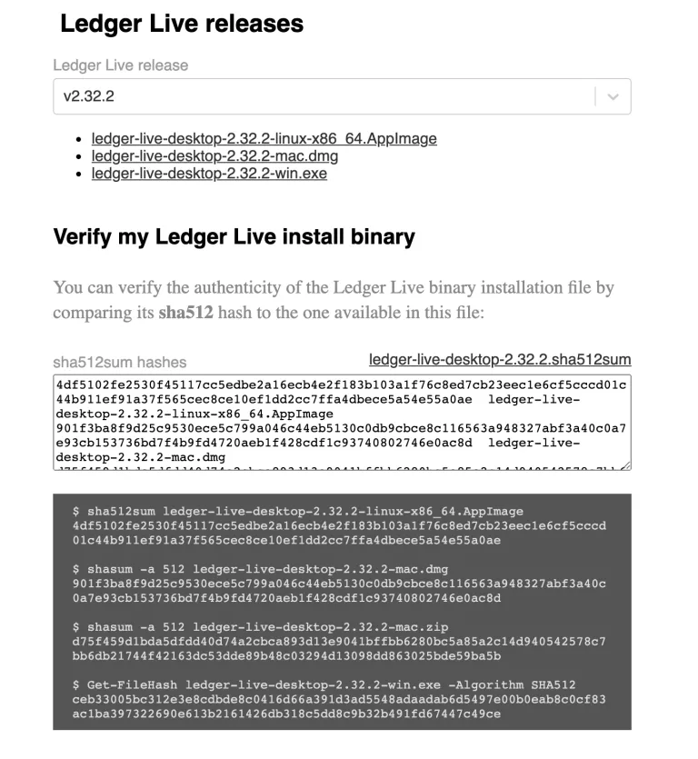

Ở phía trên, có các lựa chọn liên kết cho gói phần mềm bạn cần, tùy thuộc vào hệ điều hành của bạn. Nhấp vào cái phù hợp để tải xuống.

Tiếp theo, chúng ta muốn xác minh hash của tải xuống, để tăng cường bảo mật.
Ledger công bố mã hash của từng tệp tin có sẵn trên trang này. Chúng ta sẽ bây giờ hash tệp tin tải về và so sánh kết quả. Nó cần phải giống hệt nhau để đảm bảo tệp tin không bị can thiệp.

Mở terminal trên Mac hoặc CMD trên Windows. Thực hiện các lệnh sau...

cd Downloads

<Enter>

```bash
shasum -a 512 ledger-live-desktop-2.32.2-mac.dmg # <--- Dành cho Mac
certutil -hashfile ledger-live-desktop-2.32.2-win.exe SHA512 # <--- Dành cho Windows
```

<Enter>

Hy vọng rằng rõ ràng là các lệnh bắt đầu sau các mũi tên. Đảm bảo, nếu bài viết này lỗi thời, bạn thay đổi tên tệp tin trong các lệnh để chính xác với tên tệp tin bạn đã tải về. Bạn cần nhấn phím <Enter> sau mỗi lệnh. Các lệnh như bạn thấy ở đây có thể không vừa với một dòng trên trình duyệt web của bạn. Lưu ý, tất cả được gõ trên một dòng.

Nhìn vào kết quả của mã hash và đảm bảo nó giống hệt với cái được công bố trên GitHub.

Lý tưởng nhất, bạn muốn kiểm tra thêm để đảm bảo rằng các mã hash được công bố không phải là giả. Chúng tôi làm điều này với chữ ký gpg, nhưng đó là ngoài phạm vi của bài viết này. Nếu bạn muốn tìm hiểu về điều đó (và tôi đề xuất bạn nên làm vậy eventually), sau đó xem qua bài viết này.

## Kết nối với Ledger Live

Trước khi bạn chạy Ledger Live, việc bật VPN giúp bảo vệ quyền riêng tư một chút. Ledger vẫn sẽ nhận được tất cả địa chỉ của bạn, nhưng họ sẽ không biết địa chỉ IP của bạn, điều này tiết lộ địa chỉ nhà bạn. Mullvad VPN là một dịch vụ VPN xuất sắc và không quá đắt (Tôi không quảng cáo, đó chỉ là cái tôi sử dụng).

Cài đặt phần mềm vào máy tính và chạy nó.


Chọn thiết bị của bạn, và chọn “Lần đầu tiên sử dụng…”

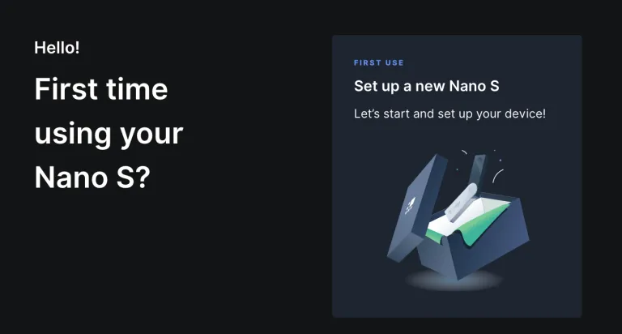

Sau đó bạn sẽ được dẫn qua một trình hướng dẫn, nhưng chúng tôi đã thực hiện tất cả các bước này nên bạn có thể lướt qua.


Sau nhiều bước và một bài kiểm tra, nó sẽ kiểm tra thiết bị là chính hãng. Bạn cần đảm bảo bạn đã kết nối và nhập mã pin, sau đó nó sẽ hỏi trên thiết bị nếu bạn cho phép Ledger Live kết nối. Bạn phải xác nhận điều đó, tất nhiên.


Có một số quảng cáo shitcoin được ngụy trang dưới dạng “ghi chú phát hành” trong cửa sổ pop up tiếp theo. Hủy bỏ nó, và sau đó bạn sẽ đến màn hình này.

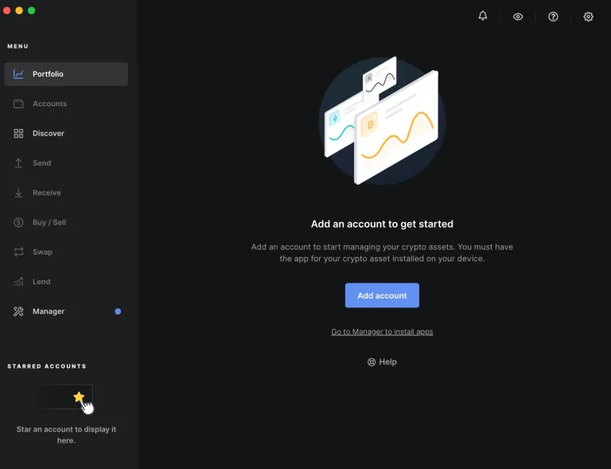

Bạn phải nhấp vào “Thêm tài khoản” để có được một Ví Bitcoin.

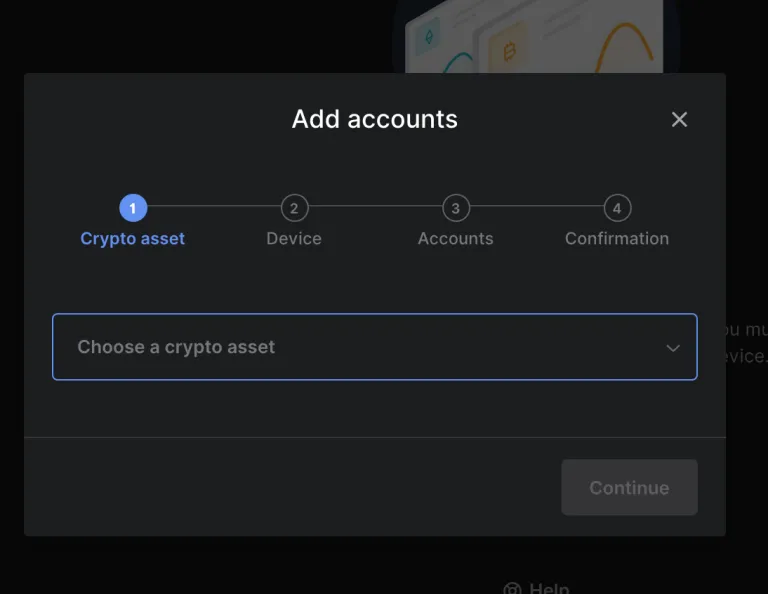

Đảm bảo bạn chọn Bitcoin, và không phải Bitcoin Cash hay bất kỳ shitcoin nào khác. Nó sẽ kiểm tra thiết bị, và bạn phải xác nhận để tiếp tục TRÊN THIẾT BỊ. Nó sẽ tính toán địa chỉ trong vài phút. Sau đó nhấp vào HOÀN TẤT.

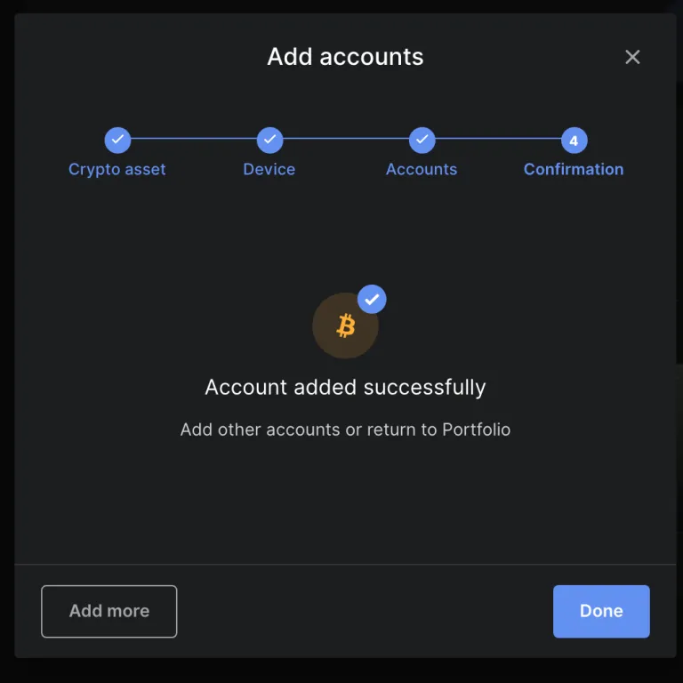
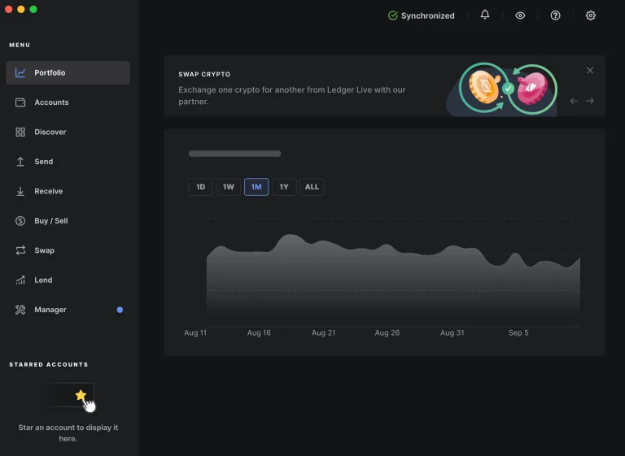

Tuyệt vời. Bây giờ bạn có một trình quản lý ví shitcoin chứa một ví Bitcoin trên máy tính của bạn. Thực ra bạn không cần cái này nữa và có thể loại bỏ nó. Mục đích thực sự là để có được Ứng dụng Bitcoin trên chính thiết bị, và đây là cách duy nhất, ngoại trừ việc thực hiện một số kỹ thuật phần mềm cực đoan.

Nhớ rằng trước đó, trên thiết bị, chúng ta có một nút cài đặt và một nút dấu cộng. Bây giờ chúng ta có một nút thêm – nút Ứng dụng Bitcoin.

Bạn có thể tắt Ledger Live bây giờ.

## Thêm một cụm mật khẩu
Giờ đây, khi chúng ta đã có Ứng dụng Bitcoin, chúng ta có thể thêm một cụm từ bí mật vào cụm từ gốc của mình. Chúng ta không thể làm điều đó trước đây khi cụm từ gốc mới được tạo ra vì ban đầu, chúng ta không có Ứng dụng Bitcoin, và chúng ta cần kết nối với Ledger Live để có được nó.

Đi đến menu “cài đặt” trong thiết bị, sau đó là submenu “bảo mật”. Sau đó chọn cụm từ bí mật. Bạn sẽ thấy “Tính năng nâng cao”. Nhấn nút bên phải, bạn sẽ thấy “đọc hướng dẫn…” và sau đó sau một cú nhấp nút phải, bạn sẽ thấy “quay lại”. Nhưng đó không phải là kết thúc. Một cách trực giác, bạn sẽ nghĩ như vậy nhưng nhấn nút phải một lần nữa. Bạn sẽ thấy “thiết lập cụm từ bí mật”.

Bạn có thể quyết định “gắn với PIN” hoặc “Thiết lập tạm thời”. Tôi khuyên bạn nên “gắn với PIN”. Như vậy, bạn có thể truy cập vào các ví khác nhau tùy thuộc vào PIN bạn nhập khi bạn khởi động thiết bị lần đầu. Nếu bạn “thiết lập tạm thời”, bạn sẽ phải nhập cụm từ bí mật mỗi lần bạn muốn truy cập vào ví đó, nhưng nó luôn từ PIN mặc định.

Nhập cụm từ bí mật và xác nhận nó.

Nó sẽ yêu cầu bạn nhập “PIN Hiện Tại”. Đây không phải là PIN bạn đang liên kết với cụm từ bí mật mới. Đó là PIN bạn nhập khi bạn khởi động thiết bị cho phiên này.

Bây giờ bạn có thể thoát ra menu chính bằng cách chọn tùy chọn quay lại vài lần.

## Quan Sát Ví

Trong các bài viết trước, tôi đã giải thích cách tải xuống và xác minh ví Sparrow, và cách kết nối nó với node của riêng bạn, hoặc một node công cộng. Bạn nên theo dõi các hướng dẫn này:

- Cài đặt Bitcoin Core (https://armantheparman.com/bitcoincore/)

- Cài đặt Ví Bitcoin Sparrow (https://armantheparman.com/download-sparrow/)

- Kết nối Ví Bitcoin Sparrow với Bitcoin Core (https://armantheparman.com/sparrowcore/)

Một lựa chọn thay thế cho việc sử dụng Ví Bitcoin Sparrow là Ví Desktop Electrum, nhưng tôi sẽ tiếp tục giải thích về Ví Bitcoin Sparrow vì tôi đánh giá nó là tốt nhất cho hầu hết mọi người. Người dùng nâng cao có thể thích sử dụng Electrum như một lựa chọn thay thế.

Bây giờ chúng ta sẽ tải nó lên và kết nối Ledger, với ví chứa cụm từ bí mật. Ví này chưa bao giờ được tiếp xúc với Ledger Live vì nó được tạo SAU khi chúng ta kết nối thiết bị với Ledger Live. Hãy chắc chắn bạn không bao giờ kết nối nó với Ledger Live nữa để không tiết lộ ví riêng tư mới của bạn.

Tạo một Ví Mới:


Đặt tên cho nó một cái tên đẹp

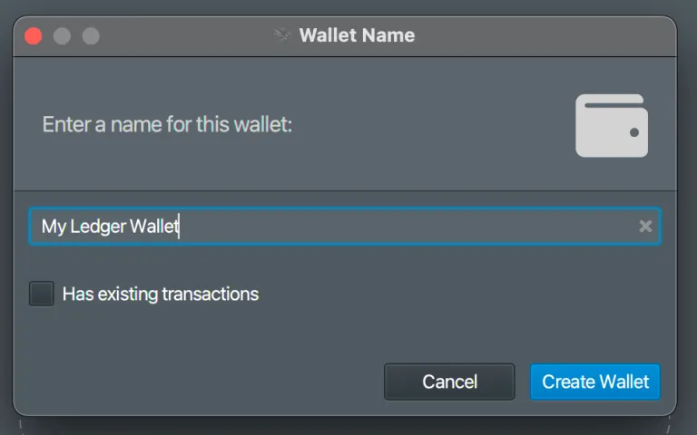

Chú ý đến hộp kiểm, “Có giao dịch hiện tại”. Nếu đây là một ví bạn đã sử dụng trước đó, thì hãy kiểm tra nó nếu không số dư của bạn sẽ hiển thị không chính xác là không. Kiểm tra hộp này yêu cầu Sparrow kiểm tra cơ sở dữ liệu của Bitcoin Core (blockchain) cho các giao dịch trước đó. Đối với hướng dẫn này, chúng ta đang sử dụng một ví hoàn toàn mới, vì vậy bạn có thể để hộp không được kiểm tra.

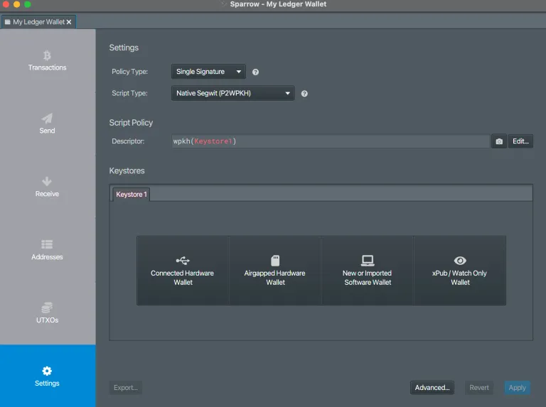

Nhấp vào “Ví Phần Cứng Đã Kết Nối” và đảm bảo rằng thiết bị thực sự được kết nối, đã bật, PIN đã nhập, và bạn đã nhập vào Ứng dụng Bitcoin.

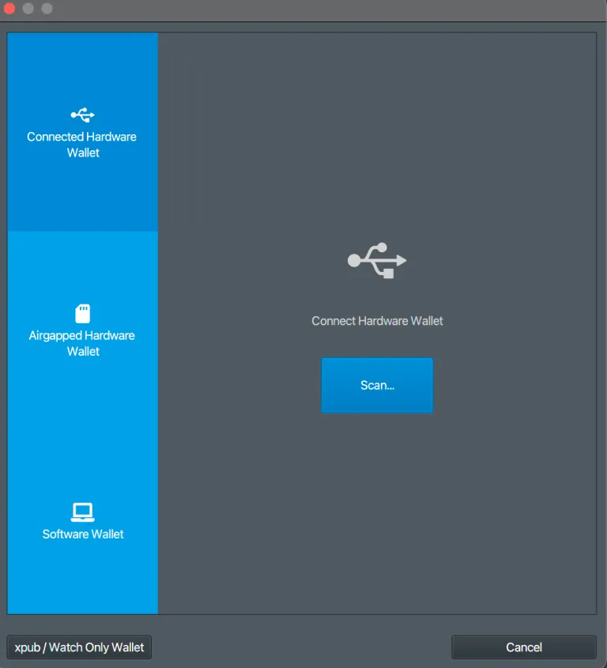

Nhấp “Quét” và sau đó “Nhập Khóa Lưu Trữ” trên màn hình tiếp theo.


Không có gì để chỉnh sửa trên màn hình tiếp theo, Ledger đã điền cho bạn. Nhấp “Áp dụng”

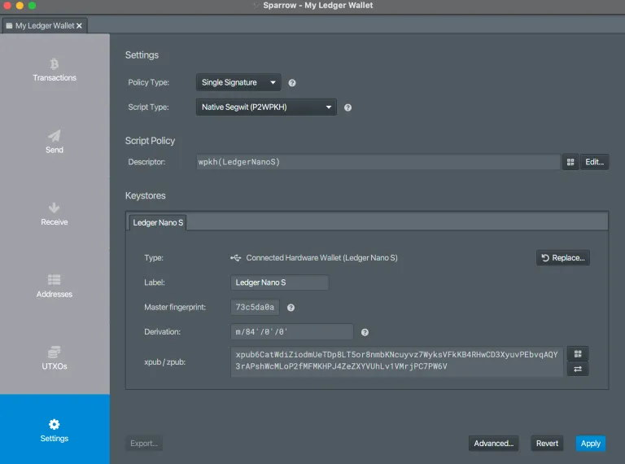
Màn hình tiếp theo cho phép bạn thêm một mật khẩu. Đừng nhầm lẫn điều này với “passphrase”; nhiều người sẽ làm vậy. Cách đặt tên này không may mắn. Mật khẩu cho phép bạn khóa ví này trên máy tính của bạn. Nó chỉ đặc biệt cho phần mềm này trên máy tính này. Nó không phải là một phần của khóa riêng tư Bitcoin của bạn.
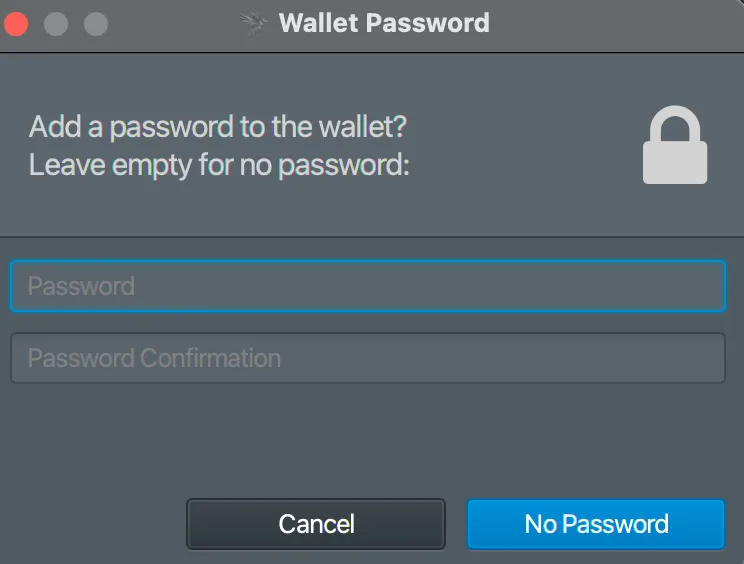

Sau một khoảng nghỉ, trong khi máy tính đang xử lý, bạn sẽ thấy các nút ở bên trái chuyển từ màu xám sang màu xanh. Xin chúc mừng, ví của bạn giờ đây đã sẵn sàng để sử dụng. Hãy thực hiện và gửi giao dịch theo ý muốn của bạn.

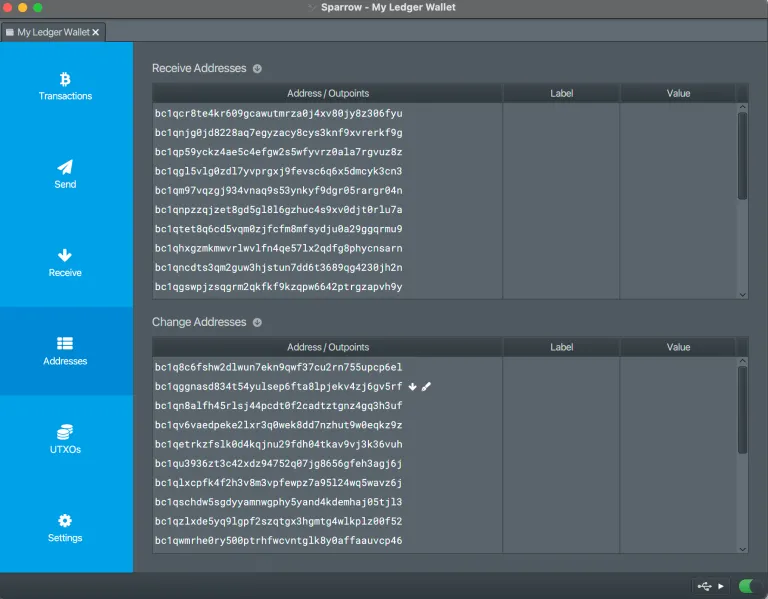

## Nhận

Để nhận một số bitcoin, hãy đi đến tab Địa chỉ ở bên trái và chọn một trong những địa chỉ để nhận. Chỉ cần nhấp chuột phải vào địa chỉ bạn muốn, và chọn “copy address”. Sau đó, hãy đến sàn giao dịch nơi tiền được gửi từ và dán nó vào đó. Hoặc bạn cũng có thể cung cấp địa chỉ cho một khách hàng, người có thể sử dụng nó để thanh toán cho bạn.

Khi bạn sử dụng ví lần đầu tiên, bạn nên nhận một số lượng nhỏ, thực hành gửi nó đến một địa chỉ khác, hoặc trong ví hoặc trở lại sàn giao dịch, để chứng minh rằng ví đang hoạt động như mong đợi.

Sau khi bạn làm điều đó, bạn phải sao lưu các từ mà bạn đã ghi lại. Một bản sao duy nhất không đủ. Hãy có ít nhất hai bản sao giấy (kim loại tốt hơn), và giữ chúng ở hai địa điểm khác nhau, được bảo vệ tốt. Điều này giảm thiểu rủi ro một thảm họa tự nhiên phá hủy HWW và bản sao giấy của bạn trong một sự cố. Xem “Sử dụng Bitcoin Hardware Wallets” để thảo luận đầy đủ về điều này.

## Gửi

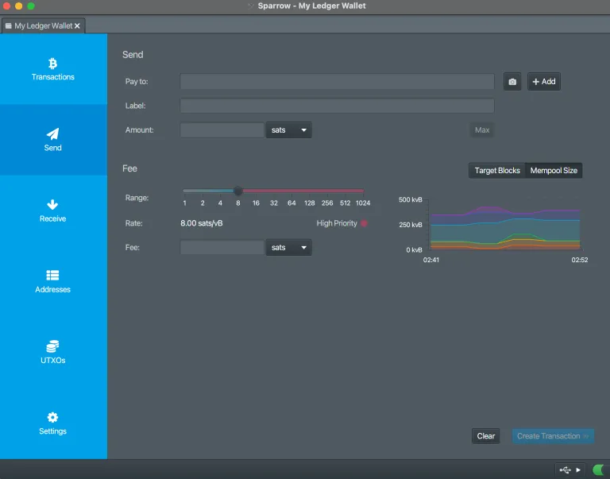

Khi thực hiện một khoản thanh toán, bạn cần dán địa chỉ bạn đang thanh toán vào trong trường “Pay to”. Bạn không thể thực sự để trống Nhãn, nó chỉ cho hồ sơ ví của riêng bạn, nhưng Sparrow không cho phép – chỉ cần nhập một cái gì đó (chỉ bạn mới thấy nó). Nhập số lượng và bạn cũng có thể tự điều chỉnh phí bạn muốn.

Ví không thể ký giao dịch trừ khi HWW được kết nối. Đó là công việc của HWW – nhận giao dịch, ký nó, và trả lại, đã ký. Đảm bảo khi bạn ký trên thiết bị, bạn kiểm tra bằng mắt địa chỉ bạn đang thanh toán có giống nhau trên thiết bị và trên màn hình máy tính, và hóa đơn bạn nhận (ví dụ bạn có thể đã nhận được email để thanh toán một địa chỉ nhất định).

Cũng chú ý rằng nếu bạn chọn sử dụng một đồng xu lớn hơn số tiền thanh toán, thì phần còn lại sẽ được gửi trở lại một trong những địa chỉ thay đổi của ví bạn. Một số người không biết điều này, và đã kiểm tra giao dịch của họ trên một blockchain công cộng, và nghĩ rằng một số bitcoin đã được gửi đến địa chỉ của kẻ tấn công, nhưng thực tế, đó là địa chỉ thay đổi của chính họ.

## Firmware

Để cập nhật firmware, bạn cần kết nối với Ledger Live. Nếu bạn muốn làm điều này, bạn nên xóa sạch thiết bị trước, và đảm bảo bạn có các từ sao lưu và passphrase sẵn sàng để khôi phục thiết bị. Lý do tôi thích xóa sạch thiết bị trước là bạn phải kết nối thiết bị của mình với Ledger Live để cập nhật firmware, và tôi thích không phơi bày ví mới của bạn (với passphrase) cho Ledger Live, bao giờ. Tôi chỉ không tin Ledger không trích xuất thông tin khóa công khai của tôi từ thiết bị khi tôi kết nối với Ledger Live. Họ tuyên bố họ không làm vậy, nhưng tôi không thể xác minh điều đó bằng chính mình trừ khi tôi đọc mã, và hiểu về phần cứng bên trong.

## Kết luận
Bài viết này đã hướng dẫn bạn cách sử dụng Ledger HWW một cách an toàn và riêng tư hơn so với những gì được quảng cáo - nhưng chỉ có bài viết này thôi là chưa đủ. Như tôi đã nói ngay từ đầu, bạn nên kết hợp nó với thông tin được cung cấp trong "Sử dụng Ví Cứng Bitcoin". Mẹo:

Địa chỉ Lightning Tĩnh: dandysack84@walletofsatoshi.com
https://armantheparman.com/ledgersparrow/

Để tìm hiểu sâu hơn về chủ đề này và tăng cường bảo mật cho ví của bạn trên Ledger Nano với passphrase BIP39, tôi mời bạn tham khảo hướng dẫn toàn diện này:

https://planb.network/tutorials/wallet/passphrase-ledger

