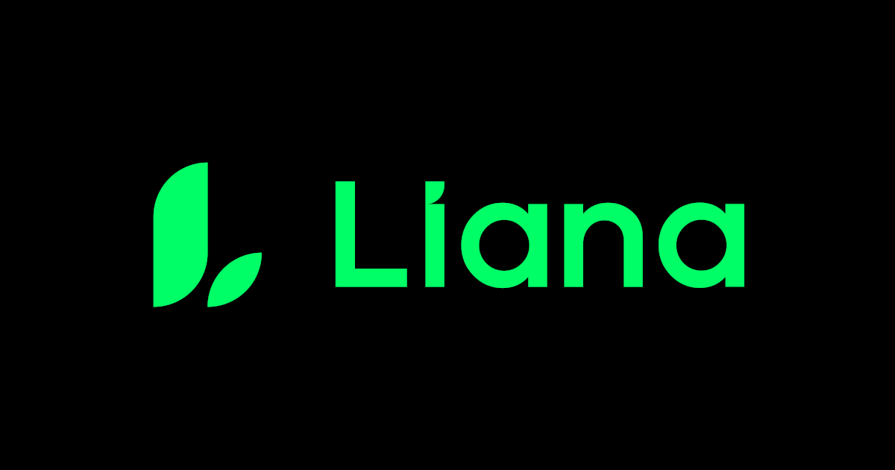

Dalam tutorial ini, kita akan membahas langkah demi langkah cara menggunakan aplikasi Liana di komputer. Kamu akan belajar cara menyiapkan rencana suksesi otomatis, menerima dan mengirim bitcoin dalam kondisi normal, serta menarik dana dari dompet setelah periode tertentu.

Per Januari 2025, dompet perangkat keras yang kompatibel dengan Liana meliputi: BitBox02, Blockstream Jade, Blockstream Jade Plus, COLDCARD MK4, COLDCARD Q, Ledger Nano S, Ledger Nano S Plus, Ledger Nano X, Ledger Flex, dan Specter DIY.

Kalau kamu ingin memulihkan dana dari dompet Liana yang sudah ada, langsung cek presentasi di bawah ini dan lompat ke bagian “Memulihkan bitcoin”.

## Memperkenalkan perangkat lunak Liana

Liana adalah perangkat lunak open-source yang dirancang untuk membuat dan mengelola dompet tingkat lanjut, terutama sebagai bagian dari sistem pewarisan otomatis atau mekanisme pencadangan yang kuat. Proyek ini dikembangkan sejak 2022 oleh Wizardsardine, perusahaan yang didirikan bersama oleh Kévin Loaec dan Antoine Poinsot.

Di situs resminya, Liana diperkenalkan sebagai “dompet sederhana untuk manajemen pribadi, dengan fungsi pemulihan dan pewarisan.” Perangkat lunak ini berjalan di komputer dengan sistem operasi Linux, macOS, dan Windows, serta kode sumbernya tersedia secara terbuka [di GitHub](https://github.com/wizardsardine/liana).

Liana dibangun di atas fitur pemrograman Bitcoin untuk menghadirkan dompet yang lebih canggih. Secara khusus, Liana memanfaatkan timelock—kunci waktu yang memungkinkan dana hanya bisa dibelanjakan setelah periode tertentu berlalu—yang menjadi bagian penting dalam mekanisme pemulihan Bitcoin.

Dompet Liana sendiri terdiri dari beberapa jalur pengeluaran:


- Jalur pengeluaran utama yang selalu tersedia;
- Setidaknya satu jalur pemulihan, yang dapat diakses setelah waktu tertentu.

Diagram di bawah ini menunjukkan cara kerja dompet dengan dua jalur pengeluaran:

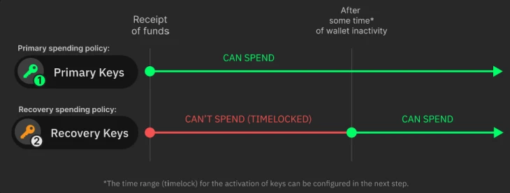

Operasi ini memungkinkanmu untuk mengatur berbagai konfigurasi, termasuk :


- Rencana suksesi (atau warisan), yang memungkinkan ahli waris mengambil kembali dana jika pengguna meninggal dunia. Untuk detail lebih lanjut tentang ini, kita sarankan untuk membaca [bagian 4] (https://planb.network/courses/f3e3843d-1a1d-450c-96d6-d7232158b81f/233c88d3-2e8e-5eba-ac06-efe67a209038) dari kursus BTC102.
- Cadangan dengan timelock pemulihan, yang memberi kamu opsi untuk tetap bisa memakai dompet tanpa harus menyimpan seedphrase lengkap—yang berisiko dicuri, misalnya saat terjadi peretasan atau pencurian.
- Jaring pengaman bagi orang yang baru mulai menggunakan Bitcoin: mereka bisa mengelola dompetnya sendiri, sementara “wali” mereka (misalnya kerabat) punya hak untuk mengambil kembali dana setelah periode waktu tertentu.
- Skema tanda tangan multi-pihak (*multisig*) dengan persyaratan yang berkurang dari waktu ke waktu, untuk mengatasi hilangnya satu atau lebih peserta, seperti mitra perusahaan.

Kekuatan utama Liana adalah kemampuannya menghadirkan standar baru untuk menjamin pemulihan dana jika kunci utama yang dipakai untuk pengeluaran sehari-hari—hilang. Ini adalah inovasi besar dalam penyimpanan bitcoin yang aman, sebuah area yang penuh risiko, apalagi kalau kamu kurang paham soal teknisnya. Karena itu, Liana bisa mendorong bahkan pengguna yang paling berhati-hati sekalipun untuk berhenti menyimpan dana di kustodian (seperti bursa) dan kembali memegang kendali penuh atas uang mereka, sesuai dengan etos cypherpunk Bitcoin.

Tentu saja, Liana juga punya kekurangan. Pertama, kamu harus memperbarui dompet secara berkala dengan membuat transaksi di blockchain Bitcoin. Hal ini bisa terasa merepotkan (tergantung seberapa sering kamu memakai aplikasinya) dan juga bisa mahal (tergantung biaya transaksi saat itu). Tapi, ini memang harga yang perlu dibayar demi keamanan tambahan.

Kedua, soal privasi. Kalau kamu melibatkan orang lain dalam konfigurasi dompet, orang itu akan tahu semua alamatmu dan bisa memantau aktivitasmu. Meski begitu, masalah ini bisa dihindari kalau kamu memilih cadangan dengan timelock pemulihan, atau rencana suksesi di mana pewaris tidak punya akses langsung ke detail dompet.

## Persiapan

Dalam tutorial ini, kita akan menyiapkan rencana warisan. Kita akan menggunakan :


- Buku Besar Nano S Plus, untuk pengeluaran sehari-hari;

https://planb.network/tutorials/wallet/hardware/ledger-nano-s-plus-75043cb3-2e8e-43e8-862d-ca243b8215a4

- Blockstream Jade, digunakan untuk memulihkan dana;

https://planb.network/tutorials/wallet/hardware/jade-7d62bf0c-f460-4e68-9635-af9b731dabc3

- Dua media penyimpanan (stik USB) untuk menyimpan deskriptor portofolio;
- Surat suksesi, yang berisi instruksi untuk memulihkan dana;
- Kantong tertutup bernomor, untuk memastikan bahwa perangkat pemulihan (Jade) belum pernah digunakan.

## Instalasi dan konfigurasi

Kunjungi situs web resmi Wizardsardine dan unduh Liana di https://wizardsardine.com/liana/. Kamu juga bisa mengunduh versi terbaru [dari repositori GitHub] (https://github.com/wizardsardine/liana/releases), di mana kamu dapat memeriksa keaslian perangkat lunak. Versi yang digunakan dalam tutorial ini adalah 0.9.

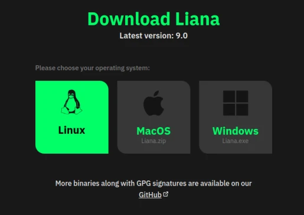

Untuk mengetahui cara memverifikasi keaslian dan integritas perangkat lunak secara manual sebelum instalasi, kami sarankan kamu membaca tutorial ini:

https://planb.network/tutorials/computer-security/data/integrity-authenticity-21d0420a-be02-4663-94a3-8d487f23becc

Instal perangkat lunak pada komputer kamu dan luncurkan. Pilih opsi "*Buat dompet Liana baru*" untuk mengonfigurasi dompetmu.

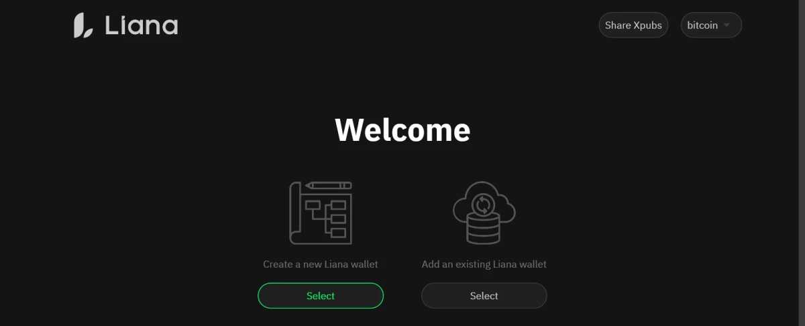

Pilih jenis portofolio. Kalau kamu ingin menyiapkan pencadangan yang disempurnakan dengan waktu pemulihan, kamu bisa memilih opsi "*Buat sendiri*" dan memilih skema default. Ini akan bekerja dengan cara yang hampir sama, kecuali bahwa kamu tidak perlu mempertahankan frasa pemulihan dompet perangkat keras.

Di sini kita mengabaikan kasus *Multisig yang diperluas*, yang mengatur konfigurasi yang lebih kompleks.

Untuk keperluan tutorial ini, kita akan menggunakan warisan sederhana.

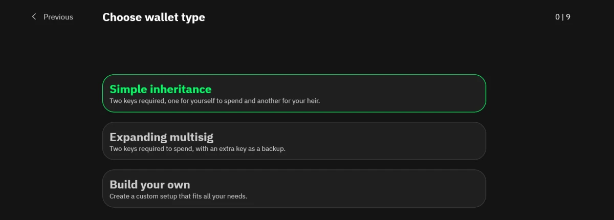

Berikut ini penjelasan singkatnya.

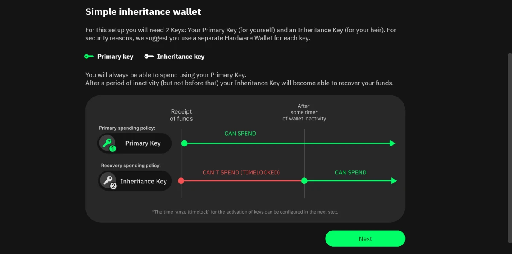

Setelah kamu membaca penjelasan ini, kamu bisa mulai mengatur kunci dompet Liana-mu. Langkah ini sangat penting karena akan menentukan karakteristik pengeluaran dari akunmu.

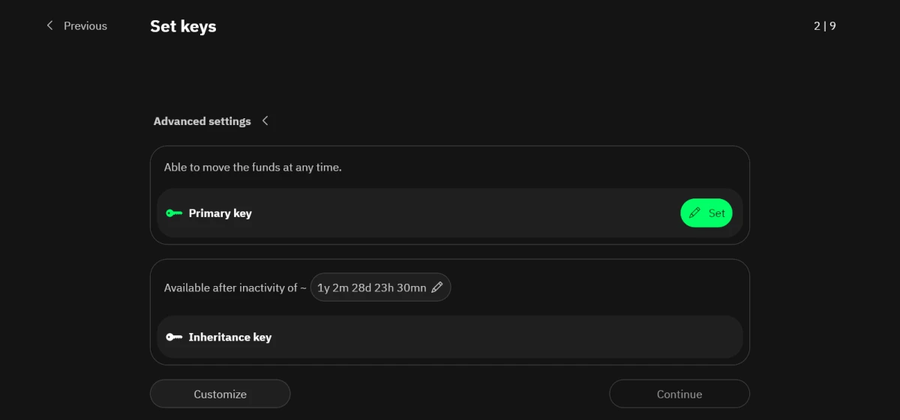

Pertama, di menu “Pengaturan Lanjutan”, kamu bisa menentukan “tipe deskriptor”, yaitu cara kontrak dituliskan di blockchain. Ada dua pilihan: P2WSH (SegWit) atau Taproot. Di kedua opsi ini, aturan pembelanjaannya tetap sama. Bedanya, P2WSH membuat kontrak lebih mudah dibaca, sementara Taproot lebih unggul karena bisa menyembunyikan kondisi yang tidak dipakai sekaligus menghemat biaya saat pemulihan dana.

Pilihan ini bersifat opsional: jika ragu, biarkan opsi default (P2WSH pada versi 0.9, tetapi ini dapat berubah).

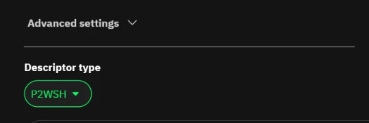

Selanjutnya, **atur kunci utama kamu**. Kunci ini (atau lebih tepatnya, sekumpulan kunci) dipakai untuk pengeluaran dana saat ini yang tidak terikat oleh kondisi waktu apa pun. Dengan klik “Set”, kamu bisa memilih perangkat penandatanganan yang sesuai. Dalam contoh ini, kita menggunakan dompet perangkat keras Ledger Nano S Plus.

Setelah itu, izinkan pembagian kunci publik yang diperluas dari perangkat. Beri nama kunci ini dengan sesuatu yang mudah diingat (misalnya “Nano S+”). Perlu dicatat, semua aplikasi yang sudah terpasang di perangkat tetap bisa berfungsi normal.

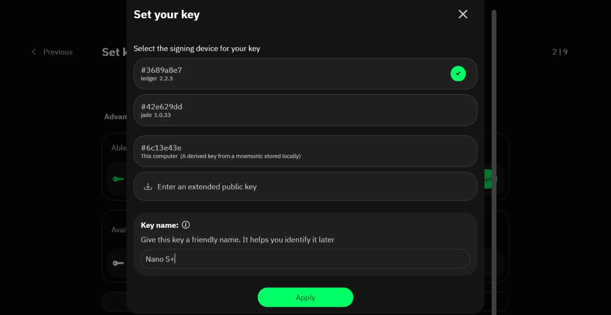

Selanjutnya, atur penundaan pemulihan, yaitu waktu tunggu sebelum dana bisa dibelanjakan oleh kunci warisan. Penundaan ini ditentukan dalam jumlah blok, dengan rata-rata satu blok setiap 10 menit. Rentangnya mulai dari 1 blok (±10 menit) hingga 65.535 blok (±15 bulan). Angka maksimum ini adalah batas protokol Bitcoin, karena waktu penguncian dikodekan dalam 16 bit.

Kecuali untuk kondisi tertentu, sebaiknya pilih waktu tunggu terpanjang: 15 bulan atau 65.535 blok. Pilihan ini akan lebih menghemat biaya. Namun, disarankan untuk melakukan prosedur pembaruan (dijelaskan di bagian “Memperbarui dompet”) setahun sekali, di waktu yang sama, agar menjadi kebiasaan dan tidak mudah terlupakan.

Di sini, kita telah menyiapkan waktu pemulihan selama satu jam (6 blok) untuk melakukan pengujian.

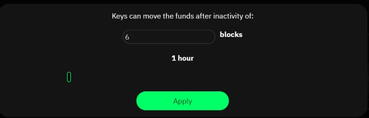

Terakhir, atur kunci warisan kamu. Kunci ini (atau sekumpulan kunci) akan dipakai untuk memulihkan dana kalau kamu hilang atau tidak bisa mengakses kunci utama. Klik “Set”, pilih perangkat penandatanganan, lalu konfirmasi pembagian kunci publik yang diperluas dari perangkat tersebut.

Dalam tutorial ini, kita menggunakan Jade. Beri nama yang jelas dan mudah diingat (misalnya “Jade”). Sama seperti pada perangkat pertama, akun konvensional tetap bisa berfungsi seperti biasa.

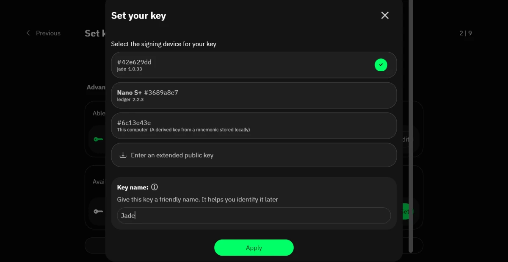

Setelah semua tindakan ini selesai, periksa apakah semuanya sudah sesuai dan klik "*Lanjutkan*" untuk mengonfirmasi pilihanmu.

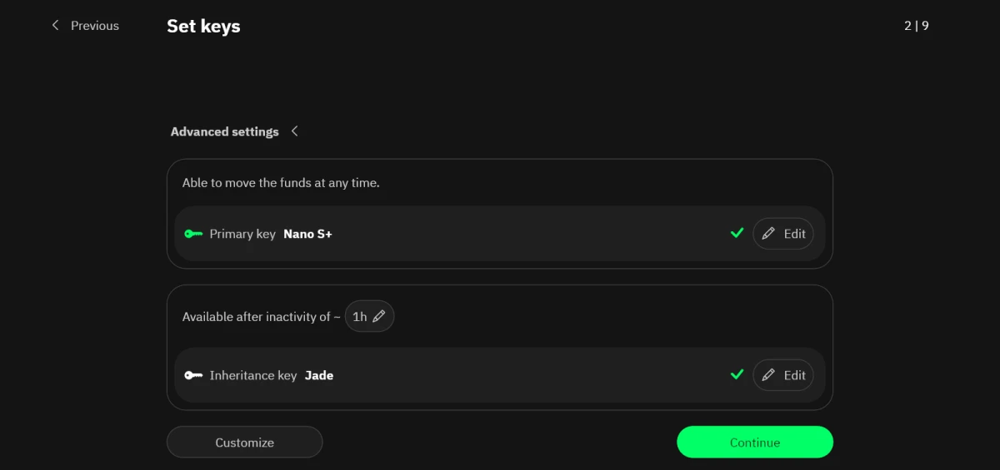

Langkah berikutnya adalah menyimpan deskriptor dompet kamu. Deskriptor ini berisi informasi yang dibutuhkan untuk menemukan dana di akunmu. Berbeda dengan seedphrase, deskriptor tidak bisa dipakai untuk membelanjakan dana. Jadi, kalau sampai bocor, risikonya ada pada privasi—orang lain bisa melihat semua transaksimu.

Simpan dua salinan deskriptor di media elektronik, misalnya stik USB. Selain itu, cetak juga dua salinan di atas kertas supaya tetap bisa diakses kalau media elektronik rusak. Pastikan setiap cadangan dikaitkan dengan perangkat penandatangan yang kamu gunakan.

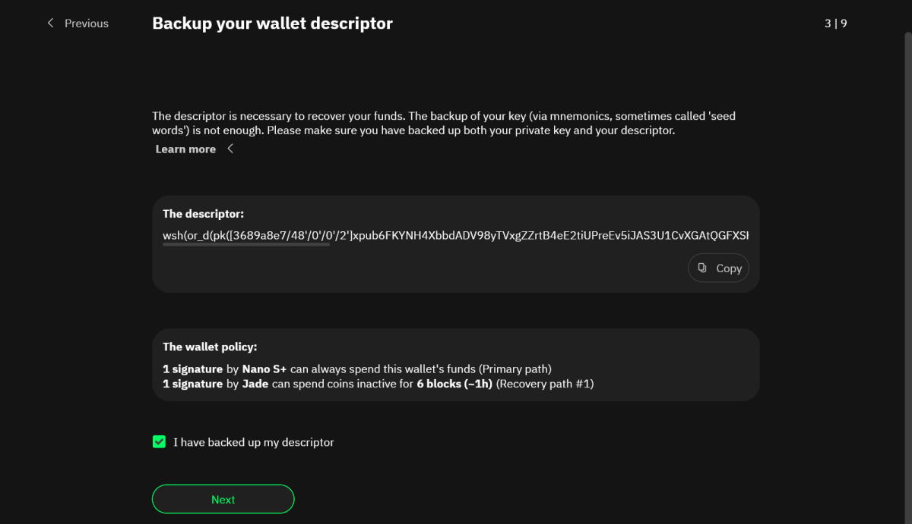

Deskriptor kami (yang dianalisis di akhir tutorial) adalah sebagai berikut:

```plaintext
wsh(or_d(pk([3689a8e7/48'/0'/0'/2']xpub6FKYNH4XbbdADV98yTVxgZZrtB4eE2tiUPreEv5iJAS3U1CvXGAtQGFXSHyFYdYNn9wNa9KU1pwfYoxQhwq4sPXGihD725VncdSy66v9WQa/<0;1>/*),and_v(v:pkh([42e629dd/48'/0'/0'/2']xpub6DpQGv9LkwAQXvghWASvsfA7t1BVj7bGDQ939v32iB6aUJsMRB6inckim26gRp74NBdS2zuyfHNXDZ9dTuNXkFFiz6QvwEeVvBuC2cnRWQd/<0;1>/*),older(6))))#8alrve5h
```

Langkah terakhir dalam konfigurasi awal dompet adalah memverifikasi deskriptor di setiap dompet perangkat keras yang dipakai sebagai perangkat penandatangan.

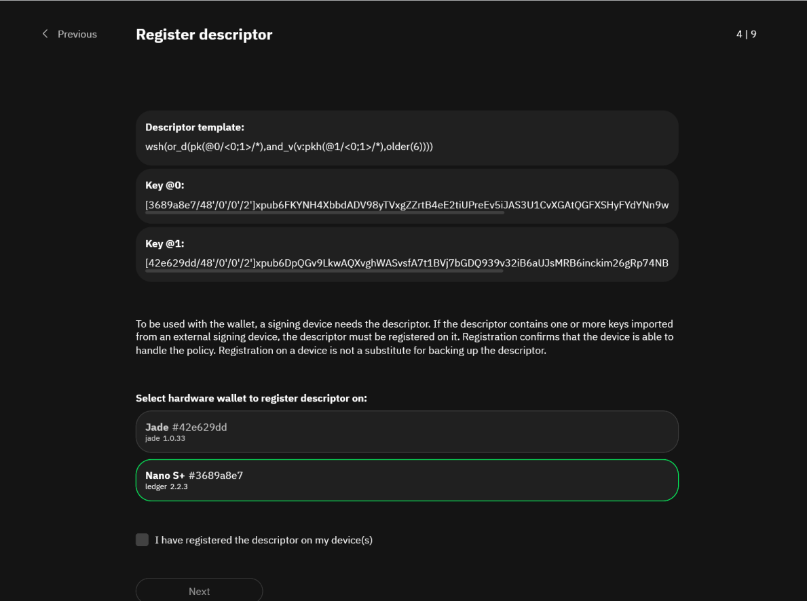

Lakukan hal yang sama pada setiap perangkat penandatangan. Kamu perlu memeriksa dan memastikan bahwa deskriptor sudah ditambahkan ke masing-masing dompet perangkat keras.

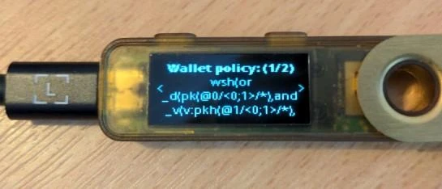

Informasi dompetmu sudah tersimpan, dan sekarang tinggal mengatur bagaimana kamu ingin terhubung ke jaringan Bitcoin. Kamu bisa memilih untuk menggunakan node sendiri (lokal maupun jarak jauh), atau memakai infrastruktur dari WizardSardine.

Kalau memilih opsi kedua, kamu harus menautkan alamat email ke dompetmu agar bisa mengambil deskriptor. Namun, perlu diingat bahwa WizardSardine akan punya akses ke semua transaksimu. Karena itu, opsi pertama, yaitu menggunakan node sendiri lebih disarankan.

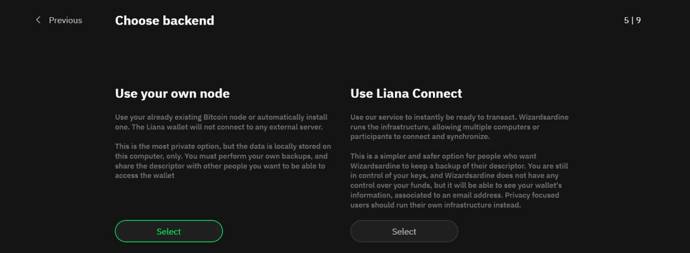

Kami memilih menggunakan node sendiri. Kamu bisa pakai node yang sudah ada atau memasang pruned node di komputermu. Kalau tidak punya akses ke node lain, kamu bisa instal node sendiri di mesinmu, meski prosesnya bisa memakan waktu beberapa hari

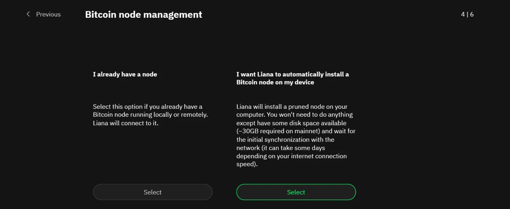

Untuk tutorial ini, kita menggunakan server Electrum publik yang sudah tersedia. Tapi hati-hati—server ini bisa melihat semua aktivitasmu dengan dompet Liana. Jadi, kalau kamu ingin menjaga privasi, sebaiknya gunakan node milikmu sendiri.

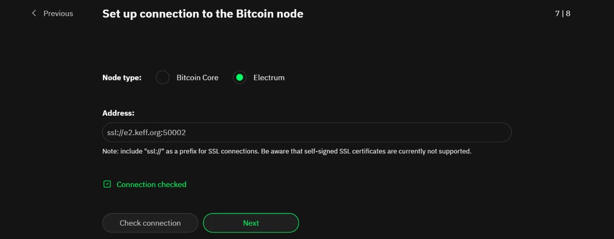

Setelah konfigurasi node selesai, layar utama akan terbuka dan menampilkan dompet Liana yang baru saja kamu buat.

Gunakan kesempatan ini untuk menyimpan unit pemulihan di tempat yang aman. Unit ini sebaiknya disimpan di lokasi yang strategis, supaya bisa ditemukan oleh ahli warismu jika kamu meninggal dunia.

Untuk keamanan ekstra, kamu bisa menaruh komponen pemulihan dalam kantong tertutup (tamper-evident bag) dan mencatat nomor serinya di tempat terpisah. Dengan begitu, kamu bisa memastikan tidak ada orang lain yang mengaksesnya, sekaligus menjaga perangkatmu tetap valid.

Dalam contoh kami, kami telah menyusun elemen-elemen berikut ini:


- Blockstream Jade sebagai perangkat khas untuk perkebunan;
- Kabel USB untuk menghubungkan dan mengisi ulang daya perangkat;
- Cadangan kertas dari kalimat jika terjadi kegagalan fungsi atau kerusakan pada perangkat (perhatikan bahwa medianya juga dapat berupa logam, dan oleh karena itu terlindung dari elemen, seperti halnya dengan kapsul Cryptosteel, misalnya);
- Kunci USB yang berisi deskriptor portofolio ;
- Cadangan kertas deskriptor, jika terjadi kegagalan fungsi atau kerusakan pada kunci USB (cadangan ini belum difoto di sini);
- Surat suksesi yang menjelaskan langkah-langkah yang harus diambil untuk memulihkan dana.

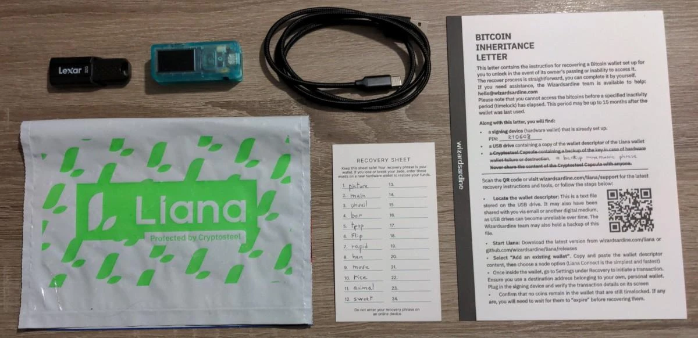

Dan kami menempatkan barang-barang ini di bawah segel!

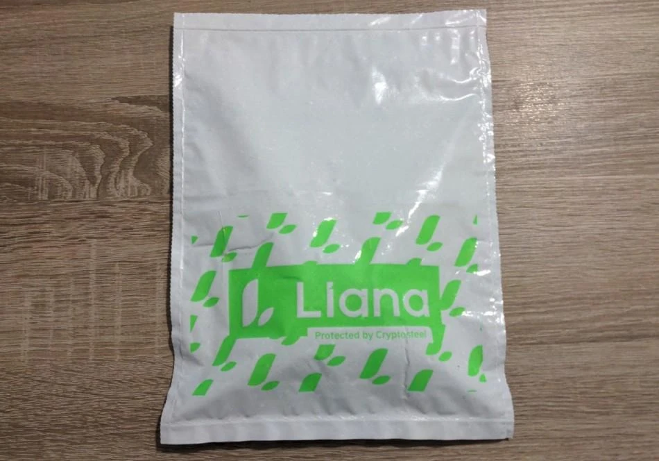

## Penerimaan dana

Layar utama Liana menampilkan saldo dan riwayat transaksi (baik yang sudah lewat maupun yang sedang berlangsung) dari dompetmu. Dalam contoh ini, saldonya masih nol dan itu wajar.

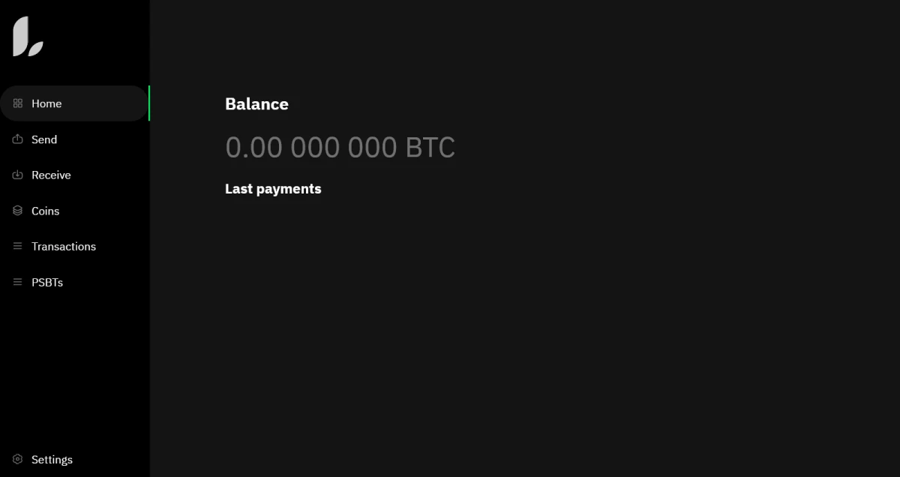

Untuk menerima dana, buka tab "*Terima*" dan klik "*Buat alamat*". Alamat baru akan muncul di layar. Alamat ini lebih panjang dari alamat portofolio konvensional: alamat ini adalah alamat yang terhubung dengan kontrak yang berdiri sendiri (P2WSH atau Taproot).

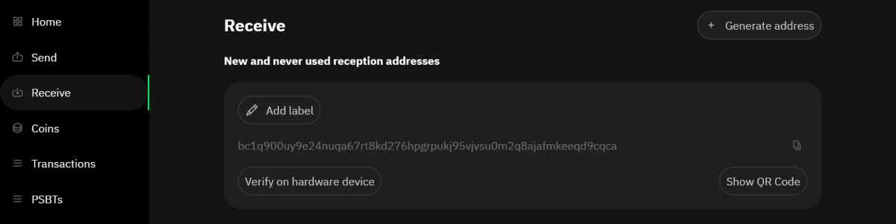

Kamu perlu memverifikasi alamat ini pada portofolio perangkat keras milikmu dengan mengeklik "*Verifikasi pada perangkat keras*".

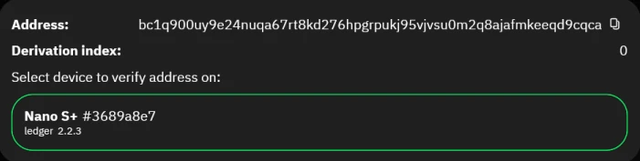

Setelah dana terkirim, transaksi akan muncul di layar utama dengan status belum terkonfirmasi, lalu berubah menjadi terkonfirmasi. Dalam contoh ini, kita mengirim 50.000 satoshi (sekitar lebih dari $50 saat transfer) untuk keperluan uji coba. Tentu saja, jumlah yang kamu kirim sebaiknya lebih besar dari ini karena adanya biaya transaksi.

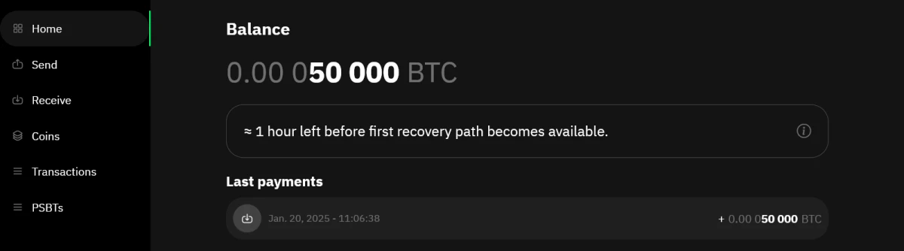

Kamu bisa memeriksa status kedaluwarsa dana dengan membuka tab “Coins”. Tab ini menampilkan semua koin (UTXO) yang ada di dompetmu. Di sini terlihat bahwa koin 50.000 satoshi hasil transaksi tadi akan kedaluwarsa di hari yang sama, dalam waktu sekitar satu jam.

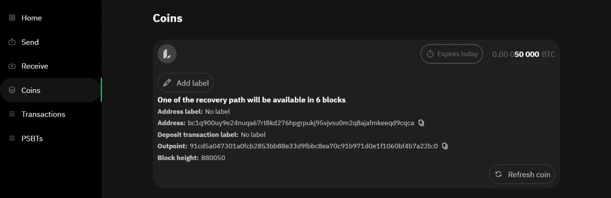

Untuk lebih memahami model representasi UTXO yang digunakan dalam Bitcoin, kamu bisa membaca bagian pertama dari kursus tentang kerahasiaan dalam Bitcoin yang ditulis oleh Loïc Morel :

https://planb.network/courses/65c138b0-4161-4958-bbe3-c12916bc959c

## Pengeluaran saat ini

Pengeluaran normal adalah cara utama menggunakan Liana. Mengirim bitcoin dengan kunci utama bekerja sama seperti di dompet Bitcoin klasik, misalnya Electrum atau Sparrow.

Untuk melakukan pembayaran, buka tab “Kirim” lalu isi detail penting: alamat BTC penerima, jumlah yang akan dikirim, dan tarif biaya yang kamu pilih. Kamu juga bisa menambahkan deskripsi (tersimpan secara lokal) untuk kenyamanan. Dalam contoh ini, kita mengirim 10.000 satoshi ke Bob, dengan tarif 4 sat/vB (sekitar $0,67 saat transaksi).

Liana juga menyediakan fitur kontrol koin, yang memungkinkanmu memilih UTXO mana yang ingin dipakai. Di sini, kita memilih koin 50.000 satoshi yang sudah dibuat sebelumnya.

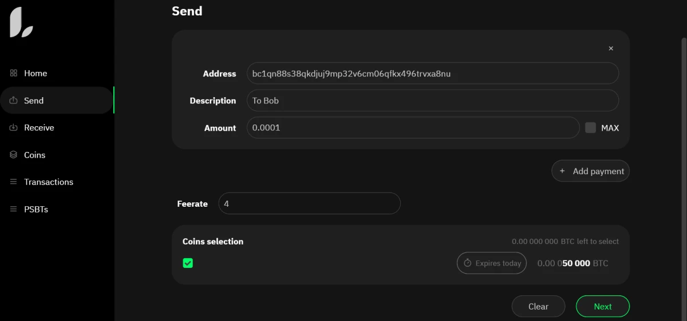

Setelah itu, tandatangani transaksi menggunakan perangkat penandatangan yang terhubung dengan kunci utama dengan klik “Tanda Tangan”. Kamu perlu memverifikasi dan mengonfirmasi detail transaksi di dompet perangkat kerasmu. Dalam contoh ini, kita memakai Nano S Plus untuk menandatangani transaksi.

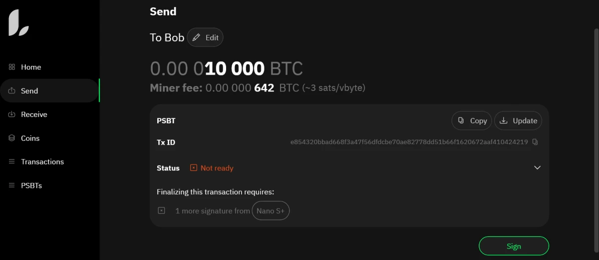

Terakhir, siarkan transaksi ke jaringan dengan klik “Broadcast”. Perlu diingat, setiap kali kamu mengirim dana, waktu pemulihan untuk koin yang dipakai akan diatur ulang.

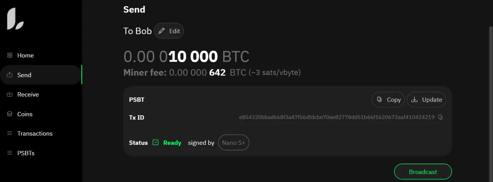

Transaksi akan muncul di layar utama dan saldo akan diperbarui.

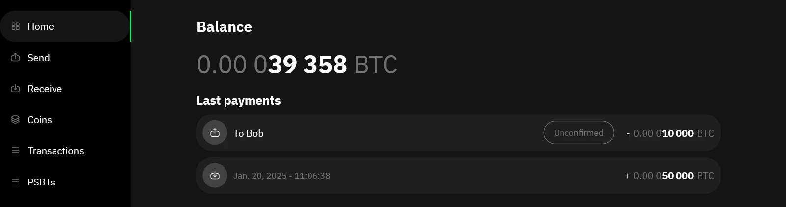

## Pembaruan portofolio

Seperti sudah dijelaskan sebelumnya, dompet Liana mengharuskan kamu memperbarui dana secara rutin dengan membuat transaksi di blockchain. Kalau tidak dilakukan, dana bisa dipulihkan oleh ahli warismu (atau oleh perangkat kedua dalam skenario cadangan dengan timelock). Situasi ini sebenarnya tidak berbahaya, tapi bisa menggagalkan tujuan utama mekanisme ini: agar kamu tetap memegang kendali penuh atas bitcoin tanpa pihak ketiga yang tepercaya, sekaligus tetap punya jaring pengaman.

Sebelum dana (atau sebagian dari dana) kedaluwarsa dan bisa dipakai oleh kunci pemulihan, sistem akan menampilkan peringatan. Peringatan ini menunjukkan bahwa jalur pemulihan kamu akan segera aktif. Karena di contoh ini kita hanya menetapkan waktu pemulihan singkat (satu jam), pesan tersebut langsung muncul.

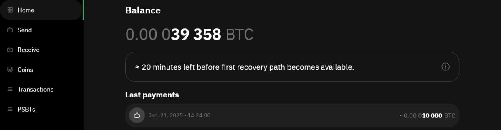

Ketika tenggat waktu mendekati, sebuah tombol akan muncul dan memintamu untuk memperbarui dana yang bersangkutan.

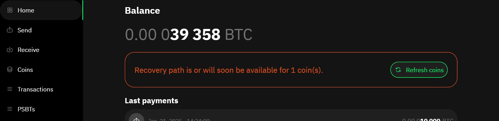

Untuk memperbarui koinmu, buka tab “Koin” lalu klik “Refresh koin” pada koin yang ingin diperbarui. Kalau kamu punya beberapa koin, masing-masing harus diperbarui satu per satu, dengan jeda waktu yang relatif singkat demi menjaga privasi.

Untuk menghemat biaya, kamu bisa mengonsolidasikan semua dana dengan mengirim seluruh saldo dompet ke alamat baru. Tapi perlu diingat, cara ini akan mengurangi tingkat privasimu.

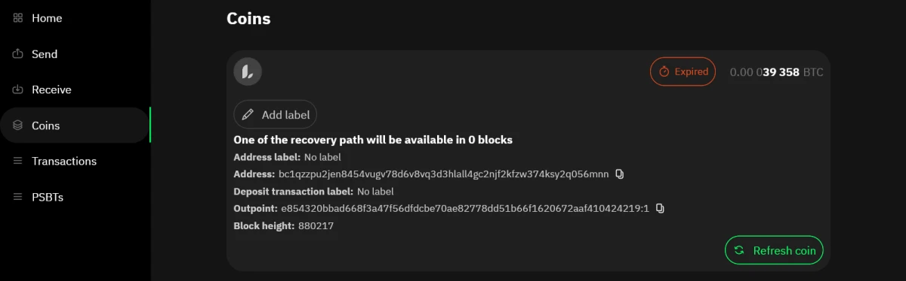

Tentukan tarif biaya yang kamu inginkan untuk transaksi ini. Karena ini hanya transfer ke dirimu sendiri, kamu bisa menetapkan biaya yang cukup rendah—terutama kalau dilakukan beberapa hari sebelum masa berlaku koin habis.

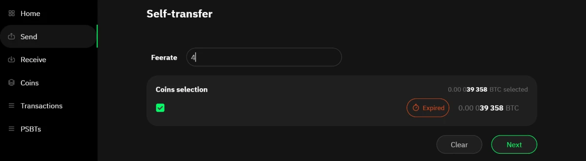

Transaksi (berlabel "*transfer mandiri*") hanya akan terlihat di tab "*Transaksi*".

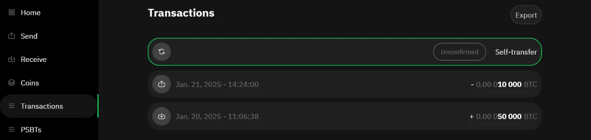

Setelah dikonfirmasi, koin  aman! Kamu bisa tenang sampai tanggal kedaluwarsa berikutnya.

## Pemulihan Bitcoin

Saat memulihkan dana dari dompet Liana, ada dua kemungkinan situasi. Pertama, kamu masih punya akses ke komputer tempat perangkat lunak terpasang. Dalam kasus ini, cukup buka aplikasinya (ini biasanya terjadi pada model cadangan dengan timelock). Namun, bisa juga kamu tidak punya akses ke komputer tersebut. Kalau begitu, prosesnya dimulai dari awal. Perlu dicatat, prosedur pemulihannya sama pada kedua situasi ini.

Untuk memulai, unduh Liana dari [situs web resmi Wizardsardine] (https://wizardsardine.com/liana/), atau dari [repositori GitHub] (https://github.com/wizardsardine/liana/releases), di mana kamu dapat memeriksa keaslian perangkat lunak. Instal perangkat lunak dan jalankan. Versi yang digunakan dalam kasus kami adalah 0.9, jadi tampilannya mungkin sudah berubah. Pada layar selamat datang, pilih opsi "Tambahkan dompet Liana yang sudah ada".

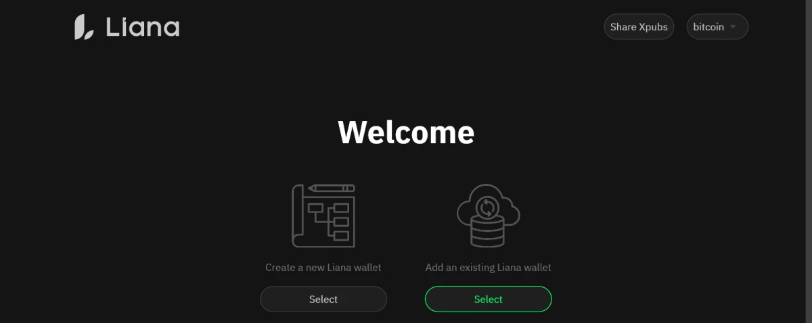

Atur bagaimana kamu ingin terhubung ke jaringan. Kamu bisa menggunakan node sendiri (lokal atau jarak jauh), atau memakai infrastruktur WizardSardine. Kalau memilih opsi kedua, kamu perlu alamat email yang dipakai saat dompet dibuat agar dana bisa ditemukan otomatis. Kalau tidak punya informasi itu, pilih opsi pertama.

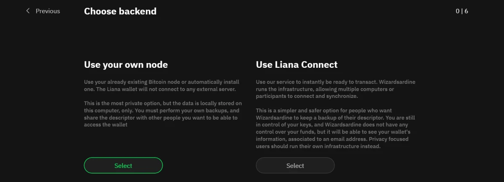

Kalau kamu menggunakan node sendiri, impor deskriptor dompet. Deskriptor ini adalah deskripsi teknis akun yang memungkinkanmu menemukan dan mengambil dana yang tersimpan di dalamnya. Dalam contoh ini, informasinya adalah sebagai berikut:

```plaintext
wsh(or_d(pk([3689a8e7/48'/0'/0'/2']xpub6FKYNH4XbbdADV98yTVxgZZrtB4eE2tiUPreEv5iJAS3U1CvXGAtQGFXSHyFYdYNn9wNa9KU1pwfYoxQhwq4sPXGihD725VncdSy66v9WQa/<0;1>/*),and_v(v:pkh([42e629dd/48'/0'/0'/2']xpub6DpQGv9LkwAQXvghWASvsfA7t1BVj7bGDQ939v32iB6aUJsMRB6inckim26gRp74NBdS2zuyfHNXDZ9dTuNXkFFiz6QvwEeVvBuC2cnRWQd/<0;1>/*),older(6))))#8alrve5h
```

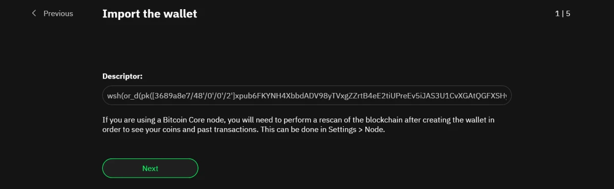

Liana kemudian akan meminta kamu memasukkan seedphrase. Kalau kamu masih punya perangkat penandatangan (dompet perangkat keras) yang berfungsi, bagian ini bisa dilewati. Tapi jika perangkatmu hilang atau rusak, kamu tetap bisa memakai opsi ini selama punya 12 atau 24 kata seedphrase. Meski begitu, kalau jumlah yang dipulihkan cukup besar, sebaiknya kamu membeli dompet perangkat keras baru dan gunakan seedphrase untuk memulihkan kunci di dalamnya.

Dalam kasus kami, kami menggunakan dompet perangkat keras Blockstream Jade sebagai perangkat pemulihan dan memilih untuk melewatkan ("*Skip*") langkah ini.

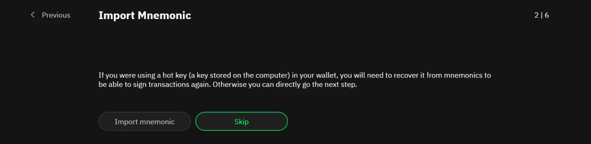

Periksa lalu simpan deskriptor ke perangkat penandatangan dengan memilihnya di layar. Kalau dompet perangkat kerasmu tidak muncul, pastikan perangkat sudah terhubung dan tidak terkunci. Setelah itu, cek dan konfirmasi bahwa informasi ini berhasil ditambahkan ke perangkatmu.

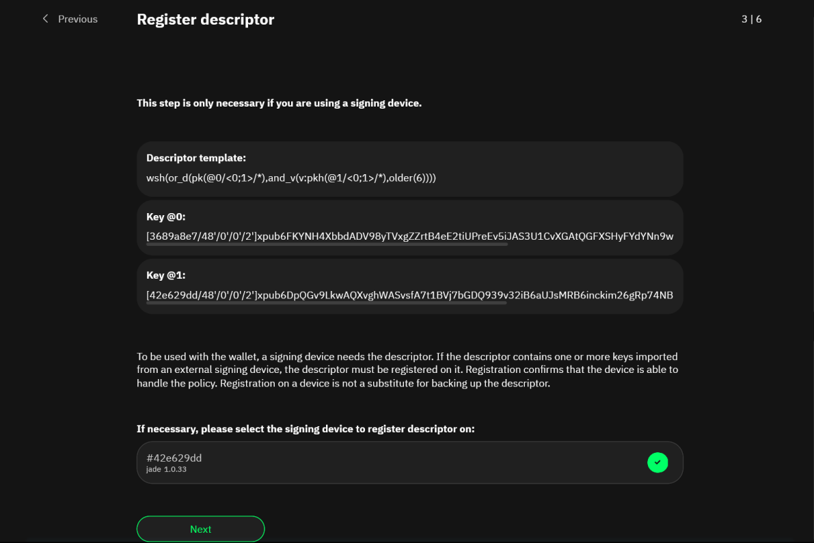

Atur node kamu. Kamu bisa pakai node yang sudah ada atau instal *pruned node* di perangkat kamu. Dalam kasus kami, kami pakai node yang sudah ada.

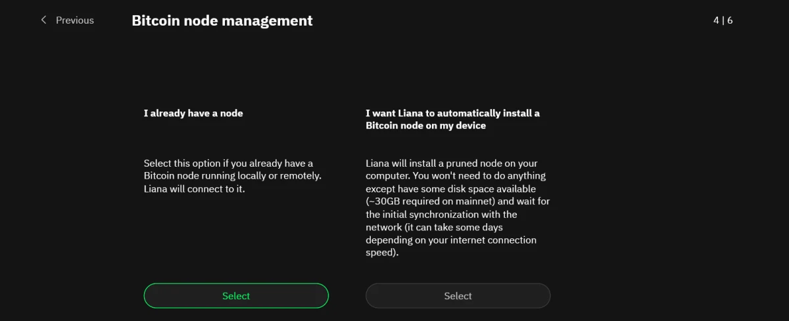

Untuk tutorial ini, kami pakai server Electrum publik. Tapi perlu diingat, server ini bisa melihat semua aktivitas kamu dengan dompet Liana. Kalau kamu ingin menjaga privasi, sebaiknya pakai node kamu sendiri.


Setelah kamu menyiapkan node, kamu akan masuk ke layar utama dompet. Di sana kamu bisa lihat saldo dan riwayat transaksi yang terhubung ke akun itu. Kamu juga bisa cek apakah dananya bisa diambil. Di sini, kita lihat kalau koinnya bisa diambil.

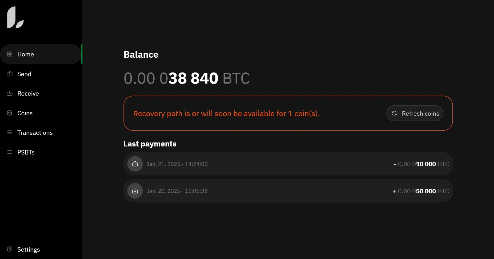

Untuk memulihkan dana di dompet kamu, buka menu Pengaturan di bagian kiri bawah, lalu klik Pemulihan.

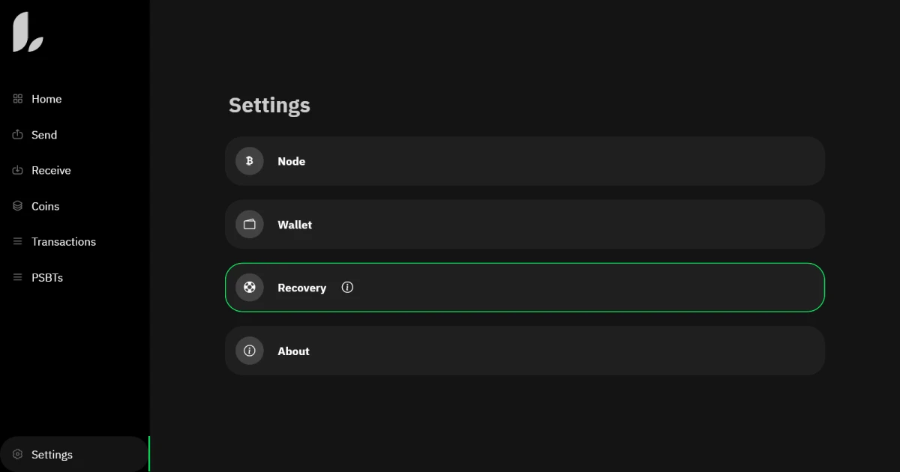

Keluarkan koin ke dompet dengan mencentang kotak yang sesuai. Masukkan alamat BTC tujuan tempat kamu mau kirim dana, lalu tentukan tarif biaya transaksinya. Setelah itu, klik Selanjutnya.

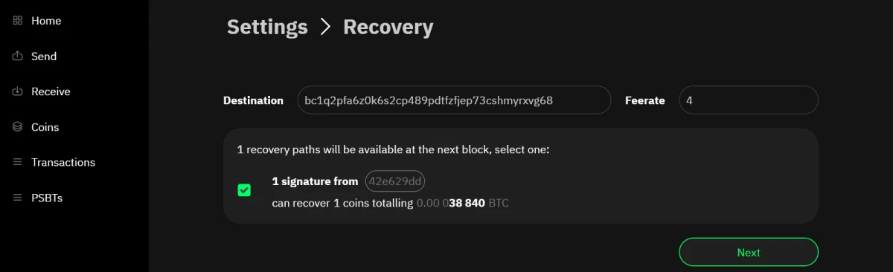

Tandatangani transaksi dengan klik Tanda tangani, lalu konfirmasi transaksinya di dompet perangkat keras kamu.

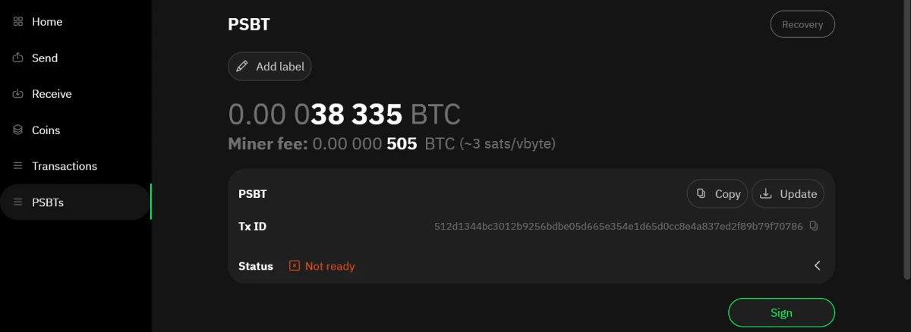

Setelah itu, kirim transaksinya ke jaringan dengan klik Broadcast.

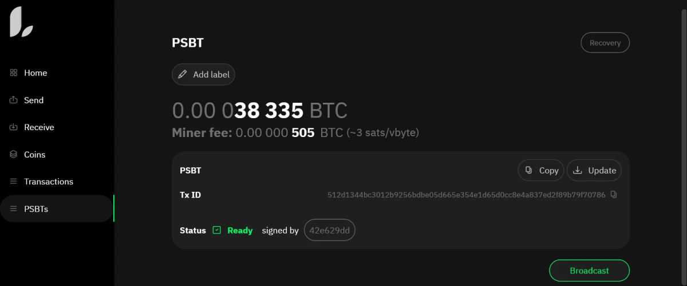

Transaksi akan muncul di layar utama. Setelah dikonfirmasi, proses pemulihan pun selesai!

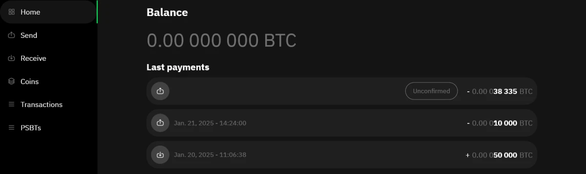

## Bonus: analisis deskriptor

Deskriptor adalah rangkaian teks yang bisa dibaca manusia dan berisi penjelasan lengkap tentang satu set alamat. Deskriptor ini memuat berbagai informasi penting untuk mengambil bagian-bagian (UTXO) dari dompet tingkat lanjut. Cara penulisan deskriptor didasarkan pada [Miniscript syntax] (https://bitbox.swiss/blog/understanding-bitcoin-miniscript-part-2/), bahasa skrip yang dikembangkan oleh Andrew Poelstra, Pieter Wuille, dan Sanket Kanjalkar pada tahun 2019.

Untuk lebih memahami mengapa string karakter ini penting, mari kita analisis deskriptor dalam contoh kita, yaitu :

```plaintext
wsh(or_d(pk([3689a8e7/48'/0'/0'/2']xpub6FKYNH4XbbdADV98yTVxgZZrtB4eE2tiUPreEv5iJAS3U1CvXGAtQGFXSHyFYdYNn9wNa9KU1pwfYoxQhwq4sPXGihD725VncdSy66v9WQa/<0;1>/*),and_v(v:pkh([42e629dd/48'/0'/0'/2']xpub6DpQGv9LkwAQXvghWASvsfA7t1BVj7bGDQ939v32iB6aUJsMRB6inckim26gRp74NBdS2zuyfHNXDZ9dTuNXkFFiz6QvwEeVvBuC2cnRWQd/<0;1>/*),older(6))))#8alrve5h
```

Informasi berikut ini dapat diekstrak dari deskriptor ini:


- `wsh` (kependekan dari *witness script hash*): Ini adalah jenis keluaran transaksional yang dibuat. Jika kita memilih untuk menggunakan Taproot, pengenalnya adalah `tr`.
- `atau_d`: Ini adalah operator logika yang menunjukkan bahwa *salah satu dari dua* kondisi berikut ini harus dipenuhi agar pengeluaran dapat diterima (`_d` menunjukkan sintaks tertentu).
- `pk` (kependekan dari *public key*): Operator ini memeriksa tanda tangan yang diberikan terhadap kunci publik berikut, dan memberikan jawaban sebagai Boolean (TRUE atau FALSE).
- `[3689a8e7/48'/0'/0'/2']`: Elemen ini termasuk *sidik jari* dari kunci utama untuk dompet perangkat keras utama (dalam hal ini Nano S Plus), dan jalur turunan ke kunci pribadi yang diperluas yang ditautkan (yang darinya semua kunci pribadi lainnya diturunkan).
- `xpub6FKY ... WQa`: Ini adalah kunci publik yang diperluas yang ditautkan ke portofolio perangkat keras utama (di sini Nano S Plus)
- `/<0;1>/*`: Ini adalah jalur derivasi untuk mendapatkan kunci dan alamat sederhana: `0` untuk penerimaan, `1` untuk operasi internal (*change*), dengan "wildcard" (`*`) yang memungkinkan derivasi berurutan dari beberapa alamat dengan cara yang dapat dikonfigurasi, mirip dengan manajemen "gap limit" pada perangkat lunak portofolio klasik.
- dan_v`: Ini adalah operator logika yang mengindikasikan bahwa *dua kondisi berikut* harus dipenuhi agar pengeluaran dapat diterima (`_v` mengindikasikan sintaks tertentu).
- `v:pkh` (kependekan dari *verifikasi: hash kunci publik*): Operator ini memverifikasi tanda tangan dan kunci publik yang diberikan terhadap hash kunci publik (*hash*) yang mengikutinya. Pada dasarnya, ini adalah pemeriksaan yang sama dengan skrip P2PKH dan P2WPKH.
- `[42e629dd/48'/0'/0'/2']`: Ini adalah elemen yang sama seperti di atas (terdiri dari jejak dan jalur turunan), kecuali bahwa jejak kunci utama portofolio pemulihan perangkat keras (dalam hal ini Jade) diindikasikan.
- `xpub6DpQ ... WQd`: Ini adalah kunci publik yang diperluas yang terhubung ke dompet pemulihan perangkat keras (di sini adalah Jade).
- `older(6)` : Operator ini memeriksa bahwa output transaksi yang dibuat harus memiliki usia yang benar-benar lebih besar dari 6 blok agar dapat digunakan.

Item data terakhir (`8alrve5h`) adalah checksum deskriptor, dan berhubungan dengan pengenal portofolio.

Skrip yang dibuat oleh portofolio ini akan berbentuk sebagai berikut:

```plaintext
<primary_key> CHECKSIG IFDUP NOTIF DUP HASH160 <recovery_key_hash> EQUALVERIFY CHECKSIGVERIFY <locktime> CHECKSEQUENCEVERIFY ENDIF
```

Karena keamanan dompet Bitcoin kamu juga bergantung pada seberapa baik kamu memahami cara kerjanya, aku sarankan kamu pelajari lebih dalam tentang mekanisme dompet deterministik dan hierarkis lewat kursus gratis di Plan ₿ Network:

https://planb.network/courses/46b0ced2-9028-4a61-8fbc-3b005ee8d70f
