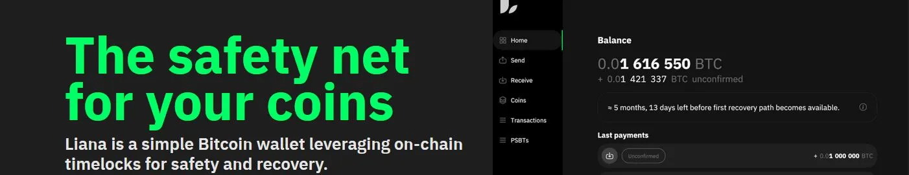

Là lưới an toàn cho các đồng tiền của bạn, Liana là một ví Bitcoin đơn giản sử dụng khóa thời gian trên chuỗi để đảm bảo an ninh và khả năng phục hồi.

- Không cần bên thứ ba đáng tin cậy, bạn có toàn quyền kiểm soát
- Các phương thức phục hồi trong trường hợp mất khóa
- Tích hợp sẵn tính năng thừa kế

Tất cả thông tin: [https://wizardsardine.com/liana/](https://wizardsardine.com/liana/)

## Video Hướng Dẫn

Link để tải Liana: [https://github.com/wizardsardine/liana/releases](https://github.com/wizardsardine/liana/releases)

