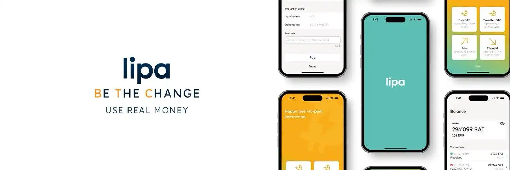

Dompet Bitcoin Lightning adalah aplikasi mobile yang memungkinkan transaksi instan dan berbiaya rendah di jaringan Lightning Bitcoin. Tidak seperti transaksi di blockchain utama (on-chain), pembayaran Lightning hampir seketika dan hanya membutuhkan biaya minimal, sehingga sangat pas untuk pembayaran kecil sehari-hari.

Dompet Lightning, seperti semua dompet ponsel, dianggap sebagai dompet "panas" karena terhubung ke Internet. Karena itu, dompet ini paling cocok untuk mengelola sejumlah kecil uang untuk pengeluaran sehari-hari. Untuk jumlah lebih besar, lebih aman pakai solusi penyimpanan seperti dompet perangkat keras.

Kalau kamu mau belajar lebih dalam soal jaringan Lightning dan cara kerjanya secara teknis, aku sarankan ikut kursus ini:

https://planb.academy/courses/34bd43ef-6683-4a5c-b239-7cb1e40a4aeb

Di tutorial ini, kita akan mengenal **Lipa**, dompet Lightning yang sederhana dan efektif, dikembangkan di Swiss.

## Memperkenalkan Lipa

Lipa adalah dompet Lightning non-kustodian yang menonjol karena kemudahan penggunaan dan antarmuka yang rapi. Dikembangkan oleh tim Swiss, Lipa menekankan kerahasiaan dan kenyamanan bagi pemula.

Fitur utamanya meliputi:

- Antarmuka pengguna yang intuitif
- Manajemen saluran Lightning Otonom
- Dukungan protokol LNURL
- Kemungkinan membeli bitcoin langsung di dalam aplikasi

## Menginstalasi dan mengonfigurasi Lipa

Langkah pertama adalah mengunduh aplikasi Lipa. Untuk saat ini, aplikasi ini hanya tersedia di iOS:

- [Untuk Apple](https://apps.apple.com/app/lipa-bitcoin-lightning/id1602180066)

Versi Android saat ini sedang dikembangkan dan akan segera tersedia.

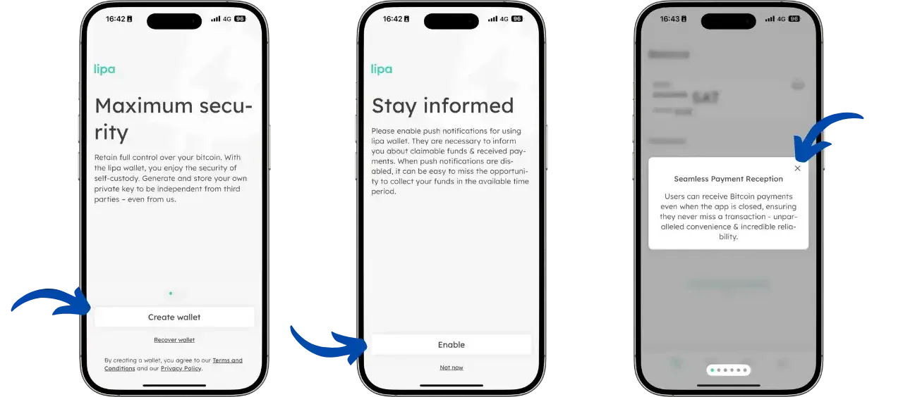

Setelah kamu meluncurkan aplikasi, kamu akan sampai di layar beranda, yang menawarkan dua opsi:

- Membuat portofolio baru
- Memulihkan portofolio yang sudah ada dari cadangan

Setelah memilih opsi, aplikasi akan meminta kamu untuk mengaktifkan pemberitahuan. Langkah ini penting, karena notifikasi dibutuhkan agar aplikasi bisa:

- Memberi peringatan ketika pembayaran diterima, bahkan saat aplikasi ditutup
- Memberikan informasi tentang langkah-langkah membeli bitcoin lewat solusi terintegrasi mereka

Aplikasi kemudian menampilkan fungsi utamanya melalui serangkaian layar pengantar:

- **Tanda terima pembayaran yang mulus**: Pengguna bisa menerima pembayaran Bitcoin bahkan saat aplikasi ditutup, menjamin keandalan dan kenyamanan.
- **Alamat Lightning non-kustodian**: Lipa kini mendukung alamat Lightning non-kustodian, meningkatkan privasi dan keamanan dengan memberi kontrol penuh pada pengguna atas bitcoin mereka.
- **Kontrol atas data analitik**: Dengan menekankan transparansi dan kerahasiaan, pengguna bisa melihat jenis data yang dikumpulkan dan menentukan preferensi berbagi.
- **Kirim melalui nomor telepon**: Tidak perlu alamat yang ribet - cukup pilih kontak, masukkan jumlah, dan kirim bitcoin langsung ke nomor telepon mereka.

Aplikasi ini juga terus mendapatkan peningkatan dalam stabilitas, keamanan, dan keandalan, untuk menjamin pengalaman pengguna yang optimal.

## Navigasi aplikasi

Antarmuka Lipa diatur di sekitar 4 tab utama yang dapat diakses melalui bilah navigasi di bagian bawah layar:

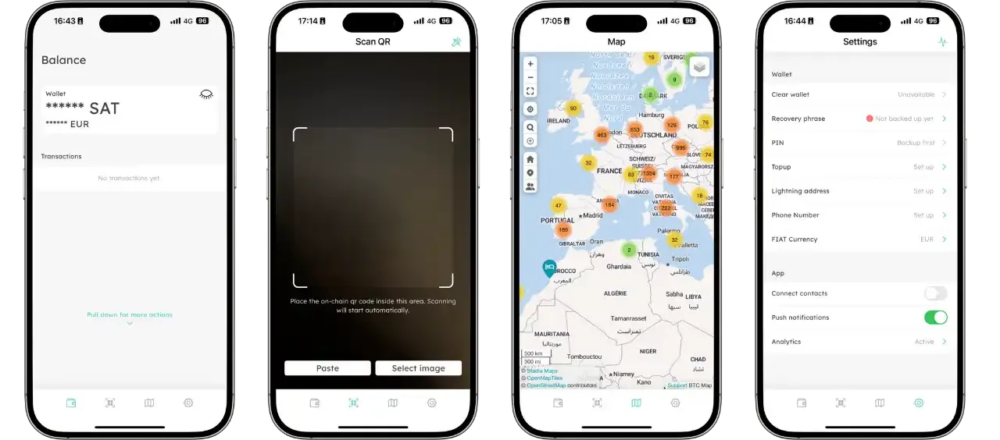

- **Beranda**: Menampilkan saldo dan riwayat transaksi kamu saat ini  
- **Pemindai**: Memungkinkan kamu memindai kode QR untuk melakukan pembayaran  
- **Peta**: Menampilkan peta interaktif bisnis yang menerima Bitcoin di sekitarmu  
- **Pengaturan**: Akses ke pengaturan aplikasi, pencadangan, dan preferensi

Menu tambahan dapat diakses dengan menarik layar beranda ke bawah:

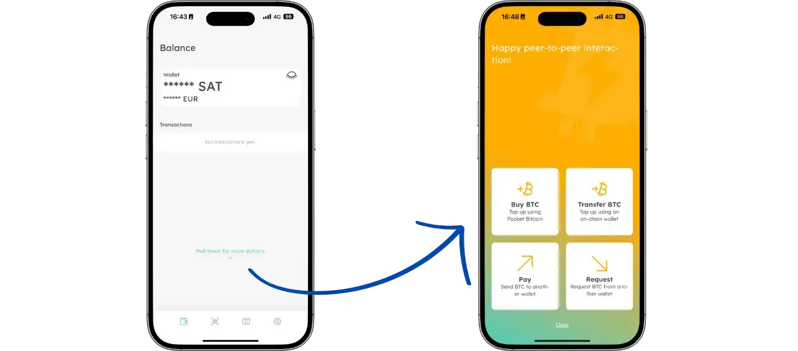

Isyarat ini menampilkan fungsi tambahan, seperti:

- Membeli bitcoin  
- Setoran bitcoin on-chain  
- Membuat faktur Lightning untuk menerima bitcoin  
- Membayar faktur Lightning  

## Simpan portofolio kamu

Untuk mencadangkan dompet, buka tab "Pengaturan" dan pilih "Frasa pemulihan". Lipa menggunakan frasa pemulihan yang sangat penting untuk ditulis dengan hati-hati pada media fisik (kertas, logam). Frasa ini adalah satu-satunya cara untuk memulihkan dana jika ponsel hilang atau dicuri. Untuk memvalidasi cadangan, aplikasi akan meminta kamu mengonfirmasi 3 kata acak dari frasa tersebut.

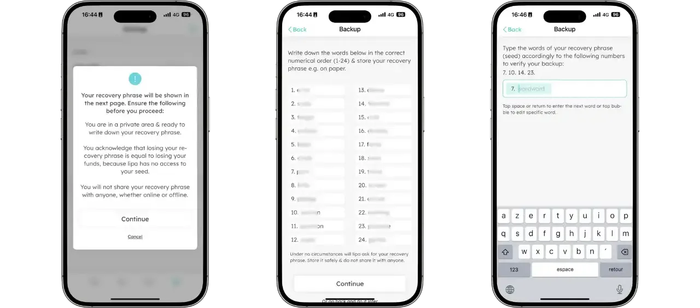

Untuk info lebih lanjut tentang cara mencadangkan dan mengelola frasa pemulihan dengan benar, aku sangat menyarankan ikut tutorial lainnya, terutama kalau kamu masih pemula:

https://planb.academy/tutorials/wallet/backup/backup-mnemonic-22c0ddfa-fb9f-4e3a-96f9-46e2a7954270

## Menerima bitcoin

Untuk menerima bitcoin, ada dua opsi. Kembali ke layar beranda dan tarik layar ke bawah, lalu pilih:

- Pilih "Transfer BTC" untuk menerima bitcoin secara on-chain. Cukup pindai kode QR dengan dompet lain kamu dan selesaikan transaksinya.  
- Pilih "Request" untuk menerima melalui jaringan Lightning, lalu masukkan jumlah yang ingin diterima.

Di kedua kasus, kamu harus membayar biaya sekitar 0,4% dari jumlah, atau sekitar 2.500 sat jika aplikasi perlu membuka saluran pembayaran baru (yang pasti terjadi pada pembayaran pertama).

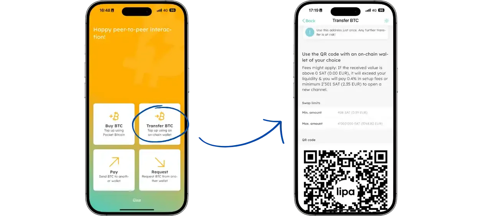

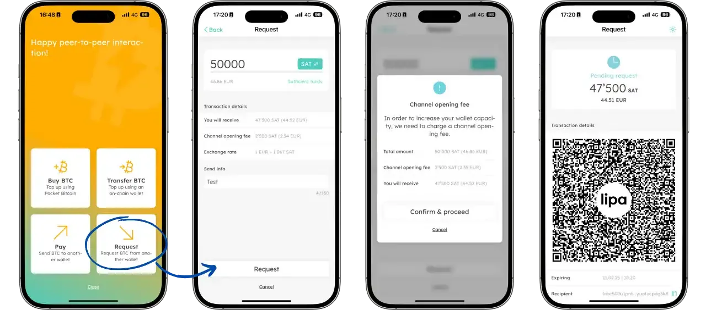

## Kirim bitcoin

Untuk mengirim bitcoin, buka layar beranda, tarik layar ke bawah dan pilih "Bayar". Kemudian cukup dengan :

- masukkan alamat LNURL kilat
- pindai kode QR kilat untuk melakukan pembayaran.

Kamu juga dapat membuka tab kedua di bagian bawah layar untuk memindai kode QR secara langsung.

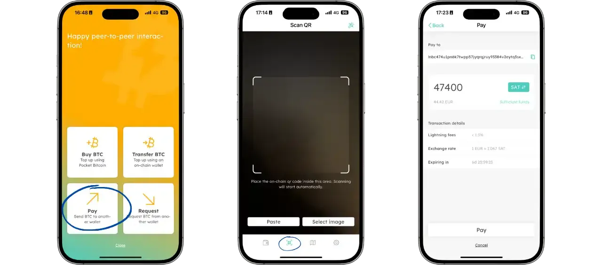

## Beli bitcoin

Lipa memungkinkan kamu membeli bitcoin langsung di dalam aplikasi dengan biaya 1,5%. Untuk membeli, buka layar beranda dan tarik ke bawah untuk menampilkan menu, lalu pilih "Beli BTC". Tiga layar pengantar akan membimbing kamu melalui proses pembelian.

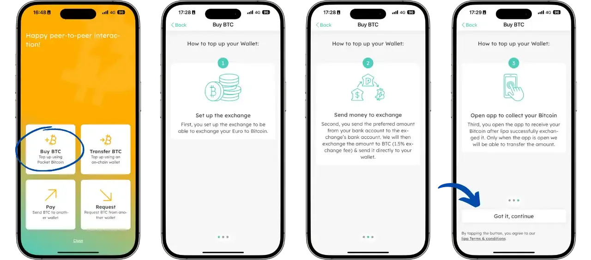

Lalu masukkan detail bank dari akun yang akan kamu gunakan untuk membeli. Pilih mata uang dan masukkan alamat email kamu.

Setelah layar pemuatan muncul, kamu akan melihat nomor referensi yang harus disertakan dalam transfer, beserta detail bank untuk penukaran.

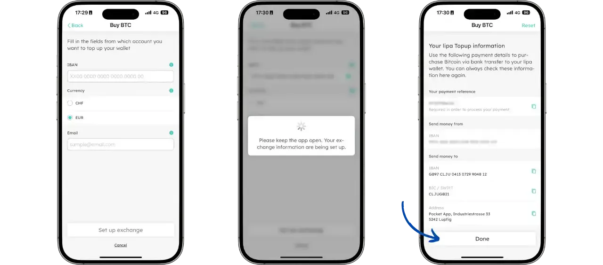

Yang perlu kamu lakukan adalah menggunakan bank kamu untuk mentransfer jumlah yang diinginkan, atur transfer dengan menyertakan RIB yang sudah diambil sebelumnya, dan cantumkan nomor referensi saat transaksi agar Lipa bisa mengaitkan pergerakan bank ini dengan dompet Lipa kamu.

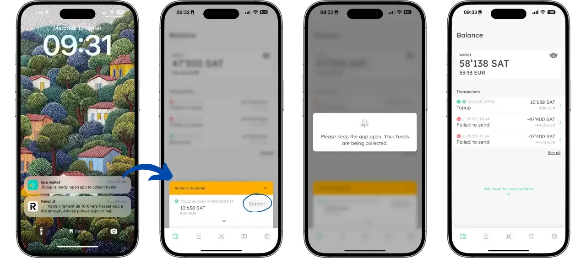

## Keuntungan dan kerugian

### Manfaat

- Antarmuka yang intuitif
- Biaya layanan yang benar
- Non kustodian
- Solusi pembelian bitcoin terintegrasi
- Integrasi BTCmap
- Dukungan NFC

### Kekurangan

- Tidak mungkin mengirim bitcoin secara berantai
- Pembayaran sedikit lebih lama dari rata-rata

Lipa adalah pilihan yang sangat baik untuk memulai dengan Lightning Network, terutama cocok untuk pengguna yang mencari solusi sederhana untuk pembayaran sehari-hari. Kemudahan penggunaan dan antarmuka yang rapi membuatnya menjadi dompet yang ideal untuk pemula, sekaligus menawarkan fitur-fitur penting untuk penggunaan Lightning sehari-hari.

## Sumber daya

- [Situs web resmi Lipa](https://lipa.swiss/)
- [Dukungan Lipa](https://getlipa.atlassian.net/servicedesk/customer/portal/1)
