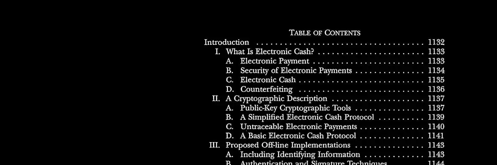

Macadamia Wallet 是一款 iOS 移动钱包，它实现了 Cashu 协议。Cashu 是 Chaum 发明的一种电子现金系统，支持完全匿名的比特币支付。由于采用了盲签名技术，任何观察者都无法将您的存款与您的支出关联起来，从而提供与实体现金类似的保密性。

在本教程中，我们将介绍如何安装和配置 Macadamia，执行您的第一笔 Cashu 交易（铸造、发送、接收、熔化），以及如何管理多个铸造点来保护您的资金安全。

## 什么是 Macadamia Wallet？

### Cashu 协议

Cashu 使用 David Chaum 发明的盲签名技术：您将比特币存入“铸造” 服务器，该服务器会发行等值的聪（satoshi）代币。铸造服务器在不查看代币内容的情况下对其进行签名，因此无法将代币与用户关联起来。交易在链下进行，采用点对点模式，并且完全不透明——即使是铸造服务器也无法追踪付款人。

Macadamia 是一款使用 Swift/SwiftUI 开发的开源 iOS 钱包。它无需注册或 KYC 即可使用，您的代币存储在本地，并受助记词保护。代码可在 GitHub 上审计，代币可与其他 Cashu 钱包（Minibits、Cashu.me）互操作。

### 托管模型与权衡

**重要提示**：Cashu 采用托管模型。代币是由铸造厂的比特币储备支持的支付承诺（欠条）。如果铸造厂倒闭，您的代币将失去价值。这是为了最大限度保护机密性而做出的妥协。

将 Macadamia 用作实体钱包：仅限小额交易。将您的资金分散到多个铸造厂以分散风险。

## 主要功能

Macadamia 实现了 Cashu 协议的四个基本操作。**铸造（Mint）** 通过闪电发票将您的聪转换为代币。 **发送（Send）** 功能允许您通过二维码或链接免费发送代币，完全链下操作。**接收（Receive）** 功能允许您接收代币或生成闪电发票。**销毁（Melt）** 功能通过销毁您的代币来支付闪电发票。

钱包支持同时管理多个币种。您可以通过闪电网络在不同的币种之间交换代币。

## 支持的平台

Macadamia 仅适用于 iOS 17 或更高版本的 iPhone 和 iPad。原生 Swift/SwiftUI 应用与 Apple 生态系统实现了最佳集成。

Cashu 协议保证了钱包之间的互操作性。您可以在其他应用中恢复助记词，例如 Android 上的 Minibits 或桌面上的 Nutstash。

当前版本通过 TestFlight 分发。请仅使用此测试版进行少量交易。

## 安装

Macadamia 目前可通过 Apple 的测试计划 TestFlight 获取。以下是安装方法：

### 通过 TestFlight 安装

**第一步：下载 TestFlight**

如果您的设备上还没有 TestFlight 应用，请在 App Store 中搜索 “TestFlight” 并安装。TestFlight 是苹果官方用于测试 iOS 应用 Beta 版本的应用程序。

**步骤 2：加入 Macadamia 测试计划**（法语）

安装 TestFlight 后，请在 iPhone 或 iPad 上使用此邀请链接：[https://testflight.apple.com/join/RMU6PaRu](https://testflight.apple.com/join/RMU6PaRu)

该链接将自动打开 TestFlight，并提示您安装 Macadamia Wallet。点击 “Accept”，然后点击 “Install” 即可开始下载。该应用大小约为 10 MB，安装只需几秒钟。

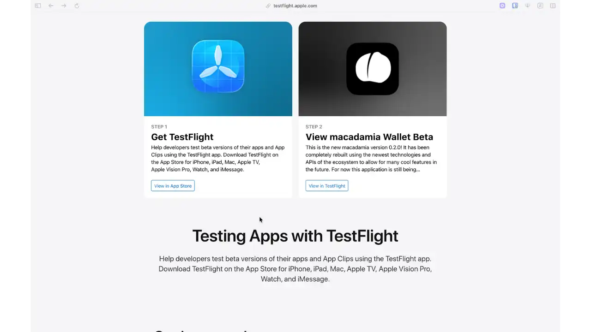

### 关于测试版的重要信息

Macadamia 目前仍处于积极开发阶段。TestFlight 版本会频繁更新，可能会引入新功能或修复错误。但是，与任何测试版一样，可能会出现故障。**我们强烈建议您仅使用少量资金**，并接受在出现技术问题时代币可能会丢失。

根据已显示的隐私政策，Macadamia 不会收集任何用户数据。安装时，请务必确认开发者为 cypherbase UG。

## 初始配置

首次启动时，Macadamia 会生成一个包含 12 个单词的 BIP-39 助记词。请将其记录在安全的地方，切勿截图保存。这些语句可用于重新创建您的钱包并使用您的代币。

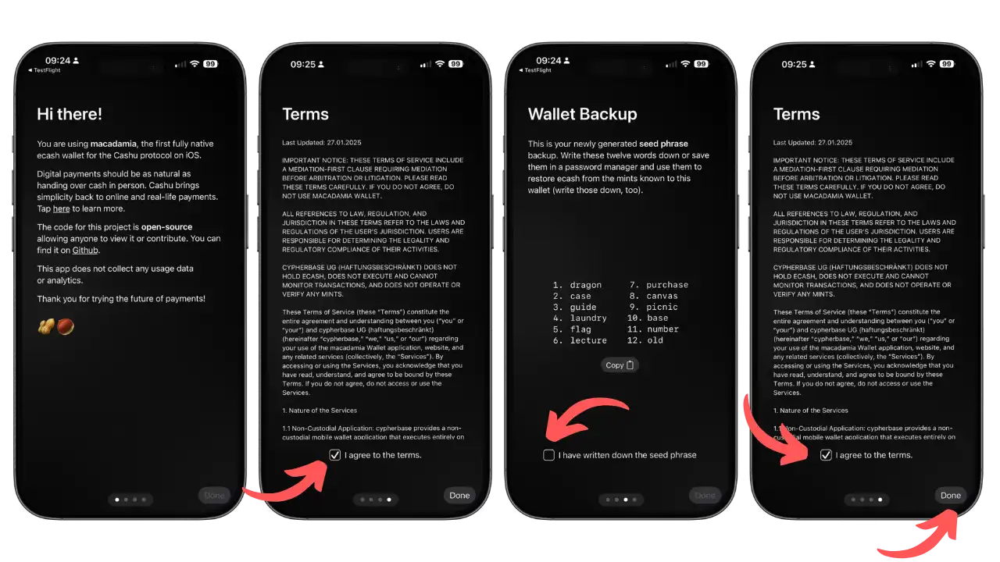

请按照以下四个步骤操作：欢迎、接受条款、保存助记词和最终确认。

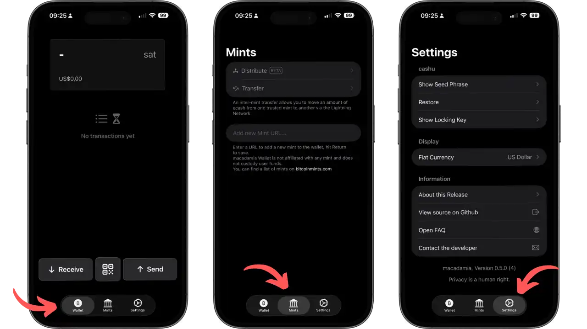

配置完成后，Macadamia 将显示三个主要标签页。**Wallet** 显示您的余额和交易记录。**Mints** 允许您管理您的 Cashu 服务器。**Settings** 提供设置和助记词的访问权限。

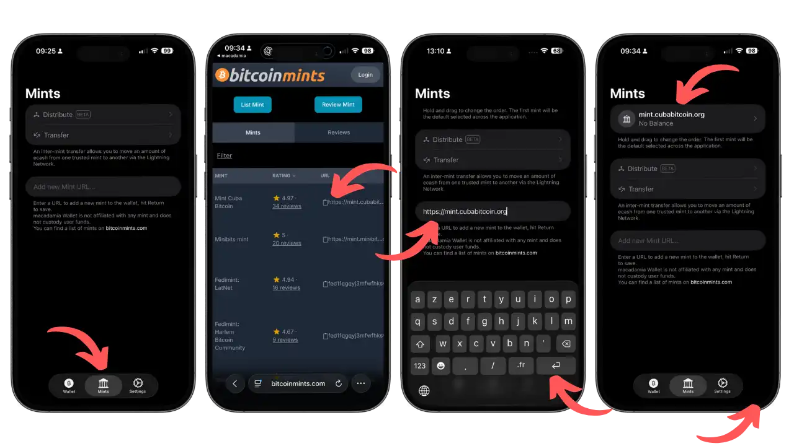

现在您需要配置一个铸币厂（mint），即一个将发行您的代币的 Cashu 服务器。前往 “Mints” 标签页，点击 “Add new Mint URL”，然后输入您选择的铸币厂的地址（例如 mint.cubabitcoin.org）。您可以访问 bitcoinmints.com 或 cashu.space 查找信誉良好的公共铸币厂。仅验证您已确认信誉的铸币厂，因为您的聪（satoshi）将由它们保管。

## 日常使用

### 创建新代币（Mint）

为了向您的 Macadamia 钱包充值 ecash，您需要执行 “铸造” 操作（创建代币）。点击 “Receive”，然后选择 “Lightning” 选项。输入所需金额（例如 1000 聪），选择要使用的铸造方式，然后生成闪电网络发票。

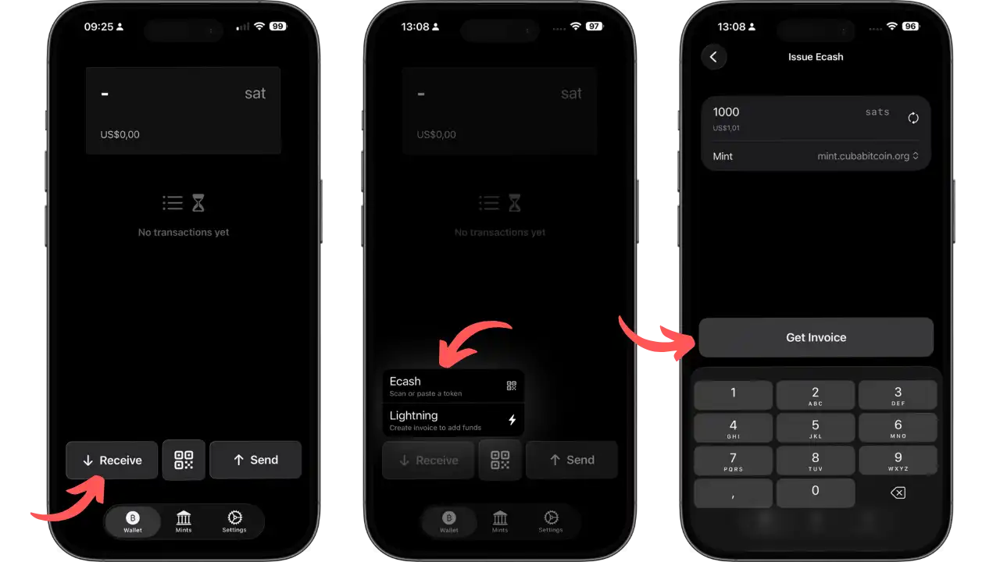

使用您常用的钱包（Phoenix、Zeus、BlueWallet）支付生成的闪电网络发票。

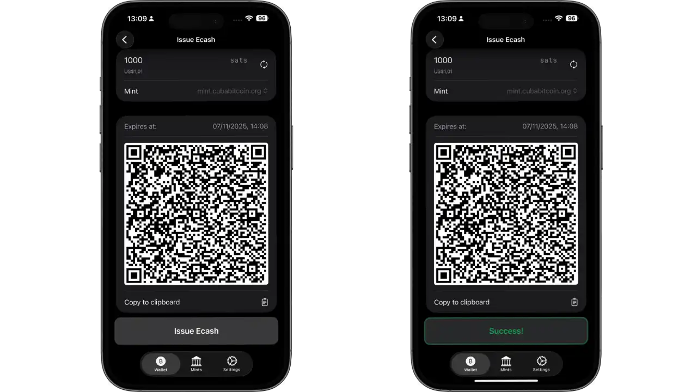

支付后，Cashu 代币将立即出现在您的余额中。

### 发送代币

为了向其他用户发送 Cashu 代币，请点击主屏幕上的 “Send” 按钮，然后选择 “Ecash”。输入要发送的金额（例如 50 聪），并根据需要添加描述性备注。

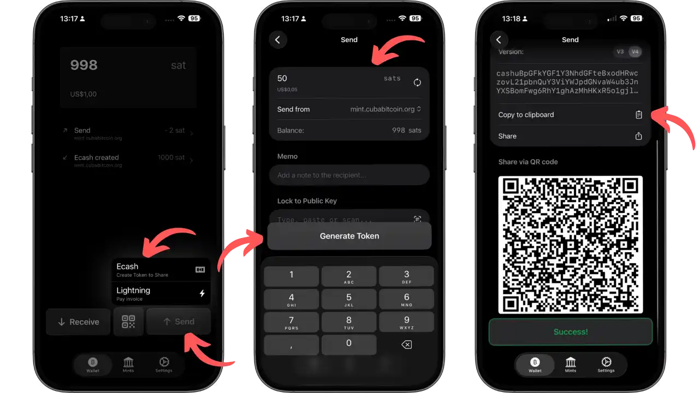

通过 iMessage、Signal 或 Telegram 分享二维码或生成的文本。接收者可立即免费领取资金。

### 接收代币

为了接收其他用户发送的 Cashu 代币，请触摸 "Receive"，然后选择 "Ecash"。扫描代币的二维码或粘贴您收到的代币链接。

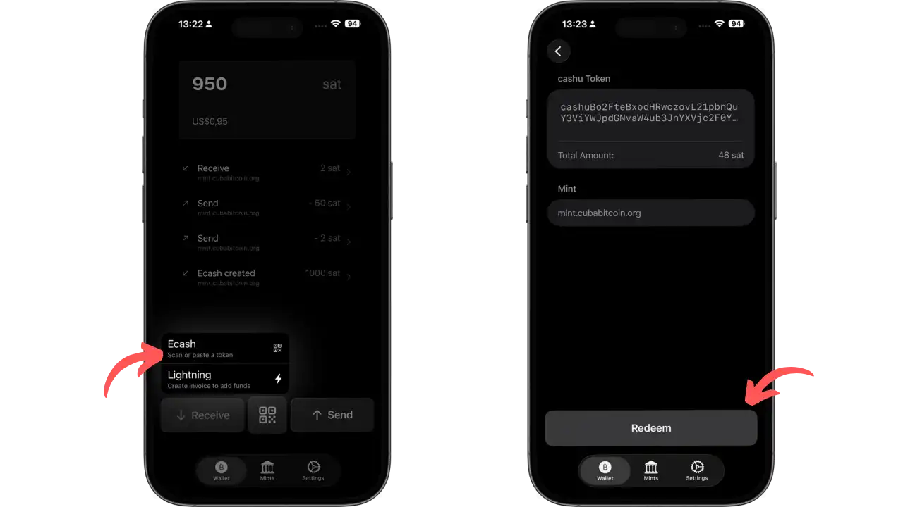

点击 "Redeem" 即可领取代币。

### 闪电付款

如果您想要使用 Cashu 代币支付闪电支付发票，请点击 “Send”，然后选择 “Lightning”。粘贴您要支付的 BOLT11 发票。

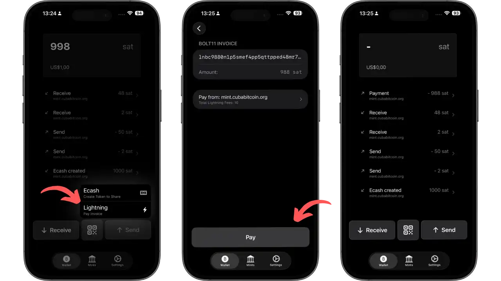

铸币厂会销毁您的代币并进行闪电支付。因此，您可以在保持匿名性的同时支付任何闪电服务费用。

### 不同铸币厂之间的代币兑换

当您收到来自未配置铸币厂的代币时，Macadamia 为您提供了多种管理这些代币的选项。

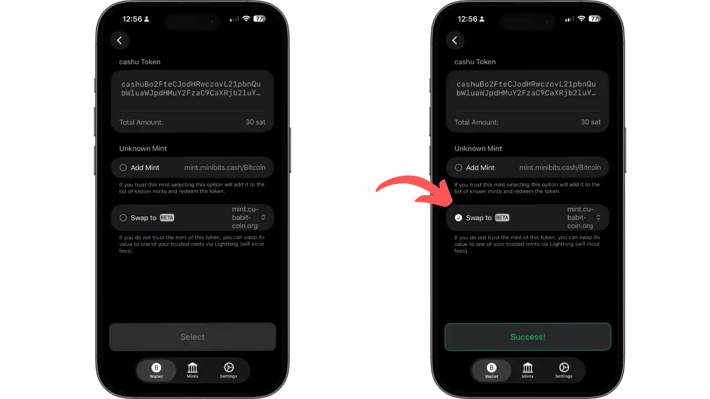

添加新的铸币厂或将代币兑换到现有铸币厂。兑换操作使用闪电网络作为桥梁，以匿名方式转移您的资金。

### 高级多铸币厂管理

Macadamia 提供强大的工具，用于同时管理多个铸币厂并策略性地分配您的资金。

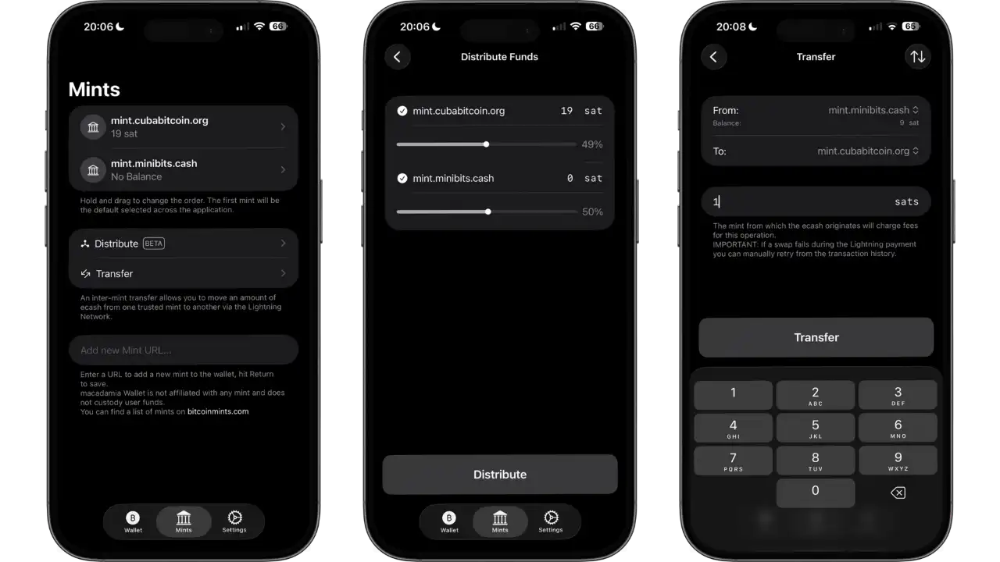

“Distribute Funds” 功能会根据百分比（例如 50/50）自动分配您的余额。“Transfer” 功能允许您在不同铸币厂之间手动转账，以分散风险。

## 优点与限制

**优点**：

- **最高级别的保密性**：交易无法追踪，即使是铸币厂也无法追踪。无区块链元数据，点对点交易无追踪。
- **快速且免费**：在同一铸币厂内进行免费即时转账，非常适合小额支付。
- **互操作性**：标准化的 Cashu 代币可与其他兼容钱包（Minibits、Nutstash）配合使用。
- **简洁易用**：iOS 原生界面，即使是新手也能轻松上手，同时保持可审计性（开源）。

**限制** ：

- **托管模式**：需要铸币厂的信任。如果铸币厂消失，您的代币将失去价值。
- **仅限 iOS**：没有 Android/桌面版本。Cashu 的互操作性允许通过其他钱包访问，但 iOS 仍然是最佳体验平台。
- **依赖铸币厂**：铸币厂离线时，无法执行需要其干预的交易（例如，铸币厂、销毁）。
- **新兴技术**：积极开发，可能存在漏洞，标准不断演变。

## 最佳做法

- **分散您的铸币厂**：将您的筹码分散到几个信誉良好的铸币厂，以降低风险。
- **限制金额**：将 Macadamia 用作日常支付的实体钱包，而不是保险箱。
- **保护您的助记词**：将您的 12 个单词的助记词写在纸上并妥善保管。定期测试助记词恢复功能。
- **检查铸币厂**：在添加铸币厂之前，请咨询 cashu.space 和社区论坛。选择那些运行稳定且信誉良好的铸币厂。
- **VPN 或 Tor**：使用 VPN/Tor 隐藏您的 IP 地址，以最大限度地保护您的网络隐私。
- **加入社区**：加入 Telegram/Discord Cashu 群组，获取最新信息、铸币厂推荐和最佳实践。

## 结论

Macadamia 钱包将实体现金的特性带入数字比特币。通过结合 Chaum 和闪电盲签名，它为交易保密性提供了一个优雅的解决方案。其原生 iOS 界面让用户能够轻松使用复杂的加密技术，同时保持开源并与 Cashu 生态系统兼容。

托管模式要求用户保持警惕并遵守良好的安全规范。如果使用得当，Macadamia 将成为日常匿名支付的得力工具，是对非托管钱包储蓄功能的有效补充。

## 资源

### 官方文档

- 官方网站：[macadamia.cash](https://macadamia.cash)
- Macadamia 常见问题解答：[macadamia.cash/faq](https://macadamia.cash/faq)
- GitHub 源代码：[github.com/zeugmaster/macadamia](https://github.com/zeugmaster/macadamia)

### Cashu 文档

- 技术文档：[docs.cashu.space](https://docs.cashu.space)
- 公开铸币厂列表：[bitcoinmints.com](https://bitcoinmints.com)
- 协议官方网站：[cashu.space](https://cashu.space)

### 社区

- Cashu 的 Telegram 群组：[t.me/cashu_ecash](https://t.me/cashu_ecash)
