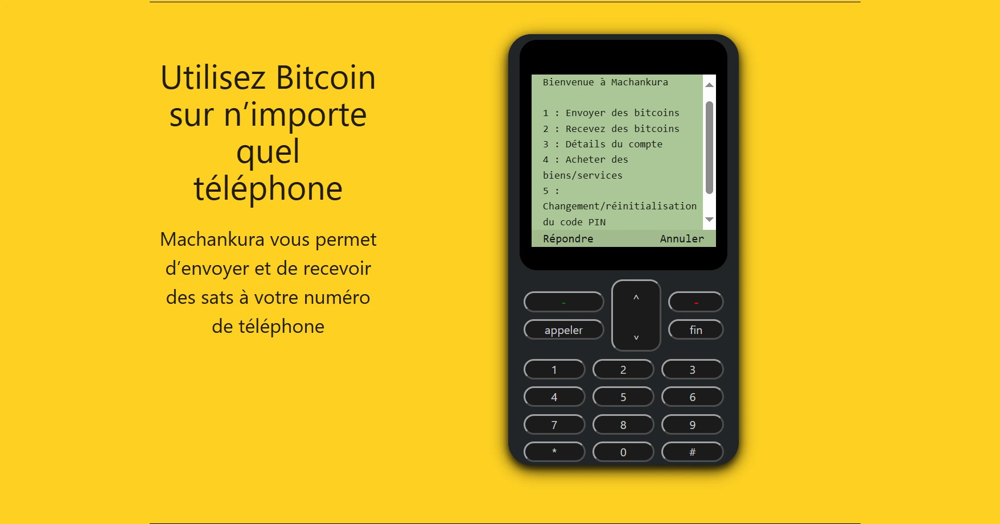

Afrika terus maju, berinovasi, dan membangun, tapi tetap menghadapi berbagai tantangan, terutama soal konektivitas Internet dan akses ke layanan keuangan dasar.

Menurut International Telecommunication Union, pada 2024, tingkat penetrasi Internet di Afrika (rasio jumlah orang yang menggunakan Internet terhadap total populasi benua ini) mencapai 38%, dibandingkan 68% di seluruh dunia.

Berbicara soal akses ke layanan keuangan, layanan transfer uang (mobile money) tengah booming di benua ini, karena banyak orang sulit mengakses layanan kredit bank.

Menghadapi situasi ini, Kgothatso Ngako, pengembang dari Afrika Selatan, menciptakan solusi revolusioner yang memungkinkan segmen masyarakat Afrika tanpa rekening bank dan tanpa akses internet tetap bisa memanfaatkan Bitcoin lewat proyeknya yang disebut **Machankura**.

## APA ITU MACHANKURA?

Machankura, bahasa gaul Afrika Selatan yang berarti "uang", adalah proyek dengan visi menghubungkan daerah pedesaan di Afrika dengan ekosistem Bitcoin.

Ini adalah wallet kustodian yang memungkinkan kamu mengirim dan menerima bitcoin di Lightning Network melalui teknologi USSD. Machankura bisa digunakan di semua ponsel, bahkan yang paling dasar (ponsel Symbian), menggunakan jaringan GSM tradisional.

**8333.mobi** yang biasanya muncul di bagian bawah logo adalah isyarat halus. Memang, **8333** adalah port default yang digunakan node Bitcoin untuk saling berkomunikasi. Machankura menunjukkan bahwa Afrika tidak ketinggalan dalam revolusi ini, dan menjadi lahan inovasi di bidangnya.

Domain **.mobi** dibuat untuk layanan seluler yang bisa dijalankan di ponsel dasar lewat USSD. Jadi, **8333.mobi** merangkum fitur-fitur khusus dari solusi Machankura.

Sebelum melanjutkan tutorial ini, mari kita lihat USSD, teknologi yang memungkinkan Machankura dipakai tanpa internet.

## USSD

Teknologi USSD (*Unstructured Supplementary Service Data*) umumnya dipakai oleh operator seluler GSM. Ini adalah fitur yang memungkinkan kamu berkomunikasi dengan layanan jarak jauh, bahkan tanpa Internet, dengan mengetik kode tertentu dan memilih opsi yang tersedia dari layanan tersebut.

Dalam proses komunikasi USSD, bayangkan kamu mengetik kode khusus seperti `*123#` di ponselmu. Dengan menjalankan kode USSD ini, kamu mengirim permintaan khusus ke jaringan GSM untuk mengakses layanan yang terkait dengan kode tersebut.

Dengan begitu, kamu bisa menggunakan USSD untuk melakukan tindakan seperti memeriksa paket Internet, pulsa, dan lain-lain.

Melalui sistem komunikasi inilah mobile banking dan transfer uang mobile seperti M-PESA, MTN Mobile Money, dan layanan serupa berkembang di benua ini.

Seperti disebut sebelumnya, dikembangkan khusus untuk Afrika, layanan ini bekerja di semua ponsel tanpa perlu konfigurasi teknis yang rumit atau koneksi Internet.

## Inovasi Machankura

Tidak seperti wallet konvensional, Machankura mampu memanfaatkan teknologi USSD untuk menjawab masalah nyata yang dihadapi masyarakat Afrika: jangkauan internet.

Machankura adalah layanan yang dikembangkan dan ditautkan ke kode GSM sehingga pengguna bisa menerima dan mengirim bitcoin tanpa internet. Kamu bisa memakai layanan ini di negara-negara berikut dengan kode USSD terkait:
``

| NEGARA           | KODE USSD              |
| -------------- | ---------------------- |
| Ghana          | `*920*8333#`           |
| Kenya          | `*483*8333#`           |
| Malawi         | `*384*8333#`           |
| Namibia        | `*142*8333#`           |
| Nigeria        | `*347*8333#`           |
| Afrika Selatan | `54052.co.za`          |
| Tanzania       | `SMS +255 679 066 977` |
| Uganda        | `SMS +256 744 830 624` |
| Zambia         | `*384*8333#`           |
| Pantai Gading  | `*9141#`               |

Berdasarkan tabel ini, kita dapat melihat bahwa negara-negara seperti Tanzania, Uganda, dan Afrika Selatan tidak memiliki kode USSD khusus untuk layanan ini.

Namun, Machankura mengatasi masalah ini dengan memperluas fungsionalitasnya melalui situs web, pesan SMS, dan WhatsApp.

Untuk mendapatkan informasi mengenai negara-negara baru di mana layanan ini akan tersedia, silakan kunjungi [situs web](https://8333.mobi) secara teratur.

Tutorial langkah demi langkah ini menjelaskan cara menggunakan Machankura, pertama di ponsel biasa tanpa internet, kemudian di smartphone.

## Pengoperasian tanpa ponsel cerdas (melalui USSD)

### Buat portofolio Anda

Untuk koneksi pertama kamu:

- Masukkan kode USSD yang sesuai dengan negara kamu  
- Tekan tombol panggil untuk memulai

Sistem akan meminta kamu membuat kode PIN 5 digit

- Pilih kode PIN yang aman (5 digit)  
- Konfirmasikan kode PIN kamu  
- Portofolio Bitcoin kamu dibuat secara instan

Bitcoin wallet ini terkait dengan nomor teleponmu. Kode PIN yang dipilih dengan cermat akan mengenkripsi wallet-mu dan juga digunakan untuk mengonfirmasi semua transaksi di Machankura di masa depan.

Setelah portofolio dibuat, kamu akan mengakses menu utama dengan opsi berikut:

1. Kirim bitcoin  
2. Menerima bitcoin  
3. Detail akun  
4. Membeli barang/jasa  
5. Mengubah/mengatur ulang kode PIN  
6. Keluaran

Untuk mengakses opsi apa pun di menu utama, cukup tekan nomor urut yang terkait dengan opsi tersebut.

Untuk mengakses "Detail akun", pilih opsi **3** dan tekan tombol panggil untuk membuka.

### Keselamatan dan praktik terbaik

Machankura adalah kustodian Lightning Wallet, jadi bitcoin kamu dikelola melalui node Machankura. Akunmu dilindungi oleh kode PIN yang kamu pilih.

- Jangan gunakan tanggal penting dalam hidupmu sebagai kode PIN  
- Jangan pernah membagikan kode PIN kepada siapa pun  
- Hafalkan kode PIN-mu  
- Selalu periksa nomor telepon sebelum mengirim  
- Jaga saldo wajar untuk penggunaan sehari-hari

Wallet kamu terhubung ke nomor teleponmu:

- Jika kamu kehilangan ponsel, hubungi dukungan Machankura  
- Pantau transaksi pentingmu

### Menerima bitcoin

- Pilih nomor urut dari opsi "Terima Bitcoin" di menu utama  
- Nomor teleponmu berfungsi sebagai address publik  
- Bagikan nomor ini kepada orang yang ingin mengirimi kamu bitcoin

#### Lightning Address Khusus

Setiap akun Machankura diberi Lightning Address berdasarkan nomor Machankura kamu:

`votrenumero@8333.mobi`

Contoh: nomor +2371234567890 menjadi `+2371234567890@8333.mobi`

Kamu juga bisa memilih nama pengguna khusus untuk menggantikan nomor tersebut (misalnya `Satoshi@8333.mobi`)

Siapa pun yang memiliki Lightning Address dapat mengirimi kamu bitcoin tanpa mengetahui nomor teleponmu

#### Memuat ulang portofolio Machankura

Selain menerima bitcoin dari Lightning Wallet lain, kamu bisa mengisi ulang Machankura Wallet dengan **Azteco** dan **1Voucher** dari **Flash Group**

**Azteco** dan **Flash Group** adalah dua perusahaan yang menawarkan **voucher** Bitcoin, yaitu layanan voucher prabayar yang bisa dibeli secara online atau dari pengecer untuk mendapatkan Bitcoin tanpa melalui platform exchange. Voucher ini bekerja seperti **kartu hadiah**, tersedia dalam versi **On-Chain** dan **Lightning**.

Prosesnya sederhana:

- Kamu membeli voucher dengan jumlah tertentu  
- Kamu menerima kode **16 digit** lewat email atau pada invoice kecil

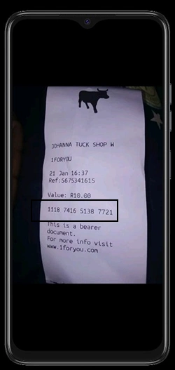

- Masukkan kode USSD MACHANKURA sesuai negara kamu di ponsel  
- Tunggu sampai menu utama muncul  
- Pilih nomor urut dari opsi "Terima bitcoin"  
- Masukkan kode 16 digit (kode referensi voucher Azteco di bagian bawah voucher atau kode PIN 1Voucher pada invoice)

Bitcoin yang setara dengan jumlah voucher yang dibeli akan langsung ditambahkan ke Machankura Wallet-mu

### Kirim Bitcoin

- Buka menu utama  
- Pilih opsi "Kirim Bitcoin" dengan memasukkan nomor urut  
- Masukkan nomor telepon penerima, nama pengguna Lightning Address, atau Machankura  
- Masukkan jumlah yang akan dikirim dalam Sats  
- Konfirmasikan dengan kode PIN-mu

Machankura kemudian mengirim bitcoin melalui Lightning Network dalam hitungan detik. Pengirim juga bisa mengirim bitcoin dalam mata uang lain, termasuk mata uang lokal.

Jika nomor penerima belum terdaftar, Machankura akan melakukan pra-pendaftaran dan mengkredit akun penerima.

Sebuah pesan otomatis dikirim ke nomor yang baru didaftarkan, dan pengguna menerima bitcoin setelah mengonfirmasi pendaftarannya dengan layanan ini.

Kamu dapat menonton [video demo pengiriman](https://www.linkedin.com/posts/activity-7351143606121820162-Ua3T?utm_source=share&utm_medium=member_android&rcm=ACoAAAeTubUB8GuaMia5yNBlBg4WhZpGOeVLY0w) bitcoin oleh PIO TARAS (Pimpinan Machankura Afrique Francophone) melalui Machankura di telepon biasa.

*Video dari Vladimir FOMENE, pengembang Bitcoin :*

### Periksa saldo Anda

- Pilih nomor urut opsi "Saldo" di menu utama  
- Saldo kamu ditampilkan dalam satoshi dan mata uang lokal yang setara

### Riwayat transaksi

- Pilih nomor urut opsi "Riwayat" di menu utama  
- Lihat transaksi terbaru kamu (pengiriman dan penerimaan)  
- Periksa detail setiap transaksi

### Fitur tambahan

Machankura bukan sekadar wallet. Kamu bisa menukarkan satoshi dengan barang dan jasa (misalnya kartu hadiah Bitrefill atau Lightning Watts) langsung dari aplikasi.

https://planb.academy/tutorials/exchange/centralized/bitrefill-8c588412-1bfc-465b-9bca-e647a647fbc1

Kamu juga memiliki fungsi "**Klan**", yang memungkinkan mengelola sistem multi-tanda tangan kooperatif: anggota klan harus menyetujui setiap pengeluaran, dan kamu bisa mendistribusikan dana secara otomatis di antara mereka

## Gunakan dengan smartphone

Machankura memilih WhatsApp sebagai platform perantara untuk penggunaan smartphone

Ada dua alasan utama. Pertama, membuat solusi yang lebih mudah diakses oleh orang Afrika, tanpa memaksa mereka menginstal aplikasi: aplikasi ini mudah dihapus jika ponsel kehabisan memori penyimpanan

Kedua, sebagai perpanjangan logis dari yang pertama, ini menjadi solusi inklusif dan lokal, menggunakan aplikasi yang banyak dipakai orang Afrika dalam percakapan sehari-hari: WhatsApp

### Buat portofolio Anda

Untuk memulai, Kamu perlu menulis pesan ke bot WhatsApp Machankura (kata "Hai" saja sudah lebih dari cukup). Nomor WhatsApp-nya adalah [+27 73 762 5720](https://wa.me/+27737625720).

Kamu akan diminta untuk memilih bahasa yang kamu inginkan untuk mengobrol.

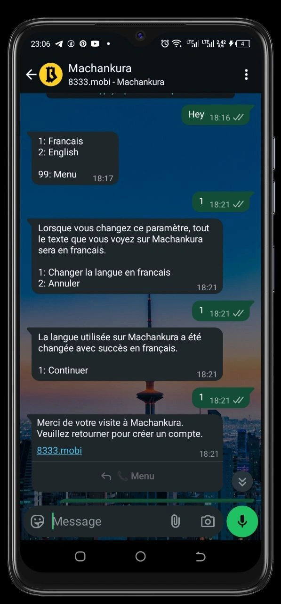

Setelah kamu memilih bahasa, kamu akan dibawa ke menu utama

- Pilih **1** untuk opsi "Buat akun"  
- Masukkan email unik sebagai address

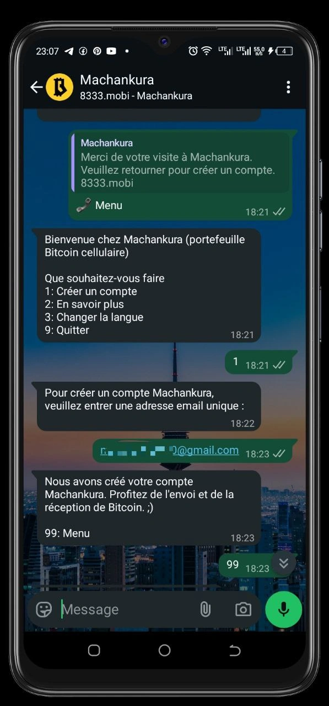

Akun Machankura kamu akan dibuat secara otomatis. Kembali ke menu untuk menentukan nama pengguna kamu

Untuk melakukannya:

- Jawab **0**, yang sesuai dengan opsi ''**Parameter**'';
- Kemudian jawab **1**, yang sesuai dengan pilihan ''**Nama pengguna**''.

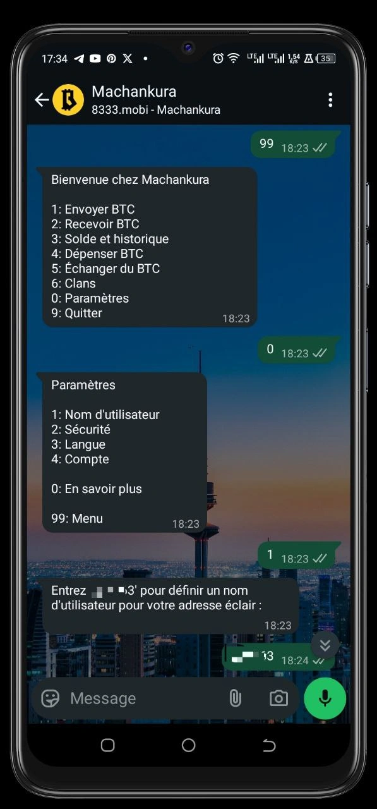

Bot kemudian akan mengirimi kamu kode **6 digit** yang perlu diketik, lalu pilih nama pengguna kamu. Setelah memperbarui nama pengguna, kembali ke menu untuk mulai mengirim dan menerima bitcoin melalui Machankura

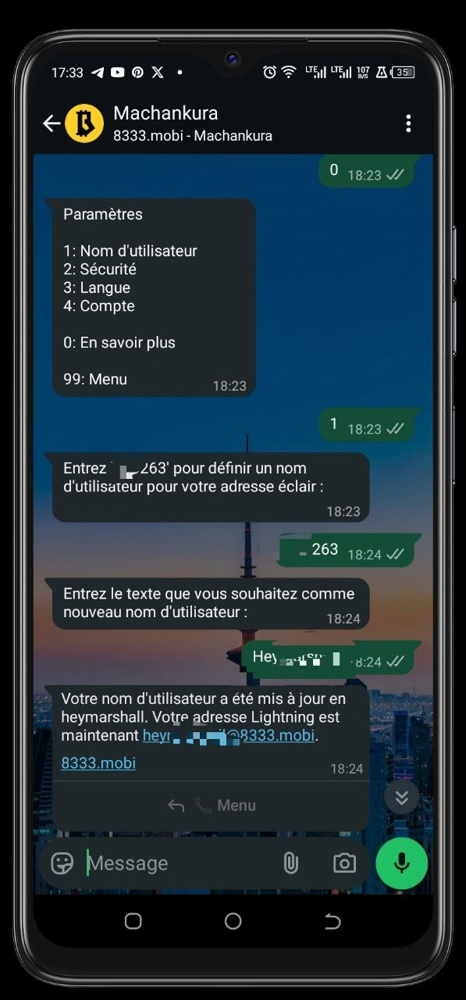

### Kirim bitcoin

Machankura memungkinkan kamu mengirim bitcoin melalui beberapa opsi:

- nomor telepon  
- Lightning Address, format Bitcoin Address yang mudah dibaca untuk mengurangi kesalahan saat pembayaran  
- nama pengguna penerima, untuk pembayaran ke akun Machankura  
- gW-15 Invoice, Lightning Invoice standar  
- gW-16 Address, melalui layanan Boltz

https://planb.academy/tutorials/exchange/centralized/boltz-34ad778e-6dc7-41c2-8219-e11e3361a43d

Machankura memungkinkan interoperabilitas antara dompet Lightning yang berbeda. Dalam demonstrasi ini, bitcoin dikirim dari Machankura WhatsApp Wallet ke wallet dari Satoshi Wallet

https://planb.academy/tutorials/wallet/mobile/wallet-of-satoshi-39149d86-e42b-4e8f-ae9f-7e061e7784f7

Untuk mengirim, masukkan angka 1 untuk opsi "SEND BTC". Selanjutnya, pilih opsi pengiriman "Lightning Address", masukkan address tujuan, pilih jumlah dalam "Sats", dan konfirmasikan pengiriman

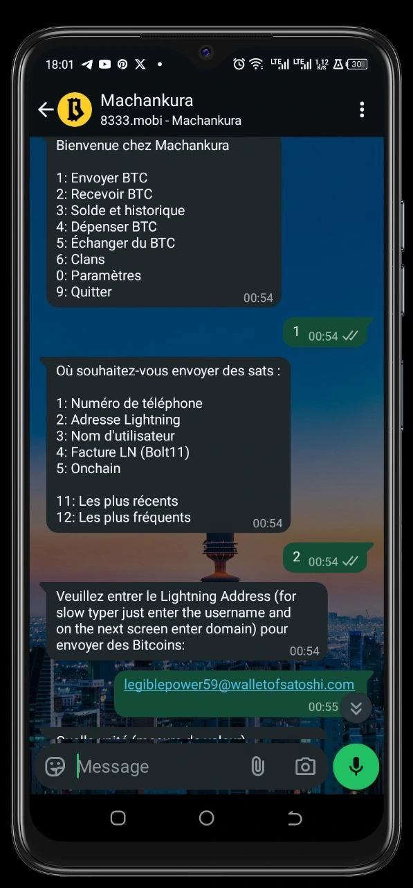

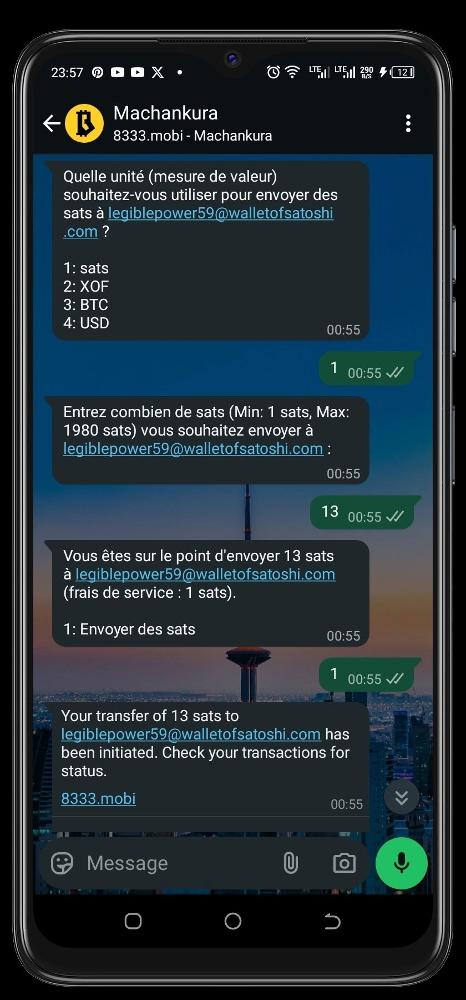

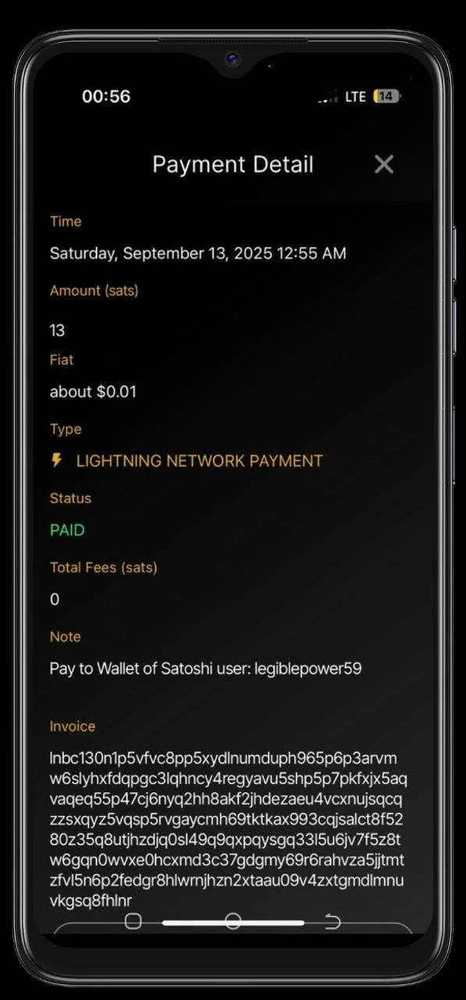

Selamat! Kamu baru saja mengirim satoshi kepada penerima

### Menerima bitcoin

Setelah berada di menu, pilih **2** untuk opsi "Terima BTC". Bot akan menampilkan Lightning Address kamu

Fitur ini juga menawarkan beberapa opsi, termasuk:

- MENGGUNAKAN BTC  
- Bill LN (Bolt11)  
- Kode QR  
- On-Chain Address

Opsi 1 "GUNAKAN BTC" memungkinkan kamu mengisi ulang akun dengan voucher Azteco

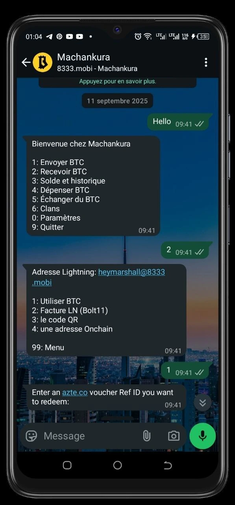

Opsi 4 ''A ONE-TIME Address'' memungkinkan kamu untuk mendapatkan On-Chain Address baru sekali pakai untuk anonimitas yang lebih baik.

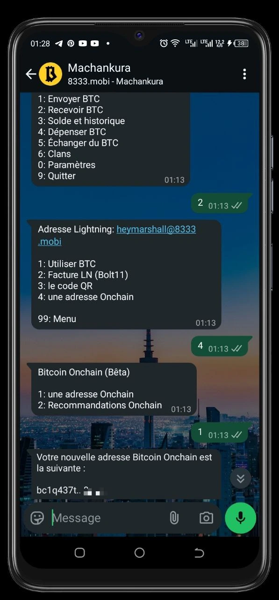

Opsi lainnya mengarahkanmu ke halaman web yang terhubung ke Lightning Address Anda.

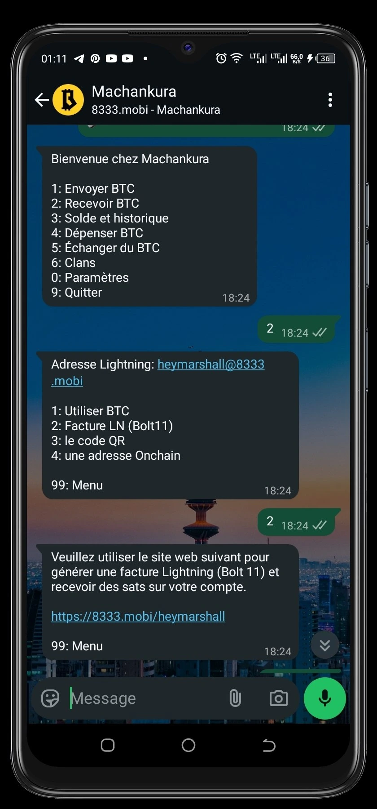

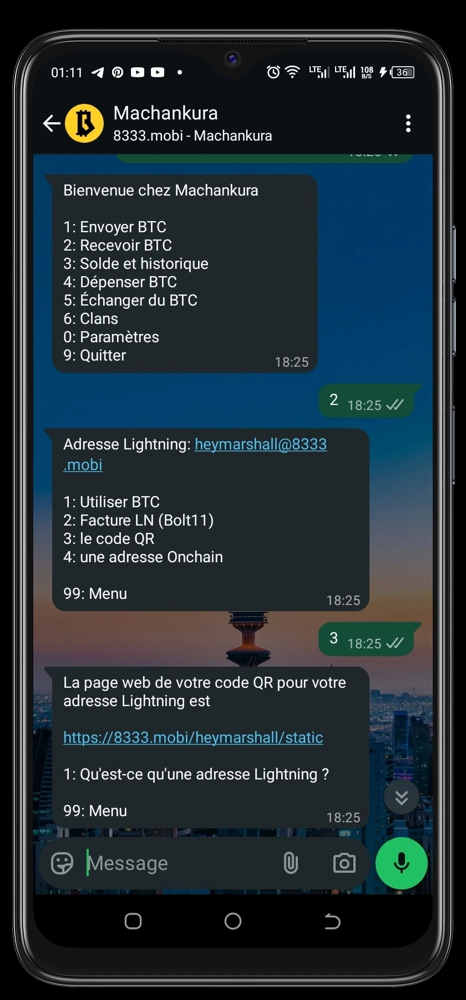

Kamu dapat membeli :

- atau kode QR dari Wallet;

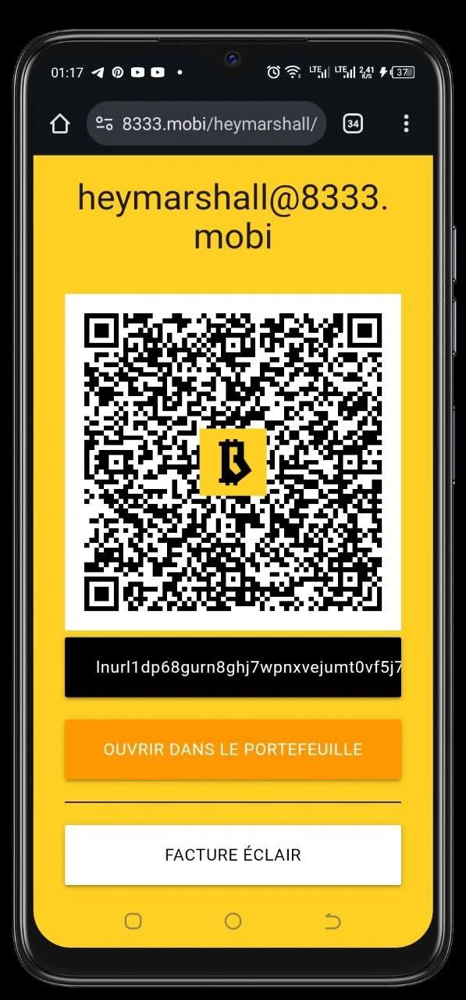

- atau membuat Lightning Invoice di halaman web ini

Untuk mendapatkan invoice yang akurat, sebutkan unit akun dan jumlah bitcoin dalam unit akun yang ingin kamu terima

Setelah memasukkan jumlah dalam unit akun ini, sistem akan mengonversinya ke Bitcoin, dan sebaliknya

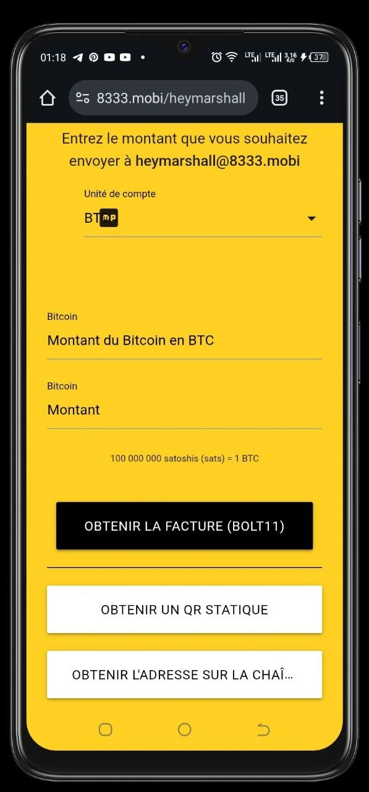

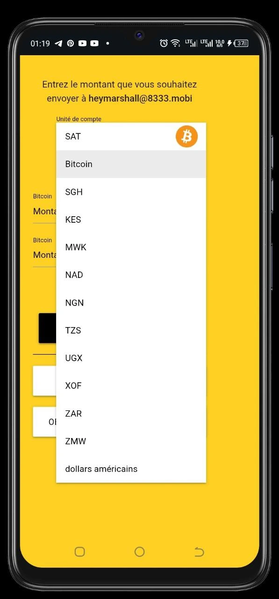

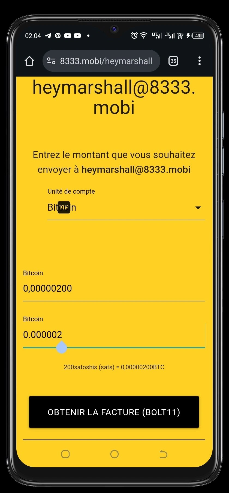

Perhatikan bahwa kamu juga dapat memperoleh On-Chain Address pada halaman web yang terhubung ke portofolio milikmu.

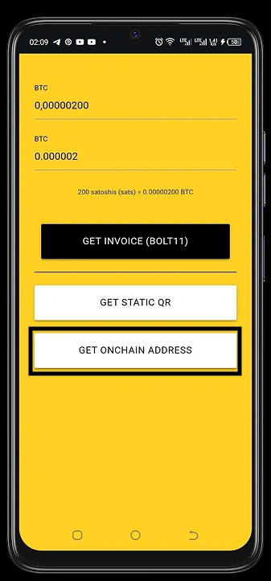

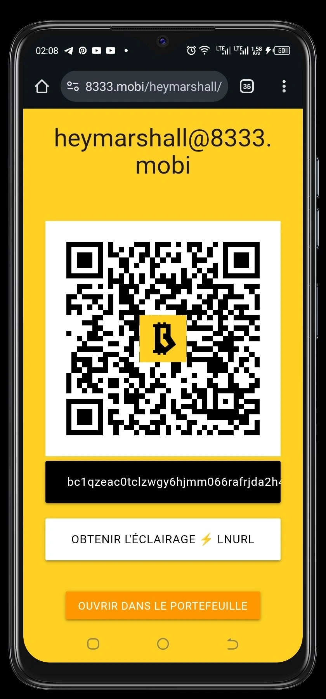

Selain itu, Machankura memungkinkan siapa pun yang ingin mengirimi kamu bitcoin untuk melakukannya lewat situs web, menggunakan wallet khusus. Cukup kirimkan tautan ke halaman web yang terkait dengan Lightning Address kamu. Setelah mereka membuka halaman ini, mereka bisa langsung mengakses kode QR atau invoice di wallet mereka

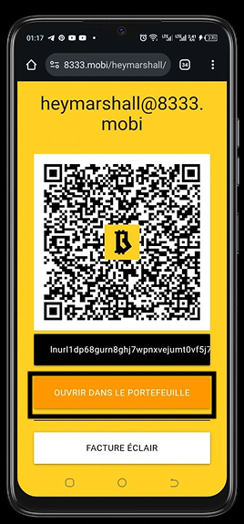

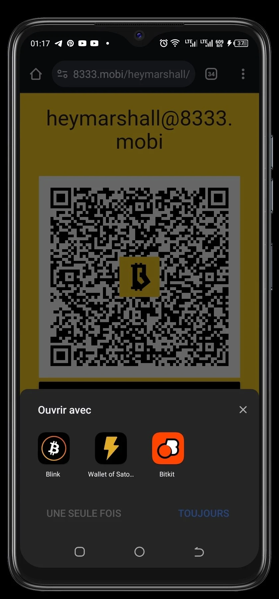

https://planb.academy/tutorials/wallet/mobile/blink-7ea5f5a4-e728-4ff9-b3f9-cf20aa6fc2bd

https://planb.academy/tutorials/wallet/mobile/bitkit-a7224674-85c4-4045-9baf-37018d89550c

### Pemeriksaan saldo

kamu dapat melihat saldo portofolio Machankura dengan memilih opsi 3, yang sesuai dengan opsi "Saldo dan riwayat".

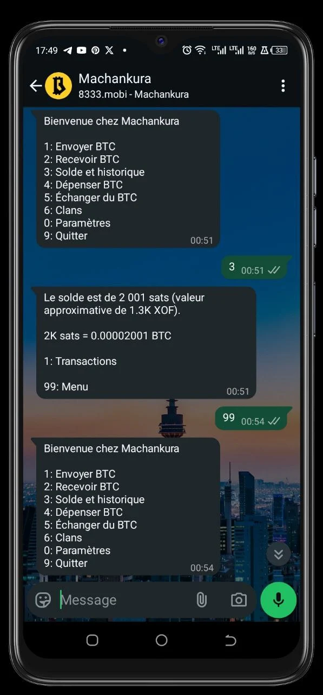

Selamat! Sekarang kamu sudah bisa menggunakan Machankura untuk menerima dan membelanjakan bitcoin

Jika kamu merasa tutorial ini bermanfaat, tinggalkan jempol hijau di bawah ini. Terima kasih banyak!
