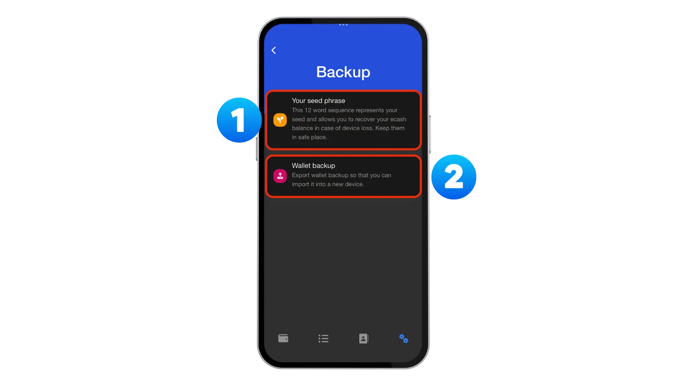
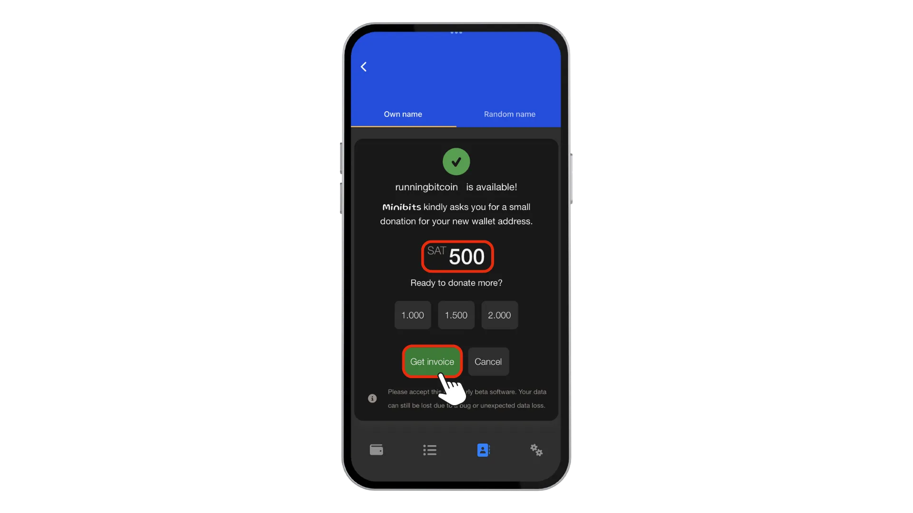
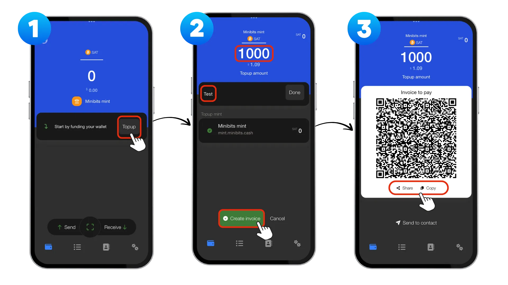
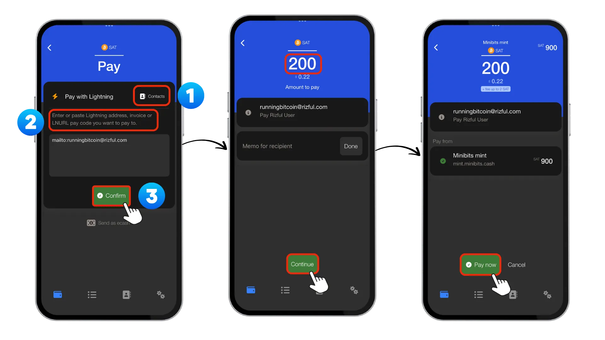

在本教程中，我将引导您设置 Minibits 钱包以使用 ecash。ecash 是一种功能强大的、注重隐私的支付技术，可与比特币协同工作。Minibits 是一款 ecash 和闪电钱包，支持即时、低成本且私密的价值转移，非常适合注重隐私的日常交易。

在深入了解 Minibits 之前，让我们先明确一下 ecash 的概念。许多人会将 ecash 与比特币或区块链技术混淆，但它们本质上是不同的概念。

ecash（电子现金）不是比特币。它不会取代您自行托管的比特币钱包，而是对其进行补充。ecash 不是区块链，也不存在于任何公共账本上。有趣的是，电子现金并非一项新技术——它实际上早于万维网，其概念早在 20 世纪 80 年代和 90 年代就已出现。

何为 ecash？极高的私密性（交易不留任何可追踪的历史记录）、点对点（无需中介即可直接转账），并且作为一种数字记名工具（拥有它，就拥有控制权）。一个关键优势是电子现金可以离线使用——在交易过程中，发送方或接收方都可以断开网络连接。电子现金可以由单个机构或可信实体联盟铸造，它是比特币的完美补充技术，负责处理小额、频繁的交易，而比特币则作为结算层。

请注意，Minibits 设置是一种 "托管解决方案"，这意味着您信任铸币厂来管理您的资金。这将带来特定风险，您必须在继续操作前了解清楚。

该项目包含以下重要免责声明：

- 此钱包仅供研究用途。
- 此钱包为测试版，功能尚不完善，存在已知和未知错误。
- 请勿在此钱包中存储大量电子现金。
- 钱包中存储的电子现金由铸币厂发行。
- 您信任铸币厂会以比特币作为其后盾，直到您将持有的电子现金转移到其他比特币闪电钱包。
- 此钱包使用的 Cashu 协议尚未经过全面审查或测试。

请将 Minibits 视为日常钱包，而非储蓄账户，切勿在此存储大量资金。

## 1️⃣ 设置您的钱包

首先，请访问 [Minibits 网站](https://www.minibits.cash/)，您可以在这里找到所有主流平台的下载选项。iOS 用户可以从 [App Store](https://testflight.apple.com/join/defJQgTD) 下载，而欧盟 iOS 用户还可以选择从 [Freedom Store](https://freedomstore.io/) 安装。 Android 用户可以从 [Google Play 商店](https://play.google.com/store/apps/details?id=com.minibits_wallet) 获取该应用，或直接从 [GitHub 发布](https://github.com/minibits-cash/minibits_wallet/releases) 页面下载 APK 文件。

安装 Minibits 时，您会看到一些介绍基本概念的界面——您可以阅读这些界面，也可以如果您已经熟悉这项技术，则可以跳过它们。完成这些初始步骤后，系统会提示您选择：

- `Got it, take me to the wallet`（新用户），或
- `Recover lost wallet`（如果从备份恢复）。

完成初始设置后，您将进入主页，其中包含几个需要注意的重要元素。 ① 点击右上角的个人资料图标即可进入您的个人资料页面，您可以在此访问您的 Minibits 钱包地址并选择 `batch receive` 选项。② 屏幕中间会显示您可以使用的 Mints，默认情况下已选择 Minibits Mint。③ 下方的操作栏提供发送 ecash 或闪电支付、扫描二维码和接收付款的选项。④ 最后，底部导航栏包含主屏幕、交易记录、联系人和设置的快捷方式。

## 2️⃣ 管理铸币厂

默认情况下，启动应用程序时会启用 Minibits 铸币厂。然而，ecash 的优势之一是能够使用多个铸币厂，以提高分散性和安全性。为了添加另一个铸币厂，请前往 `Settings`，然后选择 `Manage mints`，最后点击 `Add mint`。

[Bitcoinmints.com](Bitcoinmints.com) 提供了一份全面的可用铸币厂列表，并附有用户评级，帮助您选择信誉良好的铸币厂。使用多个铸币厂可以降低风险。如果一个造币厂出现问题，您在其他造币厂的资金仍然可以使用。

## 3️⃣ 创建备份

备份可以说是整个设置过程中最关键的一步。要访问备份选项，请导航至 `Settings`-> `Backup`。在这里，您会看到两个重要选项：

1. `Your seed phrase`，即包含 12 个单词的助记词，可在设备丢失时恢复您的 ecash 余额。此助记词是您访问所有已添加 ecash 的主密钥。请将其写在纸上或金属上，并安全地保存在多个位置。切勿以数字方式存储助记词，以免泄露。您可以访问此[教程](https://planb.academy/en/tutorials/wallet/backup/backup-mnemonic-22c0ddfa-fb9f-4e3a-96f9-46e2a7954270)，了解保护钱包的最佳实践。
2. `Wallet backup`，其中包含一个长备份字符串。

**注意**：使用此备份恢复钱包时，您仍然需要助记词。

## 4️⃣ 创建 Minibits 钱包地址

接下来，前往到底部的 `Contacts`，然后点击 `Change` -> `Change wallet address` 来自定义您的专属 Minibits 钱包地址。输入您偏好的地址并检查其可用性。

设置地址后，系统会提示您进行小额 `Donation` 以支持项目。虽然这是可选的，但如果您计划经常使用此服务，我强烈建议您考虑捐赠。像 Minibits 这样的开源项目依靠社区支持才能持续开发和维护。即使是小额捐赠也能帮助确保项目的长期发展。

## 5️⃣ Nostr 设置

如果您想给 Nostr 上关注的人打赏，可以通过选择 `Contacts` 和 `Public` 来 `Add your npub key`。这会将您的 Minibits 钱包连接到 Nostr 社交网络，从而实现无缝打赏。

您还可以选择 `Use your own profile`，方法是转到 `Settings` 和 `Privacy` 来导入您自己的 Nostr 地址和密钥。但是请注意，这样做会阻止您的钱包与 minibits.cash Nostr 和 LNURL 地址服务器通信，从而禁用用于接收 Zap 和付款的闪电网络地址功能。

## 6️⃣ 接收资金

为了首次接收资金，您需要通过闪电网络发票为您的钱包充值。这个过程很简单：点击 `Topup`，输入您要充值的 `Amount`，可以添加 `Memo`（可选），然后点击 `Create invoice`。之后，您需要使用另一个闪电网络钱包支付此发票，这样可以将比特币闪电网络支付转换为您 Minibits 钱包中的 ecash 代币。

## 7️⃣ 发送资金

钱包充值完成后，您可以通过两种方式发送资金。

### 发送 ecash

第一种方式是直接发送 ecash。点击 `Send`，然后选择 `Send ecash`，输入 `Amount`，然后点击 `Create token.`。系统将生成一个二维码，您可以将其分享给接收者，或者让接收者直接使用他们的设备扫描。接收者几乎可以立即在其钱包中看到代币，无需支付区块链手续费或等待确认。

### 通过闪电网络支付

第二种方式是通过闪电网络支付。点击 `Send`，然后选择 `Pay with Lightning`。您可以从 Nostr 的 `contacts` 中选择（如果您已连接 npub），或者使用 `Paste` 或 `scan` 选项输入/粘贴闪电网络地址、发票或 LNURL 支付代码。确认接收者后，系统会提示您输入 `Amount to Pay`，您还可以选择添加备注，然后点击 `Confirm`，再点击 `Pay now` 完成闪电网络交易。

## 8️⃣ 创建 NWC 连接

Minibits 的另一项强大功能是能够创建 `Nostr Wallet Connect (NWC)` 连接，该连接允许其他应用程序在不泄露您的私钥的情况下从您的钱包请求付款。

为了进行设置，请前往 `Settings`，然后选择 `Nostr Wallet Connect`，并点击 `Add connection`。为您的连接命名一个描述性的名称，以便识别应用程序和关联的用户帐户。设置一个合理的每日最高限额，以控制通过此连接可以花费的金额，然后点击 `Save` 完成设置。

此功能对于像 Nostr Clients 这样的服务尤其有用，您可以启用自动打赏功能，而无需手动批准每笔交易。

## 🎯 结论

Minibits 为用户提供了一个便捷的电子现金入门途径，提供注重隐私的支付方式，可与您的比特币资产完美互补。请务必妥善备份，考虑使用多个币种以实现冗余，并仅在托管解决方案中存储适量的资金。

如需更多资源，请访问 Minibits 的 GitHub 代码库、官方网站以及 Telegram 频道，社区成员会在那里积极讨论最新进展并解决问题。

- [Github](https://github.com/minibits-cash/minibits_wallet)
- [官方网站](https://www.minibits.cash/)
- [Telegram](https://t.me/MinibitsWallet)

ecash 生态系统仍在不断发展，但 Minibits 等工具正使越来越多的普通用户可以使用这一强大的隐私技术。
