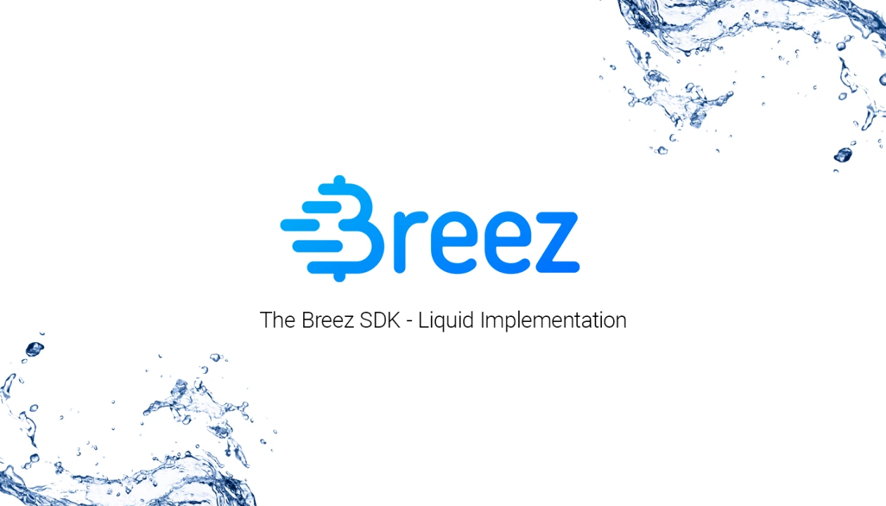
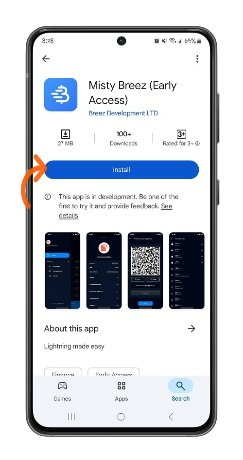
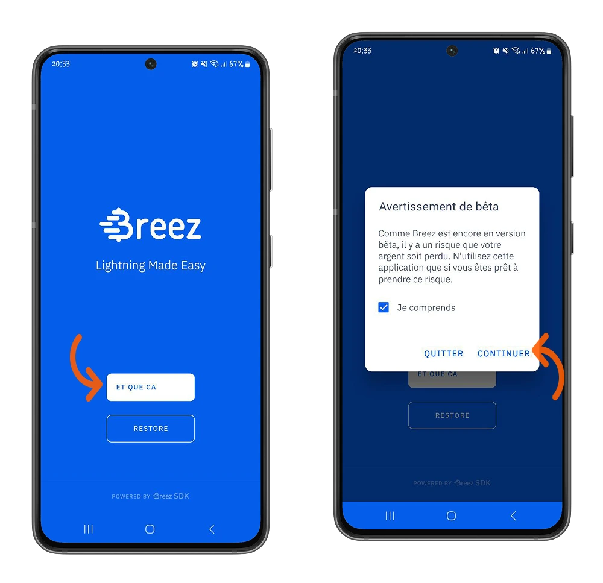
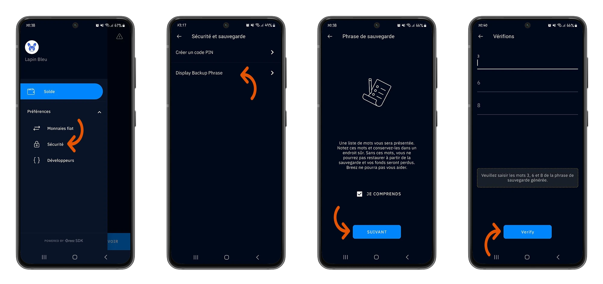
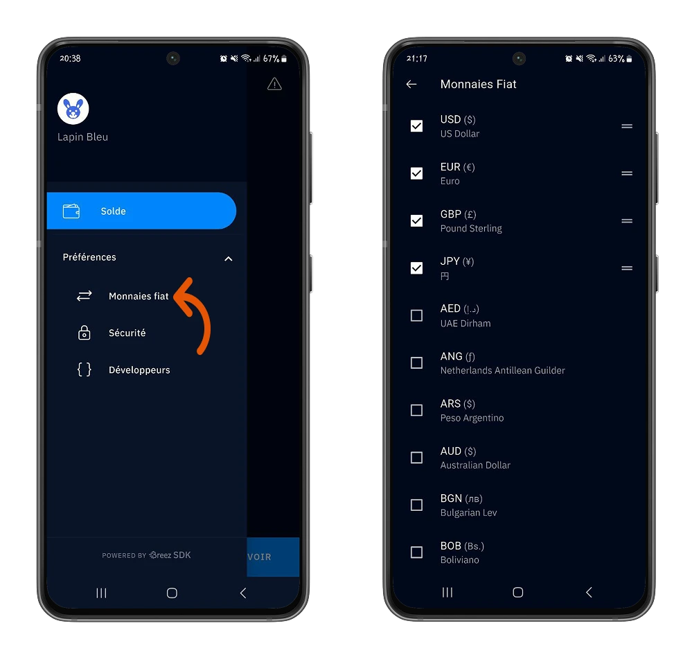
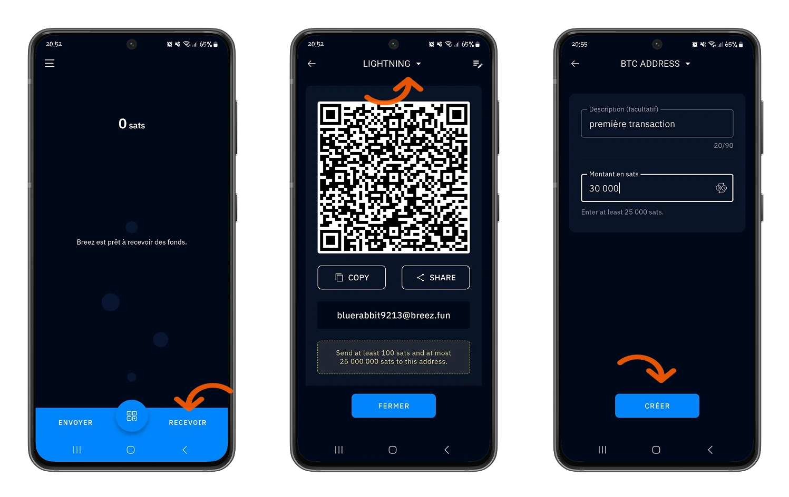
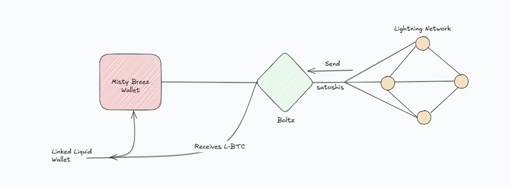
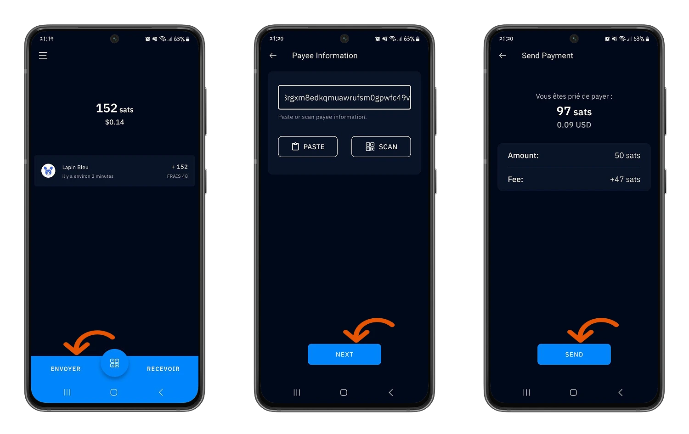
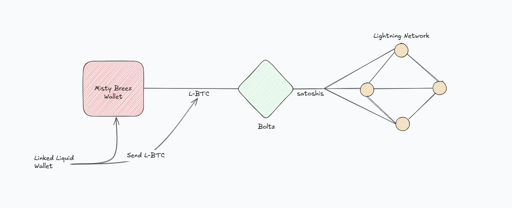
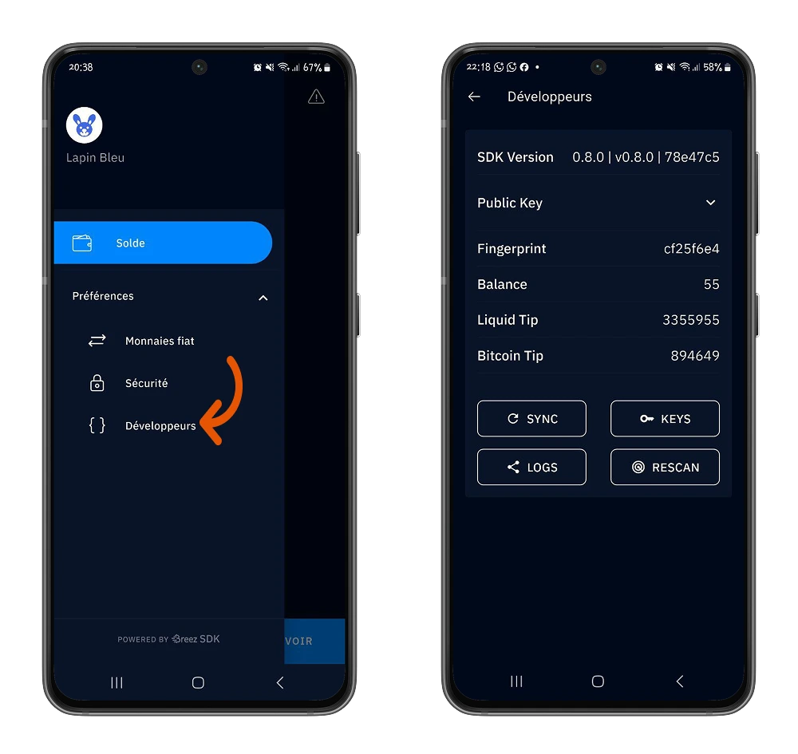

Misty Breez adalah **Lightning self-holding wallet** yang dikembangkan oleh Breez, dibangun menggunakan Software Development Kit (SDK) mereka dan terhubung dengan **jaringan Liquid** yang dikembangkan oleh Blockstream.

Hadir dengan pendekatan baru yang benar-benar berbeda untuk beroperasi tanpa node Lightning: potensi menjadi **game changer** dalam transfer antarjaringan Bitcoin.

Dalam tutorial ini, aku akan jelasin cara kerja wallet ini dan kasih kamu gambaran yang lengkap.

## Bagaimana cara kerja Misty Breez?

Misty Breez adalah versi Lightning tanpa node sebagai backend. Wallet ini dikembangkan menggunakan Breez SDK dan terhubung dengan Liquid.

Liquid adalah layer paralel dari jaringan Bitcoin yang menawarkan peningkatan signifikan dalam kecepatan dan biaya transaksi. Layer ini memungkinkan Misty Breez beroperasi tanpa node Lightning dan sebagai gantinya menggunakan layanan exchange pihak ketiga seperti Boltz untuk memastikan kesesuaian antara Liquid Network dan Lightning Network. Santai aja, kita akan bahas ini lagi nanti.

Untuk saat ini, mari kita mulai petualangan dengan Misty Breez Wallet.

## Memulai dengan Misty Breez

Aplikasi seluler Misty Breez tersedia di platform resmi seperti Google Play Store (di Android) dan Apple Store (di iOS). Kamu juga bisa download ke aplikasi yang tepat dari situs web resmi [Misty Breez] (https://breez.technology/misty/).

⚠️ Pastikan kamu nggak tertukar antara Misty Breez dengan Breez Wallet.

⚠️ **PENTING**: Demi keamanan bitcoin milikmu, penting banget untuk mengunduh aplikasi dari platform resmi untuk memastikan keasliannya.

Dalam tutorial ini, kita akan mulai dari  Android. Nah tapi, setiap langkah dan fitur spesifik yang dirinci dalam bagian ini juga bisa untuk iOS.

Setelah menginstall, Misty Breez kasih kamu pilihan untuk membuat Wallet baru atau memulihkan Lightning Wallet lama yang punya kata-kata pemulihan.

Di tutorial ini, kita memilih untuk membuat wallet baru.

⚠️Misty Breez saat ini sedang dalam tahap pengembangan, jadi kita menyarankanmu untuk memulai dengan jumlah yang wajar.

### Simpan kata-kata pemulihanmu :

Salah satu hal pertama yang harus kamu lakukan saat membuat portofolio baru adalah membuat cadangan 12 kata pemulihan.
Berikut ini beberapa tips tentang cara membuat cadangan backup phrase-mu.

https://planb.network/tutorials/wallet/backup/backup-mnemonic-22c0ddfa-fb9f-4e3a-96f9-46e2a7954270

Untuk mencadangkan frasa milikmu, pilih menu **Preferensi > Keamanan**, lalu opsi **Periksa Frasa Cadangan Anda**.

Untuk keamanan tambahan, kamu juga bisa **membuat kode PIN** untuk mengotentikasi akses ke Wallet.

Temukan mata uang lokal dalam berbagai mata uang yang diterima oleh Misty Breez. Konfigurasikan mata uangmu dari menu **Preferensi > Mata Uang Fiat**, lalu pilih mata uang atau beberapa mata uang yang kamu mau.

### Melakukan transaksi pertama

Kalau kamu sudah terbiasa dengan portofolio Breez, kamu nggak akan merasa kesulitan dengan tampilan yang intuitif dari Misty Breez.

Pada menu **Saldo** Interface, klik opsi **Terima** untuk membuat faktur guna menerima bitcoin di Wallet.

⚠️ Misty Breez akan memintamu untuk mengaktifkan notifikasi untuk aplikasi dalam pengaturan ponsel untuk mendapatkan Lightning Address.

Dengan Misty Breez, kamu dapat :

- Dapatkan bitcoin di Lightning Network mulai dari **100 satoshi** hingga **25.000.000 satoshi**.
- Dapatkan bitcoin di jaringan utama Bitcoin mulai dari **25.000 satoshi**.

Di sinilah keajaiban Misty Breez dimulai.

Berbeda dengan Breez Wallet yang menyediakan node Lightning dan bikin kamu harus nanggung sendiri biaya pembukaan serta penutupan channel pembayaran, Misty Breez nggak minta kamu lakukan itu. Seperti yang udah disebut sebelumnya, Misty Breez bahkan nggak berjalan dengan node Lightning.

Mari kita lihat lebih dekat di balik layar.

Kenyataannya, kamu punya wallet Liquid yang terhubung dengan wallet Misty Breez kamu. Intinya, kamu bakal pakai L-BTC (Liquid Bitcoin) dengan harga tetap yang dikaitkan dengan layanan konversi submarine swap pihak ketiga, yang memungkinkan kamu beroperasi di Lightning Network.

Ketika kamu menerima pembayaran di Misty Breez Wallet, pengirim akan mengirim satoshi yang lewat layanan konversi seperti Boltz (yang saat ini dipakai Misty Breez). Layanan ini bakal mengonversi satoshi tersebut menjadi L-BTC yang kemudian masuk ke Misty Breez Wallet kamu (terhubung dengan Liquid Wallet).

Berikut ini adalah diagram yang disederhanakan mengenai proses di balik layar.

Klik pada Interface di menu **Saldo**, klik opsi **Kirim** untuk membayar Lightning Invoice.

Masukkan Invoice Lightning Address milik penerima atau cukup pindai kode QR pada Invoice untuk melakukan pembayaran.

Di balik layar, kamu mengaktifkan Liquid Wallet yang terhubung dengan Misty Breez Wallet untuk mengonversi L-BTC jadi satoshi lewat Boltz, lalu satoshi itu ditransfer ke Lightning Wallet penerima kamu (yang ada di Lightning Network).

Fitur infrastruktur Misty Breez ini memungkinkan pengguna untuk melakukan transaksi bahkan ketika Misty Breez sedang offline.

Untuk yang lebih berpengalaman, ada juga menu **Preferensi > Pengembang** yang memberimu sedikit lebih banyak detail tentang :

- Versi Kit Pengembangan Perangkat Lunak Breez.
- Kunci publik Misty Breez Wallet.
- Peminjam, pengenal unik yang berasal dari kunci publik utama.
- Saldo portofolio.
- Tip Liquid, untuk mengirim L-BTC dalam jumlah kecil.
- Tip Bitcoin, untuk mengirim Bitcoin dalam jumlah kecil.

Kamu juga bisa melakukan beberapa hal, seperti sinkronisasi dengan Liquid Network, mencadangkan key kamu, berbagi log aktivitas, dan memilih untuk memindai ulang Liquid Network.

Selamat! Sekarang kamu sudah punya pemahaman yang baik tentang Misty Breez Wallet dan kontribusinya untuk transaksi antarjaringan Bitcoin. Kalau menurutmu tutorial ini bermanfaat, kasih jempol hijau buat kami ya. Kami bakal seneng banget denger feedback dari kamu.

Untuk melangkah lebih jauh, aku juga nyaranin kamu cek tutorial kami tentang Aqua Wallet, yang cara kerjanya mirip dengan Misty Breez.

https://planb.network/tutorials/wallet/mobile/aqua-8e6d7dd3-8c03-45cc-90dd-fe3899a7d125
