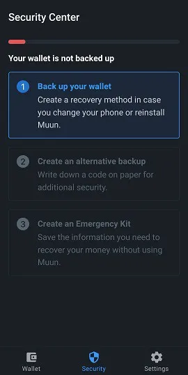
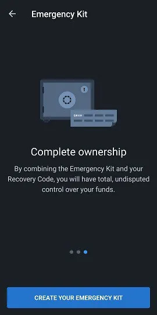
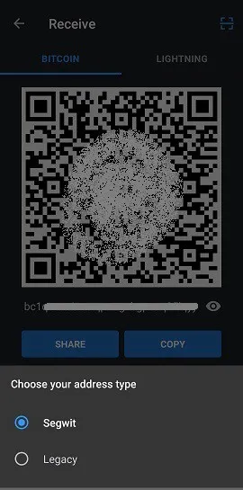
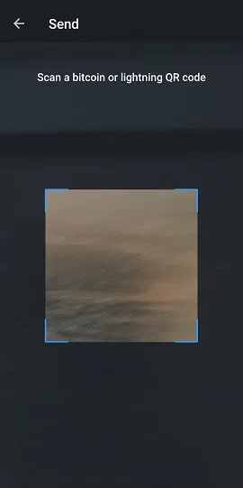
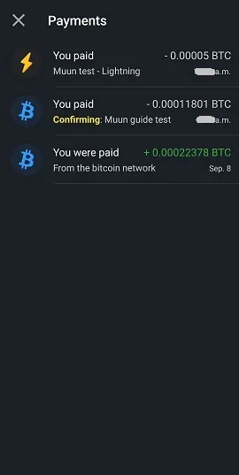

Muun (https://muun.com/) je peněženka s vlastní správou pro bitcoin a lightning.

## video tutoriál

## Muun Peněženka - Kompletní uživatelská příručka

Kompletní uživatelská příručka (s obrázky) pro aplikaci Muun; uživatelsky přívětivá mobilní Bitcoin peněženka, která vám umožňuje provádět transakce na Lightning Network.

### Stáhněte si Muun a vytvořte svou peněženku

Nejprve musíte stáhnout mobilní aplikaci, která je dostupná jak pro iOS, tak pro Android. Vždy se ujistěte, že stahujete správnou verzi. Na trhu se někdy objevují podvodné repliky. Doporučuji najít oficiální webové stránky peněženky Muun, které jsou https://muun.com/, a použít odkaz pro váš vybraný systém (iOS/Android), odtud můžete být jisti, že používáte oficiální aplikaci.

Když aplikaci otevřete, budete mít možnost vytvořit novou peněženku nebo obnovit již existující. Začněme vytvořením nové peněženky. Kroky pro obnovu peněženky ukážu později. Stiskněte "Vytvořit novou peněženku".

Peněženka Muun vás poté požádá o vytvoření čtyřmístného osobního identifikačního čísla (PIN). S PINem zvyšujete bezpečnost své peněženky pro případ, že by například zlovolný útočník ukradl váš telefon a tím i vaše bitcoiny.

A je to, aplikace vygenerovala zcela novou peněženku, která se nyní stane domovskou stránkou. Nyní je potřeba zabezpečit relevantní informace pro obnovu peněženky před odesláním jakýchkoli prostředků na ni, jelikož by to byla riskantní praxe.

### Zálohování klíče

Stiskněte pole "Zálohovat vaši peněženku" a budete přesměrováni na záložku "Bezpečnost". Proces zálohování Muun je pohodlně rozdělen do tří kroků. Není povinné dokončit všechny tři kroky, ale jejich kombinace nabízí maximální opatrnost.

První možnost vám umožňuje propojit vaši peněženku s e-mailovou adresou, kromě její ochrany heslem. Tato možnost je volitelná a bez problémů ji můžete přeskočit. Pokud ji chcete použít, stiskněte "1: Zálohovat vaši peněženku" a poté "Začít" na další obrazovce a zadejte e-mailovou adresu. Další obrazovka vám řekne, že musíte ověřit e-mail přístupem do vaší poštovní schránky a kliknutím na odkaz poskytnutý v e-mailu od Muun.

Jakmile je e-mail ověřen, budete vyzváni k vytvoření hesla. Poté budete muset zaškrtnout dva boxy, které naznačují, že chápete, že obnova peněženky, pokud bude nutná, bude vyžadovat použití e-mailu a hesla, které jste právě zvolili. To se liší od tradičních programů, které umožňují resetovat heslo v případě ztráty nebo zapomenutí, takže se ujistěte, že jste si vše poznamenali.

Záložka "Bezpečnost" nyní ukazuje, že máte základní zálohu. Nyní se můžete vrátit na záložku "Peněženka" a používat aplikaci k dokončení transakcí (tyto funkce budou podrobněji popsány později v této příručce), vědě, že peněženka je nyní obnovitelná. Doporučuji však použít bezpečnostní možnost č. 2 pro generování dalšího zálohovacího kódu, pro případ, že by heslo zadané v možnosti č. 1 bylo ohroženo nebo pokud byste raději nepoužívali možnost obnovy e-mailem.

Alternativní možnost zálohy od Muun je podobná mnemonické frázi, kterou používá mnoho aplikací peněženek a kterou zná mnoho uživatelů Bitcoinu. Stiskněte "Start" pro zobrazení vašeho obnovovacího kódu a zapište si ho na kus papíru (aplikace na stránce zobrazující kód zakáže snímek obrazovky). Jakmile si kód poznamenáte, porovnejte ho s kódem zobrazeným na obrazovce, protože ho budete muset v aplikaci znovu zadat, abyste potvrdili jeho platnost.
Muun vás znovu požádá, abyste potvrdili, že rozumíte tomu, že tento 32znakový kód budete potřebovat v případě, že ztratíte dříve nastavené heslo.

Záloha peněženky je nyní podle moderních standardů, které známe, výrazně zabezpečena. Aplikace Muun ovšem nabízí třetí možnost zabezpečení nazvanou "Emergency Kit". Vytvoření Emergency Kitu vám umožní obnovit vaši peněženku bez nutnosti použití Muun. Jinými slovy, můžete použít jiný software Bitcoin peněženky než Muun.

Po stisknutí "Create an Emergency Kit" vám bude vysvětleno, že tento kit má formu PDF dokumentu obsahujícího informace a instrukce týkající se samostatného převodu vašich prostředků. Kit může být bez obav uložen v cloudu, protože k jeho použití je potřeba váš "Recovery Code", který v dokumentu není zahrnut. Přejeďte prstem po obrazovce pro přístup na stránku pro vytvoření kitu.

Máte k dispozici tři možnosti:

- Uložit do cloudu vašeho účtu Google.
- Poslat email na vaši vlastní adresu pro zálohu vašeho kitu a přístup k němu.
- Ruční záloha pomocí lokální aplikace na vašem zařízení.

Ujistěte se, že máte přístup k vašemu kitu, jakmile ho pošlete na vybrané místo zálohy, protože Muun vás poté požádá, abyste pro ověření zadali šestimístný kód nalezený v kitu.

Jakmile je tento poslední krok dokončen, konfigurace zabezpečení a obnovy vaší peněženky je nyní hotova. Nyní prozkoumáme různé způsoby, jak obnovit vaši peněženku pomocí čerstvě vytvořených záloh.
Obnova peněženky

Existuje mnoho scénářů, kdy uživatel může dočasně ztratit přístup k své peněžence a prostředkům; ztráta zařízení, odinstalovaná/chybějící aplikace, zapomenuté osobní identifikační číslo, odpojení peněženky atd. Je proto nezbytné vědět, jak tento přístup znovu získat. Při obnově prostřednictvím aplikace Muun stiskněte na úvodní obrazovce možnost "I Already Have A Wallet".

### Obnova pomocí emailové adresy

Pokud jste použili možnost zálohy #1 od Muun, zadejte emailovou adresu, která byla v té době vybrána. Jelikož je tato možnost volitelná, můžete místo toho pokračovat také s obnovovacím kódem, což je možnost #2 nabízená Muunem. Nejprve se podívejme na možnost přes email.

Jakmile zadáte svou emailovou adresu, Muun vás informuje, že vám byl poslán email a že je potřeba ho otevřít pro autorizaci obnovy peněženky. Zkontrolujte svou poštovní schránku (včetně sekce spam) a použijte odkaz poskytnutý v emailu od Muun. Budete přesměrováni do aplikace, kde obrazovka nyní požádá o zadání hesla spojeného s registrovanou emailovou adresou.

Posledním krokem je vytvoření osobního identifikačního čísla, a poté se vrátíte na domovskou stránku peněženky, která zobrazuje s ní spojený zůstatek.

### Použití "Recovery Code"
Při obnově přístupu k existující peněžence můžete zvolit použití obnovovacího kódu ("Recovery Code" jak je označen Muun), který jste si dříve poznamenali, pokud jste si vybrali možnost zálohy č. 2.
Tento proces je podobný tomu, který je podrobně popsán v předchozí sekci; obnova pomocí e-mailu. Jednoduše zvolte možnost "Obnovit pomocí obnovovacího kódu" a zadejte jej do příslušných polí zobrazených na obrazovce. Pokud je vaše peněženka zálohována také e-mailem kromě obnovovacího kódu, Muun vás požádá, abyste zkontrolovali svou poštovní schránku a autorizovali proces obnovy, který můžete dokončit po návratu do aplikace po kliknutí na poskytnutý odkaz. Opět musíte vytvořit osobní identifikační číslo. A máte to, znovu budete mít přístup k vaší peněžence.

### Obnova pomocí nouzového kitu

Pro obnovu vaší peněženky bez použití aplikace Muun Wallet budete potřebovat váš nouzový kit, třetí možnost obnovy nabízenou Muun. Tato možnost vám umožňuje poslat prostředky držené ve vaší peněžence Muun na jakoukoli jinou Bitcoinovou adresu. Takže se ujistěte, že máte alternativní peněženku, která dokáže vygenerovat adresu, na kterou pošlete prostředky.

Přistupte k PDF dokumentu, který jste si uložili při vytváření kitu. Tento dokument obsahuje instrukce potřebné k obnově vaší peněženky. Všimněte si, že tato funkce vyžaduje použití stolního nebo přenosného počítače, protože budete potřebovat stáhnout skript vytvořený vývojovým týmem Muun. Odkaz je zahrnut v e-mailu, ale stejně ho zde sdílím: https://github.com/muun/recovery

Nouzový kit je vybaven ověřovacím kódem, který jste již použili k potvrzení vytvoření kitu, stejně jako dvěma klíči. Klíče budou potřebné, když aktivujete skript obnovy Muun. Takže se ujistěte, že je máte po ruce během operace.

Zde je překlad instrukcí:

Tento nouzový postup vám pomůže obnovit vaše prostředky, pokud nemůžete používat Muun na vašem zařízení.

1. Najděte svůj obnovovací kód

Tento kód jste si napsali na kus papíru před vytvořením vašeho nouzového kitu. Budete ho později potřebovat.

2. Stáhněte nástroj pro obnovu

Přejděte na stránku https://github.com/muun/recovery a stáhněte nástroj do svého počítače.

3. Obnovte své prostředky

Spusťte nástroj pro obnovu a postupujte podle kroků. Nástroj převede vaše prostředky na Bitcoinovou adresu podle vašeho výběru.

Jakmile jste ve skriptu, stačí zadat požadované informace na obrazovce. Skript se postará o proces převodu prostředků za vás. Na stránce "github" uvedené výše je k dispozici animované video procesu, které vám přesně ukáže, co očekávat, když spustíte skript obnovy.

## Přijímání transakcí

### Záložka Bitcoin

Nyní se budeme věnovat sekci "Přijmout" peněženky Muun a jejím různým funkcím. Domovská stránka vaší aplikace je záložka "Peněženka". Váš zůstatek je zobrazen uprostřed a můžete na něj klepnout, abyste přepnuli mezi skrytím částky a jejím zobrazením. Všechna nastavení aplikace probereme později v tomto článku. Prozatím stiskněme "Přijmout", abychom prozkoumali tuto funkci.

Na této stránce si můžete vybrat přijetí transakce jak v síti Bitcoin, tak v síti Lightning. Zobrazí se nová adresa (a příslušný QR kód) odpovídající vybrané síti. Ve výchozím nastavení se při příchodu na obrazovku "Přijmout" zobrazí adresa Bitcoinu. Klepnutím na QR kód se adresa zkopíruje do schránky vašeho zařízení. Adresu můžete snadno sdílet přímo do jiných aplikací pomocí tlačítka "Sdílet" a adresu můžete také zkopírovat pomocí tlačítka "Kopírovat". Stisknutím ikony oka na konci adresy se zobrazí celá adresa, což vám umožní porovnat ji s tou, která byla zkopírována do schránky při sdílení.

Tyto informace obsahují vše, co potřebujete k přijetí transakcí v síti Bitcoin. Kromě toho vám Muun nabízí některé možnosti přizpůsobení v menu "Nastavení adresy". Za prvé, můžete přidat částku do popisu adresy. Za druhé, můžete si vybrat použití adresy Segwit (výchozí možnost) nebo tradiční adresy (legacy).

Stisknutím "Přidat +" můžete k adrese přidat konkrétní částku, což usnadní odesílající straně. Tato možnost je nepovinná. Všimněte si, že jakmile je částka zadána, tlačítko "Kopírovat" na předchozí stránce přidá informace do zkopírované adresy ("bitcoin:" jako předpona, následovaná částkou jako přípona). Aby se předešlo nutnosti toto improvizovaně upravovat, stiskněte přímo QR kód pro zkopírování adresy. Informace o částce zůstanou s ní spojeny. Kromě toho aplikace umožňuje zvolit zadání částky ve měně vašeho výběru, což zjednodušuje proces konverze na BTC.

Pokud jde o výběr typu adresy, Segwit nebo Legacy, doporučuji ponechat Segwit. Tento typ adresy (začínající na "bc1") snižuje velikost dat transakce a tím i s ní spojené transakční poplatky. Nicméně je možné, že budete muset použít systém "Legacy" (adresa začínající na "3") v případě, že peněženka nebo software není kompatibilní s adresami Segwit. Je tedy důležité vědět, jak rozlišit mezi oběma typy.

## Záložka Lightning

Pro přijetí transakcí prostřednictvím sítě Lightning je třeba klepnout na záložku se stejným názvem v horní části obrazovky. Nyní se zobrazí QR kód obsahující adresu Lightning, kterou můžete kopírovat a sdílet stejným způsobem jako adresy Bitcoinu zmíněné dříve v tomto průvodci. Připomínám, že síť Lightning vám umožňuje těšit se téměř okamžité rychlosti transakce navíc k transakčním poplatkům, které jsou zlomkem těch v řetězci Bitcoin.

Možnosti přizpůsobení lze nalézt v menu "Nastavení faktury". Zde můžete upravit částku spojenou s adresou klepnutím na "Přidat +". Na základě mé zkušenosti se sítí Lightning se domnívám, že je lepší zadat částku při vytváření transakce, protože několik peněženek nereaguje dobře na prázdné faktury. Také si všimnete, že v tomto menu je časovač expirace. V této aplikaci je časovač nastaven na 60 minut, po kterých adresa ztratí platnost. Všimněte si, že Muun generuje novou adresu Lightning pokaždé, když změníte částku nebo když opustíte a vrátíte se na stránku.

## Použití funkce LNURL
Peněženka Muun nabízí možnost použít LNURL pro přijímání transakcí. Tato funkce, která je aktivována klepnutím na čtvercový skenovací symbol umístěný v pravém horním rohu stránky, má několik výhod, včetně vyhnutí se nutnosti sdílet fakturu pro přijetí transakce. Místo toho stačí naskenovat QR kód, abyste obdrželi informace o platbě, které pak můžete ověřit a potvrdit proces transakce.

Muun vám nejprve ukáže vysvětlující stránku (viz screenshot výše) a poté vás požádá o povolení vstupu kamery vašeho zařízení, což je nezbytný krok pro použití aplikace. Vezměte prosím na vědomí, že adresy LNURL momentálně nejsou podporovány všemi Lightning peněženkami. Ty, které ji podporují, obvykle nabízejí možnost použít LNURL pouze pro přijímání transakcí, nikoli pro jejich odesílání.

## Odesílání transakcí

### Přes síť Bitcoin

Nyní, když jsme viděli, jak přijímat bitcoiny s Muun, pojďme prozkoumat, jak je odesílat. Zpět na domovské stránce pod záložkou "Peněženka" budete muset stisknout "Odeslat". Nyní se objeví jednoduchá stránka, kde budete mít možnost zkopírovat adresu Bitcoinu nebo Lightning do určeného pole nebo stisknout ikonu QR kódu vpravo od tohoto pole k aktivaci kamery a naskenování adresy ve formě QR kódu.

Když dorazíte na stránku "Odeslat", pokud už máte na zařízení zkopírovanou adresu, Muun rozpozná formát adresy (Bitcoin nebo Lightning) a navrhne její použití pro vysílání transakce prostřednictvím rámované zprávy.

Při přípravě Bitcoinové transakce musíte zadat částku k odeslání. Ujistěte se, že adresa zobrazená v horní části obrazovky odpovídá dříve zkopírované adrese. Pod částkou k odeslání Muun zobrazuje zůstatek vaší peněženky a nabízí možnost použít všechny vaše prostředky, což je velmi užitečná funkce, pokud chcete peněženku zcela vyprázdnit a vyhnout se ponechání "prachu" (několik satoshi).

Po potvrzení částky k odeslání vás Muun na další stránce požádá, abyste napsali poznámku. To slouží jako další ověření, a můžete napsat cokoli chcete, ať už je to relevantní nebo ne.

Před konečným vysíláním je nutný konečný přehled detailů transakce. Ověřte zadanou adresu a částku, poté si přizpůsobte poplatky za transakci podle potřeby stisknutím modré ikony tužky vpravo od "Network fee". Porozumění základům fungování poolu Bitcoinových transakcí (mempool) je dobrá vzdělávací zkušenost, která by vám mohla ušetřit mnoho satoshi v průběhu času!

Software Muun ve výchozím nastavení implementuje algoritmus, který vypočítává potřebné poplatky za transakci pro potvrzení do 30 minut nebo méně. To bude zobrazeno, když se pokusíte upravit poplatky za transakci. Tlačítko "Enter Fee Manually" vám umožní sami si tento detail přizpůsobit, což je funkce, která může být velmi užitečná, pokud potřebujete rychlejší potvrzení nebo naopak, pokud máte širokou manévrovací rezervu.

Pokud se rozhodnete zadat částku poplatku za transakci sami, dostanete se na novou stránku, která udává částku, kterou je třeba zadat v sat/vbyte (satoshi za virtuální bajt). Muun dokonce zobrazuje odhad času potvrzení spojeného s vybranou částkou, stejně jako náklady v BTC a fiat měně dle vašeho výběru.

Vraťte se na stránku s přehledem detailů transakce a stiskněte "Odeslat". A voilà, vaše transakce je vysílána do sítě Bitcoin! Budete přesměrováni na domovskou stránku peněženky, kde uvidíte odečet z vašeho zůstatku. Na spodní části obrazovky je šipka, kterou můžete stisknout pro prohlížení historie vašich transakcí. Transakce, kterou jste právě provedli, bude přidána na počátek jejího vydání.

Stiskněte záznam pro zobrazení detailů konkrétní transakce. Vaše transakce bude potvrzena, když těžař přidá nový blok obsahující ji do řetězce. Muun sdílí ID transakce na spodní části obrazovky, což vám umožňuje zkontrolovat stav vaší transakce na block exploreru.

## Přes Lightning Network

Nyní použijme fakturu Bolt 11 (tradiční/výchozí faktura Lightning) pro provedení transakce. Zkopírujte nebo naskenujte Lightning adresu na stránce "Odeslat". Budete přesměrováni na novou stránku, která vám ukáže detaily aktuální faktury. Budou zobrazeny částky transakce (včetně poplatků za síť), spolu s poznámkou nebo popisem napsaným na faktuře, a časovačem expirace na spodku. Všimněte si, že poplatky za transakce nelze pro Lightning transakce upravit. Jsou určeny trasou kanálů, kterými musí projít, aby dosáhly příjemce.

(Zde je varování zobrazené na obrazovce při použití prázdné faktury, což znamená, že nemá předvyplněnou částku. Některé peněženky podporují tento typ faktury a umožňují vám upravit částku sami. To není případ pro Muun.)

Stisknutím ikony oka uvidíte detaily Lightning uzlu, se kterým v této transakci jednáte. Máte dokonce možnost zobrazit web explorer pro více informací. To je dobrý příklad technické abstrakce dosažené Muunem.

Jakmile stisknete "Odeslat", vaše transakce bude spuštěna a obvykle dokončena za zlomek sekundy. Odečtená částka bude viditelná na domovské stránce aplikace. Vraťte se do historie transakcí, abyste viděli okamžité potvrzení platby.

Všimněte si, že v historii jsou transakce Lightning & Bitcoin rozlišeny různými symboly. Pro zobrazení detailů Lightning transakce na ní klepněte na obrazovce historie.

## Nastavení aplikace

Třetí záložka na domovské stránce, "Nastavení", je místo, kde najdete nastavení aplikace. Tato stránka je překvapivě krátká, zejména ve srovnání s jinými populárními mobilními peněženkami. Podle mého názoru to není nevýhoda; naopak, vidím to jako výhodu z hlediska jednoduchosti.

V obecné kategorii si můžete vybrat preferovanou jednotku účtu a měnu, stejně jako vzhledové téma aplikace (tmavé nebo světlé), které bude původně určeno na základě systému vašeho zařízení.

Pro jednotku účtu aplikace si vyberte mezi Bitcoin (BTC) nebo Satoshi (SAT). Jen pro vaši informaci, Satoshi je nejmenší zlomek bitcoinu, což je osmá desetinná místa (1 SAT = 0.00000001 BTC). Označování peněženky v Satoshis je často preferováno při primárním používání sítě Lightning s malými částkami.

Muun nabízí široký výběr měn, což vám usnadňuje nalezení potřebné konverze BTC pro vaše transakční a/nebo osobní potřeby.
Pokud je nutné změnit heslo pro obnovu vaší peněženky, můžete tak učinit na stránce nastavení. Ujistěte se, že máte své aktuální heslo nebo obnovovací kód a přístup k vašemu emailu.

Zadejte své aktuální heslo nebo zvolte možnost zadat obnovovací kód pro zahájení resetování. Muun pošle email na dříve zaregistrovanou adresu.

V sekci pokročilá nastavení se nachází dvě položky: Bitcoinová síť a Lightningová síť. V Bitcoinové síti máme možnost povolit přijímací adresy Taproot (bc1p, nejnovější typ adresy) jako výchozí.

Uvnitř Lightningové sítě najdete:

- Protokol přijímání: Vyberte výchozí síť pro přijímání zobrazenou na obrazovce Přijmout. Také je k dispozici experimentální funkce, Jednotný, která je QR kódem sjednocující adresy Bitcoinu a Lightningu. Tuto funkci však v současnosti podporuje jen málo softwarů pro Bitcoin.
-
- Turbo kanály: Tato možnost vám umožňuje povolit nebo zakázat funkci Turbo kanálů. Ve výchozím nastavení je povolena.

Abychom pochopili, co se myslí pod Turbo kanály, musíme nejprve vědět, že transakce v Lightningové síti probíhají prostřednictvím kanálů z jednoho uživatele na druhého a že tyto kanály musí být původně financovány transakcí na Bitcoinovém blockchainu.

Turbo kanály vám umožňují začít provádět transakce v Lightningové síti i před tím, než je jakákoli transakce na řetězci potvrzena. Zakázání této funkce znamená, že budete muset čekat podstatně déle, než budete moci provádět transakce v Lightningové síti, výměnou za zvýšenou bezpečnost vašich prostředků, protože jinak musíte důvěřovat, že Muun nebude jednat zákeřně (velmi veřejný double-spend) během čekání na potvrzení vaší transakce na blockchainu.

Na spodku stránky nastavení je možnost "Odhlásit se". Tuto funkci můžete použít, pokud chcete, aby aplikace odpojila aktuálně rozpoznanou peněženku. To vám umožní vytvořit novou peněženku nebo importovat/obnovit stávající.

