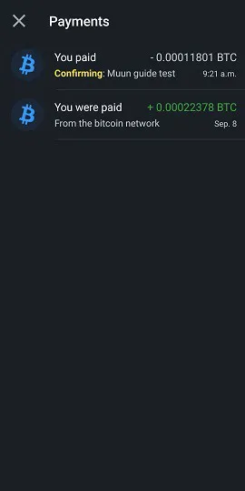

Muun (https://muun.com/) ist eine selbstverwaltete Brieftasche für Bitcoin und Lightning.

## Video-Tutorial

## Muun-Brieftasche - Vollständige Anleitung zur Verwendung

Vollständige Anleitung zur Verwendung (mit Screenshots) der Muun-App; eine benutzerfreundliche mobile Bitcoin-Brieftasche, mit der Sie auf dem Lightning Network handeln können.

### Muun herunterladen und Brieftasche erstellen

Zunächst müssen Sie die mobile App herunterladen, die sowohl für iOS als auch für Android verfügbar ist. Stellen Sie immer sicher, dass Sie die richtige Version herunterladen. Manchmal gibt es betrügerische Nachahmungen auf dem Markt. Ich empfehle Ihnen, die offizielle Website von Muun Wallet zu finden, nämlich https://muun.com/, und den Link für Ihr System (iOS/Android) zu verwenden, um sicherzustellen, dass Sie die offizielle App verwenden.

Beim Öffnen der App haben Sie die Wahl zwischen der Erstellung einer neuen Brieftasche oder der Wiederherstellung einer vorhandenen. Beginnen wir zunächst mit der Erstellung einer neuen Brieftasche. Die Schritte zur Wiederherstellung einer Brieftasche werde ich später erläutern. Drücken Sie auf "Create a new wallet".

Muun Wallet fordert Sie dann auf, eine vierstellige persönliche Identifikationsnummer (PIN) zu erstellen. Mit einer PIN erhöhen Sie die Sicherheit Ihrer Brieftasche, falls beispielsweise jemand Ihr Telefon stiehlt und somit auch Ihre Bitcoins.

Nun hat die App eine brandneue Brieftasche generiert, die nun zur Startseite wird. Sie müssen nun die relevanten Informationen zur Wiederherstellung der Brieftasche sichern, bevor Sie Geld darauf überweisen, da dies ein riskantes Vorgehen wäre.

### Sicherung des Schlüssels

Drücken Sie auf das Feld "Back up your wallet", um zum Tab "Security" weitergeleitet zu werden. Der Sicherungsprozess von Muun ist in drei Schritten ordnungsgemäß angeordnet. Es ist nicht zwingend erforderlich, alle drei Schritte abzuschließen, aber die Kombination von ihnen bietet das höchste Maß an Vorsicht.

Die erste Option ermöglicht es Ihnen, Ihre Brieftasche mit einer E-Mail-Adresse zu verbinden und sie zusätzlich mit einem Passwort zu schützen. Diese Option ist optional und kann problemlos übersprungen werden. Wenn Sie sie verwenden möchten, drücken Sie "1: Sichern Sie Ihre Brieftasche" und dann "Start" auf dem nächsten Bildschirm und geben Sie eine E-Mail-Adresse ein. Auf dem nächsten Bildschirm wird Ihnen mitgeteilt, dass Sie die E-Mail bestätigen müssen, indem Sie auf den entsprechenden Link in der E-Mail von Muun klicken.

Nachdem die E-Mail bestätigt wurde, werden Sie aufgefordert, ein Passwort zu erstellen. Anschließend müssen Sie zwei Kästchen ankreuzen, um zu bestätigen, dass Sie verstehen, dass die Wiederherstellung der Brieftasche, falls erforderlich, die Verwendung der E-Mail-Adresse und des gerade gewählten Passworts erfordert. Dies steht im Gegensatz zu herkömmlichen Programmen, die Ihnen die Möglichkeit bieten, Ihr Passwort zurückzusetzen, falls Sie es verlieren oder vergessen, also stellen Sie sicher, dass Sie alles gut notiert haben.

Das Register "Sicherheit" zeigt Ihnen nun an, dass Sie ein Basis-Backup haben. Sie können also zum Register "Brieftasche" zurückkehren und die Anwendung verwenden, um Transaktionen abzuschließen (diese Funktionen werden später in diesem Leitfaden genauer erläutert), wobei die Brieftasche jetzt wiederhergestellt werden kann. Dennoch empfehle ich Ihnen, die Sicherheitsoption #2 zu verwenden, um einen zusätzlichen Sicherungscode zu generieren, falls das Passwort, das Sie in Option #1 eingegeben haben, kompromittiert wird oder Sie die Wiederherstellungsoption per E-Mail nicht verwenden möchten.

Die "Alternative Sicherung" von Muun ähnelt der mnemonischen Phrase, die von vielen Bitcoin-Brieftaschenanwendungen verwendet wird und mit der viele Bitcoin-Benutzer vertraut sind. Drücken Sie "Start", um Ihren Wiederherstellungscode anzuzeigen, und schreiben Sie ihn auf ein Stück Papier (die Anwendung zensiert den Bildschirm, auf dem der Code angezeigt wird). Sobald Sie ihn notiert haben, vergleichen Sie ihn mit dem auf dem Bildschirm angezeigten Code, da Sie ihn dann in der Anwendung erneut eingeben müssen, um seine Gültigkeit zu bestätigen.

Noch einmal fordert Muun Sie auf, Ihr Verständnis für die Bedeutung zu bestätigen, d.h. dass Sie diesen 32-stelligen Code benötigen, falls Sie Ihr zuvor festgelegtes Passwort verlieren.

Die Sicherung der Brieftasche ist nun weitgehend sicher nach den modernen Standards, die wir kennen. Muun bietet jedoch eine dritte Sicherheitsoption namens "Emergency Kit". Durch die Erstellung des Emergency Kits können Sie Ihre Brieftasche wiederherstellen, ohne Muun verwenden zu müssen. Mit anderen Worten, Sie können eine andere Bitcoin-Brieftaschensoftware als Muun verwenden.

Nachdem Sie auf "Create an Emergency Kit" gedrückt haben, wird Ihnen erklärt, dass dieses Kit in Form eines PDF-Dokuments vorliegt, das Informationen und Anweisungen zur unabhängigen Übertragung Ihrer Gelder enthält. Das Kit kann bedenkenlos in der Cloud gespeichert werden, da es Ihren "Recovery Code" benötigt, um verwendet zu werden, der nicht in dem betreffenden Dokument enthalten ist. Scrollen Sie, um zur Kit-Erstellungseite zu gelangen.

Es stehen Ihnen drei Optionen zur Verfügung:

- Speichern Sie es in der Google Cloud Ihres Kontos.
- Senden Sie eine E-Mail an Ihre eigene Adresse, um Ihr Kit zu sichern und darauf zuzugreifen.
- Sichern Sie es manuell mit einer lokalen Anwendung auf Ihrem Gerät.

Stellen Sie sicher, dass Sie auf Ihr Kit zugreifen können, sobald Sie es an Ihren gewählten Sicherungsort gesendet haben, da Muun Sie dann auffordert, zu Validierungszwecken einen sechsstelligen Code einzugeben, der im Kit enthalten ist.

Nach Abschluss dieses letzten Schritts ist Ihre Sicherheits- und Wallet-Wiederherstellungskonfiguration abgeschlossen. Wir werden nun die verschiedenen Möglichkeiten erkunden, Ihre Wallet mithilfe der gerade erstellten Backups wiederherzustellen.
Wallet-Wiederherstellung

Es gibt viele Szenarien, in denen ein Benutzer vorübergehend den Zugriff auf seine Wallet und seine Gelder verlieren kann: Verlust des Geräts, Deinstallation/Verschwinden der Anwendung, vergessene persönliche Identifikationsnummer, Trennung von der Wallet usw. Es ist daher unerlässlich zu wissen, wie man diesen Zugriff wiederherstellen kann. Bei der Wiederherstellung über die Muun-App wählen Sie die Option "I Already Have A Wallet" auf dem Startbildschirm.

### Wiederherstellung mit E-Mail-Adresse

Wenn Sie die Muun-Backup-Option #1 verwendet haben, geben Sie die damals gewählte E-Mail-Adresse ein. Da diese Option optional ist, können Sie auch wählen, stattdessen mit dem Wiederherstellungscode fortzufahren, der die von Muun angebotene Option #2 ist. Lassen Sie uns zuerst die Option per E-Mail überfliegen.

Nachdem Sie Ihre E-Mail-Adresse eingegeben haben, teilt Ihnen Muun mit, dass Ihnen eine E-Mail gesendet wurde und dass Sie darauf zugreifen müssen, um die Wallet-Wiederherstellung zu autorisieren. Überprüfen Sie Ihren Posteingang (einschließlich des Spam-Ordners) und verwenden Sie den in der E-Mail von Muun bereitgestellten Link. Sie werden zur App weitergeleitet, wo Sie nun Ihr Passwort für die angegebene E-Mail-Adresse eingeben müssen.

Der letzte Schritt besteht darin, eine persönliche Identifikationsnummer zu erstellen. Anschließend befinden Sie sich wieder auf der vertrauten Startseite der Wallet, die Ihnen den damit verbundenen Saldo anzeigt.

### Verwendung des "Wiederherstellungscodes"

Bei der Wiederherstellung des Zugriffs auf eine bestehende Brieftasche können Sie sich dafür entscheiden, den zuvor notierten Wiederherstellungscode (wie von Muun bezeichnet) zu verwenden, wenn Sie sich für die Sicherungsoption #2 entschieden haben.

Dieser Prozess ähnelt dem in dem vorherigen Abschnitt beschriebenen Wiederherstellungsprozess per E-Mail. Wählen Sie einfach die Option "Mit Wiederherstellungscode wiederherstellen" und geben Sie diesen in die entsprechenden Felder auf dem Bildschirm ein. Wenn Ihre Brieftasche zusätzlich zur Wiederherstellungscodesicherung auch per E-Mail gesichert ist, wird Muun Sie auffordern, Ihren Posteingang zu überprüfen, um den Wiederherstellungsprozess zu autorisieren. Diesen können Sie abschließen, indem Sie auf den bereitgestellten Link klicken, nachdem Sie zur Anwendung zurückgekehrt sind. Auch diesmal müssen Sie eine persönliche Identifikationsnummer erstellen. Voilà, Sie haben wieder Zugriff auf Ihre Brieftasche.

### Wiederherstellung mit dem Emergency Kit

Um Ihre Brieftasche ohne die Verwendung der Muun Wallet-Anwendung wiederherzustellen, benötigen Sie Ihr Emergency Kit, die dritte von Muun angebotene Wiederherstellungsoption. Mit dieser Option können Sie die in Ihrer Muun-Brieftasche gehaltenen Gelder an eine beliebige andere Bitcoin-Adresse senden. Stellen Sie daher sicher, dass Sie eine alternative Brieftasche haben, die eine Adresse generieren kann, an die Sie die Gelder senden können.

Greifen Sie auf das PDF-Dokument zu, das Sie beim Erstellen des Kits gesichert haben. Dieses Dokument enthält die erforderlichen Anweisungen zur Wiederherstellung Ihrer Brieftasche. Beachten Sie, dass diese Funktion die Verwendung eines Desktop- oder Laptop-Computers erfordert, da Sie ein von Muuns Entwicklungsteam erstelltes Skript herunterladen müssen. Der Link ist in der E-Mail enthalten, aber ich teile ihn hier trotzdem mit: https://github.com/muun/recovery

Das Emergency Kit enthält einen Überprüfungscode, den Sie bereits zur Bestätigung der Kit-Erstellung verwendet haben, sowie zwei Schlüssel. Die Schlüssel werden benötigt, wenn Sie das Muun-Wiederherstellungsskript aktivieren. Stellen Sie daher sicher, dass Sie sie während des Vorgangs griffbereit haben.

Hier ist die Übersetzung der Anweisungen:

Dieses Notfallverfahren hilft Ihnen, Ihre Gelder wiederherzustellen, wenn Sie Muun auf Ihrem Gerät nicht verwenden können.

1. Finden Sie Ihren Wiederherstellungscode

Sie haben diesen Code auf einem Stück Papier notiert, bevor Sie Ihr Emergency Kit erstellt haben. Sie werden ihn später benötigen.

2. Laden Sie das Wiederherstellungstool herunter

Gehen Sie zur Seite https://github.com/muun/recovery und laden Sie das Tool auf Ihren Computer herunter.

3. Holen Sie sich Ihre Gelder zurück

Führen Sie das Wiederherstellungstool aus und folgen Sie den Schritten. Das Tool wird Ihre Gelder an eine von Ihnen gewählte Bitcoin-Adresse übertragen.

Einmal im Skript, müssen Sie nur die auf dem Bildschirm angeforderten Informationen eingeben. Das Skript übernimmt den Vorgang der Geldüberweisung für Sie. Auf der oben angegebenen "github"-Seite steht ein animiertes Video des Vorgangs zur Verfügung, das Ihnen genau zeigt, was Sie erwartet, wenn Sie das Wiederherstellungsskript starten.

## Transaktionen empfangen

### Bitcoin-Tab

Wir werden nun den Abschnitt "Empfangen" der Muun-Brieftasche und seine verschiedenen Funktionen behandeln. Die Startseite Ihrer Anwendung ist der "Wallet"-Tab. Ihr Kontostand wird in der Mitte angezeigt und Sie können darauf tippen, um zwischen der Ausblendung und Anzeige des Betrags zu wechseln. Wir werden später in diesem Artikel alle Anwendungseinstellungen überfliegen. Im Moment drücken wir auf "Empfangen", um diese Funktion zu erkunden.

Auf dieser Seite können Sie wählen, ob Sie eine Transaktion sowohl im Bitcoin- als auch im Lightning-Netzwerk empfangen möchten. Eine neue Adresse (und der dazugehörige QR-Code) für das gewünschte Netzwerk wird angezeigt. Standardmäßig wird eine Bitcoin-Adresse auf dem "Empfangen"-Bildschirm angezeigt. Durch Tippen auf den QR-Code wird die Adresse in die Zwischenablage Ihres Geräts kopiert. Sie können die Adresse einfach über die Schaltfläche "Teilen" direkt an andere Apps senden und Sie können die Adresse auch mit der Schaltfläche "Kopieren" kopieren. Durch Tippen auf das Augensymbol am Ende der Adresse wird diese vollständig angezeigt, sodass Sie sie mit der in der Zwischenablage kopierten Adresse vergleichen können, wenn Sie sie teilen.

Diese Informationen enthalten alles, was Sie benötigen, um Transaktionen im Bitcoin-Netzwerk zu empfangen. Darüber hinaus bietet Muun Ihnen unter dem Menüpunkt "Adress-Einstellungen" einige Anpassungsoptionen. Erstens können Sie einen Betrag zur Beschreibung der Adresse hinzufügen. Zweitens können Sie wählen, ob Sie eine Segwit-Adresse (die Standardoption) oder eine traditionelle Adresse (legacy) verwenden möchten.

Durch Drücken von "Hinzufügen +" können Sie einen bestimmten Betrag zur Adresse hinzufügen, um es dem sendenden Teilnehmer zu erleichtern. Diese Option ist optional. Beachten Sie, dass sobald ein Betrag eingetragen ist, die Schaltfläche "Kopieren" auf der vorherigen Seite Informationen zur kopierten Adresse hinzufügt ("bitcoin:" als Präfix und dann den Betrag als Suffix). Um dieses unerwartete Verhalten zu vermeiden, drücken Sie direkt auf den QR-Code, um die Adresse zu kopieren. Die Betragsinformation bleibt dabei erhalten. Außerdem können Sie in der Anwendung auswählen, den Betrag in der von Ihnen gewählten Währung einzutragen, um den Umrechnungsprozess in BTC zu vereinfachen.

En Bezug auf die Auswahl des Adresstyps, Segwit oder Legacy, empfehle ich, Segwit beizubehalten. Dieser Adresstyp (beginnend mit "bc1") reduziert die Größe der Transaktionsdaten und damit die damit verbundenen Transaktionsgebühren. Es kann jedoch sein, dass Sie das "Legacy" -System (Adresse beginnt mit "3") verwenden müssen, wenn eine Brieftasche oder Software nicht mit Segwit-Adressen kompatibel ist. Es ist daher wichtig, den Unterschied zwischen den beiden Typen zu kennen.

## Lightning-Tab

Um Transaktionen über das Lightning-Netzwerk zu empfangen, müssen Sie auf den gleichnamigen Tab oben auf dem Bildschirm tippen. Es wird nun ein QR-Code mit einer Lightning-Adresse angezeigt, den Sie genauso kopieren und teilen können wie die zuvor in diesem Leitfaden erwähnten Bitcoin-Adressen. Ich möchte Sie daran erinnern, dass das Lightning-Netzwerk Ihnen ermöglicht, nahezu sofortige Transaktionen durchzuführen und die Transaktionsgebühren im Vergleich zur Bitcoin-Blockchain zu reduzieren.

Die Anpassungsoptionen finden Sie im Menü "Rechnungseinstellungen". Hier können Sie den mit der Adresse verknüpften Betrag ändern, indem Sie auf "Hinzufügen +" tippen. Basierend auf meiner Erfahrung mit dem Lightning-Netzwerk empfehle ich, bei der Erstellung der Transaktion einen Betrag einzugeben, da viele Brieftaschen nicht gut auf leere Rechnungen reagieren. Sie werden auch feststellen, dass es einen Ablauf-Timer in diesem Menü gibt. In dieser Anwendung ist der Timer auf 60 Minuten eingestellt, nach denen die Adresse ungültig wird. Beachten Sie, dass Muun jedes Mal, wenn Sie den Betrag ändern oder die Seite verlassen und zurückkehren, eine neue Lightning-Adresse generiert.

## Verwendung der LNURL-Funktion

Die Muun-Brieftasche bietet die Möglichkeit, LNURL zum Empfangen von Transaktionen zu verwenden. Diese Funktion wird aktiviert, indem Sie auf das Quadrat-Symbol oben rechts auf der Seite tippen. Sie hat einige Vorteile, darunter die Möglichkeit, keine Rechnung zum Empfangen einer Transaktion teilen zu müssen. Stattdessen müssen Sie einen QR-Code scannen, um die Zahlungsinformationen zu erhalten, die Sie dann überprüfen und den Transaktionsprozess bestätigen können.

Muun zeigt Ihnen zunächst eine erklärende Seite (siehe obige Bildschirmaufnahme) und bittet Sie dann, die Kamera Ihres Geräts zu aktivieren, was für die Verwendung der Anwendung erforderlich ist. Beachten Sie, dass LNURL-Adressen derzeit nicht von allen Lightning-Brieftaschen unterstützt werden. Diejenigen, die es unterstützen, bieten in der Regel nur die Möglichkeit, LNURL zum Empfangen von Transaktionen zu verwenden, nicht zum Senden.

## Transaktionen senden

### Über das Bitcoin-Netzwerk

Jetzt, da wir gesehen haben, wie man mit Muun Bitcoins empfängt, schauen wir uns an, wie man sie sendet. Gehen Sie zurück zur Startseite unter dem Tab "Wallet" und drücken Sie auf "Senden". Eine einfache Seite wird angezeigt, auf der Sie entweder eine Bitcoin- oder Lightning-Adresse in das dafür vorgesehene Feld kopieren oder auf das QR-Code-Symbol rechts neben diesem Feld drücken können, um die Kamera zu aktivieren und eine Adresse als QR-Code zu scannen.

Wenn Sie auf die Seite "Senden" gelangen und bereits eine Adresse auf Ihrem Gerät kopiert haben, erkennt Muun das Format der Adresse (Bitcoin oder Lightning) und schlägt Ihnen über eine eingerahmte Nachricht vor, diese Adresse für eine Transaktion zu verwenden.

Bei der Vorbereitung einer Bitcoin-Transaktion müssen Sie den Betrag angeben, den Sie senden möchten. Stellen Sie sicher, dass die Zieladresse oben auf dem Bildschirm mit der zuvor kopierten Adresse übereinstimmt. Unter dem zu sendenden Betrag zeigt Muun den Kontostand Ihrer Brieftasche an und bietet Ihnen die Möglichkeit, alle Ihre Mittel zu verwenden ("Alle Mittel verwenden"), eine sehr nützliche Funktion, wenn Sie Ihre Brieftasche vollständig leeren möchten, um "Staub" (einige Satoshis) zu vermeiden.

Nachdem Sie den zu sendenden Betrag bestätigt haben, fordert Muun Sie auf der nächsten Seite auf, eine Notiz zu schreiben. Dies dient als zusätzliche Bestätigung, und Sie können schreiben, was Sie wollen, ob relevant oder nicht.

Bevor Sie die Transaktion endgültig senden, ist es wichtig, die Details der Transaktion zu überprüfen. Bestätigen Sie die angegebene Adresse und den Betrag und passen Sie bei Bedarf die Transaktionsgebühren an, indem Sie auf das blaue Stiftsymbol rechts neben "Netzwerkgebühr" drücken. Ein grundlegendes Verständnis des Bitcoin-Transaktionspools (Mempool) kann eine gute Lernerfahrung sein und Ihnen im Laufe der Zeit viele Satoshis sparen!

Muun implementiert standardmäßig in seiner Software einen Algorithmus, der die erforderlichen Transaktionsgebühren für eine Bestätigung innerhalb von 30 Minuten oder weniger berechnet. Dies wird angezeigt, wenn Sie versuchen, die Transaktionsgebühren zu ändern. Die Schaltfläche "Gebühr manuell eingeben" ermöglicht es Ihnen, dieses Detail selbst anzupassen, was praktisch ist, wenn Sie eine schnellere Bestätigung benötigen oder wenn Sie einen großen Spielraum haben.

Indem Sie sich dafür entscheiden, den Transaktionsbetrag selbst einzugeben, werden Sie zu einer neuen Seite weitergeleitet, auf der der Betrag in sat/vbyte (Satoshis pro virtuellem Byte) angegeben ist. Muun zeigt Ihnen sogar eine Schätzung der Bestätigungszeit für den gewählten Betrag an, sowie die Kosten in BTC und der von Ihnen gewählten Fiat-Währung.

Gehen Sie zurück zur Übersichtsseite der Transaktionsdetails und drücken Sie "Senden". Voilà, Ihre Transaktion wird im Bitcoin-Netzwerk übertragen! Sie werden zur Startseite der Brieftasche weitergeleitet, wo Sie den Abzug von Ihrem Guthaben sehen können. Unten auf dem Bildschirm befindet sich ein Pfeil, auf den Sie drücken können, um Ihre Transaktionshistorie zu überprüfen. Die gerade getätigte Transaktion wird zum Zeitpunkt ihrer Ausgabe hinzugefügt.

Drücken Sie auf einen Eintrag, um die Details einer bestimmten Transaktion einzusehen. Ihre Transaktion wird bestätigt, wenn ein Miner einen neuen Block enthält, der diese Transaktion enthält, zur Blockchain hinzufügt. Muun teilt Ihnen unten auf dem Bildschirm die Transaktions-ID mit, mit der Sie den Status Ihrer Transaktion auf einem Block Explorer überprüfen können.

## Über das Lightning-Netzwerk

Verwenden wir jetzt eine Bolt 11-Rechnung (traditionelle/Standard-Lightning-Rechnung), um eine Transaktion durchzuführen. Kopieren oder scannen Sie eine Lightning-Adresse auf der "Senden"-Seite. Sie werden zu einer neuen Seite weitergeleitet, auf der die Details der aktuellen Rechnung angezeigt werden. Die Transaktionsbeträge werden angezeigt (einschließlich der Netzwerkgebühren), sowie die Notiz oder Beschreibung auf der Rechnung und ein Ablauf-Timer unten. Beachten Sie, dass die Transaktionsgebühren für Lightning-Transaktionen nicht geändert werden können. Sie werden durch den Kanal oder die Kanäle bestimmt, die sie nehmen müssen, um den Empfänger zu erreichen.

(Hier ist die Warnung, die angezeigt wird, wenn eine leere Rechnung verwendet wird, d.h. wenn kein Betrag vorab angegeben ist. Einige Wallets unterstützen diese Art von Rechnungen und ermöglichen es Ihnen, den Betrag selbst anzupassen. Das ist bei Muun nicht der Fall.)

Durch Drücken des Augen-Symbols werden Ihnen die Details des Lightning-Knotens angezeigt, mit dem Sie in dieser Transaktion interagieren. Sie haben sogar die Möglichkeit, einen Web-Explorer für weitere Informationen zu konsultieren. Dies ist ein gutes Beispiel für die technische Abstraktion, die Muun bietet.

Sobald Sie auf "Senden" drücken, wird Ihre Transaktion gestartet und normalerweise innerhalb von Sekunden abgeschlossen. Der bezahlte Betrag wird von Ihrem Guthaben abgezogen, das auf der Startseite der Anwendung sichtbar ist. Gehen Sie zu Ihrem Transaktionsverlauf, um die sofortige Bestätigung der Zahlung zu sehen.

'

Beachten Sie, dass in der Historie Lightning- und Bitcoin-Transaktionen durch ein unterschiedliches Symbol gekennzeichnet sind. Um Details zu einer Lightning-Transaktion anzuzeigen, tippen Sie auf diese in Ihrer Historie.

## App-Einstellungen

Der dritte Tab auf der Startseite, "Einstellungen", ist der Bereich für die App-Einstellungen. Diese Seite ist überraschend kurz, besonders im Vergleich zu anderen beliebten mobilen Wallets. Meiner Meinung nach ist das kein Nachteil, im Gegenteil, ich sehe es eher als Vorteil in Bezug auf Einfachheit.

In der allgemeinen Kategorie können Sie Ihre bevorzugten Einheiteneinstellungen und Währung auswählen, sowie das Erscheinungsbild der App (dunkel oder hell), das anfangs den Modus je nach Einstellung Ihres Geräts übernimmt.

Für die Einheiteneinstellung der App können Sie zwischen Bitcoin (BTC) oder Satoshi (SAT) wählen. Zur Information, ein Satoshi ist der kleinste Bruchteil eines Bitcoins, nämlich die achte Dezimalstelle (1 SAT = 0,00000001 BTC). Die Verwendung von Satoshis als Einheit wird oft bevorzugt, wenn wir hauptsächlich das Lightning-Netzwerk mit kleinen Beträgen nutzen.

Muun bietet eine große Auswahl an Währungen, mit denen Sie die benötigte BTC-Konvertierung für Ihre Transaktions- und/oder persönlichen Bedürfnisse leichter finden können.

Wenn Sie Ihr Wallet-Wiederherstellungspasswort ändern möchten, können Sie dies auf der Einstellungsseite tun. Stellen Sie sicher, dass Sie Ihr aktuelles Passwort oder Ihren Wiederherstellungscode zur Hand haben und Zugriff auf Ihre E-Mail haben.

Geben Sie Ihr aktuelles Passwort ein oder wählen Sie stattdessen Ihren Wiederherstellungscode, um den Reset zu starten. Muun sendet eine E-Mail an die zuvor registrierte Adresse.

Der erweiterte Abschnitt der Einstellungen ("Erweiterte Einstellungen") enthält zwei Eingaben: Bitcoin-Netzwerk und Lightning-Netzwerk. Im Bitcoin-Netzwerk haben wir die Möglichkeit, die Taproot-Receiving-Adressen (bc1p, der neueste Adresstyp) standardmäßig zu aktivieren.

Im Lightning-Netzwerk finden Sie:

- Receiving Protocol: Wählen Sie Ihr Standard-Receiving-Netzwerk auf dem Receive-Bildschirm aus. Eine experimentelle Funktion namens Unified ist ebenfalls verfügbar. Dies ist ein QR-Code, der sowohl Bitcoin- als auch Lightning-Adressen vereint. Allerdings unterstützen derzeit nur wenige Bitcoin-Software diese Funktion.
- Turbo Channels: Diese Option ermöglicht es Ihnen, die Turbo Channels-Funktion ein- oder auszuschalten. Standardmäßig ist sie aktiviert.

Um zu verstehen, was mit Turbo-Kanälen gemeint ist, müssen wir zunächst wissen, dass Lightning-Transaktionen über Kanäle von einem Benutzer zum anderen abgewickelt werden und dass diese Kanäle ursprünglich durch eine Transaktion auf der Bitcoin-Blockchain finanziert werden müssen.
Turbo-Kanäle ermöglichen es, im Lightning-Netzwerk zu handeln, noch bevor eine On-Chain-Transaktion bestätigt wurde. Wenn Sie diese Funktion deaktivieren, müssen Sie deutlich länger warten, um im Lightning-Netzwerk zu handeln, was jedoch zu einer erhöhten Sicherheit Ihrer Mittel führt, da Sie sonst darauf vertrauen müssen, dass Muun nicht bösartig handelt (eine sehr öffentliche Doppelausgabe), während Ihre Transaktion auf der Blockchain bestätigt wird.

Am Ende der Einstellungsseite befindet sich die Option "Abmelden". Sie können diese Funktion verwenden, wenn Sie möchten, dass die Anwendung die derzeit erkannte Brieftasche abmeldet. Dadurch können Sie eine neue Brieftasche erstellen oder eine vorhandene importieren oder wiederherstellen.

