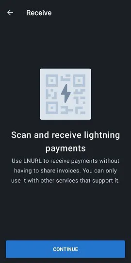
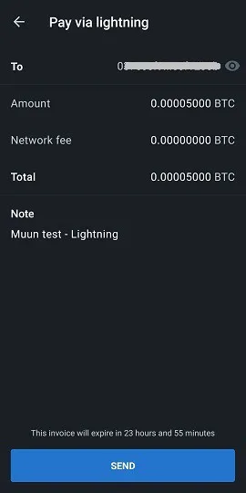

Muun (https://muun.com/) is a self-custodial wallet for bitcoin and lightning.

## video tutorial

## Muun Wallet - Complete User Guide

Complete user guide (with screenshots) for the Muun application; a user-friendly mobile Bitcoin wallet that allows you to transact on the Lightning Network.

### Download Muun and create your wallet

First, you need to download the mobile application, available on both iOS and Android. Always make sure to download the correct version. There are sometimes fraudulent replicas on the market. I recommend finding the official Muun wallet website, which is https://muun.com/, and using the link for your chosen system (iOS/Android), from there you can be certain that you are using the official application.

When you open the application, you will have the option to create a new wallet or recover an existing one. Let's start by creating a new wallet. I will demonstrate the steps for wallet recovery afterwards. Press "Create a new wallet".

Muun wallet then asks you to create a four-digit personal identification number (PIN). With a PIN, you increase the security of your wallet in case, for example, a malicious actor steals your phone and consequently your bitcoins.

There you go, the application has generated a brand new wallet that will now become the home page. Now you need to secure the relevant wallet recovery information before sending any funds to it, as that would be a risky practice.

### Key backup

Press the "Back up your wallet" box, and you will be redirected to the "Security" tab. Muun's backup process is conveniently divided into three steps. It is not mandatory to complete all three steps, but the combination of them offers the maximum precaution.

The first option allows you to connect your wallet to an email address, in addition to protecting it with a password. This option is optional and can be skipped without any problem. If you want to use it, press "1: Back up your wallet" and then "Start" on the next screen and enter an email address. The next screen will tell you that you need to validate the email by accessing your mailbox and clicking on the link provided in the Muun email.

Once the email is verified, you will be prompted to create a password. Then, you will need to check two boxes indicating that you understand that wallet recovery, if necessary, will require the use of the email and password you just chose. This contrasts with traditional programs that allow you to reset your password in case of loss or forgetting, so make sure you have noted everything.

The "Security" tab now indicates that you have a basic backup. You can now return to the "Wallet" tab and use the application to complete transactions (these functions will be detailed later in this guide), knowing that the wallet is now recoverable. However, I recommend using security option #2 to generate an additional backup code, in case the password entered in option #1 is compromised or if you prefer not to use the email recovery option.

Muun's "alternative backup" option is similar to the mnemonic phrase used by multiple wallet applications that many Bitcoin users are familiar with. Press "Start" to display your recovery code and write it down on a piece of paper (the application censors the screenshot on the page displaying the code). Once noted, compare it with the code displayed on the screen because you will need to retype it in the application to confirm its validity.

Once again, Muun asks you to confirm your understanding of the issue, which is that you will need this 32-character code in case you lose your previously established password.

The wallet backup is now significantly secured according to modern standards that we know. However, the Muun application has a third security option called "Emergency Kit". Creating the Emergency Kit will allow you to recover your wallet without needing to go through Muun. In other words, by using a different Bitcoin wallet software than Muun.

After pressing "Create an Emergency Kit", you will be explained that this kit comes in the form of a PDF document containing information & instructions regarding the transfer of your funds independently. The kit can be stored on the cloud without worry since it requires your "Recovery Code" to be used, which is not included in the document. Swipe the screen to access the kit creation page.

Three options are available to you:

- Save to your Google account's cloud.
- Send an email to your own address to backup your kit and access it.
- Manually backup with a local application on your device.

Make sure you can access your kit once you have sent it to your chosen backup destination because Muun will then ask you, for validation purposes, to enter a six-digit code found in the kit.

Once this last step is completed, your wallet security and recovery configuration is now finished. We will now explore the different ways to recover your wallet using the freshly created backups.
Wallet Recovery

There are many scenarios where a user may temporarily lose access to their wallet & funds; device loss, uninstalled/missing application, forgotten personal identification number, wallet disconnection, etc. It is therefore imperative to know how to regain this access. When recovering via the Muun application, press the "I Already Have A Wallet" option on the opening screen.

### Recovery with email address

If you used Muun's backup option #1, enter the email address that was chosen at that time. Since this option is optional, you can also choose to proceed instead with the recovery code, which happens to be option #2 offered by Muun. Let's first go over the email option.

Once your email address is entered, Muun will inform you that an email has been sent to you and that you need to access it to authorize the wallet recovery. Check your mailbox (including the spam section) and use the link provided in Muun's email. You will be redirected to the application where the screen will now ask you to enter your password associated with the registered email address.

The last step is to create a personal identification number, and then you will be back in familiar territory on the wallet's home page, indicating the balance associated with it.

### Use of the "Recovery Code"

When recovering access to an existing wallet, you can choose to use the recovery code ("Recovery Code" as designated by Muun) that you previously noted if you opted for backup option #2.

This process is similar to the one detailed in the previous section; recovery by email. Simply choose to use the "Recover With Recovery Code" option and enter it in the appropriate fields displayed on the screen. If your wallet is also backed up by an email in addition to the recovery code, Muun will ask you to check your mailbox to authorize the recovery process, which you can finalize once you return to the application after clicking on the provided link. Once again, you must create a personal identification number. There you go, you will have access to your wallet again.

### Recovery using the Emergency Kit

To recover your wallet without using the Muun Wallet application, you will need your emergency kit, the third recovery option offered by Muun. This option allows you to send the funds held in your Muun wallet to any other Bitcoin address. So make sure you have an alternative wallet that can generate an address to which you will send the funds.

Access the PDF document that you saved when creating the kit. This document contains the instructions necessary to recover your wallet. Note that this feature requires the use of a desktop or laptop computer as you need to download a script created by the Muun development team. The link is included in the email, but I will share it here anyway: https://github.com/muun/recovery

The emergency kit is equipped with a verification code, which you have already used to confirm the creation of the kit, as well as two keys. The keys will be necessary when you activate the Muun recovery script. So make sure you have them at hand during the operation.

Here is the translation of the instructions:

This emergency procedure will help you recover your funds if you are unable to use Muun on your device.

1. Find your recovery code

You wrote this code on a piece of paper before creating your emergency kit. You will need it later.

2. Download the recovery tool

Go to the page https://github.com/muun/recovery and download the tool to your computer.

3. Recover your funds

Run the recovery tool and follow the steps. The tool will transfer your funds to a Bitcoin address of your choice.

Once in the script, all you have to do is enter the requested information on the screen. The script will take care of the funds transfer process for you. On the "github" page provided above, an animated video of the process is available, which will show you exactly what to expect when you initiate the recovery script.

## Receiving transactions

### Bitcoin Tab

We will now cover the "Receive" section of the Muun wallet and its various functions. The home page of your application is the "Wallet" tab. Your balance is displayed in the center, and you can tap on it to toggle between hiding the amount and displaying it. We will go over all the application settings later in this article. For now, let's press "Receive" to explore this function.

On this page, you can choose to receive a transaction on both the Bitcoin and Lightning networks. A new address (and the associated QR code) corresponding to the desired network will be displayed. By default, a Bitcoin address is displayed when you arrive on the "Receive" screen. By tapping on the QR code, the address will be copied to your device's clipboard. You can easily share the address directly to other applications with the "Share" button, and you can also copy the address with the "Copy" button. Pressing the eye icon at the end of the address will display the complete address, allowing you to compare it with the one copied to the clipboard during sharing.

This information contains everything you need to receive transactions on the Bitcoin network. Additionally, Muun offers you some customization options under the "Address settings" menu. First, you can add an amount to the address description. Second, you can choose to use a Segwit address (the default option) or a traditional address (legacy).

By pressing "Add +", you can add a specific amount to the address, making it easier for the sending party. This option is optional. Note that once an amount is entered, the "Copy" button on the previous page will add information to the copied address ("bitcoin:" as a prefix, followed by the amount as a suffix). To avoid having to adjust this impromptu, press the QR code directly to copy the address. The amount information will remain anchored with it. Additionally, the application allows you to choose to enter the amount in the currency of your choice, simplifying the conversion process to BTC.

Regarding the selection of the address type, Segwit or Legacy, I recommend leaving Segwit in place. This type of address (starting with "bc1") reduces the size of the transaction data and thus reduces the associated transaction fees. However, it is possible that you may need to use the "Legacy" system (address starting with "3") in the event that a wallet or software is not compatible with Segwit addresses. It is therefore important to know how to distinguish between the two types.

## Lightning Tab

To receive transactions via the Lightning network, you need to tap on the tab of the same name at the top of the screen. A QR code containing a Lightning address will now be displayed, which you can copy and share in the same way as the Bitcoin addresses mentioned earlier in this guide. I remind you that the Lightning network allows you to enjoy almost instant transaction speed in addition to transaction fees that are a fraction of those on the Bitcoin chain.

The customization options can be found under the "Invoice settings" menu. Here, you can modify the amount associated with the address by tapping on "Add +". Based on my experience with the Lightning network, I believe it is better to enter an amount when creating the transaction because several wallets do not respond well to blank invoices. You will also notice that there is an expiration timer in this menu. In this application, the timer is set for 60 minutes, after which the address will be invalid. Note that Muun generates a new Lightning address every time you make a change to the amount or when you leave and return to the page.

## Using the LNURL function

The Muun wallet offers the ability to use LNURL to receive transactions. This function, which is activated by tapping on the square scanning symbol located at the top right of the page, has several advantages, including avoiding the need to share an invoice to receive a transaction. Instead, you need to scan a QR code to receive the payment information, which you can then validate to confirm the transaction process.

Muun will initially show you an explanatory page (see screenshot above) and then ask you to enable the camera input of your device, a necessary step for using the application. Please note that LNURL addresses are currently not supported by all Lightning wallets. Those that do support it generally only offer the ability to use LNURL to receive transactions and not to send them.

## Sending transactions

### Via the Bitcoin network

Now that we have seen how to receive bitcoins with Muun, let's explore how to send them. Back on the homepage under the "Wallet" tab, you will need to press "Send". A simple page will now appear where you will have the option to copy a Bitcoin or Lightning address into the designated field or press the QR code icon to the right of this field to activate the camera and scan an address in QR code form.

When you arrive on the "Send" page, if you already have an address copied on your device, Muun will recognize the address format (Bitcoin or Lightning) and suggest using it to broadcast a transaction through a framed message.

When preparing a Bitcoin transaction, you need to enter the amount to send. Make sure that the destination address displayed at the top of the screen matches the previously copied address. Below the amount to send, Muun displays the balance of your wallet and gives you the option to use all your funds, a very useful feature if you want to completely empty your wallet and avoid leaving behind "dust" (a few satoshis).

After confirming the amount to send, Muun asks you on the next page to write a note. This serves as additional validation, and you are free to write whatever you want, relevant or not.

A final review of the transaction details is necessary before finally broadcasting it. Validate the entered address and amount, then customize the transaction fees if needed by pressing the blue pencil icon to the right of "Network fee". Understanding the basics of how the Bitcoin transaction pool (mempool) works is a good educational experience that could save you many satoshis over time!

Muun's software implements by default an algorithm that calculates the necessary transaction fees for a confirmation in 30 minutes or less. This is what will be displayed when you try to modify the transaction fees. The "Enter Fee Manually" button allows you to customize this detail yourself, a feature that can be very useful if you need a faster confirmation or, conversely, if you have a wide margin of maneuver.

By choosing to enter the transaction fee amount yourself, you will be taken to a new page indicating the amount to be entered in sat/vbyte (satoshis per virtual byte). Muun even displays an estimate of the confirmation time associated with the chosen amount, as well as the cost in BTC and fiat currency of your choice.

Go back to the transaction details overview page and press "Send". Voilà, your transaction is broadcasted on the Bitcoin network! You will be redirected to the wallet's home page where you will see the deduction from your balance. At the bottom of the screen, there is an arrow that you can press to inspect your transaction history. The transaction you just made will be added to the initial moment of its issuance.

Press an entry to view the details of a specific transaction. Your transaction will be confirmed when a miner adds a new block containing it to the chain. Muun shares the transaction ID at the bottom of the screen, allowing you to check the status of your transaction on a block explorer.

## Via the Lightning Network

Now let's use a Bolt 11 invoice (traditional/default Lightning invoice) to make a transaction. Copy or scan a Lightning address on the "Send" page. You will be redirected to a new page showing you the details of the current invoice. The transaction amounts will be displayed (including network fees), along with the note or description written on the invoice, and the expiration timer at the bottom. Note that transaction fees cannot be modified for Lightning transactions. They are determined by the channel(s) route they will have to take to reach the recipient.

(Here is the warning displayed on the screen when using a blank invoice, meaning it has no pre-filled amount. Some wallets support this type of invoice and allow you to customize the amount yourself. This is not the case for Muun.)

Pressing the eye icon shows you the details of the Lightning node you are dealing with in this transaction. You even have the option to view a web explorer for more information. This is a good example of the technical abstraction achieved by Muun.

Once you press "Send", your transaction will be launched and, normally, completed in a fraction of a second. The amount paid will be deducted from your balance, visible on the application's home page. Go back to your transaction history to see the instant confirmation of the payment.

Note that in the history, Lightning & Bitcoin transactions are distinguished by a different symbol. To view the details of the Lightning transaction, tap on it on your history screen.

## Application Settings

The third tab on the home page, "Settings," is where you can find the application settings. This page is surprisingly short, especially compared to other popular mobile wallets. In my opinion, this is not a disadvantage; on the contrary, I see it as an advantage in terms of simplicity.

In the general category, you can select your preferred unit of account and currency, as well as the appearance theme of the application (dark or light), which will initially be determined based on your device's system.

For the application's unit of account, choose between Bitcoin (BTC) or Satoshi (SAT). Just for your information, a Satoshi is the smallest fraction of a bitcoin, which is the eighth decimal place (1 SAT = 0.00000001 BTC). Denominating the wallet in Satoshis is often preferred when primarily using the Lightning network with small amounts.

Muun offers a wide selection of currencies, making it easier for you to find the necessary BTC conversion for your transactional and/or personal needs.

If you find it necessary to change your wallet recovery password, you can do so on the settings page. Make sure you have your current password or recovery code and access to your email.

Enter your current password or choose to enter your recovery code to initiate the reset. Muun will send an email to the previously registered address.

The advanced settings section contains two entries: Bitcoin Network and Lightning Network. In Bitcoin Network, we are given the choice to enable Taproot receiving addresses (bc1p, the newest address type) by default.

Inside the Lightning Network, you will find:

- Receiving Protocol: Choose your default receiving network displayed on the Receive screen. An experimental function, Unified, is also available. This is a QR code that unifies both Bitcoin and Lightning addresses. However, few Bitcoin software currently support this feature.
-
- Turbo Channels: This option allows you to enable or disable the Turbo channels feature. By default, it is enabled.

To understand what is called Turbo channels, we must first know that Lightning transactions are carried out through channels from one user to another, and that these channels must initially be funded by a transaction on the Bitcoin blockchain.

Turbo channels allow you to start transacting on the Lightning network even before any on-chain transaction has been confirmed. Disabling this function will mean that you will have to wait significantly longer to transact on the Lightning network, in exchange for increased security of your funds, as otherwise you have to trust that Muun will not act maliciously (a very public double-spend) while waiting for your transaction to be confirmed on the blockchain.

At the bottom of the settings page is the "Log out" option. You can use this function if you want the application to disconnect the currently recognized wallet. This will allow you to create a new wallet or import/recover an existing one.

