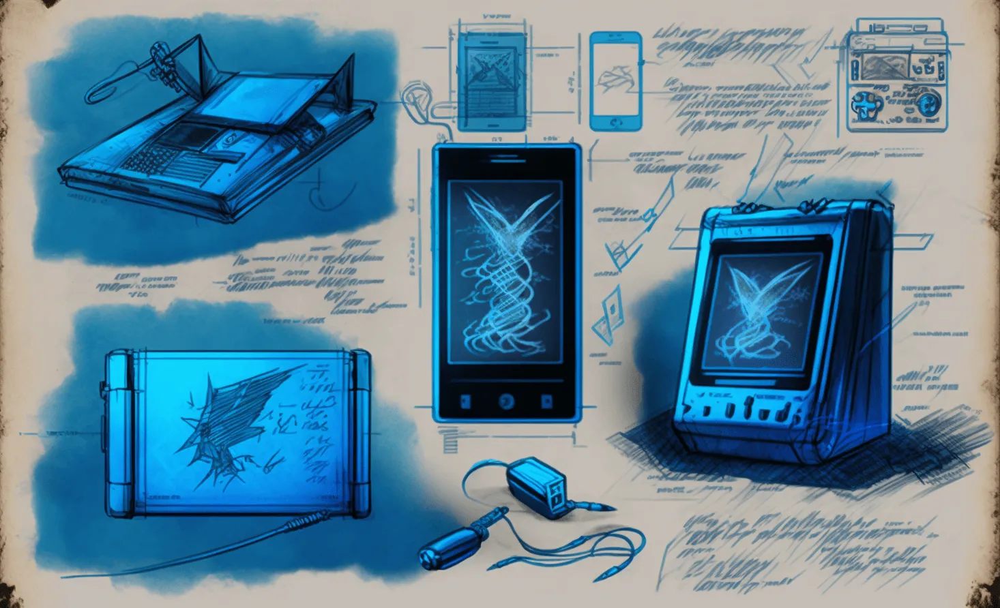
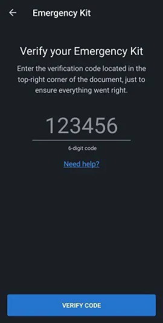
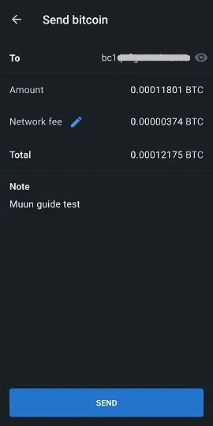

Muun (https://muun.com/) es una billetera auto custodiada para bitcoin y lightning.

## tutorial en video

## Billetera Muun - Guía de uso completa

Guía de uso completa (con capturas de pantalla) de la aplicación Muun; una billetera móvil amigable para Bitcoin que te permite realizar transacciones en la Lightning Network.

### Descargar Muun y crear tu billetera

En primer lugar, debes descargar la aplicación móvil, disponible tanto en iOS como en Android. Asegúrate siempre de descargar la versión correcta. A veces hay réplicas fraudulentas en el mercado. Te recomiendo que encuentres el sitio web oficial de Muun wallet, en este caso https://muun.com/, y utilices el enlace para tu sistema elegido (iOS/Android), desde allí tendrás la certeza de que estás utilizando la aplicación oficial.

Al abrir la aplicación, tendrás la opción de crear una nueva billetera o recuperar una existente. Comencemos primero con la creación de una nueva billetera. Mostraré los pasos para recuperar una billetera más adelante. Presiona "Crear una nueva billetera".

Luego, Muun wallet te pedirá que crees un número de identificación personal (NIP/PIN) de cuatro dígitos. Con un PIN, aumentas la seguridad de tu billetera en caso de que, por ejemplo, alguien malintencionado te robe el teléfono y, por lo tanto, tus bitcoins.

¡Listo! La aplicación ha generado una nueva billetera que ahora será la página de inicio. Ahora debes asegurar la información relevante para la recuperación de la billetera antes de enviar fondos, lo cual sería una práctica arriesgada.

### Respaldo de la clave

Presiona el recuadro "Respaldar tu billetera", serás redirigido a la pestaña "Seguridad". El proceso de respaldo de Muun está adecuadamente dividido en tres pasos. No es obligatorio completar los tres pasos, pero la combinación de ellos ofrece la máxima precaución.

La première opción le permite conectar su billetera a una dirección de correo electrónico, además de protegerla con una contraseña. Esta opción es opcional y se puede omitir sin problemas. Si desea utilizarla, presione "1: Hacer una copia de seguridad de su billetera" y luego "Iniciar" en la siguiente pantalla e ingrese una dirección de correo electrónico. La siguiente pantalla le indicará que debe validar el correo electrónico accediendo a su bandeja de entrada y haciendo clic en el enlace proporcionado en el correo electrónico de Muun.

Una vez que se haya verificado el correo electrónico, se le pedirá que cree una contraseña. Luego, deberá marcar dos casillas indicando que comprende que la recuperación de la billetera, si ocurre, requerirá el uso del correo electrónico y la contraseña recién elegida. Esto contrasta con los programas tradicionales que le permiten restablecer su contraseña en caso de pérdida u olvido, así que asegúrese de haberlo anotado todo correctamente.

La pestaña "Seguridad" ahora le indica que tiene una copia de seguridad básica ("copia de seguridad básica"). Por lo tanto, puede volver a la pestaña "Billetera" y utilizar la aplicación para completar transacciones (estas funciones se detallarán más adelante en esta guía), sabiendo que la billetera ahora es recuperable. Sin embargo, le recomiendo que utilice la opción de seguridad #2 para generar un código de copia de seguridad adicional, en caso de que la contraseña ingresada en la opción #1 se vea comprometida o si prefiere no utilizar la opción de recuperación por correo electrónico.

La opción "copia de seguridad alternativa" de Muun se asemeja a la frase mnemotécnica utilizada por muchas aplicaciones de billetera a la que la mayoría de los usuarios de Bitcoin están acostumbrados. Presione "Iniciar" para mostrar su código de recuperación y escríbalo en un trozo de papel (la aplicación censura la captura de pantalla en la página que muestra el código). Una vez anotado, compárelo con el código mostrado en la pantalla, ya que luego deberá volver a escribirlo en la aplicación para confirmar su validez.

Una vez más, Muun le pide que confirme su comprensión del asunto, es decir, que necesitará este código de 32 caracteres en caso de que pierda su contraseña establecida anteriormente.

La copia de seguridad de la billetera ahora está ampliamente asegurada según los estándares modernos que conocemos. Sin embargo, la aplicación Muun tiene una tercera opción de seguridad llamada "Emergency Kit". La creación del Emergency Kit le permitirá recuperar su billetera sin tener que pasar por Muun. En otras palabras, utilizando un software de billetera Bitcoin diferente a Muun.

Después de presionar "Crear un Kit de Emergencia", se le explicará que este kit viene en forma de un documento PDF que contiene la información e instrucciones relacionadas con la transferencia de sus fondos de manera independiente. El kit se puede almacenar en la nube sin preocupaciones ya que requiere su "Código de Recuperación" para ser utilizado, el cual no se encuentra en el documento en cuestión. Deslice la pantalla para acceder a la página de creación del kit.

Tiene tres opciones:

- Guardar en la nube de su cuenta de Google.
- Enviar un correo electrónico a su propia dirección para guardar su kit y acceder a él.
- Guardar manualmente con una aplicación local en su dispositivo.

Asegúrese de poder consultar su kit una vez que lo haya enviado a su destino de respaldo elegido, ya que Muun le pedirá, para fines de validación, que ingrese un código de seis dígitos que se encuentra en el kit.

Una vez completado este último paso, su configuración de seguridad y recuperación de billetera está terminada. Ahora exploraremos las diferentes formas de recuperar su billetera utilizando las copias de seguridad recién creadas.
Recuperación de una billetera

Existen muchos escenarios en los que un usuario puede perder temporalmente el acceso a su billetera y fondos; pérdida del dispositivo, desinstalación/desaparición de la aplicación, olvido del número de identificación personal, desconexión de la billetera, etc. Por lo tanto, es imperativo saber cómo recuperar este acceso. Al recuperar a través de la aplicación Muun, presione la opción "Ya tengo una billetera" en la pantalla de apertura.

### Recuperación con dirección de correo electrónico

Si utilizó la opción de respaldo #1 de Muun, ingrese el correo electrónico que se eligió en ese momento. Dado que esta opción es opcional, también puede optar por continuar con el código de recuperación, que es la opción #2 ofrecida por Muun. Primero, veamos la opción a través del correo electrónico.

Una vez que ingrese su dirección de correo electrónico, Muun le indicará que se le ha enviado un correo electrónico y que debe acceder a él para autorizar la recuperación de la billetera. Verifique su bandeja de entrada (incluida la carpeta de correo no deseado) y use el enlace proporcionado en el correo electrónico de Muun. Será redirigido a la aplicación donde la pantalla ahora le pedirá que ingrese su contraseña asociada con la dirección de correo electrónico registrada.

El último paso es crear un número de identificación personal, luego volverá al territorio familiar en la página de inicio de la billetera, que le mostrará el saldo asociado a la misma.

### Utilización del "Código de Recuperación"

Cuando se recupera el acceso a una billetera existente, se puede optar por utilizar el código de recuperación ("Recovery Code" como se designa en Muun) que se ha anotado previamente si se eligió la opción de respaldo #2.

Este proceso es similar al detallado en la sección anterior; recuperación por correo electrónico. Simplemente elija utilizar la opción "Recuperar con el Código de Recuperación" e ingrese este último en los campos apropiados que se muestran en la pantalla. Si su billetera también está respaldada por correo electrónico además del código de recuperación, Muun le pedirá que consulte su bandeja de entrada para autorizar el proceso de recuperación, el cual podrá finalizar una vez que regrese a la aplicación después de hacer clic en el enlace proporcionado. Una vez más, deberá crear un número de identificación personal. ¡Listo, volverá a tener acceso a su billetera!

### Recuperación utilizando el Kit de Emergencia

Para recuperar su billetera sin utilizar la aplicación Muun Wallet, necesitará su kit de emergencia (Emergency Kit), la tercera opción de recuperación ofrecida por Muun. Esta opción le permite enviar los fondos en su billetera Muun a cualquier otra dirección de Bitcoin. Asegúrese de tener una billetera alternativa que pueda generar una dirección a la cual enviar los fondos.

Acceda al documento PDF que guardó al crear el kit. Este documento contiene las instrucciones necesarias para la recuperación de su billetera. Tenga en cuenta que esta funcionalidad requiere el uso de una computadora de escritorio o portátil, ya que deberá descargar un script creado por el equipo de desarrollo de Muun. El enlace está incluido en el correo electrónico, pero lo comparto aquí de todos modos: https://github.com/muun/recovery

El kit de emergencia viene con un código de verificación, que ya ha utilizado anteriormente para confirmar la creación del kit, y dos claves. Las claves serán necesarias cuando active el script de recuperación de Muun. Asegúrese de tenerlas a mano durante la operación.

Aquí está la traducción de las instrucciones:

Este procedimiento de emergencia le ayudará a recuperar sus fondos si no puede utilizar Muun en su dispositivo.

1. Encuentre su código de recuperación

Ha escrito este código en un trozo de papel antes de crear su kit de emergencia. Lo necesitará más adelante.

2. Descargue la herramienta de recuperación

Vaya a la página https://github.com/muun/recovery y descargue la herramienta en su computadora.

3. Recupere sus fondos

Ejecute la herramienta de recuperación y siga los pasos. La herramienta se encargará de transferir sus fondos a una dirección Bitcoin de su elección.

Una vez dentro del script, solo tienes que ingresar la información solicitada en la pantalla. El script se encargará del proceso de transferencia de fondos por ti. En la página "github" proporcionada anteriormente, hay un video animado del proceso disponible, que te permitirá ver exactamente lo que te espera cuando inicies el script de recuperación.

## Recibir transacciones

### Pestaña Bitcoin

Ahora vamos a cubrir la sección "Recibir" de la billetera Muun y sus diferentes funciones. La página de inicio de tu aplicación es la pestaña "Wallet". Tu saldo se muestra en el centro, puedes presionarlo para alternar entre ocultar el monto y mostrarlo. Repasaremos todos los ajustes de la aplicación más adelante en este artículo. Por ahora, presionemos "Recibir" para explorar esta función.

En esta página, puedes elegir recibir una transacción tanto en la red Bitcoin como en Lightning. Se mostrará una nueva dirección (y el código QR asociado) correspondiente a la red deseada. Por defecto, se muestra una dirección de Bitcoin en la pantalla "Recibir". Al presionar el código QR, la dirección se copiará en el portapapeles de tu dispositivo. Puedes compartir fácilmente la dirección directamente con otras aplicaciones con el botón "Compartir" y también puedes copiar la dirección con el botón "Copiar". Al presionar el ícono de ojo al final de la dirección, se mostrará la dirección completa, lo que te permitirá compararla con la dirección copiada en el portapapeles durante el intercambio.

Esta información contiene todo lo necesario para recibir transacciones en la red Bitcoin. Además, Muun te ofrece algunas opciones de personalización en el menú "Configuración de dirección". Primero, puedes agregar un monto a la descripción de la dirección. Segundo, puedes elegir usar una dirección Segwit (la opción predeterminada) o una dirección tradicional (legacy).

Al presionar "Agregar +", puedes agregar un monto específico a la dirección, lo que facilitará la tarea del emisor. Esta opción es opcional. Ten en cuenta que una vez que se ingresa un monto, el botón "Copiar" de la página anterior agregará información a la dirección copiada ("bitcoin:" como prefijo y luego el monto como sufijo). Para evitar tener que ajustar esto, presiona directamente el código QR para copiar la dirección. La información del monto permanecerá anclada a ella. Además, la aplicación te permite elegir ingresar el monto en la moneda de tu elección, lo que simplifica el proceso de conversión a BTC.

En cuanto a la selección del tipo de dirección, Segwit o Legacy, recomiendo dejar Segwit en su lugar. Este tipo de dirección (que comienza con "bc1") reduce el tamaño de los datos de la transacción y, por lo tanto, reduce las tarifas de transacción asociadas. Sin embargo, es posible que deba utilizar el sistema "Legacy" (dirección que comienza con "3") en caso de que una billetera o software no sea compatible con las direcciones Segwit. Por lo tanto, es importante saber distinguir entre los dos tipos.

## Pestaña Lightning

Para recibir transacciones a través de la red Lightning, debe hacer clic en la pestaña del mismo nombre en la parte superior de la pantalla. Ahora se mostrará un código QR que contiene una dirección Lightning, que puede copiar y compartir de la misma manera que las direcciones Bitcoin mencionadas anteriormente en esta guía. Le recuerdo que la red Lightning le permite disfrutar de una velocidad de transacción casi instantánea, además de tarifas de transacción que son una fracción de las de la cadena Bitcoin.

Las opciones de personalización se encuentran en el menú "Configuración de factura". Aquí, puede modificar la cantidad asociada a la dirección presionando "Agregar +". Según mi experiencia con la red Lightning, creo que es mejor ingresar una cantidad al crear la transacción, ya que muchas billeteras no responden bien a las facturas en blanco. Además, notará que hay un temporizador de vencimiento en este menú. En esta aplicación, el temporizador está configurado en 60 minutos, después de lo cual la dirección será inválida. Tenga en cuenta que Muun genera una nueva dirección Lightning cada vez que realiza un cambio en la cantidad o cuando sale y vuelve a la página.

## Utilizar la función LNURL

La billetera Muun ofrece la posibilidad de utilizar LNURL para recibir transacciones. Esta función, que se activa al presionar el símbolo de escaneo cuadrado ubicado en la parte superior derecha de la página, tiene algunas ventajas, como evitar tener que compartir una factura para recibir una transacción. En su lugar, debe escanear un código QR para recibir la información de pago que luego puede validar para confirmar el proceso de transacción.

Inicialmente, Muun le mostrará una página explicativa (ver captura de pantalla anterior) y luego le pedirá que active la entrada de la cámara de su dispositivo, un paso necesario para utilizar la aplicación. Tenga en cuenta que las direcciones LNURL actualmente no son compatibles con todas las billeteras Lightning. Aquellos que lo admiten generalmente solo ofrecen la posibilidad de utilizar LNURL para recibir transacciones y no para emitirlas.

## Emitir transacciones

### A través de la red Bitcoin

Ahora que hemos visto cómo recibir bitcoins con Muun, exploremos cómo enviarlos. Vuelve a la página de inicio en la pestaña "Wallet" y presiona "Send". Ahora se mostrará una página muy sencilla donde tendrás la opción de copiar una dirección de Bitcoin o Lightning en el campo correspondiente, o presionar el ícono del código QR a la derecha de este campo para activar la cámara y escanear una dirección en forma de código QR.

Cuando llegues a la página "Send", si ya tienes una dirección copiada en tu dispositivo, Muun reconocerá el formato de la dirección (Bitcoin o Lightning) y te sugerirá a través de un mensaje enmarcado que utilices esa dirección para enviar una transacción.

Al preparar una transacción de Bitcoin, debes ingresar la cantidad a enviar. Asegúrate de que la dirección de destino que se muestra en la parte superior de la pantalla coincida con la dirección copiada anteriormente. Debajo del monto a enviar, Muun muestra el saldo de tu billetera y te da la opción de utilizar todos tus fondos ("Use all funds"), una función muy útil si deseas vaciar completamente tu billetera evitando que queden "polvo" (algunos satoshis).

Después de confirmar la cantidad a enviar, Muun te pedirá en la siguiente página que escribas una nota. Esto sirve como una validación adicional, eres libre de escribir lo que quieras, ya sea relevante o no.

Es necesario revisar los detalles de la transacción una última vez antes de finalmente enviarla. Valida la dirección y el monto ingresados, y personaliza las tarifas de transacción si es necesario presionando el ícono del lápiz azul ubicado a la derecha de "Network fee". Conocer los conceptos básicos sobre cómo funciona el mempool de transacciones de Bitcoin es una buena experiencia educativa que podría ayudarte a ahorrar muchos satoshis con el tiempo.

Muun implementa de forma predeterminada en su software un algoritmo que calcula las tarifas de transacción necesarias para una confirmación en 30 minutos o menos. Esto es lo que se mostrará cuando intentes modificar las tarifas de transacción. El botón "Enter Fee Manually" te permite personalizar este detalle tú mismo, una función muy práctica en caso de que necesites una confirmación más rápida o, por el contrario, si tienes un margen de maniobra amplio.

Al elegir ingresar usted mismo el monto de la tarifa de transacción, será llevado a una nueva página que le indicará el monto a ingresar denominado en sat/vbyte (satoshis por virtual byte). Muun incluso le muestra una estimación del tiempo de confirmación asociado al monto elegido, además de lo que le costará en BTC y moneda fiduciaria de su elección.

Vuelva a la página de resumen de los detalles de la transacción y presione "Enviar". ¡Listo, su transacción se difunde en la red de Bitcoin! Será redirigido a la página de inicio de la billetera donde verá la deducción en su saldo. En la parte inferior de la pantalla hay una flecha en la que puede presionar para inspeccionar su historial de transacciones. La que acaba de hacer se agrega al momento inicial de su emisión.

Presione una entrada para ver los detalles de una transacción en particular. Su transacción se confirmará cuando un minero agregue un nuevo bloque, que la contenga, a la cadena. Muun comparte en la parte inferior de la pantalla el identificador de la transacción, lo que le permite verificar en un explorador de bloques el estado de su transacción.

## A través de la red Lightning

Ahora usemos una factura Bolt 11 (factura Lightning tradicional / predeterminada) para realizar una transacción. Copie o escanee una dirección Lightning en la página "Enviar". Será redirigido a una nueva página que le mostrará los detalles de la factura actual. Los montos de la transacción se mostrarán (incluidas las tarifas de la red), la nota o descripción escrita en la factura, así como el temporizador de vencimiento en la parte inferior. Tenga en cuenta que las tarifas de transacción no se pueden modificar para las transacciones Lightning, ya que están determinadas por la ruta del canal/canales que deben tomar para llegar al destinatario.

(Aquí está la advertencia que se muestra en la pantalla al usar una factura en blanco, es decir, sin ningún monto ingresado previamente. Algunas billeteras admiten este tipo de facturas y le permiten personalizar el monto usted mismo. Esto no es posible en el caso de Muun).

Al presionar el ícono del ojo, se muestran los detalles del nodo Lightning con el que está realizando la transacción. Incluso tiene la opción de consultar un explorador web para obtener más información. Esto es un buen ejemplo de la abstracción técnica realizada por Muun.

Una vez que presione "Enviar", su transacción se lanzará y, normalmente, se completará en una fracción de segundo. El monto pagado se deducirá de su saldo, visible en la página de inicio de la aplicación. Vuelva a su historial de transacciones para ver la confirmación instantánea del pago.

'

Ten en cuenta que en el historial, las transacciones de Lightning y Bitcoin se distinguen por un símbolo diferente. Para ver los detalles de la transacción de Lightning, presiona sobre ella en la pantalla de tu historial.

## Configuración de la aplicación

La tercera pestaña de la página de inicio, "Settings" (Configuración), es la de los ajustes. Esta página es sorprendentemente corta, especialmente en comparación con otras billeteras móviles populares. En mi opinión, esto no es una desventaja, al contrario, lo veo como una ventaja desde el punto de vista de la simplicidad.

En la categoría general, puedes seleccionar tus preferencias de unidad de cuenta y moneda, así como el tema de apariencia de la aplicación (oscuro o claro) que se determinará inicialmente según la configuración de tu dispositivo.

Para la unidad de cuenta de la aplicación, elige entre denominar en Bitcoin (BTC) o en Satoshi (SAT). Como información, un Satoshi es la fracción más pequeña de un bitcoin, es decir, el octavo decimal (1 SAT = 0.00000001 BTC). Denominar la billetera en Satoshis suele ser preferido cuando utilizamos principalmente la red Lightning con pequeñas cantidades.

Muun tiene una amplia selección de monedas con las que podrás encontrar más fácilmente la conversión de BTC necesaria para tus necesidades transaccionales y/o personales.

Si consideras necesario cambiar tu contraseña de recuperación de billetera, puedes hacerlo en la página de configuración. Asegúrate de tener a mano la contraseña actual o tu código de recuperación, y acceso a tu correo electrónico.

Ingresa tu contraseña actual o elige ingresar tu código de recuperación para iniciar el proceso de reinicio. Muun enviará un correo electrónico a la dirección previamente registrada.

La sección avanzada de configuración ("Advanced settings") contiene dos opciones: Bitcoin Network y Lightning Network. En Bitcoin Network, se nos da la opción de activar las direcciones de recepción Taproot (bc1p, el tipo de dirección más reciente) de forma predeterminada.

Dentro de Lightning Network se encuentran:

- Receiving Protocol: Elige tu red de recepción que se mostrará de forma predeterminada en la pantalla de Recepción. También está disponible una función experimental llamada Unified, que unifica tanto las direcciones de Bitcoin como las de Lightning en un solo código QR. Sin embargo, actualmente son pocos los softwares de Bitcoin que admiten esta funcionalidad.
- Turbo Channels: Esta opción permite activar o desactivar la función de canales Turbo. Por defecto, está activada.

'

Para comprender lo que se llama los canales Turbo, primero debemos saber que las transacciones Lightning se realizan a través de canales de usuario a usuario, y que estos canales deben ser financiados inicialmente por una transacción en la cadena de Bitcoin.

Los canales Turbo permiten comenzar a operar en la red Lightning antes de que se confirme cualquier transacción en la cadena. Desactivar esta función significa que deberá esperar significativamente más tiempo para operar en la red Lightning, a cambio de una mayor seguridad de sus fondos, ya que de lo contrario debe confiar en que Muun no actuará maliciosamente (un doble gasto muy público) mientras espera que su transacción se confirme en la cadena de bloques.

En la parte inferior de la página de configuración se encuentra la opción "Cerrar sesión". Puede utilizar esta función si desea que la aplicación cierre la billetera actualmente reconocida por ella. Esto le permitirá crear una nueva billetera o importar o recuperar una existente.

