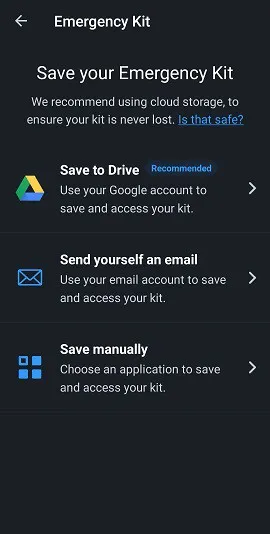
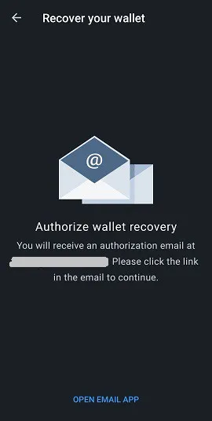
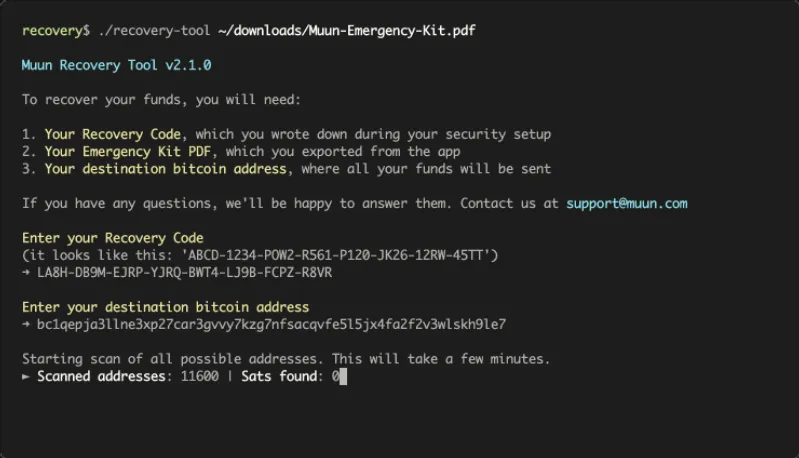
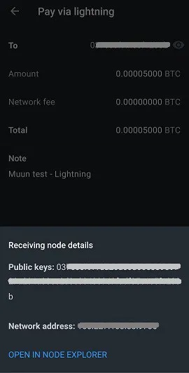

Muun (https://muun.com/) on isehaldatav rahakott Bitcoinile ja Lightning võrgule.

## videoõpetus

## Muun Rahakott - Täielik Kasutusjuhend

Täielik kasutusjuhend (koos ekraanipiltidega) Muun rakendusele; kasutajasõbralik mobiilne Bitcoin rahakott, mis võimaldab teil teha tehinguid Lightning võrgus.

### Laadi alla Muun ja loo oma rahakott

Esmalt pead alla laadima mobiilirakenduse, mis on saadaval nii iOS-ile kui ka Androidile. Veendu alati, et laadid alla õige versiooni. Turul võib mõnikord olla petlikke koopiaid. Soovitan leida ametliku Muun rahakoti veebilehe, mis on https://muun.com/, ja kasutada sealt oma valitud süsteemi (iOS/Android) linki, nii võid olla kindel, et kasutad ametlikku rakendust.

Rakendust avades on sul võimalus luua uus rahakott või taastada olemasolev. Alustame uue rahakoti loomisega. Rahakoti taastamise sammud demonstreerin hiljem. Vajuta "Loo uus rahakott".

Seejärel palub Muun rahakott sul luua neljakohalise isikliku identifitseerimiskoodi (PIN). PIN-koodiga suurendad oma rahakoti turvalisust juhuks, kui näiteks pahatahtlik isik varastab su telefoni ja seeläbi su bitcoine.

Nüüd on rakendus loonud täiesti uue rahakoti, mis saab nüüdsest olema avaleht. Nüüd pead enne rahakotti raha saatmist tagama olulise rahakoti taastamise teabe, kuna see oleks riskantne praktika.

### Võtme varundamine

Vajuta "Varunda oma rahakott" kastile ja sind suunatakse "Turvalisus" vahekaardile. Muuni varundamisprotsess on mugavalt jaotatud kolmeks sammuks. Kõiki kolme sammu ei ole kohustuslik täita, kuid nende kombinatsioon pakub maksimaalset ettevaatust.

Esimene võimalus lubab sul ühendada oma rahakoti e-posti aadressiga, lisaks selle kaitsmisele parooliga. See valik on valikuline ja selle võib probleemideta vahele jätta. Kui soovid seda kasutada, vajuta "1: Varunda oma rahakott" ja seejärel "Alusta" järgmisel ekraanil ning sisesta e-posti aadress. Järgmine ekraan ütleb, et pead e-posti valideerima, pääsedes oma postkasti ja klõpsates Muuni e-kirjas toodud lingil.

Kui e-post on kinnitatud, palutakse sul luua parool. Seejärel pead märkima kaks kasti, mis näitavad, et sa mõistad, et rahakoti taastamine, kui see on vajalik, nõuab just valitud e-posti ja parooli kasutamist. See erineb traditsioonilistest programmides, mis võimaldavad sul parooli kaotuse või unustamise korral seda lähtestada, seega veendu, et oled kõik üles märkinud.

"Turvalisus" vahekaart näitab nüüd, et sul on põhiline varukoopia. Nüüd võid naasta "Rahakott" vahekaardile ja kasutada rakendust tehingute sooritamiseks (need funktsioonid kirjeldatakse hiljem selles juhendis), teades, et rahakott on nüüd taastatav. Siiski soovitan kasutada turvavõimalust nr 2, et genereerida lisavarukood, juhuks kui valikus nr 1 sisestatud parool on kompromiteeritud või kui eelistad mitte kasutada e-posti taastamise võimalust.

Muuni "alternatiivne varundamise" võimalus on sarnane mnemoonilise fraasiga, mida kasutavad mitmed rahakotirakendused ja millega paljud Bitcoin'i kasutajad on tuttavad. Vajutage "Start", et kuvada teie taastekood ja kirjutage see paberitükile (rakendus tsenseerib ekraanipildi koodi kuvaval lehel). Kui olete selle üles märkinud, võrrelge seda ekraanil kuvatava koodiga, sest peate selle rakenduses uuesti sisestama, et kinnitada selle kehtivust.
Taas küsib Muun teilt kinnitust, et mõistate probleemi olemust, mis seisneb selles, et vajate seda 32-tähemärki koodi juhul, kui kaotate oma varem määratud parooli.

Rahakoti varundamine on nüüd oluliselt turvatud vastavalt meile teadaolevatele kaasaegsetele standarditele. Siiski, Muuni rakendusel on kolmas turvavõimalus nimega "Hädaabikomplekt". Hädaabikomplekti loomine võimaldab teil taastada oma rahakoti ilma Muuni kaudu minemata. Teisisõnu, kasutades Muunist erinevat Bitcoin'i rahakoti tarkvara.

Pärast "Loo Hädaabikomplekt" vajutamist selgitatakse teile, et see komplekt on PDF-dokumendi kujul, mis sisaldab teavet ja juhiseid teie vahendite iseseisvaks ülekandmiseks. Komplekti saab muretult pilves hoida, kuna selle kasutamiseks on vajalik teie "Taastekood", mida dokumendis ei ole. Libistage ekraani, et pääseda ligi komplekti loomise lehele.

Teile on saadaval kolm võimalust:

- Salvesta oma Google'i konto pilve.
- Saada e-kiri oma aadressile, et varundada oma komplekt ja pääseda sellele ligi.
- Käsitsi varundamine kohaliku rakendusega oma seadmes.

Veenduge, et pääsete oma komplektile ligi, kui olete selle valitud varundamiskohale saatnud, sest Muun palub teil siis kinnitamise eesmärgil sisestada komplektist leitava kuuekohalise koodi.

Kui see viimane samm on lõpetatud, on teie rahakoti turvalisus ja taastamise seadistus nüüd lõpule viidud. Nüüd uurime erinevaid viise, kuidas taastada oma rahakott värskelt loodud varukoopiate abil.
Rahakoti Taastamine

On palju stsenaariume, kus kasutaja võib ajutiselt kaotada juurdepääsu oma rahakotile ja vahenditele; seadme kaotus, desinstallitud/puuduv rakendus, unustatud isiklik identifitseerimisnumber, rahakoti ühenduse katkemine jne. Seetõttu on hädavajalik teada, kuidas seda juurdepääsu taastada. Taastamiseks Muuni rakenduse kaudu vajutage avakuval valikule "Mul On Juba Rahakott".

### Taastamine e-posti aadressi abil

Kui kasutasite Muuni varundamise võimalust nr 1, sisestage sel ajal valitud e-posti aadress. Kuna see võimalus on valikuline, võite valida ka taastekoodi kasutamise, mis on Muuni poolt pakutav võimalus nr 2. Alustame esmalt e-posti võimalusest.

Kui olete oma e-posti aadressi sisestanud, teavitab Muun teid, et teile on saadetud e-kiri ja et peate sellele juurde pääsemiseks seda kontrollima. Kontrollige oma postkasti (ka spämmiosakonda) ja kasutage Muuni e-kirjas olevat linki. Teid suunatakse rakendusse, kus ekraan palub teil nüüd sisestada registreeritud e-posti aadressiga seotud parool.

Viimane samm on luua isiklik identifitseerimisnumber ja seejärel olete tagasi tuttaval territooriumil rahakoti avalehel, mis näitab sellega seotud saldo.

### "Taastekoodi" kasutamine
Olemasolevale rahakotile juurdepääsu taastamisel võite valida taastekoodi ("Recovery Code", nagu on määratlenud Muun) kasutamise, mille olete varem märkinud, kui valisite varundamise võimaluse #2.
See protsess on sarnane eelmises jaotises kirjeldatuga; taastamine e-posti teel. Valige lihtsalt "Recover With Recovery Code" võimalus ja sisestage see ekraanil kuvatavatesse vastavatesse väljadesse. Kui teie rahakott on lisaks taastekoodile varundatud ka e-posti teel, palub Muun teil kontrollida oma postkasti, et volitada taastamisprotsessi, mille saate lõpule viia pärast rakendusse tagasi pöördumist, klõpsates esitatud lingil. Peate jälle looma isikliku identifitseerimisnumbri. Ongi kõik, teil on jälle juurdepääs oma rahakotile.

### Taastamine kasutades Hädaabikomplekti

Oma rahakoti taastamiseks ilma Muun Wallet rakendust kasutamata on teil vaja oma hädaabikomplekti, kolmandat taastamisvõimalust, mida Muun pakub. See võimalus lubab teil saata oma Muun rahakotis hoitavad vahendid ükskõik millisele teisele Bitcoin aadressile. Seega veenduge, et teil on alternatiivne rahakott, mis suudab genereerida aadressi, kuhu te vahendid saadate.

Juurdepääs PDF-dokumendile, mille salvestasite komplekti loomisel. See dokument sisaldab juhiseid, mis on vajalikud teie rahakoti taastamiseks. Pange tähele, et see funktsioon nõuab lauaarvuti või sülearvuti kasutamist, kuna peate alla laadima Muun arendusmeeskonna loodud skripti. Link on kaasatud e-kirjas, kuid jagan seda siin igal juhul: https://github.com/muun/recovery

Hädaabikomplekt on varustatud kontrollkoodiga, mida olete juba kasutanud komplekti loomise kinnitamiseks, samuti kahe võtmega. Võtmed on vajalikud, kui aktiveerite Muun taastamisskripti. Seega veenduge, et need oleksid operatsiooni ajal käepärast.

Siin on juhiste tõlge:

See hädaabiprotseduur aitab teil taastada oma vahendid, kui te ei saa Muuni oma seadmes kasutada.

1. Leidke oma taastekood

Kirjutasite selle koodi paberitükile enne oma hädaabikomplekti loomist. Teil läheb seda hiljem vaja.

2. Laadige alla taastamisvahend

Minge lehele https://github.com/muun/recovery ja laadige vahend oma arvutisse alla.

3. Taastage oma vahendid

Käivitage taastamisvahend ja järgige samme. Vahend kannab teie vahendid teie valitud Bitcoin aadressile.

Skriptis olles peate lihtsalt sisestama ekraanil küsitud teabe. Skript hoolitseb vahendite ülekandeprotsessi eest teie eest. Ülalnimetatud "github" lehel on saadaval animeeritud video protsessist, mis näitab teile täpselt, mida oodata, kui alustate taastamisskripti.

## Tehingute vastuvõtmine

### Bitcoin Vaheleht

Nüüd käsitleme Muun rahakoti "Receive" jaotist ja selle erinevaid funktsioone. Rakenduse avaleht on "Wallet" vaheleht. Teie saldo kuvatakse keskel ja saate sellel klõpsates vahetada summa peitmise ja kuvamise vahel. Kõiki rakenduse seadeid käsitleme hiljem selles artiklis. Praegu vajutame "Receive", et uurida seda funktsiooni.

Sellel lehel saate valida, kas soovite tehingu vastu võtta nii Bitcoin kui ka Lightning võrgustikes. Kuvatakse uus aadress (ja vastav QR-kood), mis vastab soovitud võrgule. Vaikimisi kuvatakse Bitcoin aadress, kui saabute "Vasta" ekraanile. QR-koodi puudutades kopeeritakse aadress teie seadme lõikelauale. Aadressi saate hõlpsalt jagada otse teistele rakendustele "Jaga" nupu abil ning aadressi saate kopeerida ka "Kopeeri" nupuga. Aadressi lõpus oleva silmaikooni vajutamine kuvab täieliku aadressi, võimaldades teil seda võrrelda lõikelauale kopeerituga jagamise ajal.

See teave sisaldab kõike, mida vajate tehingute vastuvõtmiseks Bitcoin võrgus. Lisaks pakub Muun teile mõningaid kohandamisvõimalusi "Aadressi seaded" menüüs. Esiteks saate lisada aadressi kirjeldusele summa. Teiseks saate valida, kas kasutada Segwit aadressi (vaikimisi valik) või traditsioonilist aadressi (legacy).

"Lisa +" vajutamisega saate aadressile lisada konkreetse summa, muutes saatva poole jaoks lihtsamaks. See valik on valikuline. Pange tähele, et kui summa on sisestatud, lisab eelmisel lehel olev "Kopeeri" nupp kopeeritud aadressile teavet ("bitcoin:" kui prefiks, millele järgneb summa kui sufiks). Et vältida selle kohandamist ootamatult, vajutage otse QR-koodile, et aadress kopeerida. Summa teave jääb sellega seotuks. Lisaks võimaldab rakendus teil valida summa sisestamise teie valitud valuutas, lihtsustades konversiooniprotsessi BTC-ks.

Aadressi tüübi valimisel, Segwit või Legacy, soovitan jätta Segwit paika. See aadressi tüüp (algab "bc1-ga") vähendab tehinguandmete suurust ja seega vähendab kaasnevaid tehingutasusid. Siiski võib juhtuda, et peate kasutama "Legacy" süsteemi (aadress algab "3-ga") juhul, kui rahakott või tarkvara ei ühildu Segwit aadressidega. Seetõttu on oluline teada, kuidas eristada kahte tüüpi.

## Lightning vaheleht

Tehingute vastuvõtmiseks Lightning võrgus peate puudutama ekraani ülaosas sama nimega vahelehte. Nüüd kuvatakse QR-kood, mis sisaldab Lightning aadressi, mida saate kopeerida ja jagada samamoodi nagu varem selles juhendis mainitud Bitcoin aadresse. Tuletan teile meelde, et Lightning võrk võimaldab nautida peaaegu koheseid tehingukiirusi lisaks tehingutasudele, mis on murdosa nendest Bitcoin ahelas.

Kohandamisvõimalused leiate "Arve seaded" menüüst. Siin saate muuta aadressiga seotud summat, puudutades "Lisa +". Oma kogemuse põhjal Lightning võrguga usun, et on parem sisestada summa tehingu loomisel, kuna mitmed rahakotid ei reageeri tühjadele arvetele hästi. Samuti märkate selles menüüs aegumistaimerit. Selles rakenduses on taimer seatud 60 minutiks, pärast mida aadress muutub kehtetuks. Pange tähele, et Muun genereerib iga kord, kui muudate summat või kui lahkute lehelt ja naasete, uue Lightning aadressi.

## LNURL funktsiooni kasutamine
Muun rahakott pakub võimalust kasutada LNURL-i tehingute vastuvõtmiseks. See funktsioon, mida aktiveeritakse lehekülje paremas ülanurgas asuva ruudukujulise skannimissümboli puudutamisega, pakub mitmeid eeliseid, sealhulgas vajaduse vältimist jagada arvet tehingu vastuvõtmiseks. Selle asemel peate skannima QR-koodi, et vastu võtta makseinfo, mida saate seejärel kinnitada tehinguprotsessi lõpuleviimiseks.

Muun näitab esialgu selgitavat lehekülge (vt ülaltoodud ekraanipilti) ja seejärel palub teil lubada seadme kaamera sisendi, mis on rakenduse kasutamiseks vajalik samm. Palun pange tähele, et LNURL aadresse ei toeta praegu kõik Lightning rahakotid. Need, mis seda toetavad, pakuvad üldiselt ainult võimalust kasutada LNURL-i tehingute vastuvõtmiseks, mitte saatmiseks.

## Tehingute saatmine

### Bitcoini võrgu kaudu

Nüüd, kui oleme näinud, kuidas Muuniga bitcoine vastu võtta, uurime, kuidas neid saata. Tagasi avalehel "Rahakott" vahelehe all peate vajutama "Saada". Nüüd ilmub lihtne lehekülg, kus on võimalus kopeerida Bitcoin või Lightning aadress määratud väljale või vajutada selle välja paremal asuvale QR-koodi ikoonile, et aktiveerida kaamera ja skannida aadress QR-koodi kujul.

"Saada" lehele jõudes, kui teil on juba seadmes aadress kopeeritud, tunnistab Muun aadressi formaati (Bitcoin või Lightning) ja soovitab seda kasutada tehingu edastamiseks raamitud sõnumi kaudu.

Bitcoini tehingu ettevalmistamisel peate sisestama saatmise summa. Veenduge, et ekraani ülaosas kuvatav sihtaadress vastab varem kopeeritud aadressile. Saatmise summa all kuvab Muun teie rahakoti jääki ja annab teile võimaluse kasutada kõiki oma vahendeid, mis on väga kasulik funktsioon, kui soovite oma rahakoti täielikult tühjendada ja vältida "tolmu" (mõned satoshid) jätmist.

Summa kinnitamise järel küsib Muun järgmisel lehel märkuse kirjutamist. See toimib lisakinnitusega ja te võite kirjutada mida iganes soovite, olgu see asjakohane või mitte.

Enne tehingu lõplikku edastamist on vajalik tehingu detailide lõplik ülevaade. Kinnitage sisestatud aadress ja summa, seejärel kohandage vajadusel tehingutasusid, vajutades "Võrgutasu" paremal asuvale sinisele pliiatsi ikoonile. Bitcoini tehingute järjekorra (mempool) toimimise põhitõdede mõistmine on hea õppimiskogemus, mis võib aja jooksul säästa teile palju satoshe!

Muuni tarkvara rakendab vaikimisi algoritmi, mis arvutab vajalikud tehingutasud kinnitamiseks 30 minuti või vähemaga. See kuvatakse, kui proovite tehingutasusid muuta. Nupp "Sisesta tasu käsitsi" võimaldab teil seda detaili ise kohandada, mis võib olla väga kasulik, kui vajate kiiremat kinnitust või vastupidi, kui teil on lai manööverdamisruum.

Tehingutasu summa ise sisestades viiakse teid uuele lehele, mis näitab sisestatava summa sat/vbyte (satoshi virtuaalse baiti kohta). Muun isegi kuvab hinnangulise kinnitamisaja, mis on seotud valitud summaga, samuti kulu BTC ja teie valitud fiat valuutas.

Tagasi tehingute üksikasjade ülevaate lehele ja vajuta "Saada". Voilà, sinu tehing on Bitcoin'i võrgus edastatud! Sind suunatakse rahakoti avalehele, kus näed oma saldost mahaarvamist. Ekraani allosas on nool, millele vajutades saad vaadata oma tehingute ajalugu. Sinu äsja sooritatud tehing lisatakse selle väljastamise algushetkel.

Vajuta kirjele, et vaadata konkreetse tehingu üksikasju. Sinu tehing kinnitatakse, kui kaevur lisab selle sisaldava uue ploki ahelasse. Muun jagab ekraani allosas tehingu ID-d, võimaldades sul kontrollida oma tehingu staatust ploki uurijas.

## Lightning Network'i kaudu

Nüüd kasutame Bolt 11 arvet (traditsiooniline/vaikimisi Lightning arve), et teha tehing. Kopeeri või skanni Lightning aadress "Saada" lehel. Sind suunatakse uuele lehele, mis näitab praeguse arve üksikasju. Tehingu summad kuvatakse (kaasa arvatud võrgutasud), koos arvel kirjutatud märkuse või kirjeldusega ja allpool oleva aegumistaimeriga. Pane tähele, et Lightning tehingute tasusid ei saa muuta. Need määratakse kanali(te) marsruudi järgi, mida need peavad saaja juurde jõudmiseks läbima.

(Siin on hoiatus, mis kuvatakse ekraanil, kui kasutatakse tühja arvet, mis tähendab, et sellel pole eeltäidetud summat. Mõned rahakotid toetavad seda tüüpi arvet ja võimaldavad sul summa ise kohandada. Muuni puhul see nii ei ole.)

Silmikooni vajutamine näitab sulle Lightning sõlme üksikasju, millega selles tehingus tegemist on. Sul on isegi võimalus vaadata veebiuurijat rohkema teabe saamiseks. See on hea näide tehnilisest abstraktsioonist, mille on saavutanud Muun.

Kui vajutad "Saada", käivitatakse sinu tehing ja tavaliselt viiakse see läbi sekundi murdosa jooksul. Makstud summa arvatakse maha sinu saldost, mis on nähtav rakenduse avalehel. Mine tagasi oma tehingute ajalukku, et näha makse kohese kinnituse.

Pane tähele, et ajaloos eristatakse Lightning ja Bitcoin tehinguid erineva sümboliga. Lightning tehingu üksikasjade vaatamiseks puuduta seda oma ajaloo ekraanil.

## Rakenduse Seaded

Avalehe kolmandal vahekaardil "Seaded" leiad rakenduse seaded. See leht on üllatavalt lühike, eriti võrreldes teiste populaarsete mobiilirahakottidega. Minu arvates ei ole see puudus; vastupidi, ma näen seda lihtsuse eelisena.

Üldkategoorias saad valida oma eelistatud arvestusühiku ja valuuta, samuti rakenduse välimuse teema (tume või hele), mis määratakse algselt vastavalt sinu seadme süsteemile.

Rakenduse arvestusühiku valimiseks vali Bitcoin (BTC) või Satoshi (SAT). Lihtsalt teadmiseks, Satoshi on bitcoin'i väikseim osa, mis on kaheksandal kümnendkohal (1 SAT = 0.00000001 BTC). Rahakoti nimetamine Satoshi'des on sageli eelistatud, kui peamiselt kasutatakse Lightning võrku väikeste summadega.

Muun pakub laia valikut valuutasid, muutes sulle vajaliku BTC konversiooni leidmise oma tehingute ja/või isiklike vajaduste jaoks lihtsamaks.
Kui peate vajalikuks oma rahakoti taastamise parooli muutmist, saate seda teha seadete lehel. Veenduge, et teil on olemas praegune parool või taastekood ning juurdepääs oma e-postile.

Sisestage oma praegune parool või valige oma taastekoodi sisestamine, et alustada lähtestamist. Muun saadab e-kirja varem registreeritud aadressile.

Täpsemate seadete jaotises on kaks kirjet: Bitcoin Network ja Lightning Network. Bitcoin Network'is antakse meile võimalus vaikimisi lubada Taproot'i vastuvõtu aadresse (bc1p, uusim aadressitüüp).

Lightning Network'i sees leiate:

- Vastuvõtu Protokoll: Valige oma vaikimisi vastuvõtu võrk, mis kuvatakse Vastuvõtu ekraanil. Samuti on saadaval eksperimentaalne funktsioon, Unified, mis on QR-kood, mis ühendab nii Bitcoin kui ka Lightning aadresse. Siiski toetavad seda funktsiooni praegu vähesed Bitcoin tarkvarad.

- Turbo Kanalid: See valik võimaldab teil lubada või keelata Turbo kanalite funktsiooni. Vaikimisi on see lubatud.

Selleks, et mõista, mis on Turbo kanalid, peame kõigepealt teadma, et Lightning tehingud viiakse läbi kanalite kaudu ühelt kasutajalt teisele ja et neid kanaleid tuleb algselt rahastada tehinguga Bitcoin'i plokiahelas.

Turbo kanalid võimaldavad teil alustada tehinguid Lightning võrgus isegi enne, kui ükski ahelasisene tehing on kinnitatud. Selle funktsiooni keelamine tähendab, et peate Lightning võrgus tehingute tegemiseks ootama märkimisväärselt kauem, vastutasuks oma vahendite suurema turvalisuse eest, kuna muidu peate usaldama, et Muun ei tegutse pahatahtlikult (väga avalik topeltkulutamine) oodates teie tehingu kinnitamist plokiahelas.

Seadete lehe allosas on valik "Logi välja". Seda funktsiooni saate kasutada, kui soovite, et rakendus lülitaks välja praegu tuvastatud rahakoti. See võimaldab teil luua uue rahakoti või importida/taastada olemasoleva.

