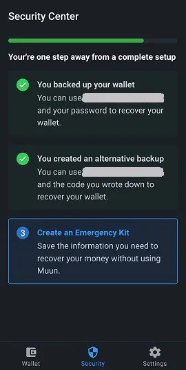
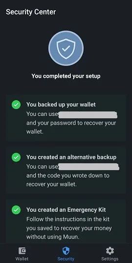
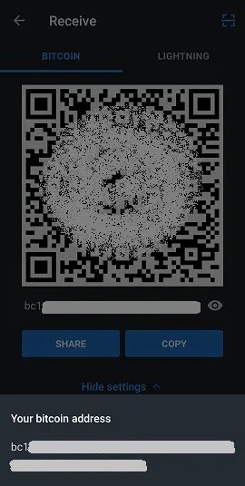
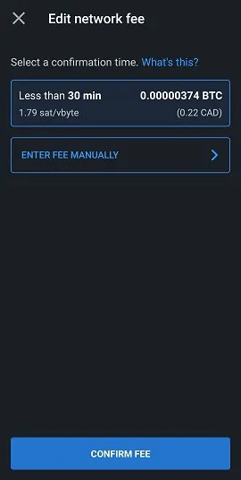
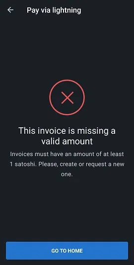
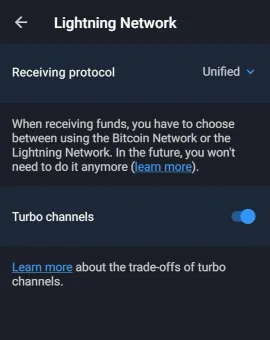

Muun (https://muun.com/) on itsehallinnollinen lompakko Bitcoinille ja Lightning-verkolle.

## video-opas

## Muun-lompakko - Kattava käyttöopas

Kattava käyttöopas (kuvakaappauksin) Muun-sovellukselle; käyttäjäystävällinen mobiili Bitcoin-lompakko, joka mahdollistaa transaktioiden tekemisen Lightning-verkossa.

### Lataa Muun ja luo lompakkosi

Ensimmäiseksi sinun tulee ladata mobiilisovellus, joka on saatavilla sekä iOS:lle että Androidille. Varmista aina, että lataat oikean version. Markkinoilla on joskus väärennettyjä kopioita. Suosittelen etsimään virallisen Muun-lompakon verkkosivuston, joka on https://muun.com/, ja käyttämään sieltä löytyvää linkkiä valitsemallesi järjestelmälle (iOS/Android), jolloin voit olla varma, että käytät virallista sovellusta.

Kun avaat sovelluksen, sinulla on mahdollisuus luoda uusi lompakko tai palauttaa olemassa oleva. Aloita luomalla uusi lompakko. Näytän myöhemmin lompakon palautuksen vaiheet. Paina "Luo uusi lompakko".

Muun-lompakko pyytää sinua sen jälkeen luomaan nelinumeroisen henkilökohtaisen tunnusnumeron (PIN). PIN-koodin avulla lisäät lompakkosi turvallisuutta esimerkiksi siinä tapauksessa, jos pahantahtoinen toimija varastaa puhelimesi ja sitä kautta bitcoinsi.

Siinä se, sovellus on luonut upouuden lompakon, josta tulee nyt kotisivu. Nyt sinun tarvitsee varmistaa olennaisen lompakon palautustiedon turvaaminen ennen kuin lähetät siihen varoja, sillä se olisi riskialtista toimintaa.

### Avainvarmuuskopio

Paina "Varmuuskopioi lompakkosi" -laatikkoa, ja sinut ohjataan "Turvallisuus" -välilehteen. Muunin varmuuskopiointiprosessi on jaettu kätevästi kolmeen vaiheeseen. Kaikkien kolmen vaiheen suorittaminen ei ole pakollista, mutta niiden yhdistelmä tarjoaa maksimaalisen varotoimen.

Ensimmäinen vaihtoehto mahdollistaa lompakkosi yhdistämisen sähköpostiosoitteeseen, lisäksi sen suojaamisen salasanalla. Tämä vaihtoehto on valinnainen ja sen voi ohittaa ilman ongelmia. Jos haluat käyttää sitä, paina "1: Varmuuskopioi lompakkosi" ja sitten "Aloita" seuraavalla näytöllä ja syötä sähköpostiosoite. Seuraava näyttö kertoo, että sinun on vahvistettava sähköposti käymällä postilaatikossasi ja klikkaamalla Muunin sähköpostissa olevaa linkkiä.

Kun sähköposti on vahvistettu, sinua pyydetään luomaan salasana. Sen jälkeen sinun on rastitettava kaksi ruutua, jotka osoittavat ymmärtäväsi, että lompakon palauttaminen tarvittaessa vaatii juuri valitsemasi sähköpostin ja salasanan käyttöä. Tämä eroaa perinteisistä ohjelmista, jotka sallivat salasanan nollaamisen sen kadotessa tai unohtuessa, joten varmista, että olet merkinnyt kaiken muistiin.

"Turvallisuus" -välilehti nyt osoittaa, että sinulla on perusvarmuuskopio. Voit nyt palata "Lompakko" -välilehteen ja käyttää sovellusta transaktioiden suorittamiseen (näitä toimintoja käsitellään myöhemmin tässä oppaassa), tietäen, että lompakko on nyt palautettavissa. Suosittelen kuitenkin käyttämään turvallisuusvaihtoehtoa #2 lisävarmuuskoodin luomiseen, jos salasana, jonka annoit vaihtoehdossa #1, on vaarantunut tai jos et halua käyttää sähköpostin palautusvaihtoehtoa.

Muunin "vaihtoehtoinen varmuuskopiointi" -vaihtoehto on samankaltainen kuin monien Bitcoin-käyttäjien tuttu monien lompakko-sovellusten käyttämä muistilause. Paina "Aloita" näyttääksesi palautuskoodisi ja kirjoita se paperille (sovellus sensuroi kuvakaappauksen koodia näyttävällä sivulla). Kun olet merkinnyt sen muistiin, vertaa sitä näytöllä näkyvään koodiin, sillä sinun on kirjoitettava se uudelleen sovellukseen vahvistaaksesi sen pätevyyden.
Muun pyytää sinua vahvistamaan ymmärryksesi asiasta, eli tarvitsevasi tämän 32-merkkisen koodin, jos menetät aiemmin asetetun salasanasi.

Lompakon varmuuskopiointi on nyt merkittävästi turvattu nykystandardien mukaisesti, jotka tunnemme. Muun-sovelluksella on kuitenkin kolmas turvavaihtoehto nimeltään "Hätäpakkaus". Hätäpakkauksen luominen mahdollistaa lompakkosi palauttamisen ilman, että sinun tarvitsee käyttää Muunia. Toisin sanoen, käyttämällä eri Bitcoin-lompakko-ohjelmistoa kuin Muun.

Kun olet painanut "Luo Hätäpakkaus", sinulle selitetään, että tämä pakkaus on PDF-dokumentin muodossa, joka sisältää tietoja ja ohjeita varojesi siirtämiseksi itsenäisesti. Pakkauksen voi tallentaa pilveen huoletta, sillä sen käyttö vaatii "Palautuskoodiasi", jota ei sisälly dokumenttiin. Pyyhkäise näyttöä päästäksesi pakkauksen luontisivulle.

Sinulla on kolme vaihtoehtoa:

- Tallenna Google-tilisi pilveen.
- Lähetä sähköpostia omalle osoitteellesi varmuuskopioidaksesi pakkauksesi ja päästäksesi käsiksi siihen.
- Manuaalinen varmuuskopiointi paikallisella sovelluksella laitteellasi.

Varmista, että pääset käsiksi pakkaukseesi, kun olet lähettänyt sen valitsemaasi varmuuskopiointikohteeseen, sillä Muun pyytää sinua syöttämään kuusinumeroisen koodin, joka löytyy pakkauksesta, vahvistustarkoituksessa.

Kun tämä viimeinen vaihe on suoritettu, lompakkosi turvallisuus- ja palautuskonfiguraatio on nyt valmis. Tutkimme nyt eri tapoja palauttaa lompakkosi käyttäen juuri luotuja varmuuskopioita.
Lompakon Palautus

On monia tilanteita, joissa käyttäjä saattaa menettää väliaikaisesti pääsyn lompakkoonsa ja varoihinsa; laitteen katoaminen, asennuksen poistaminen/puuttuva sovellus, unohtunut henkilökohtainen tunnusluku, lompakon katkeaminen yms. On siis välttämätöntä tietää, miten tämä pääsy voidaan palauttaa. Kun palautat Muun-sovelluksen kautta, paina avausnäytöllä vaihtoehtoa "Minulla On Jo Lompakko".

### Palautus sähköpostiosoitteen avulla

Jos käytit Muunin varmuuskopiointivaihtoehtoa #1, syötä tuolloin valittu sähköpostiosoite. Koska tämä vaihtoehto on vapaaehtoinen, voit myös valita jatkamisen palautuskoodin avulla, joka on Muunin tarjoama vaihtoehto #2. Käydään ensin läpi sähköpostivaihtoehto.

Kun olet syöttänyt sähköpostiosoitteesi, Muun ilmoittaa sinulle, että sähköposti on lähetetty sinulle ja että sinun on päästävä siihen käsiksi lompakon palauttamiseksi. Tarkista postilaatikkosi (mukaan lukien roskapostiosio) ja käytä Muunin sähköpostissa olevaa linkkiä. Sinut ohjataan sovellukseen, jossa näyttö pyytää sinua nyt syöttämään salasanan, joka on liitetty rekisteröityyn sähköpostiosoitteeseen.

Viimeinen vaihe on henkilökohtaisen tunnusluvun luominen, ja sen jälkeen olet taas tutulla alueella lompakon kotisivulla, joka näyttää siihen liittyvän saldon.

### "Palautuskoodin" käyttö
Kun palautat pääsyn olemassa olevaan lompakkoon, voit valita käyttäväsi aiemmin merkitsemääsi palautuskoodia ("Recovery Code", kuten Muun on nimennyt), jos valitsit varmuuskopiovaihtoehdon #2.
Tämä prosessi on samankaltainen kuin edellisessä osiossa kuvattu; palautus sähköpostitse. Valitse vain "Recover With Recovery Code" -vaihtoehto ja syötä se näytöllä näkyviin kenttiin. Jos lompakkosi on varmuuskopioitu myös sähköpostilla palautuskoodin lisäksi, Muun pyytää sinua tarkistamaan postilaatikkosi hyväksyäksesi palautusprosessin, jonka voit saattaa loppuun palattuasi sovellukseen napsautettuasi tarjotussa linkissä. Jälleen kerran, sinun on luotava henkilökohtainen tunnusnumero. Siinä se, pääset taas käsiksi lompakkoosi.

### Palautus käyttäen Hätäpakkausta

Lompakon palauttamiseksi ilman Muun Wallet -sovelluksen käyttöä tarvitset hätäpakkauksesi, joka on Muunin tarjoama kolmas palautusvaihtoehto. Tämä vaihtoehto mahdollistaa varojen lähettämisen Muun-lompakostasi mihin tahansa toiseen Bitcoin-osoitteeseen. Varmista siis, että sinulla on vaihtoehtoinen lompakko, joka voi luoda osoitteen, johon aiot lähettää varat.

Pääse käsiksi PDF-dokumenttiin, jonka tallensit luodessasi pakkauksen. Tämä asiakirja sisältää ohjeet lompakon palauttamiseen. Huomaa, että tämä toiminto vaatii pöytä- tai kannettavan tietokoneen käyttöä, sillä sinun on ladattava Muun-kehitystiimin luoma skripti. Linkki sisältyy sähköpostiin, mutta jaan sen tässä joka tapauksessa: https://github.com/muun/recovery

Hätäpakkaus on varustettu vahvistuskoodilla, jota olet jo käyttänyt pakkauksen luomisen vahvistamiseen, sekä kahdella avaimella. Avaimet ovat tarpeen, kun aktivoit Muunin palautusskriptin. Varmista siis, että sinulla ne ovat käsillä toimenpiteen aikana.

Tässä on ohjeiden käännös:

Tämä hätämenettely auttaa sinua palauttamaan varasi, jos et pysty käyttämään Muunia laitteellasi.

1. Etsi palautuskoodisi

Kirjoitit tämän koodin paperille ennen hätäpakkauksesi luomista. Tarvitset sitä myöhemmin.

2. Lataa palautustyökalu

Siirry sivulle https://github.com/muun/recovery ja lataa työkalu tietokoneellesi.

3. Palauta varasi

Suorita palautustyökalu ja noudata vaiheita. Työkalu siirtää varasi valitsemaasi Bitcoin-osoitteeseen.

Skriptissä sinun tarvitsee vain syöttää näytöllä pyydetyt tiedot. Skripti huolehtii varojen siirrosta puolestasi. Yllä annetulla "github"-sivulla on saatavilla animoitu video prosessista, joka näyttää tarkalleen, mitä odottaa, kun aloitat palautusskriptin.

## Transaktioiden vastaanottaminen

### Bitcoin-välilehti

Käsittelemme nyt Muun-lompakon "Vastaanota" -osion ja sen eri toimintoja. Sovelluksesi kotisivu on "Lompakko" -välilehti. Saldo näkyy keskellä, ja voit napauttaa sitä vaihtaaksesi saldon näyttämisen ja piilottamisen välillä. Käymme läpi kaikki sovelluksen asetukset myöhemmin tässä artikkelissa. Toistaiseksi painetaan "Vastaanota" tutkiaksemme tätä toimintoa.

Tällä sivulla voit valita vastaanottavasi siirron sekä Bitcoin- että Lightning-verkoissa. Näytölle ilmestyy uusi osoite (ja siihen liittyvä QR-koodi) halutulle verkolle. Oletuksena Bitcoin-osoite näytetään, kun saavut "Vastaanota" -näyttöön. Napauttamalla QR-koodia, osoite kopioidaan laitteesi leikepöydälle. Voit helposti jakaa osoitteen suoraan muihin sovelluksiin "Jaa" -painikkeen avulla, ja voit myös kopioida osoitteen "Kopioi" -painikkeella. Painamalla silmäkuvaketta osoitteen lopussa, näytetään koko osoite, jolloin voit verrata sitä leikepöydälle kopioituun osoitteeseen jakamisen aikana.

Tämä tieto sisältää kaiken tarvittavan Bitcoin-verkossa tapahtuvien siirtojen vastaanottamiseen. Lisäksi Muun tarjoaa sinulle joitakin mukautusvaihtoehtoja "Osoiteasetukset" -valikossa. Ensinnäkin, voit lisätä summan osoitteen kuvauskohtaan. Toiseksi, voit valita käyttäväsi Segwit-osoitetta (oletusvaihtoehto) tai perinteistä osoitetta (legacy).

Painamalla "Lisää +", voit lisätä tietyn summan osoitteeseen, mikä helpottaa lähettävää osapuolta. Tämä vaihtoehto on valinnainen. Huomaa, että kun summa on syötetty, "Kopioi" -painike edellisellä sivulla lisää tiedon kopioituun osoitteeseen ("bitcoin:" etuliitteenä, minkä jälkeen summa suffiksina). Välttääksesi tämän äkillisen säädön, paina suoraan QR-koodia kopioidaksesi osoitteen. Summatiedot pysyvät siihen kiinnitettynä. Lisäksi sovellus mahdollistaa summan syöttämisen haluamassasi valuutassa, mikä yksinkertaistaa muuntamisprosessia BTC:ksi.

Osoitetyypin valinnassa, Segwit tai Legacy, suosittelen jättämään Segwitin paikalleen. Tämäntyyppinen osoite (alkaen "bc1") pienentää siirtotiedon kokoa ja siten vähentää liitännäisiä siirtomaksuja. On kuitenkin mahdollista, että sinun täytyy käyttää "Legacy"-järjestelmää (osoite alkaen "3"), jos lompakko tai ohjelmisto ei ole yhteensopiva Segwit-osoitteiden kanssa. On siis tärkeää tietää, miten erottaa nämä kaksi tyyppiä toisistaan.

## Lightning-välilehti

Vastaanottaaksesi siirtoja Lightning-verkossa, sinun täytyy napauttaa samannimistä välilehteä näytön yläosassa. Näytölle ilmestyy nyt QR-koodi, joka sisältää Lightning-osoitteen, ja voit kopioida ja jakaa sen samalla tavalla kuin aiemmin tässä oppaassa mainitut Bitcoin-osoitteet. Muistutan, että Lightning-verkko mahdollistaa lähes välittömän siirtonopeuden lisäksi siirtomaksut, jotka ovat vain murto-osa Bitcoin-ketjun maksuista.

Mukautusvaihtoehdot löytyvät "Laskuasetukset" -valikosta. Täällä voit muuttaa osoitteeseen liittyvää summaa napauttamalla "Lisää +". Lightning-verkon kanssa kokemusteni perusteella uskon, että on parempi syöttää summa luotaessa siirtoa, koska useat lompakot eivät reagoi hyvin tyhjiin laskuihin. Huomaat myös, että tässä valikossa on vanhentumisajastin. Tässä sovelluksessa ajastin on asetettu 60 minuutille, jonka jälkeen osoite on mitätön. Huomaa, että Muun luo uuden Lightning-osoitteen joka kerta, kun teet muutoksen summaan tai kun poistut ja palaat sivulle.

## LNURL-toiminnon käyttö
Muun-lompakko tarjoaa mahdollisuuden käyttää LNURL:ää transaktioiden vastaanottamiseen. Tämä toiminto, joka aktivoidaan napauttamalla sivun oikeassa yläkulmassa sijaitsevaa neliön muotoista skannauskuvaketta, tarjoaa useita etuja, mukaan lukien tarpeen välttää laskun jakamista transaktion vastaanottamiseksi. Sen sijaan sinun tarvitsee skannata QR-koodi vastaanottaaksesi maksutiedot, jotka voit sen jälkeen vahvistaa vahvistaaksesi transaktioprosessin.

Muun näyttää aluksi selittävän sivun (katso yllä oleva kuvakaappaus) ja pyytää sitten sinua ottamaan käyttöön laitteesi kamerasyötön, mikä on tarpeellinen askel sovelluksen käyttämiseksi. Huomaa, että LNURL-osoitteita ei tällä hetkellä tueta kaikissa Lightning-lompakoissa. Ne, jotka tukevat sitä, tarjoavat yleensä vain mahdollisuuden käyttää LNURL:ää transaktioiden vastaanottamiseen, ei niiden lähettämiseen.

## Transaktioiden lähettäminen

### Bitcoin-verkon kautta

Nyt kun olemme nähneet, miten bitcoineja vastaanotetaan Muunin avulla, tutkitaan, miten niitä lähetetään. Takaisin kotisivulla "Lompakko"-välilehden alla sinun tulee painaa "Lähetä". Yksinkertainen sivu ilmestyy nyt, jossa sinulla on mahdollisuus kopioida Bitcoin- tai Lightning-osoite määrättyyn kenttään tai painaa QR-koodikuvaketta tämän kentän oikealla puolella aktivoidaksesi kameran ja skannataksesi osoitteen QR-koodimuodossa.

Kun saavut "Lähetä"-sivulle, jos sinulla on jo osoite kopioituna laitteellesi, Muun tunnistaa osoitteen muodon (Bitcoin tai Lightning) ja ehdottaa sen käyttämistä transaktion lähettämiseen kehyksellä viestin kautta.

Valmistellessasi Bitcoin-transaktiota, sinun on syötettävä lähetettävä summa. Varmista, että näytön yläosassa näkyvä kohdeosoite vastaa aiemmin kopioitua osoitetta. Lähetettävän summan alapuolella Muun näyttää lompakkosi saldon ja antaa sinulle mahdollisuuden käyttää kaikki varasi, erittäin hyödyllinen ominaisuus, jos haluat tyhjentää lompakkosi täysin ja välttää "pölyn" (muutama satoshi) jättämisen taakse.

Vahvistettuasi lähetettävän summan, Muun pyytää sinua seuraavalla sivulla kirjoittamaan huomautuksen. Tämä toimii lisävahvistuksena, ja voit kirjoittaa mitä haluat, olipa se sitten asiaankuuluvaa tai ei.

Transaktion yksityiskohtien lopullinen tarkistus on tarpeen ennen sen lähettämistä. Vahvista syötetty osoite ja summa, ja mukauta tarvittaessa transaktiomaksuja painamalla sinistä kynäkuvaketta "Verkkomaksu"-tekstin oikealla puolella. Bitcoin-transaktioaltaan (mempool) perusteiden ymmärtäminen on hyvä opettavainen kokemus, joka voisi säästää sinulle monia satosheja ajan mittaan!

Muunin ohjelmisto toteuttaa oletuksena algoritmin, joka laskee tarvittavat transaktiomaksut vahvistukselle 30 minuutissa tai vähemmässä. Tämä näytetään, kun yrität muokata transaktiomaksuja. "Syötä maksu manuaalisesti" -painike antaa sinulle mahdollisuuden mukauttaa tätä yksityiskohtaa itse, ominaisuus, joka voi olla erittäin hyödyllinen, jos tarvitset nopeamman vahvistuksen tai päinvastoin, jos sinulla on laaja liikkumavara.

Valitessasi syöttää transaktiomaksun määrän itse, sinut viedään uudelle sivulle, joka ilmoittaa syötettävän määrän sat/vbyte (satoshi per virtuaalinen tavu). Muun näyttää jopa arvion valitun määrän yhdistetystä vahvistusajasta sekä kustannukset BTC:ssä ja valitsemassasi fiat-valuutassa.

Palaa tapahtuman yksityiskohtien yleisnäkymäsivulle ja paina "Lähetä". Kas, tapahtumasi lähetetään Bitcoin-verkkoon! Sinut ohjataan takaisin lompakon kotisivulle, jossa näet vähennyksen saldostasi. Näytön alareunassa on nuoli, jota voit painaa tarkastellaksesi tapahtumahistoriaasi. Juuri tekemäsi tapahtuma lisätään sen alkamishetkestä lähtien.

Paina merkintää nähdäksesi tietyn tapahtuman yksityiskohdat. Tapahtumasi vahvistetaan, kun louhija lisää uuden lohkon, joka sisältää sen, ketjuun. Muun jakaa tapahtuman tunnuksen näytön alareunassa, jolloin voit tarkistaa tapahtumasi tilan lohkoketjun selaajassa.

## Lightning-verkon kautta

Käytetään nyt Bolt 11 -laskua (perinteinen/oletus Lightning-lasku) tapahtuman tekemiseen. Kopioi tai skannaa Lightning-osoite "Lähetä"-sivulla. Sinut ohjataan uudelle sivulle, joka näyttää nykyisen laskun yksityiskohdat. Tapahtuman määrät näytetään (mukaan lukien verkkomaksut), samoin kuin laskuun kirjoitettu huomautus tai kuvaus ja erääntymisajastin alareunassa. Huomaa, että Lightning-tapahtumien maksuja ei voi muuttaa. Ne määräytyvät kanava(reitti)en perusteella, jotka ne täytyy kulkea saavuttaakseen vastaanottajan.

(Tässä on varoitus, joka näkyy näytöllä käytettäessä tyhjää laskua, mikä tarkoittaa, että siinä ei ole esitäytettyä määrää. Jotkut lompakot tukevat tätä laskutyyppiä ja sallivat sinun mukauttaa määrää itse. Muun ei kuitenkaan tue tätä.)

Painamalla silmäkuvaketta näet yksityiskohdat Lightning-solmusta, jonka kanssa teet tässä tapahtumassa kauppaa. Sinulla on jopa mahdollisuus tarkastella web-selaajaa saadaksesi lisätietoja. Tämä on hyvä esimerkki teknisestä abstraktiosta, jonka Muun saavuttaa.

Kun painat "Lähetä", tapahtumasi käynnistetään ja yleensä suoritetaan sekunnin murto-osassa. Maksettu summa vähennetään saldostasi, joka näkyy sovelluksen kotisivulla. Palaa takaisin tapahtumahistoriaasi nähdäksesi maksun välittömän vahvistuksen.

Huomaa, että historiassa Lightning- ja Bitcoin-tapahtumat erottuvat eri symbolilla. Nähdäksesi Lightning-tapahtuman yksityiskohdat, napauta sitä historianäytölläsi.

## Sovelluksen Asetukset

Kotisivun kolmannella välilehdellä, "Asetukset", löydät sovelluksen asetukset. Tämä sivu on yllättävän lyhyt, erityisesti verrattuna muihin suosittuihin mobiililompakkoihin. Mielestäni tämä ei ole haitta; päinvastoin, pidän sitä yksinkertaisuuden etuna.

Yleisessä kategoriassa voit valita suosikkisi tilin yksikön ja valuutan, sekä sovelluksen ulkoasuteeman (tumma tai vaalea), joka alun perin määräytyy laitteesi järjestelmän perusteella.

Sovelluksen tilin yksiköksi voit valita joko Bitcoinin (BTC) tai Satoshin (SAT). Tiedoksesi, Satoshi on bitcoinin pienin murto-osa, joka on kahdeksas desimaalipaikka (1 SAT = 0.00000001 BTC). Lompakon nimeäminen Satosheiksi on usein suosittua, kun pääasiassa käytetään Lightning-verkkoa pienillä summilla.

Muun tarjoaa laajan valikoiman valuuttoja, mikä helpottaa sinua löytämään tarvittavan BTC-muunnoksen tapahtumiesi ja/tai henkilökohtaisten tarpeidesi kannalta.
Jos koet tarpeelliseksi vaihtaa lompakkosi palautussalasanan, voit tehdä sen asetussivulla. Varmista, että sinulla on nykyinen salasanasi tai palautuskoodisi sekä pääsy sähköpostiisi.

Syötä nykyinen salasanasi tai valitse syöttääksesi palautuskoodisi aloittaaksesi nollauksen. Muun lähettää sähköpostin aiemmin rekisteröityyn osoitteeseen.

Edistyneiden asetusten osiossa on kaksi kohtaa: Bitcoin-verkko ja Lightning-verkko. Bitcoin-verkossa meille annetaan mahdollisuus ottaa oletusarvoisesti käyttöön Taproot-vastaanotto-osoitteet (bc1p, uusin osoitetyyppi).

Lightning-verkon sisällä löydät:

- Vastaanotto-protokolla: Valitse oletusvastaanottoverkkosi, joka näkyy Vastaanota-näytöllä. Kokeellinen toiminto, Unified, on myös saatavilla. Tämä on QR-koodi, joka yhdistää sekä Bitcoin- että Lightning-osoitteet. Tällä hetkellä vain harvat Bitcoin-ohjelmistot tukevat tätä ominaisuutta.

- Turbo-kanavat: Tämä vaihtoehto mahdollistaa Turbo-kanavien toiminnon käyttöönoton tai poiskytkemisen. Oletusarvoisesti se on käytössä.

Ymmärtääksemme, mitä Turbo-kanavilla tarkoitetaan, meidän on ensin tiedettävä, että Lightning-siirrot suoritetaan kanavien kautta käyttäjältä toiselle, ja että nämä kanavat on alun perin rahoitettava transaktiolla Bitcoin-lohkoketjussa.

Turbo-kanavat mahdollistavat siirtojen aloittamisen Lightning-verkossa ennen kuin yhtään on-chain-transaktiota on vahvistettu. Tämän toiminnon poiskytkeminen tarkoittaa, että sinun on odotettava huomattavasti kauemmin tehdäksesi siirtoja Lightning-verkossa, vaihtokauppana lisääntyneestä varojesi turvallisuudesta, sillä muuten sinun on luotettava siihen, että Muun ei toimi pahantahtoisesti (hyvin julkinen kaksinkertainen kulutus) odottaessasi transaktiosi vahvistamista lohkoketjussa.

Asetussivun alaosassa on "Kirjaudu ulos" -vaihtoehto. Voit käyttää tätä toimintoa, jos haluat sovelluksen katkaisevan yhteyden tällä hetkellä tunnistettuun lompakkoon. Tämä mahdollistaa uuden lompakon luomisen tai olemassa olevan tuonnin/palauttamisen.

